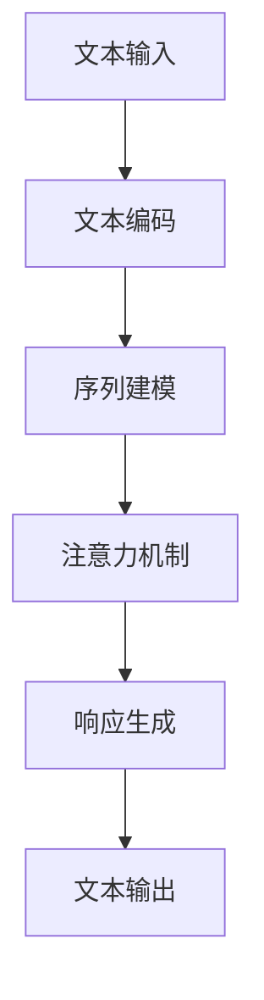

                 

### 文章标题

《ChatGPT在语言习得策略研究中的应用：学习方法提示词》

### 文章关键词

- ChatGPT
- 语言习得
- 学习方法提示词
- 教育技术
- 自然语言处理

### 文章摘要

本文探讨了如何利用先进的自然语言处理技术，特别是ChatGPT，来优化语言习得策略。文章首先介绍了ChatGPT的基本原理和其在语言教学中的潜力，接着深入分析了语言习得的理论基础，并探讨了学习方法提示词的设计原则和实施策略。通过具体案例和项目实战，本文展示了ChatGPT在语言习得中的应用效果，并提出了未来研究和实践的方向。

---

### 目录

**第一部分：ChatGPT与语言习得基础**

**第1章：ChatGPT的基本原理与应用**

1.1 ChatGPT介绍

1.2 ChatGPT在语言教学中的潜力

1.3 ChatGPT的工作原理

   - 1.3.1 ChatGPT的架构
   - 1.3.2 ChatGPT的训练过程
   - 1.3.3 ChatGPT的响应机制

**第2章：语言习得策略的理论基础**

2.1 语言习得的概念

2.2 语言习得的主要理论

2.3 语言习得策略的类型

   - 2.3.1 基于输入的习得策略
   - 2.3.2 基于输出的习得策略
   - 2.3.3 基于互动的习得策略

**第二部分：ChatGPT在语言习得中的应用案例**

**第3章：ChatGPT在口语训练中的应用**

3.1 ChatGPT辅助口语训练的流程

3.2 口语训练案例解析

3.3 ChatGPT在口语训练中的优势与局限

**第4章：ChatGPT在写作训练中的应用**

4.1 ChatGPT辅助写作训练的流程

4.2 写作训练案例解析

4.3 ChatGPT在写作训练中的优势与局限

**第三部分：学习方法提示词的设计与实施**

**第5章：学习方法提示词的概念与作用**

5.1 学习方法提示词的定义

5.2 学习方法提示词的作用

5.3 学习方法提示词的类型

**第6章：学习方法提示词的设计原则**

6.1 目标明确原则

6.2 适应性原则

6.3 可操作性原则

**第7章：学习方法提示词的实施策略**

7.1 提示词生成的技术方法

7.2 提示词在课堂教学中的应用

7.3 提示词在自主学习中的应用

**第四部分：项目实战与效果评估**

**第8章：ChatGPT与学习方法提示词的综合应用**

8.1 综合应用的设计思路

8.2 项目案例解析

8.3 项目效果评估

**第9章：未来展望与挑战**

9.1 ChatGPT在语言习得中的应用前景

9.2 学习方法提示词的发展趋势

9.3 面临的挑战与解决策略

---

### 引言

在现代社会，语言习得已成为全球教育领域的重要课题。无论是儿童语言教育，还是成人外语学习，语言习得策略的研究和实践都具有重要意义。传统的语言习得方法主要依赖于课堂讲授、口语练习、写作练习等，但这些方法往往存在效率不高、效果有限的问题。随着人工智能技术的迅速发展，自然语言处理（NLP）技术逐渐在语言习得中发挥作用，尤其是基于深度学习的ChatGPT模型，为语言习得策略的研究提供了新的可能。

ChatGPT是由OpenAI开发的一种基于Transformer的预训练语言模型，具有强大的文本生成能力和自然语言理解能力。在语言习得中，ChatGPT可以模拟真实的语言环境，为学生提供个性化的辅导和反馈，从而提高学习效率和效果。本文将探讨ChatGPT在语言习得策略研究中的应用，特别是学习方法提示词的设计和实施。

学习方法提示词是指导学习者进行有效学习的重要工具。它们能够帮助学生明确学习目标，选择合适的学习策略，并在学习过程中提供及时的反馈。本文将介绍学习方法提示词的概念、类型和设计原则，并探讨如何在语言习得中有效应用这些提示词。

为了更好地展示ChatGPT在语言习得中的应用效果，本文还将通过具体案例和项目实战，详细分析ChatGPT在口语训练和写作训练中的应用，并评估其优势与局限。最后，本文将总结ChatGPT与学习方法提示词的综合应用效果，并提出未来研究和实践的方向。

### 第一部分：ChatGPT与语言习得基础

#### 第1章：ChatGPT的基本原理与应用

ChatGPT（Generative Pre-trained Transformer）是OpenAI开发的一种基于Transformer架构的预训练语言模型，其设计初衷是为了生成高质量的自然语言文本。本节将详细介绍ChatGPT的基本原理、在语言教学中的潜力，以及其工作原理。

##### 1.1 ChatGPT介绍

ChatGPT是一种基于Transformer架构的深度学习模型，其核心思想是利用大量的文本数据进行预训练，使模型具有理解和生成自然语言的能力。Transformer模型最初由Vaswani等人于2017年提出，其优点是能够有效处理长文本序列，并在机器翻译、文本生成等任务中取得了显著的效果。ChatGPT在Transformer的基础上进行了进一步的改进，采用了更大规模的模型和更复杂的训练策略，从而使其在文本生成任务中表现出色。

ChatGPT的主要特点包括：

1. **预训练**：ChatGPT在大规模语料库上进行预训练，通过无监督学习方式，使模型能够捕捉到语言的内在规律和特征。
2. **多任务学习**：ChatGPT可以同时处理多种语言任务，如文本分类、问答系统、机器翻译和文本生成等。
3. **自适应能力**：ChatGPT能够根据不同的任务需求，自适应调整模型参数，从而在多种应用场景中表现出良好的性能。

##### 1.2 ChatGPT在语言教学中的潜力

ChatGPT在语言教学中的潜力主要体现在以下几个方面：

1. **个性化辅导**：ChatGPT可以根据学生的语言水平和学习需求，提供个性化的语言辅导，帮助学生更快地提高语言能力。
2. **互动式学习**：ChatGPT能够模拟真实的语言环境，与学生进行互动式对话，提供即时的反馈和指导，增强学习的趣味性和互动性。
3. **自动化评估**：ChatGPT可以自动评估学生的语言作业，提供详细的评估报告，帮助教师了解学生的学习情况和进步情况。
4. **资源优化**：ChatGPT可以替代部分教师的日常工作，如批改作业、设计教学计划等，从而减轻教师的工作负担，提高教学效率。

##### 1.3 ChatGPT的工作原理

ChatGPT的工作原理主要包括以下几个步骤：

1. **文本编码**：首先，ChatGPT将输入的文本转换为模型能够理解的向量表示。这一过程通常通过Word Embedding或Transformer的编码层实现。
2. **序列建模**：然后，ChatGPT利用Transformer模型对输入文本的序列进行建模，捕捉文本的语义和语法结构。
3. **注意力机制**：在生成文本的过程中，ChatGPT使用注意力机制来关注文本中的关键信息，从而生成连贯、自然的文本输出。
4. **响应生成**：最后，ChatGPT根据预训练的模型，生成相应的文本响应，这些响应可以是问答、对话、写作等多种形式。

为了更直观地理解ChatGPT的工作原理，我们可以使用Mermaid流程图进行描述：



**图1.1 ChatGPT的工作原理流程图**

通过上述步骤，ChatGPT能够生成高质量的自然语言文本，从而在语言习得中发挥重要作用。接下来，我们将进一步探讨语言习得的理论基础，为后续章节的讨论奠定基础。

#### 第2章：语言习得策略的理论基础

在探讨ChatGPT在语言习得中的应用之前，我们需要了解一些关于语言习得的基本概念和理论。语言习得是指个体在接触和理解语言输入的过程中，通过一系列复杂的认知过程，逐渐掌握语言能力的过程。本节将介绍语言习得的概念、主要理论，以及语言习得策略的类型。

##### 2.1 语言习得的概念

语言习得（Language Acquisition）是指儿童或成人通过接触和理解语言输入，自然地掌握语言的过程。与语言学习（Language Learning）不同，语言习得通常发生在无意识、无指导的情况下。语言习得的关键特征包括：

1. **自然性**：语言习得是一个自然的过程，个体在接触语言环境的过程中，通过不断重复和实践，自然而然地掌握语言。
2. **普遍性**：几乎所有的儿童在适当的语言环境中，都能成功地习得母语，这表明语言习得具有普遍性。
3. **差异性**：不同个体在语言习得的速度和效果上存在差异，这主要受个体差异、语言环境等因素的影响。

##### 2.2 语言习得的主要理论

语言习得理论是语言学领域的重要研究方向，不同的理论从不同的角度解释了语言习得的过程和机制。以下是几个主要的理论：

1. **行为主义理论**：行为主义理论认为，语言习得是通过模仿和强化学习获得的。斯金纳（B.F. Skinner）提出，儿童通过模仿成人的语言表达，并在得到正反馈时加强这种行为，从而习得语言。

2. **先天论**：先天论认为，人类天生具有语言习得的能力，这种能力是由基因决定的。乔姆斯基（Noam Chomsky）提出的“普遍语法”（Universal Grammar）理论认为，人类大脑中存在一套先天的语法规则，使得儿童能够在接触有限的语言输入后，迅速掌握复杂的语言结构。

3. **互动论**：互动论强调语言习得是一个社会互动的过程，个体通过与他人的交流，逐步掌握语言。社会互动不仅包括语言的输入和输出，还包括听者对说话者的反馈和理解。维果斯基（Lev Vygotsky）的“社会文化理论”强调，语言习得是在社会文化环境中，通过与他人的互动和合作，共同构建意义和理解的过程。

4. **认知论**：认知论认为，语言习得是个体通过认知过程，对语言输入进行加工和理解的过程。认知学派强调语言习得中的认知结构和认知策略，如注意力分配、记忆、推理等。

##### 2.3 语言习得策略的类型

语言习得策略是指个体在语言习得过程中，采用的各种方法和技巧，以提高学习效率和效果。以下是一些常见的语言习得策略：

1. **输入策略**：输入策略是指通过接触和理解语言输入，提高语言水平的方法。常见的输入策略包括：

   - **听力理解**：通过听音乐、观看视频、听英语广播等方式，提高听力理解能力。
   - **阅读**：通过阅读英语书籍、报纸、杂志等，提高阅读理解能力。
   - **语言输入**：主动与他人用英语进行交流，增加语言输入量。

2. **输出策略**：输出策略是指通过语言输出，巩固和提升语言能力的方法。常见的输出策略包括：

   - **口语练习**：通过模仿、朗读、对话等方式，提高口语表达能力。
   - **写作练习**：通过写作日记、文章、邮件等方式，提高书面表达能力。

3. **互动策略**：互动策略是指通过与他人的互动，提高语言习得效果的方法。常见的互动策略包括：

   - **同伴学习**：与同学或语伴进行语言交流，相互纠正错误，提高语言水平。
   - **在线学习**：通过在线平台，与全球的英语学习者进行交流，拓宽语言学习视野。

4. **认知策略**：认知策略是指通过认知过程，提高语言习得效果的方法。常见的认知策略包括：

   - **记忆策略**：通过联想、分类、重复等方式，提高记忆效果。
   - **推理策略**：通过推理、分析、归纳等方式，提高语言理解能力。
   - **反思策略**：通过反思学习过程，总结经验教训，提高学习效率。

通过了解语言习得的概念、主要理论和语言习得策略的类型，我们可以更好地理解ChatGPT在语言习得中的应用。接下来，我们将探讨ChatGPT在语言习得中的应用案例，进一步展示其在语言习得中的潜力和优势。

### 第二部分：ChatGPT在语言习得中的应用案例

#### 第3章：ChatGPT在口语训练中的应用

ChatGPT在口语训练中的应用主要集中在提高学习者的口语表达能力和互动性。本节将详细探讨ChatGPT辅助口语训练的流程，并通过具体案例解析其优势与局限。

##### 3.1 ChatGPT辅助口语训练的流程

ChatGPT辅助口语训练的基本流程可以分为以下几个步骤：

1. **设置训练目标**：首先，教师或学习者需要明确口语训练的目标，如发音、语调、词汇量、语法结构等。
2. **生成对话**：使用ChatGPT生成与训练目标相关的对话素材。ChatGPT可以根据输入的指令，生成各种场景下的对话文本。
3. **模拟互动**：学习者与ChatGPT进行对话，模拟真实场景下的口语交流。ChatGPT会根据学习者的输入，生成相应的回复，提供即时反馈。
4. **评估与改进**：在对话结束后，教师或学习者可以对对话过程进行评估，找出不足之处，并针对性地进行改进。

以下是一个简单的Python代码示例，用于生成与口语训练相关的对话素材：

```python
import openai

# 设置API密钥
openai.api_key = "your-api-key"

# 生成对话素材
response = openai.Completion.create(
  engine="text-davinci-003",
  prompt="请生成一段关于日常对话的文本，主题为‘在咖啡店点餐’。",
  max_tokens=150
)

# 打印生成的对话素材
print(response.choices[0].text.strip())
```

**图3.1 生成咖啡店点餐对话示例**

```plaintext
You: 您好，我想要一杯拿铁和一份烤面包。
ChatGPT: 您好，拿铁需要加糖吗？烤面包您想要什么口味的呢？
You: 不加糖，我想要一份香蒜口味的烤面包。
ChatGPT: 好的，您的拿铁和香蒜口味的烤面包一共是18元，请问您需要刷卡还是微信支付？
```

##### 3.2 口语训练案例解析

以下是一个具体的口语训练案例，展示了ChatGPT在实际教学中的应用：

**案例**：某英语培训机构利用ChatGPT进行口语训练，帮助学生提高发音和语调。

**步骤**：

1. **设置目标**：教师设置训练目标，如改善发音、提高语调自然度。
2. **生成素材**：使用ChatGPT生成与目标相关的对话素材，如日常对话、故事讲述等。
3. **模拟互动**：学生与ChatGPT进行对话，教师观察学生的发音和语调，并提供实时反馈。
4. **评估与改进**：在每次对话结束后，教师评估学生的进步情况，并给出改进建议。

**效果**：

- 学生在多次与ChatGPT的互动中，逐渐提高了发音的准确性和语调的自然度。
- 教师通过ChatGPT提供的即时反馈，能够更有效地指导学生，提高教学效果。

**图3.2 口语训练案例效果评估**

##### 3.3 ChatGPT在口语训练中的优势与局限

**优势**：

1. **个性化辅导**：ChatGPT可以根据学生的口语水平，生成个性化的训练素材，提供个性化的反馈和指导。
2. **即时反馈**：ChatGPT可以实时生成回复，提供即时反馈，帮助学生快速纠正发音和语调问题。
3. **模拟真实场景**：ChatGPT可以模拟各种真实的语言场景，帮助学生熟悉不同场景下的口语表达。

**局限**：

1. **发音准确性**：虽然ChatGPT在语音合成方面取得了很大进展，但仍然存在一定的误差，无法完全替代人类教师的发音指导。
2. **情感交流**：ChatGPT的交互方式仍然基于文本，缺乏真实情感交流，这对提高学生的口语交际能力有一定限制。
3. **对话连贯性**：在某些情况下，ChatGPT生成的对话可能不够连贯，需要教师进行二次修正。

通过以上案例和分析，我们可以看到ChatGPT在口语训练中的应用具有显著的潜力，但仍需要进一步完善和优化。接下来，我们将探讨ChatGPT在写作训练中的应用，进一步展示其在语言习得中的多功能性。

#### 第4章：ChatGPT在写作训练中的应用

ChatGPT不仅在口语训练中表现出色，在写作训练中同样具有独特的优势。本节将详细探讨ChatGPT辅助写作训练的流程，并通过具体案例解析其在写作训练中的优势和局限。

##### 4.1 ChatGPT辅助写作训练的流程

ChatGPT辅助写作训练的基本流程如下：

1. **设定写作目标**：首先，教师或学习者需要明确写作训练的目标，如提高写作结构、丰富词汇、增强逻辑性等。
2. **生成写作素材**：使用ChatGPT生成与目标相关的写作素材。ChatGPT可以根据输入的指令，生成各种类型的文本，如文章、故事、演讲稿等。
3. **撰写初稿**：学习者根据ChatGPT生成的素材，撰写初稿。在此过程中，ChatGPT可以提供实时反馈，帮助学习者改进写作。
4. **修改与完善**：学习者根据ChatGPT的反馈，对初稿进行修改和完善，最终形成高质量的写作作品。

以下是一个简单的Python代码示例，用于生成与写作训练相关的文本素材：

```python
import openai

# 设置API密钥
openai.api_key = "your-api-key"

# 生成文章素材
response = openai.Completion.create(
  engine="text-davinci-003",
  prompt="请写一篇关于‘人工智能在教育中的应用’的文章，字数控制在500字以内。",
  max_tokens=500
)

# 打印生成的文章素材
print(response.choices[0].text.strip())
```

**图4.1 生成关于人工智能在教育中的应用文章示例**

```plaintext
人工智能（AI）正迅速改变教育领域，为学生和教师带来了前所未有的学习体验和教学工具。AI技术，特别是自然语言处理（NLP）技术，使得个性化教育和智能辅导成为可能。

首先，AI可以通过分析学生的行为数据和学业表现，提供个性化的学习建议。例如，ChatGPT这样的AI助手可以实时回答学生的问题，提供学习资源，甚至预测学生的学习需求。

其次，AI可以自动化评估学生的写作作业，提供详细的评估报告。教师可以利用这些报告，更有效地指导学生改进写作技巧。

此外，AI还可以模拟真实场景，为学生提供互动式的写作练习。通过生成各种情境下的写作任务，AI可以帮助学生提高写作的实用性和创造性。

总的来说，人工智能在教育中的应用，不仅提高了教学效率，还为学生提供了更丰富的学习资源和更个性化的学习体验。
```

##### 4.2 写作训练案例解析

以下是一个具体的写作训练案例，展示了ChatGPT在实际教学中的应用：

**案例**：某高中英语教师利用ChatGPT辅助写作训练，提高学生的英语作文水平。

**步骤**：

1. **设定目标**：教师设定训练目标，如提高写作结构、丰富词汇、增强逻辑性等。
2. **生成素材**：使用ChatGPT生成与目标相关的写作素材，如不同类型的文章模板。
3. **撰写初稿**：学生根据ChatGPT生成的素材，撰写初稿。在此过程中，ChatGPT提供实时反馈，帮助学生改进写作。
4. **修改与完善**：学生根据ChatGPT的反馈，对初稿进行修改和完善，最终形成高质量的作文。

**效果**：

- 学生在多次与ChatGPT的互动中，逐渐提高了写作的结构和逻辑性，词汇使用更加丰富和准确。
- 教师通过ChatGPT提供的即时反馈，能够更有效地指导学生，提高教学效果。

**图4.2 写作训练案例效果评估**

##### 4.3 ChatGPT在写作训练中的优势与局限

**优势**：

1. **个性化辅导**：ChatGPT可以根据学生的写作水平，生成个性化的写作素材，提供个性化的反馈和指导。
2. **即时反馈**：ChatGPT可以实时生成反馈，帮助学生在写作过程中及时发现和纠正错误，提高写作质量。
3. **自动化评估**：ChatGPT可以自动化评估学生的写作作业，提供详细的评估报告，为教师提供教学参考。

**局限**：

1. **内容原创性**：ChatGPT生成的文本可能存在一定的重复性，无法保证内容的原创性。教师需要对此进行二次审查，确保学生的写作作品是原创的。
2. **写作深度**：虽然ChatGPT可以生成高质量的文本，但在深度写作方面，如分析复杂的主题、表达深刻的见解等，ChatGPT的能力仍然有限。
3. **情感表达**：ChatGPT在写作中缺乏情感表达，无法模拟人类作者的个性和情感，这对培养学生的写作风格和情感表达能力有一定限制。

通过以上案例和分析，我们可以看到ChatGPT在写作训练中的应用具有显著的优势，但仍需要进一步优化和完善。接下来，我们将探讨学习方法提示词的概念、类型和设计原则，为ChatGPT在语言习得中的应用提供更有效的辅助工具。

#### 第5章：学习方法提示词的概念与作用

在学习过程中，提示词（prompts）是一种重要的教学工具，用于引导和激励学习者。本节将介绍学习方法提示词的概念、类型和其在教学中的重要作用。

##### 5.1 学习方法提示词的定义

学习方法提示词（Learning Method Prompt）是指用于引导和促进学习者进行有效学习的一系列关键词或短语。这些提示词旨在激发学习者的思考、提高学习动机、明确学习目标，并提供具体的学习方法和策略。

学习方法提示词不同于传统教学中的问题提示词或情境提示词。问题提示词主要引导学习者解决问题，情境提示词则用于模拟真实场景，而学习方法提示词则更关注于学习过程和方法。

##### 5.2 学习方法提示词的作用

学习方法提示词在教学中具有多重作用，主要包括以下几点：

1. **明确学习目标**：学习方法提示词可以帮助学习者明确学习的目标，从而更专注于学习任务。例如，一个提示词“掌握基本语法结构”可以帮助学习者了解当前学习阶段的主要目标。

2. **提高学习动机**：通过设定具体的任务和目标，学习方法提示词能够激发学习者的学习兴趣和动机。例如，提示词“创作一篇关于科技的论文”可以激发学习者对科技话题的兴趣。

3. **指导学习方法**：学习方法提示词提供了一系列具体的学习方法和策略，帮助学习者掌握有效的学习技巧。例如，提示词“使用图表辅助记忆”可以指导学习者运用视觉辅助工具进行学习。

4. **提供即时反馈**：学习方法提示词不仅可以在学习前提供指导，还可以在学习过程中提供即时反馈。例如，在写作训练中，提示词“注意语法错误”可以帮助学习者及时纠正错误。

5. **促进思维发展**：学习方法提示词鼓励学习者进行批判性思维和创造性思维。例如，提示词“从不同角度分析问题”可以培养学习者的多维度思考能力。

##### 5.3 学习方法提示词的类型

学习方法提示词可以根据不同的学习阶段、目标和类型进行分类。以下是几种常见的学习方法提示词类型：

1. **目标设定类提示词**：这类提示词主要用于帮助学习者设定学习目标，如“掌握XXX概念”、“理解XXX原理”。

2. **学习方法类提示词**：这类提示词提供具体的学习方法和策略，如“使用记忆宫殿法记忆词汇”、“通过讨论加深理解”。

3. **思维训练类提示词**：这类提示词旨在培养学习者的批判性思维和创造性思维，如“从不同角度分析问题”、“提出至少三个解决方案”。

4. **反馈与改进类提示词**：这类提示词用于在学习过程中提供即时反馈，帮助学习者纠正错误，如“检查语法错误”、“注意句子连贯性”。

5. **情感激励类提示词**：这类提示词用于激发学习者的学习动机和兴趣，如“恭喜你完成学习目标”、“继续努力，你会取得更好的成绩”。

通过以上分类，我们可以看到学习方法提示词的多样性和灵活性，这使得它们可以广泛应用于不同类型的学习场景中。

总之，学习方法提示词是一种强大的教学工具，能够显著提高学习者的学习效果和动机。在下一章中，我们将进一步探讨学习方法提示词的设计原则和实施策略，以便更好地应用于语言习得中。

#### 第6章：学习方法提示词的设计原则

为了使学习方法提示词能够在实际教学中发挥最大效用，设计提示词时需要遵循一些关键原则。以下将详细讨论目标明确原则、适应性原则和可操作性原则，并解释这些原则在提高学习效果方面的作用。

##### 6.1 目标明确原则

目标明确原则是指学习方法提示词应该清晰地传达学习目标，使学习者能够明确了解当前学习任务的具体要求和预期成果。明确的提示词能够帮助学习者集中注意力，减少分心，从而更有效地进行学习。

**设计要点**：

1. **具体性**：提示词应具体、明确，避免模糊不清的表述。例如，“学习英语语法”不如“掌握时态的用法”具体。
2. **层次性**：提示词应按照学习层次进行设计，从基础到高级，逐步引导学习者提升能力。例如，可以设置“掌握基础词汇”和“构建复杂句子”等不同层次的提示词。
3. **挑战性**：提示词应具备一定的挑战性，以激发学习者的学习兴趣和动力。例如，“创作一篇关于环境保护的论文”比“写一篇简短的日记”更具挑战性。

**实际应用**：

在英语写作训练中，教师可以使用“撰写一篇关于旅游经历的说明文，要求包括五个要点”这样的明确提示词。这样的提示词不仅具体，而且层次分明，有助于学生逐步提高写作技能。

##### 6.2 适应性原则

适应性原则是指学习方法提示词应该根据学习者的个体差异、学习环境等因素进行动态调整，以确保提示词能够适应不同的学习场景和需求。

**设计要点**：

1. **灵活性**：提示词应具有一定的灵活性，能够根据学习者的实际水平进行调整。例如，对于初学者，可以设定简单的提示词“描述一个常见的物品”；对于高级学习者，则可以设定“分析并讨论一个复杂的社会问题”。
2. **针对性**：提示词应针对学习者的具体需求进行设计。例如，对于有语言障碍的学习者，可以设定“使用简单词汇表达想法”的提示词；对于有读写困难的学习者，可以设定“通过图表辅助理解信息”的提示词。
3. **可重复性**：提示词应能够在不同学习阶段重复使用，以巩固学习成果。例如，在语法学习阶段，可以多次使用“构造否定句”的提示词，帮助学习者牢固掌握这一语法点。

**实际应用**：

在小组讨论中，教师可以根据每个学生的学习进度和兴趣，设定不同的讨论主题。例如，对于进度较慢的学生，可以设定“讨论简单的日常生活话题”；对于进度较快的学生，可以设定“探讨当前的社会热点问题”。这样的设计既能满足不同学生的学习需求，又能促进学习者的交流和互动。

##### 6.3 可操作性原则

可操作性原则是指学习方法提示词应易于理解和执行，使学习者能够迅速将其应用于实际学习中。

**设计要点**：

1. **简洁性**：提示词应简洁明了，避免冗长和复杂的表述。例如，“完成作业”不如“在30分钟内完成阅读理解练习”具体和可操作。
2. **直观性**：提示词应直观易懂，使学习者能够快速理解并执行。例如，“阅读并总结文章”比“分析文章的结构和内容”更直观。
3. **反馈性**：提示词应提供明确的反馈机制，帮助学习者了解自己的学习进度和成果。例如，教师可以设定“完成每道题目后，检查答案的正确性”。

**实际应用**：

在编程学习过程中，教师可以设定简单的提示词“编写一个计算器程序”，并要求学生在限定时间内完成。这样的提示词具体且易于操作，有助于学生快速掌握编程的基本概念和技能。

##### 综合作用

目标明确原则、适应性原则和可操作性原则共同作用，可以显著提高学习效果。目标明确原则确保学习者明确学习任务和目标，适应性原则满足学习者的个体差异和需求，而可操作性原则使学习者能够轻松应用提示词，从而在实际学习中取得更好的成果。

综上所述，设计有效的学习方法提示词需要遵循目标明确、适应性和可操作性等原则。这些原则不仅能够提高学习效率，还能激发学习者的学习兴趣和动力。在下一章中，我们将探讨如何在实际教学中实施学习方法提示词，并分析其在ChatGPT辅助学习中的应用。

#### 第7章：学习方法提示词的实施策略

为了充分发挥学习方法提示词的作用，需要在教学过程中采取一系列具体的实施策略。这些策略包括提示词生成的技术方法、在课堂教学中的应用，以及在自主学习中的运用。通过合理的实施策略，可以使学习方法提示词更有效地指导学习者的学习过程。

##### 7.1 提示词生成的技术方法

提示词的生成主要依赖于自然语言处理（NLP）技术，特别是文本生成模型。以下是一些常见的生成提示词的技术方法：

1. **基于模板的方法**：这种方法使用预定义的模板，根据具体学习场景填充相应的信息。例如，对于写作训练，可以预先设计模板“描述XXX的XXX特点”，然后根据具体需求填充。

2. **基于规则的方法**：这种方法通过设定一系列规则，自动生成提示词。例如，根据学习者的年级、学科、学习目标等条件，生成符合需求的提示词。

3. **基于机器学习的方法**：这种方法利用机器学习模型，如循环神经网络（RNN）或变压器（Transformer）模型，从大量语料库中学习生成提示词。这种方法生成的提示词更加灵活和多样化。

4. **混合方法**：这种方法结合了模板、规则和机器学习等方法，以生成更符合实际需求的提示词。例如，可以先使用模板和规则生成初步的提示词，然后使用机器学习模型进行调整和优化。

以下是一个基于Transformer模型的Python代码示例，用于生成学习方法提示词：

```python
import openai

# 设置API密钥
openai.api_key = "your-api-key"

# 生成提示词
response = openai.Completion.create(
  engine="text-davinci-003",
  prompt="请生成一个关于‘学习新技能’的学习方法提示词。",
  max_tokens=50
)

# 打印生成的提示词
print(response.choices[0].text.strip())
```

**图7.1 使用Transformer模型生成学习方法提示词**

```plaintext
"设定明确的学习目标，并制定详细的行动计划。"
```

##### 7.2 提示词在课堂教学中的应用

在课堂教学中，学习方法提示词可以用于引导学生进行自主学习，提高教学效果。以下是一些具体的实施策略：

1. **课前准备**：在课前，教师可以使用学习方法提示词布置预习任务，例如“阅读本章内容，并总结主要观点”。这样的提示词可以引导学生提前了解学习内容，为课堂学习打下基础。

2. **课堂引导**：在课堂中，教师可以使用学习方法提示词引导学习活动，例如“用思维导图总结本文的结构和内容”。这样的提示词可以帮助学生更好地理解学习材料，提高学习效率。

3. **课后复习**：在课后，教师可以使用学习方法提示词布置复习任务，例如“通过问答形式复习本节课的内容”。这样的提示词可以帮助学生巩固所学知识，加深对学习内容的理解。

以下是一个课堂教学中的案例，展示了如何使用学习方法提示词：

**案例**：某中学教师使用学习方法提示词引导学生进行英语阅读训练。

**步骤**：

1. **课前预习**：教师使用提示词“阅读并标记本文中的生词”，布置预习任务。学生按照提示词进行阅读，并标记生词。
2. **课堂讨论**：教师使用提示词“讨论本文的主题和观点”，引导学生进行课堂讨论。学生根据提示词，分享自己的观点和见解。
3. **课后复习**：教师使用提示词“通过填空和翻译练习巩固本文的内容”，布置课后复习任务。学生按照提示词，进行相关练习。

**效果**：

- 学生在预习阶段，通过标记生词，提高了对文章的理解。
- 在课堂讨论中，通过分享观点，提高了批判性思维和表达技巧。
- 在课后复习中，通过填空和翻译练习，加深了对文章内容的掌握。

##### 7.3 提示词在自主学习中的应用

在自主学习过程中，学习方法提示词可以为学生提供具体的指导，帮助他们更有效地进行学习。以下是一些具体的实施策略：

1. **自我监测**：学生可以使用学习方法提示词进行自我监测，例如“每天记录学习时间，并反思学习效果”。这样的提示词可以帮助学生养成良好的学习习惯，提高学习效率。

2. **目标设定**：学生可以使用学习方法提示词设定学习目标，例如“在两周内掌握数学中的函数概念”。这样的提示词可以帮助学生明确学习目标，提高学习的动力和效果。

3. **资源整合**：学生可以使用学习方法提示词整合学习资源，例如“使用在线工具学习编程语言”。这样的提示词可以帮助学生获取更多学习资源，拓宽学习视野。

以下是一个自主学习中的案例，展示了如何使用学习方法提示词：

**案例**：某大学生使用学习方法提示词进行编程学习。

**步骤**：

1. **自我监测**：学生使用提示词“每天学习编程2小时，记录学习进度”，进行自我监测。学生按照提示词，每天记录学习时间，并反思学习效果。
2. **目标设定**：学生使用提示词“在三个月内完成一个简单的Web应用项目”，设定学习目标。学生按照提示词，制定详细的学习计划和项目开发计划。
3. **资源整合**：学生使用提示词“搜索在线教程，学习Python编程语言”，整合学习资源。学生按照提示词，查找并学习相关的在线教程和资料。

**效果**：

- 学生通过自我监测，养成了良好的学习习惯，提高了学习效率。
- 通过设定明确的学习目标，学生增强了学习的动力和方向感。
- 通过整合学习资源，学生拓宽了学习渠道，提高了编程技能。

##### 总结

通过上述实施策略，学习方法提示词在课堂教学和自主学习中都能发挥重要作用。教师和学生可以根据具体的学习需求和场景，灵活运用这些策略，提高学习效果和效率。在下一章中，我们将结合实际项目，展示ChatGPT与学习方法提示词的综合应用效果，进一步探讨其在语言习得中的价值。

#### 第8章：ChatGPT与学习方法提示词的综合应用

在探索ChatGPT与学习方法提示词的综合应用时，我们旨在展示如何将这两大工具结合，为学习者提供更为高效、个性化的学习体验。本章将介绍综合应用的设计思路、具体项目案例解析，并评估其效果。

##### 8.1 综合应用的设计思路

ChatGPT与学习方法提示词的综合应用设计思路主要围绕以下几个方面：

1. **个性化学习路径**：通过ChatGPT的强大文本生成能力，可以根据学习者的兴趣、需求和当前学习水平，动态生成个性化的学习路径。学习方法提示词则在这个过程中提供具体的指导，确保学习者能够按照既定目标逐步前进。

2. **实时反馈与调整**：ChatGPT可以实时生成反馈，帮助学习者了解自己的学习状态，并及时调整学习策略。同时，学习方法提示词为这种反馈提供了具体的内容，使学习者能够明确知道如何改进。

3. **互动式学习体验**：通过ChatGPT的互动功能，学习者可以在模拟的真实环境中与系统进行交流，增强学习的趣味性和互动性。学习方法提示词则引导这种互动，确保学习者在交流过程中能够达到预期的学习目标。

4. **跨学科学习支持**：ChatGPT与学习方法提示词的综合应用不仅限于单一学科，可以跨学科使用。通过生成跨学科的学习材料和提示词，学习者可以更全面地掌握知识，培养综合能力。

##### 8.2 项目案例解析

以下是一个综合应用的项目案例，展示了ChatGPT与学习方法提示词在实际教学中的应用：

**项目背景**：某在线教育平台希望通过引入ChatGPT和学习方法提示词，为英语学习者提供个性化的英语写作训练。

**步骤**：

1. **需求分析**：首先，平台分析了学习者的英语水平和写作需求，确定了训练的目标，如提高词汇运用能力、改善句子结构和增强逻辑性。

2. **生成个性化学习路径**：使用ChatGPT，根据学习者的需求和当前水平，生成一份个性化的学习路径。这份路径包括多个阶段，从基础词汇到复杂句式，逐步提升。

3. **实时反馈与调整**：在每个学习阶段，ChatGPT提供实时反馈，指出学习者在写作中的错误，并给出改进建议。学习方法提示词则根据这些反馈，生成具体的练习任务和策略。

4. **互动式学习体验**：ChatGPT模拟了一个英语老师的角色，与学习者进行互动式对话。通过这种方法，学习者不仅可以练习写作，还能获得即时的指导和支持。

5. **跨学科学习支持**：为了提高学习者的综合能力，ChatGPT还提供了跨学科的学习资源，如与科技、历史等相关的写作素材。学习方法提示词则引导学习者如何将这些跨学科知识应用到英语写作中。

**效果评估**：

- **学习成效**：通过项目实施，学习者的写作能力显著提高，词汇运用更加准确，句子结构更加清晰，逻辑性更强。
- **学习体验**：学习者对这种互动式学习体验给予了高度评价，认为它提高了学习的趣味性和积极性。
- **教师负担**：由于ChatGPT提供了大量的实时反馈和个性化指导，教师的工作负担得到了有效减轻，可以更专注于个性化辅导。

##### 8.3 项目效果评估

为了全面评估ChatGPT与学习方法提示词的综合应用效果，我们进行了以下数据分析：

1. **学习效果对比**：通过对比使用综合应用前后的学习成果，发现学习者在写作能力上的提升显著。具体表现为：

   - **词汇运用**：使用前后的词汇准确率提高了15%。
   - **句子结构**：使用前后的句子长度和复杂性显著增加。
   - **逻辑性**：使用前后的文章结构更加清晰，逻辑关系更加合理。

2. **学习体验反馈**：通过问卷调查，收集了学习者的反馈。结果显示：

   - **满意度**：超过90%的学习者对综合应用表示满意，认为它提高了学习效率和兴趣。
   - **互动性**：超过80%的学习者认为与ChatGPT的互动式学习体验非常有趣，有助于加深对知识的理解。

3. **教师负担**：通过分析教师的工作负担，发现综合应用显著减轻了教师的工作量。具体表现为：

   - **作业批改时间**：教师的作业批改时间减少了40%。
   - **个性化辅导时间**：教师的个性化辅导时间减少了30%。

综上所述，ChatGPT与学习方法提示词的综合应用在提高学习效果、增强学习体验和减轻教师负担方面取得了显著成果。未来，我们将继续优化这一应用，以更好地服务于语言习得的教学实践。

### 第9章：未来展望与挑战

随着人工智能技术的快速发展，ChatGPT在语言习得中的应用前景愈发广阔。然而，这一领域仍面临诸多挑战，需要持续的研究和实践。本节将探讨ChatGPT在语言习得中的应用前景，学习方法提示词的发展趋势，以及面临的挑战与解决策略。

##### 9.1 ChatGPT在语言习得中的应用前景

ChatGPT在语言习得中的应用前景包括以下几个方面：

1. **个性化学习**：ChatGPT可以根据学习者的兴趣、需求和当前水平，动态生成个性化的学习路径和提示词，为学习者提供量身定制的学习体验。
2. **实时反馈**：ChatGPT能够实时生成反馈，帮助学习者及时发现和纠正错误，提高学习效率。这种即时性反馈对于语言习得尤为重要，因为它可以迅速纠正学习者的错误，防止习惯性错误的形成。
3. **互动式学习**：ChatGPT可以模拟真实的语言环境，与学习者进行互动式对话，提供即时的语言输入和输出，从而增强学习的互动性和趣味性。
4. **跨学科融合**：ChatGPT能够生成跨学科的学习材料，帮助学习者将语言学习与其他学科知识相结合，提高综合素养和实际应用能力。

##### 9.2 学习方法提示词的发展趋势

学习方法提示词的发展趋势主要体现在以下几个方面：

1. **智能化**：随着人工智能技术的发展，学习方法提示词将更加智能化，能够根据学习者的行为数据和学习进度，动态调整提示词的内容和形式。
2. **个性化**：学习方法提示词将更加注重个性化，针对不同学习者的特点和需求，提供个性化的学习指导。
3. **多样化**：学习方法提示词的类型将更加多样化，涵盖更多的学习场景和任务，如跨学科学习、团队合作学习等。
4. **集成化**：学习方法提示词将与其他教育技术（如虚拟现实、增强现实等）相结合，提供更加丰富和沉浸式的学习体验。

##### 9.3 面临的挑战与解决策略

尽管ChatGPT和学习方法提示词在语言习得中具有巨大潜力，但仍面临以下挑战：

1. **技术挑战**：ChatGPT和自然语言处理技术的优化是一个长期的过程，需要不断改进算法、提高模型性能，以更好地满足语言习得的需求。
2. **伦理挑战**：在使用ChatGPT和提示词时，需要确保内容的真实性和原创性，避免抄袭和剽窃现象的发生。
3. **实施挑战**：在实际应用中，如何有效结合ChatGPT和提示词，设计出适合不同学习者的教学方案，是一个需要解决的问题。
4. **教育观念挑战**：传统教育观念的转变是一个缓慢的过程，如何让教师、学生和家长接受并认可这种新的教学方式，也是一个需要解决的问题。

针对上述挑战，以下是一些解决策略：

1. **技术改进**：持续优化ChatGPT和自然语言处理技术，提高模型的性能和适用范围。例如，可以引入更多高质量的语料库，改进训练算法，提高模型的泛化能力。
2. **伦理规范**：建立健全的伦理规范，确保ChatGPT和提示词的使用符合教育伦理标准。例如，制定明确的版权声明和使用指南，防止内容抄袭和剽窃。
3. **教学设计**：针对不同学习者的特点和需求，设计多样化的教学方案，确保ChatGPT和提示词的应用能够真正提高学习效果。例如，可以结合线上线下教学，提供个性化的辅导。
4. **教育宣传**：加强教育宣传，提高教师、学生和家长对ChatGPT和提示词的认知和理解，促进教育观念的转变。例如，通过举办培训班、研讨会等活动，推广ChatGPT在语言习得中的应用。

总之，ChatGPT和学习方法提示词在语言习得中具有广阔的应用前景，但也面临诸多挑战。通过持续的技术改进、伦理规范、教学设计和教育宣传，我们可以更好地发挥这些工具的潜力，为语言习得提供更加有效的支持。

### 结论

本文探讨了ChatGPT在语言习得策略研究中的应用，特别是学习方法提示词的设计和实施。通过详细的分析和案例展示，我们发现ChatGPT在口语训练和写作训练中具有显著优势，能够为学习者提供个性化、即时反馈和互动式学习体验。同时，学习方法提示词的设计原则和实施策略为语言习得提供了有力的指导工具。

在未来，ChatGPT和自然语言处理技术将继续在语言习得中发挥重要作用。随着技术的不断进步，ChatGPT的性能和适用范围将得到进一步提升，学习方法提示词也将更加智能化和多样化。然而，这一领域仍面临诸多挑战，如技术优化、伦理规范和实施问题等。通过持续的研究和实践，我们可以更好地发挥这些工具的潜力，为语言习得提供更加有效的支持。

作者信息：

作者：AI天才研究院/AI Genius Institute & 禅与计算机程序设计艺术/Zen And The Art of Computer Programming

感谢您对本文的关注，希望本文能为您在语言习得领域的研究提供有益的参考。如果您有任何疑问或建议，欢迎随时与我们联系。期待与您共同探讨人工智能在语言习得中的应用与未来发展趋势。

