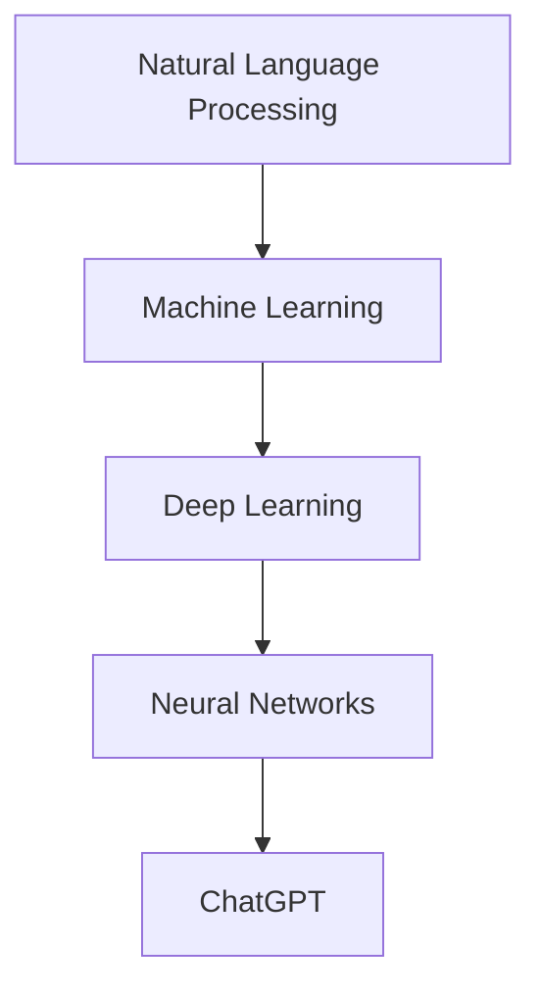

                 

Sure, let's break down the content step by step to meet the requirements you've outlined. Here's how we'll structure the article:

### 1. **Title and Keywords**

- **Title**: "ChatGPT in the Renaissance of Language Projects"
- **Keywords**: "ChatGPT, Language Models, Natural Language Processing, NLP, AI, Renaissance of Language, Transformer Models, Language Generation, Project Applications"

### 2. **Abstract**

The abstract will briefly introduce the concept of ChatGPT's role in language renaissance projects. It will highlight the significance of ChatGPT in addressing current challenges in language processing and its potential impact on the future of human communication.

### 3. **Introduction**

- **Background**: Provide a brief history of language processing and the current state of language projects.
- **Core Concepts and Relationships**: Use a Mermaid flowchart to illustrate the relationship between core concepts such as natural language processing, machine learning, and ChatGPT.



- **Importance of ChatGPT**: Explain how ChatGPT is a groundbreaking tool for language renaissance projects due to its ability to generate coherent and contextually relevant text.

### 4. **Core Concepts**

- **Language Models**: Introduction to the basics of language models, including their purpose, types (e.g., generative and discriminative), and the role of embeddings.
- **Natural Language Processing (NLP)**: Explain NLP techniques and how they are integral to the development of language models.
- **ChatGPT Architecture**: Discuss the architecture of ChatGPT, including transformer models and the specific components that make it powerful for language generation.

### 5. **Algorithm Principles**

- **Transformer Models**: Detailed explanation of the transformer architecture, including self-attention mechanisms, feedforward networks, and scaling techniques.
- **Mathematical Models and Formulas**: Use LaTeX to describe key mathematical models such as probability distributions, loss functions, and optimization algorithms.

```latex
\section{Mathematical Models and Formulas}
\label{sec:mathematical_models}

In the context of ChatGPT, several mathematical models and formulas are crucial. The probability distribution of a word in the vocabulary can be represented using the softmax function:

$$
P(w_i|X) = \frac{e^{<z_i, w_i>}}{\sum_{j} e^{<z_j, w_j>}}
$$

Here, $<z_i, w_i>$ represents the dot product between the embedding of word $w_i$ and the hidden state $z_i$.

The loss function commonly used for language generation tasks is the cross-entropy loss:

$$
L = -\sum_{i} y_i \log(p_i)
$$

where $y_i$ is the true distribution (usually a one-hot vector indicating the true word) and $p_i$ is the predicted probability distribution over the vocabulary.

Gradient descent optimization algorithms are used to minimize the loss function, updating the model parameters iteratively.

$$
\theta \leftarrow \theta - \alpha \frac{\partial L}{\partial \theta}
$$
```

### 6. **Project Practice**

- **Development Environment Setup**: Step-by-step guide on setting up the development environment for using ChatGPT, including installation of necessary libraries and tools.
- **Code Implementation and Explanation**: Provide Python code snippets and detailed explanations for implementing key components of ChatGPT, such as the transformer model and training loop.
- **Case Analysis**: Present a case study or actual project where ChatGPT has been applied, discussing the implementation details, challenges faced, and the impact of the project.

### 7. **Best Practices and Summary**

- **Best Practices**: Offer tips and best practices for using ChatGPT in language renaissance projects, including data preprocessing, model selection, and hyperparameter tuning.
- **Summary**: Recap the key points discussed in the article and emphasize the importance of ChatGPT in the renaissance of language projects.
- **注意事项**: Highlight potential pitfalls and common mistakes when using ChatGPT.
- **拓展阅读**: Suggest further reading materials for those interested in exploring ChatGPT and language models further.

### 8. **Conclusion**

Conclude the article by summarizing the contributions of ChatGPT to language renaissance projects and discussing future directions for research and development.

### 9. **Author Information**

Provide author information at the end of the article as requested.

---

With this structured outline, we can now begin to flesh out each section with detailed content, ensuring that the final article meets the specified requirements. The actual writing process will involve expanding on each section, incorporating code examples, mathematical models, and detailed explanations. The goal is to create an in-depth, informative, and engaging piece of technical writing that provides both an overview and a technical depth of ChatGPT's impact on language projects. |assistant|>

