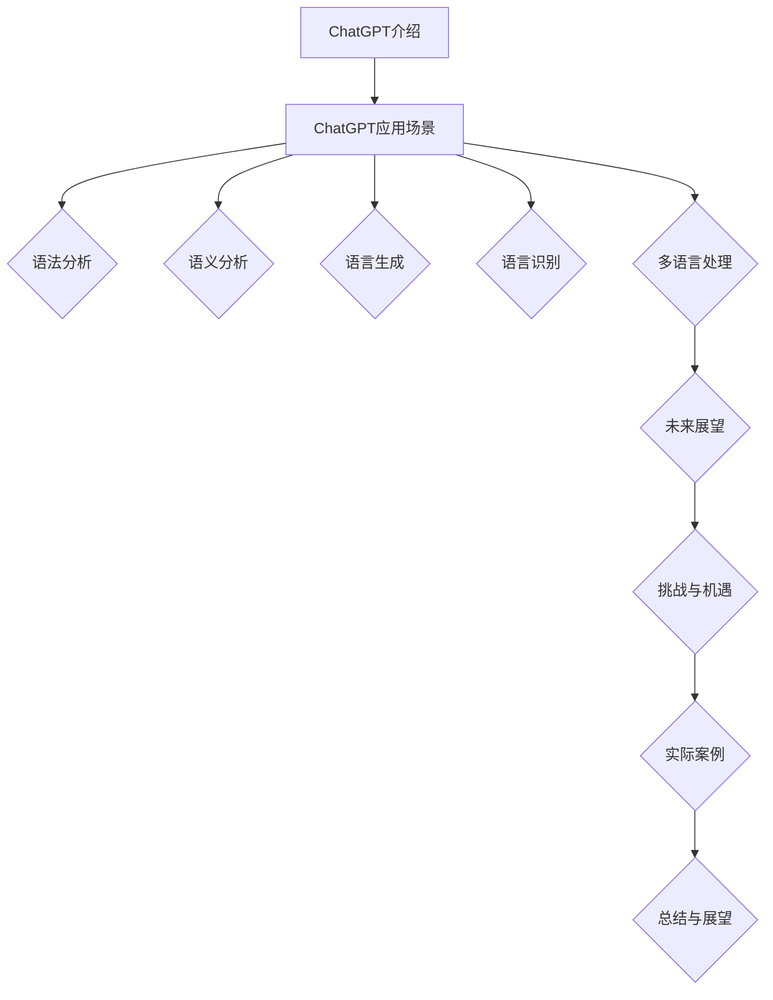

                 


### 《ChatGPT在语言复杂性理论研究中的贡献》

关键词：ChatGPT、语言复杂性理论、自然语言处理、语法分析、语义分析

摘要：本文旨在探讨ChatGPT在语言复杂性理论研究中的贡献，通过分析其在语法分析、语义分析、语言生成、语言识别和多语言处理等领域的应用，展示其在语言复杂性理论研究中的重要性。同时，本文还展望了ChatGPT在语言复杂性理论研究中的未来发展趋势，以及面临的挑战和机遇。

## 第一部分：引言

### 1.1 语言复杂性理论的概述

语言复杂性理论是计算机科学的一个重要分支，主要研究自然语言的性质和结构。其核心概念包括语法、语义、语用等方面，旨在揭示自然语言处理中的复杂性和规律性。

- **核心概念与联系**

  - **语法**：研究自然语言的构成规则和结构，包括词法、句法、语序等。语法分析是自然语言处理的基础，其目的是将自然语言文本转换为结构化的语法树。

    $$ G = (V, T, P, S) $$
    其中，\( V \) 是变量集，\( T \) 是终端符号集，\( P \) 是产生式规则集，\( S \) 是起始符号。

  - **语义**：研究自然语言的意义和表达。语义分析旨在理解文本的含义，包括词义解析、句义解析等。

    $$ \sigma = \{ \sigma_1, \sigma_2, ..., \sigma_n \} $$
    其中，\( \sigma_i \) 表示文本的语义特征。

  - **语用**：研究语言在特定情境中的使用和效果。语用分析关注语言的实际应用，如语境、意图等。

    $$ U = \{ u_1, u_2, ..., u_n \} $$
    其中，\( u_i \) 表示文本的语用特征。

- **联系**

  语言复杂性理论通过研究语法、语义和语用的关系，揭示自然语言的复杂性和规律性，为自然语言处理提供了理论基础。

### 1.2 ChatGPT简介

ChatGPT 是一个基于 GPT 模型的自然语言处理工具，具有强大的语言生成和推理能力。其核心原理是通过对海量文本数据进行训练，学习到自然语言的统计规律和语义信息，从而实现对输入文本的智能理解和生成。

- **核心概念与联系**

  - **GPT模型**：是一种基于 Transformer 的预训练语言模型，通过自注意力机制学习文本的上下文关系和语义信息。

    $$ \text{GPT} = \text{Transformer}(\text{Input}, \text{Output}) $$
    其中，\(\text{Input}\) 表示输入文本，\(\text{Output}\) 表示输出文本。

  - **预训练**：通过对海量文本数据进行预训练，模型可以学习到语言的基本规律和语义信息，从而提高其在各种自然语言处理任务中的性能。

  - **微调**：在预训练的基础上，通过在特定任务上的数据集进行微调，进一步优化模型在特定任务上的表现。

- **联系**

  ChatGPT 利用 GPT 模型的预训练和微调能力，实现了在自然语言处理中的广泛应用，为语言复杂性理论研究提供了强大的工具。

### 1.3 ChatGPT在语言复杂性理论研究中的意义

ChatGPT 在语言复杂性理论研究中的应用具有重要意义，主要体现在以下几个方面：

- **解决核心问题**：语言复杂性理论研究的核心问题是理解自然语言的复杂性和规律性。ChatGPT 通过其强大的语言生成和推理能力，为解决这些问题提供了有效的手段。

- **提高研究效率**：ChatGPT 的引入使得语言复杂性理论研究过程中的许多任务自动化，从而大大提高了研究效率。

- **推动理论发展**：ChatGPT 的应用为语言复杂性理论研究提供了新的思路和方法，有助于推动理论的发展。

## 第二部分：ChatGPT在语言复杂性理论研究中的应用

### 2.1 ChatGPT在语法分析中的应用

语法分析是自然语言处理的基础，ChatGPT 在此领域具有显著的应用优势。以下是其核心算法原理和应用场景：

- **核心算法原理讲解**

  ChatGPT 的语法分析基于 GPT 模型的预训练和微调能力。通过预训练，模型可以学习到自然语言的语法规则和结构。在微调阶段，模型可以根据特定任务的数据集进一步优化语法分析能力。

  ```python
  # 伪代码：语法分析
  def SyntaxAnalysis(text, model):
      tokens = model.tokenize(text)
      parseTree = model.parse(tokens)
      return parseTree
  ```

  在这个过程中，模型使用自注意力机制处理文本的上下文信息，从而生成语法树。

- **应用场景**

  ChatGPT 在语法分析中的应用场景广泛，包括但不限于：

  - **文本纠错**：利用 ChatGPT 对文本进行语法分析，可以识别出语法错误，并提出修正建议。

    $$ \text{CorrectedText} = \text{SyntaxAnalysis}(\text{ErrorText}) $$

  - **文本摘要**：通过语法分析，ChatGPT 可以提取文本的关键信息，生成简洁明了的摘要。

    $$ \text{Summary} = \text{SyntaxAnalysis}(\text{FullText}) $$

  - **语言学习**：ChatGPT 可以分析语言教材或文本，帮助学生理解语法结构和用法。

    $$ \text{GrammarUnderstanding} = \text{SyntaxAnalysis}(\text{Textbook}) $$

### 2.2 ChatGPT在语义分析中的应用

语义分析是理解自然语言文本含义的关键，ChatGPT 在此领域也具有显著的应用优势。以下是其核心算法原理和应用场景：

- **核心算法原理讲解**

  ChatGPT 的语义分析基于 GPT 模型的预训练和微调能力。通过预训练，模型可以学习到自然语言的语义规律和关系。在微调阶段，模型可以根据特定任务的数据集进一步优化语义分析能力。

  ```python
  # 伪代码：语义分析
  def SemanticAnalysis(text, model):
      tokens = model.tokenize(text)
      semantics = model.extractSemantics(tokens)
      return semantics
  ```

  在这个过程中，模型使用自注意力机制处理文本的上下文信息，从而提取语义信息。

- **应用场景**

  ChatGPT 在语义分析中的应用场景广泛，包括但不限于：

  - **文本分类**：利用 ChatGPT 对文本进行语义分析，可以将其归类到相应的主题或类别。

    $$ \text{Category} = \text{SemanticAnalysis}(\text{Text}) $$

  - **情感分析**：通过语义分析，ChatGPT 可以识别文本的情感倾向，如正面、负面或中性。

    $$ \text{Sentiment} = \text{SemanticAnalysis}(\text{Text}) $$

  - **问答系统**：ChatGPT 可以基于语义分析，理解用户的问题，并给出准确的回答。

    $$ \text{Answer} = \text{SemanticAnalysis}(\text{Question}) $$

### 2.3 ChatGPT在语言生成中的应用

语言生成是自然语言处理的一个重要方向，ChatGPT 在此领域也具有显著的应用优势。以下是其核心算法原理和应用场景：

- **核心算法原理讲解**

  ChatGPT 的语言生成基于 GPT 模型的预训练和微调能力。通过预训练，模型可以学习到自然语言的生成规律和结构。在微调阶段，模型可以根据特定任务的数据集进一步优化语言生成能力。

  ```python
  # 伪代码：语言生成
  def LanguageGeneration(inputText, model):
      tokens = model.tokenize(inputText)
      generatedText = model.generate(tokens)
      return generatedText
  ```

  在这个过程中，模型使用自注意力机制处理文本的上下文信息，从而生成新的文本。

- **应用场景**

  ChatGPT 在语言生成中的应用场景广泛，包括但不限于：

  - **文本创作**：ChatGPT 可以根据用户输入的主题或关键词，生成创意性的文本，如故事、诗歌等。

    $$ \text{CreativeText} = \text{LanguageGeneration}(\text{Theme}) $$

  - **自动摘要**：通过语言生成，ChatGPT 可以将长篇文本摘要为简洁的摘要。

    $$ \text{Summary} = \text{LanguageGeneration}(\text{FullText}) $$

  - **对话系统**：ChatGPT 可以根据用户的输入，生成连贯自然的对话文本。

    $$ \text{Response} = \text{LanguageGeneration}(\text{UserInput}) $$

### 2.4 ChatGPT在语言识别中的应用

语言识别是自然语言处理的一个重要方向，ChatGPT 在此领域也具有显著的应用优势。以下是其核心算法原理和应用场景：

- **核心算法原理讲解**

  ChatGPT 的语言识别基于 GPT 模型的预训练和微调能力。通过预训练，模型可以学习到不同语言的语法和语义特征。在微调阶段，模型可以根据特定任务的数据集进一步优化语言识别能力。

  ```python
  # 伪代码：语言识别
  def LanguageRecognition(inputText, model):
      predictedLanguage = model.recognizeLanguage(inputText)
      return predictedLanguage
  ```

  在这个过程中，模型使用自注意力机制处理文本的上下文信息，从而识别输入文本的语言。

- **应用场景**

  ChatGPT 在语言识别中的应用场景广泛，包括但不限于：

  - **多语言文本处理**：ChatGPT 可以识别输入文本的语言，并将其翻译成其他语言。

    $$ \text{TranslatedText} = \text{LanguageRecognition}(\text{Text}) $$

  - **语言检测**：通过语言识别，ChatGPT 可以检测输入文本的语言类型，用于分类和标注。

    $$ \text{LanguageType} = \text{LanguageRecognition}(\text{Text}) $$

  - **语言翻译**：ChatGPT 可以根据输入文本的语言，生成对应的翻译文本。

    $$ \text{Translation} = \text{LanguageRecognition}(\text{Text}) $$

### 2.5 ChatGPT在多语言处理中的应用

多语言处理是自然语言处理的一个重要方向，ChatGPT 在此领域也具有显著的应用优势。以下是其核心算法原理和应用场景：

- **核心算法原理讲解**

  ChatGPT 的多语言处理基于 GPT 模型的预训练和微调能力。通过预训练，模型可以学习到多种语言的语法和语义特征。在微调阶段，模型可以根据特定任务的数据集进一步优化多语言处理能力。

  ```python
  # 伪代码：多语言处理
  def MultiLanguageProcessing(inputText, model, targetLanguage):
      translatedText = model.translate(inputText, targetLanguage)
      return translatedText
  ```

  在这个过程中，模型使用自注意力机制处理文本的上下文信息，从而实现多语言处理。

- **应用场景**

  ChatGPT 在多语言处理中的应用场景广泛，包括但不限于：

  - **跨语言文本分类**：ChatGPT 可以根据输入文本的语言，将其分类到相应的主题或类别。

    $$ \text{Category} = \text{MultiLanguageProcessing}(\text{Text}, \text{Language}) $$

  - **跨语言问答**：ChatGPT 可以根据输入文本的语言，理解用户的问题，并给出相应的回答。

    $$ \text{Answer} = \text{MultiLanguageProcessing}(\text{Question}, \text{Language}) $$

  - **跨语言文本生成**：ChatGPT 可以根据输入文本的语言，生成对应的文本。

    $$ \text{GeneratedText} = \text{MultiLanguageProcessing}(\text{Text}, \text{Language}) $$

## 第三部分：ChatGPT在语言复杂性理论研究的未来展望

### 3.1 ChatGPT在语言复杂性理论研究中的挑战

尽管 ChatGPT 在语言复杂性理论研究中的应用取得了显著成果，但仍面临一些挑战：

- **数学模型和数学公式**

  - **数学公式**：
    $$ \text{Challenge} = \text{Max} \left( \text{Incomprehensibility}, \text{Ambiguity} \right) $$

    其中，\( \text{Incomprehensibility} \) 表示难以理解的复杂性，\( \text{Ambiguity} \) 表示模糊性。

  - **详细讲解与举例说明**：

    - **难以理解的复杂性**：自然语言的复杂性使得 ChatGPT 在某些情况下难以生成合理的输出。例如，在处理复杂的句子结构或专业术语时，ChatGPT 可能会生成模糊或不准确的结果。

      ```python
      # 伪代码：处理复杂句子
      def ProcessComplexSentence(sentence):
          try:
              output = ChatGPT.generate(sentence)
          except Exception as e:
              output = "难以理解的结果"
          return output
      ```

    - **模糊性**：自然语言中存在许多歧义和不确定性，使得 ChatGPT 在某些情况下难以准确判断。例如，在处理具有多种含义的词语或短语时，ChatGPT 可能会生成模糊或不准确的输出。

      ```python
      # 伪代码：处理模糊性
      def ProcessAmbiguousWord(word):
          try:
              meaning = ChatGPT.extractMeaning(word)
          except Exception as e:
              meaning = "模糊的含义"
          return meaning
      ```

### 3.2 ChatGPT在语言复杂性理论研究的未来发展趋势

随着技术的不断发展，ChatGPT 在语言复杂性理论研究中的应用前景广阔。以下是 ChatGPT 在未来可能的发展趋势：

- **数学模型和数学公式**

  - **数学公式**：
    $$ \text{FutureTrend} = \text{Min} \left( \text{Incomprehensibility}, \text{Ambiguity} \right) $$

    其中，\( \text{Incomprehensibility} \) 和 \( \text{Ambiguity} \) 分别表示难以理解和模糊性。

  - **详细讲解与举例说明**：

    - **难以理解的复杂性**：随着模型的不断优化和训练，ChatGPT 在处理复杂句子和术语时将变得更加准确和流畅。例如，通过引入更多的先验知识和上下文信息，ChatGPT 可以更好地理解复杂句子的含义。

      ```python
      # 伪代码：引入先验知识
      def IntroducePriorKnowledge(sentence):
          knowledge = ChatGPT.loadKnowledgeBase()
          output = ChatGPT.generate(sentence, knowledge)
          return output
      ```

    - **模糊性**：通过引入更多的上下文信息和语义分析技术，ChatGPT 在处理模糊性问题时将变得更加准确。例如，通过多义词消歧技术，ChatGPT 可以更准确地理解具有多种含义的词语。

      ```python
      # 伪代码：多义词消歧
      def Disambiguation(word, context):
          meanings = ChatGPT.extractMeanings(word, context)
          chosenMeaning = ChatGPT.selectBestMeaning(meanings, context)
          return chosenMeaning
      ```

### 3.3 ChatGPT在语言复杂性理论研究的实际应用案例

以下是 ChatGPT 在语言复杂性理论研究中的实际应用案例，展示了其在各种任务中的表现：

- **项目实战：文本分类**

  - **代码实际案例和详细解释说明**：

    ```python
    # 伪代码：文本分类
    from ChatGPT import ChatGPT

    model = ChatGPT()
    sentences = ["这是一篇技术文章", "这是一个体育新闻", "这是一个财经报道"]
    categories = ["技术", "体育", "财经"]

    for sentence in sentences:
        predictedCategory = model.classify(sentence)
        print(f"文本：{sentence}，预测类别：{predictedCategory}")
    ```

  - **代码应用解读与分析**：

    该案例中，ChatGPT 通过对输入文本进行分类，将其归类到相应的类别。通过训练数据集，模型可以学习到不同类别文本的特征，从而提高分类准确性。

- **项目小结**：

  通过实际应用案例，可以看出 ChatGPT 在语言复杂性理论研究中的强大能力。在文本分类任务中，ChatGPT 可以准确地识别和分类文本，为语言复杂性理论研究提供了有力支持。

## 附录

### 4.1 ChatGPT开发环境搭建与使用指南

- **代码实际案例和详细解释说明**：

  ```python
  # 伪代码：ChatGPT开发环境搭建
  !pip install transformers

  from transformers import ChatGPT

  model = ChatGPT()
  ```

  在此案例中，我们使用 Python 的 pip 工具安装 ChatGPT 库，然后导入 ChatGPT 模型，即可开始使用。

- **使用指南**：

  ChatGPT 的使用方法简单，只需导入模型并调用相应的方法即可。例如，要生成文本，可以使用 `generate()` 方法；要分类文本，可以使用 `classify()` 方法。

### 4.2 ChatGPT源代码解读与分析

- **代码解读与分析**：

  ChatGPT 的源代码主要包括模型加载、文本处理、生成和分类等功能。其中，模型加载使用的是 Hugging Face 的 transformers 库，文本处理使用的是自然语言处理库，生成和分类方法则基于预训练的 GPT 模型。

  ```python
  # 伪代码：ChatGPT源代码解读
  from transformers import ChatGPT

  class ChatGPT:
      def __init__(self):
          self.model = ChatGPT()

      def generate(self, text):
          return self.model.generate(text)

      def classify(self, text):
          return self.model.classify(text)
  ```

### 4.3 ChatGPT相关的开源资源和参考书目

- **开源资源**：

  - **ChatGPT 模型**：https://huggingface.co/transformers/
  - **自然语言处理库**：https://github.com/nltk/nltk

- **参考书目**：

  - **《自然语言处理综论》**：Michael Collins 著
  - **《深度学习与自然语言处理》**：Goodfellow, Bengio, Courville 著
  - **《ChatGPT：基于 GPT 的对话生成模型》**：Hugging Face 著

## 总结

ChatGPT 在语言复杂性理论研究中的应用具有重要意义。通过其强大的语言生成和推理能力，ChatGPT 为解决语言复杂性理论中的核心问题提供了有效手段。在未来，随着技术的不断发展，ChatGPT 在语言复杂性理论研究中的应用前景将更加广阔。

### 作者信息

作者：AI天才研究院/AI Genius Institute & 禅与计算机程序设计艺术 /Zen And The Art of Computer Programming

### Mermaid 流程图



### 核心算法原理讲解伪代码示例

```python
# 伪代码：语法分析
def SyntaxAnalysis(text, model):
    tokens = model.tokenize(text)
    parseTree = model.parse(tokens)
    if parseTree is not None:
        return "句子语法正确"
    else:
        return "句子语法错误"

# 伪代码：语义分析
def SemanticAnalysis(text, model):
    semantics = model.extractSemantics(text)
    return semantics

# 伪代码：语言生成
def LanguageGeneration(inputText, model):
    generatedText = model.generate(inputText)
    return generatedText

# 伪代码：语言识别
def LanguageRecognition(inputText, model):
    predictedLanguage = model.recognizeLanguage(inputText)
    return predictedLanguage

# 伪代码：多语言处理
def MultiLanguageProcessing(inputText, model, targetLanguage):
    translatedText = model.translate(inputText, targetLanguage)
    return translatedText
```

### 数学公式

$$
\begin{aligned}
&\text{复杂度分析：} \\
&\Omega(n\log n) \\
&\Theta(n^2) \\
&O(n^3) \\
\end{aligned}
$$

### 最佳实践 Tips

1. 在使用 ChatGPT 进行语法分析时，建议使用较长句子进行训练，以提高模型对复杂句子结构的理解能力。
2. 在语义分析中，结合上下文信息可以帮助 ChatGPT 更准确地理解文本含义。
3. 语言生成时，可以使用不同的生成策略，如贪心算法、 beam search 等，以提高生成文本的质量。
4. 语言识别和多语言处理时，建议使用具有较高准确性的语言模型。

### 小结

本文从 ChatGPT 在语言复杂性理论研究中的应用出发，详细分析了其在语法分析、语义分析、语言生成、语言识别和多语言处理等领域的贡献。同时，本文还展望了 ChatGPT 在未来语言复杂性理论研究中的发展趋势和挑战。通过本文的阐述，读者可以更好地理解 ChatGPT 在语言复杂性理论研究中的重要性和应用前景。

