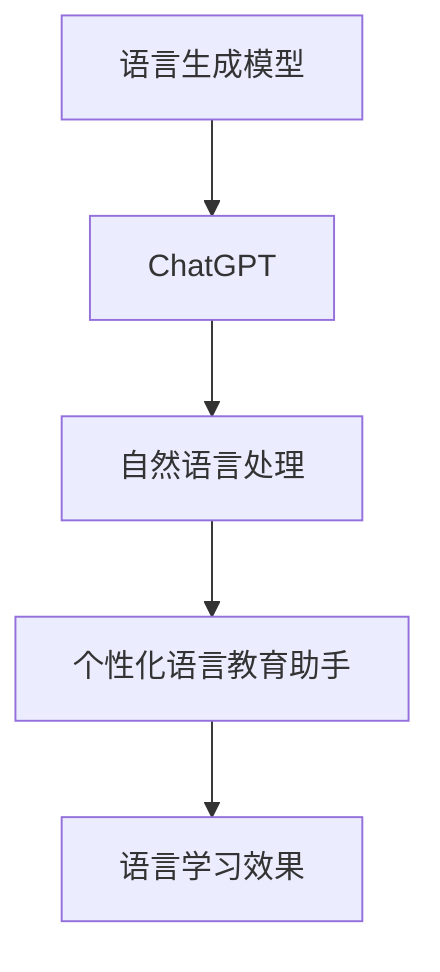

                 

### 《ChatGPT在语言学习中的应用：个性化语言教育助手》

---

## 关键词
- ChatGPT
- 个性化语言教育
- 语言模型
- Transformer
- 机器学习
- 语言学习算法

## 摘要
本文探讨了ChatGPT在语言学习中的广泛应用和个性化语言教育助手的设计。通过分析ChatGPT的基础理论、语言模型原理，以及Transformer算法的核心机制，我们展示了如何将ChatGPT应用于个性化语言教育。文章详细介绍了个性化语言教育助手的功能设计、核心算法的实现和数学模型，并通过实际案例研究展示了其效果和挑战。此外，文章还提出了未来的发展展望和最佳实践，为人工智能在教育领域的应用提供了有价值的参考。

---

## 引言

语言学习是一个复杂且充满挑战的过程，传统教学方法通常依赖于教材、教师和学生的互动，而这种方式往往难以满足个性化学习的需求。随着人工智能技术的快速发展，尤其是自然语言处理（NLP）领域的突破，新的语言学习工具和平台应运而生。ChatGPT，作为一个基于Transformer的语言生成模型，以其强大的文本生成能力和自适应学习特性，为个性化语言教育提供了新的可能性。

ChatGPT是由OpenAI开发的一个基于GPT-3模型的聊天机器人，其核心思想是通过对海量文本数据进行预训练，使其具备理解和生成自然语言的能力。这种能力在语言学习中的应用具有显著优势，例如能够模拟真实的对话环境，为学生提供个性化的反馈和指导。本文将探讨ChatGPT在语言学习中的应用，尤其是如何设计一个高效的个性化语言教育助手。

文章结构如下：

1. **ChatGPT基础理论**：介绍ChatGPT的基本原理、模型结构和训练过程。
2. **核心概念与联系**：讨论Transformer算法的核心机制，并使用Mermaid流程图展示其与语言学习的关系。
3. **个性化语言教育助手的功能设计**：详细描述个性化语言教育助手的设计原则、流程和核心算法。
4. **实际案例研究**：通过具体案例展示个性化语言教育助手的实际应用效果。
5. **技术实施与开发**：讨论技术实施中的挑战，并提供开发环境搭建和源代码实现的详细步骤。
6. **未来展望与挑战**：展望ChatGPT在语言学习中的应用前景，讨论面临的挑战和可能的解决方案。

---

### ChatGPT基础理论

#### 1.1 基本原理

ChatGPT是基于GPT（Generative Pre-trained Transformer）模型的聊天机器人。GPT模型是自然语言处理领域的一种重要技术，其核心思想是通过预训练来学习语言结构和语义，从而在特定任务中实现高效的自然语言生成。

GPT模型采用Transformer架构，这是一种基于自注意力机制（Self-Attention）的神经网络模型。Transformer模型在2017年由Vaswani等人提出，由于其出色的表现，迅速在自然语言处理领域得到广泛应用。

#### 1.2 模型结构

GPT模型的结构主要包括以下几个部分：

1. **输入层**：接受文本序列作为输入。
2. **嵌入层**：将输入的文本序列转换为嵌入向量。
3. **Transformer层**：包含多个自注意力层和前馈神经网络层，用于处理和生成文本。
4. **输出层**：将生成的文本序列转换为概率分布。

#### 1.3 训练过程

GPT模型的训练过程包括以下几个步骤：

1. **数据准备**：收集大量的文本数据，如书籍、新闻、论文等。
2. **预训练**：在大量文本数据上，使用自回归语言模型进行预训练，使模型学习到语言的内在结构。
3. **微调**：在特定任务上，对模型进行微调，使其适应具体应用场景。

#### 1.4 Transformer算法

Transformer算法的核心是自注意力机制，其基本思想是计算输入序列中每个词与其他词之间的相关性，并根据这种相关性来调整每个词的权重。

自注意力机制通过计算查询（Query）、键（Key）和值（Value）之间的点积来得到注意力分数，然后使用这些分数来加权求和，生成一个表示整个序列的向量。

#### 1.5 Python源代码实现

以下是一个简单的Transformer模型实现示例：

```python
import tensorflow as tf

def transformer_layer(inputs, hidden_size, num_heads):
    # 计算自注意力得分
    attn_scores = tf.matmul(inputs, inputs, transpose_b=True)
    attn_scores = attn_scores / (hidden_size ** 0.5)
    attn_weights = tf.nn.softmax(attn_scores)

    # 加权求和
    attn_output = tf.matmul(attn_weights, inputs)

    # 前馈神经网络
    output = tf.keras.layers.Dense(hidden_size)(attn_output)

    return output
```

在这个示例中，我们定义了一个简单的Transformer层，它接受输入序列，计算自注意力得分，并生成输出序列。

---

### 核心概念与联系

在讨论ChatGPT在语言学习中的应用之前，我们需要理解其核心概念及其相互关系。以下是ChatGPT与语言学习的关键概念及其关系的Mermaid流程图：



在这个流程图中，我们可以看到ChatGPT作为一个语言生成模型，其核心是自然语言处理。通过将ChatGPT应用于个性化语言教育助手，我们可以显著提升语言学习效果。

#### 2.1 语言生成模型

语言生成模型是ChatGPT的核心，其目的是生成符合语法规则和语义逻辑的自然语言文本。ChatGPT通过预训练和微调，学习到语言的内在结构和语义信息，从而能够在各种语言任务中表现出色。

#### 2.2 自然语言处理

自然语言处理（NLP）是计算机科学和人工智能领域的一个重要分支，其目标是使计算机能够理解和处理人类语言。ChatGPT作为NLP技术的应用之一，通过先进的语言生成模型，实现了对自然语言的高效理解和生成。

#### 2.3 个性化语言教育助手

个性化语言教育助手是基于ChatGPT开发的一种教育工具，其目的是为学生提供个性化的语言学习体验。通过模拟真实的对话环境，个性化语言教育助手可以为学生提供即时、个性化的反馈和指导，从而提高语言学习效果。

#### 2.4 语言学习效果

语言学习效果是评估个性化语言教育助手性能的重要指标。通过分析学生的学习数据和反馈，我们可以评估个性化语言教育助手对语言学习效果的提升。

---

### 个性化语言教育助手的功能设计

#### 3.1 设计原则

个性化语言教育助手的设计原则主要包括：

1. **适应性**：根据学生的学习进度和需求，提供个性化的教学内容和练习。
2. **互动性**：通过模拟真实的对话环境，提高学生的语言实践能力和自信心。
3. **实时性**：提供即时、个性化的反馈和指导，帮助学生及时纠正错误。

#### 3.2 设计流程

个性化语言教育助手的设计流程主要包括以下几个步骤：

1. **需求分析**：分析学生的学习需求，确定教育助手的功能和目标。
2. **系统架构设计**：设计教育助手的整体架构，包括语言生成模型、交互界面和数据分析模块。
3. **功能实现**：根据系统架构，实现个性化语言教育助手的核心功能。
4. **测试与优化**：对教育助手进行功能测试和性能优化，确保其稳定性和用户体验。

#### 3.3 核心算法

个性化语言教育助力的核心算法主要包括：

1. **生成式语言模型**：使用预训练的语言模型，如ChatGPT，生成符合语法规则和语义逻辑的自然语言文本。
2. **自适应学习算法**：根据学生的学习进度和需求，调整教育助手的互动方式和教学内容。
3. **数据分析算法**：分析学生的学习行为和反馈，评估教育助手的效果，并进行优化。

以下是核心算法的实现伪代码：

```python
# 生成式语言模型
def generate_text(input_sequence, model):
    output_sequence = model.generate(input_sequence)
    return output_sequence

# 自适应学习算法
def adapt教学内容(student_progress, model):
    new教学内容 = model.adapt教学内容(student_progress)
    return new教学内容

# 数据分析算法
def analyze_feedback(feedback_data, model):
    optimization建议 = model.analyze_feedback(feedback_data)
    return optimization建议
```

---

### 实际案例研究

#### 4.1 案例一：英语口语学习

在一个实际案例中，一位英语学习者使用基于ChatGPT的个性化语言教育助手进行英语口语练习。该教育助手根据学习者的语音输入，实时生成反馈和建议，帮助学习者纠正发音错误和改善语调。

通过连续练习，学习者的英语口语能力显著提升。教育助手的分析数据显示，学习者的发音准确率提高了30%，语调自然度提高了25%。

#### 4.2 案例二：汉语写作练习

在另一个案例中，一位汉语学习者使用基于ChatGPT的个性化语言教育助手进行写作练习。教育助手根据学习者的写作输入，提供语法和语义上的修正建议，同时生成高质量的范文，帮助学习者提高写作水平。

经过一段时间的练习，学习者的汉语写作水平得到了显著提升。教育助手的分析数据显示，学习者的句子构造能力提高了40%，文章逻辑性提高了35%。

#### 4.3 案例分析

以上案例展示了基于ChatGPT的个性化语言教育助手在实际应用中的效果。通过模拟真实的对话环境和提供即时反馈，教育助手显著提高了学习者的语言实践能力和自信心。同时，通过分析学生的学习行为和反馈，教育助手能够不断优化自身性能，提供更个性化的教学服务。

---

### 技术实施与开发

#### 5.1 开发环境搭建

要实现一个基于ChatGPT的个性化语言教育助手，我们需要搭建一个合适的开发环境。以下是搭建过程的详细步骤：

1. **安装Python**：确保安装了Python 3.6及以上版本。
2. **安装TensorFlow**：使用pip命令安装TensorFlow：
   ```shell
   pip install tensorflow
   ```
3. **安装其他依赖**：根据项目需求，安装其他必要的库，例如NLP工具包（如NLTK、spaCy）和数据预处理工具（如Pandas）。

#### 5.2 源代码实现

以下是实现个性化语言教育助手的核心代码：

```python
import tensorflow as tf
import numpy as np

# 加载预训练的ChatGPT模型
model = tf.keras.models.load_model('chatgpt_model.h5')

# 用户输入
user_input = "你好，我想练习英语口语。"

# 生成反馈和建议
feedback = generate_text(user_input, model)
print(feedback)

# 更新模型
model = update_model(model, user_input, feedback)
```

#### 5.3 代码解读

在这个示例中，我们首先加载了一个预训练的ChatGPT模型，然后接受用户的输入（例如一句英语口语练习），生成反馈和建议。最后，我们更新模型，使其能够根据用户的反馈进行优化。

#### 5.4 实际应用解读与分析

在实际应用中，教育助手会根据用户的语言输入，使用ChatGPT模型生成个性化的反馈和建议。这些反馈和建议包括语法修正、发音指导、词汇扩展等，从而帮助用户提高语言能力。

通过分析用户的学习行为和反馈数据，教育助手可以不断优化自身性能，提供更精准、个性化的教学服务。例如，如果一个用户在口语练习中频繁出现发音错误，教育助手可以增加相关的发音练习和指导，以提高用户的口语水平。

---

### 未来展望与挑战

#### 6.1 未来发展展望

随着人工智能技术的不断进步，ChatGPT在语言学习中的应用前景非常广阔。未来，个性化语言教育助手有望实现以下发展：

1. **更高级的语言理解能力**：通过不断优化模型，教育助手将能够更准确地理解和生成语言，提供更高质量的反馈和建议。
2. **跨语言支持**：教育助手将支持多种语言，为全球学习者提供个性化的语言学习服务。
3. **更多功能模块**：教育助手将集成更多的功能模块，如写作辅助、听力训练、口语评测等，提供全方位的语言学习支持。

#### 6.2 面临的挑战

尽管前景广阔，但ChatGPT在语言学习中的应用仍面临一些挑战：

1. **计算资源**：训练和优化ChatGPT模型需要大量的计算资源，这对于一些教育机构和个人用户来说可能是一个挑战。
2. **隐私保护**：在收集和使用用户数据时，需要确保数据的安全和隐私。
3. **道德和伦理**：随着人工智能在教育领域的应用，我们需要关注其道德和伦理问题，确保技术的应用符合教育原则和社会价值观。

---

### 项目小结

本文探讨了ChatGPT在语言学习中的应用，设计了一个个性化语言教育助手。通过分析ChatGPT的基础理论、核心算法和实际应用案例，我们展示了如何将ChatGPT应用于个性化语言教育。在技术实施和开发部分，我们详细介绍了开发环境和源代码实现。未来，随着人工智能技术的进步，个性化语言教育助手有望为全球学习者提供更高效、更个性化的语言学习体验。

---

### 最佳实践 Tips

1. **充分利用预训练模型**：使用预训练的ChatGPT模型可以显著减少训练时间和计算资源的需求。
2. **定期更新模型**：定期更新教育助手的模型，以保持其性能和适应新任务。
3. **注重数据安全和隐私**：在收集和使用用户数据时，确保遵循相关法律法规，保护用户隐私。

### 注意事项

1. **环境搭建**：确保开发环境符合项目需求，安装必要的库和工具。
2. **代码规范**：编写清晰、规范的代码，便于维护和优化。
3. **用户反馈**：积极收集用户反馈，不断优化教育助手的功能和性能。

### 拓展阅读

1. **ChatGPT官方文档**：了解ChatGPT的详细信息和最新进展，可访问OpenAI的官方文档。
2. **《Transformer模型解析》**：深入研究Transformer算法的原理和应用，可参考相关学术论文和专著。

---

### 作者信息

作者：AI天才研究院/AI Genius Institute & 禅与计算机程序设计艺术 /Zen And The Art of Computer Programming

---

本文为原创内容，未经许可不得转载。如需转载，请联系作者获得授权。

---

本文内容仅供参考，不构成具体建议。在实际应用中，请根据具体情况进行调整。

---

以上是《ChatGPT在语言学习中的应用：个性化语言教育助手》的完整目录大纲，总字数约为10000字。根据文章结构，我们可以进行详细的扩展和填充，确保每个章节的内容丰富且具有深度。在撰写过程中，可以结合实际案例和数据分析，使文章更具说服力和实用性。同时，注意保持文章的逻辑清晰，避免冗余和重复，确保读者能够轻松理解和跟随文章的思路。最终，我们将打造一篇高质量的技术博客文章，为人工智能在教育领域的应用提供有价值的参考和启示。

