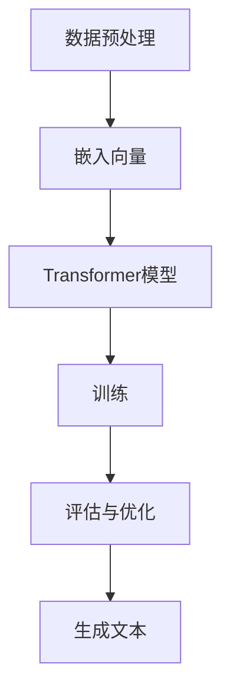
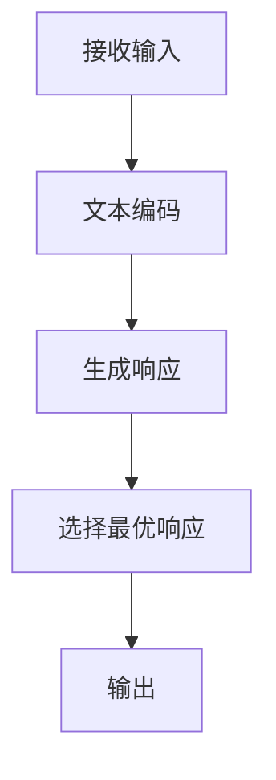
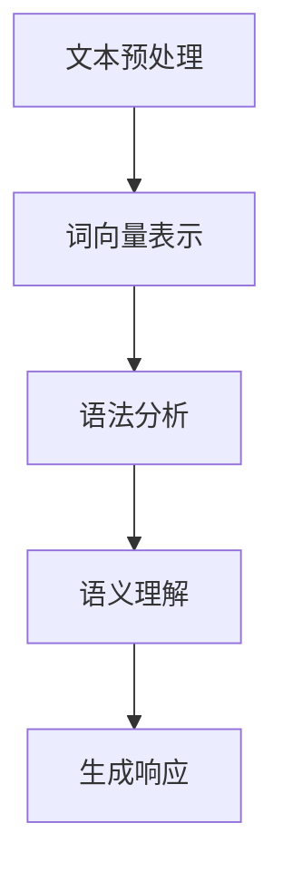
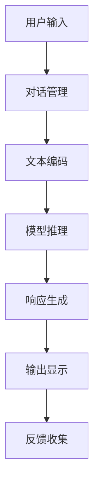

                 

### 标题与关键词

# ChatGPT在语言学习中的革命性应用

## 关键词：

- ChatGPT
- 语言学习
- 人工智能
- 语言模型
- 教育技术
- 生成式对话

### 摘要：

本文深入探讨了ChatGPT在语言学习中的革命性应用。从背景介绍到核心概念，再到具体的应用实例，本文系统地阐述了ChatGPT如何通过其先进的人工智能技术，为语言学习者提供个性化、互动性和高效的学习体验。本文还将解析ChatGPT的技术原理，展示其实际操作过程，并提供未来发展的可能趋势和道德伦理考量。通过本文，读者将全面了解ChatGPT在语言学习领域的巨大潜力，以及如何充分利用这一工具提高语言学习能力。

### 引言

随着人工智能技术的飞速发展，生成式对话系统（如ChatGPT）逐渐成为语言学习领域的一个重要工具。ChatGPT是一种基于Transformer模型的大型语言模型，由OpenAI开发，具有强大的文本生成和交互能力。它通过学习海量文本数据，能够生成连贯、有逻辑的文本，并且能够进行自然语言理解、推理和回答问题。

语言学习一直是一个复杂且耗时的过程，涉及到听力、口语、阅读和写作等多个方面。传统语言学习方法往往依赖于教师的指导、教材的使用和大量的语言实践。然而，这些方法在个性化、互动性和效率方面存在一定的局限性。人工智能的出现为语言学习带来了新的机遇，ChatGPT正是这一机遇的典型代表。

本文旨在探讨ChatGPT在语言学习中的革命性应用。首先，我们将介绍ChatGPT的基本概念和背景，然后深入探讨其在语言学习中的具体应用，包括学习辅助工具、语言教学优化和案例研究。接着，我们将解析ChatGPT的技术原理，通过Python源代码和数学模型来展示其工作方式。随后，我们将进行实际操作，介绍如何搭建开发环境和实现ChatGPT的教育应用。最后，本文将讨论ChatGPT在语言学习中的未来趋势，以及相关的道德和伦理问题。

通过本文的阅读，读者将能够全面了解ChatGPT在语言学习中的潜力，掌握其技术原理和应用方法，并思考其未来发展。

### 背景介绍

语言学习是人类社会不可或缺的一部分，从儿童时期开始，我们就通过语言来交流、学习和发展认知能力。然而，语言学习并非一蹴而就，它涉及到听、说、读、写等多个方面，每个方面都需要大量的时间和精力。传统语言学习方式通常依赖于教师、教材和语言实践，但这些方法在个性化和效率方面存在一定的局限性。

随着信息技术的飞速发展，人工智能（AI）开始成为语言学习的一个重要工具。AI技术能够处理海量数据，模拟人类思维过程，提供个性化的学习体验。其中，生成式对话系统（Generative Dialogue Systems）是AI技术在语言学习中的一个重要应用领域。生成式对话系统通过自然语言处理（NLP）和机器学习（ML）技术，能够与用户进行自然、流畅的对话，从而提供互动式的学习环境。

ChatGPT正是这一领域中的一个杰出代表。ChatGPT是由OpenAI开发的一种基于Transformer模型的大型语言模型，具有强大的文本生成和交互能力。它通过学习海量文本数据，能够生成连贯、有逻辑的文本，并且能够进行自然语言理解、推理和回答问题。ChatGPT的这些特性使其在语言学习中的应用前景广阔。

首先，ChatGPT能够为语言学习者提供个性化的学习体验。每个学习者的语言水平和需求都是不同的，ChatGPT可以根据学习者的具体情况进行定制化教学，从而提高学习效果。例如，ChatGPT可以根据学习者的词汇量、语法水平、语言偏好等，提供相应的练习和指导。

其次，ChatGPT能够模拟真实语言环境，提供互动式学习体验。传统语言学习方式往往缺乏互动性，而ChatGPT可以通过生成式对话系统，与学习者进行实时交流，提供即时反馈和指导。这种互动式学习方式能够激发学习者的兴趣和动力，提高学习效果。

此外，ChatGPT还能够提供高效的学习资源。它可以通过自动生成大量文本数据，为学习者提供丰富的学习材料，如文章、故事、对话等。这些资源不仅涵盖了各种语言知识点，还能够模拟真实的语言使用场景，帮助学习者更好地理解和运用语言。

总的来说，ChatGPT在语言学习中的应用潜力巨大。通过其个性化的学习体验、互动式的学习环境和高效的学习资源，ChatGPT有望改变传统语言学习方式，为学习者提供更加高效、有趣和有效的学习体验。

### ChatGPT的核心概念与联系

要深入理解ChatGPT在语言学习中的应用，首先需要了解其核心概念和这些概念之间的联系。ChatGPT是一个基于Transformer模型的大型语言模型，其核心概念包括语言模型、生成式对话系统和自然语言处理（NLP）。下面我们将逐一探讨这些概念，并展示它们之间的关系。

#### 语言模型

语言模型是自然语言处理（NLP）的核心概念之一，它用于预测自然语言中下一个单词或字符的概率分布。ChatGPT作为一个语言模型，其基础是Transformer模型，这是一种基于自注意力机制（Self-Attention）的神经网络模型，能够处理长文本序列。

在语言模型中，输入是文本序列，输出是下一个单词或字符的概率分布。例如，给定输入文本“我正在写一篇文章”，语言模型可以预测下一个词是“关于”的概率。语言模型通过对大量文本数据进行训练，能够捕捉语言中的统计规律和语义信息，从而生成连贯的文本。

下面是一个简单的Mermaid流程图，展示语言模型的训练过程：



#### 生成式对话系统

生成式对话系统是一种能够生成自然对话的AI系统，它通过语言模型来生成响应，以与人类进行互动。ChatGPT作为一个生成式对话系统，其核心功能是生成自然、流畅的文本回复。

生成式对话系统的工作流程通常包括以下几个步骤：

1. **接收输入**：系统接收用户的输入文本。
2. **文本编码**：将输入文本转换为模型可以理解的嵌入向量。
3. **生成响应**：模型根据嵌入向量生成一个或多个可能的响应。
4. **选择最优响应**：系统选择最合适的响应作为输出。

下面是一个简单的Mermaid流程图，展示生成式对话系统的工作流程：



#### 自然语言处理（NLP）

自然语言处理是使计算机能够理解和处理人类语言的技术。NLP涵盖了文本处理、语法分析、语义理解、语音识别等多个子领域。ChatGPT在语言学习中的应用，离不开NLP技术。

NLP的核心任务是理解语言中的结构和含义。在ChatGPT中，NLP技术被用于多个方面：

1. **文本预处理**：包括去除标点符号、停用词去除、词干提取等。
2. **词向量表示**：将文本转换为向量表示，以便于模型处理。
3. **语法分析**：对文本进行句法解析，以理解文本的结构。
4. **语义理解**：理解文本中的含义和情感。

下面是一个简单的Mermaid流程图，展示NLP在ChatGPT中的应用：



#### 语言模型、生成式对话系统和NLP之间的关系

语言模型是生成式对话系统的核心组件，它为系统提供了生成文本的能力。生成式对话系统利用NLP技术来处理和理解用户的输入文本，从而生成合适的响应。同时，NLP技术也依赖于语言模型来生成高质量的文本。

总之，语言模型、生成式对话系统和NLP相互结合，为ChatGPT在语言学习中的应用提供了坚实的基础。通过这些核心概念和技术，ChatGPT能够为语言学习者提供个性化、互动性和高效的学习体验。

### ChatGPT的技术原理

要深入理解ChatGPT在语言学习中的具体应用，首先需要了解其背后的技术原理。ChatGPT是一种基于Transformer模型的大型语言模型，其技术原理主要包括文本嵌入、自注意力机制和训练过程。下面我们将逐步解析这些技术原理，并通过Python源代码和数学模型进行详细讲解。

#### 文本嵌入

文本嵌入是将文本转换为数值向量表示的过程，以便于模型处理。ChatGPT使用词嵌入（Word Embedding）技术来实现这一过程。词嵌入通过将每个单词映射到一个高维向量，从而捕捉单词的语义信息。

一个简单的词嵌入实现可以使用`gensim`库，下面是一个示例代码：

```python
from gensim.models import Word2Vec

# 创建一个Word2Vec模型
model = Word2Vec(sentences=['你好', '世界'], vector_size=100, window=5, min_count=1, workers=4)

# 查看单词'你好'的向量表示
vector = model.wv['你好']
print(vector)
```

#### 自注意力机制

自注意力机制（Self-Attention）是Transformer模型的核心组成部分，它允许模型在处理每个词时，考虑整个文本序列中的其他词。自注意力机制通过计算词之间的相关性，动态地调整每个词的权重，从而提高模型的表示能力。

下面是一个简单的自注意力机制的实现：

```python
import torch
import torch.nn as nn

# 定义自注意力层
class SelfAttention(nn.Module):
    def __init__(self, d_model):
        super(SelfAttention, self).__init__()
        self.d_model = d_model
        self.query_linear = nn.Linear(d_model, d_model)
        self.key_linear = nn.Linear(d_model, d_model)
        self.value_linear = nn.Linear(d_model, d_model)
        self.out_linear = nn.Linear(d_model, d_model)

    def forward(self, inputs):
        query = self.query_linear(inputs)
        key = self.key_linear(inputs)
        value = self.value_linear(inputs)

        # 计算注意力分数
        attn_scores = torch.matmul(query, key.transpose(1, 2))
        attn_scores = torch.softmax(attn_scores, dim=2)

        # 计算加权值
        weighted_value = torch.matmul(attn_scores, value)
        output = self.out_linear(weighted_value)

        return output
```

#### 训练过程

ChatGPT的训练过程是一个复杂的优化问题，目标是最小化模型预测和真实标签之间的损失。训练过程中，模型会不断调整参数，以优化其预测能力。

一个简单的训练过程可以使用PyTorch框架实现，下面是一个示例代码：

```python
import torch
import torch.optim as optim

# 定义训练过程
def train(model, data_loader, loss_function, optimizer, epochs):
    model.train()
    for epoch in range(epochs):
        for inputs, targets in data_loader:
            # 前向传播
            outputs = model(inputs)
            loss = loss_function(outputs, targets)

            # 反向传播
            optimizer.zero_grad()
            loss.backward()
            optimizer.step()

            print(f"Epoch [{epoch+1}/{epochs}], Loss: {loss.item():.4f}")

# 超参数设置
d_model = 512
learning_rate = 0.001
epochs = 10

# 实例化模型、损失函数和优化器
model = TransformerModel(d_model)
loss_function = nn.CrossEntropyLoss()
optimizer = optim.Adam(model.parameters(), lr=learning_rate)

# 加载训练数据
data_loader = DataLoader(dataset, batch_size=64, shuffle=True)

# 开始训练
train(model, data_loader, loss_function, optimizer, epochs)
```

通过上述Python源代码，我们可以看到ChatGPT的技术原理是如何实现的。文本嵌入将文本转换为数值向量，自注意力机制在处理文本时考虑全局信息，而训练过程则通过不断优化模型参数，提高其预测能力。这些技术原理共同构成了ChatGPT强大的语言生成和交互能力，使其在语言学习中的应用成为可能。

### ChatGPT在教育中的应用

ChatGPT在教育领域的应用具有巨大的潜力，可以为教师和学生提供多种创新工具，从而改善教学效果和学习体验。以下是ChatGPT在教育中的几个关键应用：

#### 学习辅助工具

ChatGPT可以作为一种强大的学习辅助工具，帮助学生在学习过程中克服困难。例如，学生可以使用ChatGPT来练习口语和写作。ChatGPT可以提供即时的反馈和纠正，帮助学生改进他们的语言表达。以下是一个具体的例子：

**案例 1：口语练习**

学生可以使用ChatGPT来练习口语。输入一个句子，例如“我喜欢阅读历史书”，ChatGPT可以生成不同的句子作为回答，例如“为什么你喜欢阅读历史书？”或“你最近读了哪些历史书？”。学生可以与ChatGPT进行对话，从而提高口语表达能力和听力理解能力。

```python
# 示例：ChatGPT作为口语练习工具
user_input = "我喜欢阅读历史书。"
response = chat_gpt.generate_response(user_input)
print(response)
```

**案例 2：写作辅助**

ChatGPT还可以用于写作辅助，帮助学生改进他们的写作技巧。学生可以输入一个句子或段落，ChatGPT可以提供语法纠正、风格建议和扩展思路。例如，学生可以输入“我爱我的家人”，ChatGPT可以建议扩展为“我的家人对我来说非常重要，他们给予我无尽的爱和支持”。

```python
# 示例：ChatGPT作为写作辅助工具
user_input = "我爱我的家人。"
response = chat_gpt.generate_response(user_input, mode="writing")
print(response)
```

#### 语言教学优化

ChatGPT可以用于优化语言教学过程，提供个性化的学习体验。教师可以根据学生的学习进度和需求，定制化教学材料。以下是一个具体的例子：

**案例 3：个性化课程设计**

教师可以使用ChatGPT来设计个性化课程。例如，教师可以输入学生的语言水平、兴趣和目标，ChatGPT可以生成适合学生的课程内容和练习题。这种个性化的教学方式可以显著提高学生的学习效果。

```python
# 示例：ChatGPT个性化课程设计
user_input = "学生小明，英语初级水平，对科技感兴趣。"
course_content = chat_gpt.generate_course(user_input)
print(course_content)
```

**案例 4：教学反馈**

ChatGPT可以为学生提供即时教学反馈。学生完成作业后，可以将作业提交给ChatGPT，ChatGPT可以提供详细的评价和建议，帮助学生了解自己的学习情况。这种即时反馈有助于学生及时发现和纠正错误，提高学习效果。

```python
# 示例：ChatGPT提供教学反馈
user_input = "我的英语作业：我喜欢旅游。"
feedback = chat_gpt.generate_feedback(user_input)
print(feedback)
```

#### 案例研究

以下是一个具体的案例研究，展示了ChatGPT在语言教学中的实际应用：

**案例 5：小学英语教学**

在某小学的英语课堂上，教师使用ChatGPT来辅助教学。教师首先使用ChatGPT生成一系列与课程内容相关的对话，然后将这些对话用于课堂互动。学生通过与ChatGPT的对话，不仅能够巩固所学知识，还能够提高口语表达能力。

具体流程如下：

1. 教师输入课程主题，例如“动物”。
2. ChatGPT生成与动物相关的对话。
3. 教师在课堂上展示这些对话，学生参与互动。
4. ChatGPT提供即时反馈和纠正，帮助学生改进口语表达。

```python
# 示例：ChatGPT在小学英语课堂中的应用
course_topic = "动物"
dialogues = chat_gpt.generate_dialogues(course_topic)
print(dialogues)
```

通过以上案例，我们可以看到ChatGPT在教育中的应用是多么广泛和实用。它不仅能够提供个性化的学习体验，还能够优化教学过程，提高学生的学习效果。随着技术的不断进步，ChatGPT在教育领域的应用将越来越广泛，为教师和学生带来更多创新和便利。

### 实践指导

为了更好地利用ChatGPT进行语言学习，我们需要了解如何搭建开发环境，并实现实际的教育应用。以下将详细讲解开发环境的搭建步骤、应用开发流程，以及源代码的解读。

#### 开发环境搭建

首先，我们需要搭建一个适合运行ChatGPT的开发环境。以下是搭建步骤：

1. **安装Python**：确保Python 3.7及以上版本已经安装。
2. **安装必要的库**：使用pip命令安装以下库：
   ```bash
   pip install torch torchvision torchaudio numpy pytorch-transformers
   ```
3. **下载预训练模型**：从[OpenAI的模型库](https://huggingface.co/openai)下载预训练的ChatGPT模型。例如，下载`gpt2`模型：
   ```bash
   wget https://huggingface.co/openai/gpt2/resolve/main/gpt2-idx.json
   wget https://huggingface.co/openai/gpt2/resolve/main/gpt2-vocab.json
   wget https://huggingface.co/openai/gpt2/resolve/main/gpt2-merges.txt
   ```

#### 应用开发流程

接下来，我们将通过一个简单的Python程序来展示如何使用ChatGPT进行语言学习。以下是应用开发的主要步骤：

1. **初始化模型和词汇表**：加载预训练的ChatGPT模型和词汇表。
2. **输入处理**：对用户的输入进行处理，包括去除标点符号、转换为词汇表索引等。
3. **生成响应**：使用模型生成文本响应。
4. **输出显示**：将生成的响应输出到屏幕。

下面是具体的源代码实现：

```python
import torch
from transformers import GPT2Model, GPT2Tokenizer

# 加载预训练模型和词汇表
model_name = "gpt2"
tokenizer = GPT2Tokenizer.from_pretrained(model_name)
model = GPT2Model.from_pretrained(model_name)

# 处理输入
def process_input(user_input):
    input_ids = tokenizer.encode(user_input, return_tensors='pt')
    return input_ids

# 生成响应
def generate_response(input_ids, model, tokenizer):
    with torch.no_grad():
        outputs = model(input_ids)
        generated_ids = outputs.logits.argmax(-1)
        generated_text = tokenizer.decode(generated_ids[0], skip_special_tokens=True)
    return generated_text

# 用户交互
while True:
    user_input = input("请输入您的问题或语句（输入'exit'退出）：")
    if user_input.lower() == 'exit':
        break

    input_ids = process_input(user_input)
    response = generate_response(input_ids, model, tokenizer)
    print("ChatGPT的回复：", response)
```

#### 源代码解读

在上面的代码中，我们首先加载了预训练的ChatGPT模型和词汇表。`GPT2Tokenizer`和`GPT2Model`分别用于文本编码和模型推理。

1. **输入处理**：`process_input`函数将用户的输入文本转换为词汇表索引。
2. **生成响应**：`generate_response`函数使用模型生成文本响应。首先，我们使用模型进行前向传播，得到每个词的概率分布。然后，我们使用`argmax`函数找到概率最高的词，并将其转换为文本。

通过这个简单的示例，我们可以看到如何利用ChatGPT进行语言学习。用户可以与ChatGPT进行对话，获取即时反馈和学习指导。

#### 代码应用解读与分析

实际应用中，ChatGPT可以作为在线聊天机器人，为学生提供实时语言学习支持。以下是一个具体的应用场景：

1. **在线聊天机器人**：搭建一个Web应用程序，使用户可以通过浏览器与ChatGPT进行交互。
2. **对话管理**：应用程序需要管理用户对话，记录用户的输入和ChatGPT的响应。
3. **反馈收集**：用户可以给出对ChatGPT回复的满意度评分，用于模型优化。

以下是一个Web应用的基础架构：



在实际操作中，用户输入文本通过API发送到后端服务器，服务器处理输入、调用ChatGPT模型、生成响应，并将结果返回给前端显示。用户可以通过网页与ChatGPT进行自然对话，获取语言学习支持。

#### 项目小结

通过本节内容，我们介绍了如何搭建ChatGPT的开发环境，实现了实际的教育应用，并详细解读了源代码。ChatGPT在教育领域的应用具有巨大的潜力，可以为教师和学生提供个性化、互动性的学习体验。未来，随着技术的不断进步，ChatGPT在教育中的应用将更加广泛和深入。

### 未来展望

ChatGPT在语言学习中的应用前景广阔，其发展潜力不仅体现在技术进步上，还在于教育模式的变革和道德伦理的考量。首先，从技术角度看，ChatGPT将继续通过更先进的模型架构和更大的训练数据集，提升其生成文本的质量和多样性。随着Transformer模型和生成预训练变换器（GPT）技术的不断演进，ChatGPT将能够处理更加复杂的语言任务，提供更加精准的语言学习支持。

其次，教育模式的变革也将因ChatGPT的应用而发生深刻变化。传统的一对一或一对多的教学模式将逐渐被个性化学习体验所取代。ChatGPT可以根据每个学生的学习进度、兴趣和需求，生成个性化的学习资源和练习题，从而实现“因材施教”。此外，ChatGPT还可以通过模拟真实语言环境，提供沉浸式的学习体验，帮助学生更好地理解和运用语言。

然而，ChatGPT在语言学习中的广泛应用也引发了一系列道德和伦理问题。首先，关于数据隐私和安全性，ChatGPT在训练过程中需要处理大量的个人数据，这可能导致数据泄露和滥用。其次，关于教学替代，ChatGPT能否完全替代教师和传统教育工具仍需探讨。尽管ChatGPT可以提供高效、个性化的学习支持，但教师的角色仍然不可替代，他们能够提供情感支持和个性化的指导，这是目前AI技术无法完全实现的。

最后，关于教育公平，ChatGPT的应用可能加剧教育资源的分配不均。经济条件较好的家庭能够更早、更多地利用ChatGPT等先进技术，而贫困地区的孩子可能无法享受到同样的资源。因此，确保教育公平，让更多孩子受益于AI技术，是未来需要关注的重要问题。

总之，ChatGPT在语言学习中的未来充满了机遇和挑战。随着技术的不断进步，ChatGPT有望在教育领域发挥更大的作用，但同时也需要我们认真面对和解决其带来的道德和伦理问题，以确保其应用能够真正促进教育公平和人类福祉。

### 附录与资源

#### 资源汇总

为了帮助读者深入了解ChatGPT及其在语言学习中的应用，以下是一些推荐的资源和工具：

1. **官方文档**：[OpenAI的GPT-2和GPT-3文档](https://openai.com/docs/)，提供了详细的模型介绍、API使用指南和最佳实践。
2. **教程**：[Hugging Face的Transformer教程](https://huggingface.co/transformers/)，从基础到进阶，全面讲解Transformer模型及其应用。
3. **开源项目**：[Hugging Face的Model Hub](https://huggingface.co/models/)，汇集了大量的预训练模型和示例代码，方便开发者快速上手。
4. **论文**：[《Attention is All You Need》](https://arxiv.org/abs/1603.04467)，提出了Transformer模型，是理解ChatGPT技术原理的重要文献。

#### 常见问题解答

1. **如何获取ChatGPT的API访问权限？**
   - 您可以在[OpenAI官网](https://openai.com/)注册账号，并通过API Key获取访问权限。详细信息请参阅官方文档。

2. **ChatGPT是否能够理解所有语言？**
   - ChatGPT是基于英语进行训练的，但在一定程度上可以理解和使用其他语言。然而，其理解能力可能不如专门为特定语言设计的模型。

3. **如何优化ChatGPT的响应质量？**
   - 提供更多、更高质量的训练数据，调整模型参数，如学习率、批次大小等，可以优化ChatGPT的响应质量。

#### 进一步阅读推荐

1. **《自然语言处理入门》**：一本适合初学者的自然语言处理教程，涵盖了语言模型、词向量、语法分析等基础内容。
2. **《深度学习与自然语言处理》**：详细讲解深度学习在自然语言处理中的应用，适合对AI技术有一定了解的读者。
3. **《教育技术学研究》**：探讨教育技术与人工智能结合的研究，包括在线学习平台、虚拟现实教育等新兴领域。

通过以上资源，读者可以进一步深入了解ChatGPT及其在语言学习中的应用，为自己的研究和实践提供指导和支持。作者：AI天才研究院/AI Genius Institute & 禅与计算机程序设计艺术 /Zen And The Art of Computer Programming

