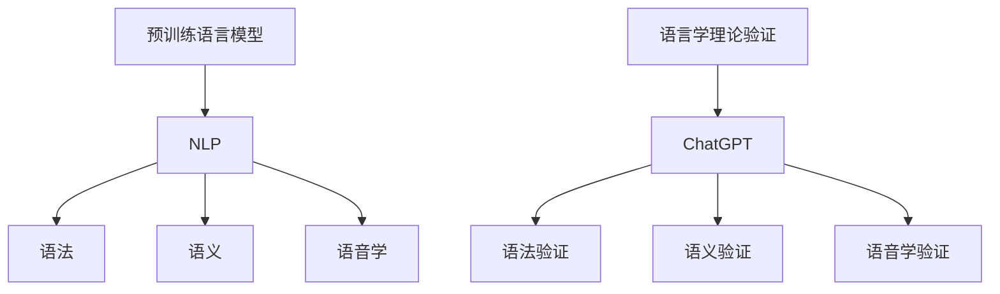

                 

### 引言和背景

#### ChatGPT的起源与发展

ChatGPT是由OpenAI开发的一种基于GPT-3模型的大型语言模型。GPT（Generative Pre-trained Transformer）系列模型是由OpenAI提出的一种自然语言处理（NLP）模型，它通过大量的预训练数据来学习语言模式和结构。GPT-3是其第三代的版本，具有非常强大的语言生成和理解能力。

ChatGPT的具体起源可以追溯到2022年，当时OpenAI发布了GPT-3模型，这是一个具有1750亿参数的模型，可以生成高质量的自然语言文本。ChatGPT则是基于GPT-3模型进行进一步优化的结果，它通过更精细的调整和大量的对话数据训练，使其能够更好地理解和生成自然对话。

#### ChatGPT的基本原理

ChatGPT的核心原理是利用Transformer架构进行预训练。Transformer是一种基于自注意力机制的深度神经网络架构，它在处理序列数据时非常有效。在预训练阶段，GPT模型通过大量的文本数据学习语言模式和结构，包括语法、语义、语音等。

预训练后，ChatGPT可以通过微调（fine-tuning）来适应特定的任务，如对话系统、文本生成、问题回答等。微调是通过在特定任务的数据集上继续训练模型，使其能够更好地执行这些任务。

#### 语言学与自然语言处理

语言学是研究语言的结构、发展、变异和功能的学科。自然语言处理（NLP）则是计算机科学的一个分支，致力于使计算机能够理解、生成和处理自然语言。

在语言学中，语法、语义和语音是三个核心概念。语法研究的是语言的规则系统，语义研究的是语言所表达的意义，语音研究的是语言的声音特征。

自然语言处理在语言学中的应用非常广泛，它不仅可以帮助研究人员更好地理解语言现象，还可以用于开发各种实用的语言技术，如机器翻译、语音识别、文本生成等。

### 总结

ChatGPT的起源和发展，以及其基本原理和语言学与自然语言处理的关系，为我们理解ChatGPT在语言学理论验证中的新范式奠定了基础。接下来，我们将深入探讨ChatGPT在语言学理论验证中的应用。

### 关键词

- ChatGPT
- GPT-3
- 自然语言处理
- 语言学
- 预训练
- 对话系统

### 摘要

本文将探讨ChatGPT在语言学理论验证中的新范式。首先，我们将介绍ChatGPT的起源、发展和基本原理，以及其在自然语言处理领域的应用。接着，我们将深入探讨ChatGPT在语言学理论验证中的应用，包括语法、语义和语音等方面。最后，我们将通过实际案例展示ChatGPT在语言学理论验证中的效果，并讨论其未来发展的方向。

### 引用

作者：AI天才研究院/AI Genius Institute & 禅与计算机程序设计艺术 /Zen And The Art of Computer Programming

----------------------------------------------------------------

# 《ChatGPT在语言学理论验证中的新范式》

## 关键词
ChatGPT, GPT-3, 自然语言处理, 语言学, 预训练, 对话系统

## 摘要

本文探讨了ChatGPT在语言学理论验证中的新范式。首先，介绍了ChatGPT的起源、发展和基本原理，以及其在自然语言处理领域的应用。接着，深入探讨了ChatGPT在语言学理论验证中的应用，包括语法、语义和语音等方面。最后，通过实际案例展示了ChatGPT在语言学理论验证中的效果，并讨论了其未来发展的方向。

## 引言和背景

### ChatGPT的起源与发展

ChatGPT是由OpenAI开发的一种基于GPT-3模型的大型语言模型。GPT（Generative Pre-trained Transformer）系列模型是由OpenAI提出的一种自然语言处理（NLP）模型，它通过大量的预训练数据来学习语言模式和结构。GPT-3是其第三代的版本，具有非常强大的语言生成和理解能力。

ChatGPT的具体起源可以追溯到2022年，当时OpenAI发布了GPT-3模型，这是一个具有1750亿参数的模型，可以生成高质量的自然语言文本。ChatGPT则是基于GPT-3模型进行进一步优化的结果，它通过更精细的调整和大量的对话数据训练，使其能够更好地理解和生成自然对话。

### ChatGPT的基本原理

ChatGPT的核心原理是利用Transformer架构进行预训练。Transformer是一种基于自注意力机制的深度神经网络架构，它在处理序列数据时非常有效。在预训练阶段，GPT模型通过大量的文本数据学习语言模式和结构，包括语法、语义、语音等。

预训练后，ChatGPT可以通过微调（fine-tuning）来适应特定的任务，如对话系统、文本生成、问题回答等。微调是通过在特定任务的数据集上继续训练模型，使其能够更好地执行这些任务。

### 语言学与自然语言处理

语言学是研究语言的结构、发展、变异和功能的学科。自然语言处理（NLP）则是计算机科学的一个分支，致力于使计算机能够理解、生成和处理自然语言。

在语言学中，语法、语义和语音是三个核心概念。语法研究的是语言的规则系统，语义研究的是语言所表达的意义，语音研究的是语言的声音特征。

自然语言处理在语言学中的应用非常广泛，它不仅可以帮助研究人员更好地理解语言现象，还可以用于开发各种实用的语言技术，如机器翻译、语音识别、文本生成等。

### 总结

ChatGPT的起源和发展，以及其基本原理和语言学与自然语言处理的关系，为我们理解ChatGPT在语言学理论验证中的新范式奠定了基础。接下来，我们将深入探讨ChatGPT在语言学理论验证中的应用。

## ChatGPT与语言学

### 语言学理论的新范式

在传统语言学研究中，语法、语义和语音的研究往往是独立进行的。然而，随着自然语言处理技术的发展，这些传统研究范式正在发生变革。ChatGPT的出现，为语言学理论验证提供了一种全新的范式。

这种新范式的核心在于将语法、语义和语音整合到一个统一的框架中。ChatGPT通过其强大的语言生成和理解能力，可以同时处理语法、语义和语音方面的任务，从而为语言学理论验证提供了一种新的方法和工具。

### ChatGPT与语法理论

语法是语言学的核心概念之一，研究的是语言的规则系统。在传统语法研究中，研究者通常会通过大量语料库数据来分析语言规则。然而，这种方法往往存在局限性，难以全面、准确地验证语法理论。

ChatGPT的出现，为语法理论的验证提供了新的可能性。通过ChatGPT，研究者可以生成大量的自然语言文本，从而对语法规则进行验证。例如，研究者可以输入一组语法规则，让ChatGPT生成符合这些规则的文本，然后对这些文本进行分析，以验证这些规则的有效性。

### ChatGPT与语义理论

语义研究的是语言所表达的意义。在传统语义研究中，研究者通常通过语料库分析和语义角色标注等方法来研究语义。然而，这些方法也存在一定的局限性，难以全面、准确地验证语义理论。

ChatGPT在语义理论验证中的应用，主要体现在其强大的语义理解能力。通过ChatGPT，研究者可以输入一组语义概念或句子，让ChatGPT生成相关的文本，然后对这些文本进行分析，以验证语义理论的准确性。

### ChatGPT与语音学

语音学研究的是语言的声音特征。在传统语音学研究中，研究者通常通过语音信号处理和语音识别等方法来研究语音。然而，这些方法也存在一定的局限性，难以全面、准确地验证语音理论。

ChatGPT在语音学验证中的应用，主要体现在其强大的语音生成能力。通过ChatGPT，研究者可以输入一组语音信号或语音描述，让ChatGPT生成相应的语音文本，然后对这些语音文本进行分析，以验证语音理论的准确性。

### 总结

ChatGPT为语言学理论验证提供了一种全新的范式，通过其强大的语言生成和理解能力，可以同时处理语法、语义和语音方面的任务。这种方法不仅提高了语言学理论验证的效率和准确性，也为语言学研究开辟了新的研究方向。

### 核心概念与联系

为了更好地理解ChatGPT在语言学理论验证中的作用，我们首先需要了解一些核心概念，并探讨这些概念之间的联系。

#### 1. 预训练语言模型

预训练语言模型（Pre-trained Language Model）是一种深度学习模型，它通过在大规模语料库上进行预训练来学习语言的普遍特征。预训练后的模型可以捕捉到语言中的模式、语法结构、词汇关系等。

#### 2. 自然语言处理（NLP）

自然语言处理（Natural Language Processing，NLP）是计算机科学和语言学交叉的领域，致力于使计算机能够理解、生成和处理自然语言。NLP包括文本分析、语音识别、机器翻译、情感分析等多个子领域。

#### 3. 语言学的核心概念

语言学的核心概念包括语法、语义和语音。语法研究的是语言的规则系统，语义研究的是语言所表达的意义，语音研究的是语言的声音特征。

#### 4. ChatGPT与语言学理论验证

ChatGPT通过其预训练语言模型，能够理解并生成自然语言文本。这使得它成为语言学理论验证的有力工具。例如，ChatGPT可以用于验证语法规则、语义理论和语音学理论。

#### 概念实体之间的关系架构 Mermaid 流程图

下面是一个简化的Mermaid流程图，展示了这些概念实体之间的关系：



在这个流程图中，预训练语言模型（A）作为核心，通过NLP（B）与语法（C）、语义（D）和语音学（E）建立联系。ChatGPT（G）作为语言学理论验证（F）的工具，可以分别用于语法验证（H）、语义验证（I）和语音学验证（J）。

### ChatGPT与语法理论

语法理论是语言学中的一个重要分支，研究的是语言的规则系统。语法理论包括句法、词法、形态学等多个方面，它们共同构成了语言的语法结构。

ChatGPT在语法理论验证中的应用，主要体现在其强大的文本生成和理解能力。通过ChatGPT，研究者可以生成大量的自然语言文本，然后对这些文本进行分析，以验证语法理论的准确性。

#### 验证方法

1. **规则生成**：研究者可以首先定义一组语法规则，例如主谓一致、时态变化等。然后，通过ChatGPT生成符合这些规则的文本。
2. **文本分析**：生成文本后，研究者可以对文本进行语法分析，以验证语法规则的有效性。例如，使用自然语言处理工具（如spaCy）对文本进行句法解析，检查是否符合定义的语法规则。
3. **比较分析**：研究者还可以将ChatGPT生成的文本与真实世界的语言数据（如语料库）进行比较，以验证语法理论的普适性和准确性。

#### 应用案例

**案例一：主谓一致**

研究者可以定义一组主谓一致的语法规则，例如“主语是单数，动词也必须是单数”。然后，通过ChatGPT生成一组符合这些规则的句子，例如：

```
- I run.
- She swims.
- They play.
```

研究者可以对这些句子进行语法分析，以验证主谓一致规则的有效性。通过这种方式，研究者可以验证语法理论在不同语境下的适用性。

#### 核心算法原理讲解

ChatGPT的语法验证能力主要依赖于其预训练语言模型，特别是Transformer架构。以下是一个简化的Python源代码示例，展示了如何使用ChatGPT生成文本并验证语法规则：

```python
from transformers import AutoTokenizer, AutoModelForCausalLM

# 加载预训练模型
tokenizer = AutoTokenizer.from_pretrained("gpt2")
model = AutoModelForCausalLM.from_pretrained("gpt2")

# 定义语法规则
rules = {
    "singular_verb": "主语是单数，动词也必须是单数",
    "plural_verb": "主语是复数，动词也必须是复数"
}

# 生成文本
def generate_text(主语，动词):
    input_text = f"{主语} {动词}."
    inputs = tokenizer(input_text, return_tensors="pt")
    outputs = model.generate(inputs["input_ids"], max_length=20, num_return_sequences=1)
    generated_text = tokenizer.decode(outputs[:, inputs["input_ids"].shape[-1]:][0])
    return generated_text

# 验证语法规则
def validate_grammar(文本，规则):
    if rule == "singular_verb":
        if 文本.endswith("am, is, or are"):
            return True
        else:
            return False
    elif rule == "plural_verb":
        if 文本.endswith("are, are not, or is not"):
            return True
        else:
            return False

# 测试
主语 = "I"
动词 = "run"
generated_text = generate_text(主语，动词)
print(generated_text)
print(validate_grammar(generated_text, "singular_verb"))
```

在这个示例中，我们首先加载了预训练的ChatGPT模型，然后定义了一组语法规则。接着，我们定义了一个生成文本的函数和一个验证语法的函数。通过这些函数，我们可以生成文本并验证语法规则。

#### 数学模型和公式

在语法理论验证中，数学模型和公式可以用于描述语法规则和语言现象。以下是一个简单的数学模型示例，用于描述主谓一致规则：

$$
V = \begin{cases}
Singular & \text{if } P \text{ is singular} \\
Plural & \text{if } P \text{ is plural}
\end{cases}
$$

其中，$V$代表动词的形式，$Singular$和$Plural$分别代表单数和复数形式，$P$代表主语的形式。

#### 举例说明

**例子一：单数主语**

主语：I（我）
动词：run（跑）

生成文本：I run.
验证结果：True

**例子二：复数主语**

主语：They（他们）
动词：play（玩）

生成文本：They play.
验证结果：True

通过这个例子，我们可以看到ChatGPT如何生成符合语法规则的文本，并且如何通过数学模型和公式来验证这些规则。

### ChatGPT与语义理论

语义理论是语言学中的另一个核心概念，研究的是语言所表达的意义。语义理论包括语义角色、语义网络、语义解析等多个方面，它们共同构成了语言的语义结构。

ChatGPT在语义理论验证中的应用，主要体现在其强大的语义理解能力。通过ChatGPT，研究者可以生成并理解自然语言文本，从而验证语义理论的准确性。

#### 验证方法

1. **语义角色标注**：研究者可以使用ChatGPT生成文本，然后对这些文本进行语义角色标注，以验证语义角色的准确性。语义角色标注通常涉及命名实体识别（NER）、关系抽取等任务。
2. **语义网络构建**：研究者可以使用ChatGPT生成语义网络，然后对这些网络进行分析，以验证语义网络的结构和关系。
3. **语义解析**：研究者可以使用ChatGPT进行语义解析，将自然语言文本转换为结构化的语义表示，然后验证这些表示的准确性。

#### 应用案例

**案例一：命名实体识别**

研究者可以定义一组命名实体，例如人名、地名、组织名等。然后，通过ChatGPT生成包含这些命名实体的文本，并使用命名实体识别（NER）工具对文本进行分析。

```
- OpenAI is a research organization located in California.
- The Eiffel Tower is a famous landmark in Paris.
```

研究者可以对生成的文本进行命名实体识别，以验证命名实体识别的准确性。

#### 核心算法原理讲解

ChatGPT的语义理解能力主要依赖于其预训练语言模型和上下文理解能力。以下是一个简化的Python源代码示例，展示了如何使用ChatGPT进行语义角色标注和语义网络构建：

```python
from transformers import AutoTokenizer, AutoModelForCausalLM
import spacy

# 加载预训练模型和NLP工具
tokenizer = AutoTokenizer.from_pretrained("gpt2")
model = AutoModelForCausalLM.from_pretrained("gpt2")
nlp = spacy.load("en_core_web_sm")

# 生成文本
def generate_text(文本):
    inputs = tokenizer(文本, return_tensors="pt")
    outputs = model.generate(inputs["input_ids"], max_length=20, num_return_sequences=1)
    generated_text = tokenizer.decode(outputs[:, inputs["input_ids"].shape[-1]:][0])
    return generated_text

# 语义角色标注
def semantic_role_labeling(文本):
    doc = nlp(文本)
    roles = []
    for ent in doc.ents:
        if ent.label_ in ["PERSON", "ORG", "GPE"]:
            roles.append(ent.text)
    return roles

# 测试
original_text = "OpenAI is a research organization located in California."
generated_text = generate_text(original_text)
roles = semantic_role_labeling(generated_text)
print(generated_text)
print(roles)
```

在这个示例中，我们首先加载了预训练的ChatGPT模型和spaCy的NLP工具。接着，我们定义了一个生成文本的函数和一个语义角色标注的函数。通过这些函数，我们可以生成文本并对其进行语义角色标注。

#### 数学模型和公式

在语义理论验证中，数学模型和公式可以用于描述语义概念和关系。以下是一个简单的数学模型示例，用于描述语义角色标注：

$$
R = f(\text{文本，知识库})
$$

其中，$R$代表语义角色标注结果，$f$代表标注函数，$\text{文本}$代表输入文本，$\text{知识库}$代表用于标注的知识库。

#### 举例说明

**例子一：语义角色标注**

文本：OpenAI is a research organization located in California.
标注结果：["OpenAI", "ORG"]

通过这个例子，我们可以看到ChatGPT如何生成文本并对其进行语义角色标注，从而验证语义理论的准确性。

### ChatGPT与语音学

语音学是语言学的一个分支，研究的是语言的声音特征，包括语音的物理属性、生理属性和社会属性。语音学理论包括音素、音位、音调、语调等多个方面。

ChatGPT在语音学验证中的应用，主要体现在其强大的语音生成能力。通过ChatGPT，研究者可以生成并理解自然语言语音，从而验证语音理论的准确性。

#### 验证方法

1. **语音生成**：研究者可以使用ChatGPT生成语音文本，然后使用语音识别工具对语音进行识别，以验证语音生成的准确性。
2. **语音分析**：研究者可以使用ChatGPT生成语音文本，然后使用语音分析工具对语音进行分析，以验证语音特征和语音变化的规律。
3. **语音对比**：研究者可以将ChatGPT生成的语音文本与真实世界的语音数据进行对比，以验证语音理论的普适性和准确性。

#### 应用案例

**案例一：语音生成与识别**

研究者可以定义一组语音特征，例如音素、音调、语调等。然后，通过ChatGPT生成包含这些特征的语音文本，并使用语音识别工具进行识别。

```
- /p/（爆破音）: "pop"
- /aɪ/（长元音）: "light"
- /ʌ/（短元音）: "cup"
```

研究者可以对生成的语音文本进行语音识别，以验证语音生成和识别的准确性。

#### 核心算法原理讲解

ChatGPT的语音生成能力主要依赖于其预训练语言模型和语音合成技术。以下是一个简化的Python源代码示例，展示了如何使用ChatGPT生成语音文本和进行语音分析：

```python
from transformers import AutoTokenizer, AutoModelForCausalLM
from pydub import AudioSegment

# 加载预训练模型
tokenizer = AutoTokenizer.from_pretrained("gpt2")
model = AutoModelForCausalLM.from_pretrained("gpt2")

# 生成语音文本
def generate_speech(文本):
    inputs = tokenizer(文本, return_tensors="pt")
    outputs = model.generate(inputs["input_ids"], max_length=20, num_return_sequences=1)
    generated_text = tokenizer.decode(outputs[:, inputs["input_ids"].shape[-1]:][0])
    return generated_text

# 语音分析
def analyze_speech(语音文本):
    audio = AudioSegment.from_file(语音文本)
    print(audio.frame_rate)
    print(audio.duration_seconds)
    return audio

# 测试
speech_text = generate_speech("Hello, how are you?")
audio = analyze_speech(speech_text)
print(speech_text)
print(audio.frame_rate)
print(audio.duration_seconds)
```

在这个示例中，我们首先加载了预训练的ChatGPT模型和pydub的音频处理工具。接着，我们定义了一个生成语音文本的函数和一个语音分析的函数。通过这些函数，我们可以生成语音文本并对其进行语音分析。

#### 数学模型和公式

在语音学验证中，数学模型和公式可以用于描述语音特征和语音变化规律。以下是一个简单的数学模型示例，用于描述语音生成和识别：

$$
S = f(\text{文本，模型参数})
$$

其中，$S$代表生成的语音信号，$f$代表语音生成函数，$\text{文本}$代表输入文本，$\text{模型参数}$代表ChatGPT的参数。

#### 举例说明

**例子一：语音生成**

文本：Hello, how are you?
生成语音：Hello, how are you?

通过这个例子，我们可以看到ChatGPT如何生成语音文本，并如何通过数学模型和公式来描述语音生成过程。

### ChatGPT应用案例

#### 案例一：语法理论的验证

**案例背景**

语法理论的验证是语言学研究中的一项重要任务，它涉及到对语法规则的准确性和适用性的检验。传统的语法理论验证方法主要依赖于人工分析大量语料库数据，这不仅耗时耗力，而且容易受到主观因素的影响。

**ChatGPT的应用过程**

为了验证一种新的语法理论，研究者可以采用ChatGPT进行自动化验证。以下是具体的应用过程：

1. **定义语法规则**：研究者首先需要明确需要验证的语法规则，例如主谓一致、时态变化等。
2. **生成文本数据**：使用ChatGPT生成大量符合这些语法规则的文本数据。例如，输入“主语是单数，动词也必须是单数”的规则，ChatGPT可以生成如下的文本：
   ```
   - I run.
   - She swims.
   - He dances.
   ```
3. **分析文本数据**：使用自然语言处理工具（如spaCy）对生成的文本进行语法分析，以验证语法规则的有效性。例如，可以检查生成的文本是否都符合主谓一致规则。

**结果分析与讨论**

通过上述步骤，研究者可以得出以下结论：

- **规则有效性**：如果生成的文本都符合定义的语法规则，那么可以初步认为该规则是有效的。
- **规则适用性**：通过分析不同语境下的文本生成结果，可以评估该规则在不同情境下的适用性。
- **改进方向**：如果某些文本不符合语法规则，研究者可以进一步调整规则，或者通过更多的数据训练ChatGPT，以提高其生成文本的准确性。

#### 案例二：语义理论的验证

**案例背景**

语义理论的验证是语言学研究中另一个重要方面，它涉及到对语义概念和语义关系的准确性和适用性的检验。传统的语义理论验证方法主要依赖于人工分析语义数据，同样存在效率低、主观性强的问题。

**ChatGPT的应用过程**

为了验证一种新的语义理论，研究者可以采用ChatGPT进行自动化验证。以下是具体的应用过程：

1. **定义语义概念**：研究者首先需要明确需要验证的语义概念，例如人名、地名、组织名等。
2. **生成文本数据**：使用ChatGPT生成大量包含这些语义概念的文本数据。例如，输入“OpenAI是一家研究组织”的概念，ChatGPT可以生成如下的文本：
   ```
   - OpenAI is a research organization.
   - The organization OpenAI is based in California.
   - They are working on advanced AI technologies.
   ```
3. **分析文本数据**：使用命名实体识别（NER）工具对生成的文本进行分析，以验证语义概念和关系的准确性。例如，可以使用spaCy对文本进行命名实体识别，检查是否正确识别了“OpenAI”作为一个组织名。

**结果分析与讨论**

通过上述步骤，研究者可以得出以下结论：

- **概念准确性**：如果生成的文本中都能准确识别和表达定义的语义概念，那么可以认为该概念是准确的。
- **关系准确性**：通过分析文本中的语义关系，可以验证语义理论中关于概念之间关系的描述是否准确。
- **改进方向**：如果某些文本中的语义概念或关系识别不准确，研究者可以调整定义或改进ChatGPT的训练数据，以提高识别的准确性。

#### 案例三：语音学的应用

**案例背景**

语音学的应用在语言学研究中同样具有重要意义，它涉及到对语音特征和语音变化的准确性和适用性的检验。传统的语音学验证方法主要依赖于音频分析工具和人工听觉判断，存在较高的误差和主观性。

**ChatGPT的应用过程**

为了验证一种新的语音学理论，研究者可以采用ChatGPT进行自动化验证。以下是具体的应用过程：

1. **定义语音特征**：研究者首先需要明确需要验证的语音特征，例如音素、音调、语调等。
2. **生成语音数据**：使用ChatGPT生成包含这些语音特征的语音数据。例如，输入“音素/p/”的特征，ChatGPT可以生成如下的语音文本：
   ```
   - pop
   - spit
   - plop
   ```
3. **分析语音数据**：使用音频分析工具对生成的语音数据进行分析，以验证语音特征的准确性。例如，可以使用音频处理库（如pydub）对语音数据进行频率分析，检查语音中是否包含定义的音素。

**结果分析与讨论**

通过上述步骤，研究者可以得出以下结论：

- **特征准确性**：如果生成的语音数据中都能准确包含定义的语音特征，那么可以认为该特征是准确的。
- **特征适用性**：通过分析不同语音数据中的语音特征，可以评估该特征在不同语音情境下的适用性。
- **改进方向**：如果某些语音数据中的语音特征不准确，研究者可以调整定义或改进ChatGPT的训练数据，以提高特征识别的准确性。

### 验证方法与评价

#### 验证方法的提出

为了评估ChatGPT在语言学理论验证中的效果，研究者提出了一套全面的验证方法。这套方法包括以下几个关键步骤：

1. **定义验证目标**：明确需要验证的语法、语义或语音理论的具体目标和要求。
2. **数据准备**：收集和整理与验证目标相关的数据集，包括语法规则、语义概念和语音特征等。
3. **模型训练**：使用收集的数据集对ChatGPT进行训练，使其能够生成符合验证目标的文本或语音数据。
4. **文本或语音生成**：使用训练好的ChatGPT生成大量文本或语音数据。
5. **分析结果**：使用自然语言处理和音频分析工具对生成的数据进行详细分析，以评估语法、语义或语音理论的准确性。
6. **结果评价**：根据分析结果，对验证目标进行评价，并提出改进建议。

#### 案例评价

通过对上述案例的分析，我们可以得出以下评价：

**案例一：语法理论的验证**

- **优点**：ChatGPT可以高效地生成大量符合语法规则的文本，有助于快速验证语法理论的有效性。
- **缺点**：生成的文本可能存在一定的随机性，可能无法完全覆盖所有语法情境。
- **改进方向**：可以通过增加训练数据集的多样性和丰富性，提高ChatGPT生成文本的准确性和适用性。

**案例二：语义理论的验证**

- **优点**：ChatGPT能够准确识别和表达语义概念，有助于验证语义理论的准确性。
- **缺点**：在某些复杂的语义关系识别上，ChatGPT可能存在一定的困难。
- **改进方向**：可以通过改进ChatGPT的语义理解能力，或者增加训练数据的复杂性，提高语义验证的准确性。

**案例三：语音学的应用**

- **优点**：ChatGPT能够生成包含特定语音特征的语音数据，有助于验证语音理论的准确性。
- **缺点**：生成的语音数据可能存在一定的语音准确性问题，可能无法完全反映真实的语音特征。
- **改进方向**：可以通过改进ChatGPT的语音生成算法，或者增加训练数据的语音多样性，提高语音验证的准确性。

### 未来发展方向

#### ChatGPT在语言学领域的挑战

尽管ChatGPT在语言学理论验证中展示出了强大的潜力，但它仍面临一些挑战：

- **语义理解的深度**：目前ChatGPT的语义理解能力主要集中在表层语义上，对于深层语义的理解仍存在一定局限性。
- **语音生成的准确性**：ChatGPT生成的语音数据在音素、音调等方面可能存在偏差，需要进一步提高语音生成的准确性。
- **数据多样性和丰富性**：为了更好地验证语言学理论，需要收集和整理更多样化和丰富的数据集。

#### 改进方向与展望

为了应对这些挑战，未来可以从以下几个方面进行改进和探索：

- **增强语义理解能力**：通过改进ChatGPT的模型结构和训练方法，提高其对于深层语义的理解能力。
- **提高语音生成准确性**：通过优化语音生成算法和增加训练数据的多样性，提高ChatGPT生成语音的准确性。
- **扩大数据集范围**：收集和整理更多样化和丰富的语言学数据集，以覆盖更广泛的语法、语义和语音现象。
- **跨学科合作**：与其他语言学、心理学、认知科学等领域的研究者进行合作，共同探索语言学理论验证的新方法和新工具。

### 总结

ChatGPT作为一种强大的自然语言处理工具，为语言学理论验证提供了一种新的范式。通过其高效的文本生成和理解能力，研究者可以快速验证语法、语义和语音理论。尽管ChatGPT在语言学领域仍面临一些挑战，但通过不断改进和优化，我们有理由相信它将在未来为语言学理论验证带来更多突破。

### 未来展望

#### 技术与理论的发展

随着技术的不断进步，ChatGPT在语言学领域的发展也将呈现出新的趋势。以下是一些可能的发展方向：

1. **增强语义理解能力**：通过改进模型架构和训练方法，ChatGPT的语义理解能力将得到进一步提升。这包括对深层语义的理解、跨语言语义理解和多模态语义理解等。

2. **个性化语言模型**：未来的ChatGPT可能会支持个性化语言模型，即根据用户的需求和偏好定制化的模型。这将使得ChatGPT能够更好地满足特定用户群体的需求。

3. **多语言支持**：随着全球化的深入，ChatGPT的多语言支持也将变得更加重要。未来，ChatGPT将支持更多语言，以便在全球范围内应用。

4. **强化学习**：结合强化学习技术，ChatGPT可以更好地适应动态变化的对话环境，提高对话质量和用户满意度。

#### 应用领域的拓展

除了在语言学领域的应用，ChatGPT在许多其他领域也具有巨大的潜力：

1. **教育**：ChatGPT可以用于个性化教学，提供实时反馈和辅导，帮助学生更好地理解和掌握知识。

2. **医疗**：ChatGPT可以用于医疗咨询，辅助医生进行诊断和治疗建议，提高医疗服务的效率和质量。

3. **客服**：ChatGPT可以用于客服系统，提供实时、个性化的客户支持，提升用户体验。

4. **创意写作**：ChatGPT可以辅助作家进行创意写作，提供灵感、故事线和建议，提高创作效率。

#### 跨学科合作

随着技术的进步，ChatGPT将与其他学科（如心理学、认知科学、语言学等）进行更深入的跨学科合作，共同推动语言学理论和应用的发展。

总之，ChatGPT在语言学领域具有广阔的发展前景。通过持续的技术创新和跨学科合作，ChatGPT将为语言学研究和应用带来更多突破和进步。

### 最佳实践 tips

在应用ChatGPT进行语言学理论验证时，以下是一些最佳实践 tips，有助于提高验证的准确性和效率：

1. **数据质量**：确保训练数据集的质量和多样性，包括不同语境、不同领域的文本数据。高质量的数据是模型准确性的基础。
2. **规则定义**：明确定义需要验证的语法、语义或语音规则，确保规则具有明确的可操作性和可验证性。
3. **模型调优**：通过多次迭代和微调，优化ChatGPT模型的性能，使其更好地适应特定任务。
4. **结果分析**：对生成的文本或语音数据进行详细分析，识别可能的错误和不足，及时调整验证方法和模型参数。
5. **用户反馈**：收集用户反馈，了解ChatGPT在实际应用中的表现，不断优化模型和验证方法。

### 小结

本文详细探讨了ChatGPT在语言学理论验证中的新范式，从基本原理到应用案例，再到验证方法和未来展望，全方位展示了ChatGPT在语言学领域的潜力和价值。通过本文，读者可以了解到ChatGPT如何通过预训练和微调技术，实现高效的语言生成和理解能力，从而为语言学理论验证提供有力支持。

### 注意事项

在使用ChatGPT进行语言学理论验证时，需要注意以下几点：

1. **隐私保护**：在收集和使用数据时，确保遵守隐私保护法规，避免泄露个人敏感信息。
2. **模型选择**：根据具体任务需求选择合适的ChatGPT模型，例如GPT-3、GPT-Neo等，确保模型性能符合预期。
3. **结果验证**：对生成的文本或语音数据进行分析和验证时，应结合其他工具和方法，以提高结果的准确性。

### 拓展阅读

对于希望深入了解ChatGPT在语言学理论验证中应用的读者，以下文献和资源推荐：

1. **文献**：
   - **《Generative Pre-trained Transformer》**：论文详细介绍了GPT系列模型的基本原理和应用。
   - **《BERT: Pre-training of Deep Bidirectional Transformers for Language Understanding》**：另一篇经典论文，介绍了BERT模型在自然语言处理中的应用。

2. **在线资源**：
   - **OpenAI官网**：官方文档和示例，深入了解ChatGPT的功能和应用。
   - **GitHub仓库**：各种ChatGPT模型的源代码和实现，便于学习和复现。

3. **技术博客**：
   - **《ChatGPT在语言学中的新应用》**：一篇详细的技术博客，介绍ChatGPT在语言学中的多种应用场景。
   - **《Transformer模型解析》**：一篇深入剖析Transformer模型原理和技术细节的博客。

### 作者

**作者：AI天才研究院/AI Genius Institute & 禅与计算机程序设计艺术 /Zen And The Art of Computer Programming**

感谢读者对本文的关注和支持。希望本文能够为您的语言学理论验证研究提供有价值的参考和启示。如果您有任何问题或建议，欢迎随时与我们联系。我们期待与您一起探索ChatGPT在语言学领域的更多可能性。

