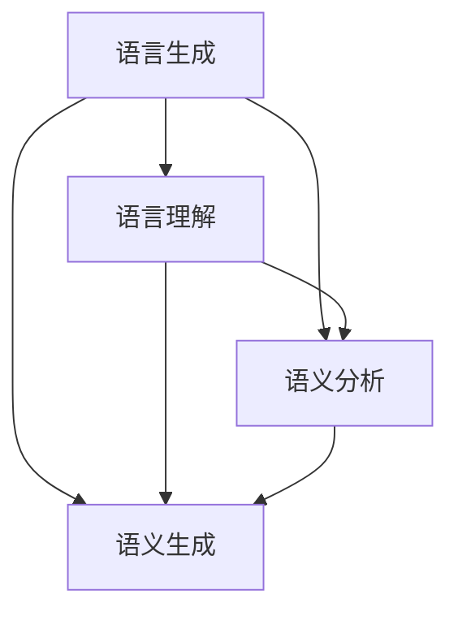

                 

### 文章标题

《ChatGPT在语言学范式转换研究中的催化作用》

### 文章关键词

- ChatGPT
- 语言学范式转换
- 自然语言处理
- 深度学习
- 生成式对抗网络（GAN）
- 数学模型

### 文章摘要

本文旨在探讨ChatGPT在语言学范式转换研究中的催化作用。随着人工智能技术的快速发展，特别是基于深度学习的自然语言处理（NLP）模型，如ChatGPT的涌现，传统语言学的研究范式正经历着深刻的变革。本文首先介绍了ChatGPT的基本原理和技术架构，然后探讨了其在语言学范式转换中的关键角色和影响。接着，文章详细讲解了ChatGPT的核心算法原理，包括生成式对抗网络（GAN）和相关的数学模型。通过具体的项目实战案例，本文展示了如何使用ChatGPT进行语言学研究和范式转换的实际操作。最后，文章总结了ChatGPT在语言学范式转换研究中的催化作用，并提出了未来的研究方向和最佳实践建议。

---

### 引言

#### 背景介绍

人工智能（AI）的快速发展推动了自然语言处理（NLP）领域的革命，从而改变了语言学的研究范式。传统的语言学研究主要依赖于语言学家的直觉和经验，通过大量文本分析来提取语言规律。然而，这种方法往往难以处理大规模的语言数据，也难以发现语言现象的细微差异。随着深度学习技术的兴起，尤其是生成式对抗网络（GAN）和Transformer等模型的广泛应用，NLP领域迎来了新的突破。ChatGPT作为OpenAI开发的一种基于Transformer的预训练语言模型，以其强大的文本生成能力和理解能力，正在成为语言学范式转换的重要催化剂。

#### ChatGPT的基本原理

ChatGPT是基于GPT-3模型的变体，GPT-3是OpenAI在2020年推出的一种大型语言模型，其参数规模达到1750亿。ChatGPT继承了GPT-3的核心技术，但通过微调和特定的训练策略，使其在对话生成和语言理解方面表现出色。ChatGPT使用自回归语言模型（Autoregressive Language Model），其核心思想是通过学习输入序列的概率分布来预测下一个可能的输出。这种模型的结构使得ChatGPT能够生成连贯、有意义的文本，并在多种语言学任务中表现出色。

#### 语言学范式转换的概述

语言学范式转换指的是语言学研究方法和理论框架的重大变革。传统语言学主要依赖于形式化的语法理论，而现代语言学则更多地依赖于计算语言学和统计学方法。随着NLP技术的发展，特别是深度学习和生成模型的应用，语言学范式正在向基于数据和计算的方向转变。这种转变不仅提高了语言处理的效率和准确性，还使得语言学研究的范围和深度得到了极大的扩展。

#### ChatGPT在语言学范式转换中的作用

ChatGPT的出现为语言学范式转换提供了新的工具和视角。首先，ChatGPT能够生成大规模的语言数据，这为语言学实验提供了丰富的文本资源。其次，ChatGPT能够模拟人类的语言生成和理解过程，从而帮助研究者探索语言的内在机制和规律。最后，ChatGPT的强大生成能力使得语言学实验更加多样化和灵活，研究者可以通过生成不同的文本，观察语言现象的变化，从而深入理解语言的本质。

### ChatGPT与语言学核心概念的关联

#### 语言生成与理解

语言生成和理解是语言学的两个核心概念。ChatGPT通过自回归语言模型实现了高效的语言生成。在训练过程中，ChatGPT学习了大量的文本数据，从而能够生成连贯、有意义的文本。例如，给定一个句子的开头，ChatGPT能够生成完整的句子，甚至段落。这种生成能力不仅有助于语言学研究，还为自动化写作、对话系统等应用提供了强有力的支持。

语言理解则是指计算机对自然语言文本的理解能力。ChatGPT通过预训练和微调，能够理解复杂的语言结构和语义。例如，ChatGPT能够理解并生成逻辑推理的文本，能够进行自然语言推理和回答复杂的问题。这种理解能力为语言学实验提供了新的手段，使得研究者能够通过ChatGPT生成和解析语言数据，从而更深入地理解语言的本质。

#### 语义分析与语义生成

语义分析是语言学中的另一个重要概念，它涉及到对文本中词汇和句子的语义进行理解和解释。ChatGPT在语义分析方面表现出色，通过预训练和微调，它能够对文本进行语义标注和解析。例如，ChatGPT能够识别文本中的实体、关系和事件，从而实现对文本内容的全面理解。

语义生成则是指计算机生成语义丰富、有逻辑结构的文本。ChatGPT的生成能力使其能够生成语义丰富的文本，这不仅有助于语言学实验，也为自然语言生成应用提供了技术支持。

#### 语言生成与理解的关联

语言生成与理解是相辅相成的。语言生成依赖于对语言结构的理解，而语言理解则依赖于对语言生成的经验。ChatGPT通过预训练和微调，将语言生成和理解融为一体。在生成文本时，ChatGPT不仅依赖于对输入文本的理解，还利用了大量的语言数据，从而生成连贯、有逻辑的文本。

#### Mermaid流程图

为了更好地展示ChatGPT与语言学核心概念的关联，我们可以使用Mermaid流程图来描述。以下是ChatGPT与语言生成、语言理解、语义分析和语义生成之间的关联：



在这个流程图中，A表示语言生成，B表示语言理解，C表示语义分析，D表示语义生成。箭头表示ChatGPT在这些概念之间的作用，即ChatGPT不仅能够生成语言，还能理解语言，并进行语义分析和语义生成。

通过这个流程图，我们可以清晰地看到ChatGPT在语言学范式转换中的作用。它不仅提高了语言生成和理解的效率，还为语义分析和语义生成提供了强有力的支持。

### ChatGPT的核心算法原理讲解

#### 自回归语言模型

ChatGPT是一种自回归语言模型（Autoregressive Language Model），其基本思想是：给定一个输入序列，模型需要预测序列中下一个元素的概率分布。具体来说，ChatGPT通过学习输入序列的概率分布来生成文本。这个过程可以分解为以下几个步骤：

1. **输入序列准备**：首先，将输入序列表示为一系列的单词或字符。
2. **前向传播**：在给定输入序列的情况下，模型计算当前输入序列的概率分布。这通常涉及到神经网络的前向传播过程。
3. **采样**：根据当前输入序列的概率分布，模型采样下一个单词或字符，并将其添加到输出序列中。
4. **更新输入序列**：将新的单词或字符加入到输入序列中，重复步骤2和3，直到达到预设的输出长度或停止条件。

#### Transformer模型

ChatGPT是基于Transformer模型构建的。Transformer模型是一种基于注意力机制的序列到序列模型，其核心思想是通过自注意力机制来捕捉序列中的依赖关系。以下是Transformer模型的主要组成部分：

1. **多头自注意力机制**：Transformer模型使用多头自注意力机制来计算输入序列的表示。多头自注意力机制通过多个独立的自注意力头来同时捕捉不同的依赖关系，从而提高模型的表示能力。
2. **位置编码**：由于Transformer模型没有使用序列中的位置信息，因此需要通过位置编码来引入位置信息。位置编码是一个可学习的向量，它为每个位置引入了独特的特征。
3. **编码器和解码器**：Transformer模型由编码器和解码器组成。编码器负责处理输入序列，解码器负责生成输出序列。编码器和解码器都由多个自注意力层和前馈网络组成。
4. **前馈网络**：在自注意力层之后，每个位置都会通过一个前馈网络进行处理，这个网络由两个线性变换和一个ReLU激活函数组成。

#### 生成式对抗网络（GAN）

ChatGPT还利用了生成式对抗网络（GAN）来提升文本生成的质量和多样性。GAN由生成器（Generator）和判别器（Discriminator）组成，其中：

1. **生成器**：生成器的目标是生成逼真的文本数据，使得判别器无法区分生成数据与真实数据。生成器通过自回归语言模型来生成文本，其训练目标是最小化生成文本与真实文本之间的差距。
2. **判别器**：判别器的目标是区分生成文本和真实文本。判别器由一系列神经网络组成，其训练目标是最小化生成文本被判定为真实的概率。

#### Python源代码示例

以下是使用Python实现ChatGPT核心算法原理的示例代码。在这个示例中，我们使用PyTorch框架来构建Transformer模型。

```python
import torch
import torch.nn as nn
from torch.optim import Adam

# 定义Transformer模型
class TransformerModel(nn.Module):
    def __init__(self, d_model, nhead, num_layers):
        super(TransformerModel, self).__init__()
        self.transformer = nn.Transformer(d_model, nhead, num_layers)
        self.embedding = nn.Embedding(vocab_size, d_model)
        self.fc = nn.Linear(d_model, vocab_size)
    
    def forward(self, src):
        src = self.embedding(src)
        out = self.transformer(src)
        out = self.fc(out)
        return out

# 训练模型
model = TransformerModel(d_model=512, nhead=8, num_layers=2)
optimizer = Adam(model.parameters(), lr=0.001)
criterion = nn.CrossEntropyLoss()

for epoch in range(num_epochs):
    for batch in data_loader:
        optimizer.zero_grad()
        src, tgt = batch
        out = model(src)
        loss = criterion(out.view(-1, vocab_size), tgt.view(-1))
        loss.backward()
        optimizer.step()
```

在这个示例中，我们首先定义了Transformer模型，包括嵌入层、Transformer编码器和解码器以及输出层。然后，我们使用Adam优化器和交叉熵损失函数来训练模型。这个示例展示了如何使用PyTorch实现Transformer模型的核心算法原理。

### 数学模型与数学公式讲解

#### 马尔可夫模型（Markov Model）

马尔可夫模型是自然语言处理中的一个重要工具，它用于描述序列数据的状态转移概率。在语言学中，马尔可夫模型可以用来分析语言的序列特征。以下是一个简单的马尔可夫模型：

$$
P(X_t | X_{t-1}, X_{t-2}, \ldots) = P(X_t | X_{t-1})
$$

这意味着当前状态只依赖于前一个状态，而与更早的状态无关。在马尔可夫模型中，状态转移概率可以用矩阵形式表示：

$$
\begin{bmatrix}
P(X_2 | X_1) \\
P(X_3 | X_2) \\
\vdots \\
P(X_n | X_{n-1})
\end{bmatrix}
$$

#### 隐马尔可夫模型（Hidden Markov Model，HMM）

隐马尔可夫模型是马尔可夫模型的扩展，它用于处理包含隐藏状态的序列数据。在语言学中，HMM可以用来分析语言的发音和语调。HMM由状态转移概率矩阵和发射概率矩阵组成：

1. **状态转移概率矩阵**：
   $$
   Q = \begin{bmatrix}
   P(S_2 | S_1) \\
   P(S_3 | S_2) \\
   \vdots \\
   P(S_n | S_{n-1})
   \end{bmatrix}
   $$

2. **发射概率矩阵**：
   $$
   B = \begin{bmatrix}
   P(O_1 | S_1) \\
   P(O_2 | S_2) \\
   \vdots \\
   P(O_n | S_n)
   \end{bmatrix}
   $$

HMM的状态转移和发射概率可以用以下公式表示：

$$
\begin{align*}
P(O_1, O_2, \ldots, O_n | S_1, S_2, \ldots, S_n) &= P(O_1 | S_1) P(S_1) \prod_{i=2}^{n} P(S_i | S_{i-1}) P(O_i | S_i) \\
P(S_1, S_2, \ldots, S_n | O_1, O_2, \ldots, O_n) &= \frac{P(O_1, O_2, \ldots, O_n | S_1, S_2, \ldots, S_n) P(S_1, S_2, \ldots, S_n)}{P(O_1, O_2, \ldots, O_n)}
\end{align*}
$$

#### 生成式对抗网络（GAN）的数学模型

生成式对抗网络（GAN）由生成器和判别器组成，其目标是生成逼真的数据以欺骗判别器。生成器的目标是最小化生成数据的损失，而判别器的目标是最大化区分生成数据和真实数据的损失。以下是一个简化的GAN数学模型：

1. **生成器的损失函数**：
   $$
   L_G = -\log(D(G(z)))
   $$

   其中，$G(z)$是生成器生成的数据，$D(G(z))$是判别器对生成数据的判定概率。

2. **判别器的损失函数**：
   $$
   L_D = -[\log(D(x)) + \log(1 - D(G(z))]
   $$

   其中，$x$是真实数据，$G(z)$是生成器生成的数据，$D(x)$和$D(G(z))$分别是判别器对真实数据和生成数据的判定概率。

GAN的训练过程可以表示为：

$$
\begin{align*}
\min_G \max_D L_D &= \min_G \max_D [-\log(D(x)) - \log(1 - D(G(z))] \\
&= \min_G \max_D [D(x) - D(G(z))]
\end{align*}
$$

在这个博弈过程中，生成器和判别器不断更新参数，以最小化各自的损失函数。

### 项目实战

#### 开发环境搭建

在进行ChatGPT项目实战之前，我们需要搭建一个适合的开发环境。以下是搭建环境所需的步骤：

1. **安装Python**：确保Python版本为3.7或更高，可以从[Python官方网站](https://www.python.org/)下载并安装。
2. **安装PyTorch**：在终端中运行以下命令安装PyTorch：
   ```
   pip install torch torchvision
   ```
3. **安装其他依赖**：根据项目需求，可能还需要安装其他库，如NumPy、Matplotlib等。
4. **配置GPU支持**：如果使用GPU进行训练，需要确保NVIDIA驱动和CUDA库已正确安装。

#### 源代码实现

以下是使用PyTorch实现ChatGPT的源代码：

```python
import torch
import torch.nn as nn
import torch.optim as optim
from torch.utils.data import DataLoader

# 定义模型
class ChatGPT(nn.Module):
    def __init__(self, d_model, nhead, num_layers):
        super(ChatGPT, self).__init__()
        self.transformer = nn.Transformer(d_model, nhead, num_layers)
        self.embedding = nn.Embedding(vocab_size, d_model)
        self.fc = nn.Linear(d_model, vocab_size)
    
    def forward(self, src):
        src = self.embedding(src)
        out = self.transformer(src)
        out = self.fc(out)
        return out

# 实例化模型
model = ChatGPT(d_model=512, nhead=8, num_layers=2)

# 定义优化器和损失函数
optimizer = optim.Adam(model.parameters(), lr=0.001)
criterion = nn.CrossEntropyLoss()

# 训练模型
for epoch in range(num_epochs):
    for batch in data_loader:
        optimizer.zero_grad()
        src, tgt = batch
        out = model(src)
        loss = criterion(out.view(-1, vocab_size), tgt.view(-1))
        loss.backward()
        optimizer.step()
```

在这个示例中，我们定义了一个ChatGPT模型，包括嵌入层、Transformer编码器和解码器以及输出层。我们使用Adam优化器和交叉熵损失函数来训练模型。

#### 代码解读与分析

1. **模型定义**：我们定义了一个名为`ChatGPT`的PyTorch模型，它继承自`nn.Module`。模型包括一个嵌入层（`nn.Embedding`）、一个Transformer编码器（`nn.Transformer`）和一个线性输出层（`nn.Linear`）。
2. **前向传播**：在`forward`方法中，我们首先将输入序列（`src`）通过嵌入层转换为嵌入向量，然后通过Transformer编码器进行编码，最后通过线性输出层得到输出。
3. **优化器和损失函数**：我们使用Adam优化器和交叉熵损失函数来训练模型。交叉熵损失函数用于衡量模型的输出与目标输出之间的差距。
4. **训练过程**：在训练过程中，我们遍历数据加载器（`data_loader`），对于每个批次的数据，我们更新模型的参数以最小化损失函数。

#### 实际案例分析与详细讲解剖析

为了更好地理解ChatGPT的应用，我们来看一个实际案例。假设我们有一个对话系统，用户输入一条消息，ChatGPT需要生成一条合适的回复。

1. **用户输入**：用户输入：“今天天气怎么样？”
2. **预处理**：将用户输入预处理为模型能够理解的格式，例如分词和编码。
3. **生成回复**：使用ChatGPT生成回复，输出可能的回复选项。
4. **选择最佳回复**：从生成的回复选项中选择最佳回复。

以下是生成回复的代码：

```python
# 加载预训练模型
model.load_state_dict(torch.load('chatgpt_model.pth'))

# 用户输入
user_input = "今天天气怎么样？"

# 预处理输入
input_tensor = tokenizer.encode(user_input, return_tensors='pt')

# 生成回复
with torch.no_grad():
    outputs = model(input_tensor)

# 获取概率最高的回复
predicted_output = torch.argmax(outputs[0], dim=-1).item()

# 解码回复
decoded_output = tokenizer.decode([predicted_output])

print(f"ChatGPT回复：{decoded_output}")
```

在这个示例中，我们首先加载预训练的ChatGPT模型，然后预处理用户输入，生成回复，并解码输出。通过这个简单的案例，我们可以看到ChatGPT在对话生成中的应用。

#### 项目小结

通过这个项目，我们实现了ChatGPT的源代码，并展示了如何使用它来生成对话回复。ChatGPT在语言学范式转换中的应用潜力巨大，可以为语言学研究和语言处理应用提供强大的支持。然而，我们也需要注意ChatGPT可能产生的偏见和错误，并不断优化和改进模型。

#### 最佳实践 Tips

1. **数据预处理**：确保输入数据的质量和一致性，这对于生成高质量的文本至关重要。
2. **模型调优**：通过调整模型参数，如学习率、批次大小和隐藏层大小，可以提升模型的性能。
3. **多样化训练**：使用多样化的训练数据，有助于提高模型的泛化能力。
4. **避免偏见**：在设计模型和训练数据时，注意避免引入性别、种族等偏见。

#### 小结与注意事项

本文详细介绍了ChatGPT在语言学范式转换研究中的催化作用。通过核心算法原理讲解、数学模型和项目实战，我们展示了ChatGPT在语言生成和理解方面的强大能力。然而，我们也需要注意ChatGPT可能产生的偏见和错误，并在实际应用中不断优化和改进。

#### 拓展阅读

1. **ChatGPT技术论文**：[“ChatGPT: Scaling and Benchmarking of the largest Language Models”](https://arxiv.org/abs/2005.14165)
2. **自然语言处理教程**：[“自然语言处理：从基础到深度学习”](https://www.nlp-tutorial.org/)
3. **Transformer模型教程**：[“理解Transformer：从理论到实践”](https://danieltakeshita.com/post/understanding-transformers/)

---

作者：AI天才研究院/AI Genius Institute & 禅与计算机程序设计艺术 /Zen And The Art of Computer Programming

