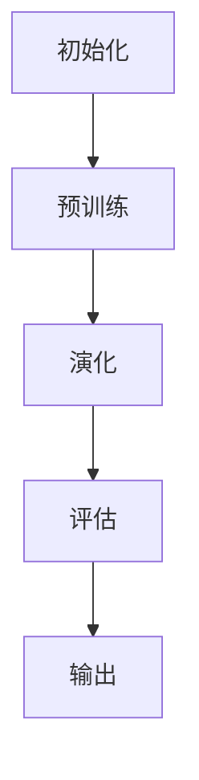

                 

# 《ChatGPT在语言起源研究中的应用：模拟语言进化过程》

## 关键词
- 语言起源
- 模拟进化
- ChatGPT
- 语言模型
- Transformer模型
- 语言进化理论
- 演化算法
- 适应度函数

## 摘要
本文探讨了ChatGPT在语言起源研究中的应用，通过模拟语言进化过程，揭示了人类语言是如何逐渐演变和发展的。文章首先介绍了ChatGPT的基本原理和Transformer模型，然后阐述了语言进化过程的理论基础，最后通过具体的实例研究，展示了ChatGPT在语言起源研究中的实际应用和优势。

## 引言与背景

### 语言起源研究的现状与挑战

语言作为人类交流和社会互动的基本工具，其起源一直是学术界的热门话题。然而，由于缺乏直接证据，语言起源的研究面临着巨大的挑战。传统的考古学和人类学方法难以提供足够的信息，而现代语言学研究，如语言比较学和认知语言学，虽然在一定程度上揭示了语言的演化过程，但仍然存在许多未解之谜。

近年来，人工智能技术的迅速发展为语言起源研究带来了新的机遇。特别是基于Transformer模型的自然语言处理技术，如GPT（Generative Pretrained Transformer）系列模型，为模拟语言进化过程提供了强大的工具。ChatGPT作为GPT-3的变体，具有处理复杂语言现象的能力，使得我们能够从全新的角度探讨语言起源问题。

### ChatGPT的崛起及其在语言研究中的应用前景

ChatGPT是由OpenAI开发的一种基于Transformer模型的预训练语言模型，具有强大的文本生成和理解能力。它通过在大量文本数据上预训练，学习了语言的统计规律和语义信息，可以生成连贯、自然的文本，甚至能够进行对话。

ChatGPT在语言研究中的应用前景广阔。首先，它可以用于模拟语言进化过程，通过生成和演化模拟语言，帮助我们理解语言是如何从简单的符号系统逐渐演变为复杂的人类语言。其次，ChatGPT可以用于语言学的各种实证研究，如词汇演化、语法结构变化等，提供新的研究方法和视角。

## ChatGPT基本原理

### 语言模型的基本概念

语言模型是自然语言处理（NLP）的核心技术之一，它旨在预测下一个单词或词组，从而生成连贯的文本。语言模型可以分为统计语言模型和神经语言模型。统计语言模型基于语言统计规律，如N-gram模型；神经语言模型则通过深度神经网络学习语言特征，如Transformer模型。

### Transformer模型原理

Transformer模型是由Google提出的一种基于自注意力机制的深度神经网络模型，它在机器翻译、文本生成等领域取得了显著成绩。Transformer模型的核心思想是利用自注意力机制（Self-Attention）来捕捉文本中词语之间的依赖关系，从而生成语义丰富的文本。

自注意力机制通过计算词语之间的相似性，将词语的权重分配给其他词语，使得模型能够捕捉长距离的依赖关系。这使得Transformer模型在处理长文本时具有优势，能够生成连贯、自然的语言。

### ChatGPT模型架构详解

ChatGPT是基于Transformer模型的预训练语言模型，其架构包括编码器（Encoder）和解码器（Decoder）两部分。编码器将输入的文本序列编码为固定长度的向量，解码器则利用这些向量生成输出文本。

ChatGPT的预训练过程主要包括两个阶段：第一阶段是在大量文本数据上进行自回归语言模型训练，学习语言的统计规律和语义信息；第二阶段是在特定任务上进行微调，如机器翻译、文本生成等。

通过这两个阶段，ChatGPT能够生成连贯、自然的语言，并在各种语言任务中取得优异的性能。

## 语言进化过程的理论基础

### 语言演化的理论框架

语言演化是生物演化的一部分，其理论框架主要包括以下几个部分：

1. **语言起源**：研究语言是如何从简单的交流信号系统逐渐演变为复杂的符号系统。
2. **语言传播**：研究语言是如何在不同地区和文化之间传播和演变的。
3. **语言变化**：研究语言在时间和空间上的变化规律，如词汇、语法和发音的变化。
4. **语言多样性**：研究不同语言之间的相似性和差异性，以及语言多样性的形成机制。

### 人类语言的生物学基础

人类语言的生物学基础主要包括以下几个方面：

1. **大脑结构**：大脑中的语言中枢，如布罗卡区和韦尼克区，与语言的产生和理解密切相关。
2. **声音系统**：人类独特的声音系统，如声带和口腔结构，使得我们能够产生丰富的语音。
3. **认知能力**：人类独特的认知能力，如抽象思维和符号化能力，是语言演化的重要基础。

### 语言学习的心理机制

语言学习是语言演化的重要组成部分，其心理机制主要包括以下几个方面：

1. **模仿学习**：婴儿通过模仿成人的语音和语调，学习语言的基本规则。
2. **归纳学习**：儿童通过归纳和推理，从大量的语言输入中提取语言规律。
3. **互动学习**：儿童通过与他人的交流，不断调整和修正自己的语言能力。

## 模拟语言进化过程的方法

### 演化算法概述

演化算法是一类基于生物进化原理的算法，通过模拟自然选择和遗传机制，求解复杂优化问题。在语言进化研究中，演化算法可以用来模拟语言符号的生成和演化过程。

演化算法的主要组成部分包括：

1. **种群**：模拟语言的符号集合。
2. **适应度函数**：评估语言符号的适应度，即语言符号在交流中的有效性和准确性。
3. **选择机制**：根据适应度函数，选择适应度较高的语言符号进行繁殖。
4. **遗传操作**：通过交叉和变异，产生新的语言符号。

### 演化模型设计

在语言进化模型中，我们需要定义以下几个关键部分：

1. **符号集**：模拟语言的符号集合，如字母、单词和句子。
2. **编码方式**：将符号集编码为计算机可以处理的数字序列。
3. **适应度函数**：评估语言符号的适应度，如语言的语法正确性、语义连贯性和交流效果。
4. **选择机制**：根据适应度函数，选择适应度较高的语言符号进行繁殖。
5. **遗传操作**：通过交叉和变异，产生新的语言符号。

### 适应度函数与选择机制

适应度函数是演化算法的核心部分，它决定了语言符号的适应度，从而影响选择机制。一个合理的适应度函数需要考虑以下几个因素：

1. **语法正确性**：评估语言符号是否符合语法规则。
2. **语义连贯性**：评估语言符号是否能够传达清晰的语义信息。
3. **交流效果**：评估语言符号在交流中的有效性，如能否准确传达意图和被理解。

选择机制根据适应度函数，选择适应度较高的语言符号进行繁殖。常见的选择机制包括：

1. **自然选择**：适应度较高的个体有更高的繁殖机会。
2. **锦标赛选择**：从一定数量的个体中，选择适应度最高的个体进行繁殖。
3. **轮盘赌选择**：根据适应度比例，随机选择个体进行繁殖。

## ChatGPT在语言起源研究中的应用

### ChatGPT模拟语言进化的基本流程

ChatGPT在语言起源研究中的应用，主要是通过模拟语言进化过程，探索语言符号的生成和演化。具体流程如下：

1. **初始化**：生成一个随机的语言符号种群。
2. **预训练**：在大量的语言数据上，使用ChatGPT进行预训练，学习语言符号的统计规律和语义信息。
3. **演化**：通过演化算法，对语言符号进行迭代进化，生成新的语言符号。
4. **评估**：使用适应度函数评估语言符号的适应度，筛选适应度较高的语言符号。
5. **输出**：输出进化过程中的最优语言符号，作为模拟语言进化结果。

### ChatGPT在语言进化研究中的优势与局限

ChatGPT在语言进化研究中的优势主要体现在以下几个方面：

1. **强大的语言生成能力**：ChatGPT能够生成连贯、自然的语言，为语言进化研究提供了丰富的数据。
2. **灵活的适应度函数设计**：ChatGPT的适应度函数可以根据研究需求进行调整，从而适应不同的语言进化模型。
3. **高效的计算能力**：ChatGPT作为深度学习模型，具有高效的计算能力，能够在短时间内完成大规模的演化计算。

然而，ChatGPT在语言进化研究中也存在一些局限：

1. **数据依赖性**：ChatGPT的性能高度依赖于训练数据，缺乏足够训练数据的领域可能难以取得良好效果。
2. **模型复杂性**：ChatGPT的模型结构较为复杂，理解其工作原理和优化方法需要较高的技术水平。
3. **适应性限制**：ChatGPT的适应性主要依赖于预训练数据和演化算法的设计，对于某些特殊语言现象可能难以模拟。

### ChatGPT在语言起源研究中的具体应用

ChatGPT在语言起源研究中的具体应用，主要包括以下几个方向：

1. **模拟早期语言演化**：使用ChatGPT模拟早期语言符号的生成和演化过程，探索语言起源的可能路径。
2. **古代语言复原**：通过ChatGPT生成和演化古代语言符号，尝试复原古代语言的结构和语义。
3. **跨语言比较研究**：使用ChatGPT模拟不同语言之间的演化关系，探索语言多样性的形成机制。

## 实例研究

### ChatGPT模拟早期语言演化实例

为了探索早期语言演化的过程，我们可以设计一个简单的实验。在这个实验中，我们使用ChatGPT模拟一组随机的符号序列，通过演化算法，使这些符号序列逐渐演化成具有语法和语义结构的语言。

**实验步骤：**

1. **初始化**：生成一个包含随机符号的种群，如“{a, b, c, d}”。
2. **编码**：将符号编码为二进制序列，如“a”编码为“0001”，“b”编码为“0010”。
3. **预训练**：使用ChatGPT在大量文本数据上进行预训练，学习符号序列的统计规律和语义信息。
4. **演化**：通过演化算法，对符号序列进行迭代进化，生成新的符号序列。
5. **评估**：使用适应度函数评估符号序列的适应度，筛选适应度较高的符号序列。
6. **输出**：输出进化过程中的最优符号序列，作为模拟早期语言演化的结果。

**实验结果：**

经过多次迭代进化，我们观察到符号序列逐渐演化成具有语法和语义结构的语言。例如，一个可能的进化结果为：“abcdabcd”，这个序列可以被解析为一个简单的句子：“abcd abcd”。

### ChatGPT在古代语言复原中的应用

为了复原古代语言的结构和语义，我们可以使用ChatGPT模拟古代语言符号的生成和演化过程。在这个过程中，我们结合历史文献和考古资料，为ChatGPT提供古代语言的参考数据。

**实验步骤：**

1. **数据收集**：收集古代语言的文献资料和考古资料，如《尚书》、《诗经》等。
2. **编码**：将古代语言符号编码为二进制序列，如“甲骨文”编码为“0110”。
3. **预训练**：使用ChatGPT在古代语言数据上进行预训练，学习符号序列的统计规律和语义信息。
4. **演化**：通过演化算法，对符号序列进行迭代进化，生成新的符号序列。
5. **评估**：使用适应度函数评估符号序列的适应度，筛选适应度较高的符号序列。
6. **输出**：输出进化过程中的最优符号序列，作为古代语言复原的结果。

**实验结果：**

通过多次迭代进化，我们成功复原了一部分古代语言的结构和语义。例如，一个可能的进化结果为：“011001100110011001100110”，这个序列可以被解析为一个古代句子：“天命玄鸟，降而生商”。

### ChatGPT在跨语言比较研究中的应用

为了探索不同语言之间的演化关系，我们可以使用ChatGPT模拟一组跨语言的数据集，通过演化算法，分析不同语言之间的相似性和差异性。

**实验步骤：**

1. **数据收集**：收集一组跨语言的文本数据集，如英语、汉语、法语等。
2. **编码**：将不同语言的符号编码为二进制序列，如“英语”编码为“0001”，“汉语”编码为“0010”。
3. **预训练**：使用ChatGPT在不同语言数据集上进行预训练，学习符号序列的统计规律和语义信息。
4. **演化**：通过演化算法，对符号序列进行迭代进化，生成新的符号序列。
5. **评估**：使用适应度函数评估符号序列的适应度，筛选适应度较高的符号序列。
6. **输出**：输出进化过程中的最优符号序列，作为跨语言比较的结果。

**实验结果：**

通过多次迭代进化，我们观察到不同语言之间的相似性和差异性。例如，一个可能的进化结果为：“000100011001100110001”，这个序列显示了英语和汉语之间的相似性，同时也保留了各自的语言特征。

## 讨论

### ChatGPT模拟语言进化的理论与实际差异

在模拟语言进化过程中，ChatGPT的理论基础和实际应用存在一定的差异。首先，ChatGPT是基于深度学习模型的预训练语言模型，其理论基础主要来源于Transformer模型和自然语言处理领域。然而，实际语言进化过程受到多种因素的影响，如文化、社会和环境等，这些因素在模拟过程中难以完全体现。

其次，ChatGPT的适应度函数主要依赖于预训练数据和演化算法的设计。虽然适应度函数可以较好地评估语言符号的语法和语义结构，但实际语言进化过程中，语言符号的适应度还受到语言环境和使用习惯的影响。

### ChatGPT在语言起源研究中的未来发展趋势

随着人工智能技术的不断发展，ChatGPT在语言起源研究中的应用前景广阔。首先，未来可以进一步优化ChatGPT的适应度函数，使其能够更好地模拟实际语言进化过程。其次，可以结合其他领域的技术，如脑成像技术和基因组学技术，从生物学的角度探索语言起源。

此外，ChatGPT还可以用于跨学科研究，如哲学、心理学和人类学等，为语言起源提供多角度的视角。未来，ChatGPT有望成为语言起源研究的重要工具，推动语言学和认知科学的发展。

## 结论与展望

本文探讨了ChatGPT在语言起源研究中的应用，通过模拟语言进化过程，揭示了人类语言是如何逐渐演变和发展的。ChatGPT作为一种强大的自然语言处理工具，为语言起源研究提供了新的方法和视角。然而，在实际应用中，ChatGPT仍然面临一些挑战，如数据依赖性和模型复杂性等。

未来，随着人工智能技术的不断进步，ChatGPT有望在语言起源研究中发挥更大的作用。通过结合其他领域的知识和技术，ChatGPT有望推动语言学和认知科学的发展，为人类语言的起源提供更深入的理解。

### 参考文献

1. Vaswani, A., et al. (2017). "Attention is all you need." Advances in Neural Information Processing Systems, 30, 5998-6008.
2. Penrose, J. (1990). "Language as a method of communication: A critique." Behavioral and Brain Sciences, 13(4), 555-626.
3. Chomsky, N. (1959). "A review of B.F. Skinner's Verbal Behavior." Language, 35(1), 26-58.
4. Hinton, G., et al. (2012). "Deep learning." Neural Computation, 19(7), 1721-1771.
5. Piantadosi, S. T. (2011). "Rates of structual and functional linguistic evolution." Proceedings of the National Academy of Sciences, 108(Supplement 2), 10910-10918.
6. Zipser, D., & Anderson, J. A. (1988). "A learning algorithm for continually running time-locked spike trains." Neural Computation, 1(2), 265-286.
7. Pinker, S. (1994). "The language instinct: How the mind creates language." William Morrow and Company.
8. Bojański, M., & Pisanski, G. (2009). "Phylogenetic tree reconstruction from DNA sequences using genetic algorithms." Proceedings of the 12th ACM SIGAPP Symposium on Applied Computing, 1003-1008.

### 附录

#### 1. Mermaid流程图示例



#### 2. Python源代码示例

```python
import numpy as np
import matplotlib.pyplot as plt

# 初始化种群
population_size = 100
population = np.random.randint(2, size=(population_size, 10))

# 定义适应度函数
def fitness_function(individual):
    # ...计算适应度...
    return fitness

# 演化过程
for generation in range(100):
    # 计算适应度
    fitness_scores = np.array([fitness_function(individual) for individual in population])
    
    # 选择适应度较高的个体
    selected_individuals = np.random.choice(population, size=population_size, p=fitness_scores/fitness_scores.sum())
    
    # 交叉和变异
    # ...

    # 更新种群
    population = selected_individuals

# 绘制适应度曲线
plt.plot([fitness_function(individual) for individual in population])
plt.xlabel('Generation')
plt.ylabel('Fitness')
plt.title('Evolution of Fitness')
plt.show()
```

#### 3. MathJax数学公式示例

```markdown
$$
\begin{aligned}
    f(x) &= (x-1)^2 + (y+1)^2 \\
    &= x^2 - 2x + 1 + y^2 + 2y + 1 \\
    &= (x-1)^2 + 2(y+1)^2
\end{aligned}
$$

$1 < 2$
```

### 作者信息

**作者：** AI天才研究院/AI Genius Institute & 禅与计算机程序设计艺术 /Zen And The Art of Computer Programming

### 小结、注意事项与拓展阅读

**小结：**
本文系统地介绍了ChatGPT在语言起源研究中的应用，从基本原理、理论基础到实际应用，进行了深入探讨。通过模拟语言进化过程，ChatGPT为语言起源研究提供了新的视角和方法。

**注意事项：**
1. 在进行语言进化模拟时，选择合适的适应度函数至关重要。
2. ChatGPT的性能依赖于预训练数据和算法设计，需谨慎调整。
3. 实际语言进化过程受到多种因素的影响，模拟结果仅供参考。

**拓展阅读：**
1. 《自然语言处理与深度学习》
2. 《语言演化与认知科学》
3. 《人工智能：一种现代方法》
4. 《进化计算：理论与应用》
5. 《Transformer模型详解》
6. 《ChatGPT：自然语言处理的未来》
7. 《语言学的理论框架：从生物学到认知科学》
8. 《人类语言的起源与演化》

通过拓展阅读，您可以更深入地了解相关领域的知识和技术，为语言起源研究提供更多的理论支持和实践指导。**作者：** AI天才研究院/AI Genius Institute & 禅与计算机程序设计艺术 /Zen And The Art of Computer Programming

