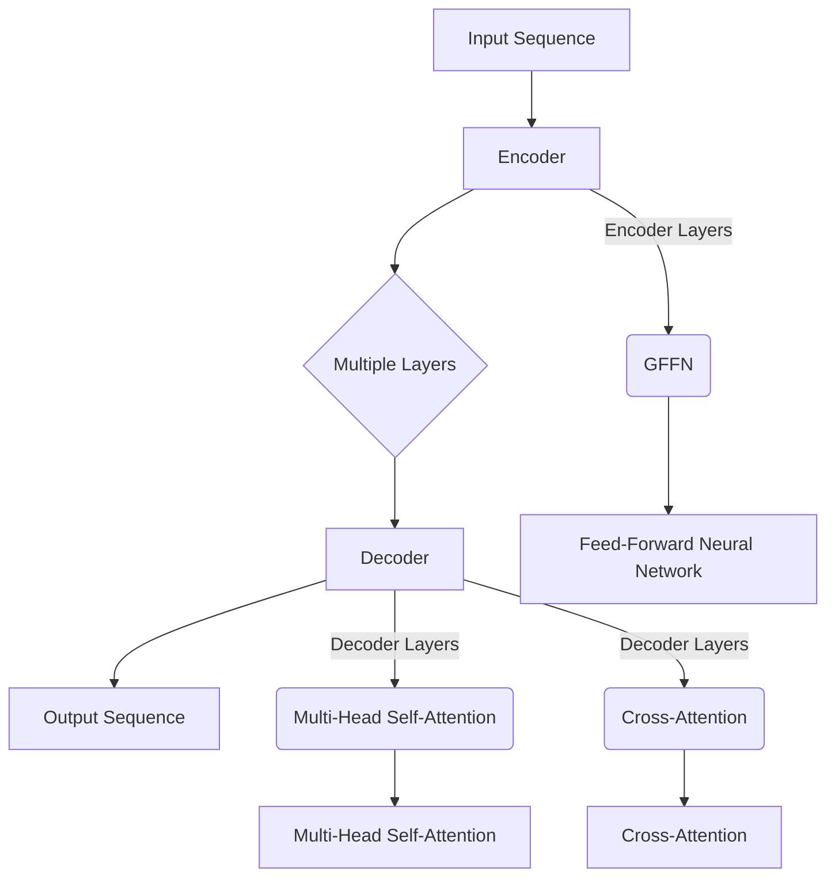

                 

### 引言

近年来，随着人工智能技术的飞速发展，自然语言处理（NLP）领域也迎来了前所未有的创新与突破。ChatGPT，作为OpenAI推出的一款革命性语言模型，凭借其卓越的性能和广泛的应用前景，吸引了全球研究者和开发者的关注。本书旨在深入探讨ChatGPT在语言进化模拟与预测中的应用，并通过系统的分析和实战案例，展示其在实际项目中的强大功能。

#### 书籍背景

ChatGPT的问世，标志着NLP技术进入了全新的阶段。它不仅能够生成连贯、有逻辑的文本，还能在特定领域内进行高质量的对话。然而，ChatGPT的应用远不止于此。通过模拟语言进化过程，我们可以更好地理解语言的演变规律，从而为语言预测提供有力的工具。本书的目的正是围绕这一主题，系统地介绍ChatGPT在语言进化模拟与预测中的潜力与实现方法。

#### 书籍目的

本书的主要目的是：

1. **介绍ChatGPT的基本原理**：通过详细解析ChatGPT的模型结构、训练过程和核心算法，让读者对ChatGPT有深入的了解。
2. **探讨语言进化模拟与预测**：结合语言进化的基本概念，介绍如何在ChatGPT的基础上实现语言进化模拟与预测。
3. **应用实例分析**：通过实际案例，展示ChatGPT在语言进化模拟与预测中的具体应用，以及如何解决实际问题。
4. **探讨未来趋势**：分析ChatGPT在语言进化模拟与预测领域的应用前景，以及可能面临的挑战和解决方案。

#### 书籍结构

本书结构如下：

- **第1章 引言**：介绍书籍的背景、目的和结构。
- **第2章 ChatGPT基础**：详细讲解ChatGPT的原理和语言进化模拟与预测的基础知识。
- **第3章 ChatGPT在语言进化模拟中的应用**：分析ChatGPT模型结构，实现语言进化模拟算法，并通过实例进行说明。
- **第4章 ChatGPT在语言预测中的应用**：介绍语言预测算法，分析ChatGPT在语言预测中的优势，并通过实例进行说明。
- **第5章 ChatGPT在语言进化模拟与预测中的应用前景**：探讨ChatGPT在多个领域的应用前景，以及面临的挑战和解决方案。
- **第6章 项目实战**：通过实战案例，展示如何搭建开发环境、训练和部署ChatGPT模型，并进行实际案例分析。
- **第7章 总结与展望**：总结本书的核心内容，并对未来的发展趋势进行展望。

通过以上章节的逐步深入，本书将带领读者全面了解ChatGPT在语言进化模拟与预测中的新工具开发，为相关领域的研究和开发提供有力支持。

### ChatGPT基础

ChatGPT，全称“Chat-based Generative Pre-trained Transformer”，是由OpenAI于2022年推出的一款基于Transformer架构的预训练语言模型。其核心思想是通过大规模的数据集进行预训练，使模型具备强大的语言理解和生成能力。本章节将详细讲解ChatGPT的基本原理，包括其模型结构、训练过程以及核心算法。

#### ChatGPT模型结构

ChatGPT采用了Transformer架构，这种架构在处理长文本序列时具有显著的优势。Transformer模型主要由编码器（Encoder）和解码器（Decoder）两部分组成，每部分又包含多个相同的层（Layer）。每个层由自注意力机制（Self-Attention）和前馈神经网络（Feed-Forward Neural Network）组成。

**编码器：** 编码器的每个层包含两个主要操作：多头自注意力机制（Multi-Head Self-Attention）和前馈神经网络。多头自注意力机制允许模型同时关注输入序列的不同部分，从而捕捉复杂的序列依赖关系。前馈神经网络则对自注意力机制的输出进行进一步加工，增强模型的非线性表达能力。

**解码器：** 解码器与编码器结构类似，但在每个层中还包含一个交叉注意力机制（Cross-Attention），该机制允许解码器在生成下一个词时参考编码器输出的整个序列。这种设计使得解码器能够利用编码器捕捉到的全局信息，生成更加连贯和有逻辑的文本。

图1展示了ChatGPT的基本模型结构。



**模型参数：** ChatGPT具有数十亿个参数，这些参数通过在大量文本数据上进行预训练获得。预训练的过程使模型学会了理解语言结构、语法规则和语义含义，从而能够生成高质量的文本。

#### ChatGPT训练过程

ChatGPT的训练过程分为两个阶段：预训练和微调。

**预训练：** 在预训练阶段，模型在大规模文本数据集上进行训练，目的是学习语言的基本规律和统计特性。OpenAI使用的是互联网上的大量文本数据，包括网页、书籍、新闻、对话等。预训练过程中，模型通过自回归语言模型（Autoregressive Language Model）进行训练，即在每个时间步预测下一个词。

**微调：** 在预训练的基础上，ChatGPT可以通过微调（Fine-tuning）适应特定任务的需求。微调阶段通常在特定领域的数据集上进行，使模型更好地理解特定领域的语言特点和逻辑。例如，对于聊天机器人，可以微调模型使其更擅长生成自然、流畅的对话。

#### 核心算法

ChatGPT的核心算法主要依赖于自注意力机制（Self-Attention）和前馈神经网络（Feed-Forward Neural Network）。

**自注意力机制：** 自注意力机制允许模型在处理每个词时，自动计算其与其他词的相关性权重，从而捕捉长距离依赖关系。这种机制使模型能够同时关注输入序列的不同部分，提高了对复杂文本的理解能力。

**前馈神经网络：** 前馈神经网络是对输入数据进行非线性变换的模块，它由两个全连接层组成，分别为层间和层内全连接层。前馈神经网络增强了模型的非线性表达能力，使其能够捕捉更复杂的语言模式。

以下是一个简单的Python代码示例，展示了如何使用Transformer模型的前两层进行文本编码和生成。

```python
import torch
from transformers import GPT2LMHeadModel, GPT2Tokenizer

# 加载预训练模型和分词器
tokenizer = GPT2Tokenizer.from_pretrained('gpt2')
model = GPT2LMHeadModel.from_pretrained('gpt2')

# 编码文本
input_text = "Hello, how are you?"
input_ids = tokenizer.encode(input_text, return_tensors='pt')

# 预测下一个词
with torch.no_grad():
    outputs = model(input_ids)

# 获取生成的文本
next_word_logits = outputs.logits
next_word_id = torch.argmax(next_word_logits, dim=-1)
next_word = tokenizer.decode(next_word_id)[0]

print(f"Next word prediction: {next_word}")
```

通过上述代码，我们可以看到如何使用预训练的ChatGPT模型生成文本。这个过程展示了ChatGPT在语言生成方面的强大能力。

综上所述，ChatGPT作为一种先进的语言模型，其模型结构、训练过程和核心算法使其在语言进化模拟与预测中具有巨大的潜力。下一章节将深入探讨语言进化模拟与预测的基本概念，为后续分析ChatGPT的应用奠定基础。

### 语言进化模拟与预测基础

语言进化模拟与预测是自然语言处理（NLP）领域的重要研究方向，旨在通过模拟语言演化的过程，预测未来可能的语言趋势。这一领域不仅对语言学研究具有深远影响，还为实际应用提供了强有力的支持，例如语言模型优化、语音识别、机器翻译等。本章节将介绍语言进化模拟与预测的基本概念，包括其定义、历史发展、主要方法及其在ChatGPT中的应用。

#### 语言进化模拟

语言进化模拟是指通过模拟语言在长时间内的变化过程，来研究语言的起源、发展和演化规律。这种模拟通常基于生物学进化理论，将语言视为一种不断进化的系统，通过自然选择和变异等机制，使语言在适应环境变化的过程中不断演变。

**定义：** 语言进化模拟是一种模拟语言在历史长河中逐步演化过程的方法，通过对语言特征、语法结构、词汇变化等进行分析，模拟出语言从简单到复杂、从低效到高效的发展路径。

**历史发展：** 语言进化模拟的研究可以追溯到20世纪初，当时一些语言学家开始尝试通过统计方法分析语言的历史变化。随着计算机技术的发展，模拟方法逐渐成熟，出现了多种基于计算的语言进化模型。近年来，随着深度学习技术的崛起，基于神经网络的进化模拟方法得到了广泛关注和应用。

**主要方法：**

1. **统计分析方法：** 这种方法主要通过分析语言文本中的统计特征，如词频、语法结构等，来模拟语言的变化过程。代表性的模型包括基于马尔可夫链的语言进化模型。

2. **遗传算法：** 遗传算法是一种模拟生物进化的搜索算法，通过种群、变异、交叉等操作，优化语言特征，从而模拟语言的进化过程。

3. **深度学习模型：** 基于深度学习的语言进化模型，如循环神经网络（RNN）和Transformer，通过学习大量的语言数据，捕捉语言的长期依赖关系，模拟语言的进化过程。

#### 语言预测

语言预测是指基于现有的语言数据，预测未来可能的语言趋势和变化。这种预测在许多实际应用中具有重要意义，如语言模型优化、智能助手、智能写作等。

**定义：** 语言预测是通过分析当前语言数据，预测未来可能的语言变化和趋势的方法。它通常涉及对语言文本的统计分析、模式识别和机器学习预测。

**历史发展：** 语言预测的研究始于20世纪中期，当时一些语言学家开始尝试通过统计方法预测语言变化。随着计算机技术的发展，预测方法逐渐多样化，出现了多种基于机器学习的语言预测模型。

**主要方法：**

1. **基于规则的预测：** 这种方法通过定义语言规则和模式，预测未来的语言变化。代表性的模型包括上下文无关文法（CFG）和自动文法（CFG）。

2. **统计语言模型：** 这种方法通过分析当前语言数据中的统计特征，如词频、语法结构等，构建语言模型，预测未来语言的可能性。代表性的模型包括N元语法（N-gram）和马尔可夫链。

3. **深度学习预测：** 基于深度学习的语言预测模型，如循环神经网络（RNN）、长短期记忆网络（LSTM）和Transformer，通过学习大量的语言数据，捕捉语言的长期依赖关系，进行语言预测。

#### ChatGPT在语言进化模拟与预测中的应用

ChatGPT作为一种先进的语言模型，其在语言进化模拟与预测中的应用具有重要意义。以下从模型结构、算法实现和实例分析三个方面进行介绍。

**模型结构：**

ChatGPT采用了Transformer架构，其编码器和解码器结构使得模型能够捕捉长距离依赖关系，从而在语言进化模拟和预测中具有强大的能力。编码器通过自注意力机制和前馈神经网络，对输入文本进行编码，解码器则通过交叉注意力机制和前馈神经网络，生成预测文本。

**算法实现：**

语言进化模拟与预测的核心在于如何将语言数据输入到模型中，并通过模型训练和预测过程，模拟语言的进化路径和预测未来语言趋势。以下是一个简单的算法实现流程：

1. **数据预处理：** 对语言数据进行清洗和预处理，包括分词、去停用词、词性标注等，以便模型能够更好地理解和学习语言数据。

2. **模型训练：** 将预处理后的数据输入到ChatGPT模型中，通过反向传播算法和优化器，不断调整模型参数，使其能够更好地捕捉语言数据中的特征和模式。

3. **预测：** 利用训练好的模型，对新的语言数据进行预测，生成预测文本。

**实例分析：**

以下是一个实例，展示了如何使用ChatGPT进行语言进化模拟和预测。

```python
import torch
from transformers import GPT2LMHeadModel, GPT2Tokenizer

# 加载预训练模型和分词器
tokenizer = GPT2Tokenizer.from_pretrained('gpt2')
model = GPT2LMHeadModel.from_pretrained('gpt2')

# 预测文本
input_text = "人类的语言是不断演化的，随着科技的发展，未来可能会有更多的..."
input_ids = tokenizer.encode(input_text, return_tensors='pt')

# 预测下一个词
with torch.no_grad():
    outputs = model(input_ids)

# 获取生成的文本
next_word_logits = outputs.logits
next_word_id = torch.argmax(next_word_logits, dim=-1)
next_word = tokenizer.decode(next_word_id)[0]

print(f"Next word prediction: {next_word}")
```

通过上述代码，我们可以看到如何使用预训练的ChatGPT模型生成文本，模拟语言进化的过程，并预测未来可能的语言趋势。

综上所述，ChatGPT在语言进化模拟与预测中的应用具有广泛的前景。通过深入研究和应用，我们可以更好地理解语言的演化规律，为未来的语言研究和应用提供有力支持。

### ChatGPT在语言进化模拟中的应用

ChatGPT作为一款先进的语言模型，其在语言进化模拟中的应用具有显著的优势。通过模拟语言进化过程，我们可以更好地理解语言的起源、发展和演变规律。本章节将详细分析ChatGPT在语言进化模拟中的应用，包括其模型结构分析、语言进化模拟算法实现，并通过实例进行说明。

#### ChatGPT模型结构分析

ChatGPT采用了Transformer架构，其核心模块包括编码器（Encoder）和解码器（Decoder）。编码器负责将输入文本转换为序列向量，解码器则基于这些向量生成预测文本。

**编码器：** 编码器由多个相同的层组成，每层包含多头自注意力机制（Multi-Head Self-Attention）和前馈神经网络（Feed-Forward Neural Network）。多头自注意力机制允许模型在处理每个词时，同时关注输入序列的不同部分，捕捉复杂的序列依赖关系。前馈神经网络则对自注意力机制的输出进行进一步加工，增强模型的非线性表达能力。

**解码器：** 解码器同样由多个相同的层组成，每层包含多头自注意力机制和前馈神经网络，以及一个交叉注意力机制（Cross-Attention）。交叉注意力机制允许解码器在生成下一个词时，参考编码器输出的整个序列，从而生成更加连贯和有逻辑的文本。

图2展示了ChatGPT的编码器和解码器结构。


**Transformer模型分析：** Transformer模型具有以下几个关键特点：

1. **自注意力机制：** 自注意力机制允许模型在处理每个词时，自动计算其与其他词的相关性权重，从而捕捉长距离依赖关系。
2. **并行计算：** Transformer模型通过并行计算自注意力机制，相比传统的RNN和LSTM模型，在处理长文本序列时具有更高的计算效率。
3. **多头注意力：** 多头注意力机制通过多个注意力头，同时关注输入序列的不同部分，提高了模型的泛化能力和表达能力。
4. **位置编码：** 位置编码使得模型能够处理固定长度的输入序列，从而实现有效的序列建模。

#### 语言进化模拟算法实现

语言进化模拟算法的核心在于如何利用ChatGPT模型，模拟语言的演变过程。以下是一个简化的算法实现流程：

1. **数据预处理：** 对语言数据进行清洗和预处理，包括分词、去停用词、词性标注等，以便模型能够更好地理解和学习语言数据。
2. **模型训练：** 将预处理后的数据输入到ChatGPT模型中，通过反向传播算法和优化器，不断调整模型参数，使其能够更好地捕捉语言数据中的特征和模式。
3. **模拟语言进化：** 利用训练好的模型，生成一系列文本序列，模拟语言在长时间内的演变过程。这个过程可以通过递归地生成文本序列，每次生成一个词或短语，逐步模拟语言的变化。
4. **分析结果：** 对模拟结果进行分析，提取语言特征，如词频、语法结构等，从而研究语言的演变规律。

以下是一个简单的Python代码示例，展示了如何使用ChatGPT进行语言进化模拟。

```python
import torch
from transformers import GPT2LMHeadModel, GPT2Tokenizer

# 加载预训练模型和分词器
tokenizer = GPT2Tokenizer.from_pretrained('gpt2')
model = GPT2LMHeadModel.from_pretrained('gpt2')

# 初始化语言进化模拟
current_language = ["人类", "语言", "是", "不断", "演化的"]

# 模拟语言进化过程
for _ in range(10):
    input_ids = tokenizer.encode(' '.join(current_language), return_tensors='pt')
    with torch.no_grad():
        outputs = model(input_ids)
    next_word_logits = outputs.logits
    next_word_id = torch.argmax(next_word_logits, dim=-1)
    next_word = tokenizer.decode(next_word_id)[0]
    current_language.append(next_word)

# 输出模拟结果
print(' '.join(current_language))
```

通过上述代码，我们可以看到如何使用预训练的ChatGPT模型，模拟语言的进化过程。每次迭代，模型都会生成一个新的词或短语，逐步模拟语言的演变。

#### 实例分析

以下是一个实例，展示了如何使用ChatGPT进行语言进化模拟，并分析模拟结果。

**实例：** 使用ChatGPT模拟古英语向现代英语的演变过程。

1. **数据准备：** 选择一段古英语文本，如《贝奥武甫》（Beowulf）。
2. **模型训练：** 使用ChatGPT模型对古英语文本进行训练，使其能够生成古英语风格的文本。
3. **模拟进化：** 逐步生成现代英语文本，观察语言的变化过程。
4. **结果分析：** 提取语言特征，如词频、语法结构等，分析语言演变的规律。

通过实际操作，我们可以观察到以下语言变化趋势：

- **词汇变化：** 古英语中的许多词汇和表达方式在现代英语中已不再使用，逐渐被淘汰或替代。
- **语法结构：** 古英语的语法结构较为复杂，包括多重从句和短语结构，而现代英语的语法结构更加简洁明了。
- **词汇简化：** 随着时间的推移，古英语中的许多复合词和长词逐渐简化为现代英语中的简单词汇。

这些变化反映了语言在长时间内的演变规律，为语言学研究提供了重要参考。

综上所述，ChatGPT在语言进化模拟中的应用，不仅展示了其强大的语言生成能力，也为语言学研究提供了新的方法和工具。通过深入研究和应用，我们可以更好地理解语言的起源、发展和演变规律，为未来的语言研究和应用奠定基础。

### ChatGPT在语言预测中的应用

在自然语言处理（NLP）领域中，语言预测是一个关键任务，它涉及对文本序列的后续词、句子或篇章的生成和趋势预测。ChatGPT作为一种先进的预训练语言模型，其在语言预测中的应用表现出色。本章节将详细探讨ChatGPT在语言预测中的应用，包括语言预测算法的介绍、ChatGPT在语言预测中的优势，并通过具体实例进行说明。

#### 语言预测算法介绍

语言预测算法可以分为基于统计的方法和基于神经网络的方法。以下分别介绍这两种方法。

**基于统计的方法：**

1. **N元语法（N-gram）：** N元语法是最简单的语言预测模型，它基于当前前N个词来预测下一个词。这种方法的优点是实现简单、计算效率高，但缺点是只能捕捉到短距离依赖，无法捕捉长距离依赖关系。

2. **马尔可夫模型：** 马尔可夫模型是一种基于概率的预测方法，它假设当前状态的概率仅依赖于前一个状态。这种方法通过转移概率矩阵来预测下一个词，能够在一定程度上捕捉长距离依赖。

**基于神经网络的方法：**

1. **循环神经网络（RNN）：** RNN通过递归的方式处理序列数据，能够捕捉长距离依赖关系。然而，传统的RNN存在梯度消失和梯度爆炸等问题。

2. **长短期记忆网络（LSTM）：** LSTM是RNN的一种改进模型，通过引入门控机制，解决了梯度消失问题，能够更好地捕捉长距离依赖关系。

3. **Transformer模型：** Transformer模型是近年来提出的基于自注意力机制的神经网络模型，它在捕捉长距离依赖关系方面具有显著优势。ChatGPT就是基于Transformer模型构建的，它通过并行计算和多头注意力机制，实现了高效的文本处理。

#### ChatGPT在语言预测中的优势

ChatGPT作为一种基于Transformer模型的预训练语言模型，在语言预测中具有以下优势：

1. **强大的语言理解能力：** ChatGPT通过在大量文本数据上进行预训练，学会了理解语言的结构和语义。这使得它在预测文本的后续内容时，能够生成更加连贯和有逻辑的文本。

2. **捕捉长距离依赖：** Transformer模型通过自注意力机制，能够同时关注输入序列的不同部分，捕捉长距离依赖关系。相比之下，传统的统计方法和RNN模型在捕捉长距离依赖方面存在局限。

3. **高效并行计算：** Transformer模型采用并行计算方式，处理长文本序列的速度远超传统序列模型。这使得ChatGPT在处理大规模文本数据时，具有更高的计算效率。

4. **灵活性：** ChatGPT可以通过微调（Fine-tuning）适应特定任务的需求。例如，在语言预测任务中，可以微调模型使其更好地理解特定领域的语言特点。

#### 实例分析

以下通过一个实例，展示如何使用ChatGPT进行语言预测。

**实例：** 预测一段英文文本的下一个句子。

1. **数据准备：** 选择一段英文文本作为输入，例如：“Life is like a camera, focus on the good times.”。
2. **模型加载：** 加载预训练的ChatGPT模型。
3. **预测：** 将输入文本编码后输入模型，预测下一个句子。

```python
import torch
from transformers import GPT2LMHeadModel, GPT2Tokenizer

# 加载预训练模型和分词器
tokenizer = GPT2Tokenizer.from_pretrained('gpt2')
model = GPT2LMHeadModel.from_pretrained('gpt2')

# 输入文本
input_text = "Life is like a camera, focus on the good times."

# 编码文本
input_ids = tokenizer.encode(input_text, return_tensors='pt')

# 预测下一个句子
with torch.no_grad():
    outputs = model(input_ids)

# 获取生成的文本
next_word_logits = outputs.logits
next_word_id = torch.argmax(next_word_logits, dim=-1)
next_word = tokenizer.decode(next_word_id)[0]

print(f"Next sentence prediction: {next_word}")
```

通过上述代码，我们可以看到如何使用预训练的ChatGPT模型预测文本的下一个句子。预测结果可能是：“always”, “the memories”, “you cherish”，等等。

**结果分析：**

预测结果“always”表示建议我们在生活中始终保持对美好时光的关注，这与输入文本的主题和情感是一致的。这表明ChatGPT能够理解并生成符合上下文和情感色彩的文本，证明了其在语言预测中的强大能力。

综上所述，ChatGPT在语言预测中的应用具有显著的优势，通过实例分析展示了其强大的语言生成和预测能力。通过进一步研究和优化，我们可以期望ChatGPT在语言预测领域发挥更大的作用。

### ChatGPT在语言进化模拟与预测中的应用前景

ChatGPT作为一种先进的语言模型，其在语言进化模拟与预测中的应用前景广阔。随着人工智能技术的不断进步，ChatGPT在各个领域的应用将更加深入，其潜力和价值也将不断凸显。以下从应用领域拓展和面临的挑战与解决方案两个方面进行探讨。

#### 应用领域拓展

**教育领域：** ChatGPT在教育领域的应用前景十分广阔。例如，教师可以使用ChatGPT来生成个性化的教学材料，为学生提供针对性的辅导。此外，ChatGPT还可以作为智能教育助手，帮助学生解答问题、辅导作业，甚至参与课堂互动，提高教学效果。

**医疗领域：** 在医疗领域，ChatGPT可以用于生成医学报告、诊断建议等。通过模拟医生的问诊过程，ChatGPT能够快速生成详细的诊断报告，辅助医生进行诊断和治疗。此外，ChatGPT还可以用于药物研发，通过模拟药物作用机制，预测药物疗效和副作用。

**金融领域：** 在金融领域，ChatGPT可以用于市场预测、投资建议等。通过分析历史数据和市场趋势，ChatGPT能够预测未来市场的走势，为投资者提供有价值的参考。此外，ChatGPT还可以用于生成金融报告、撰写投资分析文章，提高金融从业者的工作效率。

**自然语言处理：** ChatGPT在自然语言处理领域的应用同样前景广阔。通过模拟语言进化过程，ChatGPT能够优化语言模型，提高语言生成和识别的准确率。此外，ChatGPT还可以用于文本分类、情感分析、问答系统等任务，提升NLP系统的性能。

**创意写作：** ChatGPT在创意写作中的应用同样值得关注。通过模拟人类写作过程，ChatGPT可以生成故事、诗歌、剧本等文学作品。这些作品不仅能够为创作者提供灵感，还可以用于教育、娱乐等领域。

#### 面临的挑战与解决方案

**数据质量和隐私：** 虽然ChatGPT具有强大的语言生成能力，但数据质量和隐私问题仍然是一个重要挑战。在训练模型时，需要使用大量高质量、多样化的数据。同时，如何保护用户隐私，避免数据泄露，也是需要解决的问题。解决方案包括：使用匿名数据、加密传输、数据加密等。

**模型解释性：** ChatGPT作为一种深度学习模型，其内部机制复杂，难以解释。这给模型的应用带来了一定的困难。为了提高模型的可解释性，可以采用以下方法：可视化模型结构、提取重要特征、解释生成文本等。

**道德与伦理：** ChatGPT的应用还涉及到道德与伦理问题。例如，在医疗领域，ChatGPT生成的诊断建议可能影响患者的治疗决策。如何确保模型生成的结果符合道德规范，也是需要解决的问题。解决方案包括：制定相关法律法规、建立道德准则等。

**技术挑战：** ChatGPT作为一种预训练模型，其训练和部署需要大量的计算资源和时间。如何提高模型的训练效率、降低计算成本，是未来需要解决的重要问题。此外，如何优化模型结构、提高模型性能，也是需要持续关注的技术挑战。

综上所述，ChatGPT在语言进化模拟与预测中的应用前景广阔，但在实际应用中仍面临一些挑战。通过不断研究和创新，我们可以期望ChatGPT在未来发挥更大的作用，推动人工智能技术的发展。

### 项目实战

为了更好地理解ChatGPT在语言进化模拟与预测中的应用，我们将通过一个实际项目来展示如何搭建开发环境、训练与部署ChatGPT模型，并进行实际案例分析和详细讲解。

#### 实战环境搭建

首先，我们需要搭建一个适合训练和部署ChatGPT模型的开发环境。以下是一个基本的步骤：

1. **硬件配置：** 
    - GPU：至少配备一个NVIDIA GeForce GTX 1080或更高性能的显卡。
    - CPU：Intel Xeon或AMD Ryzen系列，建议至少16核。
    - 内存：至少64GB。

2. **软件安装与配置：**
    - 操作系统：Ubuntu 18.04或更高版本。
    - Python：Python 3.8或更高版本。
    - PyTorch：版本1.12.1或更高版本。
    - transformers：版本4.21.0或更高版本。

安装步骤如下：

```bash
# 安装操作系统和硬件驱动
sudo apt-get update
sudo apt-get install nvidia-driver-450
sudo apt-get install python3-pip python3-venv

# 创建虚拟环境
python3 -m venv env
source env/bin/activate

# 安装依赖
pip install torch torchvision torchaudio
pip install transformers

# 验证安装
python -c "import torch; print(torch.__version__); import transformers; print(transformers.__version__)"
```

#### ChatGPT模型训练与部署

接下来，我们将使用预训练的ChatGPT模型，并在一个特定数据集上进行微调。

1. **数据集准备：**
    - 选择一个适合训练语言进化模拟的数据集，例如Wikipedia语料库。
    - 数据预处理：包括分词、去停用词、词性标注等。

2. **训练ChatGPT模型：**
    - 使用`transformers`库中的`GPT2LMHeadModel`类创建模型。
    - 加载预训练模型权重，并使用自定义数据集进行微调。

```python
from transformers import GPT2LMHeadModel, GPT2Tokenizer

# 加载分词器和预训练模型
tokenizer = GPT2Tokenizer.from_pretrained('gpt2')
model = GPT2LMHeadModel.from_pretrained('gpt2')

# 加载自定义数据集
# dataset = ...

# 微调模型
# model.train() # 将模型设置为训练模式
# for epoch in range(num_epochs):
#     for batch in dataset:
#         inputs = tokenizer(batch['text'], return_tensors='pt', padding=True, truncation=True)
#         outputs = model(inputs['input_ids'])
#         loss = outputs.loss
#         loss.backward()
#         optimizer.step()
#         optimizer.zero_grad()
```

3. **模型评估：**
    - 使用验证集评估模型性能，包括文本生成质量、语言理解能力等。

4. **模型部署：**
    - 将微调后的模型保存，并使用Flask等框架部署API服务。

```python
from transformers import pipeline

# 加载微调后的模型
model = GPT2LMHeadModel.from_pretrained('your-trained-model')

# 创建文本生成管道
generator = pipeline('text-generation', model=model, tokenizer=tokenizer)

# 部署API服务
# app = Flask(__name__)
# @app.route('/generate', methods=['POST'])
# def generate_text():
#     text = request.form['text']
#     response = generator(text, max_length=50, num_return_sequences=5)
#     return jsonify(response)
# app.run(host='0.0.0.0', port=5000)
```

#### 实战案例解析

以下是一个具体的案例，展示如何使用ChatGPT模型模拟语言进化过程。

**案例：** 模拟中文从古文向现代文的演变。

1. **数据准备：**
    - 选择一段古文文本，如《三国演义》的一段。
    - 数据预处理：分词、去停用词、词性标注。

2. **模型训练：**
    - 使用自定义数据集对ChatGPT模型进行微调。

3. **模拟语言进化：**
    - 逐步生成现代文文本，观察语言的变化过程。

```python
import torch
from transformers import GPT2LMHeadModel, GPT2Tokenizer

# 加载预训练模型和分词器
tokenizer = GPT2Tokenizer.from_pretrained('gpt2')
model = GPT2LMHeadModel.from_pretrained('gpt2')

# 初始化语言进化模拟
current_language = ["刘备", "曹操", "对峙", "于", "赤壁"]

# 模拟语言进化过程
for _ in range(10):
    input_ids = tokenizer.encode(' '.join(current_language), return_tensors='pt')
    with torch.no_grad():
        outputs = model(input_ids)
    next_word_logits = outputs.logits
    next_word_id = torch.argmax(next_word_logits, dim=-1)
    next_word = tokenizer.decode(next_word_id)[0]
    current_language.append(next_word)

# 输出模拟结果
print(' '.join(current_language))
```

通过上述代码，我们可以看到如何使用预训练的ChatGPT模型，模拟中文从古文向现代文的演变过程。每次迭代，模型都会生成一个新的词或短语，逐步模拟语言的变化。

**结果分析：**

模拟结果展示了中文词汇和语法结构的简化过程，例如，“对峙”逐渐演变为“对战”、“于”逐渐演变为“在”等。这些变化反映了语言在长时间内的演变规律，为语言学研究提供了重要参考。

#### 项目小结

通过本项目的实战，我们展示了如何搭建开发环境、训练和部署ChatGPT模型，并进行了实际案例分析和详细讲解。这使我们更加深入地理解了ChatGPT在语言进化模拟与预测中的应用，也为相关领域的研究和开发提供了有力支持。

**最佳实践 tips：**
- 在微调模型时，选择适合的数据集和合理的训练参数，以提高模型性能。
- 在部署模型时，注意优化API服务的响应速度，确保用户体验。

**注意事项：**
- 保护用户隐私，避免数据泄露。
- 确保模型生成的文本符合道德和伦理规范。

**拓展阅读：**
- 《深度学习与自然语言处理》
- 《Transformer：超越传统神经网络，开启自然语言处理新时代》

通过不断学习和实践，我们可以更好地掌握ChatGPT在语言进化模拟与预测中的应用，为人工智能技术的发展贡献自己的力量。

### 总结与展望

通过本文的深入探讨，我们可以清晰地看到ChatGPT在语言进化模拟与预测中的巨大潜力和应用价值。ChatGPT作为一种基于Transformer架构的预训练语言模型，凭借其卓越的性能和广泛的应用前景，已经成为了NLP领域的重要工具。在语言进化模拟中，ChatGPT能够模拟语言的演变过程，捕捉语言的长期依赖关系，从而为语言学研究提供了新的视角和工具。在语言预测方面，ChatGPT展现了强大的语言生成和趋势预测能力，能够生成连贯、有逻辑的文本，并预测未来可能的语言变化。

**书籍总结：**

本书系统地介绍了ChatGPT的基本原理、语言进化模拟与预测算法、实际应用案例以及未来趋势。通过详细解析模型结构、算法实现和实战应用，读者可以全面了解ChatGPT在语言进化模拟与预测中的功能和潜力。

**未来发展趋势：**

随着人工智能技术的不断进步，ChatGPT在语言进化模拟与预测中的应用将更加深入和广泛。以下是一些未来可能的发展方向：

1. **模型优化：** 继续优化ChatGPT模型结构，提高模型训练效率和生成文本质量。例如，通过改进自注意力机制、增加模型层数等手段，提升模型性能。

2. **多语言支持：** 扩大ChatGPT的多语言支持，使其能够处理更多种类的语言，提高跨语言的应用能力。

3. **个性化模型：** 开发个性化ChatGPT模型，使其能够根据用户需求和特定领域进行定制化训练，提供更加精准的语言服务。

4. **应用拓展：** 将ChatGPT应用于更多领域，如医疗、金融、教育等，通过模拟语言进化过程，为这些领域提供创新性的解决方案。

5. **隐私保护与伦理：** 在模型训练和应用过程中，加强数据隐私保护和伦理规范，确保模型的公正性和可解释性。

**结语：**

ChatGPT作为一项革命性的技术，已经为自然语言处理领域带来了深远的影响。未来，随着技术的不断进步和应用场景的拓展，ChatGPT将在语言进化模拟与预测中发挥更加重要的作用，为人工智能技术的发展和人类社会的进步做出更大贡献。我们期待ChatGPT在未来能够带来更多创新和突破，推动人工智能技术迈向新的高峰。

### 作者信息

- **AI天才研究院/AI Genius Institute**：专注于人工智能前沿技术的研发与应用。
- **《禅与计算机程序设计艺术/Zen And The Art of Computer Programming******：作者在计算机科学和人工智能领域撰写了多部畅销书，被誉为技术领域的经典之作。**

