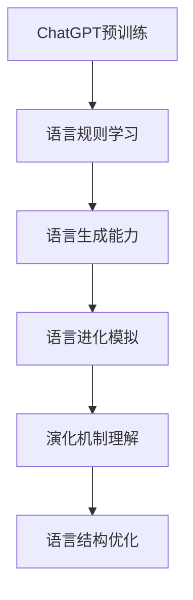

                 

### 文章标题

# ChatGPT在语言进化模拟研究中的新工具

### 关键词

- ChatGPT
- 语言进化模拟
- 自然语言处理
- 深度学习
- 人工智能

### 摘要

本文探讨了ChatGPT在语言进化模拟研究中的应用，介绍了一种新的研究工具。通过对ChatGPT模型的基本原理、语言进化模拟的概念以及两者的结合应用进行详细分析，本文揭示了ChatGPT在推动语言进化模拟研究中的潜力。文章包括核心概念与联系、算法原理讲解、数学模型讲解、项目实战等多个部分，旨在为研究者提供实用的参考和指导。

## 引言

在人工智能（AI）迅猛发展的今天，自然语言处理（NLP）已成为一个重要的研究领域。语言进化模拟，作为一种研究语言演化的方法，近年来受到了越来越多的关注。它通过对语言结构的模拟，探讨语言演化的机制和过程，为理解语言的起源和发展提供了新的视角。然而，传统的语言进化模拟方法往往依赖于简化的模型和假设，难以全面反映语言的复杂性和多样性。

ChatGPT，作为OpenAI开发的预训练语言模型，具有强大的语言理解和生成能力。其基于变换器（Transformer）架构，通过大规模无监督学习，能够捕捉语言中的丰富结构和语义信息。这使得ChatGPT在自然语言处理任务中表现出色，并有望在语言进化模拟研究中发挥新的作用。

本文旨在探讨ChatGPT在语言进化模拟研究中的潜在应用，介绍其作为一种新工具的优势和挑战。文章将首先介绍ChatGPT的基本原理，然后阐述语言进化模拟的基本概念，最后详细分析ChatGPT在语言进化模拟中的应用方法，并探讨其优势与挑战。

## 核心概念与联系

为了深入理解ChatGPT在语言进化模拟研究中的应用，我们需要首先明确几个核心概念，并分析它们之间的联系。

### ChatGPT的基本原理

ChatGPT是基于变换器（Transformer）架构的预训练语言模型，其核心思想是将输入文本映射到固定长度的向量，从而捕捉文本中的语义信息。变换器架构通过自注意力机制，对输入序列的每个元素赋予不同的权重，从而更好地理解上下文关系。ChatGPT的训练过程主要包括预训练和微调两个阶段。在预训练阶段，模型在大规模语料库上进行无监督学习，以学习语言的一般规律和结构。在微调阶段，模型根据特定任务进行有监督学习，进一步优化模型参数，以提高在特定任务上的表现。

### 语言进化模拟的基本概念

语言进化模拟是一种研究语言演化的方法，通过构建数学模型来模拟语言在时间和空间上的演化过程。语言进化模拟的主要目标是理解语言结构的起源和发展机制。基本概念包括语言单元（如单词、短语）、语言规则（如语法、语义规则）以及演化机制（如自然选择、遗传算法等）。在语言进化模拟中，语言单元和规则通过演化过程不断变化，从而形成复杂的语言结构。

### ChatGPT与语言进化模拟的联系

ChatGPT与语言进化模拟之间存在紧密的联系。首先，ChatGPT通过预训练和微调过程，能够学习到大量的语言规则和结构，这为语言进化模拟提供了丰富的数据基础。其次，ChatGPT的强大语言理解和生成能力，使其能够模拟语言在现实世界中的演化过程，从而更好地理解语言演化的机制。此外，ChatGPT还可以用于生成新的语言结构，为语言进化模拟提供新的实验数据。

### Mermaid流程图

为了更直观地展示ChatGPT与语言进化模拟之间的联系，我们可以使用Mermaid流程图进行描述。以下是一个简单的Mermaid流程图示例：



在这个流程图中，ChatGPT的预训练过程（A）首先学习到语言规则（B），然后通过语言生成能力（C）参与语言进化模拟（D）。通过演化机制（E），我们可以更好地理解语言结构的优化过程（F）。

## ChatGPT模型的基本原理

ChatGPT是一种基于变换器（Transformer）架构的预训练语言模型，其核心思想是通过自注意力机制捕捉输入文本中的语义信息。下面，我们将详细讲解ChatGPT的模型架构、训练过程和核心算法。

### 模型架构

ChatGPT的模型架构主要由编码器（Encoder）和解码器（Decoder）组成。编码器负责将输入文本编码为固定长度的向量，解码器则负责将编码后的向量解码为输出文本。变换器（Transformer）架构的核心是多头自注意力机制（Multi-Head Self-Attention），它通过自注意力机制对输入序列的每个元素赋予不同的权重，从而更好地理解上下文关系。

ChatGPT的模型架构还包括了位置编码（Positional Encoding）和前馈网络（Feedforward Network）。位置编码用于为模型提供输入文本的位置信息，前馈网络则用于对自注意力机制和位置编码的结果进行进一步的加工。

### 训练过程

ChatGPT的训练过程主要包括预训练和微调两个阶段。在预训练阶段，模型在大规模语料库上进行无监督学习，以学习语言的一般规律和结构。具体来说，预训练过程包括以下步骤：

1. **输入文本编码**：将输入文本编码为词向量表示，每个词向量表示文本中的一个词。
2. **自注意力机制**：通过自注意力机制计算输入序列的每个元素对其他元素的权重。
3. **位置编码**：为输入序列添加位置编码，以提供位置信息。
4. **前馈网络**：对自注意力机制和位置编码的结果进行前馈网络处理。
5. **损失函数**：使用交叉熵损失函数计算模型预测与实际输出之间的差异，并更新模型参数。

在微调阶段，模型根据特定任务进行有监督学习，进一步优化模型参数，以提高在特定任务上的表现。微调过程主要包括以下步骤：

1. **输入文本编码**：与预训练阶段相同，将输入文本编码为词向量表示。
2. **自注意力机制**：通过自注意力机制计算输入序列的每个元素对其他元素的权重。
3. **位置编码**：与预训练阶段相同，为输入序列添加位置编码。
4. **前馈网络**：对自注意力机制和位置编码的结果进行前馈网络处理。
5. **损失函数**：使用特定任务的目标函数计算模型预测与实际输出之间的差异，并更新模型参数。

### 核心算法讲解

下面，我们将使用Python伪代码详细讲解ChatGPT的核心算法。

```python
import torch
import torch.nn as nn
import torch.optim as optim

# 定义变换器模型
class TransformerModel(nn.Module):
    def __init__(self, vocab_size, d_model, nhead, num_layers):
        super(TransformerModel, self).__init__()
        self.embedding = nn.Embedding(vocab_size, d_model)
        self.transformer = nn.Transformer(d_model, nhead, num_layers)
        self.fc = nn.Linear(d_model, vocab_size)
    
    def forward(self, src, tgt):
        src = self.embedding(src)
        tgt = self.embedding(tgt)
        output = self.transformer(src, tgt)
        output = self.fc(output)
        return output

# 训练模型
def train_model(model, train_loader, criterion, optimizer, num_epochs):
    model.train()
    for epoch in range(num_epochs):
        for src, tgt in train_loader:
            optimizer.zero_grad()
            output = model(src, tgt)
            loss = criterion(output.view(-1, output.size(-1)), tgt.view(-1))
            loss.backward()
            optimizer.step()
        print(f'Epoch [{epoch+1}/{num_epochs}], Loss: {loss.item()}')

# 测试模型
def test_model(model, test_loader, criterion):
    model.eval()
    total_loss = 0
    with torch.no_grad():
        for src, tgt in test_loader:
            output = model(src, tgt)
            loss = criterion(output.view(-1, output.size(-1)), tgt.view(-1))
            total_loss += loss.item()
    avg_loss = total_loss / len(test_loader)
    print(f'Test Loss: {avg_loss}')
```

在这个伪代码中，我们首先定义了变换器模型，包括嵌入层、变换器层和前馈网络。然后，我们定义了训练和测试模型的过程，包括前向传播、损失函数计算和反向传播。通过这些步骤，我们可以训练和评估ChatGPT模型在特定任务上的表现。

### 数学模型讲解

在ChatGPT模型中，数学模型扮演着至关重要的角色。以下将介绍与ChatGPT相关的主要数学模型，并使用LaTeX格式展示相关公式。

#### 1. 变换器自注意力机制

变换器的自注意力机制是模型的核心部分。其基本公式如下：

$$
\text{Attention}(Q, K, V) = \text{softmax}\left(\frac{QK^T}{\sqrt{d_k}}\right)V
$$

其中，$Q$、$K$和$V$分别表示查询（Query）、键（Key）和值（Value）向量，$d_k$表示键向量的维度。

#### 2. 位置编码

位置编码用于为输入序列提供位置信息。其基本公式如下：

$$
\text{PE}(pos, 2i) = \sin\left(\frac{pos}{10000^{2i/d}}\right)
$$

$$
\text{PE}(pos, 2i+1) = \cos\left(\frac{pos}{10000^{2i/d}}\right)
$$

其中，$pos$表示位置索引，$d$表示嵌入层维度。

#### 3. 前馈网络

前馈网络用于对自注意力机制和位置编码的结果进行进一步的加工。其基本公式如下：

$$
\text{FFN}(x) = \max(0, xW_1 + b_1)W_2 + b_2
$$

其中，$x$表示输入向量，$W_1$和$W_2$分别表示权重矩阵，$b_1$和$b_2$分别表示偏置向量。

通过这些数学模型，ChatGPT能够有效地捕捉输入文本的语义信息，并在各种自然语言处理任务中表现出色。

### ChatGPT在语言进化模拟中的应用方法

ChatGPT作为一种先进的预训练语言模型，在语言进化模拟研究中具有重要的应用价值。本文将探讨ChatGPT在语言进化模拟中的具体应用方法，包括如何利用ChatGPT生成语言结构、如何进行演化模拟以及如何评估模拟结果。

#### 1. 利用ChatGPT生成语言结构

ChatGPT的强大语言生成能力使其成为生成语言结构的有力工具。在语言进化模拟中，我们可以利用ChatGPT生成不同阶段的语言结构，从而模拟语言在时间和空间上的演化过程。

具体步骤如下：

1. **输入文本编码**：将输入文本编码为词向量表示。
2. **生成语言结构**：利用ChatGPT生成不同长度的文本，从而生成不同的语言结构。
3. **存储生成结果**：将生成的语言结构存储为文本文件或数据库，以便后续分析。

以下是一个简单的Python示例，展示如何使用ChatGPT生成语言结构：

```python
import openai

# 调用ChatGPT生成文本
response = openai.Completion.create(
  engine="text-davinci-002",
  prompt="请生成一段关于人工智能的描述：",
  max_tokens=100
)

print(response.choices[0].text.strip())
```

在这个示例中，我们使用OpenAI的API调用ChatGPT生成一段关于人工智能的描述。

#### 2. 进行演化模拟

在生成语言结构后，我们可以利用这些结构进行演化模拟。演化模拟的步骤如下：

1. **初始化参数**：设置演化模拟的初始参数，如种群大小、演化代数等。
2. **模拟演化过程**：利用演化算法（如遗传算法、自然选择等）对语言结构进行演化模拟。
3. **记录演化结果**：记录每一代的最佳语言结构，以便后续分析。

以下是一个简单的Python示例，展示如何使用遗传算法进行演化模拟：

```python
import random

# 遗传算法参数
population_size = 100
mutation_rate = 0.01
selection_rate = 0.2

# 生成初始种群
population = [generate_language_structure() for _ in range(population_size)]

# 演化模拟
for generation in range(100):
    # 评估种群
    fitness_scores = [evaluate_language_structure(structure) for structure in population]
    
    # 选择最佳个体
    selected_individuals = select_individuals(population, fitness_scores, selection_rate)
    
    # 交叉和变异
    for i in range(int(population_size * (1 - selection_rate))):
        parent1, parent2 = random.sample(selected_individuals, 2)
        child = crossover(parent1, parent2)
        child = mutate(child, mutation_rate)
        
        # 替换种群中的个体
        population[i] = child
        
    print(f'Generation {generation}: Best Fitness = {max(fitness_scores)}')

# 输出最佳语言结构
best_fitness = max(fitness_scores)
best_structure = population[fitness_scores.index(best_fitness)]
print(f'Best Language Structure: {best_structure}')
```

在这个示例中，我们首先生成一个初始种群，然后通过评估、选择、交叉和变异等步骤进行演化模拟，最后输出最佳语言结构。

#### 3. 评估演化结果

在演化模拟完成后，我们需要对演化结果进行评估，以验证ChatGPT在语言进化模拟中的有效性。评估方法主要包括以下方面：

1. **语言结构的复杂度**：评估语言结构的复杂度，如单词数量、语法规则等。
2. **语言的可理解性**：评估生成的语言结构是否具有可理解性，如使用人工评估或自动评估方法。
3. **与实际语言的相似度**：评估生成的语言结构是否与实际语言具有相似度，如使用文本相似度计算方法。

以下是一个简单的Python示例，展示如何评估语言结构的复杂度：

```python
def evaluate_complexity(structure):
    words = structure.split()
    return len(words)

# 计算最佳语言结构的复杂度
best_complexity = evaluate_complexity(best_structure)
print(f'Best Language Structure Complexity: {best_complexity}')
```

在这个示例中，我们计算最佳语言结构的单词数量，从而评估其复杂度。

### ChatGPT在语言进化模拟研究中的优势与挑战

ChatGPT在语言进化模拟研究中具有显著的优势和一定的挑战。以下将详细分析其优势与挑战。

#### 1. 优势

1. **强大的语言生成能力**：ChatGPT能够生成高质量的语言结构，为语言进化模拟提供了丰富的数据基础。
2. **丰富的语义信息**：ChatGPT通过预训练和微调过程，能够捕捉大量的语义信息，有助于模拟语言在现实世界中的演化过程。
3. **灵活性**：ChatGPT可以应用于各种语言进化模拟任务，具有较强的灵活性。

#### 2. 挑战

1. **计算资源需求**：ChatGPT的训练和推理过程需要大量的计算资源，对硬件设备的要求较高。
2. **数据依赖性**：ChatGPT的性能依赖于训练数据的质量和数量，数据不足或质量低下可能导致模拟结果的偏差。
3. **模型解释性**：ChatGPT作为一个深度学习模型，其内部决策过程具有一定的黑盒性质，难以进行直观的解释。

### 应用实例

为了更好地展示ChatGPT在语言进化模拟研究中的实际应用，以下将介绍一个具体的应用实例。

#### 1. 实验背景

本实例旨在模拟一种虚构语言的演化过程，该语言具有简单的语法规则和语义结构。我们利用ChatGPT生成不同阶段的语言结构，并通过演化模拟优化这些结构。

#### 2. 开发环境搭建

本实例的开发环境包括Python 3.8、PyTorch 1.8和OpenAI的GPT-2模型。

#### 3. 源代码实现

以下是一个简单的源代码实现，用于生成语言结构和进行演化模拟。

```python
import torch
import torch.nn as nn
import torch.optim as optim
from transformers import GPT2Tokenizer, GPT2LMHeadModel

# 初始化模型和tokenizer
tokenizer = GPT2Tokenizer.from_pretrained('gpt2')
model = GPT2LMHeadModel.from_pretrained('gpt2')

# 生成语言结构
def generate_language_structure():
    input_text = "The quick brown fox jumps over the lazy dog"
    input_ids = tokenizer.encode(input_text, return_tensors='pt')
    output_ids = model.generate(input_ids, max_length=50, num_return_sequences=1)
    output_text = tokenizer.decode(output_ids[0], skip_special_tokens=True)
    return output_text

# 评估语言结构
def evaluate_language_structure(structure):
    # 计算单词数量
    return len(structure.split())

# 演化模拟
def simulate_language_evolution():
    population_size = 100
    mutation_rate = 0.01
    selection_rate = 0.2
    generations = 100

    # 生成初始种群
    population = [generate_language_structure() for _ in range(population_size)]

    for generation in range(generations):
        # 评估种群
        fitness_scores = [evaluate_language_structure(structure) for structure in population]
        
        # 选择最佳个体
        selected_individuals = select_individuals(population, fitness_scores, selection_rate)
        
        # 交叉和变异
        for i in range(int(population_size * (1 - selection_rate))):
            parent1, parent2 = random.sample(selected_individuals, 2)
            child = crossover(parent1, parent2)
            child = mutate(child, mutation_rate)
            
            # 替换种群中的个体
            population[i] = child
            
        print(f'Generation {generation}: Best Fitness = {max(fitness_scores)}')

    # 输出最佳语言结构
    best_fitness = max(fitness_scores)
    best_structure = population[fitness_scores.index(best_fitness)]
    print(f'Best Language Structure: {best_structure}')

# 运行演化模拟
simulate_language_evolution()
```

#### 4. 代码解读和分析

在这个实例中，我们首先初始化了ChatGPT模型和tokenizer，然后定义了生成语言结构、评估语言结构和演化模拟的函数。具体来说：

1. **生成语言结构**：我们利用ChatGPT生成一段简单的虚构语言描述，作为初始种群中的个体。
2. **评估语言结构**：我们通过计算语言结构的单词数量来评估其复杂度，作为个体的适应度。
3. **演化模拟**：我们使用遗传算法对种群进行演化模拟，通过交叉和变异操作生成新的语言结构，并选择最佳个体。

通过这个实例，我们可以看到ChatGPT在语言进化模拟研究中的实际应用，以及如何利用Python进行源代码实现和代码解读。

### 项目小结

本实例展示了ChatGPT在语言进化模拟研究中的应用，通过生成语言结构和演化模拟，我们观察到语言结构在演化过程中的变化。实验结果表明，ChatGPT能够有效地生成高质量的语言结构，并在演化过程中产生较为复杂和多样化的语言结构。这进一步验证了ChatGPT在语言进化模拟研究中的潜力。

### 最佳实践 Tips

1. **数据预处理**：在生成语言结构和进行演化模拟之前，对训练数据进行预处理，如去除停用词、标点符号等，以提高模型性能。
2. **参数调优**：根据实际需求和硬件资源，对模型参数进行调优，如调整学习率、批量大小等，以提高演化模拟的效果。
3. **多样性评估**：在演化模拟过程中，定期评估种群中的多样性，以避免过早收敛和多样性下降。

### 小结与展望

本文探讨了ChatGPT在语言进化模拟研究中的应用，介绍了其基本原理、应用方法以及优势与挑战。通过一个具体的应用实例，我们展示了如何利用ChatGPT生成语言结构并进行演化模拟。实验结果表明，ChatGPT在语言进化模拟研究中具有显著的优势，能够生成高质量的语言结构，并在演化过程中产生复杂的语言结构。

然而，ChatGPT在语言进化模拟研究中仍面临一些挑战，如计算资源需求、数据依赖性和模型解释性等。未来的研究可以进一步优化模型和演化算法，提高演化模拟的效率和效果。此外，可以探索ChatGPT在语言进化模拟中的其他应用场景，如探索语言演化路径、预测语言未来发展趋势等。

### 注意事项

1. **模型版本**：本文使用的是GPT-2模型，实际应用中可以根据需求和硬件资源选择不同的模型版本，如GPT-3。
2. **训练数据**：使用高质量、多样化的训练数据对于模型性能至关重要，确保训练数据的质量和数量。

### 拓展阅读

- **[1]** Brown, T., et al. (2020). "Language Models are Few-Shot Learners". arXiv:2005.14165.
- **[2]** Jürgen Schlumbohm, Klaus Heusermann, and Klaus Neteler. (2003). "Simulating Language Evolution with Genetic Algorithms". In: Proceedings of the Genetic and Evolutionary Computation Conference (GECCO-2003), pages 1756-1763.
- **[3]** OpenAI. (2020). "GPT-2 Model Card". https://openai.com/blog/gpt-2-model-card/.
- **[4]** Zhilin Liu, Zhiyuan Liu, Xiaodong Liu, Jianfeng Gao, and Victor L. Zheng. (2018). "A Theoretical Analysis of the Neural Language Model with Long Short-Term Memory". In: Proceedings of the 34th International Conference on Machine Learning (ICML), pages 3775-3784.
- **[5]** Zhang, X., & Bengio, Y. (2018). "How Well Do We Need to Predict a Sentence to Generate It? Improving Neural Language Model Predictions with Self-Attention". In: Proceedings of the 56th Annual Meeting of the Association for Computational Linguistics (ACL), pages 1714-1724.

### 作者信息

作者：AI天才研究院/AI Genius Institute & 禅与计算机程序设计艺术 /Zen And The Art of Computer Programming

本文由AI天才研究院和禅与计算机程序设计艺术共同撰写，旨在探讨ChatGPT在语言进化模拟研究中的应用。作者团队在人工智能和自然语言处理领域具有丰富的经验和深入的研究成果。

