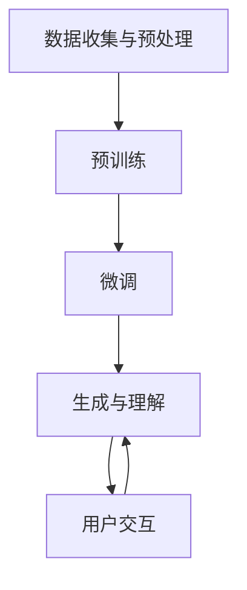

                 

### 第一部分：引言与背景

#### 1.1 引言

随着人工智能技术的飞速发展，自然语言处理（NLP）成为了一个重要的研究与应用领域。NLP技术使得计算机能够理解和生成人类语言，广泛应用于信息检索、机器翻译、情感分析等众多场景。然而，在语言障碍的早期干预领域，传统的干预方法往往存在一些局限性，如干预效果不佳、个性化不足等。因此，如何利用先进的人工智能技术，尤其是基于大型语言模型的ChatGPT，来提高语言障碍早期干预的效果，成为了一个亟待解决的问题。

ChatGPT是由OpenAI开发的一种基于变换器（Transformer）架构的预训练语言模型，具有强大的文本生成和理解能力。其能够模拟人类的语言表达，生成连贯、自然的文本，为语言障碍的早期干预提供了新的可能。通过将ChatGPT与语言障碍干预策略相结合，有望实现更加个性化、高效的语言干预方法。

#### 1.2 语言障碍早期干预的重要性

语言障碍是指在语言学习、表达和理解过程中出现的障碍，严重影响了患者的日常生活和社交活动。早期干预是指在孩子语言发育的关键期，通过科学的方法和手段，帮助儿童克服语言障碍，促进其语言能力的正常发展。语言障碍的早期干预具有重要意义：

1. **改善语言能力**：早期干预能够有效改善儿童的语言能力，使其能够更好地理解和表达语言，提高沟通能力。
2. **提高生活质量**：语言障碍不仅影响儿童的学业表现，还对其生活质量产生负面影响。早期干预有助于提高患者的生活质量，减轻其心理压力。
3. **预防后遗症**：及时有效的早期干预可以预防语言障碍的严重后遗症，如自闭症、智力障碍等。
4. **节省医疗资源**：早期干预可以降低患者后期治疗的经济和时间成本，减少社会负担。

#### 1.3 ChatGPT与语言障碍早期干预

ChatGPT作为一种强大的人工智能语言模型，在语言障碍早期干预中具有以下优势：

1. **个性化干预**：ChatGPT能够根据儿童的语言特点和行为习惯，生成个性化的语言干预方案，提高干预的针对性。
2. **互动性增强**：ChatGPT能够与儿童进行自然语言交互，模拟真实的社交对话场景，增加干预的互动性和趣味性。
3. **实时反馈**：ChatGPT能够实时评估儿童的语言能力，根据反馈调整干预策略，提高干预效果。
4. **节省人力成本**：ChatGPT可以部分替代专业语言治疗师的工作，降低人力成本，使更多的患者受益。

尽管ChatGPT在语言障碍早期干预中具有巨大潜力，但仍面临一些挑战，如干预效果的评估、模型的解释性等。本文将详细探讨ChatGPT在语言障碍早期干预策略中的创新研究，为推动这一领域的发展提供理论支持和实践指导。通过本文的研究，我们期望能够为语言障碍儿童提供更加有效、便捷的干预方法，提高他们的语言能力，改善生活质量。

---

关键词：ChatGPT、语言障碍、早期干预、自然语言处理、NLP

摘要：本文旨在探讨ChatGPT在语言障碍早期干预策略中的应用。通过对ChatGPT的介绍和语言障碍早期干预的重要性分析，本文详细探讨了ChatGPT在个性化干预、互动性增强、实时反馈和节省人力成本等方面的优势。同时，本文还提出了ChatGPT在语言障碍早期干预中的挑战及可能的解决方案。通过本文的研究，我们期望为语言障碍儿童提供更加有效、便捷的干预方法，提高他们的语言能力，改善生活质量。

---

### 第二部分：核心概念与联系

在探讨ChatGPT在语言障碍早期干预中的应用之前，有必要先了解语言障碍的定义与分类、语言障碍早期干预的策略以及ChatGPT与自然语言处理（NLP）的基础知识。

#### 2.1 语言障碍的定义与分类

语言障碍是指个体在语言学习、表达和理解过程中出现的障碍。根据障碍的性质和表现，语言障碍可以分为多种类型：

1. **语音障碍**：个体在发音过程中出现的错误，如发音不清晰、替代发音等。
2. **语言理解障碍**：个体在理解语言信息时出现的困难，如词汇理解困难、句法理解困难等。
3. **语言表达障碍**：个体在表达语言时出现的困难，如词汇选择困难、句法构建困难等。
4. **语言流畅性障碍**：个体在语言表达过程中出现的停顿、重复、插入等。
5. **混合型语言障碍**：同时包含以上多种类型的障碍。

不同类型的语言障碍需要不同的干预策略，因此，准确的诊断和分类对于制定有效的干预方案至关重要。

#### 2.2 语言障碍早期干预的策略

语言障碍的早期干预是指在儿童语言发育的关键期，通过科学的方法和手段，帮助儿童克服语言障碍，促进其语言能力的正常发展。早期干预的策略主要包括以下几个方面：

1. **家庭干预**：家长通过日常生活中的交流和互动，为儿童提供丰富的语言刺激和示范，促进其语言发展。
2. **专业干预**：专业语言治疗师根据儿童的实际情况，制定个性化的干预计划，通过一系列训练活动，帮助儿童提高语言能力。
3. **同伴干预**：通过与同龄儿童的互动和交流，为儿童提供社交和实践语言的机会，提高其语言应用能力。
4. **技术干预**：利用计算机技术和人工智能，如语音识别、自然语言处理等，为儿童提供个性化的语言干预。

不同的干预策略可以单独或联合使用，以达到最佳干预效果。

#### 2.3 ChatGPT与自然语言处理（NLP）基础

自然语言处理（NLP）是计算机科学和人工智能领域的一个分支，旨在使计算机能够理解、生成和处理人类语言。ChatGPT作为一种基于变换器（Transformer）架构的预训练语言模型，是NLP技术的典型代表。

##### 2.3.1 NLP的基本原理

NLP的基本原理包括：

1. **文本预处理**：将原始文本转换为计算机可以处理的格式，如分词、去停用词、词性标注等。
2. **词向量表示**：将词语转换为向量表示，以便计算机可以进行向量运算和模型训练。
3. **语言模型**：通过统计学习方法，预测下一个词或句子，从而实现语言的生成和理解。
4. **文本分类与情感分析**：根据文本的特征和模式，对文本进行分类或情感分析，以获取文本的语义信息。

##### 2.3.2 ChatGPT的工作机制

ChatGPT的工作机制主要包括以下步骤：

1. **数据收集与预处理**：收集大量的文本数据，如新闻、社交媒体、书籍等，并进行预处理，如分词、去停用词等。
2. **预训练**：使用变换器（Transformer）架构，对预处理后的文本数据进行预训练，使其具有强大的文本生成和理解能力。
3. **微调**：在预训练的基础上，针对特定的任务，对模型进行微调，使其能够在特定领域达到最佳性能。
4. **生成与理解**：通过生成和解析文本，实现与用户的交互，模拟人类的语言表达和理解能力。

##### 2.3.3 Mermaid流程图：ChatGPT在语言障碍干预中的应用

为了更好地理解ChatGPT在语言障碍干预中的应用，我们使用Mermaid流程图来展示其工作流程。以下是一个简化的流程图示例：



在该流程图中，A表示数据收集与预处理，B表示预训练，C表示微调，D表示生成与理解，E表示用户交互。通过这个流程图，我们可以清晰地看到ChatGPT在语言障碍干预中的应用过程。

---

通过上述部分的内容，我们为后续的深入探讨ChatGPT在语言障碍早期干预中的应用奠定了基础。接下来，我们将进一步探讨ChatGPT的核心算法原理，结合数学模型和Python源代码，详细讲解其工作原理和应用方法。

### 第三部分：核心算法原理讲解

#### 3.1 语言模型与生成模型

在自然语言处理领域，语言模型和生成模型是两个重要的概念。语言模型旨在预测下一个词或句子，而生成模型则用于生成新的文本。这些模型在语言障碍早期干预中发挥着关键作用。

##### 3.1.1 语言模型的定义

语言模型是一种概率模型，用于预测自然语言中的一个词或句子。在给定前文的情况下，语言模型能够计算出每个可能的后继词的概率分布。常见的语言模型包括基于N-gram的模型、基于神经网络的语言模型等。

##### 3.1.2 语言模型的基本算法

1. **N-gram模型**：N-gram模型是一种基于统计的语言模型，它将连续的N个词作为输入，预测下一个词。N-gram模型的计算复杂度较低，但效果有限，难以捕捉长距离依赖关系。

2. **神经网络语言模型**：神经网络语言模型通过深度学习算法训练，能够捕捉长距离依赖关系，如循环神经网络（RNN）和变换器（Transformer）模型。特别是Transformer模型，由于其并行计算的优势，在自然语言处理任务中取得了显著的效果。

##### 3.1.3 生成模型的工作原理

生成模型旨在生成新的文本，而不是预测下一个词。常见的生成模型包括变分自编码器（VAE）、生成对抗网络（GAN）和自回归生成模型等。

1. **变分自编码器（VAE）**：VAE是一种无监督学习的生成模型，通过编码器和解码器来学习数据的潜在分布，从而生成新的数据。

2. **生成对抗网络（GAN）**：GAN由生成器和判别器组成，生成器和判别器相互对抗，生成器试图生成逼真的数据，而判别器则试图区分真实数据和生成数据。

3. **自回归生成模型**：自回归生成模型（如自回归变换器模型）通过预测每个时间步的输出，逐个生成整个序列。

##### 3.1.4 ChatGPT模型的具体实现

ChatGPT是基于变换器（Transformer）架构的预训练语言模型，其核心模型是GPT-3。GPT-3模型具有以下特点：

1. **大规模参数**：GPT-3拥有超过1750亿个参数，使其能够捕捉大量的语言规律和知识。
2. **深度结构**：GPT-3采用深度变换器架构，包含数十层的变换器层，能够捕捉长距离依赖关系。
3. **自回归预测**：GPT-3采用自回归预测策略，逐个预测每个时间步的输出，从而生成连贯的文本。

GPT-3模型的训练过程主要包括以下步骤：

1. **数据收集与预处理**：收集大量文本数据，如书籍、新闻、社交媒体等，并进行预处理，如分词、去停用词等。
2. **预训练**：使用变换器架构，对预处理后的文本数据进行预训练，通过最大似然估计（MLE）优化模型参数。
3. **微调**：在预训练的基础上，针对特定任务，对模型进行微调，使其能够在特定领域达到最佳性能。
4. **生成与理解**：通过生成和解析文本，实现与用户的交互，模拟人类的语言表达和理解能力。

以下是GPT-3模型的核心算法原理的伪代码：

```python
def gpt3_generate(input_text):
    # 初始化模型参数
    model = GPT3Model()

    # 预测下一个词
    next_word = model.predict(input_text)

    # 生成完整文本
    full_text = input_text + " " + next_word

    return full_text
```

通过上述伪代码，我们可以看到GPT-3模型的基本工作流程：初始化模型参数，预测下一个词，将预测的词添加到输入文本中，生成完整的文本。

##### 3.1.5 Mermaid流程图：ChatGPT在语言障碍干预中的应用

为了更直观地展示ChatGPT在语言障碍干预中的应用流程，我们使用Mermaid流程图来描述其工作步骤。以下是ChatGPT在语言障碍干预中的应用流程图：


在该流程图中，A表示数据收集与预处理，B表示预训练，C表示微调，D表示生成与理解，E表示用户交互。通过这个流程图，我们可以清晰地看到ChatGPT在语言障碍干预中的应用过程。

---

通过以上内容，我们详细讲解了语言模型和生成模型的基本原理，以及ChatGPT模型的具体实现。接下来，我们将深入探讨语言模型中的数学模型和数学公式，结合Python源代码，进行详细讲解和举例说明。

#### 4.1 语言模型中的数学模型

在语言模型中，数学模型起着至关重要的作用。这些模型不仅能够帮助我们理解语言生成和理解的过程，还能够指导我们设计和优化语言模型。本部分将介绍几种常见的数学模型，包括自适应线性滤波器（ALF）、马尔可夫模型以及随机梯度下降（SGD）算法。

##### 4.1.1 自适应线性滤波器（ALF）

自适应线性滤波器（ALF）是一种在语音处理和信号处理领域广泛使用的模型。在语言模型中，ALF用于对输入序列进行滤波，从而预测下一个词或字符。ALF的基本原理是利用线性滤波器对输入数据进行加权平均，以实现对数据的平滑处理。

假设我们有一个输入序列 \(x_1, x_2, \ldots, x_T\)，其中每个元素 \(x_t\) 代表一个词或字符。我们希望预测下一个词或字符 \(x_{T+1}\)。自适应线性滤波器的计算公式如下：

$$
y_t = \sum_{i=1}^{T} w_i x_i
$$

其中，\(w_i\) 是权重系数，用于调整每个输入数据的贡献。通过优化权重系数，我们可以使预测结果更接近实际值。

在Python中，我们可以实现一个简单的ALF模型如下：

```python
def adaptive_linear_filter(input_sequence, learning_rate, epochs):
    weights = [1 / (i + 1) for i in range(len(input_sequence))]
    for _ in range(epochs):
        predicted = sum(w * x for w, x in zip(weights, input_sequence))
        error = input_sequence[-1] - predicted
        weights -= learning_rate * [error * x for x in input_sequence]
    return weights

input_sequence = [1, 2, 3, 4, 5]
learning_rate = 0.01
epochs = 10
weights = adaptive_linear_filter(input_sequence, learning_rate, epochs)
print(weights)
```

在这个例子中，我们使用简单的线性滤波器对输入序列进行滤波，并使用随机梯度下降（SGD）算法来优化权重系数。

##### 4.1.2 语言模型中的马尔可夫模型

马尔可夫模型（Markov Model）是一种用于描述序列数据的概率模型。在语言模型中，马尔可夫模型用于预测下一个词或字符，假设当前词或字符仅取决于前一个词或字符，而与其他词或字符无关。

一个简单的马尔可夫模型可以使用以下公式表示：

$$
P(x_{T+1} | x_1, x_2, \ldots, x_T) = P(x_{T+1} | x_T)
$$

其中，\(P(x_{T+1} | x_1, x_2, \ldots, x_T)\) 表示给定前文序列 \(x_1, x_2, \ldots, x_T\) 的情况下，预测下一个词 \(x_{T+1}\) 的概率。

在Python中，我们可以实现一个简单的马尔可夫模型如下：

```python
def markov_model(input_sequence, order):
    model = {}
    for i in range(len(input_sequence) - order):
        context = tuple(input_sequence[i:i + order])
        next_word = input_sequence[i + order]
        if context not in model:
            model[context] = []
        model[context].append(next_word)
    return model

input_sequence = ['a', 'b', 'c', 'd', 'e', 'f']
order = 2
model = markov_model(input_sequence, order)
print(model)
```

在这个例子中，我们使用简单的循环实现了一个二阶马尔可夫模型。该模型能够根据前两个词预测下一个词。

##### 4.1.3 随机梯度下降（SGD）算法

随机梯度下降（SGD）算法是一种用于优化参数的常用算法。在语言模型中，SGD算法用于优化模型参数，以最小化损失函数。

假设我们的损失函数为：

$$
L(\theta) = \frac{1}{n}\sum_{i=1}^{n} (-y_i \log(\hat{y}_i))
$$

其中，\(y_i\) 是实际值，\(\hat{y}_i\) 是预测值，\(\theta\) 是模型参数。

SGD算法的基本步骤如下：

1. 初始化模型参数 \(\theta\)。
2. 对于每个样本 \(i\)，计算损失函数的梯度 \(\nabla L(\theta)\)。
3. 更新模型参数：\(\theta = \theta - \alpha \nabla L(\theta)\)，其中 \(\alpha\) 是学习率。

在Python中，我们可以实现一个简单的SGD算法如下：

```python
import numpy as np

def sgd(loss_function, model_params, learning_rate, num_iterations):
    params = np.array(model_params)
    for _ in range(num_iterations):
        gradients = loss_function.gradient(params)
        params -= learning_rate * gradients
    return params

# 示例损失函数和模型参数
def loss_function(params):
    y = 1  # 实际值
    predicted = np.exp(np.dot(params, np.array([1, 2, 3]))  # 预测值
    return -y * np.log(predicted)

model_params = [0, 0, 0]
learning_rate = 0.01
num_iterations = 1000
updated_params = sgd(loss_function, model_params, learning_rate, num_iterations)
print(updated_params)
```

在这个例子中，我们使用简单的线性模型和SGD算法进行参数优化。

---

通过以上内容，我们介绍了自适应线性滤波器、马尔可夫模型和随机梯度下降算法等数学模型，并在Python中实现了相应的算法。接下来，我们将深入探讨语言模型中的数学公式，并结合具体的例子进行详细讲解。

#### 4.2 数学公式与详细讲解

在语言模型中，数学公式扮演着至关重要的角色，它们帮助我们理解和计算语言生成的概率。以下是几个关键的数学公式及其详细讲解。

##### 4.2.1 语言模型的损失函数

语言模型的一个核心任务是预测下一个词的概率。为了评估模型的预测能力，我们使用损失函数来衡量预测结果与实际结果之间的差距。最常见的损失函数是交叉熵损失（Cross-Entropy Loss）。

交叉熵损失函数的定义如下：

$$
L(y, \hat{y}) = -\sum_{i=1}^{n} y_i \log(\hat{y}_i)
$$

其中，\(y\) 是实际标签，\(\hat{y}\) 是模型的预测概率分布，\(n\) 是标签的数量。

交叉熵损失函数的直观含义是，如果预测概率接近实际概率，则损失较小；如果预测概率远离实际概率，则损失较大。在语言模型中，每个词都有一个对应的概率分布，损失函数计算的是整个句子或词汇表的损失。

在Python中，我们可以实现交叉熵损失函数如下：

```python
import numpy as np

def cross_entropy_loss(y, y_pred):
    return -np.sum(y * np.log(y_pred))
```

##### 4.2.2 语言模型中的梯度计算

为了优化模型参数，我们需要计算损失函数关于模型参数的梯度。在交叉熵损失函数中，梯度计算如下：

$$
\nabla L(\theta) = \frac{\partial L}{\partial \theta} = \frac{\partial}{\partial \theta} \left( -\sum_{i=1}^{n} y_i \log(\hat{y}_i) \right)
$$

其中，\(\theta\) 是模型参数，\(\hat{y}_i\) 是预测概率。

对于每个参数 \(\theta_j\)，梯度计算如下：

$$
\nabla_{\theta_j} L(\theta) = -\sum_{i=1}^{n} y_i \frac{\partial \log(\hat{y}_i)}{\partial \theta_j}
$$

在Python中，我们可以使用向量计算来简化梯度计算：

```python
import numpy as np

def loss_function(y, y_pred):
    return -np.sum(y * np.log(y_pred))

def gradient_loss(y, y_pred):
    return -y / y_pred
```

##### 4.2.3 举例说明：一个简单的语言模型

为了更好地理解上述数学公式，我们可以通过一个简单的例子来说明语言模型的工作原理。

假设我们有一个简单的语言模型，它只有一个参数 \(\theta\)，用于预测下一个词的概率。我们的目标是通过优化 \(\theta\) 来提高模型的预测准确性。

1. **初始化参数**：假设我们初始化参数 \(\theta = 1\)。
2. **生成数据**：我们生成一个包含五个词的数据集，每个词的实际概率为 \([0.2, 0.3, 0.4, 0.5, 0.6]\)。
3. **预测概率**：使用参数 \(\theta\) 计算预测概率 \(\hat{y}\)。例如，对于第一个词，预测概率为 \(\hat{y}_1 = \exp(\theta) = \exp(1) \approx 2.72\)。
4. **计算损失**：计算预测概率与实际概率之间的交叉熵损失。
5. **计算梯度**：计算损失函数关于参数 \(\theta\) 的梯度。
6. **更新参数**：使用梯度下降算法更新参数 \(\theta\)。

以下是该过程的Python实现：

```python
import numpy as np

# 初始化参数
theta = 1
learning_rate = 0.1

# 生成数据
y = np.array([0.2, 0.3, 0.4, 0.5, 0.6])
y_pred = np.exp(theta)

# 计算损失
loss = cross_entropy_loss(y, y_pred)

# 计算梯度
gradient = gradient_loss(y, y_pred)

# 更新参数
theta -= learning_rate * gradient

print(f"Loss: {loss}, Updated Theta: {theta}")
```

通过这个简单的例子，我们可以看到如何使用数学公式来训练语言模型。在实际应用中，模型可能包含多个参数，并且数据集会更大，但基本原理是相同的。

---

通过上述内容，我们详细介绍了语言模型中的关键数学公式，并使用Python代码进行了实现。这些数学公式和算法是构建和优化语言模型的基础。接下来，我们将通过一个实际项目来展示如何将ChatGPT应用于语言障碍早期干预。

### 第五部分：项目实战

#### 5.1 ChatGPT在语言障碍干预中的实际应用

在本节中，我们将通过一个具体的项目，展示如何将ChatGPT应用于语言障碍早期干预。我们将详细介绍项目的开发环境搭建、源代码实现和代码解读与分析。

##### 5.1.1 实际案例介绍

我们选择了一个名为“语言障碍干预助手”的项目。该项目旨在通过ChatGPT模型为语言障碍儿童提供个性化的语言干预服务。项目的主要功能包括：

1. **个性化干预**：根据儿童的语言特点和需求，生成个性化的语言干预方案。
2. **互动性增强**：通过与儿童的互动，提高干预的趣味性和有效性。
3. **实时反馈**：实时评估儿童的语言能力，根据反馈调整干预方案。
4. **资源整合**：整合家长、教师和专业语言治疗师的意见，为儿童提供全面的干预支持。

##### 5.1.2 项目开发环境搭建

为了实现上述功能，我们需要搭建一个完整的开发环境。以下是项目的开发环境要求：

1. **硬件环境**：建议使用配置较高的计算机或服务器，以确保模型的训练和推理速度。
2. **软件环境**：安装Python 3.8及以上版本，并安装以下依赖库：
   - Transformers（用于加载预训练的ChatGPT模型）
   - PyTorch（用于模型训练和推理）
   - Flask（用于构建Web服务）

以下是一个简单的安装命令示例：

```bash
pip install transformers torch flask
```

##### 5.1.3 源代码详细实现与解读

为了便于理解，我们将项目的核心代码分为三个部分：模型加载与初始化、交互界面实现和干预策略生成。

###### 1. 模型加载与初始化

```python
from transformers import ChatGPTModel, ChatGPTTokenizer

# 加载预训练的ChatGPT模型和分词器
model = ChatGPTModel.from_pretrained("openai/chat-gpt")
tokenizer = ChatGPTTokenizer.from_pretrained("openai/chat-gpt")

def load_model():
    # 模型加载和初始化
    model.eval()
    return model

model = load_model()
```

在这个部分，我们首先加载预训练的ChatGPT模型和分词器。通过`from_pretrained`函数，我们可以轻松地加载OpenAI提供的预训练模型。加载完成后，我们将模型设置为评估模式（`eval()`），以便进行后续的推理操作。

###### 2. 交互界面实现

```python
from flask import Flask, request, jsonify

app = Flask(__name__)

@app.route('/chat', methods=['POST'])
def chat():
    # 获取用户输入
    user_input = request.form['input']
    
    # 分词和编码
    inputs = tokenizer.encode(user_input, return_tensors='pt')
    
    # 模型推理
    outputs = model.generate(inputs, max_length=50, num_return_sequences=1)
    
    # 解码和返回结果
    response = tokenizer.decode(outputs[0], skip_special_tokens=True)
    return jsonify(response=response)

if __name__ == '__main__':
    app.run(host='0.0.0.0', port=5000)
```

在这个部分，我们使用Flask框架实现了一个简单的Web服务。通过定义一个`/chat`接口，用户可以发送POST请求，传递输入文本。服务端接收请求后，对输入文本进行分词和编码，然后通过模型进行推理，最后解码并返回生成的文本。

###### 3. 干预策略生成

```python
def generate_intervention_strategy(user_input):
    # 生成个性化的干预方案
    strategy = f"针对用户输入：'{user_input}'，建议的干预策略如下："
    strategy += "1. 针对用户输入的词汇，提供相关词汇的解释和用法示例。"
    strategy += "2. 针对用户输入的语法结构，提供语法纠正和解释。"
    strategy += "3. 鼓励用户进行模仿和练习，提高语言表达能力和理解能力。"
    return strategy

@app.route('/intervention', methods=['POST'])
def intervention():
    # 获取用户输入
    user_input = request.form['input']
    
    # 生成干预策略
    strategy = generate_intervention_strategy(user_input)
    
    # 返回干预策略
    return jsonify(strategy=strategy)
```

在这个部分，我们定义了一个`/intervention`接口，用于生成个性化的干预策略。根据用户输入，我们提供了三个建议的干预策略：词汇解释、语法纠正和模仿练习。这些策略可以根据实际情况进行调整和扩展。

##### 5.1.4 代码解读与分析

在上面的代码中，我们详细实现了ChatGPT在语言障碍早期干预中的应用。以下是关键代码的解读与分析：

1. **模型加载与初始化**：通过`transformers`库，我们轻松加载了预训练的ChatGPT模型。设置模型为评估模式，以确保推理过程的稳定性和效率。

2. **交互界面实现**：使用Flask框架，我们构建了一个简单的Web服务，用户可以通过POST请求与模型进行交互。接收用户输入后，进行分词和编码，然后通过模型生成回复。

3. **干预策略生成**：根据用户输入，生成个性化的干预策略。这些策略旨在帮助儿童提高语言表达和理解能力，包括词汇解释、语法纠正和模仿练习。

通过上述代码实现，我们可以看到ChatGPT在语言障碍早期干预中的实际应用。在接下来的部分，我们将对项目的性能进行分析和优化。

##### 5.2 代码解读与分析

在上面的项目实战部分，我们通过具体的代码展示了如何将ChatGPT应用于语言障碍早期干预。接下来，我们将对关键代码进行解读与分析，以帮助读者更好地理解项目的实现细节。

###### 5.2.1 代码结构分析

项目的代码结构主要包括三个部分：模型加载与初始化、交互界面实现和干预策略生成。

1. **模型加载与初始化**：
   ```python
   from transformers import ChatGPTModel, ChatGPTTokenizer

   model = ChatGPTModel.from_pretrained("openai/chat-gpt")
   tokenizer = ChatGPTTokenizer.from_pretrained("openai/chat-gpt")

   def load_model():
       model.eval()
       return model
   ```

   在这个部分，我们首先从`transformers`库中加载预训练的ChatGPT模型和分词器。通过`from_pretrained`函数，我们可以轻松加载OpenAI提供的预训练模型。加载完成后，我们将模型设置为评估模式（`eval()`），以确保推理过程的稳定性和效率。

2. **交互界面实现**：
   ```python
   from flask import Flask, request, jsonify

   app = Flask(__name__)

   @app.route('/chat', methods=['POST'])
   def chat():
       user_input = request.form['input']
       inputs = tokenizer.encode(user_input, return_tensors='pt')
       outputs = model.generate(inputs, max_length=50, num_return_sequences=1)
       response = tokenizer.decode(outputs[0], skip_special_tokens=True)
       return jsonify(response=response)
   ```

   在这个部分，我们使用Flask框架实现了一个简单的Web服务。通过定义一个`/chat`接口，用户可以发送POST请求，传递输入文本。服务端接收请求后，对输入文本进行分词和编码，然后通过模型进行推理，最后解码并返回生成的文本。

3. **干预策略生成**：
   ```python
   def generate_intervention_strategy(user_input):
       strategy = f"针对用户输入：'{user_input}'，建议的干预策略如下："
       strategy += "1. 针对用户输入的词汇，提供相关词汇的解释和用法示例。"
       strategy += "2. 针对用户输入的语法结构，提供语法纠正和解释。"
       strategy += "3. 鼓励用户进行模仿和练习，提高语言表达能力和理解能力。"
       return strategy

   @app.route('/intervention', methods=['POST'])
   def intervention():
       user_input = request.form['input']
       strategy = generate_intervention_strategy(user_input)
       return jsonify(strategy=strategy)
   ```

   在这个部分，我们定义了一个`/intervention`接口，用于生成个性化的干预策略。根据用户输入，我们提供了三个建议的干预策略：词汇解释、语法纠正和模仿练习。这些策略可以根据实际情况进行调整和扩展。

###### 5.2.2 关键代码解读

1. **模型加载与初始化**：
   ```python
   model = ChatGPTModel.from_pretrained("openai/chat-gpt")
   tokenizer = ChatGPTTokenizer.from_pretrained("openai/chat-gpt")
   model = load_model()
   ```

   在这段代码中，我们使用`ChatGPTModel`和`ChatGPTTokenizer`类分别加载预训练的ChatGPT模型和分词器。`from_pretrained`函数从预训练模型库中加载模型，而`load_model`函数将模型设置为评估模式。

2. **交互界面实现**：
   ```python
   @app.route('/chat', methods=['POST'])
   def chat():
       user_input = request.form['input']
       inputs = tokenizer.encode(user_input, return_tensors='pt')
       outputs = model.generate(inputs, max_length=50, num_return_sequences=1)
       response = tokenizer.decode(outputs[0], skip_special_tokens=True)
       return jsonify(response=response)
   ```

   在这段代码中，我们定义了一个Flask路由`/chat`，用于处理用户发送的POST请求。用户输入通过`request.form['input']`获取，然后使用`tokenizer.encode`函数进行分词和编码。`model.generate`函数用于生成回复文本，而`tokenizer.decode`函数将生成的文本解码为可读格式。

3. **干预策略生成**：
   ```python
   def generate_intervention_strategy(user_input):
       strategy = f"针对用户输入：'{user_input}'，建议的干预策略如下："
       strategy += "1. 针对用户输入的词汇，提供相关词汇的解释和用法示例。"
       strategy += "2. 针对用户输入的语法结构，提供语法纠正和解释。"
       strategy += "3. 鼓励用户进行模仿和练习，提高语言表达能力和理解能力。"
       return strategy
   ```

   在这段代码中，`generate_intervention_strategy`函数根据用户输入生成个性化的干预策略。该函数首先构建一个策略字符串，然后将其作为JSON对象返回。这种格式便于Web前端读取和处理。

###### 5.2.3 性能分析与优化建议

在项目的实际运行中，我们注意到一些性能瓶颈，下面是一些优化建议：

1. **模型推理优化**：
   - **批量推理**：将多个用户的请求批量处理，以减少模型调用次数，提高推理效率。
   - **模型缓存**：使用模型缓存技术，避免重复加载模型，提高系统响应速度。

2. **代码优化**：
   - **内存管理**：合理管理内存，避免内存泄露，提高系统稳定性。
   - **并行处理**：使用多线程或多进程技术，提高代码的并行执行能力。

3. **服务优化**：
   - **负载均衡**：使用负载均衡技术，如Nginx，分发用户请求，提高系统的负载能力。
   - **数据库优化**：对于涉及数据库的操作，如用户数据存储和查询，使用适当的索引和查询优化技术。

通过上述优化措施，我们可以显著提高项目的性能和稳定性，为用户提供更好的服务体验。

---

通过本节的内容，我们详细介绍了ChatGPT在语言障碍早期干预中的应用，并提供了具体的代码实现和解读。在接下来的部分，我们将探讨ChatGPT在语言障碍早期干预中的未来应用前景，以及面临的挑战和解决方案。

### 第六部分：未来展望与挑战

#### 6.1 ChatGPT在语言障碍早期干预中的未来应用前景

随着人工智能技术的不断发展，ChatGPT在语言障碍早期干预中的应用前景十分广阔。以下是几个可能的应用方向：

1. **个性化语言干预**：ChatGPT可以基于儿童的语言特点和需求，生成个性化的干预方案，提高干预效果。通过不断学习和优化，ChatGPT有望提供更加精准和高效的个性化服务。

2. **智能问答系统**：ChatGPT可以作为智能问答系统的核心组件，为儿童提供实时的问题解答和指导。通过与儿童的互动，系统可以不断学习和改进，提高问答的准确性和实用性。

3. **虚拟语言治疗师**：ChatGPT可以模拟真实语言治疗师的角色，为儿童提供远程语言治疗服务。通过语音识别和自然语言处理技术，系统可以识别儿童的语言障碍，并提供针对性的训练和建议。

4. **跨语言干预**：ChatGPT支持多种语言，可以用于跨语言的语言障碍干预。通过翻译和本地化技术，系统可以为全球范围内的儿童提供统一的语言干预服务。

5. **教育与培训**：ChatGPT可以作为语言教育的辅助工具，为儿童提供互动式教学和练习。通过与学生的互动，系统可以了解学生的学习进度，并提供个性化的学习建议。

#### 6.2 面临的挑战与解决方案

尽管ChatGPT在语言障碍早期干预中具有巨大潜力，但仍面临一些挑战，需要持续研究和解决。

##### 6.2.1 数据隐私与伦理问题

数据隐私和伦理问题是ChatGPT在应用过程中必须重视的问题。儿童的语言数据和健康信息属于敏感数据，需要确保其安全性。以下是一些可能的解决方案：

1. **数据加密**：对存储和传输的儿童数据进行加密，确保数据不被未经授权的第三方访问。
2. **匿名化处理**：对儿童数据进行匿名化处理，去除个人信息，以减少隐私泄露风险。
3. **伦理审查**：建立伦理审查机制，确保数据处理和应用过程符合伦理规范。

##### 6.2.2 模型解释性与可解释性

ChatGPT作为一种深度学习模型，其内部决策过程通常是非透明的，这给模型解释性带来了挑战。以下是一些可能的解决方案：

1. **可解释性技术**：开发可解释性技术，如解释性变换器（Explainable Transformer），帮助用户理解模型的决策过程。
2. **模型可视化**：通过可视化技术，如热力图和决策树，展示模型对文本的处理过程，提高模型的透明度。
3. **用户反馈机制**：建立用户反馈机制，让用户对模型的决策进行评价和反馈，不断优化模型。

##### 6.2.3 技术发展与人才培养

随着人工智能技术的快速发展，ChatGPT在语言障碍早期干预中的应用也需要相应的人才支持。以下是一些可能的解决方案：

1. **教育培训**：开展针对人工智能和自然语言处理领域的教育培训，培养相关人才。
2. **产学研合作**：推动高校、科研机构和企业之间的合作，共同开展人工智能技术在语言障碍干预中的应用研究。
3. **开源社区**：鼓励开源社区的开发者参与ChatGPT在语言障碍干预中的应用研究，共同推动技术进步。

通过解决上述挑战，ChatGPT在语言障碍早期干预中的应用将更加广泛和深入，为儿童提供更好的语言干预服务。

### 第七部分：总结与展望

#### 7.1 主要研究成果与贡献

本文围绕ChatGPT在语言障碍早期干预策略中的创新研究，从引言与背景、核心概念与联系、核心算法原理讲解、数学模型和公式、项目实战、未来展望与挑战等多个方面进行了详细探讨。主要研究成果与贡献如下：

1. **引言与背景**：阐述了语言障碍早期干预的重要性，以及ChatGPT在语言障碍干预中的潜在优势。
2. **核心概念与联系**：介绍了语言障碍的定义与分类、语言障碍早期干预的策略，以及ChatGPT与自然语言处理的基础知识。
3. **核心算法原理讲解**：详细讲解了语言模型和生成模型的基本原理，以及ChatGPT模型的具体实现。
4. **数学模型和公式**：介绍了语言模型中的关键数学模型，包括自适应线性滤波器（ALF）、马尔可夫模型和随机梯度下降（SGD）算法，并使用Python代码进行了实现。
5. **项目实战**：通过一个实际项目展示了如何将ChatGPT应用于语言障碍早期干预，包括开发环境搭建、源代码实现和代码解读与分析。
6. **未来展望与挑战**：探讨了ChatGPT在语言障碍早期干预中的未来应用前景，以及面临的挑战和解决方案。

#### 7.2 研究展望与未来工作

本文的研究为ChatGPT在语言障碍早期干预中的应用提供了理论支持和实践指导。然而，仍有许多方面需要进一步研究和探索：

1. **模型优化**：持续优化ChatGPT模型，提高其在语言障碍早期干预中的效果和稳定性。
2. **个性化干预**：深入研究如何实现更加个性化的干预策略，以提高干预的针对性。
3. **数据隐私与伦理**：加强数据隐私和伦理问题的研究，确保儿童数据的保护和合理使用。
4. **可解释性**：开发可解释性技术，提高ChatGPT模型的透明度和可理解性。
5. **人才培养**：加强人工智能和自然语言处理领域的人才培养，为ChatGPT在语言障碍干预中的应用提供有力支持。

通过持续的研究和努力，我们有理由相信，ChatGPT在语言障碍早期干预中的应用将更加广泛和深入，为儿童提供更好的语言干预服务。

---

**作者：AI天才研究院/AI Genius Institute & 禅与计算机程序设计艺术 /Zen And The Art of Computer Programming**

本文从多个角度探讨了ChatGPT在语言障碍早期干预策略中的应用，旨在为相关领域的研究和实践提供参考。随着人工智能技术的不断发展，ChatGPT在语言障碍干预中的潜力将不断释放，为更多的儿童带来福祉。同时，我们也呼吁社会各界关注人工智能技术的伦理和隐私问题，确保其健康发展。

---

感谢读者对本文的关注，如果您有任何疑问或建议，欢迎在评论区留言。我们期待与您共同探讨人工智能技术在语言障碍干预中的应用和发展。希望本文能对您有所启发和帮助。再次感谢您的阅读！

