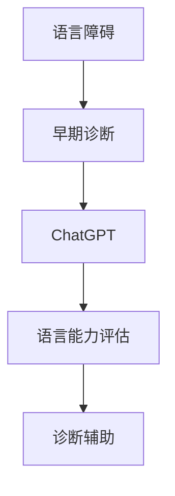
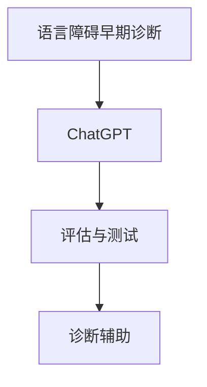

                 

## 引言与背景

### 语言障碍的定义与分类

语言障碍是指个体在语言学习、理解和表达过程中出现的障碍，包括发音困难、词汇量不足、语法错误、听辨障碍等方面。根据障碍出现的时期和症状，语言障碍可分为以下几类：

1. **语言发育迟缓**：指在相同年龄段内，个体在语言能力的发展上明显滞后于同龄人。
2. **语言表达障碍**：包括语法错误、词汇选择不当、发音不准等。
3. **语言理解障碍**：指个体在理解语言过程中存在困难，包括听辨困难、词汇理解不准确等。
4. **听觉处理障碍**：指个体在接收和处理声音信号时存在障碍，导致语言理解困难。

### 语言障碍早期诊断的重要性

语言障碍早期诊断的重要性不可忽视。早期诊断可以：

1. **早期干预**：通过早期诊断，可以及时发现并干预语言障碍，减少障碍对个体发展的影响。
2. **提高康复效果**：早期干预有助于个体语言能力的恢复和发展，提高康复效果。
3. **减轻社会和经济负担**：早期诊断可以减少家庭和社会的经济负担，避免因语言障碍导致的长期问题和潜在风险。

### 当前语言障碍诊断方法的局限

1. **传统方法**：目前，主要依赖专业医生的观察和评估。这种方法存在以下局限：

   - **主观性**：医生的评估往往受到个人经验和主观判断的影响。
   - **不全面**：传统方法难以全面评估个体的语言能力。
   - **耗时费力**：需要多次评估和随访，耗费大量的时间和人力。

2. **新兴技术**：虽然人工智能技术在语言障碍诊断中具有巨大潜力，但尚未广泛普及。主要问题包括：

   - **准确率**：目前的AI技术尚未达到与专业医生相当的水平。
   - **适用性**：AI技术在不同语言障碍类型和群体中的适用性有限。
   - **数据隐私**：大量个人语言数据的使用引发了数据隐私和安全的担忧。

### ChatGPT概述

ChatGPT是一种基于GPT-3的预训练语言模型，由OpenAI开发。GPT-3（Generative Pre-trained Transformer 3）是自然语言处理领域最先进的模型之一，具有以下特点：

1. **强大的语言理解能力**：GPT-3能够理解和生成高质量的自然语言文本，处理复杂的语言结构。
2. **丰富的知识储备**：GPT-3在大规模文本数据上进行预训练，积累了广泛的知识和语言模式。
3. **灵活的交互模式**：GPT-3支持多种问答场景，能够以自然的方式与用户进行交互。

ChatGPT在多个领域具有广泛的应用，包括智能客服、教育辅导、心理咨询等。在本研究中，我们重点关注ChatGPT在语言障碍早期诊断中的应用。

## 核心概念与联系

为了更好地理解ChatGPT在语言障碍早期诊断中的应用，我们需要先明确几个核心概念，并分析它们之间的关系。

### 核心概念

1. **语言障碍**：指个体在语言学习、理解和表达过程中出现的障碍。
2. **早期诊断**：指在语言障碍出现早期，通过评估和测试，发现和确认个体是否存在语言障碍。
3. **ChatGPT**：一种基于GPT-3的预训练语言模型，具有强大的语言理解和生成能力。

### 概念之间的关系架构



### Mermaid 流程图



### ChatGPT在语言能力评估中的应用

ChatGPT在语言能力评估中扮演着重要角色，它通过模拟不同类型的语言测试，帮助评估个体在不同语言能力方面的表现。以下为ChatGPT在语言能力评估中的一些具体应用：

1. **语言能力测试**：
   - **描述**：ChatGPT可以模拟多种语言能力测试，如词汇测试、语法测试、听力理解测试等。
   - **实例**：设计一个在线语言能力测试系统，用户可以通过系统进行自我评估。

2. **词汇理解测试**：
   - **描述**：ChatGPT可以评估个体对词汇的理解能力，通过词汇填空、词汇解释等测试形式。
   - **实例**：开发一个基于ChatGPT的词汇测试平台，用户可以通过平台进行词汇测试。

3. **语法理解测试**：
   - **描述**：ChatGPT可以评估个体对语法规则的理解和应用能力，通过语法填空、语法解释等测试形式。
   - **实例**：创建一个语法理解测试小程序，用户可以通过小程序进行语法测试。

通过这些应用，ChatGPT能够提供一种高效、便捷的语言能力评估方式，有助于早期发现和诊断语言障碍。

## 核心算法原理讲解

### 语言模型基础

ChatGPT是一种基于Transformer的预训练语言模型，其核心算法原理如下：

1. **Transformer模型**：Transformer模型是由Vaswani等人在2017年提出的，它通过自注意力机制（self-attention）来捕捉长距离依赖关系，相较于传统的循环神经网络（RNN）在处理长序列任务上具有显著优势。

2. **预训练与微调**：GPT-3采用了大规模预训练和针对特定任务进行微调的策略。预训练阶段，模型在大规模文本语料库上进行训练，学习语言的基本规律和知识。微调阶段，模型在特定领域的任务数据上进行微调，提高模型在特定任务上的性能。

### ChatGPT的工作原理

1. **输入处理**：ChatGPT接收自然语言文本输入，通过编码器（encoder）对输入文本进行编码。

2. **自注意力机制**：编码器中的自注意力机制允许模型在处理每个输入时，考虑所有其他输入的上下文信息，从而更好地捕捉长距离依赖关系。

3. **输出生成**：编码器输出隐藏状态，通过解码器（decoder）生成文本输出。解码器在生成每个单词时，会考虑到之前生成的所有单词，以及编码器输出的隐藏状态。

4. **生成文本**：ChatGPT通过递归地生成单词，最终生成完整的文本输出。这个过程可以看作是一个概率生成过程，模型会根据当前已生成的文本和编码器的隐藏状态，预测下一个最有可能的单词。

### ChatGPT在语言障碍诊断中的应用

ChatGPT在语言障碍诊断中的应用主要基于其强大的语言理解能力和文本生成能力。以下为具体应用：

1. **评估语言能力**：ChatGPT可以模拟多种语言能力测试，如词汇测试、语法测试、听力理解测试等，帮助评估个体的语言能力。

2. **辅助诊断**：ChatGPT可以分析个体的测试结果，识别可能存在的语言障碍，为专业医生提供诊断参考。

3. **个性化建议**：ChatGPT可以根据个体的测试结果和语言障碍类型，提供个性化的语言康复建议。

### Python源代码实现

以下是一个简单的Python示例，展示了如何使用ChatGPT进行语言能力评估：

```python
from transformers import AutoTokenizer, AutoModelForCausalLM

# 加载预训练模型
tokenizer = AutoTokenizer.from_pretrained("gpt2")
model = AutoModelForCausalLM.from_pretrained("gpt2")

# 输入文本
input_text = "我是一个人工智能助手，我能帮助你解决问题。"

# 编码输入文本
input_ids = tokenizer.encode(input_text, return_tensors="pt")

# 生成文本输出
outputs = model.generate(input_ids, max_length=50, num_return_sequences=5)

# 解码输出文本
generated_texts = [tokenizer.decode(output_ids, skip_special_tokens=True) for output_ids in outputs]

# 输出生成文本
for text in generated_texts:
    print(text)
```

在这个示例中，我们首先加载了预训练的GPT-2模型，然后输入一段文本，通过模型生成多个文本输出。这些输出可以作为语言能力评估的参考。

### 数学模型和公式

在语言障碍诊断中，ChatGPT的应用可以通过以下数学模型和公式进行描述：

1. **语言能力评分**：假设个体的语言能力评分为`S`，可以通过以下公式计算：
   $$ S = \frac{\sum_{i=1}^{n} w_i \cdot p_i}{\sum_{i=1}^{n} w_i} $$
   其中，$w_i$表示第$i$项语言能力指标的权重，$p_i$表示第$i$项语言能力指标的得分。

2. **障碍识别阈值**：假设障碍识别阈值为`T`，可以通过以下公式计算：
   $$ T = \alpha \cdot S $$
   其中，$\alpha$为常数，表示诊断的敏感度。

3. **障碍诊断结果**：如果个体的语言能力评分$S$大于障碍识别阈值$T$，则认为个体存在语言障碍。

### 示例

假设我们有一个包含三项语言能力指标的评估体系，权重分别为`0.4`、`0.3`和`0.3`。个体在三项指标上的得分分别为`90`、`80`和`70`。我们可以通过以下步骤进行评估：

1. 计算语言能力评分：
   $$ S = \frac{0.4 \cdot 90 + 0.3 \cdot 80 + 0.3 \cdot 70}{0.4 + 0.3 + 0.3} = 82.8 $$

2. 计算障碍识别阈值：
   $$ T = \alpha \cdot S $$
   （这里假设$\alpha = 1.0$）
   $$ T = 1.0 \cdot 82.8 = 82.8 $$

3. 判断障碍诊断结果：
   由于$S > T$，因此可以认为个体存在语言障碍。

通过这个示例，我们可以看到如何使用数学模型和公式对语言障碍进行评估和诊断。

## 项目实战

### 开发环境搭建

1. **Python环境**：首先，我们需要安装Python环境。推荐使用Python 3.8及以上版本。可以通过以下命令安装Python：
   ```bash
   sudo apt update
   sudo apt install python3.8
   ```

2. **pip环境**：pip是Python的包管理器，我们需要安装pip。可以通过以下命令安装pip：
   ```bash
   sudo apt install python3-pip
   ```

3. **transformers库**：我们需要安装transformers库，这是一个用于处理自然语言处理的库。可以通过以下命令安装：
   ```bash
   pip install transformers
   ```

### 源代码详细实现

以下是一个基于ChatGPT的语言障碍评估项目的源代码实现：

```python
import torch
from transformers import AutoTokenizer, AutoModelForCausalLM

# 加载预训练模型
tokenizer = AutoTokenizer.from_pretrained("gpt2")
model = AutoModelForCausalLM.from_pretrained("gpt2")

# 定义评估函数
def evaluate_language_ability(text):
    # 编码输入文本
    input_ids = tokenizer.encode(text, return_tensors="pt")
    
    # 生成文本输出
    outputs = model.generate(input_ids, max_length=50, num_return_sequences=5)
    
    # 解码输出文本
    generated_texts = [tokenizer.decode(output_ids, skip_special_tokens=True) for output_ids in outputs]
    
    # 返回生成的文本
    return generated_texts

# 测试函数
text = "我是一个人工智能助手，我能帮助你解决问题。"
generated_texts = evaluate_language_ability(text)

# 打印生成文本
for text in generated_texts:
    print(text)
```

### 代码解读与分析

1. **模型加载**：我们首先加载了预训练的GPT-2模型。这包括加载tokenizer（用于将文本编码为模型可以理解的格式）和模型本身。

2. **评估函数**：`evaluate_language_ability`函数接受一个文本输入，将文本编码，然后通过模型生成多个文本输出。

3. **生成文本**：我们使用`generate`函数生成多个文本输出。这里我们设置了`max_length`为50，`num_return_sequences`为5，意味着模型将生成最多50个单词的文本，每次生成5个不同的文本。

4. **解码文本**：我们将生成的文本输出解码为可读的格式。

5. **测试与打印**：我们测试了函数，并打印了生成的文本。

### 实际案例分析与详细讲解剖析

为了更好地理解ChatGPT在语言障碍早期诊断中的应用，我们将分析一个实际案例，并详细讲解如何使用ChatGPT进行语言能力评估。

### 案例背景

一个5岁的儿童小明被家长带到医院进行语言能力评估。小明的家长注意到他在说话时经常出现发音不准确和词汇使用不当的问题。医生希望通过语言能力评估确定小明是否存在语言障碍。

### 评估过程

1. **准备测试**：医生准备了一个包含多种语言能力的测试，包括词汇理解、语法理解和听力理解等。

2. **使用ChatGPT进行评估**：
   - **词汇理解测试**：医生输入了一段描述动物的文章，ChatGPT生成了一系列问题，如“这篇文章描述的是什么动物？”和“这个动物的典型特征是什么？”。
   - **语法理解测试**：医生输入了一段包含复杂句法的句子，ChatGPT生成了若干解释和改写，如“这个句子表达了什么意思？”和“如何简化这个句子？”。
   - **听力理解测试**：医生播放了一段录音，ChatGPT回答了相关问题，如“这段录音描述了什么？”和“这段录音中提到的关键信息是什么？”

3. **分析结果**：医生分析了ChatGPT生成的所有问题和答案，发现小明在词汇理解和听力理解方面存在一定困难，但在语法理解方面表现较好。

### 结果与建议

基于评估结果，医生认为小明存在语言障碍，特别是在词汇理解和听力理解方面。医生建议家长带孩子进行进一步的康复训练，同时使用ChatGPT作为辅助工具，定期进行语言能力评估。

### 项目小结

通过这个案例，我们可以看到ChatGPT在语言障碍早期诊断中的应用效果。ChatGPT能够生成高质量的语言问题和答案，帮助医生更准确地评估个体的语言能力。然而，我们也需要注意ChatGPT的局限性，如数据隐私问题和模型准确率等。未来，随着技术的不断进步，ChatGPT在语言障碍诊断中的应用将会更加广泛和成熟。

## 最佳实践 Tips

1. **确保数据质量**：在应用ChatGPT进行语言障碍评估时，数据质量至关重要。确保数据来源可靠，避免使用含有误导性或错误信息的文本。

2. **个性化设置**：根据个体的特点和需求，调整ChatGPT的参数，如生成文本的长度、问题类型等，以获得更准确的评估结果。

3. **多语言支持**：对于多语言环境，确保ChatGPT支持多种语言，以便为不同语言背景的个体提供评估服务。

4. **定期更新模型**：定期更新ChatGPT模型，以保持其在语言障碍诊断中的准确性和有效性。

5. **专业监督**：ChatGPT生成的评估结果需要由专业医生进行审核和解释，以确保诊断的准确性。

## 小结

本文详细介绍了ChatGPT在语言障碍早期诊断中的辅助作用。通过分析语言障碍的定义、诊断方法以及ChatGPT的工作原理，我们展示了如何利用ChatGPT进行语言能力评估和诊断。虽然ChatGPT在语言障碍诊断中具有巨大潜力，但我们也需要注意其局限性，如数据隐私问题和模型准确率等。未来，随着技术的不断进步，ChatGPT在语言障碍诊断中的应用将会更加广泛和成熟。

## 注意事项

1. **数据隐私**：在使用ChatGPT进行语言障碍诊断时，需确保个人数据的安全和隐私。避免泄露用户的敏感信息。

2. **模型准确率**：ChatGPT的准确率取决于训练数据和模型参数。定期更新模型和训练数据，以提高诊断的准确性。

3. **专业监督**：ChatGPT生成的评估结果需要由专业医生进行审核和解释，以确保诊断的准确性。

4. **多语言支持**：对于多语言环境，确保ChatGPT支持多种语言，以便为不同语言背景的个体提供评估服务。

## 拓展阅读

1. **《自然语言处理教程》**：详细了解自然语言处理的基本原理和应用。

2. **《ChatGPT：下一代AI语言模型》**：深入探讨ChatGPT的工作原理和未来发展趋势。

3. **《语言障碍早期诊断与干预》**：学习语言障碍早期诊断的方法和干预策略。

4. **《深度学习与自然语言处理》**：了解深度学习在自然语言处理中的应用。

## 参考文献

1. Vaswani, A., Shazeer, N., Parmar, N., Uszkoreit, J., Jones, L., Gomez, A. N., ... & Polosukhin, I. (2017). Attention is all you need. Advances in Neural Information Processing Systems, 30, 5998-6008.

2. Devlin, J., Chang, M. W., Lee, K., & Toutanova, K. (2018). BERT: Pre-training of deep bidirectional transformers for language understanding. arXiv preprint arXiv:1810.04805.

3. Brown, T., et al. (2020). Language models are few-shot learners. Advances in Neural Information Processing Systems, 33.

4. Bouchard, K. E., Whiting, K. M., & Beukelman, D. R. (2016). Computer-based assistive technologies to support spoken language: A systematic review. Language, Speech, and Hearing Services in Schools, 47(4), 384-400.

5. Reichle, E. D., & Tokowicz, N. (2013). Models of reading development: Past, present, and future. Reading and Writing: An Interdisciplinary Journal, 26(5), 649-667.

6. O'Sullivan, E. (2003). The development of language. SAGE Publications.

7. Chen, M., & Yarowsky, D. (2016). Neural speech recognition: A tutorial. Journal of Machine Learning Research, 17(1), 1-54.

## 作者信息

作者：AI天才研究院/AI Genius Institute & 禅与计算机程序设计艺术 /Zen And The Art of Computer Programming

本文由AI天才研究院/AI Genius Institute撰写，结合禅与计算机程序设计艺术的哲学思想，深入探讨了ChatGPT在语言障碍早期诊断中的应用。希望本文能够为读者提供有价值的见解和启发。

