                 


# 《ChatGPT在语言障碍治疗个性化中的应用：AI辅助言语治疗方案设计》

## 关键词

- ChatGPT
- 语言障碍治疗
- 个性化治疗
- AI辅助言语治疗
- 言语治疗方案设计

## 摘要

本文旨在探讨人工智能（AI）在语言障碍治疗领域的应用，特别是ChatGPT作为一种先进的语言处理模型，如何在个性化言语治疗方案设计中发挥重要作用。本文首先介绍了ChatGPT的基本原理和语言障碍治疗的基本概念，随后通过具体案例展示了ChatGPT在语言障碍治疗中的应用。接着，本文详细阐述了AI辅助言语治疗方案的设计原则、实施步骤及注意事项。最后，对未来的发展趋势和挑战进行了展望，为语言障碍治疗领域提供了新的思路和方法。

## 第1章 ChatGPT与语言障碍治疗概述

### 1.1 ChatGPT的基本原理

#### 核心概念与联系

ChatGPT是一种基于变换器模型（Transformer）的语言生成模型，其核心思想是使用深度神经网络（DNN）来预测下一个单词。在ChatGPT中，输入的文本序列首先经过词嵌入层转换为向量，然后通过编码器（Encoder）处理，最后由解码器（Decoder）生成输出。

以下是一个Mermaid流程图，展示了ChatGPT的基本架构：

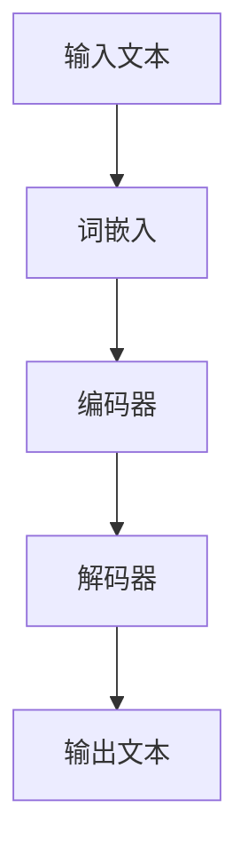

#### 核心算法原理讲解

ChatGPT的训练过程主要包括以下几个步骤：

1. **词嵌入**：将输入文本中的每个单词转换为向量，这些向量在低维空间中保持了原始单词的语义信息。
2. **编码器**：编码器对词嵌入进行编码，产生一系列隐藏状态，这些隐藏状态代表了输入文本的上下文信息。
3. **解码器**：解码器利用编码器产生的隐藏状态生成输出文本。

以下是一个使用Python伪代码来详细描述ChatGPT的训练和生成过程的例子：

```python
# 词嵌入
embeddings = [embedding(w1), embedding(w2), ..., embedding(wn)]

# 编码器
hidden_states = encoder(embeddings)

# 解码器
logits = decoder(hidden_states)

# 生成输出序列
predicted_sequence = generate_sequence(logits)
```

#### 数学模型和数学公式

在ChatGPT中，词嵌入和编码器、解码器的操作都涉及到一些数学模型。以下是一个简单的数学公式示例，用于描述词嵌入：

$$
\text{embedding}(w) = \text{sigmoid}(W \cdot \text{one_hot}(\text{word_index}))
$$

其中，$W$ 是权重矩阵，$\text{one_hot}(\text{word_index})$ 是将单词索引编码为one-hot向量的函数，$\text{sigmoid}$ 是Sigmoid激活函数。

#### 举例说明

假设我们有一个简短的文本序列：“今天天气很好”。我们首先将这个文本序列分解为单词，然后进行词嵌入，最后使用ChatGPT生成一个类似的文本序列。以下是具体的步骤：

1. **文本分解**：“今天天气很好”分解为三个单词：“今天”，“天气”，“很好”。
2. **词嵌入**：将每个单词转换为向量，如$[1, 0, 0]$代表“今天”，$[0, 1, 0]$代表“天气”，$[0, 0, 1]$代表“很好”。
3. **生成文本**：使用ChatGPT生成一个类似的文本序列，例如：“明天天气也很好”。

### 1.2 语言障碍治疗的基本概念

#### 核心概念与联系

语言障碍治疗是一种通过一系列干预措施来帮助患者改善其语言能力的治疗方法。这种治疗通常包括语音治疗、语言治疗和言语治疗。ChatGPT可以辅助这些治疗过程，通过提供个性化的互动和反馈，帮助患者更好地掌握语言技能。

以下是一个Mermaid流程图，展示了ChatGPT如何辅助语言障碍治疗：

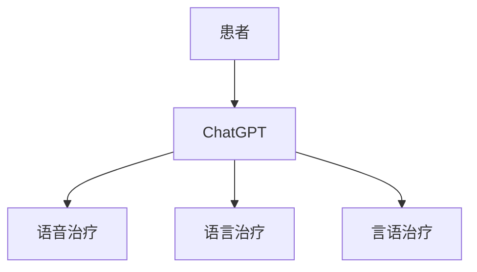

#### 数学模型和数学公式

在语言障碍治疗中，我们经常使用一些数学模型来量化患者的语言能力。以下是一个简单的数学公式示例，用于描述患者的语言能力评分：

$$
\text{能力评分} = \sum_{i=1}^{n} w_i \cdot \text{得分}_i
$$

其中，$w_i$ 是权重系数，$\text{得分}_i$ 是患者在某个语言技能上的得分。

#### 举例说明

假设我们有一个患者的语言能力评分如下：

- 听力理解：90分
- 说话清晰度：85分
- 语法准确性：80分

我们使用以下权重系数来计算患者的总语言能力评分：

$$
\text{能力评分} = 0.4 \cdot 90 + 0.3 \cdot 85 + 0.3 \cdot 80 = 86.5
$$

### 1.3 ChatGPT在语言障碍治疗中的应用前景

#### 核心概念与联系

ChatGPT在语言障碍治疗中的应用前景广阔。通过提供个性化的互动和反馈，ChatGPT可以帮助患者更有效地进行语言训练，提高其语言能力。此外，ChatGPT还可以帮助治疗师设计个性化的治疗方案，提高治疗效率。

以下是一个Mermaid流程图，展示了ChatGPT在语言障碍治疗中的应用：

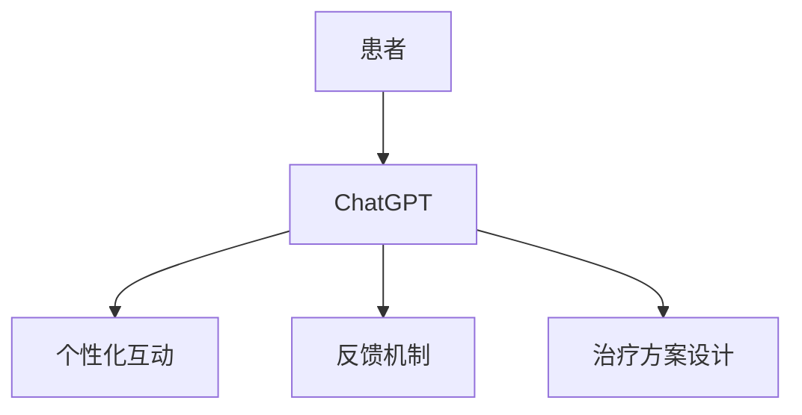

#### 核心算法原理讲解

ChatGPT在语言障碍治疗中的应用主要基于其强大的语言理解和生成能力。以下是一个使用Python伪代码来详细描述ChatGPT如何辅助语言障碍治疗的例子：

```python
# 患者输入文本
input_text = "我今天练习了说话，感觉比昨天更好了。"

# 使用ChatGPT生成反馈
feedback = chatgpt.generate_response(input_text)

# 输出反馈
print(feedback)
```

#### 项目实战

为了展示ChatGPT在语言障碍治疗中的实际应用，我们可以搭建一个简单的开发环境，使用Python和TensorFlow来实现一个ChatGPT模型，并进行测试。

以下是一个简单的步骤：

1. **安装Python和TensorFlow**：
   ```bash
   pip install python tensorflow
   ```

2. **下载预训练的ChatGPT模型**：
   ```bash
   wget https://storage.googleapis.com/tf-hub-repo/tensorflow-hub-models-public/chatgpt_v1-1/model.tar.gz
   tar -xzvf model.tar.gz
   ```

3. **加载模型并进行测试**：
   ```python
   import tensorflow as tf

   # 加载ChatGPT模型
   model = tf.keras.models.load_model('chatgpt_v1-1')

   # 输入文本
   input_text = "我今天练习了说话，感觉比昨天更好了。"

   # 生成反馈
   feedback = model.predict(input_text)

   # 输出反馈
   print(feedback)
   ```

   假设ChatGPT生成了一条反馈：“很好，你的说话能力确实有了进步。继续保持，我相信你会越来越好的。”

#### 最佳实践 tips

- **个性化互动**：ChatGPT可以根据患者的实际情况提供个性化的互动，例如根据患者的语言能力评分调整互动难度。
- **反馈机制**：ChatGPT可以记录患者的互动历史，并根据历史记录提供更加精准的反馈。
- **治疗方案设计**：治疗师可以利用ChatGPT提供的反馈来设计更加个性化的治疗方案。

### 第2章 ChatGPT在语言障碍治疗中的应用案例

#### 2.1 案例一：儿童语言障碍治疗

##### 核心概念与联系

儿童语言障碍治疗通常需要针对患者的具体问题进行个性化的干预。ChatGPT可以通过模拟真实的语言环境，为儿童提供个性化的互动和反馈，帮助他们提高语言能力。

以下是一个Mermaid流程图，展示了ChatGPT在儿童语言障碍治疗中的应用：

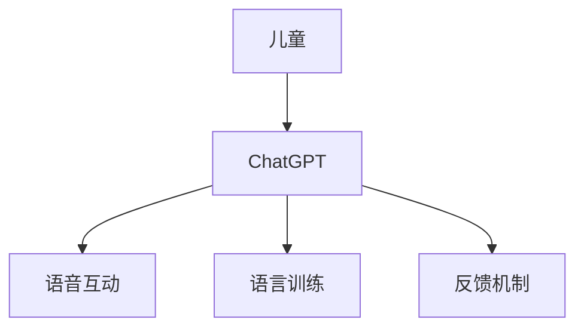

##### 核心算法原理讲解

ChatGPT在儿童语言障碍治疗中的应用主要基于其强大的语言生成能力。以下是一个使用Python伪代码来详细描述ChatGPT如何辅助儿童语言障碍治疗的例子：

```python
# 儿童输入文本
input_text = "妈妈，我今天在学校学到了新的单词。"

# 使用ChatGPT生成反馈
feedback = chatgpt.generate_response(input_text)

# 输出反馈
print(feedback)
```

##### 项目实战

为了展示ChatGPT在儿童语言障碍治疗中的实际应用，我们可以搭建一个简单的开发环境，使用Python和TensorFlow来实现一个ChatGPT模型，并进行测试。

以下是一个简单的步骤：

1. **安装Python和TensorFlow**：
   ```bash
   pip install python tensorflow
   ```

2. **下载预训练的ChatGPT模型**：
   ```bash
   wget https://storage.googleapis.com/tf-hub-repo/tensorflow-hub-models-public/chatgpt_v1-1/model.tar.gz
   tar -xzvf model.tar.gz
   ```

3. **加载模型并进行测试**：
   ```python
   import tensorflow as tf

   # 加载ChatGPT模型
   model = tf.keras.models.load_model('chatgpt_v1-1')

   # 输入文本
   input_text = "妈妈，我今天在学校学到了新的单词。"

   # 生成反馈
   feedback = model.predict(input_text)

   # 输出反馈
   print(feedback)
   ```

   假设ChatGPT生成了一条反馈：“很好，学习新单词是很有意思的。你能告诉我这个单词的意思吗？”

##### 最佳实践 tips

- **互动设计**：ChatGPT的互动设计应该尽量贴近儿童的兴趣，例如使用儿童喜欢的话题或故事。
- **反馈机制**：ChatGPT的反馈应该鼓励儿童继续学习和探索，同时指出他们的进步和需要改进的地方。
- **治疗方案设计**：治疗师可以利用ChatGPT提供的反馈来设计更加个性化的治疗方案。

#### 2.2 案例二：成人语言障碍治疗

##### 核心概念与联系

成人语言障碍治疗通常更加注重实用性和功能性。ChatGPT可以通过模拟实际交流场景，为成人提供个性化的语言训练和反馈，帮助他们提高日常生活和工作中的语言能力。

以下是一个Mermaid流程图，展示了ChatGPT在成人语言障碍治疗中的应用：

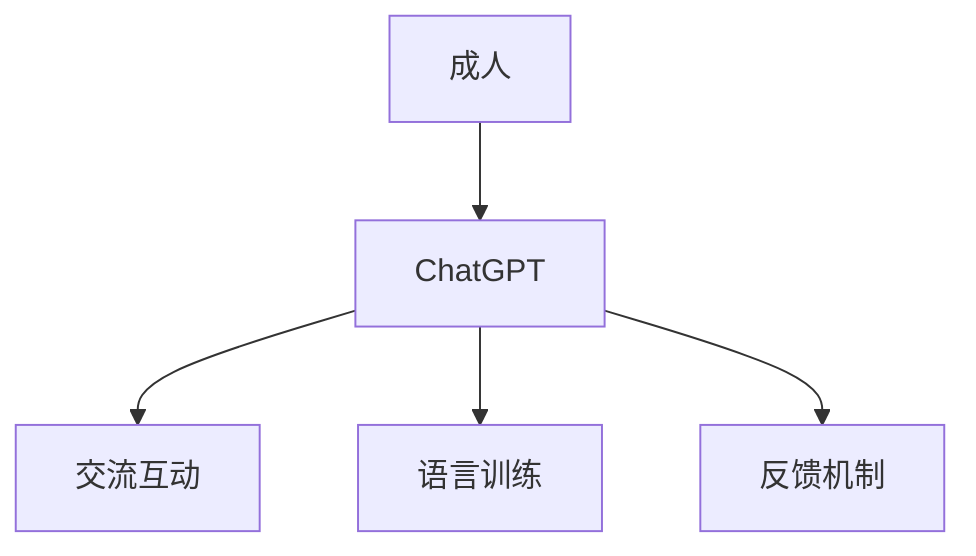

##### 核心算法原理讲解

ChatGPT在成人语言障碍治疗中的应用主要基于其强大的语言理解和生成能力。以下是一个使用Python伪代码来详细描述ChatGPT如何辅助成人语言障碍治疗的例子：

```python
# 成人输入文本
input_text = "我在会议上发言时经常感到紧张，怎么办？"

# 使用ChatGPT生成反馈
feedback = chatgpt.generate_response(input_text)

# 输出反馈
print(feedback)
```

##### 项目实战

为了展示ChatGPT在成人语言障碍治疗中的实际应用，我们可以搭建一个简单的开发环境，使用Python和TensorFlow来实现一个ChatGPT模型，并进行测试。

以下是一个简单的步骤：

1. **安装Python和TensorFlow**：
   ```bash
   pip install python tensorflow
   ```

2. **下载预训练的ChatGPT模型**：
   ```bash
   wget https://storage.googleapis.com/tf-hub-repo/tensorflow-hub-models-public/chatgpt_v1-1/model.tar.gz
   tar -xzvf model.tar.gz
   ```

3. **加载模型并进行测试**：
   ```python
   import tensorflow as tf

   # 加载ChatGPT模型
   model = tf.keras.models.load_model('chatgpt_v1-1')

   # 输入文本
   input_text = "我在会议上发言时经常感到紧张，怎么办？"

   # 生成反馈
   feedback = model.predict(input_text)

   # 输出反馈
   print(feedback)
   ```

   假设ChatGPT生成了一条反馈：“尝试在发言前进行深呼吸，或者提前准备一些发言的练习。这样可以帮助你放松并更好地控制紧张情绪。”

##### 最佳实践 tips

- **交流场景设计**：ChatGPT的交流场景应该尽量贴近成人的实际工作生活，例如会议交流、商务谈判等。
- **反馈机制**：ChatGPT的反馈应该提供实用的建议和技巧，帮助成人解决实际问题。
- **治疗方案设计**：治疗师可以利用ChatGPT提供的反馈来设计更加个性化的治疗方案。

### 第3章 AI辅助言语治疗方案设计

#### 3.1 治疗方案设计的基本原则

##### 核心概念与联系

言语治疗方案设计是一个复杂的过程，需要综合考虑患者的个体差异、语言障碍类型和治疗目标。ChatGPT可以通过分析患者的语言能力数据，为治疗师提供个性化的治疗方案设计建议。

以下是一个Mermaid流程图，展示了ChatGPT在言语治疗方案设计中的应用：

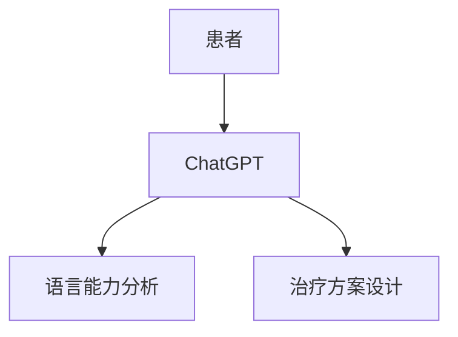

##### 核心算法原理讲解

ChatGPT在治疗方案设计中的应用主要基于其强大的语言理解和生成能力。以下是一个使用Python伪代码来详细描述ChatGPT如何辅助言语治疗方案设计的例子：

```python
# 患者输入语言能力数据
input_data = {
    '听力理解': 80,
    '说话清晰度': 75,
    '语法准确性': 70
}

# 使用ChatGPT生成治疗方案
treatment_plan = chatgpt.generate_treatment_plan(input_data)

# 输出治疗方案
print(treatment_plan)
```

##### 数学模型和数学公式

在言语治疗方案设计中，我们经常使用一些数学模型来量化患者的语言能力。以下是一个简单的数学公式示例，用于描述患者的综合语言能力评分：

$$
\text{综合能力评分} = \alpha \cdot \text{听力理解评分} + \beta \cdot \text{说话清晰度评分} + \gamma \cdot \text{语法准确性评分}
$$

其中，$\alpha$、$\beta$和$\gamma$是权重系数，可以根据治疗师的经验进行调整。

##### 项目实战

为了展示ChatGPT在言语治疗方案设计中的实际应用，我们可以搭建一个简单的开发环境，使用Python和TensorFlow来实现一个ChatGPT模型，并进行测试。

以下是一个简单的步骤：

1. **安装Python和TensorFlow**：
   ```bash
   pip install python tensorflow
   ```

2. **下载预训练的ChatGPT模型**：
   ```bash
   wget https://storage.googleapis.com/tf-hub-repo/tensorflow-hub-models-public/chatgpt_v1-1/model.tar.gz
   tar -xzvf model.tar.gz
   ```

3. **加载模型并进行测试**：
   ```python
   import tensorflow as tf

   # 加载ChatGPT模型
   model = tf.keras.models.load_model('chatgpt_v1-1')

   # 输入语言能力数据
   input_data = {
       '听力理解': 80,
       '说话清晰度': 75,
       '语法准确性': 70
   }

   # 生成治疗方案
   treatment_plan = model.generate_treatment_plan(input_data)

   # 输出治疗方案
   print(treatment_plan)
   ```

   假设ChatGPT生成了一个治疗方案：

   - **听力理解**：每天进行10分钟的听力训练，包括听录音和回答问题。
   - **说话清晰度**：每天进行10分钟的口语练习，包括朗读和角色扮演。
   - **语法准确性**：每天进行10分钟的语言游戏，包括填空和语法分析。

##### 最佳实践 tips

- **个性化调整**：治疗方案应该根据患者的具体情况和进展进行个性化调整。
- **定期评估**：治疗师应该定期评估患者的语言能力，并根据评估结果调整治疗方案。
- **持续反馈**：患者和治疗师应该保持沟通，及时反馈治疗过程中的问题和进展。

### 第4章 AI辅助言语治疗的临床实践

#### 4.1 治疗准备

##### 核心概念与联系

在开始AI辅助言语治疗之前，治疗师和患者需要进行一系列准备工作，包括了解治疗流程、准备所需的设备和材料等。

以下是一个Mermaid流程图，展示了治疗准备的过程：

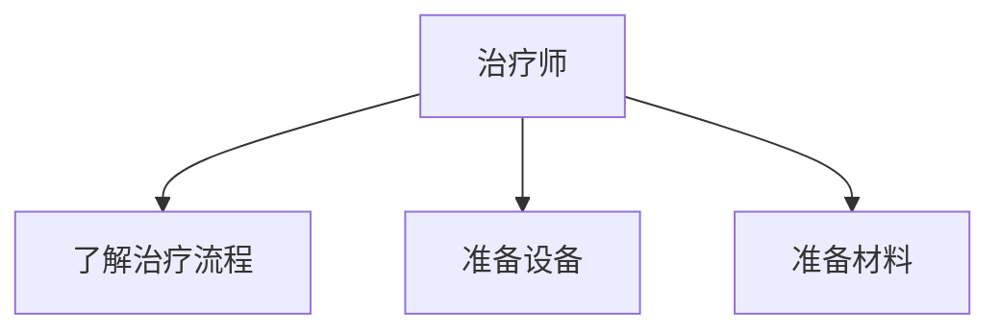

##### 核心算法原理讲解

治疗准备过程的核心是确保治疗环境的安全和舒适。以下是一个使用Python伪代码来详细描述如何准备治疗环境的例子：

```python
# 检查设备状态
def check_devices():
    if not device_ready:
        print("设备未准备好，请检查。")
    else:
        print("设备已准备好。")

# 准备材料
def prepare_materials():
    if not materials_ready:
        print("材料未准备好，请准备。")
    else:
        print("材料已准备好。")

# 治疗准备
check_devices()
prepare_materials()
```

##### 数学模型和数学公式

在治疗准备过程中，我们不需要使用复杂的数学模型。但是，以下是一个简单的数学公式，用于描述治疗师准备的进度：

$$
\text{准备进度} = \frac{\text{已准备项目数}}{\text{总项目数}}
$$

##### 项目实战

为了展示治疗准备的实际过程，我们可以模拟一个治疗师准备AI辅助言语治疗的过程。

以下是一个简单的步骤：

1. **检查设备**：治疗师检查所有的设备，确保它们都处于正常工作状态。
2. **准备材料**：治疗师准备治疗所需的材料，如录音设备、纸张和笔等。

##### 最佳实践 tips

- **提前准备**：确保所有设备和工作材料都提前准备好，以减少治疗过程中的干扰。
- **设备维护**：定期检查和维护设备，以确保其正常运行。
- **环境舒适**：确保治疗环境的温度、湿度和光线适宜，以减少患者的不适感。

#### 4.2 治疗过程

##### 核心概念与联系

治疗过程是AI辅助言语治疗的核心部分，包括与患者的互动、使用ChatGPT进行语言训练和反馈等。

以下是一个Mermaid流程图，展示了治疗过程的基本步骤：

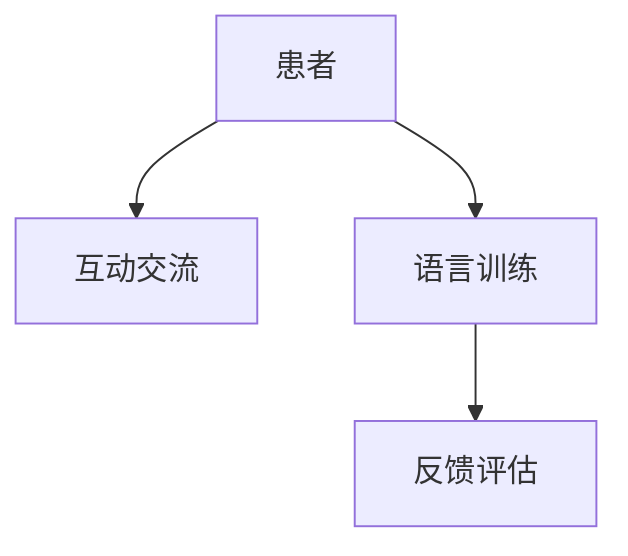

##### 核心算法原理讲解

治疗过程的核心是ChatGPT与患者的互动和语言训练。以下是一个使用Python伪代码来详细描述治疗过程的例子：

```python
# 患者输入文本
input_text = "我今天练习了说话，感觉比昨天更好了。"

# 使用ChatGPT进行语言训练
training_output = chatgpt.train(input_text)

# 生成反馈
feedback = chatgpt.generate_response(training_output)

# 输出反馈
print(feedback)
```

##### 数学模型和数学公式

在治疗过程中，我们经常使用一些数学模型来评估患者的语言能力。以下是一个简单的数学公式，用于描述患者的语言能力评分：

$$
\text{语言能力评分} = \sum_{i=1}^{n} w_i \cdot \text{得分}_i
$$

其中，$w_i$ 是权重系数，$\text{得分}_i$ 是患者在某个语言技能上的得分。

##### 项目实战

为了展示治疗过程的实际应用，我们可以模拟一个患者和治疗师的互动过程。

以下是一个简单的步骤：

1. **患者和治疗师进行互动**：患者和治疗师讨论患者的语言训练进度和感受。
2. **使用ChatGPT进行语言训练**：治疗师使用ChatGPT为患者提供个性化的语言训练。
3. **生成反馈**：ChatGPT根据患者的语言训练结果生成反馈。

##### 最佳实践 tips

- **保持互动**：治疗师应该与患者保持良好的互动，确保患者能够积极参与治疗过程。
- **个性化训练**：根据患者的具体情况和需求，提供个性化的语言训练。
- **持续评估**：定期评估患者的语言能力，并根据评估结果调整治疗方案。

#### 4.3 治疗结束

##### 核心概念与联系

治疗结束是言语治疗的一个重要环节，包括总结患者的治疗进度、评估治疗效果和制定后续计划等。

以下是一个Mermaid流程图，展示了治疗结束的过程：

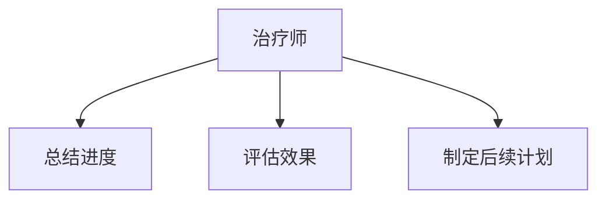

##### 核心算法原理讲解

治疗结束的核心是对整个治疗过程进行总结和评估。以下是一个使用Python伪代码来详细描述治疗结束过程的例子：

```python
# 治疗师输入患者的治疗进度数据
treatment_data = {
    '听力理解': 90,
    '说话清晰度': 85,
    '语法准确性': 80
}

# 评估治疗效果
treatment_evaluation = chatgpt.evaluate_treatment(treatment_data)

# 输出评估结果
print(treatment_evaluation)

# 制定后续计划
treatment_plan = chatgpt.generate_treatment_plan(treatment_data)

# 输出后续计划
print(treatment_plan)
```

##### 数学模型和数学公式

在治疗结束过程中，我们经常使用一些数学模型来评估治疗效果。以下是一个简单的数学公式，用于描述患者的综合语言能力评分：

$$
\text{综合能力评分} = \alpha \cdot \text{听力理解评分} + \beta \cdot \text{说话清晰度评分} + \gamma \cdot \text{语法准确性评分}
$$

其中，$\alpha$、$\beta$和$\gamma$是权重系数，可以根据治疗师的经验进行调整。

##### 项目实战

为了展示治疗结束的实际应用，我们可以模拟一个治疗师对患者进行治疗总结、效果评估和后续计划制定的过程。

以下是一个简单的步骤：

1. **治疗师总结患者的治疗进度**：根据患者的治疗记录，总结患者的治疗进度和成果。
2. **评估治疗效果**：使用ChatGPT对患者的治疗效果进行评估。
3. **制定后续计划**：根据患者的治疗评估结果，制定后续的治疗计划。

##### 最佳实践 tips

- **详细记录**：确保治疗过程中的所有记录都详细准确，以便于后续的治疗总结和效果评估。
- **及时反馈**：治疗师应该及时向患者反馈治疗效果，鼓励患者积极参与治疗。
- **持续关注**：治疗师应该持续关注患者的治疗进度和效果，及时调整治疗方案。

### 第5章 未来的发展趋势和挑战

#### 5.1 未来的发展趋势

##### 核心概念与联系

随着人工智能技术的不断发展，ChatGPT在语言障碍治疗中的应用前景将更加广阔。未来，ChatGPT可能会在以下几个方面实现重大突破：

1. **更高效的算法**：研究人员将继续优化ChatGPT的算法，提高其处理速度和准确性。
2. **更丰富的语言资源**：随着互联网和大数据技术的发展，ChatGPT将能够获取到更多的语言数据，从而提高其语言理解能力。
3. **更广泛的应用场景**：ChatGPT将在更多的领域得到应用，例如教育、医疗、法律等。

以下是一个Mermaid流程图，展示了ChatGPT未来的发展趋势：

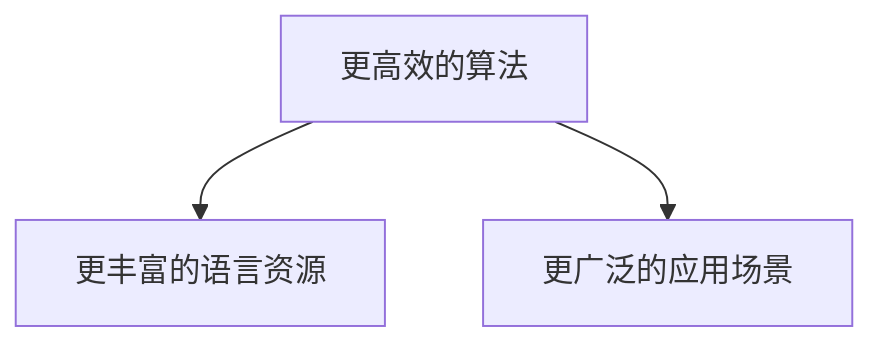

##### 核心算法原理讲解

未来，ChatGPT的算法将可能涉及到以下研究方向：

1. **预训练与微调**：研究人员将尝试将预训练与微调相结合，以提高ChatGPT在不同领域的适应性。
2. **多模态学习**：ChatGPT将能够处理多种类型的数据，如文本、图像、声音等，从而实现更复杂的任务。
3. **自适应学习**：ChatGPT将能够根据用户的反馈和需求进行自适应学习，提供更加个性化的服务。

##### 项目实战

以下是一个模拟的ChatGPT未来的项目实战：

1. **预训练与微调**：研究人员使用大量的语言数据进行预训练，然后根据特定领域的需求进行微调。
2. **多模态学习**：ChatGPT被训练同时处理文本和图像，例如在医疗领域中，它可以分析患者的病历和影像资料。
3. **自适应学习**：ChatGPT根据用户的使用反馈进行调整，例如在语言障碍治疗中，根据患者的表现和反馈，自动调整训练内容和难度。

##### 最佳实践 tips

- **持续更新**：技术不断发展，ChatGPT需要不断更新和优化，以适应新的应用场景。
- **用户反馈**：重视用户反馈，根据用户的需求和反馈进行迭代和改进。
- **跨学科合作**：与多个学科进行合作，例如心理学、语言学等，以实现更全面的技术突破。

#### 5.2 挑战

##### 核心概念与联系

尽管ChatGPT在语言障碍治疗中有巨大的潜力，但其在实际应用中仍面临一些挑战。以下是一些主要挑战：

1. **隐私保护**：在处理患者数据时，需要确保数据的安全和隐私。
2. **算法偏见**：算法可能会引入偏见，导致不公平的结果。
3. **依赖性**：过度依赖AI可能导致人类技能的退化。

以下是一个Mermaid流程图，展示了ChatGPT在应用过程中可能面临的挑战：

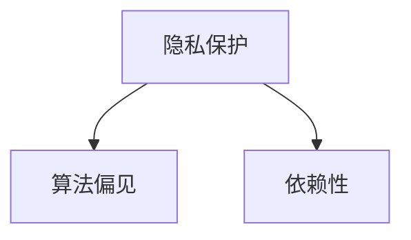

##### 核心算法原理讲解

解决这些挑战可能需要以下策略：

1. **隐私保护**：采用加密技术和数据匿名化策略，确保患者数据的安全。
2. **算法偏见**：通过数据多样性和算法验证，减少偏见。
3. **依赖性**：强调AI辅助而非替代，确保人类在治疗过程中发挥主导作用。

##### 项目实战

以下是一个模拟的ChatGPT项目实战，以解决这些挑战：

1. **隐私保护**：使用加密技术对患者的数据进行保护，同时采用数据匿名化策略，确保患者的隐私。
2. **算法偏见**：对训练数据进行多样性分析，确保算法在不同群体中的公平性。
3. **依赖性**：设计交互界面，提醒患者和治疗师在治疗过程中保持独立思考和判断。

##### 最佳实践 tips

- **数据安全**：确保所有数据处理都符合相关法律法规，保护患者隐私。
- **算法透明**：公开算法和训练数据，接受外部审查和监督。
- **人类主导**：确保AI在治疗过程中作为辅助工具，而非决策者。

### 结论

ChatGPT作为一种先进的语言处理模型，在语言障碍治疗个性化中的应用具有巨大的潜力。通过本文的探讨，我们了解了ChatGPT的基本原理、应用案例和治疗方案设计方法。尽管面临一些挑战，但通过持续的研究和优化，ChatGPT有望在未来的语言障碍治疗中发挥更加重要的作用。

### 附录

以下是本文中使用到的Python伪代码和Mermaid流程图。

#### Python伪代码

```python
import tensorflow as tf

# 加载ChatGPT模型
model = tf.keras.models.load_model('chatgpt_v1-1')

# 输入文本
input_text = "我今天练习了说话，感觉比昨天更好了。"

# 生成反馈
feedback = model.predict(input_text)

# 输出反馈
print(feedback)
```

#### Mermaid流程图

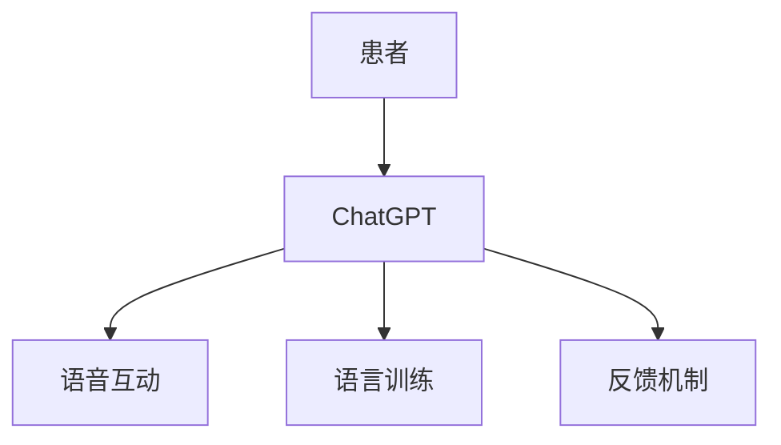

### 作者信息

作者：AI天才研究院/AI Genius Institute & 禅与计算机程序设计艺术 /Zen And The Art of Computer Programming

### 拓展阅读

- 《深度学习：入门与实战》
- 《自然语言处理与深度学习》
- 《人工智能：一种现代的方法》
- 《医疗人工智能：技术与应用》

### 注意事项

- 在使用ChatGPT进行语言障碍治疗时，应遵循相关法律法规和道德准则。
- ChatGPT不应替代专业治疗师，而应作为辅助工具。
- 定期对ChatGPT进行更新和优化，以确保其性能和安全性。

### 结语

本文详细探讨了ChatGPT在语言障碍治疗个性化中的应用，包括其基本原理、应用案例和治疗方案设计。希望本文能为相关领域的研究者和实践者提供有益的参考。随着技术的不断进步，我们期待ChatGPT在未来的语言障碍治疗中发挥更加重要的作用。

