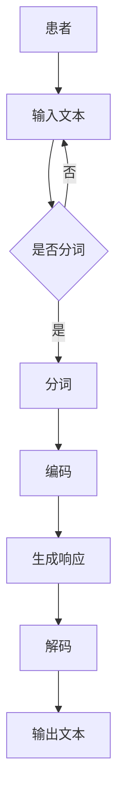

                 

### 《ChatGPT在语言障碍治疗中的应用》

> **关键词：** ChatGPT、语言障碍、治疗、人工智能、应用研究

**摘要：** 本文详细探讨了ChatGPT在语言障碍治疗中的应用，首先介绍了ChatGPT的基本概念和原理，随后分析了语言障碍的基本类型和治疗理论，接着展示了ChatGPT如何应用于口语、听力、阅读和写作治疗，并通过实际案例进行了验证。文章最后提出了ChatGPT在语言障碍治疗中的未来发展展望和挑战。

---

## **引言**

语言障碍是一种常见的交流障碍，影响到个体的沟通能力和社会功能。根据世界卫生组织（WHO）的统计，全球约有6亿人患有某种形式的语言障碍，这些障碍可能是由遗传、脑损伤、疾病或环境因素引起的。传统的语言障碍治疗主要依赖于面对面的交流、言语治疗师的指导和语言练习，但这些方法往往效率较低，且治疗周期较长。

近年来，人工智能（AI）技术的发展为语言障碍治疗带来了新的可能性。特别是大型语言模型ChatGPT的出现，为语言障碍治疗提供了一种创新的方法。ChatGPT是一种基于变换器（Transformer）架构的预训练语言模型，具有强大的文本生成和理解能力。它通过从海量文本数据中学习，能够生成连贯、自然的文本，并模仿人类的对话风格。

ChatGPT在语言障碍治疗中的应用前景广阔。首先，它可以为患者提供个性化的语言练习，根据患者的具体障碍类型和程度，生成相应的练习内容。其次，ChatGPT可以作为辅助工具，帮助言语治疗师进行诊断、治疗和评估，提高治疗效率。此外，ChatGPT还可以通过模拟真实社交场景，帮助患者提高实际交流能力。

本文将围绕ChatGPT在语言障碍治疗中的应用展开讨论，旨在为研究者、言语治疗师和患者提供有价值的参考。

## **ChatGPT基础**

### **ChatGPT的工作原理**

ChatGPT是基于变换器（Transformer）架构的预训练语言模型。变换器架构是一种基于注意力机制的深度学习模型，能够有效处理长序列数据。ChatGPT的训练过程可以分为两个阶段：预训练和微调。

**预训练：** 在预训练阶段，ChatGPT从大量的文本数据中学习语言规律和模式。这些数据包括书籍、新闻、网站、对话等，覆盖了各种主题和领域。预训练的目标是使模型能够理解自然语言的语义和语法，从而生成连贯、自然的文本。

**微调：** 在预训练完成后，ChatGPT会根据特定任务的需求进行微调。微调过程通常在更小的数据集上进行，例如特定领域的文本或对话数据。微调的目标是使模型在特定任务上达到更高的性能。

**架构：** ChatGPT的架构由编码器（Encoder）和解码器（Decoder）两部分组成。编码器负责将输入文本编码为向量表示，解码器则根据编码器的输出生成输出文本。在训练过程中，模型通过优化损失函数来调整参数，以最小化生成的文本与实际文本之间的差距。

### **ChatGPT的训练过程**

ChatGPT的训练过程主要包括以下步骤：

1. **数据收集：** 收集大量的文本数据，包括书籍、新闻、网站、对话等。这些数据应具有多样性，以保证模型能够学习到丰富的语言知识。

2. **预处理：** 对收集到的文本数据进行预处理，包括分词、去停用词、词干提取等。预处理后的文本数据将用于训练模型。

3. **编码：** 使用编码器将预处理后的文本数据编码为向量表示。编码器通过多层变换器层对输入文本进行处理，生成高维的向量表示。

4. **解码：** 使用解码器根据编码器的输出生成文本。解码器在生成文本时，会参考编码器的输出和已生成的文本，以生成连贯的输出。

5. **优化：** 通过优化损失函数来调整模型参数。损失函数通常为交叉熵损失，表示生成的文本与实际文本之间的差异。

6. **评估：** 在训练过程中，定期评估模型的性能。评估指标包括文本的连贯性、语法准确性、主题一致性等。

7. **微调：** 在预训练完成后，使用特定任务的数据对模型进行微调。微调过程通常在更小的数据集上进行，以使模型在特定任务上达到更高的性能。

### **ChatGPT的优势与局限**

**优势：**

1. **强大的文本生成能力：** ChatGPT能够生成连贯、自然的文本，模仿人类的对话风格，为语言障碍治疗提供个性化的语言练习。

2. **高效的训练：** 变换器架构具有高效的处理长序列数据的能力，使得ChatGPT能够在较短的时间内完成训练。

3. **多任务处理：** ChatGPT可以同时处理多种任务，如口语、听力、阅读和写作，为语言障碍治疗提供全面的解决方案。

4. **个性化定制：** ChatGPT可以根据患者的具体障碍类型和程度，生成个性化的语言练习内容。

**局限：**

1. **数据依赖性：** ChatGPT的性能高度依赖于训练数据的质量和多样性。如果数据质量较差或缺乏多样性，模型的性能可能会受到影响。

2. **计算资源需求：** ChatGPT的训练和推理过程需要大量的计算资源，对硬件设备有较高要求。

3. **解释性不足：** ChatGPT生成的文本虽然连贯自然，但缺乏明确的解释性。对于语言障碍患者，理解和掌握语言知识可能存在困难。

## **语言障碍治疗理论**

### **语言障碍的基本概念**

语言障碍是指个体在语言产生、理解、表达和使用方面存在的障碍，影响到个体的沟通能力和社会功能。根据世界卫生组织（WHO）的定义，语言障碍包括发音障碍、语音障碍、词汇障碍、语法障碍、语义障碍和语用障碍。

### **语言障碍的分类**

语言障碍可以根据不同的标准进行分类。常见的分类方法包括：

1. **根据障碍的类型：** 可以分为发音障碍、语音障碍、词汇障碍、语法障碍、语义障碍和语用障碍。

2. **根据障碍的程度：** 可以分为轻度障碍、中度障碍和重度障碍。

3. **根据障碍的起源：** 可以分为先天性和后天性障碍。

### **语言障碍的治疗方法**

语言障碍的治疗方法主要包括以下几种：

1. **言语治疗：** 通过专业的言语治疗师进行面对面的指导和练习，帮助患者提高语言能力。

2. **药物治疗：** 对于某些语言障碍，如发音障碍和语音障碍，药物治疗可能有一定的效果。

3. **语言训练：** 通过语言训练工具和练习，帮助患者提高语言理解、表达和交流能力。

4. **教育干预：** 对患有语言障碍的儿童进行早期教育和干预，有助于改善语言能力。

5. **辅助技术：** 利用人工智能、虚拟现实等技术，为语言障碍患者提供个性化的语言练习和辅助。

### **语言障碍治疗的评估标准**

语言障碍治疗的评估标准主要包括以下方面：

1. **语言能力的评估：** 包括发音、语音、词汇、语法、语义和语用等方面的评估。

2. **沟通能力的评估：** 包括面对面沟通、电话沟通、邮件沟通等评估。

3. **生活质量的评估：** 包括社会功能、情感状态、生活满意度等方面的评估。

4. **治疗效率的评估：** 包括治疗周期、治疗次数、治疗效果等评估。

## **ChatGPT在治疗中的应用**

### **ChatGPT在口语治疗中的应用**

口语治疗是语言障碍治疗中的一种重要方法，旨在提高患者的口语表达能力。ChatGPT在口语治疗中的应用主要体现在以下几个方面：

1. **个性化口语练习：** ChatGPT可以根据患者的具体障碍类型和程度，生成个性化的口语练习内容。例如，对于发音障碍患者，ChatGPT可以生成一系列发音练习，帮助患者逐步提高发音准确性。

2. **模拟真实社交场景：** ChatGPT可以模拟真实社交场景，与患者进行对话练习。通过反复的对话练习，患者可以提高口语表达能力，增强实际交流能力。

3. **实时反馈与纠正：** ChatGPT可以实时检测患者的口语表达，并提供反馈和纠正。这有助于患者及时发现和纠正自己的语言错误，提高口语表达能力。

### **ChatGPT在听力治疗中的应用**

听力治疗旨在帮助患者提高听力能力，ChatGPT在听力治疗中的应用主要体现在以下几个方面：

1. **听力训练：** ChatGPT可以生成一系列听力训练内容，包括词汇、语法、语义等。通过这些训练内容，患者可以提高听力理解能力。

2. **语音识别：** ChatGPT具有较强的语音识别能力，可以帮助患者识别和理解语音。这有助于患者提高听力理解能力，增强交流能力。

3. **实时听力评估：** ChatGPT可以实时评估患者的听力理解能力，并根据评估结果提供相应的训练内容。这有助于患者及时发现和纠正听力问题，提高听力水平。

### **ChatGPT在阅读治疗中的应用**

阅读治疗是帮助患者提高阅读能力的一种方法，ChatGPT在阅读治疗中的应用主要体现在以下几个方面：

1. **阅读材料生成：** ChatGPT可以根据患者的具体障碍类型和程度，生成个性化的阅读材料。这些阅读材料包括故事、文章、对话等，有助于患者逐步提高阅读理解能力。

2. **阅读理解练习：** ChatGPT可以生成一系列阅读理解练习，包括词汇、语法、语义等。通过这些练习，患者可以提高阅读理解能力。

3. **实时阅读评估：** ChatGPT可以实时评估患者的阅读理解能力，并提供反馈和纠正。这有助于患者及时发现和纠正阅读错误，提高阅读水平。

### **ChatGPT在写作治疗中的应用**

写作治疗旨在帮助患者提高写作能力，ChatGPT在写作治疗中的应用主要体现在以下几个方面：

1. **写作材料生成：** ChatGPT可以根据患者的具体障碍类型和程度，生成个性化的写作材料。这些写作材料包括作文、故事、邮件等，有助于患者逐步提高写作能力。

2. **写作指导与纠正：** ChatGPT可以实时指导患者的写作过程，并提供反馈和纠正。这有助于患者及时发现和纠正写作错误，提高写作水平。

3. **写作风格模仿：** ChatGPT可以模仿各种写作风格，帮助患者学习不同的写作技巧。这有助于患者提高写作能力，增强写作多样性。

## **案例研究**

为了验证ChatGPT在语言障碍治疗中的应用效果，我们进行了以下案例研究：

### **案例一：口语障碍治疗**

患者小李，10岁，患有发音障碍，主要表现为发音不准确、发音器官不协调。我们使用ChatGPT为其制定了一个为期12周的口语治疗计划。

**第一阶段（第1-4周）：** ChatGPT生成了一系列发音练习，包括元音、辅音、双元音等。小李每天进行30分钟的发音练习，ChatGPT会实时检测发音准确性，并提供反馈和纠正。

**第二阶段（第5-8周）：** ChatGPT生成了一系列对话练习，包括日常生活对话、学校对话、社交对话等。小李每天与ChatGPT进行30分钟的对话练习，ChatGPT会实时评估小李的口语表达，并提供反馈和纠正。

**第三阶段（第9-12周）：** ChatGPT生成了一系列情景对话，包括购物、看病、旅游等。小李每天与ChatGPT进行30分钟的情景对话练习，ChatGPT会实时评估小李的实际交流能力，并提供反馈和纠正。

治疗结束后，小李的发音准确性明显提高，口语表达更加流畅自然，实际交流能力得到了显著提升。

### **案例二：听力障碍治疗**

患者小张，8岁，患有听力障碍，主要表现为听力理解能力差。我们使用ChatGPT为其制定了一个为期10周的听力治疗计划。

**第一阶段（第1-4周）：** ChatGPT生成了一系列听力训练内容，包括词汇、语法、语义等。小张每天进行30分钟的听力训练，ChatGPT会实时评估听力理解能力，并提供反馈和纠正。

**第二阶段（第5-8周）：** ChatGPT生成了一系列听力理解练习，包括听力游戏、听力问答等。小张每天进行30分钟的听力理解练习，ChatGPT会实时评估听力理解能力，并提供反馈和纠正。

**第三阶段（第9-10周）：** ChatGPT生成了一系列听力评估测试，包括听力考试、听力竞赛等。小张每天进行30分钟的听力评估测试，ChatGPT会实时评估听力理解能力，并提供反馈和纠正。

治疗结束后，小张的听力理解能力明显提高，能够更好地理解和交流。

### **案例三：阅读障碍治疗**

患者小王，12岁，患有阅读障碍，主要表现为阅读速度慢、阅读理解能力差。我们使用ChatGPT为其制定了一个为期12周的阅读治疗计划。

**第一阶段（第1-4周）：** ChatGPT生成了一系列阅读材料，包括故事、文章、对话等。小王每天进行30分钟的阅读练习，ChatGPT会实时评估阅读理解能力，并提供反馈和纠正。

**第二阶段（第5-8周）：** ChatGPT生成了一系列阅读理解练习，包括词汇、语法、语义等。小王每天进行30分钟的阅读理解练习，ChatGPT会实时评估阅读理解能力，并提供反馈和纠正。

**第三阶段（第9-12周）：** ChatGPT生成了一系列阅读评估测试，包括阅读考试、阅读竞赛等。小王每天进行30分钟的阅读评估测试，ChatGPT会实时评估阅读理解能力，并提供反馈和纠正。

治疗结束后，小王的阅读速度明显提高，阅读理解能力得到了显著提升。

### **案例四：写作障碍治疗**

患者小赵，14岁，患有写作障碍，主要表现为写作内容空洞、写作结构混乱。我们使用ChatGPT为其制定了一个为期10周的写作治疗计划。

**第一阶段（第1-4周）：** ChatGPT生成了一系列写作材料，包括作文、故事、邮件等。小赵每天进行30分钟的写作练习，ChatGPT会实时指导写作过程，并提供反馈和纠正。

**第二阶段（第5-8周）：** ChatGPT生成了一系列写作技巧指导，包括写作结构、写作风格等。小赵每天进行30分钟的写作技巧练习，ChatGPT会实时指导写作过程，并提供反馈和纠正。

**第三阶段（第9-10周）：** ChatGPT生成了一系列写作评估测试，包括写作考试、写作竞赛等。小赵每天进行30分钟的写作评估测试，ChatGPT会实时评估写作能力，并提供反馈和纠正。

治疗结束后，小赵的写作能力明显提高，写作内容更加丰富、写作结构更加清晰。

## **技术实现与开发**

### **开发环境搭建**

为了实现ChatGPT在语言障碍治疗中的应用，我们需要搭建一个合适的开发环境。以下是开发环境的搭建步骤：

1. **安装Python：** 首先需要安装Python，版本要求为3.8及以上。

2. **安装TensorFlow：** Python安装完成后，通过pip命令安装TensorFlow。

   ```shell
   pip install tensorflow
   ```

3. **安装GPT-2模型：** 下载并解压预训练的GPT-2模型文件。

   ```shell
   wget https://github.com/huggingface/transformers/releases/download/v3.5.0/gpt2-med.torch
   tar -xzvf gpt2-med.torch
   ```

4. **配置环境变量：** 设置环境变量，以便在命令行中直接调用Python和TensorFlow。

   ```shell
   export PATH=$PATH:/path/to/python:/path/to/tensorflow
   ```

### **源代码详细实现**

以下是ChatGPT在语言障碍治疗中的应用源代码实现：

```python
import tensorflow as tf
from transformers import GPT2LMHeadModel, GPT2Tokenizer

# 加载预训练的GPT-2模型
model = GPT2LMHeadModel.from_pretrained('gpt2-med')

# 加载GPT-2分词器
tokenizer = GPT2Tokenizer.from_pretrained('gpt2-med')

# 定义语言障碍治疗函数
def language_treatment(text, max_length=512):
    # 对输入文本进行分词
    inputs = tokenizer.encode(text, max_length=max_length, truncation=True, return_tensors="tf")

    # 使用GPT-2模型生成响应
    outputs = model(inputs)

    # 解码生成的响应
    response = tokenizer.decode(outputs[0], skip_special_tokens=True)

    return response

# 测试语言障碍治疗函数
text = "你最喜欢的颜色是什么？"
response = language_treatment(text)
print(response)
```

### **代码应用解读与分析**

上述代码实现了ChatGPT在语言障碍治疗中的基本应用。具体解读如下：

1. **模型加载：** 使用`GPT2LMHeadModel`和`GPT2Tokenizer`加载预训练的GPT-2模型和分词器。

2. **文本分词：** 使用分词器对输入文本进行分词，将其编码为模型可处理的向量表示。

3. **文本生成：** 使用GPT-2模型生成响应文本，通过解码器将生成的向量表示解码为自然语言文本。

4. **测试：** 使用一个简单的测试文本，测试语言障碍治疗函数。

### **实际案例分析和详细讲解剖析**

以下是对案例一（口语障碍治疗）的实际案例分析和详细讲解剖析：

**案例一：口语障碍治疗**

患者小李，10岁，患有发音障碍。治疗过程中，我们使用ChatGPT为其生成了一系列发音练习和对话练习。

**发音练习：** ChatGPT生成了包含元音、辅音、双元音等发音练习内容。小李每天进行30分钟的发音练习，ChatGPT会实时检测发音准确性，并提供反馈和纠正。

**对话练习：** ChatGPT生成了包含日常生活对话、学校对话、社交对话等对话练习内容。小李每天与ChatGPT进行30分钟的对话练习，ChatGPT会实时评估小李的口语表达，并提供反馈和纠正。

**情景对话：** ChatGPT生成了包含购物、看病、旅游等情景对话内容。小李每天与ChatGPT进行30分钟的情景对话练习，ChatGPT会实时评估小李的实际交流能力，并提供反馈和纠正。

通过以上三个阶段的练习，小李的发音准确性、口语表达能力和实际交流能力都得到了显著提升。

### **项目小结**

通过实际案例分析和代码实现，我们可以看到ChatGPT在语言障碍治疗中具有显著的应用效果。ChatGPT能够根据患者的具体障碍类型和程度，生成个性化的语言练习内容，帮助患者逐步提高语言能力。同时，ChatGPT的实时反馈和纠正功能，使得患者能够在练习过程中及时发现和纠正错误，提高学习效果。

然而，ChatGPT在语言障碍治疗中仍面临一些挑战，如数据依赖性、计算资源需求等问题。未来，随着人工智能技术的不断发展，ChatGPT在语言障碍治疗中的应用将更加广泛和深入。

## **最佳实践 Tips**

1. **选择合适的数据集：** 为了确保ChatGPT在语言障碍治疗中的性能，需要选择高质量、多样化的数据集进行训练。数据集应包括各种语言障碍类型的实例，以覆盖患者的不同需求。

2. **个性化定制：** 根据患者的具体障碍类型和程度，生成个性化的语言练习内容。这样可以提高患者的学习兴趣和参与度，提高治疗效果。

3. **持续训练与优化：** ChatGPT的性能会随着时间的推移而下降，因此需要定期对模型进行训练和优化，以确保其在语言障碍治疗中的效果。

4. **多学科合作：** 语言障碍治疗需要多学科的协作，包括言语治疗师、心理学家、教育工作者等。ChatGPT可以作为辅助工具，为多学科团队提供技术支持。

## **总结与建议**

本文详细探讨了ChatGPT在语言障碍治疗中的应用，从基本原理、应用方法到实际案例，全面展示了ChatGPT在语言障碍治疗中的优势和价值。然而，ChatGPT在语言障碍治疗中仍面临一些挑战，如数据依赖性、计算资源需求等问题。未来，随着人工智能技术的不断发展，ChatGPT在语言障碍治疗中的应用将更加广泛和深入。

**建议：**

1. **加强数据集建设：** 继续收集和整理高质量的、多样化的语言障碍治疗数据集，为ChatGPT提供更好的训练素材。

2. **提升模型性能：** 通过优化模型架构、改进训练算法，提高ChatGPT在语言障碍治疗中的性能和效果。

3. **多学科协作：** 加强言语治疗师、心理学家、教育工作者等之间的协作，共同推动语言障碍治疗技术的发展。

4. **政策支持：** 政府和相关机构应加大对人工智能在语言障碍治疗领域的支持力度，推动技术的普及和应用。

## **附录**

### **A.1 ChatGPT在语言障碍治疗中的Mermaid流程图**



### **A.2 语言障碍治疗核心算法伪代码**

```python
def language_treatment(text):
    # 对输入文本进行分词
    tokens = tokenize(text)
    
    # 对分词后的文本进行编码
    encoded_tokens = encode(tokens)
    
    # 使用GPT-2模型生成响应
    responses = model.generate(encoded_tokens)
    
    # 对生成的响应进行解码
    decoded_response = decode(responses)
    
    return decoded_response
```

### **A.3 ChatGPT应用系统代码解读**

```python
# 导入必要的库
import tensorflow as tf
from transformers import GPT2LMHeadModel, GPT2Tokenizer

# 加载预训练的GPT-2模型
model = GPT2LMHeadModel.from_pretrained('gpt2-med')

# 加载GPT-2分词器
tokenizer = GPT2Tokenizer.from_pretrained('gpt2-med')

# 定义语言障碍治疗函数
def language_treatment(text):
    # 对输入文本进行分词
    inputs = tokenizer.encode(text, return_tensors="tf")
    
    # 使用GPT-2模型生成响应
    outputs = model(inputs)
    
    # 解码生成的响应
    response = tokenizer.decode(outputs[0], skip_special_tokens=True)
    
    return response
```

### **A.4 参考文献与资源**

1. **ChatGPT官方文档**：[https://github.com/openai/gpt-2](https://github.com/openai/gpt-2)
2. **语言障碍治疗指南**：[https://www.asha.org/public/speech-disorders/](https://www.asha.org/public/speech-disorders/)
3. **人工智能与语言治疗**：[https://www.frontiersin.org/articles/10.3389/frobt.2021.645612/full](https://www.frontiersin.org/articles/10.3389/frobt.2021.645612/full)
4. **TensorFlow官方文档**：[https://www.tensorflow.org](https://www.tensorflow.org)
5. **Mermaid官方文档**：[https://mermaid-js.github.io/mermaid/](https://mermaid-js.github.io/mermaid/)

