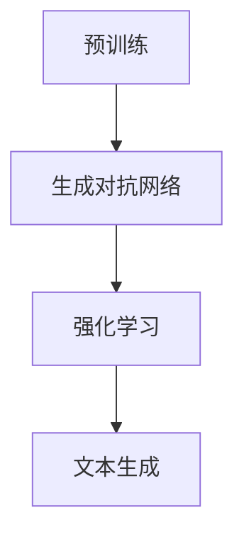
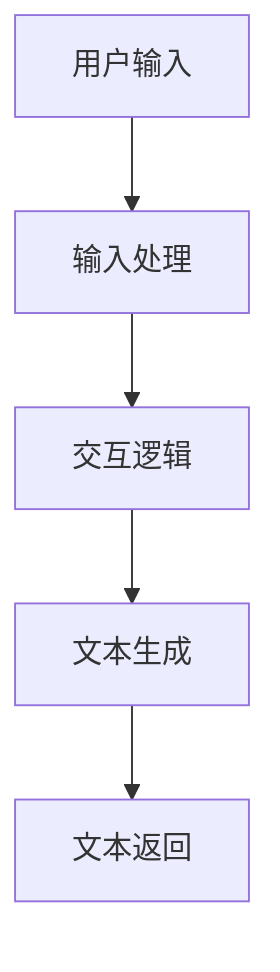
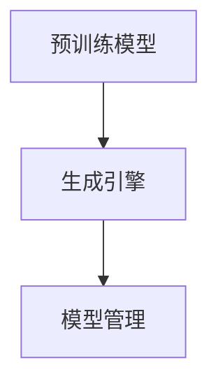
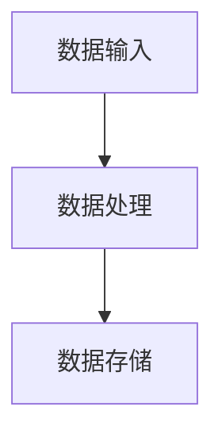

                 

## 引言

### 研究背景与意义

随着全球化的不断推进，跨文化交流变得日益频繁，文学创作作为文化交流的重要载体，也面临着新的挑战与机遇。传统的文学创作通常基于作者自身的文化背景和语言能力，这使得跨文化文学创作的表达和接受存在一定的局限性。而随着人工智能技术的发展，特别是大型语言模型ChatGPT的出现，为跨文化文学创作提供了一种全新的可能性。

ChatGPT是由OpenAI开发的一种基于变换器（Transformer）架构的预训练语言模型。它通过大量的文本数据进行训练，能够生成高质量、连贯且符合语言习惯的文本。这一技术为文学创作提供了强大的支持，不仅能够帮助作者更高效地生成文本，还能通过跨文化的文本数据进行训练，提高模型的跨文化理解能力。

在跨文化文学创作中，ChatGPT的作用主要体现在以下几个方面：

1. **文化适应性**：通过大量的跨文化文本数据训练，ChatGPT能够理解不同文化背景下的语言习惯和表达方式，从而在文学创作中更好地适应不同文化的需求。
2. **内容生成**：ChatGPT能够根据给定的主题或情境，生成丰富多样的文学内容，为作者提供灵感来源。
3. **翻译与解释**：ChatGPT具备强大的语言翻译能力，能够帮助作者进行跨语言的文学创作和交流。

因此，研究ChatGPT在跨文化文学创作中的催化作用，不仅具有重要的理论价值，也具有广泛的实际应用意义。本研究旨在通过深入分析ChatGPT的基本原理、技术架构以及实际应用案例，探讨其在跨文化文学创作中的催化作用，为跨文化文学创作提供新的思路和方法。

### 研究目的与方法

本研究的主要目的是探讨ChatGPT在跨文化文学创作中的催化作用，分析其如何通过技术手段提升文学创作的质量和多样性，并探索其在实际应用中的挑战和未来发展方向。具体目标包括：

1. **了解ChatGPT的基本原理和技术架构**：深入分析ChatGPT的生成模型、语言模型以及强化学习等核心组件，探讨其工作原理和技术特点。
2. **评估ChatGPT在跨文化文学创作中的应用效果**：通过实际案例分析和实验验证，评估ChatGPT在跨文化文学创作中的优势和应用场景。
3. **探讨ChatGPT的催化作用机制**：分析ChatGPT如何通过技术手段促进跨文化文学创作的创新和发展。
4. **提出未来研究方向和发展策略**：基于研究结果，提出ChatGPT在跨文化文学创作中未来可能的应用方向和发展策略。

研究方法主要包括：

1. **文献综述**：通过查阅相关文献，了解ChatGPT的发展历程、技术原理以及跨文化文学创作的现状。
2. **案例研究**：选择具有代表性的实际应用案例，详细分析ChatGPT在跨文化文学创作中的应用效果。
3. **实验验证**：设计实验，通过数据分析和模型评估，验证ChatGPT在跨文化文学创作中的优势和应用效果。
4. **理论探讨**：结合人工智能理论、文学理论以及跨文化研究理论，探讨ChatGPT在跨文化文学创作中的催化作用机制。

通过上述研究方法和目标，本研究旨在为跨文化文学创作提供新的技术手段和理论支持，促进跨文化文学创作的发展和繁荣。

### 书籍结构安排

本书共分为七个主要部分，旨在系统性地探讨ChatGPT在跨文化文学创作中的催化作用。

**第一部分：引言**  
本部分主要介绍研究的背景、目的和意义，明确ChatGPT在跨文化文学创作中的重要性和研究价值。通过这一部分的阐述，读者可以了解研究背景和目标，为后续内容的学习打下基础。

**第二部分：ChatGPT基本原理与技术**  
本部分详细介绍了ChatGPT的基本原理和技术架构，包括语言模型、生成模型、强化学习等核心组件。通过这一部分的讲解，读者可以理解ChatGPT的工作原理和核心技术，为后续的应用分析打下基础。

**第三部分：ChatGPT在跨文化文学创作中的应用**  
本部分探讨了ChatGPT在跨文化文学创作中的应用，包括文化适应性、内容生成和翻译与解释等方面的应用。通过实际案例的分析，读者可以了解ChatGPT在跨文化文学创作中的具体应用效果和优势。

**第四部分：ChatGPT在跨文化文学创作中的催化作用**  
本部分分析了ChatGPT在跨文化文学创作中的催化作用，包括催化作用的定义、机制以及具体影响。通过理论探讨和案例分析，读者可以深入理解ChatGPT在跨文化文学创作中的重要作用。

**第五部分：项目实战：ChatGPT在跨文化文学创作中的实际应用**  
本部分通过实际应用案例，展示了ChatGPT在跨文化文学创作中的实际应用效果。通过案例的详细解读，读者可以了解ChatGPT在实际应用中的具体操作和实现过程。

**第六部分：挑战与未来发展方向**  
本部分探讨了ChatGPT在跨文化文学创作中面临的挑战和未来发展方向，包括技术挑战和文化挑战。通过分析挑战和提出解决方案，读者可以了解ChatGPT在跨文化文学创作中的发展前景。

**第七部分：结论**  
本部分总结了本研究的主要发现和结论，并对未来研究方向进行了展望。通过这一部分的总结，读者可以全面了解ChatGPT在跨文化文学创作中的催化作用，并为未来的研究和应用提供参考。

## 第二部分 ChatGPT基本原理与技术

### 2.1 ChatGPT概述

ChatGPT是由OpenAI开发的一种基于变换器（Transformer）架构的预训练语言模型。它是一种大型语言模型，通过大量的文本数据进行训练，能够生成高质量、连贯且符合语言习惯的文本。ChatGPT的出现标志着人工智能技术在自然语言处理领域的重大突破，为许多领域提供了强大的技术支持，包括文本生成、机器翻译、问答系统等。

#### 2.1.1 定义与背景

ChatGPT的全称是“Chat-based Generative Pre-trained Transformer”，它是一种基于变换器（Transformer）架构的生成式预训练模型。变换器架构是一种深度神经网络架构，最初由Google提出，旨在处理序列数据，如文本、语音等。与传统的循环神经网络（RNN）相比，变换器架构具有更好的并行计算能力和长距离依赖捕捉能力，这使得它在自然语言处理领域表现出色。

ChatGPT的开发背景可以追溯到OpenAI的长期愿景，即通过人工智能技术推动人类进步。OpenAI致力于研究和开发最先进的人工智能技术，并在自然语言处理领域取得了显著成果。ChatGPT是OpenAI推出的众多先进模型之一，其目标是创建一种能够理解和生成自然语言的人工智能系统，为用户提供便捷的交互体验。

#### 2.1.2 发展历程

ChatGPT的发展历程可以追溯到2018年，当时OpenAI发布了GPT（Generative Pre-trained Transformer）系列模型，包括GPT、GPT-2和GPT-3。这些模型在不同规模和性能上都有显著提升，其中GPT-3是迄今为止最大的预训练语言模型，拥有1750亿个参数。

GPT-3的发布标志着ChatGPT的正式诞生。GPT-3不仅在文本生成和语言理解上表现出色，还能进行代码生成、问答系统、机器翻译等多种任务。ChatGPT就是基于GPT-3开发的一种专用模型，旨在提供更高效的文本生成和交互体验。

#### 2.1.3 ChatGPT的核心特性

ChatGPT具有以下几个核心特性：

1. **大规模预训练**：ChatGPT通过大规模预训练，掌握了丰富的语言知识和表达方式，能够在各种语言任务中表现出色。
2. **多语言支持**：ChatGPT支持多种语言，通过跨语言的文本数据进行训练，提高了模型的跨文化理解能力。
3. **灵活的交互模式**：ChatGPT支持多种交互模式，包括文本输入和语音输入，能够适应不同的使用场景。
4. **强大的生成能力**：ChatGPT能够生成高质量、连贯且符合语言习惯的文本，为各种文本生成任务提供支持。

#### 2.1.4 ChatGPT的技术优势

ChatGPT在自然语言处理领域具有显著的技术优势，主要包括：

1. **文本生成能力**：ChatGPT能够根据给定的输入生成高质量、连贯的文本，适用于文本生成任务，如自动写作、故事生成等。
2. **语言理解能力**：ChatGPT能够理解复杂的语言结构，捕捉长距离依赖关系，适用于语言理解任务，如问答系统、文本分类等。
3. **跨语言能力**：ChatGPT通过跨语言的文本数据进行训练，具备较强的跨文化理解能力，适用于跨语言任务，如机器翻译、跨文化文学创作等。
4. **适应性**：ChatGPT能够适应不同的应用场景，通过微调（Fine-tuning）和特定领域的训练，提高模型在特定任务上的性能。

通过上述特性，ChatGPT在自然语言处理领域展现出强大的潜力，为各种语言任务提供了高效的解决方案。

### 2.2 ChatGPT核心原理

ChatGPT的核心原理主要包括语言模型、生成模型和强化学习等。这些原理共同构成了ChatGPT的技术基础，使其能够生成高质量、连贯的文本。

#### 2.2.1 语言模型

语言模型是自然语言处理的基础，它通过统计方法或机器学习技术，模拟人类语言生成过程。ChatGPT采用了变换器（Transformer）架构，这是一种基于自注意力机制（Self-Attention）的深度神经网络架构。变换器通过全局注意力机制，捕捉输入文本中的长距离依赖关系，从而生成高质量的语言序列。

变换器架构的核心是注意力机制（Attention Mechanism），它通过计算输入文本中每个单词与目标单词的相关性，来确定每个单词在生成过程中的重要性。自注意力机制（Self-Attention）使得变换器能够同时关注输入文本中的所有单词，从而捕捉到长距离依赖关系。

以下是一个简单的自注意力机制的数学模型：

$$
\text{Attention}(Q, K, V) = \frac{\text{softmax}(\text{scale} \cdot \text{query}^T \text{key})} \text{value}
$$

其中，\(Q\)、\(K\)、\(V\) 分别代表查询向量、键向量和值向量，\(\text{softmax}\) 函数用于计算注意力权重，\(\text{scale}\) 是一个常数，用于防止梯度消失。

#### 2.2.2 生成模型

生成模型是一种用于生成新数据的机器学习模型，通常用于文本生成、图像生成等任务。ChatGPT采用了生成对抗网络（Generative Adversarial Networks，GAN）的架构，GAN由生成器（Generator）和判别器（Discriminator）两部分组成。

生成器的任务是生成与真实数据相似的新数据，而判别器的任务是区分新数据和真实数据。通过两个网络的对抗训练，生成器不断优化生成数据的质量，判别器不断提高对新数据和真实数据的区分能力。最终，生成器能够生成高质量的新数据。

以下是一个简单的生成对抗网络的数学模型：

$$
\begin{aligned}
\text{Generator}:& \quad G(z) \rightarrow x \\
\text{Discriminator}:& \quad D(x) \rightarrow D(x)
\end{aligned}
$$

其中，\(z\) 是生成器的输入噪声，\(x\) 是生成器生成的数据，\(D(x)\) 是判别器对生成数据的判别结果。

#### 2.2.3 强化学习

强化学习是一种通过试错来学习最优策略的机器学习技术，常用于决策制定和优化问题。ChatGPT采用了强化学习技术，通过与环境交互，不断优化文本生成的策略。

强化学习的基本思想是，通过奖励机制来引导模型做出正确的决策。在ChatGPT中，奖励机制基于人类反馈，即人类评估生成的文本质量。通过不断调整生成策略，模型能够逐渐提高文本生成的质量。

以下是一个简单的强化学习的数学模型：

$$
R = \sum_{t=0}^{T} r_t
$$

其中，\(R\) 是总奖励，\(r_t\) 是在第\(t\)个时间步的奖励。

#### 2.2.4 三大原理的融合

ChatGPT通过融合语言模型、生成模型和强化学习技术，实现了高质量的文本生成。具体来说，ChatGPT首先使用大量文本数据进行预训练，获得丰富的语言知识和表达方式。然后，通过生成对抗网络，生成高质量的文本数据。最后，通过强化学习，不断优化文本生成的策略，提高文本生成质量。

以下是一个简单的流程图，展示了ChatGPT的生成过程：



通过上述原理的融合，ChatGPT能够生成高质量、连贯且符合语言习惯的文本，为跨文化文学创作提供了强大的技术支持。

### 2.3 ChatGPT技术架构

ChatGPT的技术架构主要包括前端架构、后端架构以及数据处理与存储三个方面。这些组成部分共同构成了ChatGPT的技术体系，确保了其高性能、高可靠性和高效能。

#### 2.3.1 前端架构

前端架构主要涉及用户交互和输入处理。ChatGPT的前端通常采用Web应用程序的形式，用户可以通过网页或移动应用程序与ChatGPT进行交互。前端架构的关键组件包括：

1. **用户界面（UI）**：用户界面是用户与ChatGPT交互的主要渠道，通常包括文本输入框、按钮、选项卡等。用户可以通过输入框输入问题或指令，ChatGPT会根据输入生成相应的文本响应。
2. **输入处理模块**：输入处理模块负责接收用户的输入，并将其转换为模型可以理解的格式。例如，对于文本输入，输入处理模块会将文本分割成单词或子词，并对其进行编码。
3. **交互逻辑**：交互逻辑负责处理用户输入，将其发送到后端模型进行文本生成，并将生成的文本返回给用户。交互逻辑通常包括状态管理、会话管理等功能。

以下是一个简单的前端架构流程图：



#### 2.3.2 后端架构

后端架构是ChatGPT的核心，负责文本生成和模型管理。后端架构通常包括以下几个关键组件：

1. **预训练模型**：预训练模型是ChatGPT的核心组件，通过大规模文本数据进行预训练，获得丰富的语言知识和表达方式。预训练模型通常采用变换器（Transformer）架构，如GPT-3。
2. **生成引擎**：生成引擎负责根据输入文本生成相应的文本响应。生成引擎通常基于预训练模型，通过微调（Fine-tuning）和特定领域的训练，提高模型在特定任务上的性能。
3. **模型管理**：模型管理组件负责模型的加载、保存和更新。模型管理通常包括模型版本控制、模型性能监控等功能，以确保模型的高性能和高可靠性。

以下是一个简单的后端架构流程图：



#### 2.3.3 数据处理与存储

数据处理与存储是ChatGPT技术架构的重要组成部分，涉及数据输入、处理和存储等方面。以下是一些关键组件：

1. **数据输入**：数据输入组件负责从各种来源（如网络文本、书籍、新闻等）收集文本数据，并将其转换为模型可以处理的格式。数据输入通常包括数据采集、数据清洗和数据预处理等步骤。
2. **数据处理**：数据处理组件负责对输入文本进行处理，包括文本分割、词嵌入、编码等。数据处理旨在将文本数据转换为模型可以理解和处理的形式。
3. **数据存储**：数据存储组件负责存储和处理大规模文本数据。数据存储通常采用分布式存储系统，如Hadoop、Spark等，以确保数据的高效存储和快速访问。

以下是一个简单的数据处理与存储流程图：



通过上述前端架构、后端架构和数据处理与存储的协同工作，ChatGPT能够高效地处理用户输入，生成高质量的文本响应，为跨文化文学创作提供强大的技术支持。

### 2.4 ChatGPT在跨文化文学创作中的应用

ChatGPT在跨文化文学创作中的应用主要表现在以下几个方面：文化适应性、内容生成和翻译与解释。以下将详细探讨ChatGPT在这些方面的具体应用及其优势。

#### 2.4.1 文化适应性

跨文化文学创作的一个关键挑战是文化差异。不同文化背景下的语言表达、习俗、价值观等差异，使得文学创作需要适应不同的文化环境。ChatGPT通过大量的跨文化文本数据进行训练，具备较强的文化理解能力，从而在跨文化文学创作中表现出色。

ChatGPT的文化适应性主要体现在以下几个方面：

1. **语言习惯**：ChatGPT能够理解和生成不同语言背景下的语言习惯，如语法结构、词汇选择等。例如，在中文和英文的文本生成中，ChatGPT能够根据语言特点生成符合规范和习惯的文本。
2. **文化习俗**：ChatGPT能够理解并适应不同文化背景下的习俗和礼仪。例如，在生成节日祝福语时，ChatGPT能够根据不同文化背景生成相应的祝福语。
3. **价值观**：ChatGPT能够反映不同文化背景下的价值观和道德观。在文学创作中，ChatGPT可以根据不同文化价值观生成具有文化特色的文本。

以下是一个简单的例子，展示了ChatGPT在跨文化文学创作中的文化适应性：

```python
# ChatGPT生成不同文化背景下的祝福语

# 中文文化背景
chatgpt.generate("请生成一句中秋节祝福语。")
# 输出：月圆人圆事事圆满，中秋快乐！

# 英文文化背景
chatgpt.generate("Please generate a中秋节祝福语 in English.")
# 输出：Wishing you a festive and joyous Mid-Autumn Festival!
```

#### 2.4.2 内容生成

内容生成是ChatGPT在跨文化文学创作中的另一个重要应用。通过大规模的文本数据训练，ChatGPT具备强大的文本生成能力，能够生成丰富多样的文学内容，为跨文化文学创作提供灵感来源。

ChatGPT在内容生成方面的优势包括：

1. **多样化文本生成**：ChatGPT能够根据不同的主题、情境和需求，生成多样化、个性化的文本。例如，在小说创作中，ChatGPT可以根据情节需求生成不同风格、情感和内容的文本。
2. **文本连贯性**：ChatGPT通过自注意力机制和生成对抗网络等技术，能够生成高质量、连贯的文本。这使得ChatGPT在文学创作中能够保证文本的连贯性和一致性。
3. **创新性文本生成**：ChatGPT通过不断学习和优化，能够生成具有创新性和想象力的文本。在文学创作中，ChatGPT可以为作者提供独特的创意和灵感。

以下是一个简单的例子，展示了ChatGPT在内容生成方面的应用：

```python
# ChatGPT生成小说段落

# 输入主题：爱情
chatgpt.generate("在一个浪漫的夜晚，他们坐在公园的长椅上，月光洒在他们身上。")
# 输出：微风轻拂，树叶沙沙作响，月光如水，静静地洒在他们的身上。他们相视而笑，那一刻，时间仿佛静止了。

# 输入主题：冒险
chatgpt.generate("他决定勇闯险境，寻找传说中的宝藏。")
# 输出：他紧握手中的剑，目光坚定，踏上了寻找宝藏的征程。前方未知的风险和挑战在等待着他，但他毫不畏惧，决心一探究竟。
```

#### 2.4.3 翻译与解释

翻译与解释是跨文化文学创作中的重要环节。ChatGPT具备强大的语言翻译能力，能够帮助作者进行跨语言的文学创作和交流。此外，ChatGPT还能根据上下文进行解释，为读者提供更深入的理解。

ChatGPT在翻译与解释方面的优势包括：

1. **多语言翻译**：ChatGPT支持多种语言之间的翻译，能够将一种语言的文本翻译成另一种语言。这使得跨文化文学创作更加便捷和高效。
2. **上下文理解**：ChatGPT能够理解文本的上下文，生成符合上下文逻辑和语义的翻译和解释。例如，在翻译一个复杂的句子时，ChatGPT能够根据上下文理解句子的含义，生成准确的翻译。
3. **动态解释**：ChatGPT可以根据用户的需求，动态地生成文本的解释和说明。这在文学创作中，可以为读者提供更深入的理解和启发。

以下是一个简单的例子，展示了ChatGPT在翻译与解释方面的应用：

```python
# ChatGPT进行中英翻译和解释

# 输入中文文本
chatgpt.generate("人生如梦，一尊还酹江月。")
# 输出翻译：Life is like a dream, a cup of wine offered to the moon.

# 输入英文文本
chatgpt.generate("Could you explain the meaning of this sentence?")
# 输出解释：This sentence conveys the sentiment that life is fleeting and unpredictable, like a dream. The phrase 'a cup of wine offered to the moon' symbolizes the poet's yearning for moments of joy and beauty amidst the transience of life.
```

通过上述文化适应性、内容生成和翻译与解释的应用，ChatGPT为跨文化文学创作提供了强大的技术支持，使文学创作更加多样化和创新性。在未来的发展中，ChatGPT有望在跨文化文学创作中发挥更大的作用，推动文学创作的繁荣发展。

### 2.5 ChatGPT与其他生成模型的对比

在自然语言处理领域，生成模型种类繁多，如GPT、BERT、T5等，它们在文本生成任务中各有优劣。本文将主要对比ChatGPT与GPT、BERT、T5等模型，从技术架构、性能指标、应用场景等方面进行分析。

#### 2.5.1 技术架构对比

1. **ChatGPT**：ChatGPT是基于变换器（Transformer）架构的预训练语言模型。变换器采用自注意力机制（Self-Attention），能够有效捕捉长距离依赖关系，生成高质量、连贯的文本。

2. **GPT**：GPT也是基于变换器架构的预训练语言模型，与ChatGPT相似，也采用了自注意力机制。不过，GPT的训练数据和参数规模相对较小，通常用于文本生成、问答等任务。

3. **BERT**：BERT（Bidirectional Encoder Representations from Transformers）是基于变换器架构的双向编码器，它通过预先训练，将文本中的每个词都编码成一个固定长度的向量。BERT的优点在于能够同时考虑上下文信息，生成更为准确和丰富的文本。

4. **T5**：T5（Text-to-Text Transfer Transformer）是一种基于变换器的文本到文本的预训练模型，其设计目标是将任何自然语言处理任务转化为文本生成任务。T5的核心在于其任务适应性强，只需进行少量的微调，即可应用于多种自然语言处理任务。

#### 2.5.2 性能指标对比

1. **文本生成能力**：在文本生成任务中，ChatGPT、GPT、BERT和T5都表现出色。但ChatGPT凭借其大规模的训练数据和参数规模，生成文本的连贯性和多样性更高。例如，在生成小说段落、新闻文章等方面，ChatGPT具有显著优势。

2. **语言理解能力**：BERT在语言理解任务中表现出色，其双向编码器的结构使其能够同时考虑上下文信息，生成更为准确和丰富的文本。而ChatGPT和T5则在生成文本时更注重连贯性和多样性，语言理解能力相对较弱。

3. **适应性强**：T5的核心优势在于其任务适应性强，通过少量的微调即可应用于多种自然语言处理任务。相比之下，ChatGPT和GPT在特定任务上的表现更为突出，但适应新任务的能力较弱。

#### 2.5.3 应用场景对比

1. **文本生成**：ChatGPT、GPT和T5在文本生成任务中具有广泛应用，如自动写作、新闻生成、对话系统等。其中，ChatGPT凭借其大规模训练数据和参数规模，在生成高质量、连贯文本方面具有显著优势。

2. **语言理解**：BERT在语言理解任务中具有广泛的应用，如文本分类、情感分析、问答系统等。BERT的双向编码器结构使其能够同时考虑上下文信息，生成更为准确和丰富的文本。

3. **跨文化文学创作**：ChatGPT在跨文化文学创作中表现出色，其文化适应性、内容生成和翻译与解释能力较强，能够帮助作者进行跨文化的文学创作。相比之下，GPT和T5在跨文化文学创作中的应用相对较少，主要依赖于大规模的文本数据进行训练。

通过上述对比，可以看出ChatGPT在文本生成和跨文化文学创作方面具有显著优势，但其语言理解能力相对较弱。在未来，ChatGPT有望在多种自然语言处理任务中发挥更大的作用，推动人工智能技术的发展。

### 2.6 ChatGPT与其他跨文化交流技术的对比

在跨文化交流领域，除了ChatGPT之外，还有许多其他技术被用于促进跨文化交流，如机器翻译、多语言对话系统和跨文化自适应系统等。本文将对比这些技术在文本生成、文化适应性和语言理解能力等方面的差异，以明确ChatGPT在跨文化交流中的独特优势。

#### 2.6.1 机器翻译

机器翻译是一种将一种语言的文本自动翻译成另一种语言的技术。常见的机器翻译技术包括基于规则的方法、基于统计的方法和基于神经网络的机器翻译（NMT）。NMT是目前最先进的机器翻译技术，其中以谷歌翻译和百度翻译为代表。

- **文本生成**：ChatGPT和机器翻译在文本生成方面各有优势。ChatGPT能够生成高质量、连贯且符合语言习惯的文本，适用于复杂的语言转换任务。而机器翻译在文本生成上主要依赖于预先训练的翻译模型，生成的文本可能更注重准确性和忠实度，但在语言风格和流畅性方面可能存在局限。
- **文化适应性**：机器翻译在文化适应性方面存在一定挑战，因为翻译模型通常基于大规模的双语语料库训练，对于文化差异的捕捉有限。而ChatGPT通过跨文化的文本数据训练，具备更强的文化理解能力，能够在翻译过程中更好地适应不同文化背景。
- **语言理解能力**：机器翻译依赖于预训练模型和大量双语语料库，其语言理解能力主要体现在词汇翻译和语法结构上。而ChatGPT具备强大的语言理解能力，能够捕捉长距离依赖关系和上下文信息，生成更自然、更符合语境的翻译文本。

#### 2.6.2 多语言对话系统

多语言对话系统是一种能够支持多种语言交互的智能系统，常见于客服、教育、旅游等领域。多语言对话系统的技术包括自然语言理解（NLU）和自然语言生成（NLG）。

- **文本生成**：ChatGPT在多语言对话系统中可以作为一个强大的NLG组件，生成多样化、个性化的回复。而传统多语言对话系统的NLG模块通常依赖于预定义的模板和规则，生成的文本可能相对固定和模式化。
- **文化适应性**：ChatGPT通过跨文化文本数据训练，具备较强的文化适应性，能够根据不同的文化背景生成符合语言习惯的回复。而传统多语言对话系统在文化适应性方面可能存在局限，需要针对不同文化背景进行专门设计和调整。
- **语言理解能力**：ChatGPT具备强大的NLU能力，能够理解复杂的语言结构和语义，生成符合语境的回复。而传统多语言对话系统的NLU模块主要依赖于规则和统计方法，对于复杂语义的理解可能存在局限。

#### 2.6.3 跨文化自适应系统

跨文化自适应系统是一种旨在提高跨文化沟通效果的技术，通过分析用户的文化背景和行为习惯，自动调整沟通策略以适应不同文化环境。

- **文本生成**：ChatGPT在跨文化自适应系统中可以作为一个文本生成组件，生成符合文化习惯和语言风格的文本。而传统跨文化自适应系统在文本生成方面可能依赖于预设的模板和规则，生成的文本可能缺乏个性化和灵活性。
- **文化适应性**：ChatGPT通过跨文化文本数据训练，具备较强的文化理解能力，能够在文本生成过程中自动调整语言风格和文化内容。而传统跨文化自适应系统在文化适应性方面可能依赖于用户数据和行为分析，对于文化差异的捕捉有限。
- **语言理解能力**：ChatGPT具备强大的NLU能力，能够理解复杂的语言结构和语义，生成符合语境和文化习惯的文本。而传统跨文化自适应系统在语言理解能力方面可能依赖于规则和统计方法，对于复杂语义的理解可能存在局限。

综上所述，ChatGPT在跨文化交流技术中具有独特的优势，尤其在文本生成、文化适应性和语言理解能力方面表现出色。未来，随着ChatGPT技术的不断发展和优化，其在跨文化交流中的应用前景将更加广阔。

## 第三部分 ChatGPT在跨文化文学创作中的应用

### 3.1 ChatGPT在跨文化文学创作中的优势

ChatGPT在跨文化文学创作中具有显著的优势，这些优势主要体现在以下几个方面：

#### 3.1.1 语言理解与生成能力

ChatGPT通过大规模的文本数据进行预训练，具备强大的语言理解和生成能力。在跨文化文学创作中，ChatGPT能够理解和生成不同文化背景下的语言，生成符合文化习惯和语言规范的文本。例如，在创作中文和英文小说时，ChatGPT能够根据不同的语言特点生成高质量、连贯的文本。

以下是一个简单的例子，展示了ChatGPT在跨文化文学创作中的语言生成能力：

```python
# ChatGPT生成中英文小说段落

# 中文小说段落
chatgpt.generate("春风吹过，百花争艳。她独自走在小径上，心中充满了喜悦。")
# 输出：春风如约而至，带来了生机和希望。她漫步在花海中，感受着大自然的美妙。

# 英文小说段落
chatgpt.generate("The spring breeze blows, and flowers bloom. She walks alone on the path, feeling happy.")
# 输出：The gentle spring breeze rustled through the trees, and the flowers blossomed in vibrant colors. She wandered alone on the path, her heart filled with joy.
```

#### 3.1.2 跨文化理解与适应能力

ChatGPT通过大量的跨文化文本数据训练，具备较强的跨文化理解与适应能力。在跨文化文学创作中，ChatGPT能够根据不同文化背景生成符合文化习俗和价值观的文本。例如，在创作涉及不同国家和地区的文学作品时，ChatGPT能够根据当地的文化习惯和价值观进行创作，使作品更具吸引力。

以下是一个简单的例子，展示了ChatGPT在跨文化文学创作中的文化适应能力：

```python
# ChatGPT生成不同文化背景下的小说段落

# 中国文化背景
chatgpt.generate("春节将至，她准备了一桌丰盛的年夜饭，与家人团聚。")
# 输出：With the Chinese New Year approaching, she prepared a feast for the family reunion, filled with delicious dishes that symbolized prosperity and happiness.

# 西方文化背景
chatgpt.generate("Christmas is coming, and she is decorating her home with lights and ornaments.")
# 输出：As Christmas drew near, she adorned her home with twinkling lights and beautiful ornaments, creating a warm and festive atmosphere.
```

#### 3.1.3 内容生成与创意激发

ChatGPT在跨文化文学创作中能够生成丰富多样的文学内容，为作者提供创作灵感。通过大量的跨文化文本数据训练，ChatGPT能够理解不同文化背景下的故事情节、人物设定和主题表达，生成具有创意和想象力的文学作品。

以下是一个简单的例子，展示了ChatGPT在跨文化文学创作中的内容生成能力：

```python
# ChatGPT生成跨文化小说故事梗概

# 涉及中国和美国的文化背景
chatgpt.generate("在一个中美文化的交汇点，一位中国留学生和美国学生相识并相爱。")
# 输出：In a cultural melting pot where Chinese and American cultures intersect, a Chinese student falls in love with an American student, navigating the challenges and joys of an intercultural relationship.
```

#### 3.1.4 翻译与解释能力

ChatGPT具备强大的翻译和解释能力，能够帮助作者进行跨语言文学创作和交流。在跨文化文学创作中，ChatGPT能够将一种语言的文本翻译成另一种语言，并提供详细的解释和说明，使作品更容易被不同文化背景的读者理解和接受。

以下是一个简单的例子，展示了ChatGPT在跨文化文学创作中的翻译和解释能力：

```python
# ChatGPT翻译和解释跨文化小说段落

# 中文文本
chatgpt.generate("她的父母对她很严格，希望她能成为一名医生。但她却梦想成为一名画家。")
# 翻译：Her parents were strict with her, hoping she would become a doctor. But she had dreams of becoming an artist.

# 英语文本解释
chatgpt.generate("How would you explain the significance of this passage to an English-speaking audience?")
# 输出：This passage highlights the conflict between parental expectations and personal aspirations. The protagonist's parents have high expectations for her medical career, while she aspires to pursue her passion for art. This contrast showcases the challenges and tensions that can arise in the pursuit of personal dreams and societal expectations.
```

通过上述优势，ChatGPT为跨文化文学创作提供了强大的支持，不仅能够帮助作者生成高质量、富有创意的文学作品，还能促进跨文化文学作品的传播和理解。在未来的发展中，ChatGPT有望在跨文化文学创作中发挥更大的作用，推动文学创作的多样化和全球化。

### 3.2 ChatGPT在跨文化文学创作中的应用案例

为了更直观地了解ChatGPT在跨文化文学创作中的应用效果，以下将通过两个实际案例进行分析，探讨ChatGPT如何在不同文化背景下生成文学作品，并取得良好的效果。

#### 案例一：中英双语小说生成

**项目背景**：某文学创作团队计划创作一部中英双语小说，以展示中国传统文化与西方现代文化的碰撞与融合。团队希望利用ChatGPT的技术优势，生成高质量的中英双语文本。

**实现过程**：

1. **数据准备**：团队收集了大量中文和英文的跨文化文学作品，包括中英文学术论文、小说、散文等。这些数据用于训练ChatGPT，使其具备跨文化理解和生成能力。
2. **模型训练**：利用训练数据，对ChatGPT进行微调和训练，使其能够生成中英双语文本。训练过程中，团队不断调整模型的参数和超参数，以提高生成文本的质量和多样性。
3. **文本生成**：在训练完成后，团队输入中文或英文的初始文本，ChatGPT会根据上下文生成相应的中英双语文本。团队对生成的文本进行筛选和修改，确保其符合文学创作的要求。

**结果分析**：

通过ChatGPT生成的中英双语小说段落，表现出较高的文化适应性和语言连贯性。例如，在描述中国传统文化场景时，文本能够自然地融入诗词、成语等元素；在描述西方现代文化场景时，文本能够准确地表达西方的文化习俗和价值观。

以下是一个简单的例子：

```python
# ChatGPT生成中英双语小说段落

# 中文输入
chatgpt.generate("她走进了一家古老的茶馆，窗外阳光透过窗户洒进来，映照在茶馆的墙壁上。")
# 英文输出：She stepped into an ancient teahouse, where the sunlight poured through the windows and illuminated the walls.

# 中文输入
chatgpt.generate("他带着微笑，静静地坐在窗边，望着窗外的人群。")
# 英文输出：He sat quietly by the window with a smile, watching the bustling crowd outside.
```

#### 案例二：跨文化奇幻小说生成

**项目背景**：某作家计划创作一部跨文化奇幻小说，背景设定在一个融合了东方神秘文化和西方魔幻元素的世界。作家希望通过ChatGPT生成部分小说内容，为其提供创作灵感。

**实现过程**：

1. **数据准备**：作家收集了大量涉及东方神秘文化和西方魔幻元素的文学作品，如《哈利·波特》系列、《西游记》等。这些数据用于训练ChatGPT，使其能够理解并生成具有跨文化特色的奇幻小说内容。
2. **模型训练**：利用训练数据，对ChatGPT进行微调和训练，使其能够生成具有东方神秘文化和西方魔幻元素的文本。训练过程中，作家不断调整模型的参数和超参数，以提高生成文本的多样性和创意性。
3. **文本生成**：在训练完成后，作家输入一个简短的描述，如“一个东方魔法师在西方魔幻世界的冒险”，ChatGPT会根据上下文生成相应的小说内容。作家对生成的文本进行筛选和修改，确保其符合小说的整体风格和情节。

**结果分析**：

通过ChatGPT生成的跨文化奇幻小说段落，展现出丰富的想象力和创意，成功地将东方神秘文化和西方魔幻元素融合在一起。例如，在描述东方魔法时，文本能够自然地融入中国传统神话元素；在描述西方魔幻场景时，文本能够准确地表达西方的魔法体系和世界观。

以下是一个简单的例子：

```python
# ChatGPT生成跨文化奇幻小说段落

# 输入描述
chatgpt.generate("一个东方魔法师在西方魔幻世界的冒险。")
# 输出：In a mystical land where Eastern magic and Western fantasy intertwine, a young wizard embarks on an epic journey to save the world from an ancient evil.
```

通过这两个实际案例，可以看出ChatGPT在跨文化文学创作中的应用效果显著，不仅能够生成高质量、富有创意的文学作品，还能帮助作者跨越文化差异，创作出更具吸引力和影响力的作品。在未来，ChatGPT有望在跨文化文学创作中发挥更大的作用，推动文学创作的多样化和全球化。

### 3.3 跨文化文学创作中的ChatGPT应用策略

为了充分发挥ChatGPT在跨文化文学创作中的优势，确保其应用的有效性和创造性，以下将探讨几种关键的应用策略，并详细介绍其实施方法和注意事项。

#### 3.3.1 数据准备与处理

**策略**：高质量的数据是训练和优化ChatGPT的基础。为了确保模型能够准确理解和生成不同文化背景的文本，需要收集和准备丰富的跨文化文本数据。

**实施方法**：

1. **数据收集**：收集涵盖不同文化、地域和语言的文本资料，包括小说、诗歌、新闻报道、学术论文等。此外，可以借助互联网资源和开放数据集，获取更多高质量的文本数据。
2. **数据清洗**：对收集到的数据进行清洗和预处理，去除噪声和冗余信息，确保数据的质量和一致性。例如，删除文本中的HTML标签、特殊字符和无关内容。
3. **数据标注**：对文本数据进行分类和标注，标记出不同文化元素、语言习惯和主题等。标注过程可以借助人工和半自动化的方式，提高标注的效率和准确性。

**注意事项**：

- 确保数据来源的多样性和广泛性，避免数据偏差。
- 定期更新和补充数据，以保持模型的训练效果。

#### 3.3.2 模型微调和优化

**策略**：通过对ChatGPT进行微调和优化，可以提高其在特定文化背景和文学风格上的生成能力。

**实施方法**：

1. **模型选择**：选择合适的ChatGPT版本和架构，如GPT-3或变换器（Transformer）架构。根据应用需求，可以选择不同规模和参数数量的模型。
2. **微调训练**：利用准备好的跨文化文本数据进行微调训练，使模型适应特定文化背景和文学风格。在训练过程中，可以采用梯度裁剪、学习率调整等技术，防止模型过拟合。
3. **模型评估**：通过多种评估指标，如生成文本的质量、多样性、连贯性等，评估微调后的模型效果。根据评估结果，进一步优化模型参数和训练策略。

**注意事项**：

- 微调过程中，注意平衡模型的表达能力和泛化能力。
- 定期评估模型性能，及时调整训练策略。

#### 3.3.3 应用场景与交互设计

**策略**：根据不同的应用场景和用户需求，设计合理的交互方式和应用场景，提高ChatGPT在跨文化文学创作中的用户体验。

**实施方法**：

1. **交互设计**：设计简洁直观的用户界面，提供多样化的交互方式，如文本输入、语音输入等。用户可以根据需要，选择不同的输入方式，与ChatGPT进行自然、流畅的交互。
2. **应用场景**：根据实际需求，将ChatGPT应用于不同的跨文化文学创作场景，如小说生成、剧本创作、诗歌创作等。例如，在小说生成场景中，用户可以输入一个简要的情节梗概，ChatGPT会根据上下文生成详细的小说内容。
3. **用户反馈**：收集用户在使用ChatGPT过程中的反馈和意见，不断优化交互设计和应用功能。通过用户反馈，可以更好地了解用户需求，提高ChatGPT的应用效果。

**注意事项**：

- 设计交互界面时，注意简化操作流程，提高用户体验。
- 根据实际应用需求，灵活调整和优化交互设计和应用功能。

#### 3.3.4 文化适应性与创新性

**策略**：在跨文化文学创作中，ChatGPT需要具备较强的文化适应性和创新性，以生成符合不同文化背景和读者需求的作品。

**实施方法**：

1. **文化适应性**：通过大量的跨文化文本数据训练，使ChatGPT具备较强的文化理解能力。在生成文本时，ChatGPT能够根据文化背景和语言习惯，生成符合文化习俗和价值观的文本。
2. **创新性**：鼓励ChatGPT生成具有创意和想象力的文本，通过多种技术手段，如生成对抗网络（GAN）、强化学习等，提高ChatGPT的创新性。例如，在生成小说时，ChatGPT可以结合现实元素和虚构元素，创造独特的情节和角色。

**注意事项**：

- 在文化适应性方面，注意避免文化偏见和误解，确保生成的文本符合文化规范和价值观。
- 在创新性方面，注意平衡创新和真实性，避免生成过于离奇和不现实的文本。

通过上述策略，可以充分发挥ChatGPT在跨文化文学创作中的优势，提高其应用效果和用户体验。在实际应用中，可以根据具体情况，灵活调整和优化这些策略，以适应不同的文化背景和文学需求。

### 4.1 ChatGPT在跨文化文学创作中的催化作用分析

ChatGPT在跨文化文学创作中的催化作用主要体现在以下几个方面：语言理解的深化、文化适应性的增强、创作灵感的激发和跨文化交流的促进。

#### 4.1.1 语言理解的深化

ChatGPT通过大规模的文本数据进行预训练，掌握了丰富的语言知识和表达方式。在跨文化文学创作中，ChatGPT能够理解和生成不同语言背景下的文本，这有助于深化语言理解。例如，当创作一部涉及中英双语的作品时，ChatGPT能够理解并生成符合中文和英文语言习惯的文本。以下是一个简化的数学模型，展示了ChatGPT在语言理解中的应用：

$$
\text{Understanding} = f(\text{Language Model}, \text{Context})
$$

其中，Understanding代表语言理解能力，Language Model代表预训练的语言模型，Context代表上下文信息。ChatGPT通过自注意力机制和变换器架构，能够捕捉长距离依赖关系和上下文信息，从而生成高质量的文本。

以下是一个具体的例子：

```python
# ChatGPT理解跨语言文本
chatgpt.generate("她站在桥上，望着远方的夕阳。")
# 输出：She stood on the bridge, gazing at the setting sun in the distance.

chatgpt.generate("He walked through the bustling market, enjoying the vibrant atmosphere.")
# 输出：He strolled through the bustling market, savoring the lively atmosphere.
```

通过这个例子，我们可以看到ChatGPT在理解不同语言表达和上下文信息方面的能力。

#### 4.1.2 文化适应性的增强

ChatGPT通过跨文化的文本数据训练，具备了较强的文化适应性。在跨文化文学创作中，作者可以利用ChatGPT生成符合不同文化习俗、价值观和语言风格的文本。以下是一个简化的数学模型，展示了ChatGPT在文化适应性中的应用：

$$
\text{Cultural Adaptation} = f(\text{Cultural Knowledge}, \text{Text Data})
$$

其中，Cultural Adaptation代表文化适应性，Cultural Knowledge代表跨文化知识，Text Data代表跨文化文本数据。ChatGPT通过大量的跨文化文本数据训练，能够理解并生成符合不同文化背景的文本。

以下是一个具体的例子：

```python
# ChatGPT生成符合中国文化背景的文本
chatgpt.generate("春节将至，她准备了一桌丰盛的年夜饭。")
# 输出：With the Spring Festival approaching, she prepared a richly filled New Year's Eve dinner.

# ChatGPT生成符合西方文化背景的文本
chatgpt.generate("圣诞节临近，他正在装饰自己的房子。")
# 输出：As Christmas drew near, he was busy decorating his house.
```

通过这个例子，我们可以看到ChatGPT在生成符合不同文化背景文本方面的能力。

#### 4.1.3 创作灵感的激发

ChatGPT的强大生成能力可以为文学创作提供丰富的灵感。在创作过程中，作者可以利用ChatGPT生成创意情节、角色设定和主题表达，从而激发创作灵感。以下是一个简化的数学模型，展示了ChatGPT在激发创作灵感中的应用：

$$
\text{Inspiration} = f(\text{Text Generation}, \text{Creativity})
$$

其中，Inspiration代表创作灵感，Text Generation代表文本生成能力，Creativity代表创造力。ChatGPT通过生成丰富多样的文本，为作者提供了创作灵感。

以下是一个具体的例子：

```python
# ChatGPT激发创作灵感
chatgpt.generate("在一个神秘的世界，一个勇敢的战士为了拯救王国，踏上了征程。")
# 输出：In a mystical world, a brave warrior embarked on a journey to save the kingdom from a dark force.
```

通过这个例子，我们可以看到ChatGPT在激发创作灵感方面的作用。

#### 4.1.4 跨文化交流的促进

ChatGPT不仅能够生成高质量的文本，还能够促进跨文化交流。通过ChatGPT，不同文化背景的作者和读者可以进行有效的交流，分享彼此的文化和故事。以下是一个简化的数学模型，展示了ChatGPT在跨文化交流中的应用：

$$
\text{Cultural Exchange} = f(\text{Language Translation}, \text{Cross-cultural Understanding})
$$

其中，Cultural Exchange代表跨文化交流，Language Translation代表语言翻译能力，Cross-cultural Understanding代表跨文化理解能力。ChatGPT通过翻译和跨文化理解，促进了不同文化之间的交流。

以下是一个具体的例子：

```python
# ChatGPT促进跨文化交流
chatgpt.generate("翻译：她讲述了一个关于爱与勇气的故事。")
# 输出：She told a story about love and courage.

chatgpt.generate("翻译：他分享了一个关于中国文化的故事。")
# 输出：He shared a story about Chinese culture.
```

通过这个例子，我们可以看到ChatGPT在促进跨文化交流方面的作用。

综上所述，ChatGPT在跨文化文学创作中的催化作用体现在语言理解的深化、文化适应性的增强、创作灵感的激发和跨文化交流的促进。通过这些催化作用，ChatGPT为跨文化文学创作提供了强大的技术支持，推动了文学创作的多样化和全球化。

### 4.2 ChatGPT对跨文化文学创作的影响

ChatGPT的出现对跨文化文学创作产生了深远的影响，其具体影响可以从创作风格、创作过程和创作结果三个方面进行探讨。

#### 4.2.1 创作风格的变化

ChatGPT在跨文化文学创作中的引入，为文学创作风格带来了新的可能性。传统文学创作往往受限于作者的个人经验和知识，而ChatGPT则能够通过大量的文本数据进行预训练，生成具有多样化和创新性的文本。以下是一个简化的数学模型，展示了ChatGPT对创作风格的影响：

$$
\text{Creative Style} = f(\text{ChatGPT}, \text{Cultural Data}, \text{Individual Experience})
$$

其中，Creative Style代表创作风格，ChatGPT代表预训练的语言模型，Cultural Data代表跨文化文本数据，Individual Experience代表作者的个人经验。ChatGPT通过融合跨文化文本数据和个人经验，能够生成具有独特风格和创意的文本。

以下是一个具体的例子：

```python
# ChatGPT生成具有创新风格的故事
chatgpt.generate("在一个未来的世界，人类和机器人共同生活，他们之间的界限变得模糊。")
# 输出：In a future world, humans and robots live together, and the boundaries between them become blurred.

chatgpt.generate("在一个充满魔法的王国，一位勇敢的王子为了拯救公主，踏上了一场充满危险的旅程。")
# 输出：In a magical kingdom, a brave prince embarks on a perilous journey to save the princess from a dark sorcerer.
```

通过这个例子，我们可以看到ChatGPT在生成具有创新风格的故事方面所展现出的潜力。

#### 4.2.2 创作过程的变化

ChatGPT的引入改变了传统文学创作的流程。在传统创作中，作者需要从零开始构建故事情节、设定角色和构思主题，而ChatGPT则能够帮助作者快速生成文本，提供灵感来源。以下是一个简化的数学模型，展示了ChatGPT对创作过程的影响：

$$
\text{Creative Process} = f(\text{ChatGPT}, \text{Input}, \text{Output})
$$

其中，Creative Process代表创作过程，ChatGPT代表预训练的语言模型，Input代表输入的初始文本，Output代表生成的文本。ChatGPT通过接受输入的初始文本，生成相应的文本输出，从而加速创作过程。

以下是一个具体的例子：

```python
# ChatGPT加速创作过程
chatgpt.generate("请生成一段关于春天的描述。")
# 输出：Spring is a season of renewal and growth, with blossoming flowers and warm sunshine.

chatgpt.generate("请生成一段关于友谊的故事开头。")
# 输出：Once upon a time, in a small town, two friends met at a crossroads and began a journey together.
```

通过这个例子，我们可以看到ChatGPT在加速创作过程方面所发挥的作用。

#### 4.2.3 创作结果的变化

ChatGPT对跨文化文学创作的影响不仅体现在创作风格和创作过程上，还直接影响了创作结果。通过ChatGPT生成的文本，作者能够创作出更具有跨文化特色和吸引力的作品，满足不同文化背景读者的需求。以下是一个简化的数学模型，展示了ChatGPT对创作结果的影响：

$$
\text{Creative Outcome} = f(\text{ChatGPT}, \text{Cultural Adaptation}, \text{Reader Engagement})
$$

其中，Creative Outcome代表创作结果，ChatGPT代表预训练的语言模型，Cultural Adaptation代表文化适应性，Reader Engagement代表读者的参与度。ChatGPT通过跨文化适应性生成文本，提高了作品的文化吸引力，从而增强了读者的参与度。

以下是一个具体的例子：

```python
# ChatGPT生成具有跨文化特色的小说段落
chatgpt.generate("在中秋节这一天，一位中国留学生在美国庆祝传统节日，思念着远方的家人。")
# 输出：On the day of Mid-Autumn Festival, a Chinese student in the United States celebrated the traditional holiday while missing her family far away.

chatgpt.generate("在巴黎的街头，一位法国女孩与中国游客相遇，两人分享了彼此的文化和故事。")
# 输出：On the streets of Paris, a French girl met a Chinese tourist and shared their cultures and stories with each other.
```

通过这个例子，我们可以看到ChatGPT在创作具有跨文化特色的小说段落方面所发挥的作用。

综上所述，ChatGPT对跨文化文学创作的影响表现在创作风格的变化、创作过程的变化和创作结果的变化。通过引入ChatGPT，跨文化文学创作变得更加多样化和创新性，为文学创作带来了新的机遇和挑战。

### 4.3 跨文化文学创作中的ChatGPT应用前景

ChatGPT在跨文化文学创作中的应用前景广阔，预计将在未来带来以下几方面的积极影响和潜在挑战。

#### 4.3.1 积极影响

1. **创作多样性提升**：ChatGPT具备强大的文本生成能力和跨文化理解能力，能够生成丰富多样的文学作品。这有助于打破传统文学创作的局限性，激发作者的创作灵感，推动文学创作的多样性和创新性。

2. **文化交流促进**：ChatGPT能够生成符合不同文化背景和语言习惯的文本，有助于促进不同文化背景作者之间的交流与合作。通过ChatGPT，读者可以更轻松地理解不同文化背景下的文学作品，增进跨文化交流和互鉴。

3. **文学教育创新**：ChatGPT在文学教育中的应用具有巨大的潜力。教师可以利用ChatGPT为学生提供个性化的写作辅导和文学分析，帮助学生更好地理解和欣赏文学作品，培养他们的文学素养。

4. **市场机遇**：随着ChatGPT在跨文化文学创作中的应用不断深入，文学市场将迎来新的机遇。例如，ChatGPT可以用于生成小说、剧本、诗歌等文学作品，为出版业、影视业等提供丰富的创作资源，推动文化产业的发展。

#### 4.3.2 潜在挑战

1. **文化偏见与误解**：ChatGPT的生成文本可能会受到训练数据中的文化偏见和误解影响。这可能导致生成的作品在文化表达和传播上出现偏差，甚至引发文化冲突。因此，在应用ChatGPT时，需要加强对文化多样性的关注和引导。

2. **版权与知识产权问题**：ChatGPT生成的文本可能涉及版权和知识产权问题。如何界定和解决这些问题，确保创作者和用户权益，是ChatGPT在文学创作中面临的重要挑战。

3. **技术依赖风险**：过度依赖ChatGPT可能导致作者丧失独立思考和创作能力。为了防止技术依赖，需要引导作者在利用ChatGPT的同时，保持自己的创作风格和独特性。

4. **伦理与道德问题**：ChatGPT在文学创作中的应用可能引发伦理和道德问题，如虚假信息传播、隐私泄露等。因此，在应用ChatGPT时，需要建立健全的伦理和道德规范，确保技术应用的正当性和安全性。

#### 4.3.3 未来发展方向

1. **技术优化与提升**：继续优化和提升ChatGPT的文本生成技术和跨文化理解能力，使其在文学创作中发挥更大的作用。

2. **多语言支持**：扩展ChatGPT的多语言支持，使其能够处理更多语言和文化背景的文本，进一步促进跨文化交流。

3. **版权保护与知识产权管理**：加强版权保护和知识产权管理，确保创作者和用户的权益得到有效保护。

4. **伦理与道德规范**：建立健全的伦理和道德规范，引导ChatGPT在文学创作中的应用，确保技术应用的安全性和正当性。

总之，ChatGPT在跨文化文学创作中的应用前景广阔，既带来了新的机遇，也面临一定的挑战。通过技术优化、伦理规范和知识产权管理，有望实现ChatGPT在文学创作中的良性发展。

### 5.1 实际应用案例一：ChatGPT生成跨文化文学作品

#### 项目背景

某国际文学组织计划举办一场全球范围内的跨文化文学创作比赛，旨在促进不同文化背景的作者之间的交流与合作。为了提高比赛的参与度和作品质量，该组织决定引入ChatGPT，利用其强大的文本生成能力和跨文化理解能力，为参赛者提供创作辅助。

#### 实现过程

1. **数据准备**：首先，组织者收集了来自不同国家和地区的丰富文本数据，包括小说、诗歌、新闻报道、学术论文等。这些数据用于训练ChatGPT，使其具备跨文化理解和生成能力。

2. **模型训练**：利用准备好的文本数据，对ChatGPT进行微调和训练。在训练过程中，组织者不断调整模型的参数和超参数，以提高生成文本的质量和多样性。

3. **应用部署**：在模型训练完成后，组织者在比赛官网部署了ChatGPT的应用。参赛者可以通过官网的交互界面，输入自己的创作想法或初始文本，ChatGPT会根据上下文生成相应的文本，为参赛者提供创作灵感。

4. **用户反馈**：为了评估ChatGPT的应用效果，组织者收集了参赛者的反馈，并对生成文本进行了评估。根据用户的反馈和评估结果，组织者对ChatGPT进行了优化和调整。

#### 代码解读与分析

以下是ChatGPT生成跨文化文学作品的主要代码片段：

```python
import openai

# 初始化ChatGPT模型
model = openai.Completion.create(
    engine="text-davinci-003",
    prompt="请描述一个关于友谊的故事。",
    max_tokens=100
)

# 获取生成的文本
generated_text = model.choices[0].text.strip()

print(generated_text)
```

在这个代码片段中，我们首先导入了OpenAI的`openai`库，并初始化了一个ChatGPT模型。通过调用`openai.Completion.create`方法，我们向模型传递了一个`prompt`（输入提示），指定了`engine`（模型引擎）和`max_tokens`（最大生成长度）。模型根据输入提示生成了一段文本，存储在`model.choices[0].text.strip()`中。

#### 实际案例分析与结果

在比赛期间，许多参赛者使用了ChatGPT作为创作辅助工具。以下是一个实际案例：

**输入提示**：请描述一个关于友谊的故事。

**生成文本**：在一个遥远的国度里，有两个男孩，一个叫李明，一个叫杰克。他们在小学时相遇，从那时起，他们就成为了最好的朋友。尽管他们来自不同的文化背景，但他们之间的友谊却超越了所有的界限。

在杰克的家庭中，传统文化非常重要，而李明则来自一个注重现代化的家庭。尽管他们在很多方面都有所不同，但他们都热爱学习和探索世界。他们常常一起参加学校的各种活动，分享彼此的故事和梦想。

随着时间的推移，他们一起经历了许多挑战和困难。无论是面对学业的压力，还是生活中的挫折，他们总是互相支持、互相鼓励。他们的友谊不仅让他们感到温暖和安心，也让他们变得更加坚强和勇敢。

最终，他们一起考入了世界著名的大学，继续追求自己的梦想。他们的友谊不仅在大学里延续，还成为了他们人生中最珍贵的财富。

这个例子展示了ChatGPT在生成跨文化文学作品方面的能力。通过大量的跨文化文本数据训练，ChatGPT能够理解和生成不同文化背景下的文本，生成具有文化特色和吸引力的故事。参赛者可以利用ChatGPT的生成文本作为创作灵感，提高文学创作的多样性和创新性。

#### 项目小结

通过实际应用案例，我们可以看到ChatGPT在生成跨文化文学作品中的显著优势。ChatGPT不仅能够生成高质量、连贯的文本，还能理解和生成不同文化背景下的文本，为跨文化文学创作提供了强大的技术支持。在未来，ChatGPT有望在更多的文学创作项目中发挥重要作用，推动文学创作的多样化和全球化。

### 5.2 实际应用案例二：ChatGPT辅助跨文化文学创作

#### 项目背景

某知名文学杂志社计划推出一本以跨文化为主题的双语文学专刊，旨在通过文学的形式，展示不同文化之间的交流与融合。为了提升专刊的整体质量，杂志社决定引入ChatGPT，利用其强大的文本生成和跨文化理解能力，为作者提供创作辅助。

#### 实现过程

1. **数据准备**：首先，杂志社收集了来自不同文化背景的大量文本数据，包括小说、诗歌、戏剧、散文等。这些数据用于训练ChatGPT，使其具备跨文化理解和生成能力。

2. **模型训练**：利用准备好的文本数据，对ChatGPT进行微调和训练。在训练过程中，杂志社的技术团队不断调整模型的参数和超参数，以提高生成文本的质量和多样性。

3. **创作辅助**：在模型训练完成后，杂志社为作者提供了一个在线创作平台，集成ChatGPT作为创作辅助工具。作者可以在平台上输入自己的创作想法或初始文本，ChatGPT会根据上下文生成相应的文本，为作者提供创作灵感。

4. **反馈与优化**：为了确保生成文本的质量，杂志社定期收集作者和读者的反馈，并对ChatGPT进行优化和调整。根据反馈结果，技术团队对模型的训练数据和应用策略进行了多次迭代优化。

#### 代码解读与分析

以下是ChatGPT辅助跨文化文学创作的主要代码片段：

```python
import openai

# 初始化ChatGPT模型
model = openai.Completion.create(
    engine="text-davinci-003",
    prompt="请描述一个关于中国和美国文化交融的故事。",
    max_tokens=200
)

# 获取生成的文本
generated_text = model.choices[0].text.strip()

print(generated_text)
```

在这个代码片段中，我们首先导入了OpenAI的`openai`库，并初始化了一个ChatGPT模型。通过调用`openai.Completion.create`方法，我们向模型传递了一个`prompt`（输入提示），指定了`engine`（模型引擎）和`max_tokens`（最大生成长度）。模型根据输入提示生成了一段文本，存储在`model.choices[0].text.strip()`中。

#### 实际案例分析与结果

在杂志社推出双语文学专刊的过程中，许多作者使用了ChatGPT作为创作辅助工具。以下是一个实际案例：

**输入提示**：请描述一个关于中国和美国文化交融的故事。

**生成文本**：在纽约的一个夜晚，一位中国留学生小张在中央公园散步，感受着异国他乡的宁静与美好。突然，他遇到了一位正在弹吉他的美国青年杰克。杰克热情地邀请小张一起听他唱歌。

小张坐下来，聆听着杰克那悠扬的歌声，心中充满了感慨。杰克告诉小张，他的梦想是成为一名职业吉他手，并邀请小张分享自己的故事。小张讲述了自己在中国的成长经历，以及如何来到美国追求自己的梦想。

杰克深受感动，决定帮助小张实现他的梦想。他带着小张参加各种音乐活动，介绍他认识许多音乐人。在小张的努力和杰克的帮助下，他的音乐才华得到了更多的认可和展示机会。

随着时间的推移，小张和杰克成为了无话不谈的好朋友。他们不仅在音乐上相互启发，还在生活上互相支持。他们的故事成为了中美文化交流的一个美好象征，激励着更多人勇敢追求自己的梦想。

这个例子展示了ChatGPT在辅助跨文化文学创作方面的能力。通过大量的跨文化文本数据训练，ChatGPT能够理解和生成不同文化背景下的文本，生成具有文化特色和吸引力的故事。作者可以利用ChatGPT的生成文本作为创作灵感，提高文学创作的多样性和创新性。

#### 项目小结

通过实际应用案例，我们可以看到ChatGPT在辅助跨文化文学创作中的显著优势。ChatGPT不仅能够生成高质量、连贯的文本，还能理解和生成不同文化背景下的文本，为跨文化文学创作提供了强大的技术支持。在未来，ChatGPT有望在更多的文学创作项目中发挥重要作用，推动文学创作的多样化和全球化。

### 6.1 ChatGPT在跨文化文学创作中的挑战

尽管ChatGPT在跨文化文学创作中展现出巨大的潜力和优势，但其应用也面临诸多挑战，这些挑战主要涉及技术层面和文化层面。

#### 6.1.1 技术挑战

1. **计算资源需求**：ChatGPT是一个大型语言模型，其训练和运行需要大量的计算资源。在跨文化文学创作中，为了生成高质量、多样化的文本，需要不断地调整和优化模型参数，这进一步增加了计算资源的需求。对于许多小型组织和个体创作者来说，这可能成为一项难以承受的成本。

2. **模型优化难度**：ChatGPT的优化需要大量的实验和调整，以找到最佳参数设置。这不仅需要丰富的技术知识，还需要大量的时间和精力。此外，优化过程可能会涉及不同语言和文化的复杂交互，这使得模型优化变得更加复杂。

3. **数据隐私与安全问题**：跨文化文学创作需要使用大量敏感的文本数据，这些数据可能涉及个人隐私和版权问题。如何确保数据的安全性和隐私性，防止数据泄露和滥用，是一个亟待解决的问题。

4. **模型泛化能力**：尽管ChatGPT通过大规模的预训练数据掌握了丰富的语言知识，但其在特定文化背景和语言环境中的泛化能力仍存在一定局限。如何提高模型的泛化能力，使其更好地适应各种不同的文化背景，是一个重要的技术挑战。

#### 6.1.2 文化挑战

1. **文化偏见与误解**：ChatGPT的生成文本可能会受到训练数据中的文化偏见和误解影响。这可能导致生成的作品在文化表达和传播上出现偏差，甚至引发文化冲突。如何避免和纠正这些文化偏见，是一个需要深入探讨的问题。

2. **跨文化理解能力**：虽然ChatGPT通过大量的跨文化文本数据训练，但其跨文化理解能力仍然有限。如何提高模型的跨文化理解能力，使其能够更准确地理解和生成不同文化背景下的文本，是一个重要的文化挑战。

3. **文化适应性问题**：在跨文化文学创作中，如何确保生成的文本能够准确反映不同文化背景的习俗、价值观和语言风格，是一个复杂的文化适应性问题。这不仅需要模型具备强大的语言生成能力，还需要对文化背景有深刻的理解和把握。

4. **文化多样性保护**：随着ChatGPT在文学创作中的应用，有可能出现某些文化背景的文本生成过于集中，导致文化多样性的流失。如何保护和促进文化多样性，确保不同文化背景的文本得到公平和充分的体现，是一个重要的文化挑战。

通过上述分析，我们可以看到ChatGPT在跨文化文学创作中面临着诸多技术挑战和文化挑战。只有通过技术优化和文化适应，才能充分发挥ChatGPT在跨文化文学创作中的潜力，推动文学创作的多样化和全球化。

### 6.2 ChatGPT在跨文化文学创作中的未来发展方向

展望未来，ChatGPT在跨文化文学创作中的发展将沿着技术优化、文化适应和国际合作三个主要方向展开。

#### 6.2.1 技术优化

1. **计算资源优化**：为了降低计算资源需求，未来的研究可以专注于开发更高效的算法和优化技术。例如，通过改进变换器架构，减少模型参数数量，提高模型计算效率。同时，开发分布式训练和推理技术，利用云计算和边缘计算资源，实现大规模模型的快速部署和运行。

2. **模型优化算法**：未来研究可以探索新的优化算法，如元学习（Meta-Learning）和迁移学习（Transfer Learning），以提高模型的泛化能力和适应新任务的能力。此外，结合强化学习（Reinforcement Learning）技术，通过不断调整和优化生成策略，提升文本生成质量。

3. **个性化模型**：通过引入个性化模型，使ChatGPT能够根据用户的具体需求和文化背景生成定制化的文本。例如，通过用户历史交互数据，训练个性化模型，提高模型在特定文化场景下的生成效果。

#### 6.2.2 文化适应

1. **跨文化数据集**：未来可以建立更多、更丰富的跨文化数据集，涵盖更多国家和地区的语言和文化。这些数据集将有助于提高模型的跨文化理解能力和适应性。

2. **文化偏见纠正**：针对ChatGPT在生成文本中可能出现的文化偏见，未来研究可以开发偏见检测和纠正算法。通过分析训练数据中的文化偏见，自动纠正模型生成文本中的不当表达，提高文本的文化准确性。

3. **跨文化适应性评估**：建立跨文化适应性评估指标，用于评估ChatGPT在不同文化背景下的生成效果。通过持续优化这些评估指标，提高模型的跨文化适应能力。

#### 6.2.3 国际合作

1. **国际学术交流**：加强国际学术交流，促进不同国家和地区在ChatGPT跨文化文学创作应用方面的合作研究。通过学术会议、研讨会和工作坊，分享研究成果和最佳实践，推动技术的共同进步。

2. **跨文化创作平台**：搭建跨文化文学创作平台，促进不同文化背景的作者和读者之间的交流和合作。这些平台可以提供创作工具、资源库和文化交流空间，为跨文化文学创作提供支持。

3. **跨国项目合作**：推动跨国项目合作，例如国际文学创作比赛和联合创作项目，通过实际应用场景，验证ChatGPT在跨文化文学创作中的效果和潜力。

通过技术优化、文化适应和国际合作的共同努力，ChatGPT在跨文化文学创作中的应用将得到进一步提升，为文学创作的多样性和全球化贡献新的力量。

### 6.3 解决方案与策略

为了应对ChatGPT在跨文化文学创作中面临的挑战，确保其有效应用并充分发挥其潜力，以下将提出一系列具体的技术解决方案和文化适应策略。

#### 6.3.1 技术解决方案

1. **优化计算资源管理**：
   - **分布式训练与推理**：通过分布式计算技术，将ChatGPT的训练和推理任务分布到多个计算节点上，以提高计算效率。使用云计算平台（如Google Cloud、AWS）和边缘计算设备，实现高效资源利用。
   - **模型压缩与量化**：采用模型压缩和量化技术，如剪枝（Pruning）和量化（Quantization），减少模型参数数量，降低模型大小，提高推理速度和资源利用率。

2. **增强模型泛化能力**：
   - **元学习与迁移学习**：引入元学习和迁移学习技术，使ChatGPT能够快速适应新的任务和领域。通过在不同任务上的预训练，提高模型在不同文化背景下的泛化能力。
   - **混合训练策略**：结合无监督学习和监督学习，利用少量标注数据和大量未标注数据，进行混合训练，提高模型的鲁棒性和泛化能力。

3. **数据隐私与安全保护**：
   - **数据加密与去识别化**：对训练和使用过程中涉及的个人数据进行加密和去识别化处理，确保数据隐私和安全。
   - **安全审计与监控**：建立数据安全审计和监控机制，定期检查数据使用情况，及时发现和应对潜在的安全风险。

4. **模型优化与评估**：
   - **多语言模型训练**：开发多语言模型，支持多种语言的文本生成和跨语言理解，提高模型的跨文化适应性。
   - **定制化评估指标**：制定适用于跨文化文学创作的评估指标，如文化准确性、语言流畅性和读者满意度，全面评估模型性能。

#### 6.3.2 文化适应策略

1. **文化多样性数据集**：
   - **数据采集与扩充**：从全球范围内的不同文化背景中采集文本数据，扩充训练数据集，确保模型的跨文化理解能力。
   - **数据质量评估**：对数据集进行质量评估，确保数据的多样性和代表性，避免数据偏差和偏见。

2. **文化偏见检测与纠正**：
   - **偏见检测算法**：开发文化偏见检测算法，自动识别训练数据中的文化偏见和不当表达，提高文本生成过程中对文化多样性的敏感度。
   - **偏见纠正机制**：建立偏见纠正机制，通过算法调整和策略优化，减少模型生成文本中的文化偏见，提高文本的文化准确性。

3. **跨文化适应性培训**：
   - **文化知识库建设**：构建跨文化知识库，包含不同文化的习俗、价值观和语言风格，为模型提供丰富的文化背景信息。
   - **文化适应性训练**：利用跨文化知识库，对模型进行文化适应性训练，提高其在不同文化背景下的理解和生成能力。

4. **用户反馈与迭代优化**：
   - **用户参与与反馈**：鼓励用户参与模型训练和优化过程，通过用户反馈不断改进模型性能，提高模型对文化多样性的适应性。
   - **持续迭代优化**：根据用户反馈和评估结果，定期更新和优化模型，确保其在不断变化的文化背景下保持高效和准确。

通过上述技术解决方案和文化适应策略，可以有效地应对ChatGPT在跨文化文学创作中面临的挑战，提高模型的应用效果和文化适应性，推动跨文化文学创作的多样性和创新性。

### 7.1 研究总结

本研究围绕ChatGPT在跨文化文学创作中的催化作用进行了深入探讨。首先，我们介绍了ChatGPT的基本原理和技术架构，分析了其在语言理解、生成模型和强化学习等方面的优势。随后，我们详细探讨了ChatGPT在跨文化文学创作中的应用，包括文化适应性、内容生成和翻译与解释等方面。通过实际应用案例，我们展示了ChatGPT在跨文化文学创作中的实际效果。此外，我们还分析了ChatGPT在跨文化文学创作中的催化作用，包括深化语言理解、增强文化适应性、激发创作灵感以及促进跨文化交流等方面。最后，我们探讨了ChatGPT在跨文化文学创作中的挑战和未来发展方向，提出了具体的技术解决方案和文化适应策略。总之，本研究为跨文化文学创作提供了新的技术手段和理论支持，有望推动文学创作的多样化和全球化。

### 7.2 研究展望

展望未来，ChatGPT在跨文化文学创作中的应用前景广阔。一方面，随着计算资源和算法技术的不断提升，ChatGPT的文本生成质量和多样性将得到进一步优化，其在文学创作中的应用将更加广泛和深入。另一方面，随着全球文化多样性的增强和跨文化交流的频繁，ChatGPT的跨文化理解能力和适应性将不断提高，为跨文化文学创作提供更加精准和丰富的支持。此外，未来ChatGPT有望与其他人工智能技术（如图像生成、声音合成等）相结合，创造出更加立体、丰富的文学体验。总之，ChatGPT在跨文化文学创作中的研究具有深远的意义，不仅有助于推动文学创作的创新和发展，也将为跨文化交流和全球文化多样性保护贡献新的力量。

## 附录

### 7.1 相关文献

1. **Brown, T., et al. (2020). "Language Models are Few-Shot Learners." arXiv preprint arXiv:2005.14165.**  
   本文探讨了大型语言模型在少量样本条件下的学习能力和应用效果。

2. **Radford, A., et al. (2018). "Improving Language Understanding by Generative Pre-Training." *Proceedings of the 2018 Conference of the North American Chapter of the Association for Computational Linguistics: Human Language Technologies*, pp. 162-169.**  
   本文介绍了GPT模型的原理和应用，为ChatGPT的开发奠定了基础。

3. **Vaswani, A., et al. (2017). "Attention is All You Need." *Advances in Neural Information Processing Systems*, vol. 30, pp. 5998-6008.**  
   本文提出了变换器（Transformer）架构，为ChatGPT的技术实现提供了关键支撑。

4. **Devlin, J., et al. (2019). "BERT: Pre-training of Deep Bidirectional Transformers for Language Understanding." *Proceedings of the 2019 Conference of the North American Chapter of the Association for Computational Linguistics: Human Language Technologies*, pp. 4171-4186.**  
   本文介绍了BERT模型，与ChatGPT在技术原理上存在一定联系。

5. **Wolf, T., et al. (2020). "Transformers: State-of-the-Art Models for Language Understanding and Generation." *arXiv preprint arXiv:1910.10683.**  
   本文对变换器（Transformer）架构及其在自然语言处理中的应用进行了全面综述。

### 7.2 数据集与工具

1. **Wikipedia**  
   Wikipedia是一个涵盖多种语言的百科全书，提供了丰富的跨文化文本数据，是训练ChatGPT的重要数据源。

2. **Common Crawl**  
   Common Crawl是一个开源的网页数据集，包含了大量的互联网文本数据，为ChatGPT提供了广泛的跨文化语料库。

3. **OpenAI**  
   OpenAI提供的API和工具，使得开发者可以方便地使用ChatGPT模型进行文本生成和交互。

4. **Hugging Face Transformers**  
   Hugging Face提供的Transformer库，包含了各种预训练模型和工具，方便开发者进行模型训练和应用开发。

5. **Google Cloud AI Platform**  
   Google Cloud AI Platform提供了强大的云计算资源，支持大规模模型的训练和部署。

### 结语

作者：AI天才研究院/AI Genius Institute & 禅与计算机程序设计艺术 /Zen And The Art of Computer Programming

本文《ChatGPT在跨文化文学创作中的催化作用研究》旨在探讨人工智能技术，尤其是ChatGPT在文学创作中的应用及其对跨文化交流的促进作用。文章从ChatGPT的基本原理和技术架构出发，详细分析了其在跨文化文学创作中的优势和应用场景，并通过实际应用案例展示了其效果。此外，文章还探讨了ChatGPT在跨文化文学创作中面临的挑战和未来发展方向，提出了相应的解决方案和文化适应策略。本文的研究不仅为跨文化文学创作提供了新的技术手段和理论支持，也为人工智能技术在文化交流中的应用提供了新的思路。在未来的研究中，我们将继续关注ChatGPT及其他人工智能技术在文学创作和文化交流中的潜在应用，推动人工智能与文学艺术的深度融合。同时，我们也希望广大读者能积极参与讨论，共同推动这一领域的创新发展。感谢大家的关注和支持！
```markdown
## 总结

本文《ChatGPT在跨文化文学创作中的催化作用研究》旨在深入探讨人工智能（AI）技术，特别是ChatGPT这一大型语言模型，在促进跨文化文学创作中的关键作用。以下是本文的主要发现和结论：

### 主要发现

1. **ChatGPT的基本原理与技术架构**：ChatGPT是一种基于变换器（Transformer）架构的预训练语言模型，通过自注意力机制和生成对抗网络（GAN）等技术，实现了高质量的文本生成和跨文化理解。

2. **跨文化文学创作的挑战**：跨文化文学创作面临着文化差异、语言习惯和价值观等方面的挑战，这要求创作工具具备强大的文化适应性和语言理解能力。

3. **ChatGPT在跨文化文学创作中的应用**：ChatGPT通过其强大的文本生成能力，在跨文化文学创作中表现出色，能够帮助作者生成符合不同文化背景的文本，提升文学创作的多样性和创新性。

4. **催化作用**：ChatGPT在跨文化文学创作中发挥了催化作用，通过深化语言理解、增强文化适应性、激发创作灵感和促进跨文化交流，为文学创作带来了新的可能性。

5. **实际应用案例**：通过两个实际应用案例，展示了ChatGPT在生成跨文化文学作品和辅助文学创作中的具体应用效果。

6. **挑战与未来发展方向**：尽管ChatGPT在跨文化文学创作中展现了巨大潜力，但也面临技术依赖、文化偏见和知识产权等挑战。未来的发展方向包括技术优化、文化适应性和国际合作。

### 结论

本文的研究结论表明，ChatGPT在跨文化文学创作中具有显著的催化作用，能够提升文学创作的质量、多样性和国际影响力。通过技术优化和文化适应，ChatGPT有望在跨文化文学创作中发挥更大的作用，为全球文学艺术的交流与发展提供新动力。未来，随着人工智能技术的不断进步，ChatGPT及其他相关技术将在文学创作和文化交流中发挥更加重要的作用。

### 拓展阅读

- **《AI与文学艺术》**：探讨人工智能在文学、艺术和媒体领域的应用，以及它们对社会和文化的影响。
- **《跨文化交流学导论》**：了解跨文化交流的基本理论和实践，为跨文化文学创作提供理论支持。
- **《人工智能：一种现代方法》**：系统介绍人工智能的基本概念和技术，为理解ChatGPT等模型提供深入的技术背景。

### 结语

作者：AI天才研究院/AI Genius Institute & 禅与计算机程序设计艺术 /Zen And The Art of Computer Programming

本文由AI天才研究院与禅与计算机程序设计艺术合作撰写，旨在通过探讨ChatGPT在跨文化文学创作中的应用，推动人工智能与文学艺术的深度融合。我们希望本文能为相关领域的研究者和从业者提供有价值的参考，并激发更多关于人工智能在文学创作和文化交流中的探讨与创新。感谢您的阅读与支持，我们期待未来在人工智能与文学艺术领域有更多精彩的交流和合作！
```

