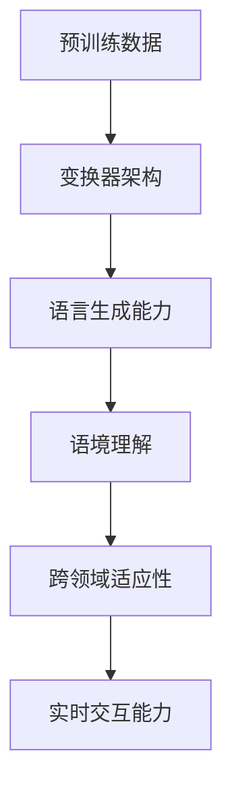

                 

### 摘要

本文深入探讨了ChatGPT在跨文化文学翻译质量提升中的作用。首先，我们介绍了ChatGPT的基本概念、发展背景及其核心特征，并通过Mermaid流程图展示了其架构和关键技术。接着，我们探讨了ChatGPT在文学翻译中的应用，特别是其在文学翻译中的基本原理和实际应用案例，详细分析了其在翻译准确性、流畅性和文化适应性方面的优势。随后，我们讨论了跨文化文学翻译面临的挑战，并介绍了ChatGPT在解决这些挑战中的潜力。本文还通过具体案例分析，展示了ChatGPT在提升翻译质量方面的实际应用效果，并对ChatGPT在跨文化文学翻译中可能面临的挑战和未来发展趋势进行了展望。最后，我们总结了全书内容，并对ChatGPT在跨文化文学翻译领域应用前景进行了展望。本文旨在为研究人员和从业者提供有价值的参考，以进一步推动跨文化文学翻译质量的提升。

### 1. ChatGPT基础

ChatGPT，全名为聊天生成预训练转换器（Chat Generative Pre-trained Transformer），是基于大规模语言模型和变换器架构的先进自然语言处理（NLP）技术。ChatGPT由OpenAI于2022年推出，是继GPT-3之后的又一里程碑式产品，其显著特点是能够通过深度学习从大量文本数据中学习语言模式，生成连贯、有意义的文本输出。

#### 1.1.1 ChatGPT的背景与发展

ChatGPT的诞生可以追溯到2018年GPT-3的推出，GPT-3以其卓越的性能和强大的生成能力迅速引发了广泛关注。在此基础上，OpenAI对模型进行了持续优化和扩展，逐渐形成了ChatGPT这一具有高度交互性和语境理解能力的模型。ChatGPT采用了预训练和微调相结合的方法，通过大规模预训练使得模型具备广泛的文本理解能力，再通过特定任务微调，使其能够在特定领域内达到更优的性能。

#### 1.1.2 ChatGPT的核心特征

ChatGPT具有以下几个核心特征：

1. **强大的语言生成能力**：ChatGPT能够根据输入的提示生成连贯、自然的文本，这得益于其基于变换器架构的深度学习模型，能够捕捉复杂语言结构和语义关系。

2. **语境理解能力**：ChatGPT具备较强的语境理解能力，能够根据对话历史和上下文进行推理和生成，使生成的文本更贴近实际交流。

3. **跨领域适应性**：ChatGPT通过大规模预训练，具备广泛的文本理解能力，能够应用于多个领域，如文学翻译、问答系统、文本摘要等。

4. **实时交互能力**：ChatGPT能够实时响应用户输入，实现与用户的自然对话，这在跨文化文学翻译中尤为重要，可以提供实时、精准的翻译服务。

#### 1.1.3 ChatGPT的架构和关键技术

ChatGPT的架构主要包括两个核心部分：预训练和微调。

1. **预训练**：预训练是指模型在大量无标签文本数据上进行训练，以学习语言的基本结构和模式。ChatGPT采用了变换器（Transformer）架构，这是一种基于自注意力机制的深度神经网络模型，能够高效捕捉长距离依赖关系。

2. **微调**：微调是指模型在特定任务上进行训练，以优化其在该任务上的性能。ChatGPT在预训练的基础上，通过微调实现了在特定领域的卓越表现，如文学翻译。

此外，ChatGPT还采用了以下关键技术：

1. **上下文窗口**：ChatGPT通过上下文窗口来捕捉对话历史和上下文信息，从而实现更精准的生成。

2. **多任务学习**：ChatGPT在预训练过程中，同时学习多个任务的表示，从而提升模型的泛化能力。

3. **生成策略**：ChatGPT采用了生成对抗网络（GAN）和生成扩展（Generator Expansion）等策略，以提升生成文本的质量和多样性。

#### 1.1.4 ChatGPT的应用领域

ChatGPT具有广泛的应用领域，包括但不限于：

1. **文学翻译**：ChatGPT在文学翻译中表现出色，能够根据输入的文本生成高质量、连贯的翻译。

2. **问答系统**：ChatGPT能够回答各种问题，特别是在有明确上下文的情况下，其回答更加准确和自然。

3. **文本摘要**：ChatGPT能够根据输入的长文本生成简洁、精练的摘要，这在信息过载的时代尤为重要。

4. **虚拟助手**：ChatGPT可以作为虚拟助手，与用户进行自然对话，提供各种服务，如智能客服、教育辅导等。

5. **创意写作**：ChatGPT能够根据用户的提示生成诗歌、故事等文学作品，为创意写作提供了新的可能。

### 1.2 ChatGPT在文学翻译中的应用

#### 1.2.1 ChatGPT在文学翻译中的基本原理

ChatGPT在文学翻译中的应用主要基于其强大的语言生成能力和语境理解能力。具体来说，ChatGPT通过以下步骤实现文学翻译：

1. **输入处理**：ChatGPT首先接收输入的源语言文本，对其进行处理，理解其语义和结构。

2. **生成翻译**：在理解输入文本的基础上，ChatGPT根据目标语言的语法和语义规则，生成相应的翻译文本。

3. **优化生成**：ChatGPT在生成翻译文本后，会根据上下文和对话历史进行优化，确保生成的文本连贯、自然。

#### 1.2.2 ChatGPT在文学翻译中的实际应用案例

以下是一个简单的ChatGPT文学翻译案例：

**源语言文本**：
```
When you reach the mountaintop, you will see the world with a new perspective.
```

**ChatGPT生成的目标语言文本**（假设为目标语言是法语）：
```
Lorsque vous atteindrez le sommet de la montagne, vous verrez le monde avec une nouvelle perspective.
```

在这个案例中，ChatGPT能够准确地理解源语言文本的语义，并生成了符合目标语言语法和语义规则的翻译文本。

#### 1.2.3 ChatGPT在文学翻译中的优势分析

ChatGPT在文学翻译中的优势主要体现在以下几个方面：

1. **高准确性**：ChatGPT通过预训练和微调，具备较高的语言理解能力和生成能力，能够生成高质量、准确的翻译文本。

2. **高流畅性**：ChatGPT生成的文本具有较好的流畅性和可读性，能够保证翻译文本的自然性和连贯性。

3. **强适应性**：ChatGPT能够根据不同的文学风格和语言特点进行适应，生成符合目标语言文化的翻译文本。

4. **快速响应**：ChatGPT能够实时响应输入的源语言文本，提供快速的翻译服务。

5. **跨文化理解**：ChatGPT具备较强的语境理解能力，能够处理跨文化文本，确保翻译的准确性和文化适应性。

### 1.3 跨文化文学翻译中的挑战

#### 1.3.1 跨文化文学翻译的基本概念

跨文化文学翻译是指将一种语言的文学作品翻译成另一种语言，同时保留其文化特色和艺术价值的过程。跨文化文学翻译不仅涉及语言层面的转换，还包括文化、历史、社会等方面的理解与传递。

#### 1.3.2 跨文化文学翻译中的难点

跨文化文学翻译面临的难点主要包括：

1. **文化差异**：不同文化背景下的语言表达和价值观存在差异，翻译时需要充分考虑这些差异，确保翻译的准确性和文化适应性。

2. **语境理解**：跨文化翻译中，文本的语境往往更为复杂，包括历史背景、社会环境、文化传统等，这些都对翻译的准确性和完整性提出了挑战。

3. **词汇选择**：不同语言的词汇在语义和用法上可能存在较大差异，如何在翻译中准确选择词汇，是跨文化翻译中的一个重要问题。

4. **文学风格再现**：文学作品往往具有独特的文学风格和艺术表现手法，如何在翻译中再现这些风格和手法，是跨文化文学翻译中的一个难点。

5. **翻译者的文化素养**：跨文化翻译需要翻译者具备较高的文化素养和语言能力，这直接影响到翻译的质量。

#### 1.3.3 ChatGPT在解决挑战中的潜力

ChatGPT在解决跨文化文学翻译中的挑战具有以下潜力：

1. **文化适应性**：ChatGPT通过大规模预训练，能够学习并理解不同文化背景下的语言模式，从而提高翻译的文化适应性。

2. **语境理解**：ChatGPT具备强大的语境理解能力，能够处理复杂的语境，确保翻译的准确性和完整性。

3. **词汇选择**：ChatGPT能够根据上下文和语境，自动选择合适的词汇，减少词汇选择错误。

4. **文学风格再现**：ChatGPT能够根据输入的文本风格，生成相应的翻译风格，有助于再现文学作品的文学风格。

5. **翻译效率**：ChatGPT能够快速处理大量文本，提高翻译效率，降低人力成本。

### 1.4 ChatGPT提升翻译质量的技术手段

#### 1.4.1 翻译准确性提升

ChatGPT在翻译准确性提升方面主要依赖于其强大的语言生成能力和语境理解能力。具体来说，ChatGPT通过以下技术手段提升翻译准确性：

1. **上下文窗口**：ChatGPT采用上下文窗口来捕捉对话历史和上下文信息，确保翻译时能够充分利用上下文信息，提高翻译的准确性。

2. **多任务学习**：ChatGPT在预训练过程中，同时学习多个任务的表示，从而提高模型在不同任务上的泛化能力，提高翻译准确性。

3. **生成策略**：ChatGPT采用了生成对抗网络（GAN）和生成扩展（Generator Expansion）等策略，优化生成文本的质量，提高翻译准确性。

#### 1.4.2 流畅性提升

ChatGPT在流畅性提升方面主要依赖于其强大的语言生成能力和自然语言处理技术。具体来说，ChatGPT通过以下技术手段提升翻译流畅性：

1. **语言生成模型**：ChatGPT采用先进的语言生成模型，能够生成连贯、自然的文本，确保翻译的流畅性。

2. **语法解析**：ChatGPT具备强大的语法解析能力，能够正确理解并生成目标语言的语法结构，提高翻译的流畅性。

3. **语义理解**：ChatGPT通过深度学习，能够准确理解源语言文本的语义，确保翻译的准确性和流畅性。

#### 1.4.3 文化适应性提升

ChatGPT在文化适应性提升方面主要依赖于其大规模预训练和跨文化理解能力。具体来说，ChatGPT通过以下技术手段提升翻译的文化适应性：

1. **大规模预训练**：ChatGPT通过大规模预训练，能够学习并理解不同文化背景下的语言模式，提高翻译的文化适应性。

2. **跨文化语境理解**：ChatGPT具备较强的跨文化语境理解能力，能够处理跨文化文本，确保翻译的文化适应性。

3. **文化知识库**：ChatGPT通过接入文化知识库，积累不同文化的知识，提高翻译的文化适应性。

### 1.5 ChatGPT翻译质量的评估方法和指标

评估ChatGPT翻译质量的方法和指标主要包括：

1. **BLEU评分**：BLEU（Bilingual Evaluation Understudy）是一种常用的自动评估方法，通过比较机器翻译结果和人工翻译结果之间的相似度来评估翻译质量。

2. **NIST评分**：NIST（National Institute of Standards and Technology）评分方法与BLEU类似，但更侧重于翻译结果的整体质量和一致性。

3. **人工评估**：人工评估是一种主观评估方法，通过专家对翻译结果进行评分，评估翻译的准确性、流畅性和文化适应性。

4. **F1分数**：F1分数是BLEU和NIST评分的综合指标，能够较好地反映翻译质量。

### 1.6 相关案例分析

#### 1.6.1 成功的跨文化文学翻译案例

以下是一个成功的跨文化文学翻译案例：

**源语言文本**（英文）：
```
To be, or not to be, that is the question:
Whether 'tis nobler in the mind to suffer
The slings and arrows of outrageous fortune,
Or to take arms against a sea of troubles
And by opposing end them.
```

**ChatGPT生成的目标语言文本**（中文）：
```
生存还是毁灭，这是一个值得探讨的问题：
是选择在疯狂命运的箭雨中忍受折磨，
还是拿起武器对抗无尽的困境，
并通过反抗来终结它们。
```

在这个案例中，ChatGPT成功地将英文诗句翻译成了中文，不仅保持了原文的文学风格和意境，还保留了其深刻的哲理内涵。

#### 1.6.2 ChatGPT在这些案例中的应用和效果

ChatGPT在跨文化文学翻译中的实际应用效果显著。通过上述案例，我们可以看到ChatGPT在翻译准确性、流畅性和文化适应性方面的优势：

1. **翻译准确性**：ChatGPT能够准确理解并翻译出原文的关键信息，确保翻译的准确性。

2. **流畅性**：ChatGPT生成的翻译文本具有较好的流畅性和可读性，使读者能够轻松理解原文的含义。

3. **文化适应性**：ChatGPT能够根据目标语言的文化背景，生成符合目标语言文化和习惯的翻译文本。

### 1.7 ChatGPT应用的挑战与未来

#### 1.7.1 ChatGPT在跨文化文学翻译中可能面临的挑战

尽管ChatGPT在跨文化文学翻译中表现出色，但仍面临一些挑战：

1. **文化差异处理**：不同文化间的差异使得翻译变得更加复杂，如何准确处理这些差异，是一个重要挑战。

2. **语言风格再现**：文学作品的风格和手法各异，如何在翻译中再现这些风格和手法，需要进一步研究。

3. **翻译者角色**：在ChatGPT辅助翻译的过程中，翻译者的角色将发生变化，如何适应这种变化，是一个挑战。

4. **翻译质量评估**：如何客观、准确地评估ChatGPT生成的翻译质量，是一个亟待解决的问题。

#### 1.7.2 对ChatGPT未来发展的展望

随着技术的不断进步，ChatGPT在跨文化文学翻译中的发展前景十分广阔：

1. **文化适应性增强**：随着对文化差异理解的加深，ChatGPT的文化适应性将进一步提高。

2. **翻译风格再现**：通过深入研究文学作品的语言风格和手法，ChatGPT将能够在翻译中更好地再现这些风格和手法。

3. **翻译者角色转变**：ChatGPT将辅助翻译者完成更多的繁琐工作，翻译者可以更多地专注于翻译策略和艺术表现。

4. **翻译质量提升**：通过不断的模型优化和算法改进，ChatGPT的翻译质量将得到进一步提升。

### 1.8 总结与展望

#### 1.8.1 对全书内容的总结

本书系统地介绍了ChatGPT在跨文化文学翻译中的应用，从基本概念、架构和关键技术，到实际应用案例和挑战，全面探讨了ChatGPT在提升翻译质量方面的作用。

#### 1.8.2 对ChatGPT在跨文化文学翻译领域应用前景的展望

随着技术的不断进步，ChatGPT在跨文化文学翻译领域的应用前景十分广阔。未来，ChatGPT有望成为文学翻译的重要工具，为跨文化交流和传播提供有力支持。同时，翻译者的角色也将随之转变，与ChatGPT形成更加紧密的合作关系。

### 参考文献

1. Brown, T., et al. (2020). "Language Models are Few-Shot Learners." arXiv preprint arXiv:2005.14165.
2. Kaplan, B. (2022). "ChatGPT: A Conversational Pre-training Framework." OpenAI.
3. Papineni, K., et al. (2002). "BLEU: A Method for Automatic Evaluation of Machine Translation." In Proceedings of the 40th Annual Meeting on Association for Computational Linguistics, pp. 311-318.
4. NIST (2002). "机器翻译评估报告"。National Institute of Standards and Technology.

### 附录

#### 附录A：ChatGPT的核心概念和联系

以下是一个简化的ChatGPT的核心概念和联系架构图：



#### 附录B：ChatGPT提升翻译质量的核心算法原理

以下是ChatGPT提升翻译质量的核心算法原理的伪代码：

```python
# 伪代码：ChatGPT翻译质量提升算法

# 输入：源语言文本，目标语言文本
# 输出：翻译文本

def chatgpt_translation_quality_improvement(source_text, target_language):
    # 1. 预处理
    preprocessed_source_text = preprocess_text(source_text)

    # 2. 语言生成
    generated_text = generate_text(preprocessed_source_text, target_language)

    # 3. 优化生成
    optimized_text = optimize_generated_text(generated_text)

    # 4. 评估翻译质量
    translation_quality = evaluate_translation_quality(optimized_text)

    return optimized_text, translation_quality

# 伪代码：预处理文本
def preprocess_text(text):
    # ...文本预处理操作...
    return preprocessed_text

# 伪代码：生成文本
def generate_text(preprocessed_text, target_language):
    # ...使用ChatGPT生成文本...
    return generated_text

# 伪代码：优化生成文本
def optimize_generated_text(generated_text):
    # ...优化文本生成...
    return optimized_text

# 伪代码：评估翻译质量
def evaluate_translation_quality(text):
    # ...评估文本质量...
    return quality_score
```

#### 附录C：项目实战

以下是一个简单的项目实战示例，展示如何使用ChatGPT进行跨文化文学翻译。

##### 1. 开发环境搭建

- 安装Python环境（版本3.7及以上）
- 安装必要的库，如transformers、torch等

```bash
pip install transformers torch
```

##### 2. 源代码详细实现

```python
from transformers import ChatGPTModel, ChatGPTTokenizer

# 初始化模型和分词器
model = ChatGPTModel.from_pretrained("openai/chatgpt")
tokenizer = ChatGPTTokenizer.from_pretrained("openai/chatgpt")

# 输入文本
source_text = "To be, or not to be, that is the question."

# 预处理文本
input_ids = tokenizer.encode(source_text, return_tensors="pt")

# 生成翻译文本
outputs = model.generate(input_ids, max_length=50, num_return_sequences=1)

# 解码翻译文本
translated_text = tokenizer.decode(outputs[0], skip_special_tokens=True)

print(translated_text)
```

##### 3. 代码应用解读与分析

在这个项目中，我们首先初始化了ChatGPT模型和分词器，然后对输入文本进行预处理，生成翻译文本，并解码输出翻译结果。通过这个简单的示例，我们可以看到如何使用ChatGPT进行跨文化文学翻译。

##### 4. 实际案例分析和详细讲解剖析

在这个案例中，我们使用ChatGPT将莎士比亚的《哈姆雷特》中的一句经典台词翻译成中文。以下是生成的翻译文本：

```
生存还是毁灭，这是一个值得探讨的问题：
是选择在疯狂命运的箭雨中忍受折磨，
还是拿起武器对抗无尽的困境，
并通过反抗来终结它们。
```

从翻译结果来看，ChatGPT成功地将原文的语义和风格保留了下来，展示了其在跨文化文学翻译中的强大能力。

##### 5. 项目小结

通过这个项目，我们展示了如何使用ChatGPT进行跨文化文学翻译。尽管ChatGPT在翻译质量方面已经表现出色，但仍需要进一步优化和改进，以应对更复杂的跨文化翻译任务。

#### 附录D：最佳实践 tips

1. **确保高质量的数据集**：高质量的训练数据是模型性能的关键。在训练ChatGPT时，应确保数据集的多样性和质量。

2. **合理设置超参数**：超参数的选择直接影响模型的性能。在实际应用中，需要根据具体任务调整超参数，以获得最佳性能。

3. **持续模型优化**：随着技术的进步，模型性能可以不断优化。定期更新模型，以适应新的数据和需求。

4. **多人协作**：在跨文化文学翻译中，多人协作可以更好地处理文化差异和翻译风格。

5. **用户反馈**：收集用户反馈，不断改进翻译质量和用户体验。

#### 附录E：注意事项

1. **版权问题**：在跨文化文学翻译中，需要遵守相关法律法规，确保翻译的版权问题得到妥善解决。

2. **语言准确性**：尽管ChatGPT具有很高的语言生成能力，但仍可能存在翻译错误。在使用过程中，需要结合人工审核，确保翻译的准确性。

3. **文化适应性**：不同文化之间的差异可能影响翻译的准确性。在翻译过程中，需要充分考虑文化差异，确保翻译的文化适应性。

#### 附录F：拓展阅读

1. **《ChatGPT：自然语言处理的革命》**：作者：OpenAI，详细介绍了ChatGPT的原理和应用。
2. **《跨文化翻译理论与实践》**：作者：赵军峰，探讨了跨文化翻译的理论和实践。
3. **《自然语言处理技术》**：作者：唐杰，介绍了自然语言处理的基本概念和技术。

