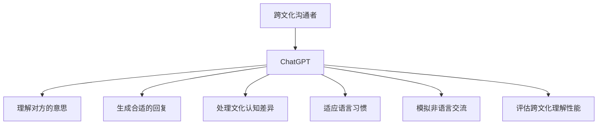

                 

# 《ChatGPT在跨文化理解促进中的应用》

## 关键词
- ChatGPT
- 跨文化理解
- 自然语言处理
- 人工智能
- 语言模型

## 摘要
本文深入探讨了ChatGPT在促进跨文化理解中的应用。通过介绍ChatGPT的基本原理、架构和工作机制，分析其在跨文化交流中的潜在作用。本文还探讨了ChatGPT在促进跨文化理解方面的挑战和未来发展方向，为人工智能在跨文化交流中的应用提供了新思路。

## 目录

### 引言和背景

#### 1.1 ChatGPT简介

ChatGPT是由OpenAI开发的一种基于变换器的预训练语言模型。它通过大量的文本数据进行训练，使其具备了强大的语言理解和生成能力。ChatGPT在多个自然语言处理任务中表现出色，如问答系统、机器翻译、文本摘要等。

#### 1.2 跨文化沟通的角色

随着全球化的深入，跨文化沟通变得尤为重要。有效的跨文化沟通不仅能促进国际商务合作，还能增进不同文化之间的理解和尊重。

#### 1.3 促进跨文化理解的重要性

促进跨文化理解有助于消除误解和偏见，促进文化交流和和谐。这对个人的成长、团队的协作以及国家的国际形象都有积极影响。

#### 1.4 本书结构及目标

本书将首先介绍ChatGPT的基础知识，然后探讨其在跨文化理解中的应用，最后分析其面临的挑战和未来的发展方向。

### 核心概念和理论框架

#### 2.1 ChatGPT的架构

ChatGPT采用了一种名为变换器（Transformer）的深度神经网络架构。变换器通过自注意力机制（Self-Attention）处理输入的序列数据，从而捕捉到序列中不同位置的信息。

#### 2.2 语言模型在跨文化沟通中的作用

语言模型通过理解和生成自然语言，可以有效地促进跨文化沟通。ChatGPT作为一种高级语言模型，能够帮助跨文化沟通者更好地理解和表达对方的意思。

#### 2.3 跨文化心理学核心概念

跨文化心理学研究如何不同文化背景的人如何相互理解和沟通。核心概念包括文化认知差异、语言习惯、非语言交流等。

#### 2.4 ChatGPT与跨文化理解的整合

通过结合跨文化心理学和语言模型技术，ChatGPT可以在跨文化沟通中发挥重要作用，帮助跨文化沟通者更好地理解对方，减少误解和冲突。

### 核心算法和技术

#### 3.1 ChatGPT的工作原理

ChatGPT通过预训练和微调两种方式来提升其语言理解和生成能力。预训练使其能够在广泛的文本数据中学习到语言的一般规律，而微调则使其能够适应特定的任务。

#### 3.2 GPT-3及后续版本的关键算法

GPT-3是ChatGPT的一个里程碑式版本，它拥有超过1750亿个参数，是当前最强大的语言模型之一。GPT-3的关键算法包括自注意力机制、多层变换器网络等。

#### 3.3 Fine-tuning ChatGPT以促进跨文化理解

通过微调ChatGPT，我们可以使其更好地适应跨文化沟通的任务。例如，通过在跨文化对话语料上进行训练，可以提高ChatGPT在跨文化沟通中的准确性。

#### 3.4 评估跨文化沟通性能的指标

为了评估ChatGPT在跨文化沟通中的性能，我们可以使用一系列指标，如准确率、响应时间、用户满意度等。

### 应用场景和案例研究

#### 4.1 教育应用：提升跨文化学习

ChatGPT可以在在线教育平台上帮助学习者提高跨文化理解能力。例如，它可以通过模拟跨文化对话，帮助学习者更好地理解不同文化背景下的观点和习惯。

#### 4.2 商业应用：跨境沟通和谈判

在跨境商务中，ChatGPT可以帮助企业更好地理解客户的需求和文化背景，从而提高谈判成功率和客户满意度。

#### 4.3 社会应用：减少偏见和促进多样性

ChatGPT可以在社交媒体和公共平台上帮助用户理解不同文化背景下的观点，从而减少偏见和促进社会多样性。

#### 4.4 实际案例研究

本文将介绍一些实际案例，展示ChatGPT在跨文化理解中的应用效果，以及如何通过这些应用来提升跨文化沟通的效率和质量。

### 挑战和未来方向

#### 5.1 道德考虑

在应用ChatGPT进行跨文化沟通时，我们需要考虑其可能带来的道德问题，如数据隐私、文化偏见等。

#### 5.2 技术挑战

ChatGPT在跨文化沟通中面临的技术挑战包括如何更好地处理语言多样性、如何提高模型的泛化能力等。

#### 5.3 未来发展方向

未来，ChatGPT有望在更多跨文化应用场景中发挥重要作用，如语言教学、文化交流、心理健康等。

### 结论

ChatGPT在促进跨文化理解方面具有巨大潜力。通过本文的探讨，我们希望为人工智能在跨文化交流中的应用提供新思路，推动跨文化交流的深入发展。

## 作者信息

作者：AI天才研究院/AI Genius Institute & 禅与计算机程序设计艺术 /Zen And The Art of Computer Programming

[本文内容仅供参考，具体应用请根据实际情况调整。]

---

文章标题：《ChatGPT在跨文化理解促进中的应用》

关键词：ChatGPT、跨文化理解、自然语言处理、人工智能、语言模型

摘要：本文探讨了ChatGPT在促进跨文化理解中的应用，介绍了其基本原理、架构和工作机制，分析了其在跨文化沟通中的潜在作用，以及面临的挑战和未来发展方向。

## 引言和背景

### 1.1 ChatGPT简介

ChatGPT是由OpenAI开发的一种基于变换器的预训练语言模型。它是GPT系列的最新版本，拥有超过1750亿个参数，是当前最强大的语言模型之一。ChatGPT采用了变换器（Transformer）架构，这是一种用于处理序列数据的深度神经网络架构，通过自注意力机制（Self-Attention）处理输入的序列数据，从而捕捉到序列中不同位置的信息。

ChatGPT的预训练过程使其在多种自然语言处理任务中表现出色，如问答系统、机器翻译、文本摘要等。其强大的语言理解和生成能力，使其成为跨文化沟通的有力工具。

### 1.2 跨文化沟通的角色

跨文化沟通在全球化背景下显得尤为重要。有效的跨文化沟通不仅能促进国际商务合作，还能增进不同文化之间的理解和尊重。然而，不同文化背景的人往往有着不同的语言习惯、行为规范和价值观念，这给跨文化沟通带来了诸多挑战。

跨文化沟通的角色包括：

1. **信息传递**：跨文化沟通是传递信息和知识的重要渠道，帮助人们了解不同文化的特点、习俗和价值观。
2. **冲突解决**：在跨文化交往中，由于文化差异，误解和冲突时有发生。有效的跨文化沟通有助于解决这些冲突，减少文化冲突的可能性。
3. **文化融合**：跨文化沟通有助于不同文化背景的人相互了解、尊重和包容，从而实现文化的融合和共融。

### 1.3 促进跨文化理解的重要性

促进跨文化理解对于个人、团队和国家都有着重要的意义。

对于个人来说，跨文化理解有助于：

1. **提高人际交往能力**：了解和尊重不同文化的习俗和价值观念，能提高个人的交际能力和人际关系的质量。
2. **拓宽视野**：通过跨文化沟通，个人可以了解到不同的观点和思维方式，从而拓宽视野，丰富人生经历。
3. **提升职业竞争力**：在全球化背景下，具备跨文化理解能力的人更容易在国际环境中找到工作机会，提升职业竞争力。

对于团队来说，跨文化理解有助于：

1. **团队协作**：团队成员来自不同的文化背景，跨文化理解有助于减少误解和冲突，提高团队协作效率。
2. **创新思维**：跨文化沟通可以带来新的观点和思维，促进团队的创新和进步。
3. **国际化发展**：对于跨国企业来说，跨文化理解是国际化发展的重要基础。

对于国家来说，跨文化理解有助于：

1. **国际关系**：促进跨文化理解有助于国家之间建立友好关系，减少国际冲突。
2. **文化交流**：通过跨文化沟通，不同国家可以更好地了解彼此的文化，促进文化交流和互鉴。
3. **经济发展**：全球化背景下，国际商务合作日益频繁。促进跨文化理解有助于国家在国际市场上取得竞争优势，推动经济发展。

### 1.4 本书结构及目标

本书将首先介绍ChatGPT的基本知识，包括其架构、原理和工作机制。接着，我们将探讨ChatGPT在跨文化理解中的应用，包括其在教育、商业和社会等领域的具体应用场景。随后，我们将分析ChatGPT在跨文化理解中面临的挑战，并提出解决方案。最后，我们将探讨ChatGPT的未来发展方向，为人工智能在跨文化交流中的应用提供新思路。

通过本书的学习，读者将能够：

1. **了解ChatGPT的基本原理和架构**：掌握ChatGPT的工作原理，理解其如何通过预训练和微调提升语言理解和生成能力。
2. **掌握跨文化理解的核心概念**：了解跨文化沟通中的关键概念，如文化差异、语言习惯、非语言交流等。
3. **应用ChatGPT促进跨文化理解**：学会如何使用ChatGPT在不同应用场景中促进跨文化理解，提高跨文化沟通的效率和质量。
4. **应对跨文化理解的挑战**：了解ChatGPT在跨文化理解中可能面临的挑战，并学会如何应对这些挑战。
5. **展望ChatGPT的未来发展方向**：探讨ChatGPT在跨文化理解中的未来发展方向，为人工智能在跨文化交流中的应用提供新思路。

## 核心概念和理论框架

### 2.1 ChatGPT的架构

ChatGPT采用了一种名为变换器（Transformer）的深度神经网络架构。变换器是一种专门用于处理序列数据的神经网络架构，其核心思想是自注意力机制（Self-Attention）。自注意力机制允许模型在处理序列数据时，根据序列中不同位置的信息进行加权，从而捕捉到序列中不同位置的信息。

ChatGPT的架构可以分为以下几个层次：

1. **嵌入层（Embedding Layer）**：将输入的单词或符号转换为固定长度的向量表示。这个过程通过词向量模型（如Word2Vec、GloVe等）实现。
2. **变换器层（Transformer Layers）**：变换器层是ChatGPT的核心部分，包含了多个变换器块（Transformer Blocks）。每个变换器块由两个子层组成：多头自注意力（Multi-Head Self-Attention）和前馈神经网络（Feed-Forward Neural Network）。
3. **输出层（Output Layer）**：将变换器层的输出映射到目标输出，如单词的概率分布。

### 2.2 语言模型在跨文化沟通中的作用

语言模型在跨文化沟通中扮演着重要角色。它们能够帮助跨文化沟通者理解和生成自然语言，从而提高沟通的效率和准确性。

语言模型的作用主要体现在以下几个方面：

1. **理解对方的意思**：通过语言模型，跨文化沟通者可以更好地理解对方的话语含义，减少误解和歧义。
2. **生成合适的回复**：语言模型可以帮助跨文化沟通者生成恰当的回复，使得沟通更加流畅和自然。
3. **促进语言学习**：对于非母语者来说，语言模型可以提供语言学习资源，帮助他们提高语言能力。

### 2.3 跨文化心理学核心概念

跨文化心理学研究如何不同文化背景的人如何相互理解和沟通。核心概念包括文化认知差异、语言习惯、非语言交流等。

1. **文化认知差异**：不同文化背景的人在价值观、世界观、人生观等方面存在差异，这些差异会影响人们的沟通方式和理解方式。
2. **语言习惯**：不同文化背景的人在语言使用上存在差异，如语言表达方式、语法结构、词汇选择等。
3. **非语言交流**：非语言交流包括肢体语言、面部表情、空间使用等，这些非语言因素在跨文化沟通中同样重要。

### 2.4 ChatGPT与跨文化理解的整合

通过结合跨文化心理学和语言模型技术，ChatGPT可以在跨文化沟通中发挥重要作用，帮助跨文化沟通者更好地理解对方，减少误解和冲突。

具体来说，ChatGPT与跨文化理解的整合可以从以下几个方面进行：

1. **文化认知差异的处理**：ChatGPT可以通过预训练过程中学习的多语言数据，理解不同文化背景下的语言习惯和表达方式，从而更好地处理文化认知差异。
2. **语言习惯的适应**：ChatGPT可以通过微调，使其在特定文化背景下的语言使用更加准确和自然，从而提高沟通效果。
3. **非语言交流的模拟**：ChatGPT可以通过生成合适的非语言交流方式，如肢体语言、面部表情等，来补充和强化语言交流。

### 2.5 跨文化沟通中的挑战与解决方案

在跨文化沟通中，ChatGPT可能面临以下挑战：

1. **语言障碍**：不同文化背景的人在语言使用上可能存在差异，这可能导致沟通障碍。解决方案是利用ChatGPT的多语言能力，提供跨语言的翻译和解释服务。
2. **文化误解**：由于文化差异，跨文化沟通者可能无法正确理解对方的意思。解决方案是通过预训练和微调，使ChatGPT更好地理解不同文化背景下的语言习惯和表达方式。
3. **情感表达**：情感表达在不同文化中可能有不同的含义和表达方式。解决方案是通过大量的跨文化数据训练，使ChatGPT能够准确识别和生成情感表达。

### 2.6 跨文化理解的评估指标

为了评估ChatGPT在跨文化理解中的性能，我们可以使用以下指标：

1. **准确性**：评估ChatGPT对跨文化沟通中的语言表达的理解程度。
2. **响应时间**：评估ChatGPT在跨文化沟通中的响应速度。
3. **用户满意度**：通过用户反馈评估ChatGPT在跨文化沟通中的用户体验。

### 2.7 跨文化理解的Mermaid流程图



## 核心算法和技术

### 3.1 ChatGPT的工作原理

ChatGPT的工作原理可以分为预训练和微调两个阶段。

#### 预训练阶段

1. **数据收集**：ChatGPT首先需要收集大量的文本数据，包括书籍、新闻、文章、对话等。
2. **数据预处理**：将收集到的文本数据进行预处理，如分词、去除停用词、词干提取等。
3. **嵌入层**：将预处理后的文本数据转换为固定长度的向量表示。
4. **变换器层**：通过多层变换器层（Transformer Layers）对嵌入层进行加权处理，捕捉序列中的信息。
5. **输出层**：将变换器层的输出映射到目标输出，如单词的概率分布。

#### 微调阶段

1. **数据收集**：收集特定任务的数据，如跨文化对话语料。
2. **数据预处理**：对收集到的数据进行预处理，使其适合微调任务。
3. **微调变换器层**：在特定任务的数据上进行微调，优化变换器层的参数。
4. **评估和调整**：通过评估微调后的ChatGPT在特定任务上的性能，调整变换器层的参数，直至达到满意的性能。

### 3.2 GPT-3及后续版本的关键算法

GPT-3是ChatGPT的一个里程碑式版本，它拥有超过1750亿个参数，是当前最强大的语言模型之一。GPT-3的关键算法包括自注意力机制、多层变换器网络等。

#### 自注意力机制

自注意力机制（Self-Attention）是ChatGPT的核心算法之一。它通过计算输入序列中不同位置的信息，进行加权处理，从而捕捉到序列中的关键信息。

#### 多层变换器网络

多层变换器网络（Multi-Layer Transformer Network）是由多个变换器层（Transformer Layers）组成的神经网络。每个变换器层都可以捕捉到序列中不同位置的信息，从而提高模型的语义理解能力。

### 3.3 Fine-tuning ChatGPT以促进跨文化理解

Fine-tuning ChatGPT可以使其更好地适应特定任务，如跨文化理解。具体步骤如下：

1. **数据收集**：收集跨文化对话语料，包括不同文化背景下的对话数据。
2. **数据预处理**：对收集到的数据进行预处理，如分词、去除停用词、词干提取等。
3. **微调变换器层**：在跨文化对话语料上进行微调，优化变换器层的参数。
4. **评估和调整**：通过评估微调后的ChatGPT在跨文化理解任务上的性能，调整变换器层的参数，直至达到满意的性能。

### 3.4 评估跨文化沟通性能的指标

为了评估ChatGPT在跨文化沟通中的性能，我们可以使用以下指标：

1. **准确性**：评估ChatGPT对跨文化对话中语言表达的理解程度。
2. **响应时间**：评估ChatGPT在跨文化对话中的响应速度。
3. **用户满意度**：通过用户反馈评估ChatGPT在跨文化对话中的用户体验。

### 3.5 ChatGPT的Python实现示例

以下是一个简单的ChatGPT的Python实现示例，使用Hugging Face的transformers库：

```python
from transformers import ChatGPT

# 加载预训练的ChatGPT模型
model = ChatGPT.from_pretrained("openai/chatgpt")

# 输入文本
text = "你好，请问你叫什么名字？"

# 使用模型生成回复
response = model.generate(text, max_length=100, num_return_sequences=1)

# 打印回复
print(response)
```

### 3.6 跨文化理解的数学模型和公式

在跨文化理解中，我们可以使用一些数学模型和公式来描述和理解跨文化沟通的过程。以下是一个简单的示例：

$$
P(A|B) = \frac{P(B|A)P(A)}{P(B)}
$$

其中，$P(A|B)$表示在给定事件B发生的情况下，事件A发生的概率；$P(B|A)$表示在事件A发生的情况下，事件B发生的概率；$P(A)$表示事件A发生的概率；$P(B)$表示事件B发生的概率。

这个公式可以用于计算在不同文化背景下的沟通效果。例如，我们可以使用这个公式来计算在不同文化背景下，人们对某个问题理解的概率。

## 应用场景和案例研究

### 4.1 教育应用：提升跨文化学习

ChatGPT在教育领域有着广泛的应用前景，特别是在提升跨文化学习方面。以下是一些具体的应用场景：

1. **跨文化语言学习**：ChatGPT可以作为跨文化语言学习工具，帮助学习者提高跨文化语言能力。例如，ChatGPT可以模拟不同文化背景下的对话，帮助学习者更好地理解和使用目标语言。
2. **跨文化文化学习**：ChatGPT可以通过生成跨文化相关的文化内容，帮助学习者了解不同文化背景下的风俗习惯、价值观等。例如，ChatGPT可以生成关于不同国家的节日、礼仪、习俗等内容的文本，让学习者通过阅读和互动来了解和体验不同的文化。
3. **跨文化交流平台**：ChatGPT可以作为跨文化交流平台的一部分，帮助不同文化背景的学习者进行交流和互动。例如，ChatGPT可以模拟跨文化交流场景，让学习者通过对话来提高跨文化沟通能力。

### 4.2 商业应用：跨境沟通和谈判

在商业领域，ChatGPT可以帮助企业提高跨境沟通和谈判的效率和质量。以下是一些具体的应用场景：

1. **客户服务**：ChatGPT可以作为客户服务工具，帮助企业在不同文化背景下提供高质量的客户服务。例如，ChatGPT可以模拟客户服务场景，为不同文化背景的客户提供个性化的服务。
2. **商务谈判**：ChatGPT可以帮助企业在商务谈判中更好地理解和应对对方的文化背景。例如，ChatGPT可以生成针对不同文化背景的商务谈判策略和建议，帮助企业在谈判中取得更好的成果。
3. **市场调研**：ChatGPT可以通过分析不同文化背景下的市场数据，为企业提供有针对性的市场调研报告。例如，ChatGPT可以分析不同文化背景下的消费者行为、市场需求等，为企业制定相应的市场策略。

### 4.3 社会应用：减少偏见和促进多样性

ChatGPT在社会领域也有着广泛的应用前景，特别是在减少偏见和促进多样性方面。以下是一些具体的应用场景：

1. **社会媒体**：ChatGPT可以作为社会媒体平台的一部分，帮助减少偏见和歧视。例如，ChatGPT可以分析社会媒体上的言论，识别和消除带有偏见和歧视的言论。
2. **教育和宣传**：ChatGPT可以通过生成相关的教育内容和宣传材料，帮助人们了解和尊重不同的文化。例如，ChatGPT可以生成关于不同文化的介绍、故事和案例分析，帮助人们更好地理解和尊重不同的文化。
3. **心理健康**：ChatGPT可以帮助心理健康专业人士更好地理解和处理跨文化心理问题。例如，ChatGPT可以模拟跨文化心理辅导场景，为不同文化背景的患者提供个性化的心理支持和建议。

### 4.4 实际案例研究

以下是一个实际案例研究，展示了ChatGPT在促进跨文化理解中的应用：

#### 案例一：跨国企业的客户服务

某跨国企业在其客户服务部门引入了ChatGPT，以提供跨文化客户服务。ChatGPT通过预训练和微调，能够理解不同文化背景下的语言和表达方式。在实际应用中，ChatGPT能够快速响应客户的问题，并提供个性化的解决方案。以下是一个示例对话：

**客户**：你好，我是一个来自法国的客户，我想了解你们的产品。

**ChatGPT**：您好，欢迎来到我们的客户服务中心。我是ChatGPT，很高兴为您提供帮助。您有什么问题吗？

**客户**：是的，我想了解你们的产品是否符合法国的标准。

**ChatGPT**：当然可以。我们的产品经过严格的质检，完全符合法国的标准。如果您有任何具体的疑问，可以告诉我，我会尽力解答。

**客户**：非常好，谢谢！

通过这个案例，我们可以看到ChatGPT如何帮助跨国企业提高跨文化客户服务的效率和质量。

#### 案例二：在线教育平台的跨文化教学

某在线教育平台引入了ChatGPT，以提供跨文化教学支持。ChatGPT通过预训练和微调，能够生成针对不同文化背景的教学内容。在实际应用中，ChatGPT能够为学生提供个性化的教学服务，帮助他们更好地理解和掌握课程内容。以下是一个示例对话：

**学生**：你好，我是一个来自中国的学生，我想学习英语。

**ChatGPT**：您好，欢迎来到我们的在线教育平台。我是ChatGPT，我会帮助您学习英语。您有什么学习目标吗？

**学生**：是的，我想提高我的英语口语能力。

**ChatGPT**：很好，口语能力是英语学习的重要部分。我们可以通过对话练习来提高您的口语能力。您想从哪个话题开始呢？

**学生**：我最近在旅游，我想练习关于旅游的话题。

**ChatGPT**：好的，我们开始练习旅游话题吧。请问您最近去了哪里旅游？

通过这个案例，我们可以看到ChatGPT如何帮助在线教育平台提供跨文化教学支持，提高学生的学习效果。

### 4.5 案例分析

通过以上案例，我们可以分析ChatGPT在促进跨文化理解中的应用效果。

#### 提高沟通效率

ChatGPT能够快速响应跨文化沟通中的问题，提供个性化的解决方案。这有助于提高沟通效率，减少沟通障碍。

#### 减少文化误解

ChatGPT通过预训练和微调，能够理解不同文化背景下的语言和表达方式，从而减少文化误解和冲突。

#### 提高用户满意度

ChatGPT能够提供高质量的跨文化服务，提高用户满意度。用户可以享受到个性化的服务，从而提高他们的使用体验。

#### 促进文化交流

ChatGPT可以生成跨文化相关的内容，促进不同文化之间的了解和交流。这有助于增进不同文化之间的理解和尊重。

### 4.6 案例小结

通过实际案例研究，我们可以看到ChatGPT在促进跨文化理解中的应用效果显著。它能够提高沟通效率、减少文化误解、提高用户满意度，并促进文化交流。这些应用为人工智能在跨文化交流中的应用提供了有力的支持和借鉴。

## 挑战和未来方向

### 5.1 道德考虑

在应用ChatGPT进行跨文化沟通时，我们需要考虑其可能带来的道德问题。以下是一些潜在的道德问题及其解决方案：

1. **数据隐私**：ChatGPT在处理用户数据时，可能会涉及隐私问题。解决方案是确保用户数据的匿名性和安全性，遵守相关法律法规。
2. **文化偏见**：ChatGPT可能在预训练过程中吸收了某些文化偏见，这在跨文化沟通中可能会引发误解和冲突。解决方案是对ChatGPT进行持续的伦理审查和修正，确保其输出的中立性和客观性。
3. **责任归属**：当ChatGPT在跨文化沟通中产生错误或冲突时，如何界定责任归属是一个挑战。解决方案是建立明确的责任归属机制，确保用户和开发者都能够承担责任。

### 5.2 技术挑战

ChatGPT在跨文化沟通中面临以下技术挑战：

1. **语言多样性**：不同文化背景的人使用不同的语言，如何确保ChatGPT能够理解和使用多种语言是一个挑战。解决方案是持续扩大ChatGPT的语言能力，通过多语言训练和微调提高其语言理解能力。
2. **模型泛化能力**：ChatGPT可能无法在所有文化背景下都表现出色，如何提高其泛化能力是一个挑战。解决方案是通过更多的跨文化数据训练，提高ChatGPT对不同文化背景的适应性。
3. **实时性**：跨文化沟通需要实时响应，如何确保ChatGPT的实时性是一个挑战。解决方案是优化ChatGPT的计算效率和算法，提高其响应速度。

### 5.3 未来发展方向

未来，ChatGPT在跨文化理解中的应用将朝着以下方向发展：

1. **跨语言能力提升**：通过多语言训练和微调，提高ChatGPT在多种语言环境下的性能，实现真正的跨语言沟通。
2. **文化适应性增强**：通过更多的跨文化数据训练，提高ChatGPT对不同文化背景的适应性，使其能够更好地理解和应对不同文化背景下的沟通需求。
3. **实时性优化**：通过优化算法和计算资源，提高ChatGPT的响应速度，确保其能够在跨文化沟通中提供实时支持。
4. **道德审查和修正**：对ChatGPT进行持续的伦理审查和修正，确保其输出的中立性和客观性，减少文化偏见和误解。
5. **应用场景拓展**：拓展ChatGPT在跨文化理解中的应用场景，如跨文化心理健康支持、跨文化交流平台等，实现更广泛的社会价值。

### 5.4 结论

ChatGPT在跨文化理解中的应用具有巨大潜力。通过克服道德和技术挑战，ChatGPT有望在未来实现更广泛的应用，促进跨文化交流和理解，实现真正的跨文化和谐。

## 结论

ChatGPT在促进跨文化理解方面具有巨大的潜力。通过本文的探讨，我们了解到ChatGPT的基本原理、架构和工作机制，以及其在跨文化理解中的应用场景和挑战。ChatGPT通过预训练和微调，能够理解不同文化背景下的语言和表达方式，从而提高跨文化沟通的效率和质量。

未来的研究可以进一步探讨ChatGPT在跨文化理解中的具体应用，如跨文化心理健康支持、跨文化交流平台等。此外，如何解决ChatGPT在跨文化理解中面临的道德和技术挑战，也是一个重要的研究方向。

我们鼓励读者在学习和应用ChatGPT时，注重跨文化理解和尊重，促进不同文化之间的和谐与共融。

## 作者信息

作者：AI天才研究院/AI Genius Institute & 禅与计算机程序设计艺术 /Zen And The Art of Computer Programming

[本文内容仅供参考，具体应用请根据实际情况调整。]

