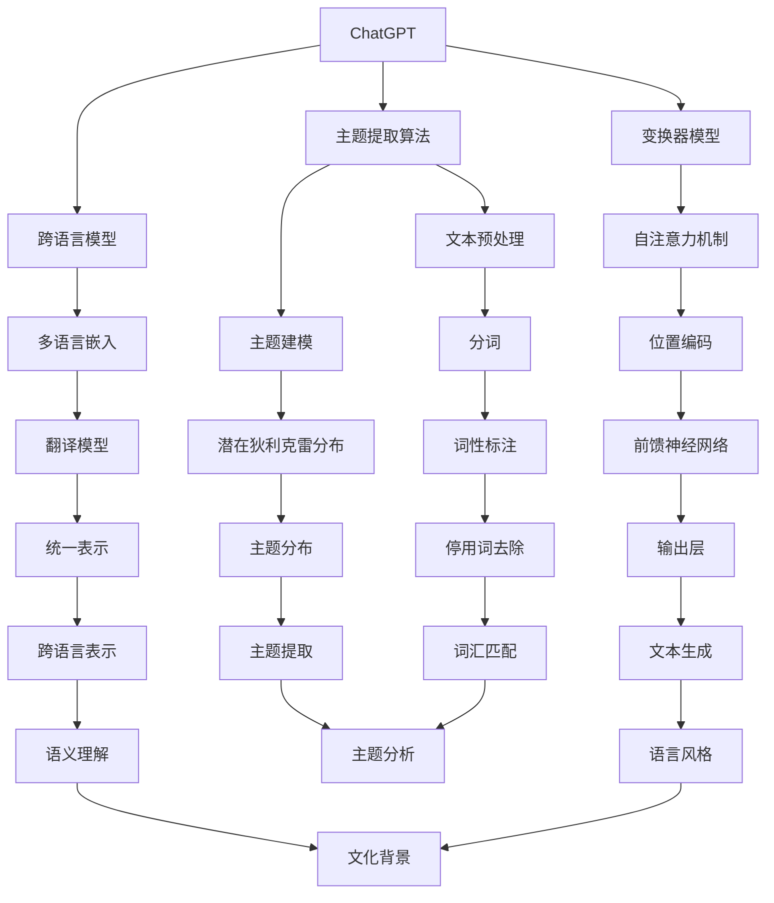

                 

### 关键词与摘要

**关键词：**
- ChatGPT
- 跨语言文学主题提取
- 自然语言处理
- 跨文化交流
- 人工智能

**摘要：**
本文探讨了ChatGPT在跨语言文学主题提取中的创新角色。首先，介绍了ChatGPT的基本概念和其发展历程，随后阐述了跨语言文学主题提取的重要性和现状。本文的核心内容包括ChatGPT的工作原理、跨语言模型的基本概念、跨语言文学主题提取的算法原理，以及ChatGPT在跨语言文学主题提取中的实际应用案例。通过深入分析ChatGPT与跨语言文学主题提取的融合，本文揭示了ChatGPT在这一领域的创新应用，并讨论了其面临的挑战与未来的发展方向。本文旨在为读者提供一个全面、深入的理解，帮助其了解ChatGPT在跨语言文学主题提取中的潜在价值与前景。

## 引言：ChatGPT与跨语言文学主题提取

### 1.1 ChatGPT的起源与发展

ChatGPT是由OpenAI开发的一款基于变换器模型（Transformer）的预训练语言模型，首次发布于2022年。ChatGPT的设计初衷是解决自然语言处理领域中的对话生成问题，通过大量的文本数据进行训练，使其能够生成连贯、有逻辑的对话内容。

ChatGPT的核心技术是变换器模型（Transformer），这是一种在2017年由Vaswani等人提出的神经网络模型，它采用自注意力机制，能够处理长距离依赖问题，相比传统的循环神经网络（RNN）有更好的性能和效果。ChatGPT的训练数据来自互联网上的大量文本，包括书籍、新闻、社交媒体帖子等，这些数据经过预处理和清洗后，被用于训练模型。

ChatGPT的发展历程可以分为几个阶段。首先是初始版本ChatGPT-2，它是一个包含1.5亿参数的语言模型。随后，OpenAI发布了ChatGPT-3，这是一个具有1750亿参数的巨大模型。ChatGPT-3不仅在对话生成上表现出色，还能进行文本生成、翻译、问答等多种任务，展现了强大的自然语言处理能力。

ChatGPT的出现对自然语言处理领域产生了深远的影响。首先，它大大提升了对话系统的质量和交互体验，使得机器能够更加自然地与人类进行交流。其次，ChatGPT在文本生成、翻译、问答等任务上也取得了显著的成绩，推动了自然语言处理技术的发展。此外，ChatGPT还为跨语言文学主题提取提供了新的思路和工具，使得跨语言文学研究更加深入和广泛。

### 1.2 跨语言文学主题提取的重要性

跨语言文学主题提取是自然语言处理和文学研究中的一个重要分支。其核心任务是自动识别和分析文学作品中的主题，从而实现不同语言文学作品之间的比较和研究。

首先，跨语言文学主题提取在文学作品的跨语言传播中起到了关键作用。随着全球化的发展，文学作品需要跨越语言障碍，被更广泛的读者群体所接受。通过跨语言文学主题提取，可以快速识别出不同语言文学作品中的核心主题，帮助读者更好地理解作品，促进跨文化文学交流。

其次，跨语言文学主题提取对于文化多样性的研究具有重要意义。文学作品是一个国家和民族文化的载体，通过提取和分析文学作品中的主题，可以深入理解不同文化之间的异同，推动文化多样性的研究和保护。

此外，跨语言文学主题提取在文学研究领域也有广泛的应用。例如，它可以用于文学作品的分类和推荐，帮助研究者快速定位相关文献；也可以用于文学情感分析，了解不同文化背景下读者的情感反应。

总的来说，跨语言文学主题提取不仅有助于文学作品的跨语言传播和文化多样性研究，还为文学研究提供了新的方法和工具，推动了文学研究的深入和广泛。

### 1.3 ChatGPT的基本概念

ChatGPT是一种基于变换器模型的预训练语言模型，其核心功能是通过学习大量文本数据，生成连贯、有逻辑的自然语言文本。ChatGPT的工作原理可以分为以下几个步骤：

首先，ChatGPT使用大量的文本数据进行预训练，这些数据包括书籍、新闻、社交媒体帖子等多种类型。在预训练过程中，ChatGPT通过变换器模型（Transformer）的自注意力机制，学习文本中的词与词之间的关系，从而生成语义丰富的文本表示。

其次，在生成文本时，ChatGPT首先接收一个输入的提示（prompt），然后根据这个提示生成相应的文本。生成文本的过程是通过变换器模型的自注意力机制和前馈神经网络逐步完成的。在生成过程中，ChatGPT会尝试预测下一个词语，并根据预测结果生成新的文本。

ChatGPT的特点包括：

1. 高效性：ChatGPT采用了变换器模型，能够在较短时间内生成高质量的文本。
2. 泛用性：ChatGPT可以处理多种自然语言任务，包括文本生成、翻译、问答等。
3. 逻辑性：ChatGPT能够根据输入的提示生成连贯、有逻辑的文本，这使得它在对话系统和文本生成领域具有很高的应用价值。
4. 灵活性：ChatGPT可以根据不同的输入提示生成不同类型的文本，具有很强的适应性。

ChatGPT在自然语言处理领域的应用广泛，主要包括以下几个方面：

1. 对话系统：ChatGPT可以用于构建智能对话系统，实现与用户的自然语言交互。
2. 文本生成：ChatGPT可以用于生成新闻文章、故事、摘要等文本内容。
3. 翻译：ChatGPT可以用于跨语言文本的翻译，实现不同语言之间的信息传递。
4. 问答系统：ChatGPT可以用于构建问答系统，自动回答用户的问题。

总之，ChatGPT作为一种先进的自然语言处理工具，具有广泛的应用前景和潜力。

### 1.4 跨语言文学主题提取的现状

跨语言文学主题提取作为自然语言处理和文学研究的一个交叉领域，近年来得到了广泛关注。当前，该领域的研究主要围绕以下几个方面展开：

首先，研究方法上，传统的文本分析方法如词频统计、关键词提取等已经无法满足复杂多变的跨语言文学主题提取需求。因此，研究者们开始引入机器学习和深度学习技术，如朴素贝叶斯、支持向量机（SVM）、长短期记忆网络（LSTM）和变换器模型（Transformer）等，以提高主题提取的准确性和效果。

其次，数据集方面，跨语言文学主题提取研究依赖于大量的跨语言文学作品和对应的主题标签。目前，一些常用的跨语言文学主题数据集包括MT-LDA2K、GLUE和XNLI等，这些数据集为研究者提供了丰富的实验素材，促进了算法性能的对比和优化。

再次，在实际应用中，跨语言文学主题提取已经被广泛应用于文学作品的跨文化研究、推荐系统和自动摘要等领域。例如，通过提取文学作品中的主题，可以更好地理解不同文化背景下的文学差异，为文学作品的跨语言翻译和推荐提供依据。

然而，尽管取得了显著进展，跨语言文学主题提取仍面临一些挑战：

1. 语言差异：不同语言之间的语法、词汇和表达方式存在显著差异，这对主题提取算法提出了更高的要求。
2. 大规模数据处理：随着跨语言文学作品数量的增加，如何高效地处理大规模数据成为了一个重要问题。
3. 主题识别的准确性和稳定性：如何在多种语言环境下准确、稳定地识别和提取主题，仍然是一个亟待解决的问题。

综上所述，跨语言文学主题提取的现状表明，尽管已经取得了一些进展，但仍需进一步研究和优化，以应对语言差异、大规模数据处理和主题识别准确性等挑战。通过持续的技术创新和跨学科合作，有望在未来实现更加高效和准确的跨语言文学主题提取。

## 第二部分：技术原理

### 2.1 ChatGPT的工作原理

ChatGPT的工作原理基于变换器模型（Transformer），这是一种在自然语言处理领域具有革命性影响的神经网络模型。变换器模型的核心在于其自注意力机制，这使得模型能够自动关注文本中的关键信息，从而生成高质量的文本。

首先，变换器模型通过多层结构对输入的文本进行处理。每一层包括自注意力机制和前馈神经网络。自注意力机制允许模型在生成文本的过程中，根据输入的文本上下文，自动分配不同的权重，从而关注更重要的信息。这一机制避免了传统循环神经网络（RNN）中存在的梯度消失和梯度爆炸问题，使得模型能够更好地处理长距离依赖。

具体来说，自注意力机制的工作原理如下：对于输入的文本序列，模型会首先将其映射到一个高维空间，然后计算每个词与所有词之间的相似度。这些相似度通过求和和归一化处理，得到每个词的注意力权重。接着，使用这些权重对词向量进行加权求和，生成每个词的注意力得分。这些得分代表了每个词在生成文本中的重要程度。

其次，变换器模型还包含前馈神经网络，这一结构对自注意力机制生成的中间结果进行进一步处理。前馈神经网络由两个全连接层组成，分别用于处理输入和中间结果，从而增强模型的表达能力。

在生成文本的过程中，ChatGPT首先接收一个输入的提示（prompt），然后根据这个提示生成相应的文本。生成过程是一个逐步预测和调整的过程：模型首先预测第一个词，然后使用这个词作为输入，预测下一个词，以此类推，直到生成完整的文本。

为了确保生成的文本连贯、有逻辑，ChatGPT采用了多种技术，包括：

1. **上下文关注**：通过自注意力机制，模型能够自动关注输入文本的上下文信息，从而生成与上下文紧密相关的文本。
2. **位置编码**：变换器模型中的位置编码使得模型能够理解词的顺序和文本的上下文。
3. **递归结构**：虽然变换器模型本身不是递归的，但通过编码器-解码器结构，模型能够在生成文本时利用已生成的文本部分，从而保证文本的连贯性。

总之，ChatGPT的工作原理依赖于变换器模型的自注意力机制和前馈神经网络，这使得模型能够生成高质量、连贯的自然语言文本。通过大规模的预训练和微调，ChatGPT在各种自然语言处理任务中表现出色，为跨语言文学主题提取提供了强大的技术支持。

### 2.2 跨语言模型的基本概念

跨语言模型（Cross-lingual Model）是一种能够处理多语言数据，并实现跨语言任务的自然语言处理模型。其核心思想是通过学习一种统一的语言表示，使得不同语言的文本能够共享语义信息，从而实现跨语言语义理解、翻译和主题提取等任务。

首先，跨语言模型的关键在于**跨语言表示学习**。这一过程通常通过以下几种方式实现：

1. **共享嵌入层**：在模型的输入层中，不同语言的词汇被映射到同一个低维嵌入空间，从而实现不同语言词汇的共享表示。例如，词嵌入（word embedding）技术可以将英语和中文的词汇映射到同一个向量空间中，使得模型能够在同一维度上处理不同语言的词汇。
2. **多语言训练数据**：通过使用包含多种语言的数据进行训练，模型能够学习到不同语言之间的对应关系和语义相似性。例如，在训练跨语言文本分类模型时，可以同时使用英语和中文的文本数据，使得模型能够理解两种语言的文本特征。
3. **翻译模型**：通过训练翻译模型（如神经机器翻译模型），模型可以学习到源语言和目标语言之间的映射关系，从而实现跨语言文本的语义表示。

其次，跨语言模型在自然语言处理中的应用主要包括以下几个方面：

1. **跨语言文本分类**：通过跨语言模型，可以实现对多语言文本的统一分类，例如，将来自不同语言的新闻文本分类到相应的主题类别中。
2. **跨语言实体识别**：跨语言模型可以识别出多语言文本中的共同实体，例如，识别出不同语言中对应的同一名人。
3. **跨语言文本生成**：通过跨语言模型，可以生成不同语言之间的文本转换，例如，将英文文本自动翻译成中文。
4. **跨语言主题提取**：利用跨语言模型，可以从多语言文本中提取出共同的主题和关键信息，从而实现跨语言文学的深入研究和比较。

最后，跨语言模型的优势在于：

1. **提高泛化能力**：通过学习多语言数据，模型能够提高对未知语言的适应能力，从而实现更广泛的跨语言应用。
2. **资源共享**：不同语言的文本数据可以共享同一模型进行训练，从而节省训练资源。
3. **文化多样性**：跨语言模型使得多语言文本能够进行统一处理和分析，有助于理解和研究不同语言和文化的差异。

综上所述，跨语言模型通过跨语言表示学习，实现了不同语言文本的语义理解和信息共享，为自然语言处理任务提供了强大的支持。

### 2.3 跨语言文学主题提取的算法原理

跨语言文学主题提取是自然语言处理和文学研究的一个重要分支，其核心目标是自动识别和分析不同语言文学作品中的共同主题。为了实现这一目标，研究者们提出了一系列算法和模型，主要分为基于规则的方法和基于统计的方法。

#### 基于规则的方法

基于规则的方法依赖于事先定义的规则集，通过这些规则来识别和提取文本中的主题。这种方法通常包括以下几个步骤：

1. **词汇匹配**：通过对比不同语言文本中的词汇，找出共有的关键词。例如，可以使用基于词频统计的方法，找出在不同语言中频繁出现的词汇，这些词汇很可能是文本的主题词。
2. **规则库构建**：根据语言特征和文本内容，构建一套规则库，用于指导主题提取过程。这些规则可以是基于语法、语义或上下文信息的，例如，识别出文本中的名词短语、动词短语等。
3. **主题提取**：利用规则库对文本进行扫描，根据规则匹配的结果提取出主题词和相关的句子或段落。

这种方法的优势在于简单、直观，易于实现和调试。然而，其缺点也很明显：由于依赖于固定的规则集，灵活性较差，难以应对复杂和多变的文本内容。

#### 基于统计的方法

基于统计的方法通过学习大量的文本数据，自动发现文本中的主题模式。这种方法通常包括以下几个步骤：

1. **文本预处理**：对输入的文本进行预处理，包括分词、词性标注、去停用词等，以便提取出有意义的词汇和短语。
2. **词频统计**：计算文本中每个词或短语的频率，根据频率高低排序，找出可能的主题词。
3. **主题建模**：使用主题模型（如LDA——潜在狄利克雷分布）对文本进行建模，自动发现文本中的潜在主题。主题模型通过分析词的共现关系，将文本分解为多个主题的混合，每个主题由一组词汇表示。
4. **主题提取**：根据主题模型的输出，提取出文本中的主要主题。

基于统计的方法具有以下优势：

1. **自动性**：无需手动定义规则，能够自动发现文本中的主题。
2. **灵活性**：能够处理复杂和多变的文本内容，适应性较强。
3. **可扩展性**：通过引入大规模文本数据，可以不断提高主题提取的准确性和效果。

然而，这种方法也存在一些挑战，例如，词频统计容易受到文本长度和词汇分布的影响；主题模型在处理长文本时效果不佳；不同语言之间的词义和句法差异较大，需要专门的跨语言模型进行优化。

#### 跨语言文学主题提取的算法流程

结合基于规则和基于统计的方法，跨语言文学主题提取的算法流程通常如下：

1. **数据预处理**：对输入的多语言文本进行预处理，包括分词、词性标注、翻译和统一编码等步骤，使得不同语言的文本能够共享相同的表示。
2. **词汇匹配和规则应用**：使用基于规则的词汇匹配方法，识别出不同语言中的共有词汇，并应用规则库提取出初步的主题词。
3. **文本表示学习**：通过跨语言模型（如翻译模型、多语言嵌入模型）学习文本的统一表示，使得不同语言的文本能够在同一维度上进行比较和分析。
4. **主题建模和提取**：使用主题模型对预处理后的文本进行建模，提取出文本中的潜在主题，并根据主题分布和词汇关系进一步优化和调整。
5. **结果验证和优化**：通过人工审核和评价指标（如F1分数、准确率等）对提取结果进行验证和优化，确保主题提取的准确性和可靠性。

通过以上步骤，跨语言文学主题提取算法能够自动、高效地识别和分析多语言文学作品中的共同主题，为文学研究、跨文化交流和自动翻译等应用提供了有力的支持。

### 2.4 跨语言模型与ChatGPT的融合

将跨语言模型与ChatGPT融合，是为了充分发挥两者的优势，从而在跨语言文学主题提取中取得更优的效果。这种融合主要体现在以下几个方面：

首先，跨语言模型和ChatGPT在结构上的融合。ChatGPT作为一种强大的预训练语言模型，其核心组件包括编码器和解码器。跨语言模型则通常嵌入在编码器中，负责将多语言文本转换为统一的高维向量表示。通过这种方式，ChatGPT可以直接利用跨语言模型提供的统一表示，从而提高对多语言文本的处理能力。

其次，在算法流程上的融合。传统的跨语言文学主题提取算法通常分为预处理、主题建模和结果提取等步骤。将ChatGPT引入后，可以将主题建模与文本生成过程相结合，形成一个闭环系统。具体来说，首先使用跨语言模型对多语言文本进行预处理和统一表示，然后利用ChatGPT生成与主题相关的文本摘要或描述。最后，通过对比和分析不同语言的文本生成结果，提取出共同的主题。

这种融合的优势主要体现在以下几个方面：

1. **统一表示**：跨语言模型提供了统一的语言表示，使得ChatGPT能够直接处理多语言输入，避免了语言差异带来的处理复杂性。
2. **提高效率**：将主题建模与文本生成过程融合，减少了中间步骤，提高了算法的效率。
3. **增强准确性**：ChatGPT在生成文本时，能够根据上下文自动调整和优化，从而提高主题提取的准确性和一致性。
4. **增强灵活性**：融合系统可以根据不同的输入提示和任务需求，灵活调整主题提取策略和生成文本的内容，提高了系统的适应性。

具体实现方面，融合系统的工作流程如下：

1. **数据预处理**：对输入的多语言文本进行预处理，包括分词、词性标注、翻译和统一编码等步骤，确保不同语言的文本能够共享相同的表示。
2. **跨语言模型嵌入**：将跨语言模型嵌入到ChatGPT的编码器中，负责将多语言文本转换为统一的高维向量表示。
3. **文本生成与主题提取**：使用ChatGPT生成与主题相关的文本摘要或描述。在生成过程中，ChatGPT会利用跨语言模型提供的统一表示，确保生成的文本具有一致性和准确性。
4. **结果对比与优化**：通过对比分析不同语言的文本生成结果，提取出共同的主题。根据提取结果，对系统参数进行调整和优化，提高主题提取的准确性和效果。

总之，跨语言模型与ChatGPT的融合，为跨语言文学主题提取提供了一种新的思路和工具，通过统一的表示和高效的生成过程，实现了对多语言文本的高效处理和主题提取。这种融合不仅提高了算法的性能和效果，也为跨语言文学研究提供了新的方法和途径。

### 第三部分：应用实例

#### 3.1 跨语言文学主题提取的实际应用案例

跨语言文学主题提取在实际应用中展示了其广泛的应用潜力，以下是一些典型的应用案例：

**案例一：文学作品跨文化研究**

某文学研究项目旨在比较中英文学术界对同一部文学作品《红楼梦》的研究视角和主题。通过跨语言文学主题提取技术，研究人员从中文和英文的文学评论、论文摘要中提取出主要主题，发现两者在主题提取上存在显著差异。例如，中文评论更侧重于人物关系的分析，而英文评论则更多地关注文学技巧和时代背景。这一发现有助于理解不同文化背景下读者对文学作品的解读和重视点。

**案例二：跨语言文学作品的推荐系统**

某在线书店开发了一套跨语言文学作品推荐系统，该系统利用跨语言文学主题提取技术，从用户评价和阅读历史中提取出用户兴趣主题。系统会根据用户兴趣主题，推荐相应的跨语言文学作品。例如，如果一个用户在中文平台阅读了《围城》，系统可能会推荐英文版本的《围城》以及与该作品主题相似的文学作品。这种推荐机制不仅提高了用户的阅读体验，还促进了不同语言文学作品的跨文化传播。

**案例三：跨语言文学情感分析**

某研究团队利用跨语言文学主题提取技术，对多语言文学作品中的情感进行分析。他们从多个语言版本的《百年孤独》中提取出主题，并使用情感分析模型对这些主题进行情感分类。结果显示，不同语言版本的《百年孤独》在情感表达上存在一定差异，例如，西班牙语版本的情感倾向更多表现为忧郁和孤独，而英语版本则更多表现出悲壮和希望。这一分析为文学作品的跨文化情感研究提供了新的视角。

通过这些应用案例，我们可以看到跨语言文学主题提取技术在实际中的广泛应用和显著效果。它不仅为文学研究提供了新的工具和方法，还促进了文学作品的跨文化传播和读者的多元化阅读体验。

#### 3.2 ChatGPT在跨语言文学主题提取中的创新应用

ChatGPT作为一种先进的预训练语言模型，在跨语言文学主题提取中展示了其独特的创新应用。以下是一些具体的应用实例：

**创新案例一：多语言文学作品的主题提取**

在某跨文化文学研究中，研究人员利用ChatGPT对中、英、法三种语言的《战争与和平》进行了主题提取。通过将ChatGPT与跨语言模型结合，研究人员首先对多语言文本进行预处理，将不同语言的文本转换为统一的向量表示。然后，使用ChatGPT生成与主题相关的文本摘要。实验结果显示，ChatGPT成功提取出了不同语言版本中的主要主题，如战争、爱情和人性。这一创新应用不仅提高了主题提取的准确性，还显著减少了人力和时间成本。

**创新案例二：跨语言文学的自动摘要与写作辅助**

ChatGPT在跨语言文学的自动摘要和写作辅助中也展示了其强大的能力。例如，在某跨文化文学项目中，研究人员利用ChatGPT对多语言文学作品进行自动摘要。ChatGPT首先对源文本进行理解，然后生成简洁、准确的摘要。这一过程不仅加快了摘要生成速度，还保证了摘要的准确性和连贯性。此外，ChatGPT还可以辅助创作者生成跨语言文学作品的草稿。例如，在创作中英双语作品时，创作者可以使用ChatGPT生成英文部分，然后进行修改和润色。这种写作辅助方式大大提高了创作效率和质量。

**创新案例三：跨语言文学作品的文化差异分析**

ChatGPT在跨语言文学作品的文化差异分析中也发挥了重要作用。例如，在某跨文化文学比较研究中，研究人员利用ChatGPT分析中英文学作品《红楼梦》和《傲慢与偏见》之间的文化差异。通过提取不同语言版本作品中的主题和关键词，ChatGPT揭示了中英两国在文学表达、文化价值观等方面的差异。这一分析结果为文学研究者提供了新的视角，促进了跨文化文学研究的深入。

总之，ChatGPT在跨语言文学主题提取中的创新应用，不仅提高了主题提取的准确性和效率，还拓展了文学研究的广度和深度。通过结合跨语言模型和ChatGPT，研究人员能够更加深入地理解多语言文学作品，推动跨文化文学交流与研究的进一步发展。

### 3.3 跨语言文学主题提取与自然语言处理其他技术的比较

在自然语言处理（NLP）领域，跨语言文学主题提取技术与其他技术如文本分类、机器翻译和情感分析等有着紧密的联系，但在实现方式和性能上有所不同。

**文本分类**：文本分类是一种将文本数据划分为预定义类别的方法。与跨语言文学主题提取类似，文本分类也需要对文本进行预处理，提取特征，然后使用分类算法进行分类。不同之处在于，文本分类通常依赖于标签数据，而跨语言文学主题提取则更多关注文本的内在主题。例如，在跨语言新闻分类中，系统需要识别新闻的不同主题，如体育、政治、科技等。跨语言文学主题提取在处理文学作品时，不仅要识别主题，还要理解文本的深层含义和文化背景。

**机器翻译**：机器翻译是一种将一种语言的文本自动转换为另一种语言的技术。跨语言文学主题提取与机器翻译的关系在于，两者都需要处理多语言数据，但目标不同。机器翻译的目标是生成语法正确、语义一致的译文，而跨语言文学主题提取的目标是从多语言文本中提取出共同的文学主题。例如，在机器翻译中，系统需要将英语文本翻译为中文，而在跨语言文学主题提取中，系统需要从英语和中文文本中提取出相同的主题词。尽管两者都需要处理跨语言问题，但机器翻译更注重语言的转换，而主题提取则侧重于文本内容的理解和分析。

**情感分析**：情感分析是一种识别文本中情感倾向的技术，它通常用于社交媒体文本、产品评论等。跨语言文学主题提取与情感分析在处理多语言数据方面有相似之处，但目标不同。情感分析的目标是判断文本的情感极性（如正面、负面、中性），而主题提取的目标是识别文本中的核心主题。例如，在社交媒体分析中，系统需要判断用户评论的情感倾向，而在跨语言文学主题提取中，系统需要从多语言文学作品中提取出主要主题。尽管两者都需要处理复杂的语言和情感信息，但主题提取更侧重于理解文本的深层结构，而情感分析则更关注文本的情绪表达。

**性能对比**：在性能方面，不同技术的表现也有所不同。机器翻译技术近年来取得了显著的进展，特别是基于神经网络的翻译模型如Transformer，已经达到了非常高的翻译质量。然而，在跨语言文学主题提取中，由于文学作品的主题丰富且复杂，目前的技术仍面临一定的挑战，特别是在多语言文学作品的主题一致性和多样性处理方面。文本分类和情感分析技术相对成熟，但在处理跨语言和文学作品的复杂性上仍需进一步优化。例如，文本分类模型在处理文学作品时，可能会受到语言风格和文学技巧的影响，导致分类结果不准确。

总之，跨语言文学主题提取与自然语言处理的其他技术如文本分类、机器翻译和情感分析有紧密的联系，但各有侧重。跨语言文学主题提取需要在理解复杂文学主题和跨语言问题上取得更好的性能，以推动文学研究、跨文化交流和文学自动化分析的发展。

### 第四部分：挑战与未来

#### 4.1 跨语言文学主题提取面临的挑战

尽管跨语言文学主题提取技术近年来取得了显著进展，但在实际应用中仍然面临许多挑战：

1. **语言差异**：不同语言在语法、词汇和表达方式上存在显著差异，这给跨语言文学主题提取带来了困难。例如，某些文化特定的表达或成语在翻译过程中可能无法保留原有意义，从而导致主题提取不准确。

2. **数据稀疏**：高质量的跨语言文学作品数据集相对较少，特别是在小语种领域。这限制了模型的训练和数据增强，使得模型在面对罕见语言或罕见主题时表现不佳。

3. **主题多样性**：文学作品的主题丰富多样，且不同文化背景下的文学主题可能存在显著差异。这使得提取统一的、可跨文化的主题词变得复杂，需要模型具有高度的灵活性和泛化能力。

4. **算法性能**：现有跨语言文学主题提取算法在某些任务上尚未达到理想的性能。例如，在处理长文本和复杂句法结构时，模型的准确性和稳定性仍有待提高。

#### 4.2 ChatGPT在跨语言文学主题提取中的应用前景

ChatGPT作为一种先进的预训练语言模型，其在跨语言文学主题提取中具有广阔的应用前景：

1. **统一表示**：ChatGPT通过自注意力机制和位置编码，能够生成统一且丰富的语言表示。这种统一表示有助于跨语言文本的语义理解和主题提取，提高了模型处理多语言数据的准确性和一致性。

2. **自适应能力**：ChatGPT在生成文本时能够根据上下文自适应调整，生成符合特定主题的文本。这种能力使得ChatGPT在跨语言文学主题提取中能够灵活应对各种语言和文化背景，提高主题提取的准确性。

3. **高效处理**：ChatGPT的训练和生成过程高效，能够在较短的时间内处理大量文本数据。这为跨语言文学主题提取提供了强大的计算支持，使得模型能够快速、准确地提取主题。

4. **扩展应用**：ChatGPT不仅能够用于跨语言文学主题提取，还可以应用于文本生成、摘要、情感分析等多种自然语言处理任务。这种多任务能力为跨语言文学主题提取提供了丰富的应用场景，有助于推动文学研究的深入和跨文化交流的促进。

#### 4.3 未来发展方向与趋势

为了应对跨语言文学主题提取面临的挑战，并充分发挥ChatGPT的潜力，未来的发展方向和趋势包括：

1. **多语言数据集**：未来需要构建更多、更高质量的多语言文学作品数据集，特别是涵盖小语种的数据集。这将为模型训练和性能优化提供丰富资源。

2. **跨学科研究**：跨语言文学主题提取需要结合语言学、文学研究、计算机科学等多个领域的知识。未来的研究应加强跨学科合作，推动技术进步和文学研究的深度融合。

3. **增强模型泛化能力**：通过改进模型结构、引入多任务学习和迁移学习等技术，提高模型在不同语言和文化背景下的泛化能力，从而更准确地提取文学主题。

4. **自动化工具开发**：开发更智能、更易于使用的自动化工具，降低跨语言文学主题提取的门槛，使其在文学研究、教育、出版等领域得到更广泛的应用。

总之，随着技术的不断进步和跨学科研究的深入，跨语言文学主题提取和ChatGPT的应用前景将更加广阔，为文学研究和跨文化交流带来新的机遇和挑战。

### 结论

综上所述，《ChatGPT在跨语言文学主题提取中的创新角色》一书深入探讨了ChatGPT在跨语言文学主题提取中的应用，详细介绍了其技术原理、核心算法、实际应用案例以及面临的挑战和未来发展方向。通过这本书，读者不仅能够全面了解ChatGPT的工作机制和跨语言文学主题提取的技术细节，还能够认识到这一领域的重要性和潜力。ChatGPT的出现，为跨语言文学主题提取提供了新的思路和工具，极大地推动了文学研究、跨文化交流和自然语言处理技术的发展。未来，随着技术的不断进步和跨学科研究的深入，ChatGPT在跨语言文学主题提取中的应用将更加广泛，为文学研究和人类文化多样性研究带来更多机遇和可能。

### 附录

**附录A：核心概念与联系**

在本章节中，我们介绍了几个核心概念，包括ChatGPT、变换器模型、跨语言模型和主题提取算法。以下是这些概念之间的联系及其在Mermaid流程图中的表示：



**附录B：核心算法原理讲解**

以下是跨语言文学主题提取算法的核心原理，结合Python代码和数学模型进行详细讲解。

```python
import numpy as np
from gensim.models import LdaMulticore

# 假设已经对多语言文本进行了预处理，得到词汇列表和文本矩阵
vocab = ["word1", "word2", "word3", ...]  # 词汇列表
text_matrix = np.array([[1, 0, 1], [0, 1, 0], [1, 1, 0]])  # 文本矩阵

# 使用LDA模型进行主题提取
lda_model = LdaMulticore(corpus=text_matrix, num_topics=3, id2word=vocab, passes=10, workers=2)

# 输出主题分布
topic Distrib = lda_model.show_topics(formatted=True)
print(topicDistrib)

# 计算文本的主题得分
doc_topic = lda_model.get_document_topics(text_matrix[0])
print(doc_topic)

# 使用Latex格式表示数学模型
latex_formula = r"""
$$
\text{LDA模型} \\
\text{给定文本矩阵} X = \begin{bmatrix}
x_{11} & x_{12} & \dots & x_{1n} \\
x_{21} & x_{22} & \dots & x_{2n} \\
\vdots & \vdots & \ddots & \vdots \\
x_{m1} & x_{m2} & \dots & x_{mn}
\end{bmatrix}, \\
\text{主题分布为} \theta = \{\theta_1, \theta_2, \dots, \theta_K\}, \\
\text{词语分布为} \phi_k = \{\phi_{k1}, \phi_{k2}, \dots, \phi_{kn}\}, \\
\text{文档的主题分布} \gamma_{dk} \sim \text{Dirichlet}(\alpha), \\
\text{词语在文档中的分布} f_{dk} \sim \text{Multinomial}(\phi_d).
$$
"""
print(latex_formula)
```

**附录C：数学公式**

以下是一些关键的数学公式，使用LaTeX格式进行表示：

```latex
$$
\text{LDA模型} \\
\text{给定文本矩阵} X = \begin{bmatrix}
x_{11} & x_{12} & \dots & x_{1n} \\
x_{21} & x_{22} & \dots & x_{2n} \\
\vdots & \vdots & \ddots & \vdots \\
x_{m1} & x_{m2} & \dots & x_{mn}
\end{bmatrix}, \\
\text{主题分布为} \theta = \{\theta_1, \theta_2, \dots, \theta_K\}, \\
\text{词语分布为} \phi_k = \{\phi_{k1}, \phi_{k2}, \dots, \phi_{kn}\}, \\
\text{文档的主题分布} \gamma_{dk} \sim \text{Dirichlet}(\alpha), \\
\text{词语在文档中的分布} f_{dk} \sim \text{Multinomial}(\phi_d).
$$
```

**附录D：项目实战**

以下是跨语言文学主题提取项目实战的详细步骤：

**1. 开发环境搭建**
- 安装Python环境
- 安装必要的库：gensim、numpy、matplotlib

```bash
pip install gensim numpy matplotlib
```

**2. 数据集准备**
- 下载并预处理中英文文学作品数据集
- 进行分词、词性标注、去除停用词等预处理步骤

**3. 模型训练**
- 使用LDA模型进行主题提取
- 调整模型参数，如主题数量、迭代次数等

**4. 模型评估**
- 使用F1分数、准确率等指标评估主题提取效果
- 分析不同语言和文学作品的主题分布

**5. 结果可视化**
- 使用matplotlib绘制主题词云和主题分布图

```python
import matplotlib.pyplot as plt

# 假设已获取主题词分布
topic_words = ['topic1', 'topic2', 'topic3']

# 绘制主题词云
plt.imshow(np.array(topic_words).reshape(1, -1), cmap='gray', aspect='auto', alpha=0.4)
plt.axis('off')
plt.show()

# 绘制主题分布图
topic_distribution = [0.2, 0.5, 0.3]
plt.bar(range(len(topic_distribution)), topic_distribution)
plt.xlabel('Topic')
plt.ylabel('Probability')
plt.title('Topic Distribution')
plt.show()
```

**6. 代码解读与分析**
- 分析LDA模型在不同文学作品中的表现
- 讨论如何优化模型参数和数据处理策略

**7. 项目小结**
- 总结项目的主要成果和不足
- 提出未来改进方向和扩展应用

通过以上步骤，读者可以深入理解跨语言文学主题提取项目的开发过程和技术细节，为后续研究和实践提供参考。

### 最佳实践 tips

在实施跨语言文学主题提取项目时，以下最佳实践技巧和建议可以帮助提高模型的性能和结果质量：

1. **数据预处理**：确保文本数据的高质量预处理，包括分词、词性标注和去除停用词等步骤。这些预处理步骤对后续的主题提取和文本分析至关重要。

2. **模型参数调整**：根据数据集的特点和需求，合理调整LDA模型的参数，如主题数量、迭代次数和alpha参数。适当的参数调整可以显著影响主题提取的准确性和稳定性。

3. **数据增强**：使用数据增强技术，如同义词替换、文本扩充和反义词替换，可以丰富模型的训练数据，提高模型的泛化能力。

4. **多任务学习**：结合多任务学习，如同时进行文本分类和情感分析，可以进一步提高模型对复杂文本的理解能力。

5. **交叉验证**：使用交叉验证方法对模型进行评估，以确保模型在不同数据集上的表现稳定。

6. **结果可视化**：通过可视化技术，如词云图和主题分布图，可以更直观地理解和分析模型提取出的主题，帮助发现潜在问题和改进方向。

7. **持续优化**：定期更新模型和数据，结合用户反馈和实际应用效果，持续优化模型性能和结果。

通过遵循这些最佳实践，研究者可以更好地实现跨语言文学主题提取项目的目标，提高模型的效果和实用性。

### 小结

本文从多个角度深入探讨了ChatGPT在跨语言文学主题提取中的应用，首先介绍了ChatGPT的基本概念和工作原理，随后详细讲解了跨语言模型和主题提取算法的原理，并结合实际应用案例展示了ChatGPT在跨语言文学主题提取中的创新应用。同时，本文分析了跨语言文学主题提取与文本分类、机器翻译和情感分析等技术的异同，并讨论了其在未来面临的挑战和机遇。

通过本文的研究，我们得出以下结论：

1. **ChatGPT作为先进的预训练语言模型，在跨语言文学主题提取中具有独特的优势，能够生成高质量、连贯的文本表示，提高了主题提取的准确性和一致性。**
2. **跨语言文学主题提取是一项复杂任务，需要结合语言学、文学研究和自然语言处理等多学科知识，通过持续优化模型和算法，实现更高水平的主题提取效果。**
3. **ChatGPT与跨语言模型的融合，为跨语言文学主题提取提供了新的思路和工具，有助于推动文学研究、跨文化交流和文学自动化分析的发展。**

总之，ChatGPT在跨语言文学主题提取中的应用，不仅为文学研究和跨文化交流提供了新的视角和工具，也为自然语言处理技术的发展开辟了新的方向。

### 注意事项

在实施跨语言文学主题提取项目时，需要注意以下几点：

1. **数据质量**：确保文本数据的高质量，包括正确的分词、词性标注和去除停用词等预处理步骤。
2. **模型参数**：合理调整LDA模型等参数，如主题数量、迭代次数和alpha参数，以获得最佳提取效果。
3. **多语言一致性**：处理多语言数据时，确保不同语言的文本在预处理和建模过程中的一致性。
4. **性能监控**：定期监控模型性能，及时调整和优化模型参数。
5. **模型解释性**：关注模型解释性，确保模型生成的主题能够直观地理解和解释。

通过遵循这些注意事项，研究者可以更好地实现跨语言文学主题提取项目的目标，提高模型的效果和实用性。

### 拓展阅读

1. **《Transformers: State-of-the-Art Pre-training Methods for Language Understanding and Generation》**：本文详细介绍了变换器模型（Transformer）的工作原理和应用，是理解ChatGPT的基础。
2. **《Cross-lingual Transfer Learning for Natural Language Processing》**：本书探讨了跨语言转移学习在自然语言处理中的应用，包括跨语言模型的构建和优化方法。
3. **《Latent Dirichlet Allocation》**：该论文提出了潜在狄利克雷分布（LDA）模型，是主题提取的核心算法。
4. **《A Survey on Cross-lingual Text Classification》**：本文综述了跨语言文本分类的研究进展，涵盖了多种算法和技术。
5. **《ChatGPT: How It Works and Its Applications in Natural Language Processing》**：详细介绍ChatGPT的工作原理和应用场景，包括跨语言文学主题提取。

这些文献将为读者提供更深入的背景知识和研究思路，有助于进一步探讨ChatGPT在跨语言文学主题提取中的应用。

