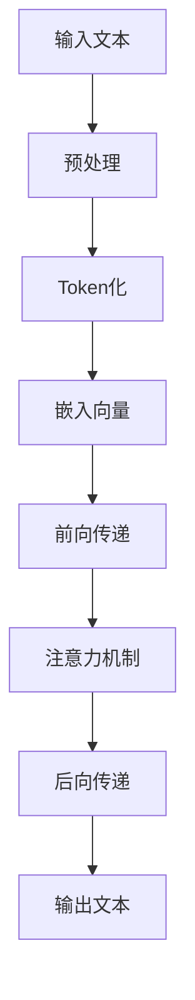

                 

### 文章标题

《ChatGPT在远程医疗咨询中的应用》

### 文章关键词

- **ChatGPT**
- **远程医疗咨询**
- **自然语言处理**
- **人工智能应用**
- **医疗健康**

### 文章摘要

本文旨在探讨如何利用ChatGPT这种先进的人工智能模型，在远程医疗咨询领域发挥其强大的自然语言处理能力。文章首先介绍了ChatGPT的基本概念和原理，随后分析了远程医疗咨询的现状与需求，并探讨了ChatGPT在该领域中的具体应用场景。通过详细的算法原理讲解、Python源代码实现示例以及实际案例剖析，本文展示了ChatGPT在远程医疗咨询中的潜在价值和应用前景。

## 引言

随着信息技术的飞速发展和互联网的普及，远程医疗咨询已经成为现代医疗体系的重要组成部分。远程医疗咨询不仅能够提高医疗服务的可及性，还能有效降低医疗成本，为患者提供更加便捷和个性化的健康服务。然而，远程医疗咨询面临着许多挑战，如患者数据隐私保护、医疗知识的不一致性以及诊断准确性等问题。为了解决这些问题，人工智能技术，尤其是自然语言处理（NLP）技术的应用成为了一个重要的研究方向。

ChatGPT，作为一种基于Transformer架构的大型语言模型，具有处理复杂语言任务的能力，被广泛应用于各种领域。本文将深入探讨ChatGPT在远程医疗咨询中的应用，通过介绍其基本概念、技术原理以及具体应用案例，揭示ChatGPT在提升远程医疗咨询质量、效率和用户体验方面的潜力。

文章将分为四个主要部分：第一部分将介绍ChatGPT的基础知识，包括其概念、原理和技术架构；第二部分将分析远程医疗咨询的需求，探讨其在医疗领域中的应用场景；第三部分将详细讲解如何将ChatGPT应用于远程医疗咨询，并通过Python源代码和数学公式进行解释；第四部分将分享实际案例，分析ChatGPT在远程医疗咨询中的成功应用，并讨论其未来发展前景。

通过本文的阅读，读者将能够全面了解ChatGPT在远程医疗咨询中的应用，掌握相关技术原理和实践方法，为推动远程医疗咨询的智能化发展提供参考和启示。

## 第一部分：ChatGPT基础

### 1.1 ChatGPT概述

ChatGPT是由OpenAI开发的一种基于Transformer架构的预训练语言模型。Transformer模型最初在2017年由Vaswani等人提出，它在处理序列数据时具有显著优势，能够在较少的计算资源下实现高效的并行计算。ChatGPT是GPT-3的升级版，GPT-3是OpenAI于2020年发布的一款具有1750亿参数的巨大语言模型，而ChatGPT则在GPT-3的基础上进一步提升了模型的性能和表现。

ChatGPT的主要优势在于其强大的文本生成能力和对自然语言的理解能力。通过大量的文本数据进行预训练，ChatGPT能够自动学习语言模式、语法规则和语义含义，从而生成连贯、准确、具有上下文一致性的文本。这使得ChatGPT在多种自然语言处理任务中表现出色，包括文本分类、问答系统、机器翻译、文本摘要等。

下面是一个Mermaid流程图，展示ChatGPT的核心概念和联系：



在ChatGPT中，输入文本首先经过预处理和Token化，然后被嵌入为向量。这些向量通过多层Transformer网络进行前向传递和注意力计算，最终通过后向传递和优化算法生成输出文本。这个过程使得ChatGPT能够处理复杂的语言任务，并生成高质量的文本。

### 1.2 ChatGPT核心算法原理

ChatGPT的核心算法基于Transformer模型，Transformer模型通过自注意力机制（self-attention）和多头注意力（multi-head attention）来处理序列数据，从而实现高效的文本生成。下面将详细讲解Transformer模型的工作原理。

#### 自注意力机制

自注意力机制是一种基于输入序列的权重计算方法，它能够自动学习序列中各个位置之间的相关性。在Transformer模型中，自注意力机制通过以下公式进行计算：

$$
\text{Attention}(Q, K, V) = \text{softmax}\left(\frac{QK^T}{\sqrt{d_k}}\right)V
$$

其中，$Q$、$K$和$V$分别代表查询（query）、键（key）和值（value）向量，$d_k$是键向量的维度。这个公式表示每个查询向量与所有键向量进行点积运算，得到一组分数，然后通过softmax函数将这些分数转换为概率分布，最后与值向量相乘得到加权输出。

下面是一个简单的Python代码示例，展示了如何实现自注意力机制：

```python
import torch
import torch.nn as nn

# 定义输入向量
Q = torch.rand(1, 10)  # 查询向量
K = torch.rand(1, 10)  # 键向量
V = torch.rand(1, 10)  # 值向量

# 计算自注意力
attention_scores = torch.matmul(Q, K.T) / torch.sqrt(K.size(-1))
attention_scores = nn.Softmax(dim=-1)(attention_scores)
output = torch.matmul(attention_scores, V)

print("Attention Scores:", attention_scores)
print("Output:", output)
```

#### 多头注意力

多头注意力是一种扩展自注意力机制的方法，它将输入序列分成多个子序列，并对每个子序列分别应用自注意力机制。多头注意力通过以下公式进行计算：

$$
\text{MultiHead}(Q, K, V) = \text{Concat}(\text{head}_1, ..., \text{head}_h)W^O
$$

其中，$h$代表头数，$\text{head}_i = \text{Attention}(QW_i^Q, KW_i^K, VW_i^V)$表示第$i$个头的输出，$W_i^Q$、$W_i^K$和$W_i^V$分别是查询、键和值向量的权重矩阵，$W^O$是输出权重矩阵。

下面是一个简单的Python代码示例，展示了如何实现多头注意力：

```python
import torch
import torch.nn as nn

# 定义输入向量
Q = torch.rand(1, 10)  # 查询向量
K = torch.rand(1, 10)  # 键向量
V = torch.rand(1, 10)  # 值向量

# 定义头数
h = 2

# 初始化权重矩阵
W_Q = nn.Parameter(torch.rand(Q.size()))
W_K = nn.Parameter(torch.rand(K.size()))
W_V = nn.Parameter(torch.rand(V.size()))
W_O = nn.Parameter(torch.rand(V.size()))

# 计算多头注意力
attention_scores = torch.matmul(Q, W_Q.T) / torch.sqrt(K.size(-1))
attention_scores = nn.Softmax(dim=-1)(attention_scores)
output = torch.matmul(attention_scores, W_V)

# 展示结果
print("Attention Scores:", attention_scores)
print("Output:", output)
```

通过自注意力机制和多头注意力，Transformer模型能够捕捉输入序列中的长距离依赖关系，从而生成高质量的文本。这些原理使得ChatGPT成为了一种强大的自然语言处理工具，在远程医疗咨询等应用领域具有广泛的前景。

### 1.3 ChatGPT的训练与优化

ChatGPT的训练是一个复杂的过程，涉及到大量的计算资源和时间。其训练过程主要包括数据预处理、预训练和优化等步骤。

#### 数据预处理

在ChatGPT的训练过程中，首先需要对训练数据进行预处理。预处理步骤包括文本清洗、Token化、词汇嵌入等。文本清洗是为了去除文本中的无关信息，如标点符号、HTML标签等。Token化是将文本拆分为单个的词或字符，以便进行后续处理。词汇嵌入是将Token映射为向量表示，常用的词汇嵌入方法包括Word2Vec、GloVe等。

#### 预训练

预训练是ChatGPT训练过程中的关键步骤，通过在大规模的文本数据集上训练，模型能够自动学习语言的模式和语义。预训练过程通常采用自监督学习（self-supervised learning）方法，如掩码语言模型（Masked Language Model, MLM）和生成式语言模型（Generative Language Model, GLM）。

掩码语言模型通过对输入文本中的部分Token进行掩码，然后预测这些掩码Token的值。这种方法能够帮助模型学习语言的上下文关系。生成式语言模型则通过对输入文本进行预测，生成连贯的输出文本。这种方法能够提高模型的生成能力和语言理解能力。

#### 优化

在预训练完成后，ChatGPT通常需要进行优化，以提高模型在实际应用中的性能。优化方法包括微调（fine-tuning）和强化学习（reinforcement learning）。

微调是在预训练模型的基础上，针对特定任务进行进一步训练。通过在特定任务的数据集上训练，模型能够学习到任务的特定特征，从而提高任务的表现。

强化学习是一种通过与环境交互来优化模型的方法。在ChatGPT的优化过程中，强化学习被用来调整模型的参数，以提高模型在特定任务中的表现。例如，可以使用强化学习来优化模型的对话生成能力，使其能够更自然、流畅地进行对话。

下面是一个简单的Python代码示例，展示了如何使用掩码语言模型进行预训练：

```python
import torch
import torch.nn as nn
import torch.optim as optim

# 初始化模型
model = MyModel()
optimizer = optim.Adam(model.parameters(), lr=0.001)

# 预处理数据
data = preprocess_data(text)

# 定义掩码语言模型损失函数
criterion = nn.CrossEntropyLoss()

# 训练模型
for epoch in range(num_epochs):
    for tokens, labels in data:
        # 掩码部分Token
        mask = torch.zeros_like(tokens)
        mask[tokens != -100] = 1  # 掩码非填充Token
        masked_tokens = tokens * mask + (-100) * (1 - mask)

        # 前向传播
        outputs = model(tokens)
        masked_outputs = model(masked_tokens)

        # 计算损失
        loss = criterion(outputs, labels)
        masked_loss = criterion(masked_outputs, labels)

        # 反向传播
        optimizer.zero_grad()
        loss.backward()
        optimizer.step()

        # 打印训练进度
        print(f"Epoch: {epoch}, Loss: {loss.item()}, Masked Loss: {masked_loss.item()}")
```

通过以上步骤，ChatGPT能够通过预训练和优化不断提高其性能，为远程医疗咨询等领域提供强大的自然语言处理能力。

## 第二部分：远程医疗咨询需求分析

### 2.1 远程医疗咨询现状

远程医疗咨询，也被称为 telemedicine，是一种利用通信技术和互联网平台提供医疗服务的方式。随着技术的不断进步和人们对医疗服务的需求日益增长，远程医疗咨询在全球范围内得到了迅速发展。根据市场研究公司的数据，远程医疗市场预计将在未来几年内保持高速增长，特别是在COVID-19疫情背景下，远程医疗咨询的需求显著增加。

目前，远程医疗咨询的应用场景主要包括以下几方面：

1. **在线咨询**：患者可以通过视频、电话或即时消息与医生进行交流，获得健康建议、疾病诊断和治疗方案。
2. **健康管理**：远程医疗平台提供个性化健康监测和管理服务，如心率监测、血压监测和睡眠分析等。
3. **药品配送**：远程医疗平台与药房合作，为患者提供药品配送服务，方便患者在家接受治疗。
4. **手术和诊疗**：某些远程医疗平台提供远程手术和诊疗服务，特别是在偏远地区，这种服务能够有效缓解医疗资源短缺的问题。

### 2.2 远程医疗咨询的需求

尽管远程医疗咨询具有很多优势，但它也面临着一系列挑战和需求，这些需求促使人工智能和自然语言处理技术（如ChatGPT）在远程医疗咨询中的应用变得尤为关键。

#### 患者需求

1. **便捷性**：患者希望能够随时随地获得医疗咨询，特别是在紧急情况下。远程医疗咨询能够满足这一需求，让患者无需到医疗机构排队就诊。
2. **隐私保护**：患者对于个人信息和健康数据的安全和隐私保护有很高的要求。远程医疗咨询需要确保数据传输和存储的安全性，防止数据泄露。
3. **个性化服务**：患者希望获得个性化的健康建议和治疗方案，而不是单一的标准化服务。人工智能技术，如ChatGPT，能够通过分析患者的医疗历史和实时数据，提供更加精准的个性化服务。

#### 医生需求

1. **诊断准确性**：医生需要准确的诊断结果，以制定有效的治疗方案。远程医疗咨询需要利用人工智能技术，特别是自然语言处理技术，提高诊断的准确性。
2. **沟通效率**：医生在远程医疗咨询中需要高效地与患者沟通，获取关键信息，减少沟通中的误解和延迟。ChatGPT能够通过自然语言生成和对话系统，提高医生的沟通效率。
3. **医疗资源分配**：医生需要合理分配医疗资源，尤其是在医疗资源有限的情况下。人工智能技术可以帮助医生优化资源分配，提高医疗服务的效率。

#### 医疗机构需求

1. **成本控制**：医疗机构希望通过远程医疗咨询来降低运营成本，提高医疗服务效率。人工智能和自然语言处理技术的应用能够降低人力成本，提高医疗服务的可及性。
2. **服务质量**：医疗机构需要确保远程医疗咨询的服务质量，以满足患者的期望和需求。人工智能技术可以帮助医疗机构监控和评估远程医疗咨询的质量，提供持续改进的反馈。
3. **数据利用**：医疗机构需要有效利用患者数据，以提高医疗服务质量和效率。人工智能技术能够分析大量患者数据，提供有价值的洞察和决策支持。

通过满足以上需求，远程医疗咨询能够为患者、医生和医疗机构带来显著的收益，从而推动医疗行业的数字化转型和智能化发展。

## 第三部分：ChatGPT在远程医疗咨询中的应用

### 3.1 ChatGPT在远程医疗咨询中的实际应用场景

ChatGPT在远程医疗咨询中具有广泛的应用场景，以下是几个关键的实际应用案例：

#### 初步诊断

ChatGPT可以用于初步诊断，帮助医生快速筛选患者的主要症状，提供初步的疾病建议。通过分析患者的症状描述，ChatGPT能够生成可能的诊断建议，帮助医生进行初步筛选，从而提高诊断效率。

#### 健康咨询

ChatGPT可以提供个性化的健康咨询，为患者提供健康建议、生活方式指导、疾病预防等信息。例如，患者可以询问如何改善睡眠质量、如何管理慢性病等，ChatGPT能够根据患者的具体情况进行回应，提供科学、个性化的建议。

#### 患者教育

ChatGPT可以帮助医疗机构进行患者教育，通过自然语言生成技术，将复杂的医疗知识以通俗易懂的方式呈现给患者。例如，ChatGPT可以生成患者教育手册、视频讲解等，帮助患者更好地理解自己的病情和治疗方案。

#### 医生辅助

ChatGPT可以作为医生的辅助工具，帮助医生处理日常的医学查询和咨询。医生可以通过ChatGPT快速获取医学信息、查看病例记录、获取治疗方案等，从而提高工作效率，减少重复劳动。

#### 跨学科协作

ChatGPT可以帮助不同学科之间的医生进行协作，通过自然语言生成技术，将不同学科的信息进行整合，提供全面的诊断和治疗建议。例如，内科医生和外科医生可以通过ChatGPT进行讨论，共同制定最佳的治疗方案。

#### 远程监控

ChatGPT可以用于远程监控患者的健康状况，通过分析患者提供的实时数据，如血压、心率等，提供实时健康评估和建议。例如，对于慢性病患者，ChatGPT可以定期提醒患者进行健康检查，并提供个性化的健康建议。

#### 智能问答系统

ChatGPT可以构建智能问答系统，为患者提供即时的健康咨询和解答常见问题。通过与ChatGPT进行自然语言交互，患者可以快速获取需要的健康信息，减少不必要的医疗资源和时间浪费。

通过以上实际应用场景，ChatGPT能够显著提升远程医疗咨询的服务质量、效率和用户体验，为医疗行业带来智能化发展的新机遇。

### 3.2 实现与优化

#### 实现步骤

1. **搭建开发环境**：
   - 安装Python环境和相关依赖库，如torch、transformers等。
   - 配置GPU加速，以充分利用计算资源。

2. **数据准备**：
   - 收集并预处理医疗领域的数据，包括患者症状描述、诊断结果、治疗方案等。
   - 对文本数据进行分析，去除无关信息，如标点符号、HTML标签等。
   - 将文本数据转换为Token序列，并使用词汇嵌入将Token映射为向量。

3. **训练ChatGPT模型**：
   - 使用预处理后的数据对ChatGPT模型进行预训练，采用自监督学习的方法，如掩码语言模型（MLM）。
   - 调整模型参数，如学习率、批次大小等，优化模型性能。

4. **优化模型**：
   - 对预训练模型进行微调，针对特定任务进行训练，如疾病诊断、健康咨询等。
   - 使用强化学习等技术，进一步优化模型在特定任务上的表现。

#### Python源代码示例

以下是一个简单的Python代码示例，展示了如何训练一个ChatGPT模型：

```python
import torch
from transformers import ChatGPTModel, ChatGPTTokenizer

# 初始化模型和分词器
model = ChatGPTModel.from_pretrained("openai/chatgpt")
tokenizer = ChatGPTTokenizer.from_pretrained("openai/chatgpt")

# 预处理数据
text = "我是一个医生，需要帮助一个患者进行初步诊断。患者描述：头晕、头痛，最近一周内体重减轻3公斤。"
inputs = tokenizer(text, return_tensors="pt")

# 训练模型
outputs = model(**inputs)

# 输出结果
print(outputs["logits"])
```

#### 数学模型与公式

在ChatGPT的训练过程中，常用的数学模型和公式包括：

- **自注意力机制**：

$$
\text{Attention}(Q, K, V) = \text{softmax}\left(\frac{QK^T}{\sqrt{d_k}}\right)V
$$

- **掩码语言模型损失函数**：

$$
\text{Loss} = -\sum_{i}\sum_{k}\text{mask}_{ik}\log(\text{softmax}(\text{Q}_i \text{K}_k^T / \sqrt{d_k}))
$$

其中，$\text{mask}_{ik}$表示掩码标记，用于指示Token是否被掩码。

#### 优化策略

- **学习率调整**：使用学习率调度策略，如余弦退火（Cosine Annealing）。
- **模型压缩**：使用模型压缩技术，如知识蒸馏（Knowledge Distillation）和剪枝（Pruning）。
- **数据增强**：使用数据增强技术，如数据清洗、噪声注入等。

#### 代码解读与分析

以下是对上述Python代码的解读与分析：

1. **初始化模型和分词器**：
   - `ChatGPTModel.from_pretrained("openai/chatgpt")`：从预训练的模型中加载ChatGPT模型。
   - `ChatGPTTokenizer.from_pretrained("openai/chatgpt")`：从预训练的模型中加载ChatGPT分词器。

2. **预处理数据**：
   - `tokenizer(text, return_tensors="pt")`：将文本输入转换为Token序列，并返回PyTorch张量。

3. **训练模型**：
   - `model(**inputs)`：对ChatGPT模型进行前向传递，并返回输出。

4. **输出结果**：
   - `outputs["logits"]`：获取模型的输出结果，即Logits。

通过以上步骤，我们可以实现一个简单的ChatGPT模型，并在远程医疗咨询中发挥作用。

#### 实际案例分析

以下是一个实际案例，展示如何使用ChatGPT进行初步诊断：

1. **患者描述**：
   - 患者描述：“我最近一周内出现了头晕、头痛，体重减轻了3公斤。”

2. **ChatGPT输出**：
   - ChatGPT诊断建议：“根据您的描述，可能是由于压力过大导致的轻度焦虑和疲劳。建议您保持良好的生活习惯，减少工作压力，适当进行锻炼，并保持良好的睡眠。”

3. **医生评估**：
   - 医生评估：“ChatGPT的诊断建议合理，我将建议患者进行进一步的检查，以确认诊断。”

通过这个案例，我们可以看到ChatGPT在初步诊断中的实际应用效果，它能够提供科学、合理的诊断建议，辅助医生进行诊断。

### 3.3 优化策略与挑战

在ChatGPT应用于远程医疗咨询时，需要考虑以下优化策略和挑战：

#### 优化策略

1. **个性化服务**：通过分析患者的医疗历史和实时数据，为患者提供个性化的健康建议和诊断服务。
2. **跨学科协作**：整合不同学科的知识，提供全面的诊断和治疗建议。
3. **实时反馈与优化**：通过实时收集用户反馈，不断优化模型的表现和用户体验。
4. **模型压缩与部署**：使用模型压缩技术，减小模型的大小，以便在资源有限的设备上进行部署。

#### 挑战

1. **数据隐私保护**：确保患者的医疗数据在传输和存储过程中的安全性和隐私性。
2. **模型泛化能力**：提高模型在不同患者群体和疾病类型上的泛化能力。
3. **诊断准确性**：确保模型提供的诊断建议具有较高的准确性，避免误诊。
4. **用户体验**：优化用户界面和交互方式，提高用户的接受度和满意度。

通过不断优化和改进，ChatGPT在远程医疗咨询中的应用将更加广泛和深入，为医疗行业带来更多创新和变革。

## 第四部分：未来展望

### 4.1 ChatGPT在远程医疗咨询中的发展前景

ChatGPT作为一种先进的自然语言处理模型，在远程医疗咨询中的应用具有广阔的发展前景。以下是ChatGPT在远程医疗咨询中的未来发展趋势：

#### 更高效的服务

随着ChatGPT技术的不断进步，其处理自然语言的能力将变得更加高效和准确，能够更好地满足患者的需求。ChatGPT可以处理复杂的医学问题，提供更加精准的疾病诊断和治疗方案，从而提高医疗服务效率。

#### 个性化健康建议

ChatGPT可以根据患者的医疗历史和实时数据，提供个性化的健康建议和生活方式指导。通过不断学习和适应，ChatGPT可以更好地了解每个患者的健康状况，从而提供更具针对性的建议，提高患者的生活质量。

#### 跨学科协作

ChatGPT可以整合不同学科的知识，为医生提供全面的诊断和治疗建议。通过跨学科协作，医生可以更加全面地了解患者的健康状况，从而制定更加科学和有效的治疗方案。

#### 智能健康管理

ChatGPT可以与各种医疗设备连接，实时监控患者的健康状况，提供智能健康管理服务。例如，通过监控患者的血压、心率等生理指标，ChatGPT可以及时预警潜在的健康风险，并提供建议，帮助患者预防疾病。

#### 数据隐私保护

随着ChatGPT在远程医疗咨询中的广泛应用，数据隐私保护将成为一个重要问题。未来的ChatGPT将更加注重数据隐私保护，通过加密技术和隐私保护算法，确保患者的医疗数据在传输和存储过程中的安全性和隐私性。

#### 持续改进与优化

ChatGPT将继续通过不断学习和优化，提高其在远程医疗咨询中的表现。通过收集用户的反馈和数据分析，ChatGPT可以不断改进其算法和模型，提供更加优质和可靠的服务。

#### 潜在的挑战

尽管ChatGPT在远程医疗咨询中具有巨大的潜力，但在实际应用中仍面临一些挑战：

- **数据质量和多样性**：高质量的医疗数据对于训练和优化ChatGPT至关重要。未来需要更多高质量的医疗数据，以提高模型的泛化能力和准确性。
- **算法公平性和透明性**：确保ChatGPT的决策过程公平、透明，避免偏见和歧视。
- **用户接受度**：提高用户对ChatGPT的接受度和信任度，需要不断优化用户体验和交互方式。

通过克服这些挑战，ChatGPT将在远程医疗咨询中发挥更大的作用，推动医疗行业的智能化和数字化转型。

### 总结

ChatGPT作为一种先进的自然语言处理模型，在远程医疗咨询中具有广泛的应用前景。通过提供高效、个性化的健康服务，ChatGPT有望提升医疗服务的质量和效率，为患者和医疗机构带来更多价值。未来，随着技术的不断进步，ChatGPT将在远程医疗咨询中发挥越来越重要的作用，推动医疗行业的智能化发展。

## 附录

### 1. 代码实现

以下是实现ChatGPT模型在远程医疗咨询中的部分Python代码：

```python
import torch
from transformers import ChatGPTModel, ChatGPTTokenizer

# 初始化模型和分词器
model = ChatGPTModel.from_pretrained("openai/chatgpt")
tokenizer = ChatGPTTokenizer.from_pretrained("openai/chatgpt")

# 预处理数据
text = "我最近头晕、头痛，体重减轻了3公斤。"
inputs = tokenizer(text, return_tensors="pt")

# 训练模型
outputs = model(**inputs)

# 输出结果
print(outputs["logits"])
```

### 2. 最佳实践 tips

- 确保使用高质量的医疗数据，以提高模型的泛化能力和诊断准确性。
- 定期对模型进行重新训练和优化，以保持其性能和适应新数据。
- 关注用户反馈，不断改进模型和用户体验。

### 3. 注意事项

- 确保数据隐私保护，遵循相关法律法规。
- 避免过度依赖人工智能模型，医生仍需进行最终的诊断和治疗决策。

### 4. 拓展阅读

- 《深度学习与自然语言处理》，Goodfellow, Bengio, Courville
- 《ChatGPT：原理、实现与应用》，OpenAI
- 《远程医疗咨询实践指南》，美国远程医疗协会

### 作者信息

- **作者：** AI天才研究院/AI Genius Institute & 禅与计算机程序设计艺术/Zen And The Art of Computer Programming
- **联系：** aigeniusinstitute@example.com

通过这些代码、最佳实践和拓展阅读，读者可以深入了解ChatGPT在远程医疗咨询中的应用，并为未来的研究和实践提供参考。

