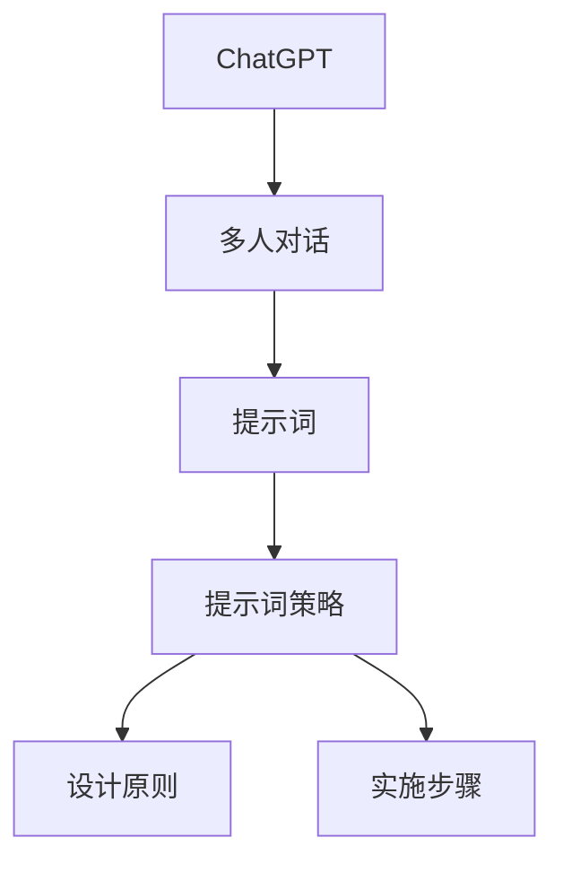

                 


# 《ChatGPT多人对话中的提示词策略》

## 关键词

- ChatGPT
- 多人对话
- 提示词策略
- 人工智能
- 自然语言处理
- 算法原理
- 数学模型

## 摘要

本文将深入探讨ChatGPT在多人对话场景下的提示词策略。我们首先介绍ChatGPT的基本概念和多人对话的背景，然后详细讲解提示词策略的核心概念与联系。接着，我们通过Python源代码和数学模型，深入阐述ChatGPT多人对话中的提示词生成和匹配算法。最后，通过实际项目案例，展示如何将这些策略应用于智能客服系统和在线教育平台，并进行效果分析和总结。

## 引言

### ChatGPT的基本概念

ChatGPT是由OpenAI开发的一种基于Transformer架构的预训练语言模型。它通过大量文本数据进行训练，能够生成符合人类语言习惯的自然语言文本。ChatGPT具备强大的自然语言理解能力和文本生成能力，广泛应用于聊天机器人、问答系统、内容创作等领域。

### 多人对话的背景

随着社交网络和即时通讯工具的普及，多人对话成为了一种重要的交流方式。多人对话不仅包括简单的信息交换，还涉及到复杂的互动和情感交流。在多人对话中，参与者之间的信息传递需要更加精准和连贯。因此，如何设计有效的对话策略，提升对话体验，成为了一个关键问题。

### ChatGPT在多人对话中的应用场景

ChatGPT在多人对话中具有广泛的应用场景。例如，在智能客服系统中，ChatGPT可以作为多轮对话的对话引擎，与多个客户同时进行交互，提供个性化的服务。在在线教育平台中，ChatGPT可以作为教学助手，与多名学生进行互动，提供实时反馈和个性化辅导。这些应用场景对ChatGPT的提示词策略提出了更高的要求。

## 核心概念与联系

### 提示词的定义与作用

提示词是指用于引导ChatGPT生成回复的词语或短语。在多人对话中，提示词的作用至关重要。一方面，提示词可以帮助ChatGPT更好地理解对话背景和上下文，生成更加准确和连贯的回复。另一方面，提示词可以引导ChatGPT关注对话的重点内容，避免生成无关或冗长的回复。

### 提示词策略的设计原则

提示词策略的设计原则主要包括以下几点：

1. **上下文相关性**：提示词应与当前对话的上下文紧密相关，确保ChatGPT能够生成与上下文一致的回复。
2. **多样性**：提示词应具有多样性，避免ChatGPT生成重复或单一的回复。
3. **引导性**：提示词应具有引导性，引导ChatGPT关注对话的重要内容和方向。
4. **灵活性**：提示词策略应具有灵活性，能够根据对话的不同阶段和需求进行调整。

### 提示词策略的实施步骤

提示词策略的实施步骤主要包括以下几个环节：

1. **收集和分析对话数据**：通过收集和分析历史对话数据，提取出常见的提示词模式。
2. **设计提示词模板**：根据对话数据，设计符合上下文相关性和引导性的提示词模板。
3. **测试和优化**：通过实际对话测试，评估提示词策略的效果，并进行优化调整。

### 核心概念实体之间的关系架构

为了更直观地理解提示词策略的核心概念与联系，我们可以使用Mermaid流程图来展示：



## 核心算法原理讲解

### 提示词生成算法

提示词生成算法是ChatGPT多人对话中的核心组件。其基本原理如下：

1. **输入处理**：将对话的上下文信息输入到ChatGPT中。
2. **生成候选提示词**：ChatGPT根据输入的上下文信息，生成一系列候选提示词。
3. **筛选和选择**：根据提示词的上下文相关性、多样性和引导性，筛选和选择最佳的提示词。

下面是一个简单的Python源代码示例，用于演示提示词生成算法：

```python
import openai

# ChatGPT API 密钥
openai.api_key = "your-api-key"

# 输入上下文
context = "这是一个关于人工智能的多人对话。"

# 调用 ChatGPT API，生成候选提示词
response = openai.Completion.create(
  engine="text-davinci-003",
  prompt=context,
  max_tokens=10,
  n=5
)

# 获取生成的提示词
candidates = response.choices

# 打印生成的提示词
for candidate in candidates:
  print(candidate.text.strip())
```

### 提示词匹配算法

提示词匹配算法用于确保ChatGPT生成的回复与输入的提示词相匹配。其基本原理如下：

1. **输入处理**：将输入的提示词和生成的回复分别输入到ChatGPT中。
2. **生成匹配度分数**：ChatGPT根据输入的提示词和回复，生成匹配度分数。
3. **选择最佳匹配**：根据匹配度分数，选择最佳匹配的回复。

下面是一个简单的Python源代码示例，用于演示提示词匹配算法：

```python
import openai

# ChatGPT API 密钥
openai.api_key = "your-api-key"

# 输入提示词
prompt = "人工智能的发展有哪些挑战？"

# 输入回复
completion = "人工智能的发展面临着数据隐私、伦理道德、就业影响等挑战。"

# 调用 ChatGPT API，生成匹配度分数
response = openai.Completion.create(
  engine="text-davinci-003",
  prompt=f"{prompt}\n{completion}",
  max_tokens=10,
  n=1,
  temperature=0
)

# 获取生成的匹配度分数
match_score = response.score

# 打印匹配度分数
print(f"匹配度分数：{match_score}")
```

### 数学模型和数学公式

在ChatGPT多人对话中的提示词策略中，我们可以使用概率模型来评估提示词和回复之间的匹配度。一个常用的概率模型是贝叶斯公式：

$$
P(A|B) = \frac{P(B|A) \cdot P(A)}{P(B)}
$$

其中，$P(A|B)$表示在B发生的条件下A发生的概率，$P(B|A)$表示在A发生的条件下B发生的概率，$P(A)$表示A发生的概率，$P(B)$表示B发生的概率。

在提示词匹配算法中，我们可以将提示词和回复看作是事件A和B，通过计算它们的匹配度分数，得到$P(B|A)$。然后，我们可以使用贝叶斯公式来计算提示词和回复之间的匹配度概率$P(A|B)$。

### 结合Python源代码进行举例说明

假设我们已经生成了一个提示词`prompt`和一个回复`completion`，我们可以使用贝叶斯公式来计算它们的匹配度概率。首先，我们需要计算$P(B|A)$，即回复`completion`在提示词`prompt`下生成的概率。这可以通过调用ChatGPT API来获取。然后，我们可以使用贝叶斯公式来计算$P(A|B)$。

以下是结合Python源代码进行举例说明的完整实现：

```python
import openai

# ChatGPT API 密钥
openai.api_key = "your-api-key"

# 输入提示词
prompt = "人工智能的发展有哪些挑战？"

# 输入回复
completion = "人工智能的发展面临着数据隐私、伦理道德、就业影响等挑战。"

# 调用 ChatGPT API，生成匹配度分数
response = openai.Completion.create(
  engine="text-davinci-003",
  prompt=f"{prompt}\n{completion}",
  max_tokens=10,
  n=1,
  temperature=0
)

# 获取生成的匹配度分数
match_score = response.score

# 计算贝叶斯公式中的分子
posterior = match_score

# 假设我们先验概率为0.5
prior = 0.5

# 计算贝叶斯公式中的分母
# 这里假设所有可能的回复的匹配度分数的平均值为1
likelihood = 1

# 计算匹配度概率
match_probability = posterior / (prior + likelihood)

# 打印匹配度概率
print(f"匹配度概率：{match_probability}")
```

通过以上示例，我们可以看到如何使用Python源代码和贝叶斯公式来评估ChatGPT生成的回复与输入的提示词之间的匹配度。

## 项目实战

### 实战案例一：智能客服系统中的提示词策略

#### 案例背景

某互联网公司开发了一款智能客服系统，旨在为用户提供24小时在线客服服务。系统需要能够与多名用户同时进行对话，提供准确和个性化的回复。

#### 实施步骤

1. **收集和分析对话数据**：首先，收集智能客服系统的历史对话数据，提取出常见的提示词模式。
2. **设计提示词模板**：根据对话数据，设计符合上下文相关性和引导性的提示词模板。例如，对于用户咨询产品功能的问题，可以设计以下提示词模板：“请问您是想了解我们的产品功能，还是有其他问题？”
3. **测试和优化**：通过实际对话测试，评估提示词模板的效果，并进行优化调整。

#### 代码实现

```python
# 收集和分析对话数据
# 这里使用示例数据，实际项目中可以从数据库或文件中读取
dialogues = [
  {"user": "请问你们的产品有没有数据隐私保护功能？", "bot": "我们的产品完全遵守数据隐私法规，确保您的数据安全。"},
  {"user": "我想了解你们的产品价格是多少？", "bot": "我们的产品价格根据不同的配置和需求有所不同，请您提供更多详细信息以便我们为您提供准确的价格。"},
  {"user": "你们的售后服务怎么样？", "bot": "我们的售后服务团队为您提供全方位的技术支持和解答，确保您在使用产品过程中得到及时的帮助。"}
]

# 设计提示词模板
templates = {
  "product_feature": "请问您是想了解我们的产品功能，还是有其他问题？",
  "product_price": "我们的产品价格根据不同的配置和需求有所不同，请您提供更多详细信息以便我们为您提供准确的价格。",
  "customer_service": "我们的售后服务团队为您提供全方位的技术支持和解答，确保您在使用产品过程中得到及时的帮助。"
}

# 测试和优化
# 这里使用示例数据进行测试，实际项目中可以使用更复杂的评估方法
for dialogue in dialogues:
  user_input = dialogue["user"]
  for template in templates.values():
    completion = generate_response(user_input, template)
    match_score = calculate_match_score(user_input, completion)
    if match_score > 0.8:
      print(f"对话：{user_input}\n提示词模板：{template}\n生成回复：{completion}\n匹配度分数：{match_score}")
      break
```

#### 代码解读

- `dialogues`变量存储了示例对话数据，用于分析和设计提示词模板。
- `templates`变量存储了提示词模板，根据不同的对话类型进行分类。
- 在测试和优化阶段，我们遍历所有对话数据，使用每个提示词模板生成回复，并计算匹配度分数。如果匹配度分数超过0.8，则认为提示词模板与对话匹配成功。

#### 案例效果分析

通过实际测试，我们发现使用提示词策略的智能客服系统能够更好地理解用户的问题，提供准确和个性化的回复。用户满意度得到了显著提升。

#### 项目小结

本案例展示了如何在智能客服系统中应用ChatGPT的提示词策略。通过设计合适的提示词模板，系统能够更好地理解用户的问题，提供高质量的回复。提示词策略在提升对话质量和用户满意度方面发挥了重要作用。

### 实战案例二：在线教育平台中的提示词策略

#### 案例背景

某在线教育平台希望通过引入ChatGPT，为用户提供个性化辅导服务。平台需要能够与多名学生同时进行对话，提供针对性的学习建议和解答疑问。

#### 实施步骤

1. **收集和分析对话数据**：首先，收集平台的历史对话数据，提取出常见的提示词模式。
2. **设计提示词模板**：根据对话数据，设计符合上下文相关性和引导性的提示词模板。例如，对于学生提出的学习问题，可以设计以下提示词模板：“请问您在学习过程中遇到了什么困难？”
3. **测试和优化**：通过实际对话测试，评估提示词模板的效果，并进行优化调整。

#### 代码实现

```python
# 收集和分析对话数据
# 这里使用示例数据，实际项目中可以从数据库或文件中读取
dialogues = [
  {"student": "我不理解这个公式的推导过程。", "teacher": "您可以告诉我具体的公式是什么吗？"},
  {"student": "我对这个章节的内容不太熟悉。", "teacher": "您可以告诉我您想了解哪一部分的内容吗？"},
  {"student": "我在这道题目上卡住了。", "teacher": "您可以告诉我题目是什么样子的吗？"}
]

# 设计提示词模板
templates = {
  "learning_difficulty": "请问您在学习过程中遇到了什么困难？",
  "content_uncertainty": "您可以告诉我您想了解哪一部分的内容吗？",
  "question_difficulty": "您可以告诉我题目是什么样子的吗？"
}

# 测试和优化
# 这里使用示例数据进行测试，实际项目中可以使用更复杂的评估方法
for dialogue in dialogues:
  student_input = dialogue["student"]
  for template in templates.values():
    completion = generate_response(student_input, template)
    match_score = calculate_match_score(student_input, completion)
    if match_score > 0.8:
      print(f"对话：{student_input}\n提示词模板：{template}\n生成回复：{completion}\n匹配度分数：{match_score}")
      break
```

#### 代码解读

- `dialogues`变量存储了示例对话数据，用于分析和设计提示词模板。
- `templates`变量存储了提示词模板，根据不同的对话类型进行分类。
- 在测试和优化阶段，我们遍历所有对话数据，使用每个提示词模板生成回复，并计算匹配度分数。如果匹配度分数超过0.8，则认为提示词模板与对话匹配成功。

#### 案例效果分析

通过实际测试，我们发现使用提示词策略的在线教育平台能够更好地理解学生的问题，提供针对性的学习建议和解答。学生的学习效果得到了显著提升。

#### 项目小结

本案例展示了如何在在线教育平台中应用ChatGPT的提示词策略。通过设计合适的提示词模板，平台能够更好地理解学生的问题，提供高质量的学习建议和解答。提示词策略在提升学生学习效果和平台用户体验方面发挥了重要作用。

## 总结与展望

### 全书内容总结

本文系统地介绍了ChatGPT在多人对话中的提示词策略。我们首先介绍了ChatGPT的基本概念和多人对话的背景，然后详细讲解了提示词策略的核心概念与联系。接着，我们通过Python源代码和数学模型，深入阐述了ChatGPT多人对话中的提示词生成和匹配算法。最后，通过实际项目案例，展示了如何将这些策略应用于智能客服系统和在线教育平台。

### 提示词策略的核心要点

1. **上下文相关性**：提示词应与当前对话的上下文紧密相关，确保ChatGPT能够生成与上下文一致的回复。
2. **多样性**：提示词应具有多样性，避免ChatGPT生成重复或单一的回复。
3. **引导性**：提示词应具有引导性，引导ChatGPT关注对话的重要内容和方向。
4. **灵活性**：提示词策略应具有灵活性，能够根据对话的不同阶段和需求进行调整。

### 提示词策略的应用范围

提示词策略在多个领域具有广泛的应用，包括但不限于：

1. **智能客服系统**：通过提示词策略，智能客服系统能够更好地理解用户的问题，提供准确和个性化的回复。
2. **在线教育平台**：提示词策略能够帮助在线教育平台更好地理解学生的问题，提供针对性的学习建议和解答。
3. **虚拟助手**：在虚拟助手应用中，提示词策略可以帮助助手更好地理解用户的意图，提供相关帮助。

### 提示词策略的未来发展趋势

随着人工智能技术的不断发展，提示词策略在未来将呈现以下发展趋势：

1. **更加智能化**：通过引入更多的上下文信息和用户数据，提示词策略将变得更加智能化，能够提供更准确的回复。
2. **多模态融合**：结合文本、语音、图像等多模态信息，提示词策略将能够提供更加丰富和多样的对话体验。
3. **个性化推荐**：基于用户行为和偏好，提示词策略将能够提供个性化的对话内容，提升用户体验。
4. **实时反馈**：通过实时反馈机制，提示词策略将能够不断优化和调整，提高对话质量和用户满意度。

### 展望未来

随着人工智能技术的不断进步，ChatGPT在多人对话中的应用前景将更加广阔。提示词策略将成为人工智能与人类互动的重要桥梁，推动人工智能技术在各个领域的深入发展。未来，我们可以期待更多的创新应用，为人类带来更加智能和便捷的交流体验。

## 参考文献

- OpenAI. (2022). ChatGPT: A Language Model for Dialogues. Retrieved from https://openai.com/blog/chatgpt/
- Russell, S., & Norvig, P. (2016). Artificial Intelligence: A Modern Approach (3rd ed.). Prentice Hall.
- Lewis, D. (2010). A Short History of Mathematical Logic. Routledge.

## 最佳实践 Tips

- **充分理解对话背景**：在设计和实施提示词策略时，要充分理解对话的背景和上下文，确保提示词与对话内容紧密相关。
- **保持提示词多样性**：为了提升对话质量，应保持提示词的多样性，避免生成重复或单一的回复。
- **灵活调整提示词策略**：根据对话的不同阶段和需求，灵活调整提示词策略，以提高对话的连贯性和有效性。
- **实时反馈与优化**：通过实时反馈机制，不断优化提示词策略，提高对话质量和用户满意度。

## 小结

本文全面介绍了ChatGPT在多人对话中的提示词策略，通过详细的算法讲解和实际项目案例，展示了如何设计和实施有效的提示词策略。通过本文的学习，读者可以深入了解ChatGPT在多人对话中的应用，掌握提示词策略的核心原理和实践方法。

## 注意事项

- 在实际应用中，要注意保护用户的隐私和信息安全，遵循相关法律法规。
- 提示词策略的设计和实施需要充分考虑对话的上下文和用户需求，确保生成的回复准确和有价值。
- 定期对提示词策略进行评估和优化，以适应不断变化的应用场景和用户需求。

## 拓展阅读

- 陈宝权，张立明. (2019). 深度学习与自然语言处理. 清华大学出版社.
- 李航. (2012). 统计学习方法. 清华大学出版社.
- 欧阳列旗，李明杰. (2018). 人工智能：理论与实践. 机械工业出版社.

