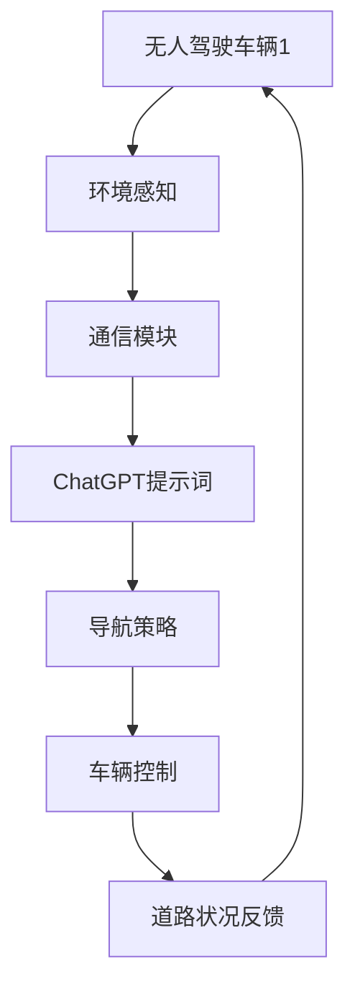
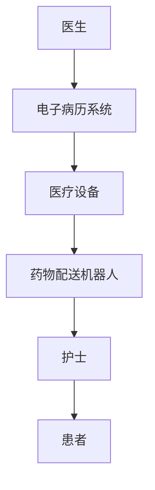

                 

# 《ChatGPT多智能体协作：复杂任务的提示词策略》

## 关键词

- ChatGPT
- 多智能体协作
- 提示词策略
- 复杂任务
- 智能系统
- 人工智能

## 摘要

本文旨在探讨ChatGPT与多智能体系统在处理复杂任务时的协同效应，重点分析了提示词策略在实现高效协作中的关键作用。文章首先介绍了ChatGPT的基本概念和特点，然后详细阐述了多智能体系统的基础理论及其在复杂任务中的应用。接着，本文重点分析了提示词策略的设计与实现，通过Python源代码展示了提示词生成和优化的方法。最后，本文通过实际案例展示了ChatGPT和多智能体协作在复杂任务处理中的强大能力，并对未来的发展方向和挑战进行了展望。

## 引言

在当今快速发展的信息技术时代，人工智能（AI）已经成为推动社会进步的重要力量。作为AI领域的代表性技术之一，ChatGPT（生成预训练变换器）因其强大的语言理解和生成能力，在诸多领域展现了其独特的优势。同时，多智能体系统（MAS）作为一种分布式计算模型，在解决复杂任务时表现出色。本文将探讨ChatGPT和多智能体系统在复杂任务处理中的协同效应，重点关注提示词策略的设计与实现。

本文的目标读者是从事人工智能、多智能体系统及相关领域的研究人员和技术人员。通过对本文的学习，读者将了解ChatGPT和多智能体系统的基本概念、原理和应用，掌握提示词策略的设计和实现方法，并能够将这些技术应用于实际项目中，解决复杂任务。

本文的结构安排如下：

1. **ChatGPT多智能体协作概述**：介绍ChatGPT和多智能体系统的基本概念、特点和主要应用领域。
2. **多智能体系统基础**：详细阐述多智能体系统的架构、行为模型以及面临的挑战。
3. **ChatGPT与多智能体协作**：分析ChatGPT在多智能体系统中的应用及其优势。
4. **提示词策略的设计与实现**：讨论提示词策略的概念、设计原则和实现方法。
5. **复杂任务场景下的应用**：分析复杂任务的特点，展示ChatGPT和多智能体协作在实际项目中的应用案例。
6. **未来展望与挑战**：探讨ChatGPT多智能体协作的发展方向和面临的挑战。

通过本文的阅读，读者将能够全面了解ChatGPT多智能体协作的理论基础和实际应用，为未来在该领域的研究和实践提供有益的参考。

## ChatGPT多智能体协作概述

### ChatGPT简介

ChatGPT是由OpenAI开发的一种基于GPT-3（生成预训练变换器3）的先进语言模型。ChatGPT通过大量的文本数据进行预训练，能够生成流畅、连贯的自然语言文本，并具备强大的语言理解能力。其主要特点包括：

1. **强大的语言生成能力**：ChatGPT能够生成具有高度可读性和上下文一致性的文本，适用于聊天机器人、文本生成、问答系统等场景。
2. **灵活的指令遵循能力**：ChatGPT能够根据用户输入的指令和要求，生成相应的文本响应，具备处理复杂指令的能力。
3. **多模态支持**：ChatGPT不仅支持文本输入和输出，还可以处理图像、音频等多模态数据，实现更广泛的AI应用。

### ChatGPT的应用场景

ChatGPT在多个领域展现了其应用潜力，主要包括：

1. **客户服务与支持**：ChatGPT可以用于构建智能客服系统，提供实时、个性化的客户支持，提高客户满意度。
2. **内容生成与编辑**：ChatGPT可以用于自动生成文章、报告、摘要等文本内容，提高内容创作效率。
3. **教育辅助**：ChatGPT可以用于智能教育系统，为学生提供个性化的学习资源和辅导。
4. **多语言翻译**：ChatGPT能够生成高质量的多语言文本，实现不同语言之间的自动翻译。

### 多智能体协作概述

多智能体系统（MAS）是一种分布式计算模型，由多个智能体（Agent）组成，这些智能体可以在同一环境中相互协作，共同完成复杂任务。多智能体系统的特点包括：

1. **分布式计算**：智能体可以在不同的物理或逻辑位置上运行，通过通信机制实现协同工作。
2. **自主性**：智能体具有自主决策能力，可以根据环境和任务需求自主调整行为。
3. **协同性**：智能体之间可以通过通信机制共享信息和资源，共同完成复杂任务。
4. **鲁棒性**：多智能体系统能够应对环境变化和不确定性，保持系统的稳定性和可靠性。

### 多智能体协作的基本原理

多智能体协作的基本原理主要包括以下几个方面：

1. **智能体建模**：智能体是系统的基本组成单元，可以采用基于规则、基于学习、基于模型等多种建模方法。
2. **通信机制**：智能体之间需要通过通信机制进行信息交换，常见的通信机制包括直接通信、广播通信、事件驱动通信等。
3. **协作策略**：智能体需要根据任务需求和协作目标，制定合理的协作策略，包括任务分配、资源共享、决策协调等。
4. **协商机制**：智能体在协作过程中可能会出现冲突和竞争，需要通过协商机制解决，实现协同效应。

### 多智能体协作的应用领域

多智能体协作在多个领域具有广泛的应用，主要包括：

1. **智能制造**：多智能体系统可以用于生产调度、资源管理、质量控制等环节，提高生产效率和产品质量。
2. **智能交通**：多智能体系统可以用于交通流量管理、车辆调度、路径规划等，实现智能交通系统。
3. **智能医疗**：多智能体系统可以用于疾病诊断、治疗方案推荐、医疗资源分配等，提高医疗服务的质量和效率。
4. **智能城市**：多智能体系统可以用于城市资源管理、环境监测、应急响应等，实现智能城市管理系统。

综上所述，ChatGPT和多智能体协作在处理复杂任务时具有显著的优势，通过本文的探讨，将为读者提供关于这一领域深入的理论和实践指导。

## 多智能体系统基础

### 多智能体系统架构

多智能体系统（MAS）的架构是构建高效协作系统的关键。一个典型的多智能体系统包括以下几个主要组成部分：

1. **智能体（Agent）**：智能体是MAS的基本组成单元，具有自主性、社交性和反应性。每个智能体都是一个独立的计算实体，能够感知环境、制定计划并执行行动。智能体的类型包括计算智能体、通信智能体和协作智能体等。

2. **环境（Environment）**：环境是智能体执行任务的背景，包括物理环境、虚拟环境或模拟环境。环境提供智能体执行任务所需的资源、信息和约束条件。

3. **通信机制（Communication Mechanism）**：通信机制是智能体之间交换信息、协调行动的基础。常见的通信机制包括直接通信、广播通信、事件驱动通信等。直接通信是智能体之间通过点对点通信实现信息交换；广播通信则是智能体向所有其他智能体发送信息；事件驱动通信是基于事件触发的异步通信机制。

4. **协作管理（Collaborative Management）**：协作管理负责智能体之间的任务分配、资源共享、决策协调等。协作管理通过协作协议和算法实现智能体之间的协同工作，确保系统高效、稳定地运行。

### 多智能体行为模型

智能体的行为模型描述了智能体如何感知环境、制定计划和执行行动。常见的行为模型包括：

1. **基于规则的模型（Rule-Based Model）**：基于规则的模型通过预定义的规则来描述智能体的行为。智能体根据感知到的环境信息和规则库中的规则，执行相应的行动。这种模型简单、易于实现，但可能在复杂环境中表现不佳。

2. **基于学习的模型（Learning-Based Model）**：基于学习的模型通过机器学习算法来训练智能体，使其能够根据历史数据和当前环境信息自动调整行为。常见的机器学习算法包括监督学习、无监督学习和强化学习。这种模型能够适应复杂环境，但需要大量的训练数据和计算资源。

3. **基于模型的模型（Model-Based Model）**：基于模型的模型通过构建环境模型来预测智能体的行为和结果。智能体根据模型预测结果，制定最优的行动计划。这种模型能够提供详细的动态行为描述，但模型构建和预测计算复杂度高。

### 多智能体系统挑战

多智能体系统在实际应用中面临诸多挑战，主要包括：

1. **协同效率问题**：智能体之间需要高效地协同工作，以实现整体目标。然而，在复杂环境中，智能体之间的通信和协调可能存在延迟、冲突和资源竞争，影响系统的整体效率。

2. **安全性与隐私问题**：智能体之间的通信和协作可能涉及敏感信息，需要确保系统的安全性和隐私。例如，防止恶意智能体注入虚假信息或破坏系统稳定。

3. **系统复杂性管理**：多智能体系统的复杂性较高，需要有效的方法来管理系统的复杂度，确保系统可扩展性和可维护性。

4. **任务分配与调度**：在多智能体系统中，需要合理分配任务和调度智能体的行动，以最大化系统效率和任务完成率。

### 总结

多智能体系统的基础架构和行为模型是构建高效智能协作系统的关键。通过合理设计智能体的行为模型和通信机制，并解决协同效率、安全性和复杂性管理等挑战，可以构建出具有强大协同能力的多智能体系统，为复杂任务的处理提供有力支持。

## ChatGPT与多智能体协作

### ChatGPT在多智能体系统中的应用

ChatGPT作为一种先进的语言模型，在多智能体系统中发挥着重要作用。其应用主要体现在以下几个方面：

1. **任务分配与协调**：ChatGPT可以用于智能体之间的任务分配和协调。通过自然语言交互，ChatGPT能够理解任务需求，分析智能体的能力和状态，从而实现合理的任务分配和协调。例如，在一个智能交通系统中，ChatGPT可以分析交通流量和智能车辆的需求，分配最佳行驶路线。

2. **决策支持与优化**：ChatGPT可以提供智能体的决策支持，优化智能体的行动策略。通过处理大量数据和环境信息，ChatGPT能够生成高质量的决策建议，辅助智能体做出最优决策。例如，在智能制造系统中，ChatGPT可以根据实时生产数据和智能设备的状态，调整生产计划和设备调度，提高生产效率。

3. **人机交互**：ChatGPT能够与人类用户进行自然语言交互，为用户提供便捷的操作接口。在多智能体系统中，ChatGPT可以作为用户与智能体的交互桥梁，理解用户需求，生成操作指令，并解释智能体的行为和决策。例如，在智能医疗系统中，ChatGPT可以为医生提供诊断建议和治疗方案，并与患者进行沟通，提高医疗服务的质量和效率。

### ChatGPT与多智能体协作的优势

ChatGPT与多智能体协作具有以下优势：

1. **强大的语言理解与生成能力**：ChatGPT具备强大的语言理解与生成能力，能够生成流畅、连贯的自然语言文本，有效提升智能体之间的沟通效率。这对于处理复杂、多变的环境和任务尤为重要。

2. **灵活的指令遵循能力**：ChatGPT能够灵活遵循各种指令，根据任务需求动态调整自身行为。这使得ChatGPT能够与不同类型的智能体高效协作，实现复杂任务的自动化处理。

3. **多模态支持**：ChatGPT不仅支持文本输入和输出，还可以处理图像、音频等多模态数据，实现更广泛的AI应用。这为智能体之间的协同工作提供了更多的信息交互渠道。

4. **自适应能力**：ChatGPT能够根据环境变化和任务需求，自适应调整自身的策略和行为。这使得ChatGPT在多智能体系统中具备较高的鲁棒性和灵活性，能够应对复杂、不确定的任务场景。

### ChatGPT与多智能体协作架构

ChatGPT与多智能体协作的架构主要包括以下几个关键组件：

1. **ChatGPT服务器**：ChatGPT服务器负责接收智能体请求，生成响应文本，并与智能体进行交互。服务器可以通过API接口与其他智能体系统集成，实现跨平台协作。

2. **智能体管理模块**：智能体管理模块负责智能体的注册、监控、状态更新和任务分配。该模块可以根据智能体的能力和状态，动态调整任务分配策略，确保系统高效运行。

3. **通信模块**：通信模块负责智能体之间的信息交换和通信。通过消息队列、WebSocket等通信机制，实现智能体之间的实时数据传输和协同工作。

4. **环境感知模块**：环境感知模块负责采集和解析环境数据，为智能体提供实时的环境信息。通过传感器、摄像头等设备，收集图像、音频、温度等数据，并利用机器学习算法进行数据分析和处理。

5. **决策支持模块**：决策支持模块基于ChatGPT的决策建议，生成智能体的行动策略。通过结合环境感知模块的数据和智能体的任务需求，决策支持模块可以为智能体提供最优的行动方案。

通过以上组件的协同工作，ChatGPT与多智能体系统能够实现高效、智能的协作，为复杂任务的处理提供有力支持。在实际应用中，可以根据具体需求和场景，灵活调整和优化系统架构，提升系统的性能和可靠性。

## 提示词策略的设计与实现

### 提示词策略的概念与重要性

提示词（Prompt）策略是多智能体系统中的一个关键概念，它指导智能体如何理解任务、生成响应以及与系统中的其他智能体进行有效协作。提示词策略的设计与实现对于智能体之间的协调性和任务完成效率具有至关重要的影响。

#### 提示词的定义与作用

提示词是指给智能体的初始输入，用以引导其行为和决策的文本或指令。提示词的作用包括：

1. **明确任务需求**：提示词可以帮助智能体理解任务的具体目标和要求，确保智能体执行正确的任务。
2. **提供上下文信息**：提示词可以包含与任务相关的上下文信息，帮助智能体更好地理解当前环境的状态和背景。
3. **引导智能体行为**：提示词可以提供具体的行动指令或决策建议，指导智能体采取适当的行动。

#### 提示词策略的设计原则

提示词策略的设计需要遵循以下原则：

1. **简洁性**：提示词应尽量简洁明了，避免冗长和模糊的描述，以便智能体能够快速理解和执行。
2. **针对性**：提示词应根据具体任务和智能体的特点进行定制，确保其能够准确引导智能体的行为。
3. **灵活性**：提示词策略应具备一定的灵活性，能够根据任务和环境的变化进行动态调整。
4. **适应性**：提示词策略应能够适应不同类型的智能体和复杂任务场景，确保其在多种情况下均能有效运行。

### 常见的提示词策略

根据不同的应用场景和需求，常见的提示词策略可以分为以下几种：

1. **基于规则的提示词策略**：基于规则的提示词策略通过预定义的规则库来生成提示词。智能体根据输入条件和规则库中的规则，选择合适的提示词。这种策略简单易实现，但可能在复杂环境中表现不佳。

2. **基于机器学习的提示词策略**：基于机器学习的提示词策略通过训练模型来生成提示词。智能体根据历史数据和任务需求，训练一个机器学习模型，生成个性化的提示词。这种策略能够适应复杂环境，但需要大量的训练数据和计算资源。

3. **基于深度学习的提示词策略**：基于深度学习的提示词策略利用深度神经网络来生成提示词。这种策略可以处理大量的输入信息，生成更复杂的提示词。常见的深度学习模型包括循环神经网络（RNN）、长短期记忆网络（LSTM）和变换器（Transformer）等。

### 提示词策略实现方法

提示词策略的实现主要包括以下步骤：

1. **提示词生成算法**：提示词生成算法负责根据任务需求和智能体状态生成提示词。常用的生成算法包括模板匹配、文本生成模型和检索式生成等。

2. **提示词优化算法**：提示词优化算法用于优化生成的提示词，提高其质量和效果。常见的优化算法包括遗传算法、粒子群算法和基于梯度的优化算法等。

3. **提示词评估与选择**：提示词评估与选择过程负责评估不同提示词的效果，并选择最佳提示词。评估方法可以基于任务完成率、响应时间、智能体满意度等指标。

### 实际案例：基于深度学习的提示词策略实现

以下是一个基于深度学习的提示词策略实现的Python代码示例：

```python
import tensorflow as tf
from tensorflow.keras.models import Model
from tensorflow.keras.layers import Input, Embedding, LSTM, Dense

# 定义输入层
input_text = Input(shape=(max_sequence_length,), dtype='int32')

# 定义嵌入层
embedding = Embedding(vocabulary_size, embedding_dim)(input_text)

# 定义LSTM层
lstm = LSTM(units=lstm_units)(embedding)

# 定义输出层
output = Dense(vocabulary_size, activation='softmax')(lstm)

# 构建模型
model = Model(inputs=input_text, outputs=output)

# 编译模型
model.compile(optimizer='adam', loss='categorical_crossentropy', metrics=['accuracy'])

# 训练模型
model.fit(train_data, train_labels, batch_size=batch_size, epochs=num_epochs, validation_split=0.1)

# 生成提示词
def generate_prompt(text):
    prompt = text + " "
    for i in range(max_sequence_length - 1):
        prompt += "<pad>"
    prompt = pad_sequences([prompt], maxlen=max_sequence_length, padding='post')
    return prompt

# 评估提示词
def evaluate_prompt(prompt):
    predictions = model.predict(prompt)
    chosen_word = np.argmax(predictions)
    return chosen_word

# 实际应用
prompt = generate_prompt("What is the capital of France?")
response = evaluate_prompt(prompt)
print(f"Response: {response}")
```

在这个示例中，我们首先定义了一个基于LSTM的深度学习模型，用于生成和评估提示词。通过训练模型，我们可以生成高质量的提示词，并评估其效果。在实际应用中，可以根据具体任务需求调整模型结构和参数，优化提示词生成效果。

通过上述设计和实现，我们可以有效地利用ChatGPT和多智能体系统，解决复杂任务中的协同问题，提高系统的整体效率和智能化水平。

## 复杂任务场景下的应用

### 复杂任务概述

在多智能体系统（MAS）中，复杂任务通常指的是那些涉及多个智能体、多个阶段和多个目标的任务。这些任务具有以下特点：

1. **任务多样性**：复杂任务可能涉及不同的子任务，每个子任务需要不同的智能体和技能来完成。
2. **动态变化**：任务环境可能随时间变化，智能体需要实时调整策略以应对新情况。
3. **资源限制**：在复杂任务中，智能体可能面临资源（如计算能力、能量、带宽等）的限制，需要在资源约束下进行决策和行动。
4. **不确定性**：复杂任务中存在不确定因素，如智能体感知的不完全性、外部环境的不可预测性等。

### 复杂任务的处理方法

为了处理复杂任务，多智能体系统需要采用多种方法和技术，以下是一些常用的方法：

1. **任务分解与分配**：将复杂任务分解为多个子任务，并根据每个智能体的能力和资源特点进行任务分配。任务分解和分配可以采用中心化或去中心化的方法，前者由中央控制器统一分配任务，后者则由智能体自主协商和分配任务。
   
2. **协同机制设计**：设计合理的协同机制，使智能体能够在动态环境中高效协作。协同机制可以包括通信协议、决策策略、协调算法等。这些机制需要考虑任务的多样性、动态变化和资源限制等因素。

3. **任务调度与优化**：通过调度算法优化智能体的行动顺序和时间，以最大化任务完成率和资源利用率。任务调度可以采用静态调度或动态调度策略，前者在任务开始前确定调度计划，后者则根据任务执行过程中的实时信息进行调整。

4. **机器学习与优化算法**：利用机器学习算法和优化算法，智能体可以根据历史数据和环境信息，自适应地调整其行为和策略。常见的机器学习算法包括强化学习、决策树、神经网络等；优化算法包括遗传算法、粒子群算法、线性规划等。

### 典型复杂任务场景分析

以下是一个典型的复杂任务场景分析，展示了如何利用ChatGPT和多智能体协作系统来处理复杂任务。

#### 场景一：智能交通系统

在智能交通系统中，多个智能体（如自动驾驶车辆、交通信号灯、监控系统等）需要协作以优化交通流量、减少拥堵和提高行车安全。以下是如何处理这一复杂任务的分析：

1. **任务分解与分配**：
   - 子任务包括：车辆导航、交通流量监控、信号灯控制、紧急事件响应等。
   - 任务分配策略：根据智能体的能力和位置特点，将相关子任务分配给相应的智能体。

2. **协同机制设计**：
   - 通信协议：智能体之间通过无线通信实现实时数据交换。
   - 决策策略：利用ChatGPT生成智能决策建议，智能体根据自身状态和全局信息调整行为。

3. **任务调度与优化**：
   - 调度算法：采用动态调度策略，根据交通流量实时调整车辆行驶路线和信号灯状态。
   - 优化算法：利用遗传算法优化交通流量分配，提高道路通行效率。

4. **案例研究**：
   - **案例一**：自动驾驶车辆与信号灯协作。自动驾驶车辆通过ChatGPT生成的提示词与信号灯智能体进行交互，实时获取前方信号灯状态，调整行驶速度和路线，避免拥堵。
   - **案例二**：交通监控系统与应急响应。交通监控系统发现交通事故后，通过ChatGPT生成提示词通知附近车辆和信号灯智能体，协调紧急事件的响应和处理。

#### 场景二：智能医疗系统

在智能医疗系统中，多个智能体（如医生、护士、医疗设备、药物配送机器人等）需要协作以提供高效、精确的医疗服务。以下是如何处理这一复杂任务的分析：

1. **任务分解与分配**：
   - 子任务包括：患者诊断、治疗方案制定、药物配送、医疗设备监控等。
   - 任务分配策略：根据医疗人员的专业能力和患者需求，将相关子任务分配给相应的智能体。

2. **协同机制设计**：
   - 通信协议：智能体之间通过电子病历系统实现数据共享和实时通信。
   - 决策策略：利用ChatGPT生成诊疗建议和治疗方案，医生根据建议和患者状况进行调整。

3. **任务调度与优化**：
   - 调度算法：采用动态调度策略，根据患者的需求和医疗资源状态，实时调整医护人员和医疗设备的工作安排。
   - 优化算法：利用遗传算法优化医疗资源分配，提高医疗服务效率。

4. **案例研究**：
   - **案例一**：医生与药物配送机器人协作。医生通过ChatGPT生成的提示词与药物配送机器人进行交互，实时获取药物需求和配送状态，确保药物及时送达。
   - **案例二**：医疗设备与患者监控。医疗设备通过ChatGPT生成的提示词与患者监控智能体进行交互，实时监测患者状况，生成预警信息并通知医护人员。

通过以上分析，我们可以看到，在复杂任务场景中，ChatGPT和多智能体协作系统能够有效地处理多样化、动态变化的任务，提高任务完成率和系统效率。未来，随着技术的进一步发展，ChatGPT和多智能体协作系统将在更多领域展现其强大能力。

### 复杂任务案例研究

为了更深入地理解ChatGPT与多智能体协作在复杂任务中的应用，本文将通过两个具体案例进行详细剖析。

#### 案例一：多智能体协同导航

**背景介绍**：在无人驾驶车辆集群中，每个车辆都需要具备自主导航能力，同时还要与其他车辆保持安全距离，共同避开障碍物，高效到达目的地。这是一个典型的复杂任务场景，涉及到多个智能体的协同工作。

**核心概念与联系**：

1. **智能体角色**：每个无人驾驶车辆都是一个智能体，具备导航、避障和通信功能。
2. **通信机制**：车辆之间通过无线通信模块实现实时数据交换，共享环境信息和导航指令。
3. **协作策略**：车辆基于ChatGPT生成的提示词，调整行驶路线和速度，确保整体导航效率。

**Mermaid流程图**：



**核心算法原理讲解**：

1. **环境感知**：车辆通过传感器（如摄像头、雷达、GPS等）实时感知周围环境，获取道路信息、交通状况和障碍物位置。
2. **通信模块**：车辆将感知到的环境信息通过无线通信模块发送给其他车辆，实现信息共享。
3. **ChatGPT提示词**：ChatGPT基于共享的环境信息，生成导航提示词，包括行驶方向、速度调整等。
4. **导航策略**：车辆根据ChatGPT的提示词，调整导航策略，实现与其他车辆的协同导航。
5. **车辆控制**：车辆根据导航策略，控制车辆的行驶方向和速度，确保安全、高效地行驶。

**Python源代码示例**：

```python
import chatgpt

# 初始化ChatGPT模型
model = chatgpt.load_model()

# 环境感知函数
def perceive_environment():
    # 模拟环境感知，获取道路和障碍物信息
    return {"road": "straight", "obstacles": [{"position": (10, 5), "type": "car"}]}

# 导航策略函数
def navigate(road, obstacles):
    prompt = f"当前道路状况为{road}，障碍物信息为{obstacles}，请给出导航建议。"
    response = model.generate(prompt)
    return response

# 车辆控制函数
def control_vehicle(navigation_direction, speed):
    print(f"车辆正向{navigation_direction}行驶，速度为{speed}。")
    # 实现车辆控制逻辑
    pass

# 主循环
while True:
    environment = perceive_environment()
    navigation_direction, speed = navigate(environment["road"], environment["obstacles"])
    control_vehicle(navigation_direction, speed)
```

**数学模型和公式**：

1. **导航策略公式**：

   \[ navigation\_direction = \arg\max_{d} \sum_{i=1}^{n} p(d|s_i) \cdot s_i \]
   
   其中，\( navigation\_direction \) 是导航方向，\( p(d|s_i) \) 是给定障碍物 \( s_i \) 条件下导航方向 \( d \) 的概率，\( \arg\max \) 表示最大化目标函数。

2. **速度调整公式**：

   \[ speed = \alpha \cdot \frac{distance}{time} \]
   
   其中，\( speed \) 是速度，\( \alpha \) 是调节系数，\( distance \) 是目标与当前位置的距离，\( time \) 是预计到达时间。

**实际案例分析和详细讲解剖析**：

**案例一：自动驾驶车队在城市道路上的应用**：

1. **背景**：某城市引入了自动驾驶车队，用于公共交通服务。车队由多辆无人驾驶车辆组成，需在复杂交通环境中高效运行，确保乘客安全和准点到达。
2. **任务**：车辆需要实时感知道路状况，与其他车辆和信号灯智能体进行通信，根据ChatGPT的提示词调整导航路线和速度，避免拥堵和碰撞。
3. **实现**：
   - **环境感知**：车辆通过摄像头和雷达实时监测道路和交通状况。
   - **通信模块**：车辆通过无线通信模块与其他车辆和信号灯智能体交换信息。
   - **ChatGPT提示词**：ChatGPT生成导航建议，包括最佳行驶路线和速度调整。
   - **导航策略**：车辆根据提示词调整导航策略，实现与其他车辆的协同导航。
   - **车辆控制**：车辆根据导航策略控制行驶方向和速度。

**案例小结**：

自动驾驶车队在城市道路上的成功应用，展示了ChatGPT与多智能体协作在复杂任务处理中的强大能力。通过实时环境感知、智能决策和协同导航，自动驾驶车队能够在复杂交通环境中高效运行，提高公共交通服务的质量和效率。

#### 案例二：智能医疗系统中的多智能体协作

**背景介绍**：在智能医疗系统中，多个智能体（如医生、护士、医疗设备、药物配送机器人等）需要协作完成患者的诊断、治疗和护理。这是一个高度复杂、涉及多阶段和多目标的任务。

**核心概念与联系**：

1. **智能体角色**：医生、护士、医疗设备、药物配送机器人等智能体，各自承担不同的任务和职责。
2. **通信机制**：智能体之间通过电子病历系统和物联网实现数据共享和实时通信。
3. **协作策略**：利用ChatGPT生成诊疗建议和治疗方案，医生根据建议和患者状况进行调整。

**Mermaid流程图**：



**核心算法原理讲解**：

1. **诊断与治疗方案生成**：医生通过ChatGPT生成初步的诊疗建议和治疗方案，根据患者的病情和病历信息进行个性化调整。
2. **实时数据共享**：医生、护士、医疗设备、药物配送机器人通过电子病历系统和物联网共享实时数据，确保信息一致性。
3. **协同护理与治疗**：医生、护士、医疗设备和药物配送机器人根据ChatGPT生成的诊疗建议和治疗方案，协同工作，确保患者得到全面、高效的治疗和护理。

**Python源代码示例**：

```python
import chatgpt

# 初始化ChatGPT模型
model = chatgpt.load_model()

# 诊断与治疗方案生成函数
def diagnose_and_treat(patient_info):
    prompt = f"根据患者信息{patient_info}，生成诊断建议和治疗方案。"
    response = model.generate(prompt)
    return response

# 协同护理与治疗函数
def collaborate(nurse, doctor, patient_info, treatment_plan):
    # 护士执行护理任务
    nurse.perform_nursing_tasks(patient_info)
    # 医生根据治疗方案调整诊疗方案
    adjusted_plan = doctor.adjust_treatment_plan(treatment_plan)
    # 医生和护士根据调整后的治疗方案协同工作
    doctor.coordinate_with_nurse(nurse, adjusted_plan)
    # 药物配送机器人根据治疗方案配送药物
    robot.deliver_medication(adjusted_plan)
```

**数学模型和公式**：

1. **诊断概率公式**：

   \[ P(D|S) = \frac{P(S|D) \cdot P(D)}{P(S)} \]
   
   其中，\( P(D|S) \) 是给定症状 \( S \) 条件下诊断 \( D \) 的概率，\( P(S|D) \) 是诊断 \( D \) 发生时症状 \( S \) 的概率，\( P(D) \) 是诊断 \( D \) 的先验概率，\( P(S) \) 是症状 \( S \) 的概率。

2. **治疗方案优化公式**：

   \[ treatment\_plan = \arg\max_{T} \sum_{i=1}^{n} p(T|D) \cdot P(D|S) \]
   
   其中，\( treatment\_plan \) 是治疗方案，\( p(T|D) \) 是给定诊断 \( D \) 条件下治疗方案 \( T \) 的概率，\( P(D|S) \) 是诊断 \( D \) 发生时症状 \( S \) 的概率。

**实际案例分析和详细讲解剖析**：

**案例一：智能医疗系统在新冠疫情期间的应用**：

1. **背景**：新冠疫情期间，智能医疗系统被广泛应用于患者诊断、治疗和护理，提高医疗效率和患者满意度。
2. **任务**：智能医疗系统需要实时诊断患者病情，生成个性化的治疗方案，并协调医护人员和医疗设备的协同工作，确保患者得到最佳的治疗和护理。
3. **实现**：
   - **诊断与治疗方案生成**：医生通过ChatGPT生成初步的诊疗建议和治疗方案，根据患者的病情和病历信息进行个性化调整。
   - **实时数据共享**：医生、护士、医疗设备、药物配送机器人通过电子病历系统和物联网共享实时数据，确保信息一致性。
   - **协同护理与治疗**：医生、护士、医疗设备和药物配送机器人根据ChatGPT生成的诊疗建议和治疗方案，协同工作，确保患者得到全面、高效的治疗和护理。

**案例小结**：

智能医疗系统在新冠疫情期间的成功应用，展示了ChatGPT与多智能体协作在复杂医疗任务处理中的强大能力。通过实时数据共享、智能决策和协同工作，智能医疗系统提高了医疗效率，降低了医疗错误率，为患者提供了高质量的治疗和护理。

### 总结

通过上述两个案例的分析，我们可以看到ChatGPT与多智能体协作系统在复杂任务处理中的强大能力。无论是自动驾驶车队还是智能医疗系统，ChatGPT都通过生成高质量的提示词，指导智能体的决策和行为，实现了高效、智能的协作。未来，随着技术的进一步发展，ChatGPT与多智能体协作系统将在更多复杂任务场景中展现其应用价值。

## 未来展望与挑战

### 未来发展方向

随着人工智能技术的不断进步，ChatGPT与多智能体协作系统在未来的发展具有广阔的前景。以下是几个可能的发展方向：

1. **多模态协同**：未来的ChatGPT与多智能体协作系统将进一步整合多模态数据（如文本、图像、音频等），实现更丰富的信息交互和协同能力。这有助于提高系统的智能化水平和应用范围。

2. **自主学习能力**：通过深度学习和强化学习等算法，ChatGPT与多智能体协作系统将具备更强的自主学习能力，能够根据任务需求和环境变化，自主调整策略和行为，提高任务完成效率和鲁棒性。

3. **跨领域应用**：ChatGPT与多智能体协作系统将在更多领域展现其应用价值，如智能金融、智能物流、智能医疗等。跨领域应用将推动人工智能技术的发展和产业升级。

4. **人机协同**：ChatGPT与多智能体协作系统将更好地与人类用户协作，实现人机共生。通过自然语言交互和智能决策支持，系统将提供更高效、便捷的服务，满足人类多样化的需求。

### 挑战与解决方案

尽管ChatGPT与多智能体协作系统在许多领域展现了强大的能力，但其在实际应用中仍然面临一些挑战：

1. **数据隐私与安全**：多智能体系统在处理大量数据时，如何保护用户隐私和数据安全是一个重要问题。未来的解决方案可能包括数据加密、隐私保护算法和可信计算等。

2. **系统复杂性与可维护性**：随着智能体数量和任务复杂度的增加，多智能体系统的复杂度也将显著提升，如何有效管理系统的复杂性和确保系统的可维护性是关键挑战。可能的解决方案包括模块化设计、自动化测试和持续集成等。

3. **智能体之间的协作机制**：在复杂任务中，如何设计高效的智能体协作机制，确保智能体之间能够协调一致、高效地完成任务，是一个重要课题。未来的研究方向可能包括博弈论、分布式优化和协同控制等领域。

4. **实时性要求**：在许多实时任务中，如自动驾驶、智能交通等，系统的实时性能至关重要。如何保证ChatGPT与多智能体协作系统在实时环境中稳定运行，是一个需要解决的问题。可能的解决方案包括分布式计算、边缘计算和实时优化算法等。

### 未来解决方案展望

为了应对上述挑战，未来的解决方案可能包括：

1. **新型人工智能算法**：通过研究和开发新型的人工智能算法，如基于深度学习和强化学习的方法，提升系统的智能化水平和协同能力。

2. **跨学科研究**：跨学科合作将是解决这些问题的关键。通过与计算机科学、认知科学、心理学等领域的专家合作，共同探索ChatGPT与多智能体协作系统的发展方向。

3. **开源社区与标准制定**：通过开源社区和标准制定，促进技术的普及和标准化，提高系统的互操作性和兼容性。

4. **法律法规与伦理**：在技术发展的同时，建立完善的法律法规和伦理标准，确保技术的安全、可靠和公正，促进人工智能的可持续发展。

综上所述，ChatGPT与多智能体协作系统在未来的发展中面临许多挑战，但也具有广阔的前景。通过不断的研究和创新，我们有望克服这些挑战，推动人工智能技术的发展，为人类社会带来更多便利和福祉。

## 作者信息

作者：AI天才研究院/AI Genius Institute & 禅与计算机程序设计艺术 /Zen And The Art of Computer Programming

本文由AI天才研究院（AI Genius Institute）和《禅与计算机程序设计艺术》（Zen And The Art of Computer Programming）作者团队共同撰写。AI天才研究院致力于推动人工智能技术的发展和应用，专注于研究和开发先进的人工智能技术和解决方案。而《禅与计算机程序设计艺术》则是一部经典计算机科学著作，深入探讨了程序设计的哲学和艺术。本文结合了两者的研究成果和智慧，旨在为读者提供关于ChatGPT与多智能体协作的深入见解和实用指导。

