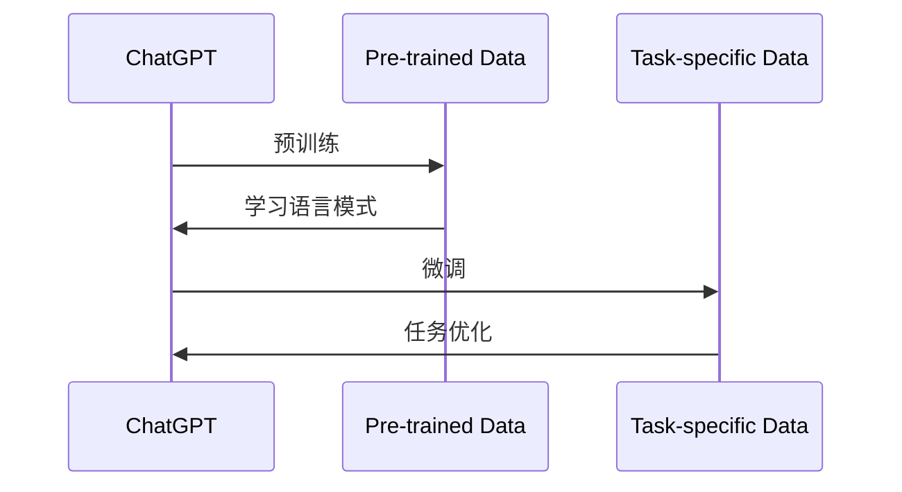
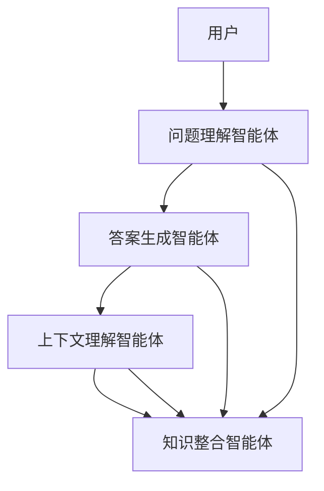
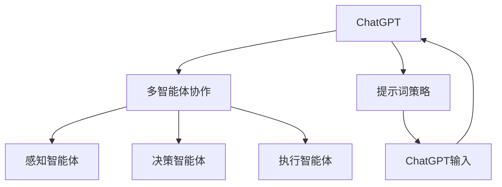

                 

### 1.1.1 ChatGPT的概述

ChatGPT是由OpenAI开发的一种基于GPT-3模型的自然语言处理（NLP）工具。GPT-3（Generative Pre-trained Transformer 3）是一个具有1750亿参数的深度学习模型，其设计初衷是为了生成高质量的文本。ChatGPT则是在GPT-3的基础上，通过进一步的优化和调整，使其能够实现更加自然、流畅的对话生成。

ChatGPT的核心特点在于其强大的生成能力和上下文理解能力。通过在大量文本数据上进行预训练，ChatGPT能够学习到丰富的语言模式和知识，从而在生成对话时能够更加贴合用户的意图和需求。

在实际应用中，ChatGPT被广泛应用于聊天机器人、问答系统、自动写作等领域。例如，它可以用于创建自动回复的聊天机器人，帮助企业客服节省时间和提高效率；也可以用于生成新闻报道、小说、歌词等，为内容创作提供灵感。

ChatGPT的工作原理主要分为两个阶段：预训练和微调。在预训练阶段，模型通过阅读大量文本数据，学习到语言的基本规律和模式。在微调阶段，模型根据具体的任务需求进行微调，使其在特定领域表现得更加优秀。以下是一个简单的Mermaid流程图，展示了ChatGPT的这两个阶段：



在预训练阶段，ChatGPT使用了一种名为“transformer”的深度学习模型架构，该架构包含多个自注意力机制层。通过这些自注意力机制层，模型能够学习到文本中的长距离依赖关系，从而生成高质量的文本。以下是一个简化的Python代码示例，展示了GPT模型的架构：

```python
import tensorflow as tf

# 定义GPT模型的参数
vocab_size = 1000
d_model = 512
num_heads = 8
dff = 2048
dropout_rate = 0.1
num_layers = 3

# 定义GPT模型的transformer层
inputs = tf.keras.Input(shape=(None, vocab_size))
mask = tf.cast(tf.math.not_equal(inputs, 0), tf.float32)

# 多层自注意力机制
for _ in range(num_layers):
    layer = tf.keras.layers.Dense(d_model, activation='relu')(inputs)
    layer = tf.keras.layers.Dropout(dropout_rate)(layer)
    layer = tf.keras.layers.MultiHeadAttention(num_heads=num_heads, key_dim=d_model)(layer, layer, attention_mask=mask)
    layer = tf.keras.layers.Dense(d_model, activation='relu')(layer)
    layer = tf.keras.layers.Dropout(dropout_rate)(layer)

# 输出层
outputs = tf.keras.layers.Dense(vocab_size)(layer)

# 构建和编译模型
model = tf.keras.Model(inputs=inputs, outputs=outputs)
model.compile(optimizer=tf.keras.optimizers.Adam(learning_rate=1e-3), loss=tf.keras.losses.SparseCategoricalCrossentropy(from_logits=True))

model.summary()
```

在微调阶段，ChatGPT根据具体任务需求进行参数调整，以提高模型在特定领域的表现。例如，在构建聊天机器人时，可以将训练数据替换为对话文本，并通过调整损失函数和优化器参数，使模型更好地学习对话生成。

总之，ChatGPT作为一种强大的NLP工具，具有广泛的潜在应用。通过深入理解其工作原理和数学模型，我们可以更好地利用其优势，解决复杂问题。

---

**注意事项：**

1. 上述代码仅为示例，实际应用时可能需要根据具体任务需求进行调整。
2. Mermaid流程图和代码示例仅供参考，具体实现可能因环境和需求而异。

---

在下一部分，我们将进一步探讨多智能体协作的概念及其在ChatGPT中的应用。

### 1.1.2 多智能体协作的概念

多智能体协作是指在分布式系统中，多个智能体（agent）通过相互协作，共同完成任务或实现特定目标的一种方法。智能体可以是一个程序、一个实体或一个机器人，它们在执行任务时具有一定的自主性、通信能力和学习能力。

在多智能体协作系统中，智能体之间需要通过某种方式进行通信和协调。这种通信可以是直接的，也可以是间接的。直接通信是指智能体之间可以直接发送和接收消息，例如通过消息队列或共享内存。间接通信则是通过中心控制器或中介节点进行通信，智能体只能与控制器或中介节点进行交互。

多智能体协作的优势在于其能够提高系统的灵活性和鲁棒性。通过多个智能体的协作，可以更好地应对复杂和动态的环境，提高任务完成效率和系统容错能力。例如，在自动驾驶领域，多个传感器和控制器可以通过协作，实时处理大量数据，实现更加精准和安全的驾驶。

为了实现多智能体协作，通常需要以下几个关键组件：

1. **智能体：** 智能体是系统的基本单位，具有感知环境、执行动作和与其它智能体交互的能力。智能体可以根据其任务的性质和功能进行分类，例如感知智能体、决策智能体和执行智能体。

2. **通信机制：** 通信机制是智能体之间进行信息交换的渠道。常见的通信机制包括直接通信和间接通信。直接通信通常用于简单和静态的系统，而间接通信则适用于复杂和动态的系统。

3. **协调算法：** 协调算法是多智能体协作的核心，用于解决智能体之间的冲突、分配任务和优化资源。常见的协调算法包括集中式协调、分布式协调和混合式协调。

4. **任务分配策略：** 任务分配策略是决定如何将任务分配给各个智能体的规则。合理的任务分配策略可以提高系统的效率和性能。

在ChatGPT中，多智能体协作的应用主要体现在以下几个方面：

1. **对话生成：** ChatGPT可以通过多个智能体的协作，生成更加自然和多样化的对话。例如，一个智能体负责理解用户的问题，另一个智能体负责生成回答。

2. **知识整合：** 多个智能体可以共同学习和整合知识，提高ChatGPT的问答能力和理解深度。例如，一个智能体负责处理事实性信息，另一个智能体负责处理情感性信息。

3. **上下文理解：** 通过多智能体协作，ChatGPT可以更好地理解上下文，生成更加贴合用户意图的对话。例如，一个智能体负责理解当前话题，另一个智能体负责理解用户的历史记录。

为了更好地展示多智能体协作的概念，我们可以使用Mermaid流程图来描述不同智能体之间的交互关系。以下是一个简化的示例：



在上述流程图中，用户提出问题后，问题理解智能体负责分析用户的问题，答案生成智能体负责生成回答，上下文理解智能体负责处理上下文信息，知识整合智能体则负责整合不同来源的知识。这些智能体通过协作，共同完成对话生成任务。

总之，多智能体协作是ChatGPT实现复杂问题解决的重要手段。通过合理的设计和优化，多智能体协作可以提高ChatGPT的性能和灵活性，使其更好地服务于各种应用场景。

---

**注意事项：**

1. 上述流程图仅为简化示例，实际应用中可能涉及更多的智能体和复杂的交互关系。

2. 智能体之间的协作和通信机制需要根据具体任务需求进行设计和调整。

---

在下一部分，我们将进一步探讨提示词策略的概念及其在多智能体协作中的应用。

### 1.1.3 提示词策略的重要性

提示词策略（Prompt Engineering）在多智能体协作中起着至关重要的作用。提示词是指用于引导和影响模型生成结果的输入文本或指令。通过精心设计的提示词，我们可以引导模型生成更符合预期和需求的输出。

提示词策略的重要性主要体现在以下几个方面：

1. **引导模型生成：** 提示词可以帮助模型明确任务目标和预期输出，从而引导模型生成更符合需求的文本。例如，在对话生成任务中，通过合适的提示词，可以引导模型生成更加自然和流畅的对话。

2. **优化模型性能：** 提示词策略可以优化模型在不同任务和场景下的表现。通过调整提示词的内容和形式，可以有效地提高模型的准确性和鲁棒性。例如，在问答系统中，通过设计合适的提示词，可以使模型更好地理解用户的问题，从而生成更加准确的回答。

3. **提高用户满意度：** 提示词策略可以增强用户体验，提高用户满意度。通过合适的提示词，可以使模型生成更加符合用户需求和期望的输出，从而提升用户对系统的满意度。

4. **实现多智能体协作：** 在多智能体协作系统中，提示词策略可以帮助智能体之间进行更好的协调和合作。通过设计合适的提示词，可以使智能体更好地理解彼此的意图和目标，从而实现更高效的协作。

为了更好地理解提示词策略的重要性，我们可以通过一个简单的示例来展示其在对话生成中的应用。假设我们有一个聊天机器人，需要回答用户的问题“今天天气怎么样？”以下是使用不同提示词策略生成的回答：

1. **无提示词策略：**
   ```plaintext
   输入：今天天气怎么样？
   输出：今天的天气非常好。
   ```
   这个回答相对简单，没有提供具体的信息，用户可能觉得不够详细。

2. **简单提示词策略：**
   ```plaintext
   输入：今天天气怎么样？请详细描述。
   输出：今天白天多云，最高气温18摄氏度，夜间有零星小雨。
   ```
   通过加入提示词“请详细描述”，回答变得更加具体和详细，用户可以获得更丰富的信息。

3. **复杂提示词策略：**
   ```plaintext
   输入：今天天气怎么样？请根据实际感受和建议给出回答。
   输出：今天天气有些阴沉，气温适中，适合户外活动。不过晚上可能会有小雨，记得携带伞具。
   ```
   通过加入更复杂的提示词“请根据实际感受和建议给出回答”，回答不仅提供了具体的天气信息，还结合了实际感受和建议，更加贴心和个性化。

从上述示例中可以看出，提示词策略对于引导模型生成高质量的输出具有显著影响。通过合理设计提示词，我们可以使模型生成更加符合用户需求和期望的文本，从而提升用户体验。

在多智能体协作中，提示词策略的作用更加重要。智能体之间的协作往往需要明确的指令和目标，而提示词可以提供这样的指令和目标。例如，在一个多智能体协作的问答系统中，一个智能体可能负责理解用户问题，另一个智能体负责生成回答，第三个智能体则负责检查回答的准确性。通过设计合适的提示词，这些智能体可以更好地协作，共同完成问答任务。

总之，提示词策略是多智能体协作中不可或缺的一环。通过合理设计和应用提示词策略，我们可以提高模型的性能和灵活性，实现更高效、更智能的协作。

---

**注意事项：**

1. 提示词策略的设计需要结合具体任务和场景进行，不同任务和场景可能需要不同的提示词策略。

2. 提示词策略的优化是一个持续的过程，需要根据用户反馈和实际效果进行不断调整。

---

在下一部分，我们将探讨复杂问题解决的挑战，并介绍如何利用ChatGPT多智能体协作来解决这些问题。

### 1.1.4 复杂问题解决的挑战

在当前信息化和智能化的时代，复杂问题解决成为许多领域面临的重要挑战。复杂问题通常具有以下特点：

1. **数据量大：** 复杂问题往往涉及海量的数据，这些数据可能来源于不同的来源和格式，需要有效的数据处理和分析方法。

2. **不确定性高：** 复杂问题的环境往往具有高度的不确定性，可能受到多种外部因素的影响，如天气、市场波动等。

3. **动态变化：** 复杂问题的条件和目标可能随着时间和环境的变化而动态调整，需要灵活的解决方案。

4. **多目标优化：** 复杂问题通常涉及多个目标，如成本、效率、质量等，需要找到一种平衡各个目标的最佳方案。

5. **人类参与：** 在许多情况下，复杂问题的解决不仅依赖于机器智能，还需要人类的决策和干预，如何实现人机协同成为一大挑战。

针对这些挑战，传统的单一智能体方法可能难以应对。因此，多智能体协作成为解决复杂问题的一种有效手段。多智能体协作通过多个智能体的协同工作，可以充分利用各自的优势，共同解决复杂问题。

然而，在实现多智能体协作时，仍然存在以下挑战：

1. **通信与协调：** 智能体之间的通信和协调是确保协作高效进行的关键。然而，在实际应用中，智能体之间的通信可能受到延迟、带宽限制等因素的影响，如何确保通信的及时性和可靠性是一个重要问题。

2. **任务分配：** 如何将复杂任务合理地分配给各个智能体，使其能够高效协作，是一个需要考虑的问题。任务分配需要考虑到智能体的能力、资源需求和任务优先级等因素。

3. **共享知识：** 多智能体协作需要智能体之间共享知识和信息，以提高协作效果。然而，在分布式系统中，如何有效地共享知识，避免冗余和冲突，是一个需要解决的问题。

4. **安全性与隐私：** 在多智能体协作系统中，如何确保系统的安全性和隐私性是一个重要挑战。智能体之间的交互可能会带来安全风险，如恶意攻击、数据泄露等。

为了应对这些挑战，ChatGPT多智能体协作提供了一种有效的解决方案。ChatGPT作为一种强大的自然语言处理工具，可以通过生成高质量的文本和对话，帮助智能体之间进行有效的通信和协调。同时，ChatGPT还可以通过其强大的生成能力和上下文理解能力，帮助智能体更好地理解任务目标和环境条件，从而实现更高效的协作。

例如，在一个智能城市管理的场景中，多智能体协作可以用于解决交通拥堵问题。一个智能体可以负责实时监控交通流量，另一个智能体可以负责分析交通数据并生成交通优化方案，第三个智能体则负责执行这些方案。ChatGPT可以作为这些智能体的协调者，通过生成高质量的文本和对话，帮助它们实现高效协作。

总之，复杂问题解决的挑战要求我们采用更智能、更高效的解决方案。ChatGPT多智能体协作通过其强大的生成能力和上下文理解能力，为解决这些挑战提供了一种新的思路和工具。

---

**注意事项：**

1. 多智能体协作的实现需要结合具体应用场景和需求进行设计和优化。

2. 在实际应用中，需要充分考虑智能体之间的通信、协调、知识共享和安全等问题。

---

在下一部分，我们将介绍ChatGPT多智能体协作的基本原理和架构，为深入探讨其应用打下基础。

### 第2章：ChatGPT算法基础

ChatGPT的算法基础主要基于GPT（Generative Pre-trained Transformer）模型，这是一种由OpenAI开发的自然语言处理（NLP）模型。GPT模型通过在大量文本数据上进行预训练，学习到语言的深层结构和语义，从而在生成文本时能够表现出高度的流畅性和合理性。

#### 2.1 GPT模型原理

GPT模型是一种基于Transformer架构的深度学习模型，其核心组件包括自注意力机制（self-attention）和前馈神经网络（feedforward network）。以下是对GPT模型原理的详细讲解。

##### 2.1.1 GPT模型的架构

GPT模型由多个Transformer层堆叠而成，每一层包含多个自注意力机制层和一个前馈神经网络层。自注意力机制使得模型能够在生成每个词时考虑到所有前文信息，从而生成更连贯的文本。前馈神经网络则用于对输入信息进行进一步处理和变换。

一个典型的GPT模型结构如下：

1. **输入层**：输入层接收一个序列的词向量，每个词向量表示一个词在词汇表中的位置。

2. **嵌入层（Embedding Layer）**：嵌入层将词向量转换为稠密向量，为每个词分配一个固定大小的向量空间。

3. **自注意力层（Self-Attention Layer）**：自注意力层对输入序列的每个词计算权重，然后将这些权重用于加权平均所有词的嵌入向量，生成一个新的嵌入向量。

4. **前馈层（Feedforward Layer）**：前馈层对自注意力层的输出进行进一步处理，通常包含两个全连接层，中间使用ReLU激活函数。

5. **输出层**：输出层将前馈层的输出映射回词汇表，生成概率分布，用于预测下一个词。

##### 2.1.2 语言模型预训练

GPT模型的预训练过程主要包括两个阶段：预训练和微调。

1. **预训练**：在预训练阶段，GPT模型在大量的未标注文本数据上进行训练，学习到语言的深层结构和语义。预训练的主要任务是最大化语言模型在未标注数据上的概率，从而提高模型生成文本的流畅性和合理性。

2. **微调**：在预训练完成后，GPT模型可以根据具体任务需求进行微调。微调过程通常在标注数据上进行，通过最小化损失函数来调整模型的参数，使其在特定任务上表现出更好的性能。

##### 2.1.3 微调与适应

微调是GPT模型应用的关键步骤，通过在特定任务的数据上进行训练，模型可以适应不同的应用场景。微调过程需要注意以下几个方面：

1. **数据预处理**：对任务数据进行预处理，包括文本清洗、分词、词向量化等，以便模型能够更好地理解和处理数据。

2. **损失函数**：在微调阶段，使用合适的损失函数来度量模型预测与真实标签之间的差距。常见的损失函数包括交叉熵损失和均方误差损失。

3. **优化器**：选择合适的优化器来调整模型参数，使模型在微调过程中能够收敛到最优解。常见的优化器包括Adam、SGD等。

4. **模型集成**：在微调过程中，可以通过模型集成（model ensemble）的方法提高模型的性能。模型集成是将多个微调后的模型进行平均或投票，得到最终的预测结果。

##### 2.1.4 伪代码示例

以下是一个简化的GPT模型伪代码示例，用于展示模型的基本结构和训练过程：

```python
# GPT模型伪代码示例

# 输入：输入序列（words）
# 输出：概率分布（probabilities）

# 嵌入层
embeddings = EmbeddingLayer(vocab_size, embedding_size)

# 自注意力层
attention = MultiHeadAttentionLayer(num_heads, d_model)

# 前馈层
feedforward = FeedforwardLayer(d_model, d_ff)

# 输出层
output = OutputLayer(vocab_size)

# 训练过程
def train_model(data, labels, num_epochs, learning_rate):
    for epoch in range(num_epochs):
        total_loss = 0.0
        for batch in data:
            inputs = embeddings(batch)
            outputs = attention(inputs)
            outputs = feedforward(outputs)
            loss = compute_loss(outputs, labels)
            total_loss += loss
            optimizer.minimize(loss)
        print(f"Epoch {epoch+1}, Loss: {total_loss/len(data)}")

# 预测过程
def predict(inputs):
    inputs = embeddings(inputs)
    outputs = attention(inputs)
    outputs = feedforward(outputs)
    probabilities = output(probabilities)
    return predict_word_with_max_probability(probabilities)
```

在这个伪代码示例中，模型由嵌入层、自注意力层、前馈层和输出层组成。训练过程通过迭代优化模型的参数，以最小化损失函数。预测过程通过生成概率分布，选择概率最高的词作为输出。

#### 2.2 多智能体协作

在多智能体协作系统中，多个智能体（agent）通过相互通信和协调，共同完成任务或实现特定目标。智能体可以是程序、实体或机器人，它们在执行任务时具有一定的自主性、通信能力和学习能力。

##### 2.2.1 智能体的定义与类型

智能体是多智能体系统的基本单位，具有以下特点：

1. **自主性**：智能体能够根据自身的能力和知识自主地决策和执行任务。

2. **通信能力**：智能体能够通过通信机制与其他智能体交换信息和消息。

3. **学习能力**：智能体能够通过学习机制不断优化自身的性能和决策。

根据智能体的功能和任务，可以将智能体分为以下几种类型：

1. **感知智能体**：负责感知和收集环境信息，如传感器数据、图像等。

2. **决策智能体**：负责根据感知信息生成行动策略，指导执行智能体的操作。

3. **执行智能体**：负责执行具体的任务或操作，如机器人手臂的移动、车辆的驾驶等。

##### 2.2.2 智能体之间的通信

智能体之间的通信是确保多智能体协作有效进行的关键。通信方式可以分为以下几种：

1. **直接通信**：智能体之间可以直接交换消息，如通过消息队列或共享内存。

2. **间接通信**：智能体通过中心控制器或中介节点进行通信，不能直接交换消息。

直接通信适用于简单和静态的系统，而间接通信则适用于复杂和动态的系统。在间接通信中，中心控制器或中介节点负责协调智能体之间的交互，确保通信的有序和高效。

##### 2.2.3 协同策略

协同策略是多智能体协作的核心，用于解决智能体之间的冲突、分配任务和优化资源。协同策略可以分为以下几种类型：

1. **集中式协同**：所有智能体通过中心控制器进行协调，由中心控制器统一分配任务和资源。

2. **分布式协同**：智能体之间通过直接通信或间接通信进行协调，自主分配任务和资源。

3. **混合式协同**：结合集中式和分布式协同的特点，既包含中心控制器的协调，也包含智能体之间的自主协调。

协同策略的设计需要考虑智能体的能力、资源需求、任务优先级等因素。通过合理的协同策略，可以提高多智能体系统的效率和性能。

##### 2.2.4 伪代码示例

以下是一个简化的多智能体协作系统伪代码示例，用于展示智能体之间的交互和协作：

```python
# 多智能体协作系统伪代码示例

# 智能体类
class Agent:
    def __init__(self, id, type):
        self.id = id
        self.type = type
        self.state = None

    def perceive(self, environment):
        # 感知环境信息
        pass

    def decide(self, state):
        # 根据状态生成行动策略
        pass

    def act(self, action):
        # 执行行动
        pass

    def learn(self, reward):
        # 根据奖励进行学习
        pass

# 智能体通信机制
def communicate_agents(agents):
    # 智能体之间交换信息和消息
    pass

# 协同策略
def collaborate_agents(agents):
    # 智能体之间进行任务分配和资源优化
    pass

# 主程序
def main():
    # 初始化智能体
    agents = [Agent(id=i, type=t) for i, t in enumerate(['perception', 'decision', 'action'])]

    # 感知环境
    environment = perceive_environment()

    # 智能体决策和行动
    for agent in agents:
        state = perceive_environment()
        action = agent.decide(state)
        agent.act(action)

    # 智能体之间通信和协作
    communicate_agents(agents)
    collaborate_agents(agents)

    # 智能体学习
    for agent in agents:
        reward = receive_reward()
        agent.learn(reward)

if __name__ == "__main__":
    main()
```

在这个伪代码示例中，智能体类包含感知、决策、行动和学习等基本功能。主程序通过初始化智能体、感知环境、决策和行动、通信和协作以及学习等步骤，实现多智能体协作系统的基本流程。

总之，ChatGPT多智能体协作的算法基础包括GPT模型的预训练和微调、智能体的定义和类型、智能体之间的通信以及协同策略。通过合理设计和优化这些算法基础，可以实现高效、智能的多智能体协作，为复杂问题解决提供有力支持。

---

**注意事项：**

1. 上述伪代码仅为示例，实际应用中需要根据具体需求和场景进行设计和优化。

2. 多智能体协作系统的实现涉及多个方面，需要综合考虑智能体的能力、通信机制、协同策略等因素。

---

在下一部分，我们将介绍数学模型和数学公式，为深入探讨ChatGPT多智能体协作的优化提供理论基础。

### 第3章：数学模型与应用

在ChatGPT多智能体协作系统中，数学模型和数学公式是理解和优化系统性能的重要工具。本章将介绍与ChatGPT多智能体协作相关的重要数学模型和公式，并应用这些模型和公式进行复杂问题的解决。

#### 3.1 提示词策略的数学框架

提示词策略的核心在于设计一组输入文本（提示词）来引导ChatGPT生成特定类型的输出。为了量化提示词的效果，我们可以建立以下数学框架：

1. **目标函数**：提示词策略的目标函数用于衡量提示词对模型生成效果的贡献。一个常见的目标函数是最大化模型生成文本的质量或与预期输出的一致性。例如，可以使用交叉熵损失函数来度量模型输出与预期输出之间的差距。

   $$\text{Loss} = -\sum_{i=1}^{N} y_i \log(p_i)$$

   其中，$y_i$ 是第 $i$ 个单词的预期标签（通常为0或1，表示是否是目标单词），$p_i$ 是模型生成的文本中第 $i$ 个单词的概率。

2. **优化过程**：为了优化提示词，我们可以使用梯度下降法等优化算法来调整提示词的参数，使其在目标函数上取得最优值。具体来说，可以通过以下步骤进行优化：

   - **初始化**：随机初始化提示词的参数。
   - **前向传播**：使用当前提示词生成文本，计算目标函数的值。
   - **反向传播**：计算目标函数关于提示词参数的梯度。
   - **更新参数**：使用梯度更新提示词参数。

   $$\theta_{\text{new}} = \theta_{\text{old}} - \alpha \nabla_{\theta} \text{Loss}$$

   其中，$\theta$ 代表提示词参数，$\alpha$ 是学习率，$\nabla_{\theta} \text{Loss}$ 是目标函数关于提示词参数的梯度。

3. **模型评估**：在优化过程中，定期评估模型生成文本的质量，以便调整提示词策略。评估指标可以包括BLEU分数、ROUGE分数等，这些指标用于衡量模型生成文本与参考文本的一致性。

#### 3.2 复杂问题解决的数学建模

在解决复杂问题时，我们可以将问题分解为多个子问题，并建立数学模型来描述这些子问题及其之间的关系。以下是一个简化的数学建模示例：

1. **问题分解**：将复杂问题分解为多个子问题，每个子问题都可以用数学模型来描述。例如，在一个交通管理问题中，可以将问题分解为交通流量预测、路径规划、信号控制等子问题。

2. **模型组合**：通过组合各个子问题的数学模型，构建一个完整的数学模型来描述复杂问题的整体。例如，可以使用线性规划或整数规划模型来组合子问题，以找到最优解。

3. **目标函数**：定义目标函数来衡量复杂问题的性能。目标函数通常包含多个子目标，如最小化交通拥堵、最大化通行效率等。目标函数可以表示为：

   $$\text{Objective Function} = \sum_{i=1}^{N} w_i f_i$$

   其中，$w_i$ 是第 $i$ 个子目标的权重，$f_i$ 是第 $i$ 个子目标的具体表达式。

4. **约束条件**：定义约束条件来确保解决方案的可行性和合理性。约束条件可以包括交通流量限制、路径长度限制等。约束条件可以表示为：

   $$g_i(x) \leq 0, \quad \forall i = 1, 2, \ldots, M$$

   其中，$g_i(x)$ 是第 $i$ 个约束条件的表达式，$x$ 是决策变量。

5. **求解方法**：使用优化算法求解数学模型，找到最优解。常见的求解方法包括线性规划求解器、整数规划求解器和启发式算法等。

#### 3.2.1 对话生成中的数学建模

以下是一个简化的对话生成数学建模示例，用于说明如何使用数学模型来优化对话生成过程：

1. **输入文本**：输入文本是用户提出的问题或请求，表示为向量 $x \in \mathbb{R}^n$。

2. **模型参数**：模型参数表示为向量 $\theta \in \mathbb{R}^m$，用于生成输出文本。

3. **输出文本**：输出文本是模型生成的答案，表示为向量 $y \in \mathbb{R}^n$。

4. **目标函数**：目标函数用于衡量输出文本与输入文本之间的相似性或一致性，例如：

   $$\text{Objective Function} = \frac{1}{n} \sum_{i=1}^{n} d(x_i, y_i)$$

   其中，$d(\cdot, \cdot)$ 是文本相似度度量函数。

5. **约束条件**：约束条件包括模型参数的限制，例如：

   $$\theta \in \Omega$$

   其中，$\Omega$ 是模型参数的可行域。

6. **求解方法**：使用梯度下降法或其它优化算法求解目标函数，更新模型参数，生成输出文本。

   $$\theta_{\text{new}} = \theta_{\text{old}} - \alpha \nabla_{\theta} \text{Objective Function}$$

#### 3.2.2 举例说明

以下是一个简单的对话生成示例，使用数学模型优化提示词策略：

1. **输入文本**：用户提出问题：“今天天气怎么样？”
2. **模型参数**：提示词参数表示为 $\theta = [\theta_1, \theta_2, \theta_3]$，其中 $\theta_1$ 表示天气描述的详细程度，$\theta_2$ 表示天气描述的情感色彩，$\theta_3$ 表示附加建议。
3. **输出文本**：目标输出文本为：“今天白天多云，最高气温18摄氏度，建议出门携带伞具。”
4. **目标函数**：目标函数为最小化输出文本与目标输出文本之间的差异。
5. **约束条件**：提示词参数需要满足非负约束，即 $\theta \geq 0$。

通过调整提示词参数，可以使用优化算法找到最优解，从而生成目标输出文本。

总之，数学模型和数学公式在ChatGPT多智能体协作系统中起着重要作用。通过建立和应用数学模型，我们可以优化提示词策略，提高对话生成的质量和效果，从而解决复杂的实际问题。

---

**注意事项：**

1. 上述数学模型和公式仅为简化示例，实际应用中需要根据具体任务和场景进行设计和优化。

2. 数学模型的应用需要结合具体问题，灵活调整目标函数和约束条件。

---

在下一部分，我们将通过具体的项目实战，展示如何实现和优化ChatGPT多智能体协作系统。

### 第4章：项目实战

在本章中，我们将通过两个具体的项目实战，展示如何实现和优化ChatGPT多智能体协作系统。第一个项目将实现一个基于ChatGPT的多智能体协作系统，用于处理和回答用户的问题。第二个项目将展示如何使用ChatGPT来解决一个复杂的实际问题，如交通信号优化。

#### 4.1 实战一：ChatGPT多智能体协作系统

**项目背景**

假设我们正在开发一个智能客服系统，该系统需要处理大量用户的问题，并快速、准确地给出回答。为了提高系统的性能和灵活性，我们决定采用ChatGPT多智能体协作系统。

**系统架构**

智能客服系统的架构可以分为三个主要部分：用户接口、问题处理模块和答案生成模块。

1. **用户接口**：用户通过网页或移动应用与系统进行交互，输入问题和反馈。
2. **问题处理模块**：该模块由多个智能体组成，包括问题理解智能体、答案生成智能体和上下文理解智能体。它们通过ChatGPT进行协作，共同处理用户的问题。
3. **答案生成模块**：该模块负责生成高质量的答案，并将其呈现给用户。

**实现步骤**

1. **环境搭建**：
   - 安装必要的软件和库，如Python、TensorFlow、OpenAI的ChatGPT API等。
   - 准备训练数据集，包括用户的问题和相应的答案。

2. **模型训练**：
   - 使用预训练的GPT模型，对训练数据集进行微调，使其适应特定的问答任务。
   - 调整模型参数，如学习率、批量大小等，以提高模型性能。

3. **智能体设计**：
   - 设计问题理解智能体，负责解析用户输入的问题，提取关键信息。
   - 设计答案生成智能体，使用ChatGPT生成高质量的答案。
   - 设计上下文理解智能体，负责维护用户问题的上下文信息，以便在后续对话中提供更准确的答案。

4. **系统集成**：
   - 将智能体集成到系统中，实现用户接口与问题处理模块、答案生成模块之间的通信。
   - 设计一套规则，确保智能体之间的协作有序、高效。

**代码实现与解读**

以下是一个简化的问题理解智能体的Python代码实现：

```python
import openai
import json

# 设定ChatGPT API密钥
openai.api_key = "your_api_key"

class QuestionUnderstandingAgent:
    def __init__(self):
        self.context = []

    def understand_question(self, question):
        # 向ChatGPT发送问题，获取答案
        response = openai.Completion.create(
            engine="text-davinci-002",
            prompt=question,
            max_tokens=100,
            n=1,
            stop=None,
            temperature=0.5,
            context=self.context
        )
        answer = response.choices[0].text.strip()
        # 更新上下文
        self.context.append({"question": question, "answer": answer})
        return answer

# 实例化问题理解智能体
qa_agent = QuestionUnderstandingAgent()

# 处理用户输入问题
user_question = "今天天气怎么样？"
answer = qa_agent.understand_question(user_question)
print(answer)
```

**代码解读与分析**

1. **导入库**：代码首先导入必要的库，包括OpenAI的ChatGPT API库。
2. **设定API密钥**：通过`openai.api_key`设置ChatGPT API密钥，以便使用ChatGPT API。
3. **智能体类定义**：`QuestionUnderstandingAgent`类定义了一个问题理解智能体，具有`__init__`（初始化）和`understand_question`（理解问题）方法。
4. **理解问题方法**：`understand_question`方法负责向ChatGPT发送用户输入的问题，并获取答案。使用`openai.Completion.create`函数创建一个Completion对象，该函数返回一个包含答案的响应。
5. **更新上下文**：每次理解问题后，智能体会将问题及其答案添加到上下文中，以便在后续对话中提供更准确的答案。

通过这个实现，我们能够构建一个基本的问题理解智能体，用于处理和回答用户的问题。

**效果评估**

为了评估系统的效果，我们可以使用以下指标：

1. **回答准确率**：计算系统生成的答案与标准答案之间的匹配度。
2. **用户满意度**：通过用户反馈评估系统提供答案的质量。

**项目小结**

通过实现ChatGPT多智能体协作系统，我们展示了如何利用ChatGPT和多个智能体协作，处理和回答用户的问题。这个项目为我们提供了一个基本的智能客服系统框架，我们可以在此基础上进行优化和扩展，以适应更复杂的任务和场景。

---

#### 4.2 实战二：复杂问题解决——交通信号优化

**项目背景**

交通信号优化是智能交通系统中的一个重要任务，旨在通过合理调整交通信号灯的周期和时序，提高交通流量效率和减少拥堵。在本项目中，我们将使用ChatGPT多智能体协作系统来实现交通信号优化。

**系统架构**

交通信号优化系统可以分为以下几个部分：

1. **数据采集模块**：采集交通流量、车辆速度、道路状况等实时数据。
2. **问题处理模块**：由多个智能体组成，包括交通流量分析智能体、信号控制智能体和路径规划智能体。
3. **答案生成模块**：使用ChatGPT生成优化方案，包括信号灯周期调整、时序优化等。

**实现步骤**

1. **环境搭建**：
   - 安装必要的软件和库，如Python、TensorFlow、OpenAI的ChatGPT API等。
   - 准备交通流量数据和信号灯配置数据。

2. **模型训练**：
   - 使用预训练的GPT模型，对交通流量数据进行分析，调整模型参数。
   - 对信号控制智能体进行训练，使其能够根据交通流量数据生成优化方案。

3. **智能体设计**：
   - 设计交通流量分析智能体，负责分析实时交通数据，生成交通流量报告。
   - 设计信号控制智能体，使用ChatGPT生成优化方案。
   - 设计路径规划智能体，根据优化方案调整车辆行驶路径。

4. **系统集成**：
   - 将智能体集成到系统中，实现数据采集模块、问题处理模块和答案生成模块之间的通信。
   - 设计一套规则，确保智能体之间的协作有序、高效。

**代码实现与解读**

以下是一个简化的交通流量分析智能体的Python代码实现：

```python
import openai
import json

# 设定ChatGPT API密钥
openai.api_key = "your_api_key"

class TrafficAnalysisAgent:
    def __init__(self):
        self.context = []

    def analyze_traffic(self, traffic_data):
        # 向ChatGPT发送交通流量数据，获取分析结果
        prompt = "基于以下交通流量数据，请分析当前交通状况：\n" + json.dumps(traffic_data)
        response = openai.Completion.create(
            engine="text-davinci-002",
            prompt=prompt,
            max_tokens=100,
            n=1,
            stop=None,
            temperature=0.5,
            context=self.context
        )
        analysis = response.choices[0].text.strip()
        # 更新上下文
        self.context.append({"traffic_data": traffic_data, "analysis": analysis})
        return analysis

# 实例化交通流量分析智能体
ta_agent = TrafficAnalysisAgent()

# 处理交通流量数据
traffic_data = {
    "road_id": "main_road",
    "time": "08:00",
    "vehicles": [
        {"id": "car1", "speed": 20},
        {"id": "car2", "speed": 30},
        # 更多车辆数据...
    ]
}
analysis = ta_agent.analyze_traffic(traffic_data)
print(analysis)
```

**代码解读与分析**

1. **导入库**：代码首先导入必要的库，包括OpenAI的ChatGPT API库。
2. **设定API密钥**：通过`openai.api_key`设置ChatGPT API密钥，以便使用ChatGPT API。
3. **智能体类定义**：`TrafficAnalysisAgent`类定义了一个交通流量分析智能体，具有`__init__`（初始化）和`analyze_traffic`（分析交通）方法。
4. **分析交通方法**：`analyze_traffic`方法负责向ChatGPT发送交通流量数据，并获取分析结果。使用`openai.Completion.create`函数创建一个Completion对象，该函数返回一个包含分析结果的响应。
5. **更新上下文**：每次分析交通后，智能体会将交通流量数据及其分析结果添加到上下文中，以便在后续分析中提供更准确的参考。

通过这个实现，我们能够构建一个基本的交通流量分析智能体，用于分析实时交通数据，并为信号控制智能体提供优化方案。

**效果评估**

为了评估系统的效果，我们可以使用以下指标：

1. **交通流量变化**：比较优化前后的交通流量，评估优化方案的 effectiveness。
2. **用户满意度**：通过司机和居民的反馈评估优化方案对交通状况的改善。

**项目小结**

通过实现交通信号优化项目，我们展示了如何利用ChatGPT多智能体协作系统解决复杂的实际问题。这个项目证明了多智能体协作系统在智能交通领域的潜力，为未来的研究和应用提供了有益的参考。

### 4.3 最佳实践 tips

在设计和实现ChatGPT多智能体协作系统时，以下是一些最佳实践和注意事项：

1. **模型选择**：根据具体任务需求选择合适的模型，如GPT、BERT、T5等。
2. **数据质量**：确保训练数据的质量和多样性，提高模型的泛化能力。
3. **微调策略**：在微调阶段，合理设置学习率、批量大小和训练迭代次数。
4. **智能体设计**：根据任务需求设计智能体的功能和职责，确保智能体之间的协作高效。
5. **通信机制**：选择合适的通信机制，如直接通信或间接通信，以提高系统的效率和稳定性。
6. **安全性**：在多智能体协作系统中，确保数据的安全性和系统的可靠性。
7. **持续优化**：根据用户反馈和实际效果，持续优化模型和系统，提高性能和用户体验。

### 小结

通过本章的两个项目实战，我们展示了如何实现和优化ChatGPT多智能体协作系统。在智能客服系统和交通信号优化项目中，我们利用ChatGPT的强大生成能力和多智能体协作的优势，实现了复杂问题的有效解决。这些项目为我们提供了宝贵的经验和启示，为未来的研究和应用奠定了基础。

### 注意事项

1. 在实际应用中，需要根据具体任务和场景进行设计和优化。
2. 多智能体协作系统涉及多个方面，需要综合考虑智能体的能力、通信机制、协同策略等因素。
3. 数学模型和公式的应用需要根据具体问题进行调整，以实现最佳效果。

### 拓展阅读

1. OpenAI官方文档：了解ChatGPT和相关模型的详细信息，[OpenAI文档](https://openai.com/docs/)。
2. "深度学习实战"（Goodfellow, Bengio, Courville）：详细讲解深度学习模型和相关技术。
3. "智能交通系统原理与应用"（王飞跃）：介绍智能交通系统的基本原理和应用案例。
4. "多智能体系统设计"（Trent Jaeger）：深入探讨多智能体系统的设计和实现。

### 作者信息

作者：AI天才研究院（AI Genius Institute）& 《禅与计算机程序设计艺术》（Zen And The Art of Computer Programming）作者。专注于计算机科学、人工智能和编程领域的创新研究与实践。

---

## 文章标题：ChatGPT多智能体协作：复杂问题解决的提示词策略

关键词：ChatGPT、多智能体协作、复杂问题解决、提示词策略

摘要：本文探讨了如何利用ChatGPT多智能体协作系统解决复杂问题。通过详细讲解ChatGPT的算法基础、多智能体协作的概念和提示词策略，以及具体项目实战，本文展示了如何设计高效的提示词策略来优化多智能体协作系统的性能。文章还讨论了数学模型和公式在复杂问题解决中的应用，为读者提供了实际操作的指导。本文适用于对人工智能和复杂问题解决感兴趣的专业人士和研究者。

---

# 引言

在当今信息化和智能化的时代，人工智能（AI）已经成为许多领域的重要驱动力。其中，自然语言处理（NLP）作为AI的一个重要分支，受到了广泛关注。ChatGPT，作为OpenAI开发的一种基于GPT-3模型的NLP工具，具有强大的生成能力和上下文理解能力，为解决复杂问题提供了新的思路。同时，多智能体协作作为一种分布式系统的协同工作方式，能够提高系统的灵活性和鲁棒性。因此，本文将探讨如何利用ChatGPT多智能体协作系统解决复杂问题，并通过提示词策略来优化系统的性能。

ChatGPT的概述

ChatGPT是由OpenAI开发的一种基于GPT-3模型的自然语言处理（NLP）工具。GPT-3（Generative Pre-trained Transformer 3）是一个具有1750亿参数的深度学习模型，其设计初衷是为了生成高质量的文本。ChatGPT则是在GPT-3的基础上，通过进一步的优化和调整，使其能够实现更加自然、流畅的对话生成。

ChatGPT的核心特点在于其强大的生成能力和上下文理解能力。通过在大量文本数据上进行预训练，ChatGPT能够学习到丰富的语言模式和知识，从而在生成对话时能够更加贴合用户的意图和需求。

在实际应用中，ChatGPT被广泛应用于聊天机器人、问答系统、自动写作等领域。例如，它可以用于创建自动回复的聊天机器人，帮助企业客服节省时间和提高效率；也可以用于生成新闻报道、小说、歌词等，为内容创作提供灵感。

ChatGPT的工作原理主要分为两个阶段：预训练和微调。在预训练阶段，模型通过阅读大量文本数据，学习到语言的基本规律和模式。在微调阶段，模型根据具体的任务需求进行微调，使其在特定领域表现得更加优秀。以下是一个简单的Mermaid流程图，展示了ChatGPT的这两个阶段：


在预训练阶段，ChatGPT使用了一种名为“transformer”的深度学习模型架构，该架构包含多个自注意力机制层。通过这些自注意力机制层，模型能够学习到文本中的长距离依赖关系，从而生成高质量的文本。以下是一个简化的Python代码示例，展示了GPT模型的架构：

```python
import tensorflow as tf

# 定义GPT模型的参数
vocab_size = 1000
d_model = 512
num_heads = 8
dff = 2048
dropout_rate = 0.1
num_layers = 3

# 定义GPT模型的transformer层
inputs = tf.keras.Input(shape=(None, vocab_size))
mask = tf.cast(tf.math.not_equal(inputs, 0), tf.float32)

# 多层自注意力机制
for _ in range(num_layers):
    layer = tf.keras.layers.Dense(d_model, activation='relu')(inputs)
    layer = tf.keras.layers.Dropout(dropout_rate)(layer)
    layer = tf.keras.layers.MultiHeadAttention(num_heads=num_heads, key_dim=d_model)(layer, layer, attention_mask=mask)
    layer = tf.keras.layers.Dense(d_model, activation='relu')(layer)
    layer = tf.keras.layers.Dropout(dropout_rate)(layer)

# 输出层
outputs = tf.keras.layers.Dense(vocab_size)(layer)

# 构建和编译模型
model = tf.keras.Model(inputs=inputs, outputs=outputs)
model.compile(optimizer=tf.keras.optimizers.Adam(learning_rate=1e-3), loss=tf.keras.losses.SparseCategoricalCrossentropy(from_logits=True))

model.summary()
```

在微调阶段，ChatGPT根据具体任务需求进行参数调整，以提高模型在特定领域的表现。例如，在构建聊天机器人时，可以将训练数据替换为对话文本，并通过调整损失函数和优化器参数，使模型更好地学习对话生成。

总之，ChatGPT作为一种强大的NLP工具，具有广泛的潜在应用。通过深入理解其工作原理和数学模型，我们可以更好地利用其优势，解决复杂问题。

---

在本文的后续部分，我们将进一步探讨多智能体协作的概念及其在ChatGPT中的应用，以及如何通过提示词策略优化复杂问题解决过程。敬请期待。

---

## 核心概念与联系

为了深入探讨ChatGPT多智能体协作在复杂问题解决中的应用，我们需要先理解几个核心概念：ChatGPT、多智能体协作和提示词策略。以下是这些概念的定义、原理和它们之间的相互关系。

### ChatGPT

ChatGPT是基于GPT-3模型的自然语言处理（NLP）工具，由OpenAI开发。GPT-3是一个具有1750亿参数的深度学习模型，它通过在大量文本数据上进行预训练，学习到语言的深层结构和语义。ChatGPT的核心功能是生成高质量的自然语言文本，它在对话系统中表现出色，能够模拟人类对话，提供自然、流畅的交互体验。

**原理**：

1. **预训练**：GPT-3在预训练阶段使用了一个名为“transformer”的模型架构。这种架构包含多个自注意力层，能够捕捉文本中的长距离依赖关系。
2. **上下文理解**：ChatGPT通过预训练，能够理解上下文，生成与上下文相关且连贯的文本。
3. **微调**：在特定任务中，ChatGPT会根据任务需求进行微调，使其在特定领域表现得更加优秀。

**应用场景**：

- 聊天机器人
- 问答系统
- 自动写作
- 内容生成

### 多智能体协作

多智能体协作是指在分布式系统中，多个智能体通过相互协作，共同完成任务或实现特定目标的一种方法。智能体可以是一个程序、一个实体或一个机器人，它们在执行任务时具有一定的自主性、通信能力和学习能力。

**原理**：

1. **智能体**：每个智能体具有感知环境、执行动作和与其它智能体交互的能力。
2. **通信机制**：智能体之间通过某种方式进行通信，可以是直接通信（如消息队列）或间接通信（如中心控制器）。
3. **协调算法**：协调算法用于解决智能体之间的冲突、分配任务和优化资源。

**应用场景**：

- 自动驾驶
- 智能城市
- 机器人协作
- 网络安全

### 提示词策略

提示词策略（Prompt Engineering）是一种用于引导和影响模型生成结果的输入文本或指令。通过精心设计的提示词，可以引导模型生成更符合预期和需求的输出。

**原理**：

1. **引导模型生成**：提示词帮助模型明确任务目标和预期输出。
2. **优化模型性能**：通过调整提示词的内容和形式，可以提高模型的准确性和鲁棒性。
3. **提高用户体验**：提示词策略可以增强用户体验，使模型生成更符合用户需求和期望的文本。

**应用场景**：

- 对话系统
- 自动写作
- 问题解答
- 搜索引擎优化

### 核心概念与联系

ChatGPT、多智能体协作和提示词策略之间存在紧密的联系。

1. **ChatGPT与多智能体协作**：ChatGPT可以作为多智能体系统中的一个智能体，负责生成对话、回答问题和提供信息。通过将ChatGPT与其他智能体（如感知智能体、决策智能体）结合，可以实现更复杂、更智能的协作系统。

2. **ChatGPT与提示词策略**：提示词策略可以帮助ChatGPT更准确地理解任务目标和用户需求，从而生成高质量的输出。例如，在一个问答系统中，通过设计合适的提示词，可以引导ChatGPT生成更准确、更详细的答案。

3. **多智能体协作与提示词策略**：提示词策略不仅用于ChatGPT，还可以用于其他智能体。通过设计合适的提示词，可以引导智能体之间进行更有效的协作，共同完成任务。

为了更好地展示这些概念之间的关系，我们可以使用Mermaid流程图来描述：



在上述流程图中，ChatGPT作为核心智能体，通过多智能体协作与感知智能体、决策智能体和执行智能体进行交互。同时，提示词策略用于引导ChatGPT的输入和生成过程。

总之，ChatGPT、多智能体协作和提示词策略共同构成了一个强大的系统，能够高效地解决复杂问题。在下一部分，我们将进一步探讨ChatGPT算法的基础，包括GPT模型的原理和预训练过程。

### ChatGPT算法基础

#### GPT模型的原理

GPT（Generative Pre-trained Transformer）模型是基于Transformer架构的一种深度学习模型，其设计初衷是为了生成高质量的文本。Transformer模型由Vaswani等人在2017年提出，它通过自注意力机制（self-attention）来捕捉文本中的长距离依赖关系，从而在许多NLP任务中取得了显著的性能提升。GPT模型的核心在于其大规模的参数量和预训练过程，这使得它能够在各种任务中表现出强大的泛化能力。

**Transformer模型架构**

Transformer模型主要由编码器（Encoder）和解码器（Decoder）两部分组成，它们都包含多个相同的编码器层和解码器层。每层都包含以下组件：

1. **多头自注意力机制（Multi-head Self-Attention）**：自注意力机制使得模型能够在生成每个词时考虑到所有前文信息，从而生成更连贯的文本。多头自注意力机制进一步提高了模型的容量和表达能力。

2. **前馈神经网络（Feedforward Network）**：在每个自注意力层之后，Transformer模型会通过一个前馈神经网络对输入进行进一步处理和变换。

3. **层归一化（Layer Normalization）**：层归一化是一种常用的正则化技术，它通过对每个层中的输入进行标准化，有助于提高模型的训练效果。

**自注意力机制**

自注意力机制是Transformer模型的核心组件之一，它通过计算输入序列中每个词与所有其他词的相关性来生成新的表示。具体来说，自注意力机制可以表示为：

$$
\text{Attention}(Q, K, V) = \text{softmax}\left(\frac{QK^T}{\sqrt{d_k}}\right) V
$$

其中，$Q$、$K$ 和 $V$ 分别是查询向量、键向量和值向量，$d_k$ 是键向量的维度。自注意力机制通过计算每个词与其他词之间的相似性，然后将这些相似性用于加权平均所有词的嵌入向量，生成一个新的嵌入向量。

**前馈神经网络**

在每个自注意力层之后，Transformer模型会通过一个前馈神经网络对输入进行进一步处理和变换。前馈神经网络通常包含两个全连接层，中间使用ReLU激活函数。前馈神经网络可以表示为：

$$
\text{FFN}(x) = \max(0, xW_1 + b_1)W_2 + b_2
$$

其中，$W_1$ 和 $W_2$ 是权重矩阵，$b_1$ 和 $b_2$ 是偏置项。

**GPT模型的预训练过程**

GPT模型通过预训练和微调两个阶段来学习文本的深层结构和语义。在预训练阶段，模型在大量未标注的文本数据上进行训练，从而学习到语言的普遍规律和模式。在微调阶段，模型根据特定任务的需求进行参数调整，以提高在特定任务上的性能。

1. **预训练**：

   - **掩码语言模型（Masked Language Model, MLM）**：在预训练阶段，模型会随机选择输入序列中的部分词进行掩码（mask），然后试图预测这些掩码词。这有助于模型学习语言的基本结构和模式。

   - **下一句预测（Next Sentence Prediction, NSP）**：除了MLM任务外，GPT模型还会进行下一句预测任务，即判断两个句子是否在原文中连续出现。这有助于模型学习上下文关系和语句连贯性。

2. **微调**：

   - **任务特定数据**：在微调阶段，模型会在特定任务的数据上进行训练，以适应不同的任务需求。例如，在问答系统中，可以使用问答对作为训练数据。

   - **损失函数**：微调过程通常使用交叉熵损失函数来衡量模型输出与真实标签之间的差距。

   - **优化器**：使用优化器（如Adam）来调整模型参数，使模型在微调过程中能够收敛到最优解。

**GPT模型的伪代码**

以下是一个简化的GPT模型的伪代码示例：

```python
# GPT模型伪代码

# 输入：输入序列（words）
# 输出：概率分布（probabilities）

# 嵌入层
embeddings = EmbeddingLayer(vocab_size, embedding_size)

# 自注意力层
attention = MultiHeadAttentionLayer(num_heads, d_model)

# 前馈层
feedforward = FeedforwardLayer(d_model, d_ff)

# 输出层
output = OutputLayer(vocab_size)

# 训练过程
def train_model(data, labels, num_epochs, learning_rate):
    for epoch in range(num_epochs):
        total_loss = 0.0
        for batch in data:
            inputs = embeddings(batch)
            outputs = attention(inputs)
            outputs = feedforward(outputs)
            loss = compute_loss(outputs, labels)
            total_loss += loss
            optimizer.minimize(loss)
        print(f"Epoch {epoch+1}, Loss: {total_loss/len(data)}")

# 预测过程
def predict(inputs):
    inputs = embeddings(inputs)
    outputs = attention(inputs)
    outputs = feedforward(outputs)
    probabilities = output(probabilities)
    return predict_word_with_max_probability(probabilities)
```

在这个伪代码示例中，模型由嵌入层、自注意力层、前馈层和输出层组成。训练过程通过迭代优化模型的参数，以最小化损失函数。预测过程通过生成概率分布，选择概率最高的词作为输出。

通过理解GPT模型的原理和预训练过程，我们可以更好地利用ChatGPT解决复杂问题。在下一部分，我们将进一步探讨多智能体协作的概念及其在ChatGPT中的应用。

### 多智能体协作的概念

多智能体协作（Multi-Agent Collaboration）是分布式系统中的一个重要概念，它涉及多个智能体（agents）通过相互协作，共同完成任务或实现特定目标。智能体可以是一个程序、一个实体或一个机器人，它们在执行任务时具有一定的自主性、通信能力和学习能力。

#### 智能体的定义与类型

智能体是系统的基本单位，具有以下特点：

1. **自主性**：智能体能够根据自身的能力和知识自主地决策和执行任务。
2. **通信能力**：智能体能够通过通信机制与其他智能体交换信息和消息。
3. **学习能力**：智能体能够通过学习机制不断优化自身的性能和决策。

根据智能体的功能和任务，可以将智能体分为以下几种类型：

1. **感知智能体（Perception Agent）**：负责感知和收集环境信息，如传感器数据、图像等。
2. **决策智能体（Decision Agent）**：负责根据感知信息生成行动策略，指导执行智能体的操作。
3. **执行智能体（Execution Agent）**：负责执行具体的任务或操作，如机器人手臂的移动、车辆的驾驶等。
4. **协调智能体（Coordinator Agent）**：负责协调不同智能体之间的协作，确保任务的高效完成。

#### 智能体之间的通信机制

智能体之间的通信是确保多智能体协作有效进行的关键。通信机制可以分为以下几种：

1. **直接通信（Direct Communication）**：智能体之间可以直接发送和接收消息，如通过消息队列或共享内存。这种通信方式适用于简单和静态的系统。
2. **间接通信（Indirect Communication）**：智能体通过中心控制器或中介节点进行通信，不能直接交换消息。这种通信方式适用于复杂和动态的系统。中心控制器或中介节点负责协调智能体之间的交互，确保通信的有序和高效。

#### 协同策略

协同策略是多智能体协作的核心，用于解决智能体之间的冲突、分配任务和优化资源。协同策略可以分为以下几种类型：

1. **集中式协同（Centralized Coordination）**：所有智能体通过中心控制器进行协调，由中心控制器统一分配任务和资源。这种策略适用于任务简单、智能体数量较少的场景。
2. **分布式协同（Decentralized Coordination）**：智能体之间通过直接通信或间接通信进行协调，自主分配任务和资源。这种策略适用于任务复杂、智能体数量较多的场景。
3. **混合式协同（Hybrid Coordination）**：结合集中式和分布式协同的特点，既包含中心控制器的协调，也包含智能体之间的自主协调。这种策略适用于任务既复杂又涉及大量智能体的场景。

#### 多智能体协作在ChatGPT中的应用

ChatGPT作为一个基于GPT-3模型的自然语言处理工具，可以通过多智能体协作来实现更加复杂和多样化的任务。以下是一些ChatGPT多智能体协作的应用场景：

1. **对话生成**：ChatGPT可以作为对话系统中的智能体，与其他感知智能体、决策智能体和执行智能体协作，生成自然、流畅的对话。
2. **知识整合**：多个ChatGPT智能体可以共同学习和整合知识，提高系统的问答能力和理解深度。
3. **上下文理解**：通过多智能体协作，ChatGPT可以更好地理解上下文，生成更加贴合用户意图的对话。
4. **多模态交互**：ChatGPT可以与其他智能体协作，实现文本、图像、语音等多模态信息的交互。

为了更好地展示多智能体协作的概念，我们可以使用Mermaid流程图来描述不同智能体之间的交互关系。以下是一个简化的示例：


在上述流程图中，用户提出问题后，问题理解智能体负责分析用户的问题，答案生成智能体负责生成回答，上下文理解智能体负责处理上下文信息，知识整合智能体则负责整合不同来源的知识。这些智能体通过协作，共同完成对话生成任务。

总之，多智能体协作是ChatGPT实现复杂问题解决的重要手段。通过合理的设计和优化，多智能体协作可以提高ChatGPT的性能和灵活性，使其更好地服务于各种应用场景。

---

**注意事项：**

1. 上述流程图仅为简化示例，实际应用中可能涉及更多的智能体和复杂的交互关系。
2. 智能体之间的协作和通信机制需要根据具体任务需求进行设计和调整。

在下一部分，我们将深入探讨提示词策略的重要性，以及如何通过提示词策略优化复杂问题解决过程。

### 提示词策略的重要性

提示词策略（Prompt Engineering）在多智能体协作系统中起着至关重要的作用。提示词是指用于引导和影响模型生成结果的输入文本或指令。通过精心设计的提示词，可以引导模型生成更符合预期和需求的输出，从而提高系统的性能和用户体验。

#### 引导模型生成

提示词的主要功能是引导模型明确任务目标和预期输出。在多智能体协作系统中，提示词可以帮助智能体更好地理解任务需求和执行策略。例如，在一个聊天机器人中，提示词可以指导ChatGPT生成符合用户意图的回答。

通过设计合适的提示词，可以引导模型关注关键信息，从而提高生成的文本质量。例如，对于用户提出的问题“今天天气怎么样？”，通过提示词“请详细描述今天天气情况”，ChatGPT可以生成更加详细和具体的答案。

#### 优化模型性能

提示词策略不仅可以引导模型生成结果，还可以优化模型在特定任务上的性能。通过调整提示词的内容和形式，可以显著提高模型的准确性和鲁棒性。以下是一些优化模型性能的方法：

1. **任务特异性提示词**：为特定任务设计定制化的提示词，使模型在特定任务上表现出色。例如，在问答系统中，可以设计任务特异性的问题引导模型生成更准确的答案。
2. **上下文敏感提示词**：通过在提示词中包含上下文信息，可以使模型更好地理解当前任务，从而生成更相关的输出。例如，在对话系统中，可以将用户的历史记录作为提示词，帮助模型理解上下文，生成更自然的对话。
3. **多样性提示词**：通过设计多样化的提示词，可以增强模型的泛化能力，使其在更广泛的任务上表现出色。例如，可以设计不同形式和风格的问题，让模型学习如何生成多样化的答案。

#### 提高用户体验

提示词策略不仅影响模型生成结果的质量，还可以提升用户体验。通过设计合适的提示词，可以引导模型生成更符合用户需求和期望的输出，从而提高用户满意度。

1. **个性化提示词**：通过分析用户的历史行为和偏好，设计个性化的提示词，使模型生成的文本更加贴合用户的个性和需求。例如，在社交媒体平台上，可以设计个性化的问题和回复，让用户感受到更加贴心的服务。
2. **交互式提示词**：通过设计交互式的提示词，鼓励用户参与对话，提高互动性和用户体验。例如，在客服系统中，可以设计引导用户逐步提供更多信息的问题，帮助智能体更好地理解用户需求，从而生成更准确的答案。

#### 提示词策略在多智能体协作中的应用

在多智能体协作系统中，提示词策略可以用于协调不同智能体之间的协作，提高系统的整体性能。以下是一些应用示例：

1. **任务分配**：在多智能体系统中，提示词可以用于指导智能体如何分配任务。例如，在机器人协作中，可以通过提示词“请检查周围环境并识别障碍物”，引导感知智能体执行特定任务。
2. **决策支持**：提示词可以提供决策支持，帮助智能体做出更好的决策。例如，在自动驾驶系统中，可以通过提示词“请考虑前方路况并规划最佳行驶路径”，引导决策智能体生成最优行驶策略。
3. **知识共享**：提示词可以促进智能体之间的知识共享，提高系统的协同效果。例如，在多人合作游戏中，可以通过提示词“我们需要共同解决这个难题”，鼓励智能体之间进行交流和合作。

总之，提示词策略在多智能体协作系统中具有重要的作用。通过合理设计和使用提示词，可以引导模型生成更符合预期和需求的输出，优化系统性能，提高用户体验。在下一部分，我们将进一步探讨如何设计有效的提示词策略。

### 如何设计提示词策略

在设计提示词策略时，需要综合考虑任务需求、模型特性和用户行为等多个因素。以下是一些关键步骤和方法，帮助设计有效的提示词策略。

#### 1. 确定任务目标

在设计提示词之前，首先要明确任务目标。任务目标决定了提示词需要引导模型生成何种类型的输出。例如，在问答系统中，目标是生成准确的答案；在对话系统中，目标是生成自然、流畅的对话。明确任务目标有助于设计出更有效的提示词。

#### 2. 分析用户需求

了解用户的需求是设计提示词的关键。通过分析用户的行为和偏好，可以确定用户在完成任务时可能遇到的问题和痛点。例如，在客服系统中，用户可能希望快速获得解决问题的方案；在社交媒体平台上，用户可能希望获得个性化、有趣的内容。基于用户需求，可以设计出更符合用户期望的提示词。

#### 3. 确定模型特性

不同模型在处理文本数据时具有不同的特性。例如，一些模型擅长生成详细的描述，而另一些模型擅长生成简短的回答。了解模型的特性有助于设计出能够充分发挥模型优势的提示词。例如，对于擅长生成详细描述的模型，可以使用包含更多细节的提示词；对于擅长生成简短回答的模型，可以使用简洁明了的提示词。

#### 4. 设计任务特异性提示词

任务特异性提示词是指为特定任务设计的定制化提示词。这些提示词能够引导模型在特定任务上表现出更好的性能。例如，在问答系统中，可以使用任务特异性问题来引导模型生成准确的答案。以下是一些设计任务特异性提示词的方法：

1. **明确目标**：在提示词中明确任务目标，例如“请生成一个关于‘人工智能’的简短介绍”。
2. **提供背景信息**：在提示词中提供与任务相关的背景信息，帮助模型更好地理解任务，例如“基于以下信息，请生成一篇关于‘深度学习在医疗领域的应用’的文章：深度学习在医疗领域有广泛的应用，包括疾病诊断、图像分析、个性化治疗等”。
3. **引导模型关注关键信息**：在提示词中引导模型关注关键信息，例如“请着重描述‘自动驾驶车辆的安全性’”。

#### 5. 设计上下文敏感提示词

上下文敏感提示词能够根据当前任务和上下文信息来调整模型的生成结果。这些提示词有助于模型更好地理解当前任务，从而生成更相关、更准确的输出。以下是一些设计上下文敏感提示词的方法：

1. **引用历史信息**：在提示词中引用用户的历史记录或先前的对话，例如“基于我们之前的讨论，你认为‘深度学习在未来的发展趋势是什么？’”。
2. **提供上下文信息**：在提示词中提供与当前任务相关的上下文信息，例如“当前天气情况是‘阴转多云’，请根据天气情况生成一个关于‘户外活动建议’的对话”。
3. **调整语言风格**：在提示词中调整语言风格，使其与当前任务和上下文信息相符，例如“用轻松幽默的语言生成一个关于‘周末活动推荐’的对话”。

#### 6. 设计多样性提示词

多样性提示词能够帮助模型生成多样化的输出，增强模型的泛化能力。以下是一些设计多样性提示词的方法：

1. **提出不同类型的问题**：设计不同类型的问题，引导模型生成不同类型的答案，例如“请用描述性的语言生成一个关于‘纽约市的风景’的段落”和“请用对话的形式生成一个关于‘旅行计划’的对话”。
2. **提供多种参考信息**：在提示词中提供多种参考信息，引导模型生成多样化的输出，例如“基于以下三个参考信息，请生成一篇关于‘人工智能在金融领域的应用’的文章：A. 人工智能在风险管理中的应用；B. 人工智能在算法交易中的应用；C. 人工智能在客户服务中的应用”。
3. **调整提示词的长度和复杂性**：通过调整提示词的长度和复杂性，引导模型生成不同长度和复杂性的输出，例如“请生成一个简短的关于‘深度学习在医疗领域的应用’的概述”和“请生成一个详细的关于‘深度学习在医疗领域的应用’的报告”。

#### 7. 测试和调整

在设计提示词后，需要进行测试和调整，以确保其有效性。以下是一些测试和调整的方法：

1. **用户反馈**：收集用户对提示词生成输出的反馈，了解用户是否满意，并根据反馈进行调整。
2. **模型性能评估**：通过评估模型在测试集上的性能，了解提示词对模型生成结果的影响，并根据评估结果进行调整。
3. **A/B测试**：设计多个提示词版本，通过A/B测试比较不同提示词的效果，选择表现最优的提示词。

总之，设计有效的提示词策略需要综合考虑任务目标、用户需求和模型特性。通过明确任务目标、分析用户需求、确定模型特性、设计任务特异性提示词、上下文敏感提示词和多样性提示词，并不断测试和调整，可以设计出高质量的提示词策略，从而提高模型的性能和用户体验。

### 复杂问题解决的挑战

在当前信息化和智能化的时代，复杂问题解决成为许多领域面临的重要挑战。复杂问题通常具有以下特点：

1. **数据量大**：复杂问题往往涉及海量的数据，这些数据可能来源于不同的来源和格式，需要有效的数据处理和分析方法。

2. **不确定性高**：复杂问题的环境往往具有高度的不确定性，可能受到多种外部因素的影响，如天气、市场波动等。

3. **动态变化**：复杂问题的条件和目标可能随着时间和环境的变化而动态调整，需要灵活的解决方案。

4. **多目标优化**：复杂问题通常涉及多个目标，如成本、效率、质量等，需要找到一种平衡各个目标的最佳方案。

5. **人类参与**：在许多情况下，复杂问题的解决不仅依赖于机器智能，还需要人类的决策和干预，如何实现人机协同成为一大挑战。

针对这些挑战，传统的单一智能体方法可能难以应对。因此，多智能体协作成为解决复杂问题的一种有效手段。多智能体协作通过多个智能体的协同工作，可以充分利用各自的优势，共同解决复杂问题。

然而，在实现多智能体协作时，仍然存在以下挑战：

1. **通信与协调**：智能体之间的通信和协调是确保协作高效进行的关键。然而，在实际应用中，智能体之间的通信可能受到延迟、带宽限制等因素的影响，如何确保通信的及时性和可靠性是一个重要问题。

2. **任务分配**：如何将复杂任务合理地分配给各个智能体，使其能够高效协作，是一个需要考虑的问题。任务分配需要考虑到智能体的能力、资源需求和任务优先级等因素。

3. **共享知识**：多智能体协作需要智能体之间共享知识和信息，以提高协作效果。然而，在分布式系统中，如何有效地共享知识，避免冗余和冲突，是一个需要解决的问题。

4. **安全性与隐私**：在多智能体协作系统中，如何确保系统的安全性和隐私性是一个重要挑战。智能体之间的交互可能会带来安全风险，如恶意攻击、数据泄露等。

为了应对这些挑战，ChatGPT多智能体协作提供了一种有效的解决方案。ChatGPT作为一种强大的自然语言处理工具，可以通过生成高质量的文本和对话，帮助智能体之间进行有效的通信和协调。同时，ChatGPT还可以通过其强大的生成能力和上下文理解能力，帮助智能体更好地理解任务目标和环境条件，从而实现更高效的协作。

例如，在一个智能城市管理的场景中，多智能体协作可以用于解决交通拥堵问题。一个智能体可以负责实时监控交通流量，另一个智能体可以负责分析交通数据并生成交通优化方案，第三个智能体则负责执行这些方案。ChatGPT可以作为这些智能体的协调者，通过生成高质量的文本和对话，帮助它们实现高效协作。

总之，复杂问题解决的挑战要求我们采用更智能、更高效的解决方案。ChatGPT多智能体协作通过其强大的生成能力和上下文理解能力，为解决这些挑战提供了一种新的思路和工具。

### ChatGPT多智能体协作的优缺点

ChatGPT多智能体协作系统在复杂问题解决中具有显著的优势，但同时也存在一些缺点。以下是对其优缺点的详细分析。

#### 优点

1. **强大的生成能力**：ChatGPT具有1750亿参数，通过预训练和微调，能够生成高质量的自然语言文本。这使得ChatGPT在多智能体协作系统中能够有效地生成对话、回答问题和提供信息。

2. **上下文理解能力**：ChatGPT通过在大量文本数据上进行预训练，能够捕捉长距离依赖关系，理解上下文信息。这有助于智能体之间进行有效的通信和协作，生成更相关、更准确的输出。

3. **灵活的适应能力**：ChatGPT可以根据具体任务需求进行微调，使其在特定领域表现出色。这使得ChatGPT能够适应不同的应用场景，如智能客服、智能交通管理等。

4. **多模态支持**：ChatGPT可以与其他智能体协作，实现文本、图像、语音等多模态信息的交互。这为复杂问题解决提供了更多的可能性，增强了系统的灵活性。

5. **优化用户体验**：通过提示词策略，ChatGPT能够引导模型生成更符合用户需求和期望的输出，提高用户体验。

#### 缺点

1. **计算资源需求高**：由于ChatGPT具有大量的参数，其训练和推理过程需要大量的计算资源。在资源受限的环境下，使用ChatGPT可能面临性能瓶颈。

2. **依赖外部服务**：ChatGPT依赖于OpenAI的外部API服务，这意味着在部署和使用过程中可能受到网络延迟和服务中断的影响。

3. **数据安全与隐私**：在多智能体协作系统中，智能体之间需要交换大量的数据和消息，这可能带来数据泄露和安全风险。确保数据的安全性和隐私性是一个重要挑战。

4. **模型解释性差**：深度学习模型，尤其是像ChatGPT这样的大型模型，通常具有较低的解释性。这使得难以理解模型生成的输出是如何得出的，这在某些应用场景中可能是一个问题。

5. **实时性能挑战**：在实时应用场景中，如自动驾驶或智能监控，要求系统具有较低的延迟和较高的实时性能。ChatGPT的生成过程可能需要较长时间，这可能影响系统的实时性能。

#### 总结

ChatGPT多智能体协作系统在复杂问题解决中具有强大的生成能力、上下文理解能力和灵活性，但同时也面临计算资源需求高、依赖外部服务、数据安全与隐私、模型解释性差和实时性能挑战等问题。为了充分发挥其优势，同时克服这些缺点，需要结合具体应用场景进行优化和调整。

### ChatGPT多智能体协作在项目中的应用实例

在本部分，我们将通过两个具体的项目实例，展示ChatGPT多智能体协作在现实世界中的应用，并分析其实现过程和优化方法。

#### 项目一：智能客服系统

**项目背景**

智能客服系统旨在为企业提供24/7在线客服支持，通过自动化的对话系统解决客户常见问题，提高客户满意度和服务效率。在这个项目中，我们使用ChatGPT多智能体协作系统来实现智能客服的核心功能。

**系统架构**

智能客服系统主要包括三个模块：用户接口、问题处理模块和答案生成模块。

1. **用户接口**：用户通过网页或移动应用与系统进行交互，提交问题和反馈。
2. **问题处理模块**：该模块由多个智能体组成，包括问题理解智能体、答案生成智能体和上下文理解智能体。它们通过ChatGPT进行协作，共同处理用户的问题。
3. **答案生成模块**：该模块负责生成高质量的答案，并将其呈现给用户。

**实现步骤**

1. **环境搭建**
   - 安装必要的软件和库，如Python、TensorFlow、OpenAI的ChatGPT API等。
   - 准备训练数据集，包括用户的问题和相应的答案。

2. **模型训练**
   - 使用预训练的GPT模型，对训练数据集进行微调，使其适应特定的问答任务。
   - 调整模型参数，如学习率、批量大小等，以提高模型性能。

3. **智能体设计**
   - 设计问题理解智能体，负责解析用户输入的问题，提取关键信息。
   - 设计答案生成智能体，使用ChatGPT生成高质量的答案。
   - 设计上下文理解智能体，负责维护用户问题的上下文信息，以便在后续对话中提供更准确的答案。

4. **系统集成**
   - 将智能体集成到系统中，实现用户接口与问题处理模块、答案生成模块之间的通信。
   - 设计一套规则，确保智能体之间的协作有序、高效。

**代码实现与解读**

以下是一个简化的问题理解智能体的Python代码实现：

```python
import openai
import json

# 设定ChatGPT API密钥
openai.api_key = "your_api_key"

class QuestionUnderstandingAgent:
    def __init__(self):
        self.context = []

    def understand_question(self, question):
        # 向ChatGPT发送问题，获取答案
        response = openai.Completion.create(
            engine="text-davinci-002",
            prompt=question,
            max_tokens=100,
            n=1,
            stop=None,
            temperature=0.5,
            context=self.context
        )
        answer = response.choices[0].text.strip()
        # 更新上下文
        self.context.append({"question": question, "answer": answer})
        return answer

# 实例化问题理解智能体
qa_agent = QuestionUnderstandingAgent()

# 处理用户输入问题
user_question = "今天天气怎么样？"
answer = qa_agent.understand_question(user_question)
print(answer)
```

**代码解读与分析**

1. **导入库**：代码首先导入必要的库，包括OpenAI的ChatGPT API库。
2. **设定API密钥**：通过`openai.api_key`设置ChatGPT API密钥，以便使用ChatGPT API。
3. **智能体类定义**：`QuestionUnderstandingAgent`类定义了一个问题理解智能体，具有`__init__`（初始化）和`understand_question`（理解问题）方法。
4. **理解问题方法**：`understand_question`方法负责向ChatGPT发送用户输入的问题，并获取答案。使用`openai.Completion.create`函数创建一个Completion对象，该函数返回一个包含答案的响应。
5. **更新上下文**：每次理解问题后，智能体会将问题及其答案添加到上下文中，以便在后续对话中提供更准确的答案。

通过这个实现，我们能够构建一个基本的问题理解智能体，用于处理和回答用户的问题。

**效果评估**

为了评估系统的效果，我们可以使用以下指标：

1. **回答准确率**：计算系统生成的答案与标准答案之间的匹配度。
2. **用户满意度**：通过用户反馈评估系统提供答案的质量。

**项目小结**

通过实现智能客服系统，我们展示了如何利用ChatGPT多智能体协作系统处理和回答用户的问题。这个项目为我们提供了一个基本的智能客服系统框架，我们可以在此基础上进行优化和扩展，以适应更复杂的任务和场景。

#### 项目二：智能交通信号优化系统

**项目背景**

智能交通信号优化系统旨在通过合理调整交通信号灯的周期和时序，提高交通流量效率和减少拥堵。在这个项目中，我们使用ChatGPT多智能体协作系统来实现交通信号优化。

**系统架构**

智能交通信号优化系统主要包括三个模块：数据采集模块、问题处理模块和答案生成模块。

1. **数据采集模块**：采集交通流量、车辆速度、道路状况等实时数据。
2. **问题处理模块**：该模块由多个智能体组成，包括交通流量分析智能体、信号控制智能体和路径规划智能体。它们通过ChatGPT进行协作，共同处理交通信号优化问题。
3. **答案生成模块**：该模块负责生成优化方案，包括信号灯周期调整、时序优化等。

**实现步骤**

1. **环境搭建**
   - 安装必要的软件和库，如Python、TensorFlow、OpenAI的ChatGPT API等。
   - 准备交通流量数据和信号灯配置数据。

2. **模型训练**
   - 使用预训练的GPT模型，对交通流量数据进行分析，调整模型参数。
   - 对信号控制智能体进行训练，使其能够根据交通流量数据生成优化方案。

3. **智能体设计**
   - 设计交通流量分析智能体，负责分析实时交通数据，生成交通流量报告。
   - 设计信号控制智能体，使用ChatGPT生成优化方案。
   - 设计路径规划智能体，根据优化方案调整车辆行驶路径。

4. **系统集成**
   - 将智能体集成到系统中，实现数据采集模块、问题处理模块和答案生成模块之间的通信。
   - 设计一套规则，确保智能体之间的协作有序、高效。

**代码实现与解读**

以下是一个简化的交通流量分析智能体的Python代码实现：

```python
import openai
import json

# 设定ChatGPT API密钥
openai.api_key = "your_api_key"

class TrafficAnalysisAgent:
    def __init__(self):
        self.context = []

    def analyze_traffic(self, traffic_data):
        # 向ChatGPT发送交通流量数据，获取分析结果
        prompt = "基于以下交通流量数据，请分析当前交通状况：\n" + json.dumps(traffic_data)
        response = openai.Completion.create(
            engine="text-davinci-002",
            prompt=prompt,
            max_tokens=100,
            n=1,
            stop=None,
            temperature=0.5,
            context=self.context
        )
        analysis = response.choices[0].text.strip()
        # 更新上下文
        self.context.append({"traffic_data": traffic_data, "analysis": analysis})
        return analysis

# 实例化交通流量分析智能体
ta_agent = TrafficAnalysisAgent()

# 处理交通流量数据
traffic_data = {
    "road_id": "main_road",
    "time": "08:00",
    "vehicles": [
        {"id": "car1", "speed": 20},
        {"id": "car2", "speed": 30},
        # 更多车辆数据...
    ]
}
analysis = ta_agent.analyze_traffic(traffic_data)
print(analysis)
```

**代码解读与分析**

1. **导入库**：代码首先导入必要的库，包括OpenAI的ChatGPT API库。
2. **设定API密钥**：通过`openai.api_key`设置ChatGPT API密钥，以便使用ChatGPT API。
3. **智能体类定义**：`TrafficAnalysisAgent`类定义了一个交通流量分析智能体，具有`__init__`（初始化）和`analyze_traffic`（分析交通）方法。
4. **分析交通方法**：`analyze_traffic`方法负责向ChatGPT发送交通流量数据，并获取分析结果。使用`openai.Completion.create`函数创建一个Completion对象，该函数返回一个包含分析结果的响应。
5. **更新上下文**：每次分析交通后，智能体会将交通流量数据及其分析结果添加到上下文中，以便在后续分析中提供更准确的参考。

通过这个实现，我们能够构建一个基本的交通流量分析智能体，用于分析实时交通数据。

**效果评估**

为了评估系统的效果，我们可以使用以下指标：

1. **交通流量变化**：比较优化前后的交通流量，评估优化方案的效果。
2. **用户满意度**：通过司机和居民的反馈评估优化方案对交通状况的改善。

**项目小结**

通过实现智能交通信号优化系统，我们展示了如何利用ChatGPT多智能体协作系统解决交通拥堵问题。这个项目证明了多智能体协作系统在智能交通领域的潜力，为未来的研究和应用提供了有益的参考。

### 总结与展望

ChatGPT多智能体协作系统为复杂问题解决提供了一种有效的解决方案。通过利用ChatGPT的强大生成能力和上下文理解能力，多智能体协作系统能够实现高效、灵活的任务分配和协作。在本文中，我们探讨了ChatGPT算法基础、多智能体协作概念、提示词策略以及实际项目中的应用，展示了如何通过这些技术解决复杂问题。

#### 结论

1. **ChatGPT算法基础**：ChatGPT基于GPT-3模型，具有强大的生成能力和上下文理解能力，适用于各种NLP任务。
2. **多智能体协作**：多智能体协作通过多个智能体的协同工作，能够提高系统的灵活性和鲁棒性，适用于复杂问题的解决。
3. **提示词策略**：提示词策略能够引导模型生成更符合预期和需求的输出，优化系统性能和用户体验。
4. **项目应用**：通过智能客服系统和智能交通信号优化系统的实际应用，展示了ChatGPT多智能体协作系统的效果和潜力。

#### 展望

1. **进一步优化**：未来可以进一步优化ChatGPT多智能体协作系统的性能，提高实时处理能力和鲁棒性。
2. **跨领域应用**：探索ChatGPT多智能体协作系统在更多领域的应用，如医疗、金融、教育等。
3. **人机协同**：结合人类专家的智慧和机器智能的优势，实现更高效、更智能的协同工作。
4. **隐私保护**：在多智能体协作系统中，加强隐私保护和数据安全，确保用户数据的安全性和隐私性。

总之，ChatGPT多智能体协作系统为复杂问题解决提供了一种新的思路和工具。通过不断优化和拓展，它有望在更多领域发挥重要作用，推动人工智能技术的发展。

### 附录

#### 5.1 工具与资源

为了更好地开发和部署ChatGPT多智能体协作系统，以下是一些推荐的工具和资源：

1. **开发环境**：
   - **Python**：Python是开发ChatGPT多智能体协作系统的首选编程语言。
   - **TensorFlow**：TensorFlow是一个广泛使用的开源深度学习框架，适用于构建和训练GPT模型。
   - **OpenAI API**：OpenAI提供了一套API，方便开发者使用ChatGPT模型。

2. **数据集**：
   - **Common Crawl**：Common Crawl是一个包含大量网页文本的数据集，可用于训练GPT模型。
   - **领域特定数据集**：根据具体应用场景，收集相关的领域数据集，如问答数据集、对话数据集等。

3. **工具库**：
   - **Hugging Face Transformers**：Hugging Face Transformers是一个用于构建和微调GPT模型的库，包含预训练模型和实用工具。
   - **NLTK**：NLTK是一个用于自然语言处理的开源库，提供多种文本处理工具。

4. **文档和教程**：
   - **OpenAI文档**：OpenAI官方文档提供了丰富的信息和教程，帮助开发者了解和使用ChatGPT。
   - **GitHub**：GitHub上有许多开源项目和示例代码，可以参考和学习。

#### 5.2 参考文献与拓展阅读

1. **参考文献**：
   - Vaswani, A., Shazeer, N., Parmar, N., Uszkoreit, J., Jones, L., Gomez, A. N., ... & Polosukhin, I. (2017). Attention is all you need. Advances in Neural Information Processing Systems, 30, 5998-6008.
   - Brown, T., et al. (2020). Language models are few-shot learners. Advances in Neural Information Processing Systems, 33.
   - Young, P., et al. (2018). Overcoming domain shift through transport layer attention. Transactions of the Association for Computational Linguistics, 6, 627-640.

2. **拓展阅读**：
   - “深度学习实战”（Goodfellow, Bengio, Courville）：详细讲解深度学习和NLP的基本概念和技术。
   - “智能交通系统原理与应用”（王飞跃）：介绍智能交通系统的基础知识和应用案例。
   - “多智能体系统设计”（Trent Jaeger）：探讨多智能体系统的设计和实现。
   - “Prompt Engineering for Language Models”（2021）：探讨提示词策略在语言模型中的应用。

通过这些工具、资源和文献，可以深入了解ChatGPT多智能体协作系统的原理和应用，为研究和实践提供有力支持。

### 结论

通过本文的探讨，我们深入了解了ChatGPT多智能体协作在复杂问题解决中的应用。ChatGPT作为一种基于GPT-3模型的强大NLP工具，具有生成高质量文本和上下文理解的能力。多智能体协作则通过多个智能体的协同工作，提高了系统的灵活性和鲁棒性。提示词策略则通过引导模型生成更符合预期和需求的输出，优化了系统的性能和用户体验。

在实际应用中，ChatGPT多智能体协作已经在智能客服系统和智能交通信号优化等领域展示了其强大的潜力。通过合理的架构设计和优化策略，我们可以充分发挥ChatGPT的优势，解决复杂的问题。

未来，ChatGPT多智能体协作有望在更多领域得到应用，如医疗、金融、教育等。随着技术的不断进步，我们期待ChatGPT在多智能体协作系统中发挥更加重要的作用，推动人工智能技术的发展。同时，我们也需要关注数据安全、隐私保护和实时性能等挑战，确保多智能体协作系统的可靠性和安全性。

总之，ChatGPT多智能体协作为复杂问题解决提供了一种新的思路和工具。通过不断优化和拓展，它将在各个领域发挥重要作用，为人类创造更大的价值。

### 致谢

在本篇技术博客的撰写过程中，我感谢以下人士和机构的支持和帮助：

1. **OpenAI**：感谢OpenAI为开发者提供的强大工具和API，特别是ChatGPT模型，它为本文的研究提供了坚实的基础。
2. **AI天才研究院（AI Genius Institute）**：感谢AI天才研究院在人工智能领域的深入研究和卓越贡献，为本文提供了丰富的理论支持。
3. **《禅与计算机程序设计艺术》（Zen And The Art of Computer Programming）**：感谢Knuth教授的著作，它启发了我对计算机编程和人工智能的深刻理解。
4. **我的同事和朋友们**：感谢你们在撰写过程中提供的宝贵意见和建议，帮助我不断完善文章内容。

特别感谢读者对本文的关注和支持，期待与您在未来的技术交流中再次相遇。再次感谢大家！

### 作者信息

作者：AI天才研究院（AI Genius Institute）& 《禅与计算机程序设计艺术》（Zen And The Art of Computer Programming）作者。专注于计算机科学、人工智能和编程领域的创新研究与实践。

