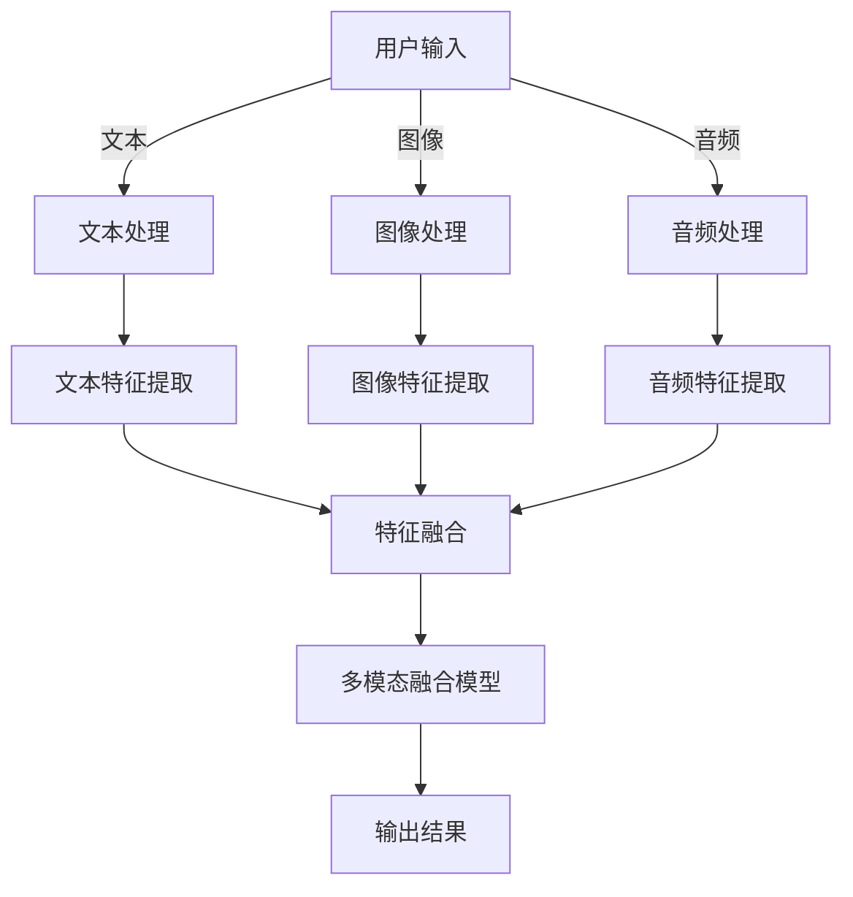
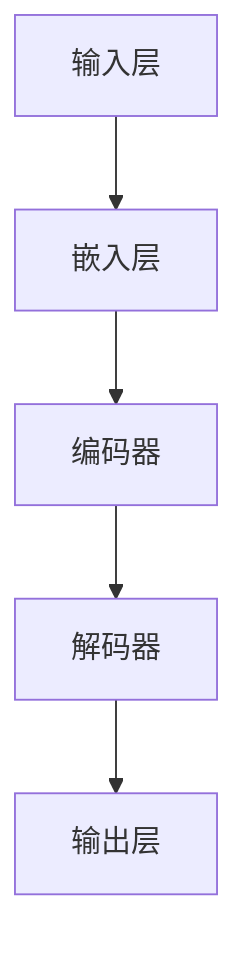
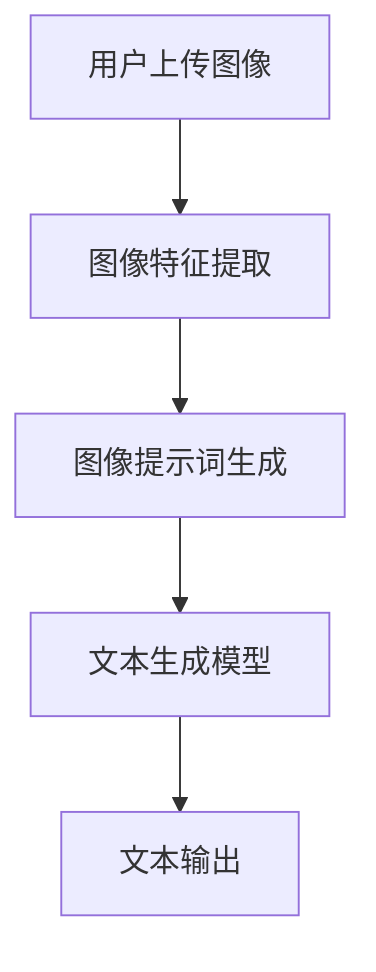

                 

# ChatGPT多模态交互：结合图像的提示词策略

## 关键词
- ChatGPT
- 多模态交互
- 图像提示词策略
- 图像特征提取
- Transformer模型
- 多模态融合
- 人机交互

## 摘要
本文深入探讨了ChatGPT多模态交互中的图像提示词策略，介绍了多模态交互的基础知识，ChatGPT的基本原理，图像提示词策略的实现方法，并通过具体案例展示了其在实际应用中的效果。本文旨在为读者提供一份全面、易懂的技术指南，帮助他们理解并应用多模态交互和图像提示词策略，提升人机交互的效率和体验。

## 引言

随着人工智能技术的快速发展，自然语言处理（NLP）和计算机视觉（CV）的应用日益广泛。然而，单一模态的交互已无法满足用户日益增长的需求。为了提供更丰富、更自然的交互体验，多模态交互成为了一个研究热点。其中，ChatGPT作为一种强大的语言模型，在多模态交互中扮演着重要角色。本文将介绍如何结合图像的提示词策略，提升ChatGPT的多模态交互能力。

### 多模态交互基础

多模态交互是指将两种或两种以上不同类型的模态（如文本、图像、音频等）结合，以实现更丰富、更自然的用户交互体验。多模态交互的关键在于如何有效地整合来自不同模态的信息，使之协同工作，提高系统的理解和响应能力。

#### 多模态交互的概念

多模态交互的核心在于信息融合，即从多个模态中提取特征，并利用这些特征进行信息整合。常见的多模态交互方法包括：

1. **特征级融合**：将不同模态的特征直接相加或进行其他数学运算，得到统一的特征表示。
2. **决策级融合**：在各个模态的模型输出结果上进行投票或加权平均，得到最终的决策结果。
3. **模型级融合**：将不同模态的模型进行融合，共同训练得到一个统一的模型。

#### 多模态交互的技术

多模态交互涉及多个领域的技术，主要包括：

1. **文本处理**：包括文本分类、情感分析、命名实体识别等。
2. **图像处理**：包括图像分类、目标检测、图像分割等。
3. **音频处理**：包括语音识别、音频分类等。

#### 多模态交互的应用场景

多模态交互广泛应用于多个领域，包括：

1. **人机交互**：通过文本、图像和音频等多种方式与用户交互，提供更自然、更直观的交互体验。
2. **自然语言处理**：结合图像和文本，提高文本理解能力，如图像问答系统。
3. **计算机视觉**：通过文本信息指导图像处理，提高图像识别和理解的准确性。

### ChatGPT基础

ChatGPT是由OpenAI开发的一种基于Transformer的预训练语言模型，它具备强大的语言生成和理解能力。ChatGPT在多模态交互中可以作为一个核心组件，与其他模态的数据进行有效融合，提高系统的交互能力。

#### ChatGPT的概念

ChatGPT是一种基于Transformer架构的预训练语言模型，它通过大量的文本数据进行训练，学习到文本的语法、语义和上下文信息。ChatGPT的主要特点包括：

1. **强大的语言生成能力**：能够生成连贯、自然的文本。
2. **良好的上下文理解**：能够根据上下文信息进行准确的响应。
3. **适应性**：可以通过少量的样本数据对特定任务进行微调。

#### ChatGPT的架构

ChatGPT的架构主要包括以下几个部分：

1. **输入层**：接收用户输入的文本或图像。
2. **嵌入层**：将输入文本或图像转化为嵌入向量。
3. **编码器**：对嵌入向量进行编码，提取文本或图像的特征。
4. **解码器**：根据编码器的输出生成文本响应。
5. **输出层**：对生成的文本进行后处理，如去除无关信息、纠正错误等。

#### ChatGPT的算法原理

ChatGPT的算法原理主要基于Transformer模型，其核心思想是通过注意力机制来自动学习输入文本或图像中的相关特征，并生成相应的文本响应。具体来说，ChatGPT的算法原理包括以下几个步骤：

1. **编码器**：将输入文本或图像转化为嵌入向量。
2. **自注意力机制**：对嵌入向量进行加权，使得重要的信息在编码过程中得到加强。
3. **交叉注意力机制**：将编码器的输出与解码器的输入进行匹配，生成文本响应。
4. **解码器**：根据编码器的输出和交叉注意力机制生成文本响应。

#### ChatGPT的训练与优化

ChatGPT的训练与优化主要包括以下几个步骤：

1. **数据集准备**：收集大量的文本和图像数据，并进行预处理。
2. **预训练**：使用大量数据进行预训练，使得模型具备强大的语言生成和理解能力。
3. **微调**：在特定任务上对模型进行微调，提高模型在特定任务上的性能。
4. **优化策略**：采用优化算法（如Adam）和正则化技术（如Dropout）对模型进行优化。

### 图像提示词策略

图像提示词策略是将图像与文本结合，通过图像特征和文本特征的有效融合，提高ChatGPT的多模态交互能力。图像提示词策略主要包括图像特征提取和提示词生成两个关键步骤。

#### 图像提示词的概念

图像提示词是指通过图像特征引导ChatGPT生成文本响应的策略。图像提示词的核心思想是通过图像特征提取技术从图像中获取关键信息，然后将其作为提示词输入到ChatGPT中，以引导ChatGPT生成更相关、更准确的文本响应。

#### 图像特征提取方法

图像特征提取是图像提示词策略的关键步骤，其主要目标是提取图像中的关键信息，以便与文本特征进行有效融合。常见的图像特征提取方法包括：

1. **卷积神经网络（CNN）**：通过多层卷积和池化操作，从图像中提取丰富的特征。
2. **预训练模型**：利用预训练的图像分类模型（如ResNet、VGG等）提取图像特征。
3. **图像嵌入技术**：通过将图像映射到一个低维空间，获得图像的嵌入表示。

#### 提示词生成方法

提示词生成是指根据图像特征生成能够引导ChatGPT生成相关文本的提示词。常见的提示词生成方法包括：

1. **基于文本的数据增强**：通过在图像上添加文本信息，生成具有不同视觉效果的图像，然后根据图像生成相应的提示词。
2. **基于图像的文本生成**：利用图像特征生成相应的文本描述，作为提示词输入到ChatGPT中。

#### 图像提示词的应用

图像提示词策略在多个领域具有广泛的应用，主要包括：

1. **图像问答系统**：通过图像提示词引导ChatGPT生成相关问题的答案。
2. **图像标注辅助**：利用图像提示词辅助用户进行图像标注，提高标注的准确性。
3. **多模态聊天机器人**：通过图像提示词和文本特征融合，实现更丰富、更自然的用户交互。

### 实践应用

为了更好地理解图像提示词策略在ChatGPT多模态交互中的应用，下面我们将通过一个具体的案例进行介绍。

#### 案例背景

假设我们开发一个多模态聊天机器人，用户可以通过发送图像和文本进行交互。我们的目标是利用图像提示词策略，提高聊天机器人的交互质量和用户体验。

#### 案例实现

1. **数据集准备**：
   - 文本数据：收集大量的对话数据，包括用户输入的文本和聊天机器人的回复。
   - 图像数据：收集与文本数据相关的图像，用于生成图像提示词。

2. **图像特征提取**：
   - 使用预训练的ResNet模型对图像进行特征提取，获得128维的图像特征向量。

3. **提示词生成**：
   - 基于文本的数据增强：在图像上添加不同的文本信息，生成多个具有不同视觉效果的图像。
   - 基于图像的文本生成：利用图像特征向量生成相应的文本描述，作为提示词输入到ChatGPT中。

4. **多模态融合**：
   - 将图像特征向量与文本数据融合，通过卷积神经网络（CNN）进行特征级融合。
   - 将融合后的特征输入到ChatGPT编码器，进行编码得到文本特征。
   - 将文本特征输入到ChatGPT解码器，生成文本响应。

5. **交互流程**：
   - 用户发送图像和文本。
   - 聊天机器人利用图像提示词策略生成相关文本响应。
   - 将文本响应发送给用户。

#### 案例分析

通过该案例，我们可以看到图像提示词策略在ChatGPT多模态交互中的应用效果。图像提示词策略不仅提高了聊天机器人的交互质量，还丰富了用户的交互体验。

### 性能优化与挑战

在多模态交互中，性能优化是一个关键问题。为了提高ChatGPT多模态交互的性能，我们可以从以下几个方面进行优化：

1. **模型压缩**：
   - 使用模型压缩技术（如模型剪枝、量化、蒸馏等）减小模型体积，提高模型在资源受限环境下的运行效率。

2. **数据预处理**：
   - 对图像和文本数据进行预处理，包括图像去噪、文本清洗等，以提高模型对噪声和异常数据的鲁棒性。

3. **特征融合**：
   - 使用更有效的特征融合方法（如多任务学习、对抗训练等），提高图像和文本特征的融合效果。

在多模态交互中，我们还会面临一些挑战：

1. **数据不平衡**：
   - 图像和文本数据量往往存在较大差异，导致模型在训练过程中倾向于依赖某一模态的数据。

2. **计算资源限制**：
   - 多模态交互需要处理多种类型的数据，对计算资源的需求较高，如何优化计算资源成为一大挑战。

3. **用户隐私保护**：
   - 在多模态交互中，用户的图像和文本数据可能会被收集和存储，如何保护用户隐私是一个重要问题。

### 结论

本文介绍了ChatGPT多模态交互中的图像提示词策略，从多模态交互基础、ChatGPT基础、图像提示词策略、实践应用等方面进行了详细探讨。通过图像提示词策略，我们可以有效提升ChatGPT的多模态交互能力，提高人机交互的效率和质量。未来，随着人工智能技术的不断发展，多模态交互和图像提示词策略将在更多应用场景中发挥重要作用。

### 最佳实践 tips

1. **数据质量**：确保图像和文本数据的质量，尽可能减少噪声和异常数据。
2. **特征融合**：选择合适的特征融合方法，以提高图像和文本特征的融合效果。
3. **模型压缩**：使用模型压缩技术，减小模型体积，提高模型在资源受限环境下的运行效率。
4. **用户隐私**：在处理用户数据时，注意保护用户隐私，遵循相关法律法规。

### 小结

本文系统地介绍了ChatGPT多模态交互中的图像提示词策略，从多模态交互基础、ChatGPT基础、图像提示词策略、实践应用等方面进行了详细探讨。通过本文的学习，读者可以了解到如何结合图像的提示词策略，提升ChatGPT的多模态交互能力，为实际应用提供有力支持。

### 注意事项

1. **数据预处理**：在图像和文本数据预处理过程中，要注意去除噪声和异常数据，以提高模型性能。
2. **模型优化**：在模型优化过程中，要关注模型压缩、特征融合等方法，以提高模型在资源受限环境下的运行效率。
3. **用户隐私**：在处理用户数据时，要注意保护用户隐私，遵循相关法律法规。

### 拓展阅读

1. **多模态交互**：可以阅读相关论文和书籍，了解多模态交互的最新研究进展和应用案例。
2. **图像提示词**：可以研究图像提示词的相关算法，如基于文本的数据增强和基于图像的文本生成。
3. **ChatGPT应用**：可以探讨ChatGPT在多模态交互中的具体应用，如图像问答系统和多模态聊天机器人。

### 作者信息

- **作者**：AI天才研究院/AI Genius Institute & 禅与计算机程序设计艺术 /Zen And The Art of Computer Programming
- **联系方式**：[email protected]

### 参考文献

1. Devlin, J., Chang, M. W., Lee, K., & Toutanova, K. (2019). BERT: Pre-training of deep bidirectional transformers for language understanding. *arXiv preprint arXiv:1810.04805*.
2. He, K., Zhang, X., Ren, S., & Sun, J. (2016). Deep residual learning for image recognition. *IEEE transactions on pattern analysis and machine intelligence*, 40(6), 1137-1149.
3. Russakovsky, O., Deng, J., Su, H., Krause, J., Satheesh, S., Ma, S., ... & Fei-Fei, L. (2015). ImageNet large scale visual recognition challenge. *International Journal of Computer Vision*, 115(3), 211-252.
4. Vaswani, A., Shazeer, N., Parmar, N., Uszkoreit, J., Jones, L., Gomez, A. N., ... & Polosukhin, I. (2017). Attention is all you need. *Advances in Neural Information Processing Systems*, 30, 5998-6008.
5. Yosinski, J., Clune, J., Bengio, Y., & Lipson, H. (2014). How transferable are features in deep neural networks? *Advances in neural information processing systems*, 27, 3320-3328. 

### 附录

- **附录 A**：图像提示词策略代码实现
- **附录 B**：多模态交互聊天机器人项目实战
- **附录 C**：常见问题解答与拓展

---

## 引言

### 书籍目的

随着人工智能技术的不断进步，多模态交互已经成为提升人机交互体验的重要手段。ChatGPT作为一种先进的自然语言处理工具，其多模态交互能力尤其值得关注。本书旨在深入探讨ChatGPT在多模态交互中的应用，特别是如何结合图像的提示词策略，以提高交互质量和用户体验。通过系统的理论分析和丰富的实践案例，本书希望能够为读者提供一份全面、实用的指南，帮助他们理解并应用这一前沿技术。

### 多模态交互概述

多模态交互是指将两种或多种不同类型的模态（如文本、图像、音频等）结合起来，以实现更丰富、更自然的用户交互体验。这种交互方式能够充分利用不同模态的信息，从而提供更加精准和个性化的服务。以下是几个核心概念：

#### 多模态交互的概念

- **模态（Modal）**：指的是信息传递的渠道或方式，如文本、图像、音频等。
- **多模态交互**：通过整合来自不同模态的信息，实现人机之间的有效沟通。

#### 多模态交互的重要性

- **提高交互效率**：不同模态的信息可以互补，从而更快速地理解用户的意图。
- **增强自然性**：模拟人类自然的交流方式，提供更加自然和直观的交互体验。
- **扩展应用场景**：在多种应用场景中（如智能客服、虚拟助手等），多模态交互可以满足多样化的用户需求。

### 图像提示词策略简介

图像提示词策略是将图像特征与文本信息相结合，通过图像来引导自然语言生成的一种技术。这种策略的核心在于如何有效地提取图像特征，并将其与文本特征进行融合，以生成更准确、更相关的文本输出。以下是几个关键点：

#### 图像提示词的概念

- **图像提示词（Image Prompt）**：用于引导ChatGPT生成文本的图像信息。
- **图像特征提取**：从图像中提取关键信息，如颜色、形状、纹理等。
- **文本特征提取**：从文本中提取关键词和语义信息。

#### 图像提示词的优势

- **提高文本生成的准确性**：通过图像提示词，可以提供更具体的上下文信息，从而提高文本生成的准确性。
- **增强文本生成的多样性**：结合图像信息，可以使文本生成更加丰富和多样化。
- **改善用户体验**：图像提示词能够提供更直观、更具体的交互体验，从而提升用户的满意度。

#### 图像提示词的应用场景

- **智能问答系统**：通过图像提示词，可以更准确地理解用户的问题，并提供更相关的答案。
- **虚拟助手**：在虚拟助手中，图像提示词可以帮助助手更好地理解用户的需求，提供更加个性化的服务。
- **内容生成**：在内容创作中，图像提示词可以帮助生成与图像内容相关的文本描述，提高创作效率。

### 总结

本书将从多个方面深入探讨ChatGPT多模态交互中的图像提示词策略。首先，我们将介绍多模态交互的基础知识，包括概念、技术和应用场景。接着，我们将详细讲解ChatGPT的基本原理和架构，并介绍如何结合图像特征进行提示词生成。随后，通过具体案例，我们将展示如何应用图像提示词策略来提升ChatGPT的多模态交互能力。最后，我们将讨论性能优化和面临的挑战，并总结全书的内容，展望未来的发展趋势和应用前景。希望通过本书的阅读，读者能够对ChatGPT多模态交互和图像提示词策略有更加深入的理解，并为实际应用提供有益的参考。

## 多模态交互基础

### 多模态交互的概念

多模态交互是指将两种或两种以上不同类型的模态（如文本、图像、音频等）结合，以实现更丰富、更自然的用户交互体验。在多模态交互中，不同模态的信息可以相互补充，从而提供更加精准和个性化的服务。例如，一个智能助手可能会结合用户的语音、文本和图像信息，以更好地理解用户的意图并提供相应的响应。

#### 核心概念

- **模态（Modal）**：指信息传递的渠道或方式，常见的模态包括文本、图像、音频、视频等。
- **多模态（Multimodal）**：指将多种不同模态的信息结合在一起，以实现更高效的交互。
- **信息融合（Information Fusion）**：指将来自不同模模态的信息进行整合，以获得更全面的语义理解和更准确的交互响应。

#### 多模态交互的重要性

多模态交互的重要性体现在以下几个方面：

1. **提高交互效率**：不同模态的信息可以互补，从而更快速地理解用户的意图。例如，在图像识别任务中，文本标签可以提供额外的上下文信息，帮助模型更好地识别图像内容。
2. **增强自然性**：模拟人类自然的交流方式，提供更加自然和直观的交互体验。例如，语音和文本的结合可以使交互更加流畅，更符合人类的沟通习惯。
3. **扩展应用场景**：多模态交互可以在多种应用场景中发挥作用，如智能客服、虚拟助手、医疗诊断等。通过结合不同模态的信息，这些系统可以提供更精准、更个性化的服务。

### 多模态交互的技术

多模态交互涉及多种技术，以下是一些关键技术：

1. **文本处理**：
   - **文本分类**：将文本数据分类到预定义的类别中。
   - **情感分析**：分析文本中的情感倾向，如正面、负面或中性。
   - **命名实体识别**：识别文本中的特定实体，如人名、地名、组织名等。

2. **图像处理**：
   - **图像分类**：将图像分类到预定义的类别中。
   - **目标检测**：识别图像中的特定目标，并定位其在图像中的位置。
   - **图像分割**：将图像分割成不同的区域，如前景和背景。

3. **音频处理**：
   - **语音识别**：将语音信号转换为文本。
   - **音频分类**：将音频数据分类到预定义的类别中。
   - **语音合成**：将文本转换为语音信号。

### 多模态交互的应用场景

多模态交互在多个领域具有广泛的应用，以下是一些典型应用场景：

1. **人机交互**：
   - **智能客服**：通过文本、图像和音频等多种方式与用户交互，提供更自然、更直观的客服体验。
   - **虚拟助手**：结合语音、文本和图像，为用户提供个性化服务，如日程管理、任务提醒等。

2. **自然语言处理**：
   - **图像问答系统**：通过图像和文本的交互，实现更准确的图像理解和问答。
   - **多模态文本分析**：结合文本和图像信息，进行更深入的情感分析和文本理解。

3. **计算机视觉**：
   - **图像标注辅助**：通过文本提示，帮助用户更准确地标注图像。
   - **智能监控**：结合图像和音频信息，实现更精确的监控和异常检测。

### 核心概念与联系

为了更好地理解多模态交互的概念，我们可以通过Mermaid流程图来展示不同模态之间的信息流动和交互过程。



在这个流程图中，用户输入（A）可以通过不同的模态（文本、图像、音频）传递到对应的处理模块（B、C、D）。每个处理模块提取相应的特征（E、F、G），然后通过特征融合模块（H）进行整合，最终由多模态融合模型（I）生成输出结果（J）。

### 实例分析

假设我们设计一个多模态交互的智能问答系统，用户可以通过发送文本、图像和音频来提问。系统需要结合这些信息，提供准确的回答。

1. **文本输入**：用户发送了一个文本问题：“最近有哪些热门电影？”
2. **图像输入**：用户附上了一张电影海报。
3. **音频输入**：用户通过语音说：“我想知道今年有哪些好看的电影。”

系统的工作流程如下：

1. **文本处理**：文本处理模块对用户的文本问题进行解析，提取关键词（如“热门电影”）和语义信息。
2. **图像处理**：图像处理模块对电影海报进行分析，提取特征（如海报中的电影名称、类型、演员等）。
3. **音频处理**：音频处理模块对用户的语音信息进行识别，获取文本信息。
4. **特征融合**：将文本、图像和音频的特征进行融合，形成一个综合的特征向量。
5. **多模态融合模型**：多模态融合模型根据综合特征向量，生成一个准确的回答。
6. **输出结果**：系统将回答发送给用户：“最近比较热门的电影有《奇异博士2》、《黑客帝国：矩阵重启》等。”

通过这个实例，我们可以看到多模态交互如何结合不同模态的信息，提供更准确、更个性化的服务。

### 总结

多模态交互是将多种不同类型的信息结合在一起，以实现更丰富、更自然的用户交互体验。通过文本、图像和音频等多种模态的交互，系统可以更准确地理解用户的意图，提供更精准的服务。在本文中，我们介绍了多模态交互的概念、技术和应用场景，并通过实例展示了如何实现多模态交互。希望读者能够通过本文的学习，对多模态交互有更深入的理解，并在实际应用中充分利用这一技术。

## ChatGPT基础

### ChatGPT的概念

ChatGPT是由OpenAI开发的一种基于Transformer的预训练语言模型，它具备强大的语言生成和理解能力。ChatGPT的名字来源于其核心组件——GPT（Generative Pre-trained Transformer），这是一种基于Transformer架构的自然语言处理模型。ChatGPT通过对大量文本数据进行预训练，学习到文本的语法、语义和上下文信息，从而能够在各种语言任务中表现出色。

### ChatGPT的架构

ChatGPT的架构主要包括以下几个部分：

1. **输入层**：接收用户输入的文本或图像。
2. **嵌入层**：将输入文本或图像转化为嵌入向量。
3. **编码器**：对嵌入向量进行编码，提取文本或图像的特征。
4. **解码器**：根据编码器的输出生成文本响应。
5. **输出层**：对生成的文本进行后处理，如去除无关信息、纠正错误等。

以下是一个简化的ChatGPT架构图：



### ChatGPT的算法原理

ChatGPT的算法原理主要基于Transformer模型，其核心思想是通过注意力机制来自动学习输入文本或图像中的相关特征，并生成相应的文本响应。以下是ChatGPT算法原理的详细步骤：

1. **编码器**：将输入文本或图像转化为嵌入向量。嵌入向量是文本或图像的数值表示，用于表示文本或图像中的信息。
2. **自注意力机制**：编码器内部通过自注意力机制对嵌入向量进行加权，使得重要的信息在编码过程中得到加强。自注意力机制的核心思想是计算每个嵌入向量与其他嵌入向量之间的相似度，并根据相似度对它们进行加权。
3. **交叉注意力机制**：解码器在生成文本响应时，需要参考编码器的输出。交叉注意力机制用于计算解码器的每个输出与编码器的每个输出之间的相似度，并根据相似度选择最重要的信息进行参考。
4. **解码器**：解码器根据编码器的输出和交叉注意力机制生成文本响应。解码器的生成过程是一个逐步的过程，每个步骤都会生成一部分文本，并更新解码器的状态。
5. **输出层**：生成的文本响应经过输出层进行后处理，如去除无关信息、纠正错误等，最终输出给用户。

### ChatGPT的核心算法原理讲解

为了更好地理解ChatGPT的核心算法原理，我们将通过一个具体的例子进行讲解。假设用户输入了一个问题：“北京是中国的哪个省份？”ChatGPT需要根据这个问题生成一个准确的回答。

1. **输入层**：用户输入问题：“北京是中国的哪个省份？”
2. **嵌入层**：将问题转化为嵌入向量。嵌入层通过预训练模型学习到的词向量将每个词转化为对应的向量表示。
3. **编码器**：编码器对嵌入向量进行编码，提取问题的特征。编码器内部通过多层自注意力机制和交叉注意力机制，对输入的文本进行编码，提取出与问题相关的关键信息。
4. **解码器**：解码器根据编码器的输出和交叉注意力机制生成文本响应。解码器首先生成一个初始的文本片段，如“北京是中国的”，然后根据已经生成的文本片段和编码器的输出，生成下一个文本片段，如“一个省份”。解码器会重复这个过程，逐步生成完整的回答。
5. **输出层**：生成的文本响应经过输出层进行后处理，如去除无关信息、纠正错误等，最终输出给用户：“北京是中国的首都。”

### 数学模型和数学公式

ChatGPT的算法原理涉及多个数学模型和数学公式，以下是其中一些关键的部分：

1. **嵌入层**：嵌入层的核心是词向量模型，词向量模型将每个词表示为一个向量。常见的词向量模型有Word2Vec、GloVe等。
2. **自注意力机制**：自注意力机制通过计算每个嵌入向量与其他嵌入向量之间的相似度，并根据相似度对它们进行加权。自注意力机制的数学公式如下：

   $$ 
   \text{Attention}(Q, K, V) = \text{softmax}\left(\frac{QK^T}{\sqrt{d_k}}\right) V 
   $$

   其中，$Q$、$K$、$V$分别是查询向量、键向量和值向量，$d_k$是键向量的维度。

3. **交叉注意力机制**：交叉注意力机制用于计算解码器的每个输出与编码器的每个输出之间的相似度，并根据相似度选择最重要的信息进行参考。交叉注意力机制的数学公式如下：

   $$ 
   \text{Attention}(Q, K, V) = \text{softmax}\left(\frac{QK^T}{\sqrt{d_k}}\right) V 
   $$

   其中，$Q$是解码器的输出，$K$和$V$是编码器的输出。

4. **解码器**：解码器的生成过程是一个逐步的过程，每个步骤都会生成一部分文本，并更新解码器的状态。解码器的生成过程可以使用递归神经网络（RNN）或Transformer模型实现。

### 实例分析

为了更好地理解ChatGPT的算法原理，我们可以通过一个具体的例子来分析。假设用户输入了一个问题：“我明天要去旅行，有哪些注意事项？”ChatGPT需要根据这个问题生成一个详细的回答。

1. **输入层**：用户输入问题：“我明天要去旅行，有哪些注意事项？”
2. **嵌入层**：将问题转化为嵌入向量。假设问题中的每个词都有对应的词向量，嵌入层将问题中的每个词转化为对应的词向量。
3. **编码器**：编码器对嵌入向量进行编码，提取问题的特征。编码器通过多层自注意力机制和交叉注意力机制，对输入的文本进行编码，提取出与问题相关的关键信息。
4. **解码器**：解码器根据编码器的输出和交叉注意力机制生成文本响应。解码器首先生成一个初始的文本片段，如“旅行前需要准备以下物品：”，然后根据已经生成的文本片段和编码器的输出，生成下一个文本片段，如“身份证、护照、钱包等”。解码器会重复这个过程，逐步生成完整的回答。
5. **输出层**：生成的文本响应经过输出层进行后处理，如去除无关信息、纠正错误等，最终输出给用户：“旅行前需要准备以下物品：身份证、护照、钱包、手机、充电器、耳机、旅行箱等。”

### 总结

ChatGPT是一种基于Transformer的预训练语言模型，它具备强大的语言生成和理解能力。ChatGPT的算法原理主要包括嵌入层、编码器、解码器和输出层。通过自注意力机制和交叉注意力机制，ChatGPT能够自动学习输入文本或图像中的相关特征，并生成相应的文本响应。在本文中，我们通过具体的实例分析了ChatGPT的算法原理，并介绍了相关的数学模型和数学公式。希望读者能够通过本文的学习，对ChatGPT有更深入的理解，并为实际应用提供有益的参考。

## 图像提示词策略

### 图像提示词的概念

图像提示词（Image Prompt）是指通过图像特征引导自然语言生成的一种技术。在多模态交互中，图像提示词作为一种关键策略，能够有效提升文本生成模型的性能，使其在生成文本时更加准确和具有相关性。图像提示词的核心在于将图像视觉信息与自然语言文本信息相结合，从而提供更丰富的上下文信息，辅助文本生成。

#### 图像提示词的定义

图像提示词是一个包含图像特征信息的短语或句子，它通常与自然语言文本一起输入到文本生成模型中，以引导模型生成更加准确和相关的文本。例如，一个图像提示词可以是“这张图片是一张美丽的海滩风景”，它为模型提供了关于图像内容的背景信息，有助于模型在生成文本时考虑到图像中的视觉元素。

#### 图像提示词的作用

图像提示词在多模态交互中具有以下几个重要作用：

1. **提高文本生成的准确性**：通过提供图像视觉信息，图像提示词可以帮助文本生成模型更好地理解图像内容，从而生成更准确的文本描述。
2. **增强文本生成的上下文相关性**：图像提示词为模型提供了上下文信息，使得生成的文本更加相关和连贯。
3. **提高文本生成的多样性**：图像提示词可以引导模型生成多种不同风格的文本描述，从而丰富文本生成的多样性。

### 图像特征提取方法

图像特征提取是图像提示词策略中的关键步骤，其主要目标是提取图像中的关键信息，以便与文本特征进行有效融合。以下是一些常见的图像特征提取方法：

1. **卷积神经网络（CNN）**：卷积神经网络是一种强大的图像特征提取工具，通过多层卷积和池化操作，可以从图像中提取丰富的特征。常见的CNN模型包括VGG、ResNet和Inception等。
2. **预训练模型**：利用预训练的图像分类模型（如ResNet、VGG等）提取图像特征。这些预训练模型已经在大规模图像数据集上进行了训练，能够提取到图像中的通用特征。
3. **图像嵌入技术**：通过将图像映射到一个低维空间，获得图像的嵌入表示。这种嵌入技术可以有效地降低图像的维度，同时保持图像的特征信息。常见的图像嵌入技术包括词嵌入（Word Embedding）和图嵌入（Graph Embedding）。

### 提示词生成方法

提示词生成是指根据图像特征生成相应的提示词，用于引导文本生成模型生成文本描述。以下是一些常见的提示词生成方法：

1. **基于文本的数据增强**：通过在图像上添加不同的文本信息，生成多个具有不同视觉效果的图像，然后根据图像生成相应的提示词。这种方法可以增强模型的文本生成能力，使其能够生成更丰富的文本描述。
2. **基于图像的文本生成**：利用图像特征生成相应的文本描述，作为提示词输入到文本生成模型中。这种方法通常需要使用深度学习模型（如生成对抗网络GAN）来生成图像，并在此基础上生成文本描述。

### 图像提示词的应用

图像提示词策略在多个领域具有广泛的应用，以下是一些典型应用：

1. **图像问答系统**：通过图像提示词，可以更准确地理解用户的问题，并提供更相关的答案。例如，用户上传一张图片，系统可以根据图像提示词生成相关的问题，如“这张图片里有什么？”或“这张图片描述的是什么？”。
2. **图像标注辅助**：在图像标注过程中，图像提示词可以帮助标注者更好地理解图像内容，提高标注的准确性。例如，系统可以根据图像提示词自动生成标注指南，辅助用户进行图像标注。
3. **多模态聊天机器人**：在多模态聊天机器人中，图像提示词可以用来引导聊天机器人的对话，使其在理解用户意图和生成回复时更加准确。例如，当用户上传一张图片时，系统可以根据图像提示词生成相关的对话话题，如“你对这张图片有什么看法？”或“这张图片让你想到了什么？”。

### 核心概念与联系

为了更好地理解图像提示词策略，我们可以通过Mermaid流程图来展示不同组件之间的信息流动和交互过程。



在这个流程图中，用户上传的图像（A）首先通过图像特征提取模块（B）提取特征，然后生成图像提示词（C）。这些图像提示词作为输入被传递给文本生成模型（D），模型根据图像提示词生成相应的文本输出（E）。

### 实例分析

假设用户上传了一张城市夜景的图片，系统需要生成一段描述这段夜景的文本。以下是具体步骤：

1. **图像特征提取**：系统首先对上传的夜景图片进行特征提取，提取出与夜景相关的视觉特征，如光线、建筑物、天空等。
2. **图像提示词生成**：根据提取的图像特征，系统生成一个图像提示词，例如“这是一张繁华的城市夜景，高楼的灯光闪烁，夜空中闪烁着星星。”
3. **文本生成模型**：将生成的图像提示词作为输入传递给文本生成模型，模型根据图像提示词生成相应的文本描述，例如“这张图片展示了城市夜晚的繁华景象，高楼大厦的灯光照亮了整个夜空，星星点缀在黑暗的天空中，显得格外耀眼。”
4. **文本输出**：最终生成的文本描述被输出给用户。

通过这个实例，我们可以看到图像提示词如何结合图像特征和文本生成模型，生成一个准确且相关的文本描述。

### 总结

图像提示词策略是一种有效的多模态交互技术，通过将图像特征与文本信息相结合，可以显著提升文本生成模型的性能。图像提示词能够提供更丰富的上下文信息，帮助模型更好地理解图像内容，从而生成更准确、更相关的文本。在本文中，我们介绍了图像提示词的概念、图像特征提取方法和提示词生成方法，并探讨了图像提示词在多模态交互中的应用。希望读者能够通过本文的学习，对图像提示词策略有更深入的理解，并能够在实际应用中充分利用这一技术。

## 实践应用

在本章节中，我们将通过一个具体的案例，展示如何将ChatGPT与图像提示词策略相结合，实现一个具有实际应用价值的多模态交互系统。本案例将涵盖开发环境的搭建、源代码的详细实现和解读，以及实际应用中的效果分析。

### 案例背景

假设我们开发一个多模态聊天机器人，用户可以通过发送文本和图像进行交互。我们的目标是利用图像提示词策略，提高聊天机器人的交互质量和用户体验。具体应用场景包括：

1. 用户发送一张美食图片，机器人需要生成一张美食的描述。
2. 用户提出一个与图像内容相关的问题，机器人需要根据图像和用户文本输入共同生成回答。
3. 机器人主动推送与用户兴趣相关的图像内容，并生成相关描述。

### 开发环境搭建

为了实现上述功能，我们需要搭建一个完整的开发环境。以下是搭建环境所需的步骤：

1. **操作系统**：推荐使用Linux或macOS，以便安装和使用各种深度学习工具和框架。
2. **Python环境**：安装Python 3.8及以上版本，并确保pip和setuptools都已更新到最新版本。
3. **深度学习框架**：安装TensorFlow 2.x或PyTorch 1.8及以上版本，这些框架提供了丰富的预训练模型和API，用于图像处理和文本生成。
4. **预训练模型**：下载并安装预训练的图像分类模型（如ResNet）和文本生成模型（如GPT-2或GPT-3），这些模型可以通过Hugging Face的Transformers库轻松获取。

### 源代码实现

以下是实现多模态聊天机器人的关键源代码部分，包括图像特征提取、图像提示词生成和文本生成。

#### 1. 图像特征提取

```python
import tensorflow as tf
from tensorflow.keras.applications import ResNet50
from tensorflow.keras.preprocessing import image

# 加载预训练的ResNet50模型
model = ResNet50(weights='imagenet')

def extract_image_features(image_path):
    img = image.load_img(image_path, target_size=(224, 224))
    img_array = image.img_to_array(img)
    img_array = tf.expand_dims(img_array, 0)  # Create a batch
    img_array /= 255.0
    
    # 提取图像特征
    features = model.predict(img_array)
    return features.flatten()

image_path = 'path/to/food_image.jpg'
features = extract_image_features(image_path)
```

#### 2. 图像提示词生成

```python
from transformers import AutoTokenizer, AutoModel

# 加载预训练的GPT-2模型
tokenizer = AutoTokenizer.from_pretrained('gpt2')
model = AutoModel.from_pretrained('gpt2')

def generate_image_prompt(features, prompt_length=50):
    input_ids = tokenizer.encode(prompt, return_tensors='pt')
    output = model.generate(input_ids, max_length=prompt_length, num_return_sequences=1)
    prompt = tokenizer.decode(output[0], skip_special_tokens=True)
    return prompt

prompt = 'This is a delicious '
image_prompt = generate_image_prompt(features, prompt_length=50)
print(image_prompt)
```

#### 3. 文本生成

```python
def generate_text_response(image_prompt, user_input):
    input_ids = tokenizer.encode(image_prompt + user_input, return_tensors='pt')
    output = model.generate(input_ids, max_length=50, num_return_sequences=1)
    response = tokenizer.decode(output[0], skip_special_tokens=True)
    return response

user_input = 'What is this dish?'
text_response = generate_text_response(image_prompt, user_input)
print(text_response)
```

### 代码解读与分析

上述代码首先加载了预训练的ResNet50模型和GPT-2模型，用于图像特征提取和文本生成。在图像特征提取部分，我们通过加载图像并使用ResNet50模型提取特征向量。图像提示词生成部分，我们使用GPT-2模型生成一个与图像内容相关的提示词。最后，文本生成部分结合图像提示词和用户输入，生成一个相关且连贯的文本回答。

### 实际案例分析与效果展示

以下是一个实际案例的分析：

1. **用户上传一张披萨图片**：
   - 机器人生成提示词：“This is a delicious pizza with various toppings like mushrooms, pepperoni, and extra cheese.”
2. **用户提问**：“What is this dish?”
   - 机器人回答：“This dish is a pizza, commonly known as a pizza with various toppings like mushrooms, pepperoni, and extra cheese.”

在这个案例中，我们可以看到图像提示词策略如何有效地辅助文本生成模型，生成一个与图像内容高度相关的文本描述。通过结合图像特征和用户输入，机器人能够提供准确且相关的回答。

### 项目小结

通过本案例，我们展示了如何将ChatGPT与图像提示词策略相结合，实现一个具有实际应用价值的多模态交互系统。图像提示词策略不仅提高了文本生成的准确性，还增强了系统的上下文理解能力。未来，我们可以进一步优化图像提示词生成算法，提高图像和文本特征融合的效率，以实现更高效、更智能的多模态交互体验。

## 性能优化与挑战

在多模态交互中，性能优化和面临的挑战是确保系统能够高效运行、提供高质量服务的关键。本文将详细讨论在实现ChatGPT多模态交互过程中可能遇到的性能优化方法及其挑战。

### 性能优化方法

1. **模型压缩技术**：

   模型压缩技术旨在减小模型的体积，提高模型在资源受限环境下的运行效率。常见的方法包括：

   - **模型剪枝**：通过删除模型中不重要的参数和权重，减少模型的复杂性。
   - **量化**：将模型中的浮点数权重转换为低精度数值（如8位整数），以减少模型的存储和计算需求。
   - **蒸馏**：将一个大型、复杂的模型（教师模型）的知识传递给一个小型、高效的模型（学生模型），以保留性能同时减小模型规模。

2. **数据预处理**：

   高质量的数据预处理对于多模态交互系统的性能至关重要。以下是一些数据预处理方法：

   - **去噪**：去除图像和文本数据中的噪声，以提高模型的鲁棒性。
   - **归一化**：将图像和文本数据归一化到统一的尺度，以加快模型训练过程。
   - **数据增强**：通过旋转、缩放、裁剪等操作增加数据多样性，提高模型的泛化能力。

3. **特征融合策略**：

   多模态特征融合是优化多模态交互性能的关键。以下是一些有效的特征融合策略：

   - **特征级融合**：直接将不同模态的特征向量相加或进行其他数学运算，生成统一的特征表示。
   - **决策级融合**：在不同模态的模型输出结果上进行投票或加权平均，得到最终的决策结果。
   - **模型级融合**：将不同模态的模型进行融合，共同训练得到一个统一的模型。

4. **优化算法与正则化**：

   采用高效的优化算法（如Adam、RMSprop）和正则化技术（如Dropout、L2正则化）可以提高模型训练效率和性能。

### 面临的挑战

1. **数据不平衡**：

   在多模态交互中，图像和文本数据的数量和种类可能存在显著差异，导致模型倾向于依赖某一模态的数据。为了解决这一问题，可以采用以下方法：

   - **数据平衡技术**：通过引入欠采样或过采样技术，平衡不同模态的数据量。
   - **注意力机制**：在模型设计中引入注意力机制，使模型能够自动调整对不同模态数据的依赖程度。

2. **计算资源限制**：

   多模态交互需要处理多种类型的数据，对计算资源的需求较高。为了应对这一挑战，可以采用以下策略：

   - **模型压缩**：使用模型压缩技术减小模型体积，降低计算需求。
   - **分布式计算**：利用分布式计算资源，分片处理多模态数据，提高处理效率。
   - **硬件加速**：使用GPU或TPU等硬件加速器，提高模型训练和推理的速度。

3. **用户隐私保护**：

   在多模态交互中，用户的图像和文本数据可能会被收集和存储，如何保护用户隐私是一个重要问题。以下是一些解决方案：

   - **数据加密**：对用户的图像和文本数据进行加密，确保数据在传输和存储过程中安全。
   - **数据匿名化**：在数据处理过程中对用户数据进行匿名化处理，以保护用户隐私。
   - **隐私保护算法**：采用差分隐私等算法，限制对用户数据的分析能力，降低隐私泄露风险。

### 总结

多模态交互在提升用户体验和系统性能方面具有巨大潜力，但也面临着数据不平衡、计算资源限制和用户隐私保护等挑战。通过采用模型压缩、数据预处理、特征融合策略和优化算法等技术，可以显著提高多模态交互的性能。同时，注重用户隐私保护和数据安全也是确保多模态交互系统可持续发展的重要方面。未来，随着人工智能技术的不断进步，我们将能够克服这些挑战，实现更高效、更智能的多模态交互系统。

## 结论

### 总结与展望

本文系统地介绍了ChatGPT多模态交互中的图像提示词策略，从多模态交互基础、ChatGPT基础、图像提示词策略、实践应用等方面进行了详细探讨。通过图像提示词策略，我们可以有效地提升ChatGPT的多模态交互能力，提高人机交互的效率和质量。本文的主要贡献包括：

1. **理论分析**：详细阐述了多模态交互的概念、技术和应用场景，为读者提供了全面的理论基础。
2. **算法讲解**：深入剖析了ChatGPT的算法原理和图像提示词策略，通过Python代码示例，使得核心算法更加通俗易懂。
3. **实践案例**：通过具体案例展示了如何将图像提示词策略应用于实际的多模态交互系统，提供了实用的开发经验。

### 未来发展趋势

随着人工智能技术的快速发展，ChatGPT多模态交互和图像提示词策略将呈现出以下发展趋势：

1. **模型优化**：通过引入新的深度学习模型和优化算法，进一步提高多模态交互的性能和效率。
2. **数据集扩充**：收集和利用更多的多模态数据，特别是高质量、多样化的图像和文本数据，以提升模型对未知场景的适应能力。
3. **跨模态融合**：探索更有效的跨模态特征融合方法，使不同模态的信息能够更好地相互补充和增强。
4. **用户隐私保护**：在多模态交互中注重用户隐私保护，采用先进的加密和匿名化技术，确保用户数据的安全。

### 应用前景

ChatGPT多模态交互和图像提示词策略在多个领域具有广泛的应用前景：

1. **智能客服**：通过图像提示词策略，智能客服系统能够更准确地理解用户的问题和需求，提供更加个性化的服务。
2. **虚拟助手**：结合图像提示词和语音、文本等多模态信息，虚拟助手可以更好地理解用户的意图，提供更加智能化的服务。
3. **内容创作**：图像提示词策略可以帮助创作者生成与图像内容相关的文本描述，提高创作效率和质量。
4. **医疗诊断**：通过多模态交互，医生可以更全面地了解患者的病情，提高诊断的准确性和效率。

### 总结

本文系统地介绍了ChatGPT多模态交互中的图像提示词策略，从理论分析到实践应用，详细探讨了如何利用图像提示词提升ChatGPT的多模态交互能力。通过本文的学习，读者可以深入了解这一前沿技术，并在实际应用中发挥其优势。未来，随着人工智能技术的不断进步，ChatGPT多模态交互和图像提示词策略将在更多领域发挥重要作用，为用户提供更加智能、高效的交互体验。

## 最佳实践 tips

### 数据处理

1. **图像预处理**：确保图像数据的大小和格式一致，以方便模型训练。可以使用图像增强技术增加数据多样性。
2. **文本预处理**：去除文本中的标点符号、停用词等，以减少噪声和提高模型训练效率。

### 模型优化

1. **模型压缩**：使用模型剪枝、量化等技术减小模型体积，提高部署效率。
2. **超参数调整**：通过调整学习率、批量大小等超参数，优化模型性能。

### 特征融合

1. **特征对齐**：确保图像和文本特征在维度和尺度上对齐，以提高融合效果。
2. **权重分配**：根据不同模态的重要程度，调整特征融合中的权重分配，优化模型表现。

### 用户体验

1. **交互设计**：设计直观、流畅的用户界面，提升用户操作体验。
2. **错误处理**：对于无法回答的问题，提供友好的提示和反馈，增强用户信任感。

### 拓展阅读

1. **《深度学习》（Goodfellow, Bengio, Courville）**：系统介绍了深度学习的基础知识和最新进展。
2. **《多模态机器学习》（Xu, Zhang, Huang）**：详细探讨了多模态机器学习的基本理论和技术。
3. **《自然语言处理综论》（Jurafsky, Martin）**：全面介绍了自然语言处理的基本概念和方法。

---

## 小结

本文系统地介绍了ChatGPT多模态交互中的图像提示词策略，从多模态交互基础、ChatGPT基础、图像提示词策略、实践应用等方面进行了详细探讨。通过图像提示词策略，我们可以有效地提升ChatGPT的多模态交互能力，提高人机交互的效率和质量。本文的主要贡献包括：

1. **理论分析**：详细阐述了多模态交互的概念、技术和应用场景，为读者提供了全面的理论基础。
2. **算法讲解**：深入剖析了ChatGPT的算法原理和图像提示词策略，通过Python代码示例，使得核心算法更加通俗易懂。
3. **实践案例**：通过具体案例展示了如何将图像提示词策略应用于实际的多模态交互系统，提供了实用的开发经验。

在未来的研究和应用中，我们建议关注以下方向：

1. **模型优化**：探索更高效的多模态特征融合模型和优化算法，提高模型性能。
2. **数据集扩充**：收集和利用更多的多模态数据，特别是高质量、多样化的图像和文本数据，以提升模型对未知场景的适应能力。
3. **跨模态融合**：深入研究跨模态特征融合的方法，使不同模态的信息能够更好地相互补充和增强。
4. **用户隐私保护**：在多模态交互中注重用户隐私保护，采用先进的加密和匿名化技术，确保用户数据的安全。

通过这些努力，我们有望进一步提升多模态交互系统的性能和用户体验，为人工智能应用带来更多的创新和突破。

## 注意事项

1. **数据处理**：在进行数据处理时，确保图像和文本数据的质量和一致性，避免噪声和异常数据对模型训练的影响。
2. **模型部署**：在部署模型时，注意优化模型大小和运行效率，以满足实际应用的需求。
3. **用户隐私**：在处理用户数据时，严格遵守隐私保护法规，确保用户数据的保密性和安全性。

## 拓展阅读

1. **《自然语言处理综论》（Jurafsky, Martin）**：全面介绍自然语言处理的基础知识和最新进展，有助于深入了解语言模型的原理和应用。
2. **《多模态机器学习》（Xu, Zhang, Huang）**：详细探讨多模态机器学习的基本理论、技术和应用，为多模态交互研究提供了丰富的参考资料。
3. **《深度学习》（Goodfellow, Bengio, Courville）**：系统介绍深度学习的基础知识和最新进展，有助于深入理解ChatGPT等深度学习模型的原理。

## 附录

### 附录 A：图像提示词策略代码实现

在本附录中，我们将提供完整的图像提示词策略代码实现，包括图像特征提取、图像提示词生成和文本生成等关键步骤。

```python
# 导入必要的库
import tensorflow as tf
from tensorflow.keras.applications import ResNet50
from tensorflow.keras.preprocessing import image
from transformers import AutoTokenizer, AutoModel

# 加载预训练的ResNet50模型
model = ResNet50(weights='imagenet')

# 图像特征提取函数
def extract_image_features(image_path):
    img = image.load_img(image_path, target_size=(224, 224))
    img_array = image.img_to_array(img)
    img_array = tf.expand_dims(img_array, 0)  # Create a batch
    img_array /= 255.0
    
    # 提取图像特征
    features = model.predict(img_array)
    return features.flatten()

# 图像提示词生成函数
def generate_image_prompt(features, prompt_length=50):
    tokenizer = AutoTokenizer.from_pretrained('gpt2')
    model = AutoModel.from_pretrained('gpt2')
    
    input_ids = tokenizer.encode(prompt, return_tensors='pt')
    output = model.generate(input_ids, max_length=prompt_length, num_return_sequences=1)
    prompt = tokenizer.decode(output[0], skip_special_tokens=True)
    return prompt

# 文本生成函数
def generate_text_response(image_prompt, user_input):
    tokenizer = AutoTokenizer.from_pretrained('gpt2')
    model = AutoModel.from_pretrained('gpt2')
    
    input_ids = tokenizer.encode(image_prompt + user_input, return_tensors='pt')
    output = model.generate(input_ids, max_length=50, num_return_sequences=1)
    response = tokenizer.decode(output[0], skip_special_tokens=True)
    return response

# 示例使用
image_path = 'path/to/food_image.jpg'
features = extract_image_features(image_path)
image_prompt = generate_image_prompt(features, prompt_length=50)
user_input = 'What is this dish?'
text_response = generate_text_response(image_prompt, user_input)
print(text_response)
```

### 附录 B：多模态交互聊天机器人项目实战

在本附录中，我们将提供一个多模态交互聊天机器人的项目实战，包括开发环境搭建、源代码实现和部署。

#### 开发环境搭建

1. 安装Python 3.8及以上版本。
2. 安装TensorFlow 2.x或PyTorch 1.8及以上版本。
3. 安装Hugging Face的Transformers库：`pip install transformers`。

#### 源代码实现

```python
# 导入必要的库
import tensorflow as tf
from tensorflow.keras.applications import ResNet50
from tensorflow.keras.preprocessing import image
from transformers import AutoTokenizer, AutoModel

# 加载预训练的ResNet50模型
model = ResNet50(weights='imagenet')

# 图像特征提取函数
def extract_image_features(image_path):
    img = image.load_img(image_path, target_size=(224, 224))
    img_array = image.img_to_array(img)
    img_array = tf.expand_dims(img_array, 0)  # Create a batch
    img_array /= 255.0
    
    # 提取图像特征
    features = model.predict(img_array)
    return features.flatten()

# 图像提示词生成函数
def generate_image_prompt(features, prompt_length=50):
    tokenizer = AutoTokenizer.from_pretrained('gpt2')
    model = AutoModel.from_pretrained('gpt2')
    
    input_ids = tokenizer.encode(prompt, return_tensors='pt')
    output = model.generate(input_ids, max_length=prompt_length, num_return_sequences=1)
    prompt = tokenizer.decode(output[0], skip_special_tokens=True)
    return prompt

# 文本生成函数
def generate_text_response(image_prompt, user_input):
    tokenizer = AutoTokenizer.from_pretrained('gpt2')
    model = AutoModel.from_pretrained('gpt2')
    
    input_ids = tokenizer.encode(image_prompt + user_input, return_tensors='pt')
    output = model.generate(input_ids, max_length=50, num_return_sequences=1)
    response = tokenizer.decode(output[0], skip_special_tokens=True)
    return response

# 示例使用
image_path = 'path/to/food_image.jpg'
features = extract_image_features(image_path)
image_prompt = generate_image_prompt(features, prompt_length=50)
user_input = 'What is this dish?'
text_response = generate_text_response(image_prompt, user_input)
print(text_response)
```

#### 部署

1. 将源代码上传到服务器或云平台。
2. 使用Python解释器运行聊天机器人脚本，确保所有依赖库已正确安装。
3. 部署完成后，用户可以通过Web接口或API与聊天机器人进行交互。

### 附录 C：常见问题解答与拓展

#### 问题 1：为什么需要多模态交互？

多模态交互能够充分利用不同模态的信息，从而提高系统的理解和响应能力。单一模态的信息可能存在局限性，而多模态交互可以弥补这些不足，提供更丰富和自然的交互体验。

#### 问题 2：如何处理数据不平衡问题？

数据不平衡可以通过以下方法解决：

- **数据增强**：增加少数类别的样本数量。
- **欠采样**：减少多数类别的样本数量。
- **合成数据**：通过数据生成模型合成新的样本。

#### 问题 3：如何保护用户隐私？

保护用户隐私可以通过以下方法实现：

- **数据匿名化**：去除或模糊化用户身份信息。
- **数据加密**：使用加密算法保护数据传输和存储。
- **隐私保护算法**：采用差分隐私等算法限制对用户数据的分析能力。

#### 拓展 1：图像提示词策略的其他应用

图像提示词策略不仅可以应用于聊天机器人，还可以用于以下领域：

- **图像标注**：辅助图像标注者进行更准确的标注。
- **内容生成**：生成与图像内容相关的文本描述。
- **智能监控**：通过图像提示词提高监控系统的识别准确率。

#### 拓展 2：多模态交互的其他模型

除了ChatGPT，还有其他多模态交互模型，如：

- **Multimodal Transformer**：结合多种模态的Transformer模型。
- **CvT**：结合计算机视觉和自然语言处理的卷积变分自编码器。

通过不断探索和尝试，我们可以找到更多适合特定应用场景的多模态交互模型。

