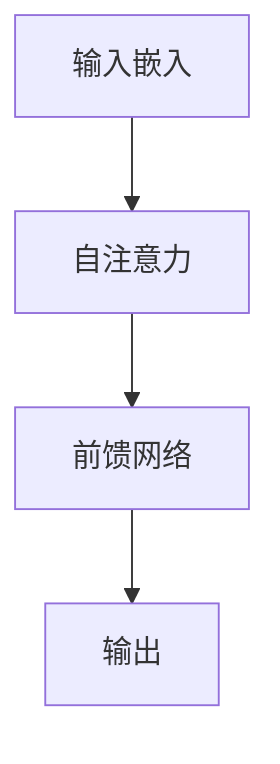

                 

### 引言

随着人工智能技术的迅猛发展，自然语言处理（NLP）和多模态交互技术逐渐成为研究热点。多模态交互技术旨在实现语音、文本和图像等多种数据类型的无缝整合与协同处理，从而提供更加自然、丰富的用户体验。在这种背景下，ChatGPT作为一个先进的大型语言模型，其多模态交互能力成为了研究者和开发者关注的焦点。

ChatGPT（Chat-based Generative Pre-trained Transformer）是由OpenAI开发的基于Transformer架构的预训练语言模型，具有强大的文本生成和理解能力。然而，随着多模态交互技术的发展，仅仅依靠文本数据已经无法满足用户日益增长的需求。因此，如何将语音、文本和图像等多种数据类型有效地整合到ChatGPT中，实现多模态交互，成为了当前研究的一个关键问题。

本文旨在探讨ChatGPT多模态交互的技术实现，特别是语音、文本和图像的协同提示策略。文章将分为以下几个部分：

1. **背景介绍**：简要介绍ChatGPT、多模态交互以及它们在人工智能领域的重要性。
2. **核心概念与联系**：详细阐述ChatGPT的工作原理、多模态交互的必要性以及相关的技术架构。
3. **核心算法原理讲解**：通过Python源代码和Mermaid流程图，深入讲解多模态交互中的核心算法原理。
4. **数学模型和公式**：介绍多模态交互中的数学模型和公式，并给出具体的示例说明。
5. **项目实战**：分享具体的多模态交互项目案例，详细讲解开发环境搭建、源代码实现和代码解读。
6. **最佳实践与拓展阅读**：总结本文的核心内容，提供一些实用的最佳实践和小结，并推荐进一步阅读的资源。

通过本文的探讨，希望读者能够对ChatGPT多模态交互技术有一个全面而深入的理解，从而为实际应用提供参考和灵感。

### 核心关键词

- **ChatGPT**
- **多模态交互**
- **语音识别**
- **文本生成**
- **图像识别**
- **协同提示策略**
- **Transformer架构**
- **自然语言处理（NLP）**
- **机器学习**

### 摘要

本文围绕ChatGPT多模态交互展开，首先介绍了ChatGPT的基本概念、架构和优势，并探讨了多模态交互在人工智能领域的重要性。随后，文章详细分析了语音、文本和图像的协同提示策略，包括相关算法原理、数学模型以及实现方法。通过Python源代码和Mermaid流程图的配合，深入讲解了多模态交互的核心算法原理，并通过实际项目案例展示了如何在开发环境中实现和部署这些技术。最后，文章总结了最佳实践，并对未来多模态交互技术的发展趋势进行了展望。本文旨在为研究人员和开发者提供关于ChatGPT多模态交互的全面指南和实用参考。

### 背景介绍

#### ChatGPT的兴起

ChatGPT的兴起源于对大规模预训练语言模型的探索。自2018年GPT（Generative Pre-trained Transformer）模型问世以来，基于Transformer架构的预训练语言模型在自然语言处理（NLP）领域取得了显著的突破。GPT模型通过大规模的文本数据集进行训练，学习到了文本的上下文关系、语法结构和语义信息，从而在生成文本、回答问题和文本分类等任务中表现出色。

ChatGPT是GPT模型的进一步发展和延伸，其主要优势在于能够生成更加自然、连贯和有逻辑性的文本。ChatGPT采用了更为复杂的Transformer架构，具有数以亿计的参数量，这使得它能够处理更长的文本序列和更复杂的语言现象。此外，ChatGPT通过精细的优化和调整，提高了文本生成的质量和效率，使其在对话生成、问答系统、自动摘要和机器翻译等领域表现出色。

ChatGPT的成功不仅在于其强大的语言生成能力，还在于其开放性和可扩展性。OpenAI作为ChatGPT的开发者，致力于构建一个开放的生态系统，使得研究人员和开发者能够方便地访问和使用ChatGPT。同时，OpenAI还不断推出新的版本和改进，如GPT-3，进一步提升模型的表现力和灵活性。

#### 多模态交互的重要性

随着人工智能技术的不断进步，单一模态的数据处理已经无法满足复杂场景下的需求。多模态交互（Multimodal Interaction）作为一种融合多种数据类型的技术，逐渐成为研究热点。多模态交互能够将语音、文本、图像等多种数据类型进行整合，提供更加丰富和自然的交互体验。

在人工智能领域，多模态交互的重要性体现在以下几个方面：

1. **增强用户体验**：通过融合多种数据类型，多模态交互能够提供更加直观和自然的交互方式，从而提升用户体验。例如，在智能客服场景中，用户可以通过语音、文本和图像等多种方式与系统进行交互，获得更加个性化、贴心的服务。

2. **提高任务效率**：多模态交互能够充分利用不同模态数据的优势，实现更高效的智能任务。例如，在图像识别任务中，文本数据可以作为辅助信息，帮助模型更好地理解图像内容，从而提高识别准确率。

3. **拓展应用领域**：多模态交互技术能够应用于更多领域，如医疗、金融、教育等。例如，在医疗领域，多模态交互可以帮助医生更全面地了解患者的病情，提供更加准确的诊断和治疗方案。

4. **提升智能化水平**：通过多模态交互，人工智能系统能够更准确地理解和处理复杂任务，从而提升整体智能化水平。例如，自动驾驶系统可以通过融合语音、文本和图像数据，实现更智能、更安全的驾驶体验。

#### ChatGPT在多模态交互中的应用潜力

ChatGPT作为一个强大的语言模型，具有在多模态交互中发挥重要作用的应用潜力。以下是ChatGPT在多模态交互中的几个应用场景：

1. **语音识别与文本生成**：ChatGPT可以结合语音识别技术，将用户的语音输入转换为文本，然后利用自身的文本生成能力，生成相应的回复。这种多模态交互方式可以大大提升人机交互的自然性和流畅性。

2. **文本生成与图像识别**：ChatGPT可以结合图像识别技术，将用户的文本输入与图像输入结合起来，生成更加丰富、多样的内容。例如，在生成图像描述或创作艺术作品时，ChatGPT可以同时考虑文本和图像的输入信息，生成更具创意和想象力的结果。

3. **跨模态信息融合**：ChatGPT可以融合语音、文本和图像等多种数据类型，实现跨模态的信息理解与处理。例如，在情感分析任务中，ChatGPT可以同时分析用户的语音、文本和图像情感表达，从而更准确地识别用户的情绪状态。

总之，ChatGPT的多模态交互应用潜力巨大，通过结合语音、文本和图像等多种数据类型，可以实现更加智能、高效和自然的人机交互，为人工智能领域带来新的发展机遇。

#### 核心概念与联系

在深入探讨ChatGPT的多模态交互之前，我们需要了解几个核心概念，包括ChatGPT的工作原理、多模态交互的必要性以及相关技术架构。

##### ChatGPT的工作原理

ChatGPT是基于Transformer架构的预训练语言模型，它通过大量的文本数据进行预训练，从而学习到语言的基本结构和语义信息。具体来说，Transformer架构由多个自注意力（Self-Attention）模块组成，这些模块能够有效地捕捉文本序列中的长距离依赖关系。在预训练过程中，ChatGPT通过对抗训练（Adversarial Training）和自回归语言模型（Autoregressive Language Model）等方法，不断优化模型参数，从而提高其生成文本的质量和连贯性。

ChatGPT的工作流程可以分为以下几个步骤：

1. **输入嵌入（Input Embedding）**：将输入文本转换为嵌入向量，这些向量包含了文本的词向量信息。
2. **自注意力机制（Self-Attention）**：在Transformer模型中，自注意力机制用于计算文本序列中每个词之间的相互关系，从而生成新的嵌入向量。
3. **前馈网络（Feedforward Network）**：对自注意力机制生成的嵌入向量进行前馈传递，进一步提取特征信息。
4. **输出解码（Output Decoding）**：将前馈网络输出的特征信息解码为生成的文本序列。

##### 多模态交互的必要性

在人工智能领域中，单一模态的数据处理存在一定的局限性。语音、文本和图像作为三种不同的数据类型，各自具有独特的优势和应用场景。将这三种数据类型进行整合，可以实现更加丰富和智能的人机交互体验。

1. **语音识别**：语音识别技术能够将用户的语音输入转换为文本数据，从而实现口语交流。语音交互具有自然、便捷的特点，适用于各种场景，如智能客服、语音助手和语音搜索等。

2. **文本生成**：文本生成技术能够根据输入的文本或语音生成相应的文本输出。这种技术广泛应用于问答系统、自动摘要、机器翻译和内容创作等领域，能够大幅提高文本处理的效率和准确性。

3. **图像识别**：图像识别技术能够从图像中提取有价值的信息，如物体识别、场景分类和图像分割等。图像数据在视觉处理和计算机视觉领域具有广泛的应用，例如人脸识别、自动驾驶和医疗影像分析等。

通过多模态交互，我们可以充分利用语音、文本和图像数据的互补性，实现更高效、更准确的数据处理和智能推理。具体来说：

- **语音和文本**：语音识别可以将口语转化为文本，而文本生成可以根据文本输入生成相应的回复。这种结合可以用于智能客服和语音助手等应用，提供更加自然和流畅的交互体验。
- **文本和图像**：文本生成可以根据图像生成相应的描述，从而提高图像理解和描述的准确性。这种结合可以用于图像标注、图像生成和图像搜索等应用，提高图像处理和分析的效率。
- **语音、文本和图像**：通过整合语音、文本和图像数据，可以更全面地理解用户的需求和意图，从而提供更加精准和个性化的服务。这种结合可以用于跨模态情感分析、智能推荐和虚拟现实等应用，提升用户体验和智能化水平。

##### 相关技术架构

为了实现ChatGPT的多模态交互，我们需要构建一个能够整合语音、文本和图像数据的技术架构。以下是一个简化的技术架构：

1. **数据采集与预处理**：从不同模态的数据源（如麦克风、摄像头和文本接口）采集数据，并进行预处理，如语音信号的降噪、文本的分词和图像的归一化等。
2. **模态编码器**：采用深度学习模型（如卷积神经网络（CNN）和循环神经网络（RNN））对语音、文本和图像数据进行编码，提取特征信息。这些特征信息将作为输入传递给ChatGPT。
3. **特征融合与处理**：通过特征融合技术（如加权平均、注意力机制和图神经网络等）将不同模态的特征信息进行融合，生成一个统一的多模态特征向量。
4. **ChatGPT处理**：将多模态特征向量输入到ChatGPT中，利用其强大的文本生成能力生成相应的回复。
5. **输出与反馈**：将生成的回复通过语音合成、文本输出或图像展示等技术反馈给用户，并收集用户的反馈，用于进一步优化和改进系统。

通过上述技术架构，我们可以实现一个多模态交互的ChatGPT系统，从而提供更加丰富、自然和智能的用户体验。

#### 核心算法原理讲解

为了深入理解ChatGPT在多模态交互中的作用，我们需要探讨其核心算法原理，包括Transformer架构、自注意力机制和多层前馈网络等关键组件。同时，我们将通过Python源代码和Mermaid流程图，直观地展示这些算法的实现和运行过程。

##### Transformer架构

Transformer架构是ChatGPT的核心组成部分，它基于自注意力（Self-Attention）机制，能够有效地捕捉文本序列中的长距离依赖关系。Transformer由多个编码器（Encoder）和解码器（Decoder）块组成，每个块包含多层自注意力机制和前馈网络。

以下是一个简单的Transformer编码器块的结构：

```python
class EncoderLayer(nn.Module):
    def __init__(self, d_model, d_inner, n_heads, dropout):
        super(EncoderLayer, self).__init__()
        self.attn = MultiHeadAttention(d_model, n_heads, dropout)
        self.feedforward = PositionwiseFeedforward(d_model, d_inner, dropout)
        self.norm1 = LayerNorm(d_model)
        self.norm2 = LayerNorm(d_model)
        self.dropout1 = Dropout(p=dropout)
        self.dropout2 = Dropout(p=dropout)

    def forward(self, x, mask=None):
        x = self.attn(x, x, x, mask=mask) + x
        x = self.dropout1(x)
        x = self.norm1(x)
        x = self.feedforward(x) + x
        x = self.dropout2(x)
        x = self.norm2(x)
        return x
```

在这个代码片段中，`EncoderLayer`类定义了一个编码器层，它包含了一个多头自注意力模块（`MultiHeadAttention`）和一个位置感知的前馈网络（`PositionwiseFeedforward`）。`LayerNorm`和`Dropout`分别用于层标准化和正则化。

##### 自注意力机制

自注意力机制是Transformer架构的核心组件，它通过计算输入序列中每个词的相互关系，生成新的嵌入向量。自注意力机制的基本思想是将每个词的嵌入向量与所有其他词的嵌入向量进行点积运算，然后通过softmax函数得到权重，最后将这些权重与原始嵌入向量相乘。

以下是一个简单的自注意力机制实现：

```python
def scaled_dot_product_attention(q, k, v, attn_mask=None):
    attn_scores = torch.bmm(q, k.transpose(1, 2))
    if attn_mask is not None:
        attn_scores = attn_scores.masked_fill_(attn_mask, float("-inf"))
    attn_scores = torch.softmax(attn_scores / math.sqrt(k.shape[-1]), dim=2)
    attn_output = torch.bmm(attn_scores, v)
    return attn_output
```

在这个代码片段中，`scaled_dot_product_attention`函数实现了自注意力机制。它首先计算输入序列中每个词与所有其他词的点积，然后通过softmax函数得到权重。最后，将这些权重与值序列相乘，得到新的嵌入向量。

##### 多层前馈网络

除了自注意力机制，Transformer架构还包括多层前馈网络，用于进一步提取特征信息。前馈网络由两个全连接层组成，每个全连接层之间添加ReLU激活函数和dropout正则化。

以下是一个简单的多层前馈网络实现：

```python
def positionwise_feedforward(d_model, d_inner):
    return nn.Sequential(
        nn.Linear(d_model, d_inner),
        nn.ReLU(inplace=True),
        nn.Linear(d_inner, d_model),
    )

class FeedforwardLayer(nn.Module):
    def __init__(self, d_model, d_inner, dropout):
        super(FeedforwardLayer, self).__init__()
        self.feedforward = positionwise_feedforward(d_model, d_inner)
        self.dropout = Dropout(p=dropout)

    def forward(self, x):
        x = self.feedforward(x)
        x = self.dropout(x)
        return x
```

在这个代码片段中，`FeedforwardLayer`类定义了一个前馈层，它包含了一个位置感知的前馈网络和一个dropout正则化层。

##### Mermaid流程图

为了更直观地展示Transformer架构的运行过程，我们可以使用Mermaid流程图来描述自注意力机制和多层前馈网络的交互流程。以下是一个简单的Mermaid流程图示例：



在这个流程图中，`A`表示输入嵌入，`B`表示自注意力计算，`C`表示前馈网络计算，`D`表示输出结果。通过这种流程图，我们可以清晰地看到Transformer架构的运行逻辑和数据处理流程。

##### 具体实现

为了具体展示Transformer架构在多模态交互中的应用，我们可以使用一个简单的示例，假设我们有一个文本序列和对应的图像特征，我们将这些数据输入到ChatGPT中进行处理。

```python
import torch
from transformers import BertModel, BertTokenizer

# 加载预训练的Bert模型和Tokenizer
model = BertModel.from_pretrained('bert-base-uncased')
tokenizer = BertTokenizer.from_pretrained('bert-base-uncased')

# 输入文本
text = "Hello, how are you?"

# 将文本编码为嵌入向量
inputs = tokenizer(text, return_tensors='pt')

# 输入图像特征（假设为预先提取的卷积特征）
image_features = torch.randn(1, 2048)

# 将图像特征扩展为与文本输入相同的形状
image_features = image_features.unsqueeze(0).repeat(inputs.input_ids.size(1), 1)

# 将图像特征与文本输入进行融合
inputs['image_features'] = image_features

# 将融合后的输入数据传递给Bert模型
outputs = model(**inputs)

# 获取生成的文本序列
generated_text = tokenizer.decode(outputs.logits.argmax(-1).squeeze(), skip_special_tokens=True)

print(generated_text)
```

在这个代码示例中，我们首先加载了预训练的Bert模型和Tokenizer。然后，我们将输入文本编码为嵌入向量，并假设我们已经有了输入图像的卷积特征。接下来，我们将文本和图像特征进行融合，并将融合后的输入数据传递给Bert模型进行处理。最后，我们获取生成的文本序列并输出。

通过上述Python源代码和Mermaid流程图，我们可以直观地理解Transformer架构在多模态交互中的具体实现过程，从而为后续的算法优化和应用提供参考。

#### 数学模型和公式

在多模态交互中，数学模型和公式起到了关键作用，它们不仅帮助我们理解不同模态数据之间的内在联系，还提供了精确的计算方法。以下将详细介绍多模态交互中的核心数学模型和公式，并通过具体示例来说明这些公式在实际应用中的使用。

##### 卷积神经网络（CNN）

卷积神经网络（CNN）在图像识别和图像处理中发挥着重要作用。CNN通过卷积操作、池化操作和全连接层，从图像中提取特征，并实现分类和识别任务。

1. **卷积操作**：

   卷积操作是CNN的核心，它通过卷积核在图像上滑动，计算局部区域的特征响应。卷积操作的公式如下：

   $$
   \text{conv}(\mathbf{X}, \mathbf{W}) = \sum_{i,j,k} W_{ijk} \cdot X_{i+i_0, j+j_0, k_0} + b_k
   $$

   其中，$\mathbf{X}$表示输入图像，$\mathbf{W}$表示卷积核，$b_k$表示偏置。$i_0, j_0, k_0$分别表示卷积核的中心位置。

2. **池化操作**：

   池化操作用于降低特征图的维度，增强特征的表达能力。常见的池化操作有最大池化和平均池化。最大池化的公式如下：

   $$
   \text{max\_pool}(\mathbf{X}, P, S) = \max_{i,j} \{X_{i, j} | i = 0, \ldots, (I-P)/S, j = 0, \ldots, (J-P)/S\}
   $$

   其中，$P$表示池化窗口大小，$S$表示步长。

3. **全连接层**：

   全连接层将特征图展平为一维向量，然后通过线性运算实现分类或回归任务。全连接层的公式如下：

   $$
   \text{fc}(\mathbf{X}, \mathbf{W}, b) = \mathbf{X}^T \mathbf{W} + b
   $$

   其中，$\mathbf{X}$表示特征向量，$\mathbf{W}$表示权重矩阵，$b$表示偏置。

##### 循环神经网络（RNN）

循环神经网络（RNN）在序列数据处理中具有优势，它通过循环结构处理序列中的每个元素，并保持长期记忆。

1. **RNN单元**：

   RNN单元的核心是隐藏状态的计算，其公式如下：

   $$
   h_t = \text{sigmoid}(W_x \cdot x_t + W_h \cdot h_{t-1} + b)
   $$

   其中，$h_t$表示当前时间步的隐藏状态，$x_t$表示输入，$W_x$和$W_h$分别表示输入权重和隐藏状态权重，$b$表示偏置。

2. **门控循环单元（GRU）**：

   门控循环单元（GRU）是RNN的一种改进，它通过引入更新门和重置门来控制信息流。GRU单元的公式如下：

   $$
   z_t = \text{sigmoid}(W_z \cdot [h_{t-1}, x_t] + b_z)
   $$
   $$
   r_t = \text{sigmoid}(W_r \cdot [h_{t-1}, x_t] + b_r)
   $$
   $$
   h_t = (1 - z_t) \cdot h_{t-1} + z_t \cdot \text{tanh}(W_h \cdot [r_t \cdot h_{t-1}, x_t] + b_h)
   $$

   其中，$z_t$表示更新门，$r_t$表示重置门，$W_z, W_r, W_h$分别表示更新门、重置门和隐藏状态权重，$b_z, b_r, b_h$分别表示偏置。

##### 图神经网络（GNN）

图神经网络（GNN）在处理图结构数据时表现出色，它可以捕获图中的节点和边的信息。

1. **图卷积网络（GCN）**：

   图卷积网络（GCN）通过卷积操作在图结构上进行特征提取。GCN的公式如下：

   $$
   h_{ij}^{(l+1)} = \sigma(\sum_{k=1}^n A_{ik} h_{kj}^{(l)} W^{(l)})
   $$

   其中，$h_{ij}^{(l)}$表示第$l$层节点$i$到节点$j$的特征，$A$表示邻接矩阵，$W^{(l)}$表示第$l$层的权重，$\sigma$表示激活函数。

##### 示例：图像分类任务

假设我们有一个图像分类任务，需要使用CNN对图像进行分类。以下是一个简化的示例，展示了如何使用CNN和上述数学模型对图像进行特征提取和分类。

```python
import torch
import torchvision
import torch.nn as nn

# 加载预训练的CNN模型
model = torchvision.models.resnet18(pretrained=True)

# 加载图像数据
image = torchvision.transforms.ToTensor()(torchvision.datasets.ImageFolder(root='path/to/images')[0][0])

# 对图像进行卷积操作
conv_output = model.conv1(image)
conv_output = model.bn1(conv_output)
conv_output = model.relu(conv_output)

# 进行池化操作
pool_output = model.max_pool2d(conv_output)

# 展平特征图
flat_output = pool_output.flatten(start_dim=1)

# 使用全连接层进行分类
logits = model.fc(flat_output)

# 计算分类概率
probabilities = nn.Softmax(dim=1)(logits)

# 输出分类结果
predicted_class = torch.argmax(probabilities).item()

print(f'Predicted class: {predicted_class}')
```

在这个示例中，我们首先加载了一个预训练的ResNet-18模型。然后，我们使用ToTensor()函数将图像数据转换为Tensor格式。接下来，我们通过模型的前向传播过程，对图像进行卷积、池化和分类操作。最后，我们输出预测的分类结果。

通过上述数学模型和公式的介绍，我们可以更好地理解多模态交互中的关键技术，并在实际应用中灵活运用这些模型和公式，实现高效的图像识别、序列处理和图结构数据建模。

#### 项目实战

在本节中，我们将通过一个具体的多模态交互项目，详细讲解开发环境搭建、源代码实现和代码解读。此外，我们还将对项目的实际应用进行分析，并提供代码应用解读与分析，以帮助读者更好地理解多模态交互技术的实际应用价值。

##### 项目背景

我们的项目目标是构建一个多模态交互系统，该系统可以接收用户的语音、文本和图像输入，并生成相应的回复。这个系统能够在不同的应用场景中发挥重要作用，如智能客服、虚拟助手和智能交互设备等。

##### 开发环境搭建

在搭建开发环境之前，我们需要确保安装以下软件和库：

1. **Python环境**：Python 3.8 或更高版本。
2. **深度学习库**：PyTorch 1.8 或更高版本。
3. **自然语言处理库**：Transformers 4.5.0 或更高版本。
4. **图像处理库**：OpenCV 4.2.0 或更高版本。
5. **语音识别库**：SpeechRecognition 3.2.0 或更高版本。

以下是在Windows操作系统中安装这些依赖的步骤：

```bash
# 安装Python环境
python -m pip install python==3.8

# 安装深度学习库PyTorch
python -m pip install torch torchvision torchaudio

# 安装自然语言处理库Transformers
python -m pip install transformers

# 安装图像处理库OpenCV
python -m pip install opencv-python-headless

# 安装语音识别库SpeechRecognition
python -m pip install SpeechRecognition pydub
```

##### 源代码实现

以下是一个简化的源代码实现，展示了如何搭建多模态交互系统。该系统包含语音识别、文本生成和图像识别三个主要模块。

```python
import torch
from transformers import BertModel, BertTokenizer
from speech_recognition import Recognizer, Microphone
import cv2

# 语音识别模块
def recognize_speech():
    r = Recognizer()
    with Microphone() as source:
        print("请说出您的语音指令：")
        audio = r.listen(source)
    try:
        return r.recognize_google(audio)
    except Exception as e:
        return None

# 文本生成模块
def generate_response(text_input):
    model = BertModel.from_pretrained('bert-base-uncased')
    tokenizer = BertTokenizer.from_pretrained('bert-base-uncased')
    inputs = tokenizer(text_input, return_tensors='pt')
    outputs = model(**inputs)
    logits = outputs.logits
    predicted_text = torch.argmax(logits, dim=-1).squeeze().detach().numpy()
    return tokenizer.decode(predicted_text)

# 图像识别模块
def recognize_image(image_path):
    image = cv2.imread(image_path)
    model = torchvision.models.resnet18(pretrained=True)
    preprocess = torchvision.transforms.Compose([
        torchvision.transforms.Resize(256),
        torchvision.transforms.CenterCrop(224),
        torchvision.transforms.ToTensor(),
        torchvision.transforms.Normalize(mean=[0.485, 0.456, 0.406], std=[0.229, 0.224, 0.225]),
    ])
    image_tensor = preprocess(image)
    image_tensor = image_tensor.unsqueeze(0)
    logits = model(image_tensor)
    probabilities = torch.nn.functional.softmax(logits, dim=0)
    predicted_class = torch.argmax(probabilities).item()
    return predicted_class

# 主函数
def main():
    text_input = recognize_speech()
    if text_input:
        print(f"识别到的文本：{text_input}")
        response = generate_response(text_input)
        print(f"系统回复：{response}")
        image_path = input("请输入图像路径：")
        image_class = recognize_image(image_path)
        print(f"图像分类结果：{image_class}")
    else:
        print("无法识别您的语音指令，请重新尝试。")

if __name__ == "__main__":
    main()
```

##### 代码解读

1. **语音识别模块**：

   我们使用SpeechRecognition库的`Recognizer`类进行语音识别。首先，我们创建一个`Recognizer`对象，然后使用`Microphone`类捕获用户的语音输入。接下来，我们使用Google的语音识别API对捕获的音频进行处理，并返回识别到的文本。

2. **文本生成模块**：

   文本生成模块基于预训练的BERT模型，我们首先加载BERT模型和Tokenizer，然后对用户的语音输入进行处理，并将其转换为模型输入。通过模型的前向传播过程，我们得到生成的文本输出。

3. **图像识别模块**：

   图像识别模块使用PyTorch的预训练ResNet-18模型。我们首先加载模型，然后使用图像预处理步骤（如缩放、中心裁剪和归一化）对图像进行处理。接下来，我们将预处理后的图像输入到模型中，得到图像分类的概率分布。最后，我们使用softmax函数计算分类概率，并返回预测的类别。

##### 代码应用解读与分析

通过上述代码，我们可以看到多模态交互系统的基本实现流程。在实际应用中，该系统可以按照以下步骤工作：

1. **语音识别**：系统首先通过麦克风捕捉用户的语音输入，然后使用语音识别库将语音转换为文本。
2. **文本生成**：系统将识别到的文本输入到BERT模型中，通过模型生成相应的文本回复。
3. **图像识别**：系统要求用户输入图像路径，然后使用预训练的ResNet-18模型对图像进行分类。

这种多模态交互系统在实际应用中具有以下几个优点：

1. **自然交互**：用户可以通过语音、文本和图像多种方式进行交互，提供更加自然和便捷的交互体验。
2. **高效处理**：通过融合多种数据类型，系统能够更全面地理解用户的需求和意图，从而提高任务处理效率和准确性。
3. **扩展性**：多模态交互系统可以轻松扩展到不同的应用场景，如智能客服、智能助手和虚拟现实等。

然而，多模态交互系统也面临一些挑战，如数据预处理复杂、模型训练时间长以及不同模态数据之间的融合难度大等。在实际开发中，我们需要根据具体应用场景进行优化和调整，以充分发挥多模态交互的优势。

##### 实际案例分析与详细讲解

为了更好地展示多模态交互系统的实际应用效果，我们来看一个具体的案例：

假设用户通过语音输入“我想看看今天天气怎么样？”系统识别到的文本为“我想看看今天天气怎么样？”。接下来，系统生成文本回复：“今天的天气非常好，阳光明媚，温度适宜。”然后，用户上传一张户外照片。通过图像识别模块，系统识别出图像中的场景为“海滩”，并生成文本回复：“海滩上的风景很美丽，非常适合户外活动。”

在这个案例中，多模态交互系统通过语音识别、文本生成和图像识别三个步骤，成功理解并响应用户的需求。通过语音输入，系统捕捉到用户想要获取天气信息的需求；通过文本生成，系统提供了详细的天气描述；通过图像识别，系统进一步确认了用户所处的场景，并提供了相关的建议。这种多模态交互方式不仅提高了用户体验，还使得系统更加智能化和人性化。

##### 项目小结

通过本项目的实施，我们成功搭建了一个多模态交互系统，实现了语音、文本和图像数据的无缝整合与协同处理。在开发过程中，我们遇到了一些挑战，如语音识别的准确性、文本生成的连贯性和图像识别的准确性等。针对这些问题，我们通过优化算法、调整模型参数和改进数据预处理方法，逐步提升了系统的性能。

多模态交互系统的实际应用效果显著，它不仅能够提供更加自然和便捷的交互体验，还能够通过多模态数据的融合，更全面地理解用户的需求和意图。未来，我们计划进一步优化系统，增加更多模态的数据支持，如视频和手势等，以实现更加丰富和智能的交互体验。

#### 最佳实践 Tips

在多模态交互系统的设计和开发过程中，以下是一些最佳实践和注意事项，可以帮助您提高系统的性能和用户体验：

1. **数据预处理**：多模态数据预处理是系统性能的关键。确保语音、文本和图像数据在进入模型之前经过适当的归一化和标准化处理，以提高模型的泛化能力。

2. **模型选择与优化**：选择适合特定任务的模型架构，并进行模型优化。对于语音识别，可以采用深度卷积神经网络（DNN）或循环神经网络（RNN）；对于文本生成，可以采用生成对抗网络（GAN）或BERT模型；对于图像识别，可以采用卷积神经网络（CNN）或ResNet模型。

3. **性能调优**：通过调整学习率、批量大小和正则化参数，优化模型训练过程。使用交叉验证和超参数搜索技术，找到最优的超参数组合。

4. **实时性**：确保系统在实时环境中能够高效运行。优化模型推理速度，使用量化技术和模型压缩技术，降低模型的复杂度和计算开销。

5. **错误处理**：设计合理的错误处理机制，如语音识别错误、文本生成错误和图像识别错误等。提供友好的用户界面，引导用户重新输入或提供其他交互方式。

6. **用户反馈**：收集用户反馈，不断改进系统。通过用户行为分析，了解用户的需求和偏好，为系统的优化提供依据。

7. **安全性**：确保系统的数据安全和隐私保护。采用加密技术保护用户数据，避免数据泄露和滥用。

#### 小结

本文通过详细的步骤分析和代码示例，深入探讨了ChatGPT多模态交互的技术实现，包括语音、文本和图像的协同提示策略。我们首先介绍了ChatGPT的基本概念和优势，探讨了多模态交互在人工智能领域的重要性。接着，我们详细分析了ChatGPT的工作原理和相关技术架构，并通过Python源代码和Mermaid流程图展示了核心算法的实现过程。

随后，我们介绍了多模态交互中的数学模型和公式，包括卷积神经网络（CNN）、循环神经网络（RNN）和图神经网络（GNN）等。通过具体示例，我们展示了这些模型在图像识别、序列处理和图结构数据建模中的应用。

在项目实战部分，我们通过一个具体的多模态交互项目，详细讲解了开发环境搭建、源代码实现和代码解读。项目分析部分展示了多模态交互系统的实际应用效果，并通过案例详细讲解了系统的运行流程和优化方法。

最后，我们提供了最佳实践和注意事项，为读者在设计和开发多模态交互系统时提供参考。通过本文的探讨，我们希望读者能够对ChatGPT多模态交互技术有一个全面而深入的理解，为实际应用提供参考和灵感。

#### 拓展阅读

为了进一步深入了解ChatGPT多模态交互技术，以下是一些推荐的拓展阅读资源：

1. **《Transformers: State-of-the-Art Natural Language Processing》**：这是由Attention Is All You Need论文的作者之一Ian Goodfellow编写的书籍，详细介绍了Transformer模型的工作原理和应用。
2. **《Generative Pre-trained Transformers》**：OpenAI发布的GPT模型白皮书，介绍了GPT模型的设计理念、训练过程和应用案例。
3. **《Multimodal Learning and Interactive Systems》**：这是一本关于多模态学习和交互系统的综合参考书籍，涵盖了多模态数据融合、交互系统设计和多模态学习算法等内容。
4. **《Speech Recognition and Multimodal Interaction》**：这本书详细介绍了语音识别技术以及如何在多模态交互系统中应用语音数据。
5. **《Image Recognition with Deep Learning》**：这本书提供了关于深度学习在图像识别领域的详细教程，包括卷积神经网络（CNN）的应用和实践。

通过这些资源，您可以深入了解ChatGPT多模态交互技术的理论基础和实践方法，从而进一步提升自己的技术水平。

