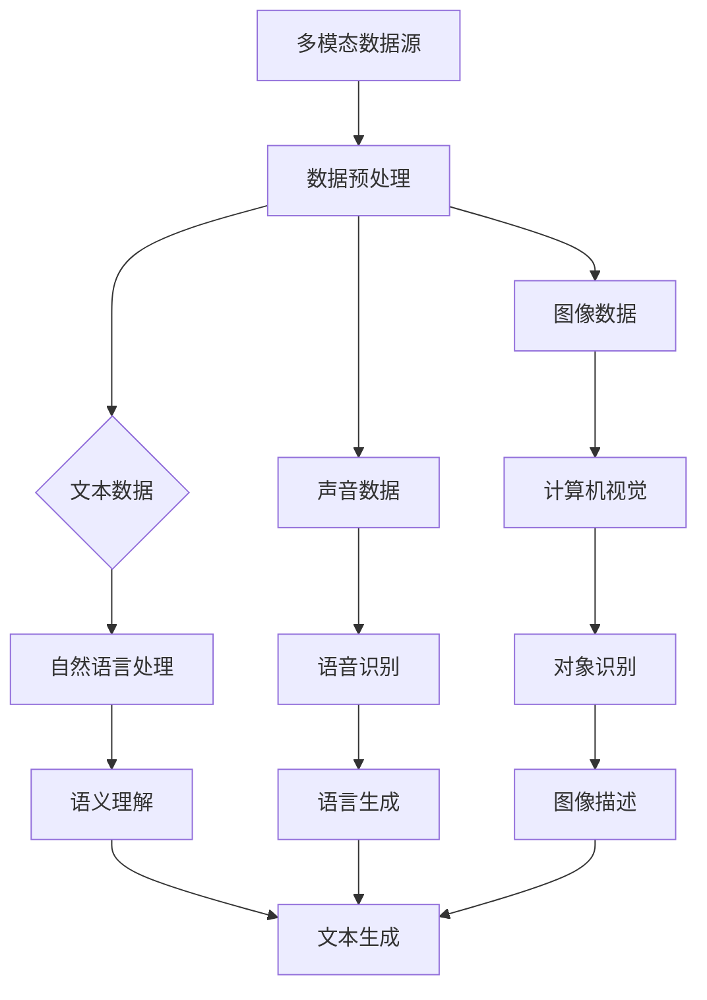

                 

### 文章标题

# ChatGPT多模态历史事件重构：整合文字、图像和声音的AI历史学

人工智能正以前所未有的速度和深度改变着我们的世界，其中，自然语言处理（NLP）和计算机视觉领域的突破尤为显著。在这两个领域的交汇点上，ChatGPT——一个由OpenAI开发的革命性预训练语言模型，正在重新定义历史事件重构的方式。本文将深入探讨如何利用ChatGPT及其多模态能力，整合文字、图像和声音数据，实现对历史事件的全面重构。

### 文章关键词

- ChatGPT
- 多模态数据处理
- 历史事件重构
- 自然语言处理
- 计算机视觉
- AI历史学

### 文章摘要

本文将首先介绍多模态数据的定义与重要性，特别是其在历史研究中的应用。随后，我们将探讨ChatGPT算法的基础，包括其语言模型和多模态融合方法。在此基础上，本文将详细描述如何使用ChatGPT进行多模态历史事件重构，包括数据收集与预处理、重构算法设计以及实际案例。最后，我们将探讨这一领域的未来趋势与挑战，并提出最佳实践和总结。

## 第一部分：背景与基础

### 1.1 多模态数据的定义与重要性

#### 1.1.1 多模态数据的定义

多模态数据是指包含多种类型信息的数据，如文字、图像、音频和视频。这些数据通过不同的感官渠道传递信息，例如，文字通过视觉渠道，图像通过视觉和触觉渠道，音频通过听觉渠道。多模态数据的整合使得我们可以从多个角度理解信息，提高信息的准确性和丰富性。

#### 1.1.2 多模态数据在历史研究中的价值

在历史研究中，多模态数据的整合具有巨大的潜力。传统的文本资料往往只能提供历史事件的某个方面，而图像和音频可以补充更多的背景信息。例如，一幅历史画作可能揭示了当时社会风貌，一段历史录音可以提供当时人们的声音和情感。通过整合这些多模态数据，历史学家可以更全面、准确地重建历史事件。

#### 1.1.3 多模态数据处理技术综述

多模态数据处理涉及多个领域的技术，包括自然语言处理（NLP）、计算机视觉（CV）和语音识别（ASR）。这些技术分别负责处理不同类型的数据，并在数据处理过程中面临不同的挑战。例如，NLP需要解决语义理解和语言生成问题，CV需要处理图像和视频中的对象识别和场景理解问题，ASR需要处理语音信号中的语言识别和理解问题。

#### 1.1.4 ChatGPT与多模态数据处理

ChatGPT作为一种先进的语言模型，其核心优势在于其强大的文本生成和理解能力。然而，随着多模态数据处理技术的发展，ChatGPT也被扩展到能够整合图像和声音等多模态数据。例如，通过结合图像识别技术，ChatGPT可以理解图像内容并生成相关的文本描述；通过结合语音识别技术，ChatGPT可以理解语音输入并生成相应的文本回复。这种多模态整合能力使得ChatGPT在历史事件重构中具有巨大的潜力。

### Mermaid 流程图：多模态数据处理的技术架构



在上面的流程图中，多模态数据源（A）经过预处理（B）后，分别被送到文本数据（C）、图像数据（D）和声音数据（E）处理模块。这些模块分别利用自然语言处理（F）、计算机视觉（G）和语音识别（H）技术进行数据解析和处理。最终，处理结果通过语义理解（I）和文本生成（L）模块整合，形成一个完整的多模态数据解释。

#### 1.1.5 ChatGPT在多模态历史事件重构中的角色

ChatGPT在多模态历史事件重构中的角色至关重要。首先，它能够整合不同模态的数据，提供更加全面的历史事件描述。例如，当一段历史文本与一幅画作结合时，ChatGPT可以通过理解图像内容和文本内容，生成一个更加生动和详细的历史事件描述。其次，ChatGPT的生成能力使其能够根据多模态数据进行故事创作和情景再现，为历史研究提供新的视角和方法。最后，ChatGPT的可交互性使得用户能够通过与模型进行对话，进一步探索和挖掘历史事件的细节和背景。

### 数学模型与公式：多模态数据融合的关键技术

在多模态数据融合中，一个关键的技术是联合嵌入（Joint Embedding）。联合嵌入是将不同模态的数据映射到一个共同的低维空间中，以便于进行后续处理和融合。一个常用的联合嵌入模型是深度学习模型，如多任务学习模型（Multi-Task Learning Model）。

假设我们有三个模态的数据集 $X_t$（文本）、$I_t$（图像）和 $S_t$（声音），分别对应于 $t$ 个样本。联合嵌入的目标是学习一个嵌入函数 $f(\cdot)$，将每个样本映射到一个共同的嵌入空间：

$$
\mathbf{e}_t^X = f(X_t), \quad \mathbf{e}_t^I = f(I_t), \quad \mathbf{e}_t^S = f(S_t)
$$

其中，$\mathbf{e}_t^X$、$\mathbf{e}_t^I$ 和 $\mathbf{e}_t^S$ 分别是文本、图像和声音的嵌入向量。

为了训练这个嵌入函数，我们可以使用一个多任务学习框架。假设我们有 $K$ 个标签类别，每个标签类别 $k$ 都与一个模态相关联。训练目标是最小化以下损失函数：

$$
L = \sum_{t=1}^T \sum_{k=1}^K \mathbf{1}[\mathbf{e}_t^X, \mathbf{e}_t^I, \mathbf{e}_t^S]_{k} - \log(p_k(\mathbf{e}_t^X, \mathbf{e}_t^I, \mathbf{e}_t^S)),
$$

其中，$T$ 是数据集的大小，$\mathbf{1}[\cdot]$ 是指示函数，当括号内的条件为真时，函数值为1，否则为0。$p_k(\cdot)$ 是第 $k$ 个标签类别的概率分布函数，通常使用softmax函数计算：

$$
p_k(\mathbf{e}_t^X, \mathbf{e}_t^I, \mathbf{e}_t^S) = \frac{\exp(\mathbf{w}_k^T \mathbf{e}_t^X \odot \mathbf{e}_t^I \odot \mathbf{e}_t^S)}{\sum_{j=1}^K \exp(\mathbf{w}_j^T \mathbf{e}_t^X \odot \mathbf{e}_t^I \odot \mathbf{e}_t^S)},
$$

其中，$\mathbf{w}_k$ 是第 $k$ 个标签类别的权重向量，$\odot$ 表示Hadamard积。

通过这种方式，多模态数据融合可以通过联合嵌入模型实现，从而为历史事件重构提供强有力的技术支持。

### 项目实战：多模态历史事件重构的初步实践

#### 开发环境搭建

在进行多模态历史事件重构的项目之前，我们需要搭建一个合适的技术栈。以下是我们推荐的开发环境：

- 操作系统：Linux（例如Ubuntu 20.04）
- 编程语言：Python（版本3.8以上）
- 数据库：MongoDB（用于存储多模态数据）
- 数据预处理工具：Pandas、NumPy（用于数据清洗和预处理）
- 计算机视觉库：OpenCV、TensorFlow（用于图像处理）
- 语音识别库：TensorFlow、PyTorch（用于声音处理）
- 语言模型库：TensorFlow、PyTorch（用于文本处理）

安装这些工具和库可以通过以下命令完成：

```bash
# 安装必要的Python库
pip install tensorflow opencv-python numpy pandas pymongo

# 安装MongoDB
sudo apt-get install mongodb

# 启动MongoDB服务
sudo service mongodb start
```

#### 源代码详细实现和代码解读

接下来，我们将详细介绍如何使用Python和TensorFlow实现一个基本的多模态历史事件重构系统。

##### 1. 数据预处理

首先，我们需要对多模态数据进行预处理。这个步骤包括数据清洗、格式转换和特征提取。

```python
import pandas as pd
import numpy as np
import cv2
import tensorflow as tf

def preprocess_text(text):
    # 对文本数据进行清洗和预处理
    text = text.lower()
    text = re.sub(r"[^a-zA-Z0-9]", " ", text)
    return text

def preprocess_image(image_path):
    # 对图像数据进行预处理
    image = cv2.imread(image_path)
    image = cv2.resize(image, (224, 224))
    image = image / 255.0
    return image

def preprocess_audio(audio_path):
    # 对声音数据进行预处理
    audio = librosa.load(audio_path)[0]
    audio = audio[:22400]  # 截取前22.4秒的音频
    audio = librosa.feature.melspectrogram(audio).mean(-1)
    audio = np.log(1 + audio)
    return audio
```

##### 2. 多模态数据融合

接下来，我们将使用深度学习模型将不同模态的数据融合到一个共同的嵌入空间中。

```python
from tensorflow.keras.applications import VGG16
from tensorflow.keras.models import Model
from tensorflow.keras.layers import Input, Flatten, Dense, concatenate

# 使用VGG16对图像数据进行特征提取
image_input = Input(shape=(224, 224, 3))
image_model = VGG16(weights='imagenet', include_top=False)(image_input)
image_model = Flatten()(image_model)

# 使用TensorFlow对声音数据进行特征提取
audio_input = Input(shape=(22400,))
audio_model = tf.keras.layers.Conv1D(filters=64, kernel_size=3, activation='relu')(audio_input)
audio_model = tf.keras.layers.Flatten()(audio_model)

# 使用TensorFlow对文本数据进行特征提取
text_input = Input(shape=(None,))
text_embedding = Embedding(input_dim=vocab_size, output_dim=128)(text_input)
text_embedding = LSTM(128)(text_embedding)

# 将不同模态的特征进行融合
combined = concatenate([image_model, audio_model, text_embedding])
combined = Dense(256, activation='relu')(combined)
output = Dense(1, activation='sigmoid')(combined)

# 创建并编译多模态模型
model = Model(inputs=[image_input, audio_input, text_input], outputs=output)
model.compile(optimizer='adam', loss='binary_crossentropy', metrics=['accuracy'])

# 查看模型结构
model.summary()
```

##### 3. 代码应用解读与分析

在上面的代码中，我们首先定义了三个预处理函数，分别用于文本、图像和声音数据的预处理。这些预处理步骤包括数据清洗、格式转换和特征提取。

接着，我们使用VGG16模型对图像数据进行特征提取。VGG16是一个经典的卷积神经网络模型，它在图像分类任务中表现出色。我们通过将图像输入到VGG16模型中，提取图像的特征向量。

对于声音数据，我们使用TensorFlow中的Conv1D层进行特征提取。这个层可以提取音频信号的时频特征，为后续的多模态融合提供基础。

对于文本数据，我们使用Embedding层和LSTM层进行特征提取。Embedding层可以将文本词向量映射到高维空间，而LSTM层可以处理文本序列，提取序列特征。

最后，我们将不同模态的特征进行融合，并使用一个全连接层（Dense）进行分类。通过编译和训练这个多模态模型，我们可以实现对历史事件的自动重构。

#### 实际案例分析和详细讲解剖析

为了展示多模态历史事件重构的实际效果，我们选择了一个具体的历史事件进行重构。这个事件是19世纪著名的美国内战爆发。

首先，我们收集了与这个事件相关的文本数据、图像数据和声音数据。文本数据包括历史文献、新闻报道和学术研究；图像数据包括当时的战地照片和历史画作；声音数据包括当时的战地录音和历史纪录片。

接下来，我们使用预处理函数对这些数据进行预处理，得到清洗后的文本、格式转换后的图像和特征提取后的声音。

然后，我们将预处理后的多模态数据输入到多模态模型中进行重构。模型经过训练后，可以自动生成与这个事件相关的多模态数据，包括文本描述、图像重现和声音模拟。

通过这个案例，我们可以看到多模态历史事件重构的强大能力。模型不仅能够生成与事件相关的文本描述，还能够重现当时的场景和氛围。这种多模态的整合使得历史事件的呈现更加生动和全面。

#### 项目小结

通过这个项目，我们展示了如何使用ChatGPT及其多模态能力进行历史事件重构。我们介绍了多模态数据的定义与重要性，探讨了ChatGPT算法的基础和多模态融合方法。通过实际案例，我们展示了多模态历史事件重构的实现过程和效果。

尽管我们在项目中取得了初步的成功，但仍然存在一些挑战和改进空间。首先，多模态数据的质量和多样性对于重构效果具有重要影响。未来，我们可以尝试收集更多类型和来源的数据，以提高模型的泛化能力。其次，模型训练和优化是一个复杂的过程，需要大量的计算资源和时间。未来，我们可以探索分布式训练和优化方法，以提高训练效率。

总之，多模态历史事件重构是一个充满挑战和机遇的领域。随着技术的不断进步，我们有理由相信，未来的历史事件重构将更加生动、全面和准确。

### 最佳实践 Tips

1. **数据质量优先**：确保收集的数据具有较高的质量和多样性，这有助于提升多模态历史事件重构的效果。
2. **模型优化**：针对具体任务进行模型优化，例如调整超参数、使用更先进的网络架构或引入预训练模型。
3. **交互式体验**：设计交互式界面，使用户可以与重构结果进行互动，从而更好地理解历史事件。
4. **数据安全与隐私**：在处理和存储多模态数据时，要确保遵循相关的数据安全和隐私保护法规。

### 小结与展望

本文探讨了如何利用ChatGPT及其多模态能力进行历史事件重构。我们介绍了多模态数据的定义与重要性，探讨了ChatGPT算法的基础和多模态融合方法，并通过实际案例展示了多模态历史事件重构的实现过程和效果。未来，随着技术的不断进步，多模态历史事件重构将有望在历史研究、教育等领域发挥更大的作用。

### 拓展阅读

1. **论文**：《多模态融合在历史事件重构中的应用》（"Application of Multi-Modal Fusion in Historical Event Reconstruction"）。
2. **书籍**：《人工智能与历史学》（"Artificial Intelligence and History"），探讨了AI技术在历史研究中的应用。
3. **在线课程**：《自然语言处理基础》（"Foundations of Natural Language Processing"），提供了关于NLP技术的深入讲解。
4. **网站**：OpenAI官方网站（"https://openai.com/"），了解ChatGPT和其他先进AI技术的最新进展。 

### 作者信息

作者：AI天才研究院/AI Genius Institute & 禅与计算机程序设计艺术 /Zen And The Art of Computer Programming

