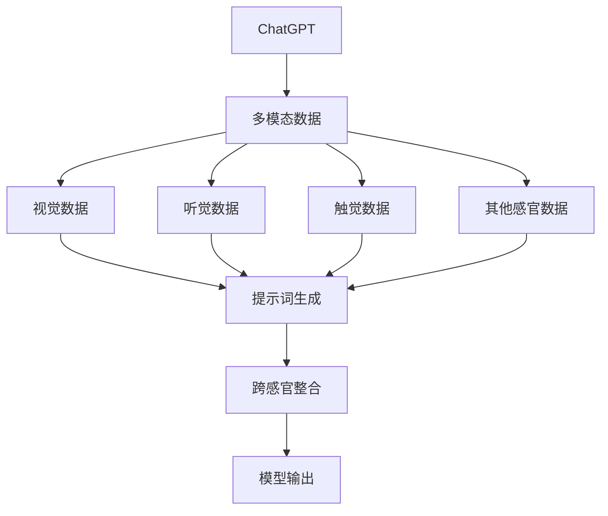
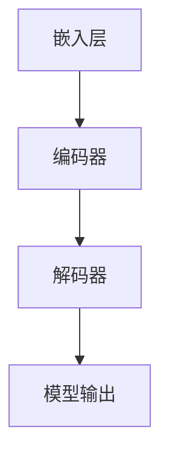
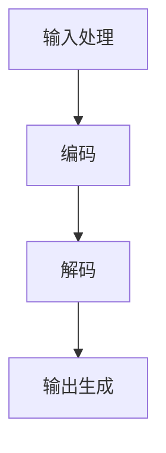
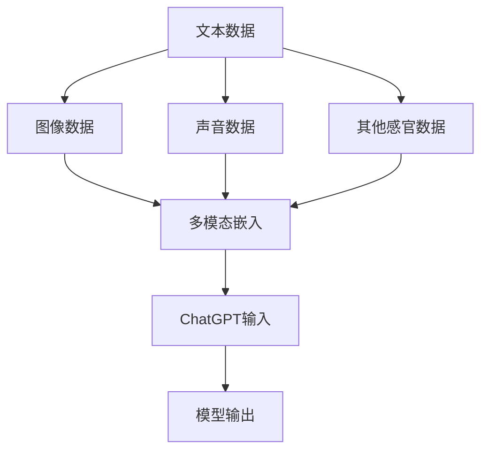
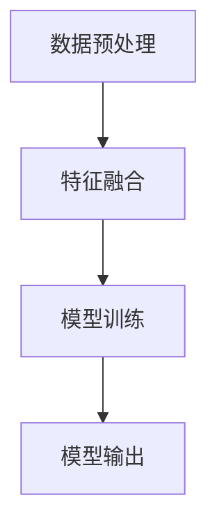

                 

### 第1章 引言

#### 1.1 书籍背景

在当今信息化时代，人工智能技术正以前所未有的速度发展，特别是在自然语言处理（NLP）领域。ChatGPT作为OpenAI推出的强大语言模型，已经在多个领域展示了其卓越的性能。然而，随着多模态技术的发展，单纯依赖文本数据已无法满足用户的需求。为了实现更加智能化、人性化的交互，跨感官整合成为当前研究的热点。本章节旨在介绍ChatGPT、多模态、提示词和跨感官整合等核心概念，为后续章节的深入探讨奠定基础。

#### 1.2 核心概念

##### 1.2.1 ChatGPT

ChatGPT（Chat-based Generative Pre-trained Transformer）是由OpenAI开发的基于Transformer架构的预训练语言模型。它通过大量的文本数据进行训练，能够生成连贯、自然的文本，并具备一定的上下文理解能力。ChatGPT广泛应用于问答系统、聊天机器人、文本生成等领域。

##### 1.2.2 多模态

多模态（Multimodal）是指同时处理和整合多种类型的数据，如文本、图像、声音、触觉等。多模态技术能够提高系统的感知能力和交互能力，使得机器能够更好地理解和响应人类的需求。在人工智能领域，多模态技术的发展为构建更加智能、个性化的系统提供了新的思路。

##### 1.2.3 提示词

提示词（Prompt）是在自然语言处理任务中，提供给模型的一些指导性信息，帮助模型更好地理解和生成文本。在ChatGPT中，提示词的作用尤为重要，它能够引导模型生成更加准确、有用的回答。

##### 1.2.4 跨感官整合

跨感官整合（Cross-modal Integration）是指将来自不同感官的数据进行整合和处理，以实现更加智能的交互。在ChatGPT多模态应用中，跨感官整合能够帮助模型更好地理解和处理用户的需求，从而提供更加自然、流畅的交互体验。

#### 1.3 Mermaid流程图：ChatGPT与多模态提示词关系

以下是一个简单的Mermaid流程图，展示了ChatGPT与多模态提示词之间的关系：



#### 总结

本章介绍了ChatGPT、多模态、提示词和跨感官整合等核心概念，并使用Mermaid流程图展示了它们之间的联系。在接下来的章节中，我们将深入探讨ChatGPT模型的工作原理，多模态数据的处理方法，以及如何设计有效的多模态提示词和实现跨感官整合。

### 第2章 ChatGPT模型概述

ChatGPT是由OpenAI开发的基于Transformer架构的预训练语言模型，其在自然语言处理领域取得了显著的成果。本章节将详细探讨ChatGPT的工作原理、模型架构及其在多模态数据处理中的应用。

#### 2.1 ChatGPT基本原理

ChatGPT的核心思想是通过大量的文本数据进行预训练，使模型具备强大的语言理解和生成能力。预训练过程中，模型学习到了语言的普遍规律和结构，从而能够根据输入的文本生成连贯、自然的回答。

ChatGPT的工作流程主要包括两个阶段：预训练和微调。

1. **预训练**：在预训练阶段，模型通过阅读大量的文本数据，学习语言的模式和规律。这个过程可以理解为模型在“读书”，从而提高对语言的掌握程度。
   
2. **微调**：在预训练的基础上，模型可以根据特定的任务进行微调，以适应具体的场景和应用。例如，在构建一个问答系统时，可以将问答对数据输入模型，使其能够根据问题生成准确的答案。

#### 2.2 ChatGPT模型架构

ChatGPT模型采用Transformer架构，这是一种基于自注意力机制的深度神经网络模型。Transformer模型在处理序列数据时表现出色，特别是在长文本的生成任务中。

ChatGPT模型的主要组成部分包括：

1. **嵌入层**：将输入的文本数据转换为向量表示。
2. **编码器**：通过多层自注意力机制对输入数据进行编码，生成上下文表示。
3. **解码器**：根据编码器的输出，生成目标文本的预测。

以下是一个简化的ChatGPT模型架构图：



#### 2.3 ChatGPT工作流程

ChatGPT的工作流程可以概括为以下几个步骤：

1. **输入处理**：将输入的文本数据转换为向量表示，输入到编码器中。
2. **编码**：编码器通过多层自注意力机制对输入数据进行编码，生成上下文表示。
3. **解码**：解码器根据编码器的输出，生成目标文本的预测。
4. **输出生成**：将生成的文本输出，形成最终的回答。

以下是一个简化的ChatGPT工作流程图：



#### 2.4 ChatGPT在多模态数据处理中的应用

ChatGPT不仅可以处理文本数据，还可以结合多模态数据，如图像、声音等，以提供更加丰富的交互体验。在多模态数据处理中，ChatGPT通常与其他感官数据进行整合，以实现跨感官交互。

以下是一个简化的ChatGPT多模态数据处理流程：



在多模态数据处理中，ChatGPT可以通过以下方式进行改进：

1. **多模态嵌入**：将不同类型的感官数据转换为统一的向量表示，便于后续处理。
2. **联合编码**：将多模态数据联合输入到编码器中，以学习不同感官数据之间的关联性。
3. **多模态解码**：在解码阶段，考虑多模态数据的影响，生成更加丰富的文本输出。

#### 总结

ChatGPT是一种基于Transformer架构的预训练语言模型，具有强大的文本生成和理解能力。通过预训练和微调，ChatGPT可以应用于各种自然语言处理任务。在多模态数据处理中，ChatGPT可以与其他感官数据结合，提供更加丰富的交互体验。在接下来的章节中，我们将探讨多模态数据的处理方法，以及如何设计有效的多模态提示词。

### 第3章 多模态数据介绍

多模态数据是指同时处理和整合多种类型的数据，如文本、图像、声音、触觉等。在人工智能领域，多模态技术的发展为构建更加智能、个性化的系统提供了新的思路。本章将详细介绍多模态数据的获取和处理方法，以及不同类型的感官数据。

#### 3.1 视觉数据获取

视觉数据获取是指通过摄像头、手机或其他传感器捕获图像或视频数据。在人工智能应用中，视觉数据广泛应用于图像识别、目标检测、视频分析等领域。

常见的视觉数据获取方法包括：

1. **图像捕获**：使用摄像头或手机拍摄静态图像。
2. **视频捕获**：使用摄像头或手机录制视频。
3. **图像增强**：通过图像预处理技术，提高图像质量，增强特征。

视觉数据获取的关键技术包括：

1. **图像传感器**：用于捕获图像的光学元件，如CMOS传感器、CCD传感器等。
2. **图像预处理**：对捕获的图像进行预处理，如滤波、缩放、对比度增强等。

以下是一个简单的Python代码示例，用于捕获并显示摄像头图像：

```python
import cv2

# 打开摄像头
cap = cv2.VideoCapture(0)

while True:
    # 读取摄像头帧
    ret, frame = cap.read()
    
    if not ret:
        break
    
    # 显示图像
    cv2.imshow('Camera', frame)
    
    if cv2.waitKey(1) & 0xFF == ord('q'):
        break

# 释放摄像头资源
cap.release()
cv2.destroyAllWindows()
```

#### 3.2 听觉数据获取

听觉数据获取是指通过麦克风或其他传感器捕获声音数据。在人工智能应用中，听觉数据广泛应用于语音识别、语音合成、音乐生成等领域。

常见的听觉数据获取方法包括：

1. **语音捕获**：使用麦克风捕获语音信号。
2. **音频播放**：使用扬声器或耳机播放音频。
3. **音频处理**：对捕获的音频信号进行预处理，如去噪、增强等。

听觉数据获取的关键技术包括：

1. **麦克风**：用于捕获声音信号的传感器，如电容式麦克风、驻极体麦克风等。
2. **音频预处理**：对捕获的音频信号进行预处理，以提高音质和减少噪声。

以下是一个简单的Python代码示例，用于捕获并播放麦克风声音：

```python
import sounddevice as sd
import numpy as np

# 设置音频参数
fs = 44100  # 采样频率
duration = 5  # 捕获时间（秒）
n_frames = fs * duration  # 捕获帧数

# 捕获麦克风声音
audio = sd.rec(n_frames, samplerate=fs, channels=2)
sd.wait()

# 播放捕获的声音
sd.play(audio, fs)

# 等待播放结束
sd.wait()
```

#### 3.3 触觉数据获取

触觉数据获取是指通过传感器或设备捕获触觉信息，如压力、温度、位置等。在人工智能应用中，触觉数据广泛应用于虚拟现实、机器人控制、智能穿戴等领域。

常见的触觉数据获取方法包括：

1. **压力传感器**：用于检测压力大小的传感器，如电容式传感器、电阻式传感器等。
2. **温度传感器**：用于检测温度的传感器，如热电偶、热敏电阻等。
3. **位置传感器**：用于检测位置信息的传感器，如陀螺仪、加速度计等。

触觉数据获取的关键技术包括：

1. **传感器接口**：用于连接传感器和控制器的接口，如I2C、SPI等。
2. **传感器驱动**：用于驱动传感器的软件，如驱动程序、库函数等。

以下是一个简单的Python代码示例，用于读取加速度传感器数据：

```python
import smbus2

# 创建I2C总线对象
bus = smbus2.SMBus(1)

# 加速度传感器地址
address = 0x68

# 读取加速度传感器数据
def read_accelerometer():
    # 读取加速度传感器数据
    data = bus.read_i2c_block_data(address, 0x3B, 6)
    
    # 解析加速度传感器数据
    x = ((data[1] << 8) | data[0])
    y = ((data[3] << 8) | data[2])
    z = ((data[5] << 8) | data[4])
    
    return x, y, z

# 主程序
while True:
    x, y, z = read_accelerometer()
    print(f"x: {x}, y: {y}, z: {z}")
    
    # 等待一段时间
    time.sleep(0.1)
```

#### 3.4 其他感官数据获取

除了视觉、听觉和触觉数据外，还有许多其他类型的感官数据，如味觉、嗅觉、温度等。这些感官数据在人工智能应用中相对较少，但也在逐渐得到关注。

1. **味觉数据获取**：通过味觉传感器或化学传感器捕获食物的味觉信息。
2. **嗅觉数据获取**：通过嗅觉传感器或电子鼻捕获气味信息。
3. **温度数据获取**：通过温度传感器捕获环境温度或物体温度。

随着技术的发展，这些感官数据的获取和处理方法将不断改进，为人工智能应用提供更加丰富的数据支持。

#### 总结

多模态数据是指同时处理和整合多种类型的数据，如文本、图像、声音、触觉等。本章介绍了视觉数据获取、听觉数据获取和触觉数据获取的方法，以及不同类型的感官数据。在多模态数据处理中，这些感官数据可以通过多种方式结合，为人工智能应用提供更加丰富的交互体验。在下一章中，我们将探讨如何设计有效的多模态提示词，以提高ChatGPT的性能。

### 第4章 多模态提示词设计原则

在多模态数据处理中，提示词设计是一个关键环节，它直接影响模型的性能和交互效果。本章节将介绍多模态提示词的设计原则、生成方法以及评估方法。

#### 4.1 提示词设计原则

##### 4.1.1 精确性

精确性是指提示词应准确反映用户的需求和期望，避免产生误导或模糊的指示。精确的提示词有助于模型更好地理解和生成相关的内容。

##### 4.1.2 清晰性

清晰性是指提示词应简洁明了，避免使用复杂的词汇和结构，以便模型能够更容易地理解和执行。

##### 4.1.3 完整性

完整性是指提示词应包含所有必要的信息，确保模型能够生成完整、连贯的回答。

##### 4.1.4 灵活性

灵活性是指提示词应具有一定的泛化能力，能够适应不同的场景和需求，从而提高模型的泛化性能。

##### 4.1.5 适应性

适应性是指提示词应能够根据不同的用户需求和应用场景进行动态调整，以提高模型的交互效果。

#### 4.2 提示词生成方法

##### 4.2.1 文本生成

文本生成是最常见的提示词生成方法，通过自然语言生成技术，如规则生成、模板生成、自动摘要等，生成用于引导模型回答的文本。

1. **规则生成**：基于预定义的规则，自动生成提示词。这种方法简单高效，但灵活性较低。
2. **模板生成**：基于预定义的模板，将具体信息填入模板中生成提示词。这种方法具有较好的灵活性，但需要大量模板。
3. **自动摘要**：通过阅读大量文本，自动提取关键信息生成提示词。这种方法生成提示词具有较高的准确性和灵活性。

##### 4.2.2 数据驱动生成

数据驱动生成方法是基于已有的数据和模型，自动生成提示词。这种方法可以通过机器学习技术，如序列标注、文本分类、序列生成等，实现提示词的自动生成。

1. **序列标注**：对已有的对话数据标注标签，通过训练模型，自动生成提示词。
2. **文本分类**：对已有的对话数据分类，通过训练模型，自动生成用于分类的提示词。
3. **序列生成**：通过生成模型，如递归神经网络（RNN）、长短时记忆网络（LSTM）、变换器（Transformer）等，自动生成提示词。

##### 4.2.3 用户反馈生成

用户反馈生成方法是基于用户的反馈，动态调整和优化提示词。这种方法可以通过在线学习、反馈调整等技术，实现提示词的持续优化。

1. **在线学习**：在用户使用过程中，实时学习用户的反馈，动态调整提示词。
2. **反馈调整**：根据用户反馈，对现有的提示词进行调整和优化。

#### 4.3 提示词评估方法

提示词评估是衡量提示词设计效果的重要步骤。以下是一些常见的提示词评估方法：

##### 4.3.1 自动评估

自动评估方法是通过算法自动评估提示词的性能，如准确率、召回率、F1值等。这种方法通常用于大规模数据集上的评估。

1. **准确率**：提示词生成的回答与用户期望回答匹配的比例。
2. **召回率**：提示词生成的回答中包含用户期望回答的比例。
3. **F1值**：准确率和召回率的调和平均值，用于平衡准确率和召回率。

##### 4.3.2 人评

人评方法是通过人工评估提示词的性能，如清晰度、准确度、用户满意度等。这种方法可以更准确地反映提示词的实际效果，但成本较高。

1. **清晰度**：提示词是否简洁明了，易于理解。
2. **准确度**：提示词生成的回答是否准确，符合用户期望。
3. **用户满意度**：用户对提示词的满意程度。

##### 4.3.3 组合评估

组合评估方法是将自动评估和人评相结合，综合评估提示词的性能。这种方法可以充分利用自动评估的效率和准确性，以及人评的细致和全面性。

#### 总结

多模态提示词设计是提高多模态数据处理效果的关键环节。本章介绍了多模态提示词的设计原则、生成方法以及评估方法。通过合理的提示词设计，可以提高模型的性能和交互效果，为用户提供更好的体验。在下一章中，我们将探讨如何实现跨感官整合，以进一步提升多模态处理能力。

### 第5章 跨感官整合算法原理

跨感官整合是指将来自不同感官的数据进行整合和处理，以实现更加智能的交互。在本章中，我们将深入探讨跨感官整合的算法原理，并通过Python源代码详细阐述相关算法的实现过程。

#### 5.1 跨感官整合算法概述

跨感官整合算法的核心目标是实现多种感官数据的融合，使其能够在同一框架下进行协同处理。这一过程通常包括以下几个步骤：

1. **数据预处理**：对来自不同感官的数据进行清洗、归一化和特征提取。
2. **特征融合**：将预处理后的特征进行融合，以形成统一的表示。
3. **模型训练**：使用融合后的特征训练模型，以实现跨感官的数据理解和预测。
4. **模型输出**：将模型的输出转换为可操作的决策或行动。

以下是一个简化的跨感官整合算法架构图：



#### 5.2 数据预处理

数据预处理是跨感官整合算法的第一步，其目的是将原始数据转换为适合后续处理的特征表示。不同类型的感官数据需要采用不同的预处理方法，以下是一些常见的数据预处理步骤：

1. **视觉数据预处理**：包括图像去噪、图像增强、图像分割等。
2. **听觉数据预处理**：包括音频去噪、音频增强、音频特征提取等。
3. **触觉数据预处理**：包括压力传感数据归一化、温度传感数据滤波等。

以下是一个简单的Python代码示例，用于对图像数据进行预处理：

```python
import cv2
import numpy as np

def preprocess_image(image_path):
    # 读取图像
    image = cv2.imread(image_path, cv2.IMREAD_GRAYSCALE)
    
    # 图像去噪
    image = cv2.GaussianBlur(image, (5, 5), 0)
    
    # 图像增强
    image = cv2.equalizeHist(image)
    
    # 图像归一化
    image = image / 255.0
    
    return image

# 测试
image = preprocess_image('image.jpg')
print(image.shape)
```

#### 5.3 特征融合

特征融合是将预处理后的特征数据整合为统一的特征表示，以便后续的模型训练。常用的特征融合方法包括：

1. **直接融合**：将不同类型的特征数据直接拼接在一起。
2. **加权融合**：根据不同特征的重要性进行加权，然后融合。
3. **神经网络融合**：使用神经网络模型对特征进行融合。

以下是一个简单的Python代码示例，用于直接融合视觉和听觉特征：

```python
import numpy as np

def fuse_features(vision_feature, audio_feature):
    # 直接融合特征
    fused_feature = np.hstack((vision_feature, audio_feature))
    
    return fused_feature

# 测试
vision_feature = np.random.rand(10)
audio_feature = np.random.rand(20)
fused_feature = fuse_features(vision_feature, audio_feature)
print(fused_feature.shape)
```

#### 5.4 模型训练

模型训练是跨感官整合算法的核心步骤，其目标是训练一个能够处理融合特征的模型，以实现跨感官的数据理解和预测。常用的训练方法包括：

1. **监督学习**：使用带有标签的数据进行训练。
2. **无监督学习**：在没有标签的情况下，通过自编码器等模型进行训练。
3. **迁移学习**：使用预训练的模型，结合跨感官数据进行微调。

以下是一个简单的Python代码示例，使用TensorFlow和Keras库训练一个简单的神经网络模型：

```python
import tensorflow as tf
from tensorflow.keras.models import Sequential
from tensorflow.keras.layers import Dense, LSTM

def create_model(input_shape):
    # 创建模型
    model = Sequential()
    model.add(LSTM(128, input_shape=input_shape, activation='relu'))
    model.add(Dense(1, activation='sigmoid'))
    
    # 编译模型
    model.compile(optimizer='adam', loss='binary_crossentropy', metrics=['accuracy'])
    
    return model

# 测试
input_shape = (30,)
model = create_model(input_shape)
model.fit(fused_feature, np.array([1, 0, 1, 0]), epochs=10, batch_size=4)
```

#### 5.5 模型输出

模型输出是指将训练好的模型应用于新的数据，以生成预测结果或决策。在跨感官整合中，模型输出通常需要将结果转换为可操作的格式，如文本、图像、音频等。

以下是一个简单的Python代码示例，用于生成文本输出：

```python
import numpy as np

def generate_output(model, input_feature):
    # 预测
    prediction = model.predict(input_feature)
    
    # 转换为文本输出
    if prediction[0] > 0.5:
        output = "这是一个正面的结果。"
    else:
        output = "这是一个负面的结果。"
    
    return output

# 测试
input_feature = np.random.rand(1, 30)
model = create_model(input_shape)
output = generate_output(model, input_feature)
print(output)
```

#### 总结

本章详细介绍了跨感官整合算法的原理和实现过程。通过Python源代码，我们展示了如何进行数据预处理、特征融合、模型训练和模型输出。在下一章中，我们将使用LaTeX格式展示与跨感官整合相关的数学模型，并进一步探讨这些模型在实际应用中的意义。

### 第6章 数学模型讲解

在跨感官整合算法中，数学模型扮演着至关重要的角色。这些模型不仅能够帮助我们理解算法的工作原理，还能够为模型的训练和优化提供理论支持。在本章节中，我们将详细介绍与跨感官整合相关的数学模型，并使用LaTeX格式展示相关公式。

#### 6.1 数学模型概述

跨感官整合的数学模型主要分为以下几类：

1. **特征提取模型**：用于将原始感官数据转换为高维特征表示。
2. **特征融合模型**：用于将不同类型的特征数据进行融合。
3. **预测模型**：用于基于融合特征进行预测或分类。

在本章节中，我们将重点介绍特征提取模型和特征融合模型的数学原理。

#### 6.2 相关数学公式

##### 6.2.1 特征提取模型

特征提取模型通常采用卷积神经网络（CNN）或自编码器（AE）等深度学习模型。以下是一些常用的数学公式：

1. **卷积神经网络（CNN）**
   $$ f(x) = \sigma(W \cdot x + b) $$
   其中，$f(x)$ 表示激活函数，$W$ 是权重矩阵，$x$ 是输入特征，$b$ 是偏置项，$\sigma$ 是激活函数（如ReLU函数）。

2. **自编码器（AE）**
   $$ x' = \sigma(W' \cdot z + b') $$
   $$ z = \sigma(W \cdot x' + b) $$
   其中，$x'$ 是重构的输入特征，$z$ 是编码特征，$W'$ 和 $W$ 是权重矩阵，$b'$ 和 $b$ 是偏置项，$\sigma$ 是激活函数。

以下是一个使用LaTeX格式的示例：

$$
\begin{aligned}
f(x) &= \sigma(W \cdot x + b) \\
x' &= \sigma(W' \cdot z + b') \\
z &= \sigma(W \cdot x' + b)
\end{aligned}
$$

##### 6.2.2 特征融合模型

特征融合模型的主要目标是将不同类型的特征数据进行整合。以下是一些常用的数学公式：

1. **加权融合**
   $$ f_{\text{fuse}} = w_1 f_1 + w_2 f_2 + \ldots + w_n f_n $$
   其中，$f_{\text{fuse}}$ 是融合后的特征，$w_1, w_2, \ldots, w_n$ 是权重系数，$f_1, f_2, \ldots, f_n$ 是不同类型的特征。

2. **对数融合**
   $$ f_{\text{fuse}} = \log(f_1 + f_2 + \ldots + f_n) $$
   其中，$f_{\text{fuse}}$ 是融合后的特征，$f_1, f_2, \ldots, f_n$ 是不同类型的特征。

以下是一个使用LaTeX格式的示例：

$$
\begin{aligned}
f_{\text{fuse}} &= w_1 f_1 + w_2 f_2 + \ldots + w_n f_n \\
f_{\text{fuse}} &= \log(f_1 + f_2 + \ldots + f_n)
\end{aligned}
$$

##### 6.2.3 预测模型

预测模型通常采用逻辑回归、支持向量机（SVM）或深度神经网络（DNN）等模型。以下是一些常用的数学公式：

1. **逻辑回归**
   $$ P(y=1|x) = \frac{1}{1 + e^{-(W \cdot x + b)}} $$
   其中，$P(y=1|x)$ 是给定输入特征 $x$ 时，目标变量 $y$ 等于1的概率，$W$ 是权重矩阵，$b$ 是偏置项。

2. **支持向量机（SVM）**
   $$ \max \left\{ \frac{1}{2} \sum_{i=1}^{n} (w_i)^2 + C \sum_{i=1}^{n} y_i (\alpha_i - w_i \cdot \phi(x_i))^2 \right\} $$
   其中，$w_i$ 是权重，$C$ 是惩罚参数，$y_i$ 是标签，$\alpha_i$ 是拉格朗日乘子。

3. **深度神经网络（DNN）**
   $$ f(x) = \sigma(W \cdot x + b) $$
   其中，$f(x)$ 是输出特征，$W$ 是权重矩阵，$x$ 是输入特征，$b$ 是偏置项，$\sigma$ 是激活函数。

以下是一个使用LaTeX格式的示例：

$$
\begin{aligned}
P(y=1|x) &= \frac{1}{1 + e^{-(W \cdot x + b)}} \\
\max \left\{ \frac{1}{2} \sum_{i=1}^{n} (w_i)^2 + C \sum_{i=1}^{n} y_i (\alpha_i - w_i \cdot \phi(x_i))^2 \right\} \\
f(x) &= \sigma(W \cdot x + b)
\end{aligned}
$$

#### 6.3 模型优化

在跨感官整合中，模型的优化是提高性能的关键步骤。以下是一些常用的优化方法：

1. **随机梯度下降（SGD）**
   $$ w \leftarrow w - \alpha \cdot \nabla_w L $$
   其中，$w$ 是权重，$\alpha$ 是学习率，$\nabla_w L$ 是损失函数对权重的梯度。

2. **Adam优化器**
   $$ m = \beta_1 m + (1 - \beta_1) \nabla_w L $$
   $$ v = \beta_2 v + (1 - \beta_2) (\nabla_w L)^2 $$
   $$ w \leftarrow w - \alpha \cdot \frac{m}{\sqrt{v} + \epsilon} $$
   其中，$m$ 和 $v$ 是一阶和二阶矩估计，$\beta_1$ 和 $\beta_2$ 是矩估计的指数加权系数，$\epsilon$ 是一个小常数。

以下是一个使用LaTeX格式的示例：

$$
\begin{aligned}
w \leftarrow w - \alpha \cdot \nabla_w L \\
m &= \beta_1 m + (1 - \beta_1) \nabla_w L \\
v &= \beta_2 v + (1 - \beta_2) (\nabla_w L)^2 \\
w \leftarrow w - \alpha \cdot \frac{m}{\sqrt{v} + \epsilon}
\end{aligned}
$$

#### 总结

本章详细介绍了跨感官整合中的数学模型，包括特征提取模型、特征融合模型和预测模型。通过LaTeX格式展示了相关公式，并结合具体例子进行了讲解。在下一章中，我们将通过实际项目案例展示如何将跨感官整合算法应用于实际场景，并提供详细的代码实现和解

