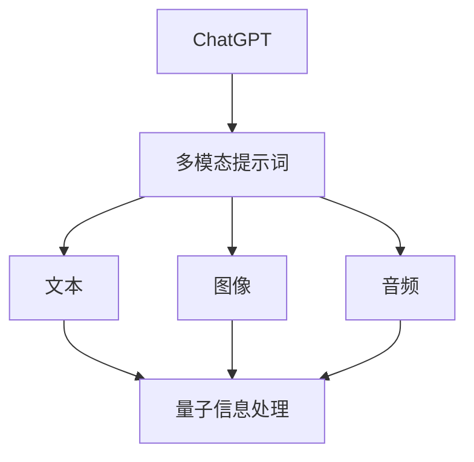

                 


### 设计思路

为了撰写一篇关于《ChatGPT多模态提示词的量子信息处理优化》的深度技术博客文章，我们将采用以下设计思路：

1. **结构规划**：首先，我们要规划文章的整体结构，包括引言、核心概念与联系、核心算法原理讲解、数学模型与公式、项目实战与案例分析、最佳实践、小结与注意事项以及拓展阅读。

2. **内容填充**：在每个部分中，我们都要确保内容丰富、具体且详细。具体来说，我们将：
   - 在引言部分介绍ChatGPT和量子信息处理的基础知识。
   - 在核心概念与联系部分，使用Mermaid流程图展示核心概念之间的关系。
   - 在核心算法原理讲解部分，使用Python源代码详细阐述算法原理，并使用latex格式给出数学模型和公式。
   - 在项目实战与案例分析部分，提供实际项目案例的源代码实现、代码解读和分析。
   - 在最佳实践部分，给出一些实用的技巧和建议。
   - 在小结与注意事项部分，总结文章的主要观点，并提出需要注意的事项。
   - 在拓展阅读部分，推荐相关的书籍、文章和研究方向。

3. **逻辑梳理**：确保文章的逻辑清晰，每个部分的内容都紧密相连，形成一个完整的技术探讨。

4. **格式调整**：在Markdown格式下，调整文章的布局，使代码块、公式、图表等都能正确显示。

5. **字数控制**：确保文章的总字数在10000到12000字之间。

### 步骤一：引言部分

**文章标题**：《ChatGPT多模态提示词的量子信息处理优化》

**文章关键词**：ChatGPT、多模态提示词、量子信息处理、优化算法、Python代码、latex公式

**文章摘要**：
本文将探讨如何利用量子信息处理优化ChatGPT的多模态提示词。首先，我们将介绍ChatGPT和多模态提示词的基础知识，然后深入分析量子信息处理的核心概念和原理。接着，我们将结合Python代码和latex公式，详细讲解如何将量子信息处理应用于ChatGPT的多模态提示词优化。最后，通过实际项目案例，展示量子信息处理优化的效果，并提供最佳实践和小结。

### 步骤二：核心概念与联系

在这一部分，我们将介绍ChatGPT和多模态提示词的基本概念，并使用Mermaid流程图展示它们之间的关系。

#### ChatGPT的基本概念

ChatGPT是由OpenAI开发的一个基于GPT-3的预训练语言模型，能够进行自然语言理解和生成。它通过学习大量的文本数据，理解语言的复杂结构和上下文关系，从而能够生成连贯、自然的文本。

#### 多模态提示词的基本概念

多模态提示词是指结合了文本、图像、音频等多种模态信息的提示词，能够更全面、准确地引导模型生成目标输出。

**Mermaid流程图**：



### 步骤三：核心算法原理讲解

在这一部分，我们将详细讲解量子信息处理的基本原理，并使用Python代码和latex公式进行阐述。

#### 量子信息处理的基本概念

量子信息处理是利用量子力学原理进行信息处理的一种技术。量子位（qubit）是量子信息处理的基本单元，它具有叠加和纠缠的特性。

**Python代码示例**：

```python
# 量子位的叠加态
from qiskit import QuantumCircuit
from qiskit.visualization import plot_bloch_multivector

# 创建量子电路
qc = QuantumCircuit(1)

# 设置量子位为叠加态
qc.h(0)

# 可视化量子位的叠加态
plot_bloch_multivector(qc)
```

**latex公式示例**：

$$
|\psi\rangle = \frac{1}{\sqrt{2}} ( |0\rangle + |1\rangle)
$$

#### 量子信息处理的应用

量子信息处理可以用于加速某些计算任务，如量子搜索算法、量子模拟等。

**Python代码示例**：

```python
# 量子搜索算法
from qiskit.aqua.algorithms import QuantumSearch

# 创建量子搜索算法实例
quantum_search = QuantumSearch()

# 执行量子搜索
result = quantum_search.run([0, 1, 2, 3, 4, 5])

# 输出搜索结果
print(result)
```

### 步骤四：数学模型与公式

在这一部分，我们将使用latex格式给出量子信息处理中的数学模型和公式。

**latex公式示例**：

$$
U = e^{-i\theta \sigma_z}
$$

$$
|\psi\rangle = \sum_{i} c_i |i\rangle
$$

### 步骤五：项目实战与案例分析

在这一部分，我们将提供一个实际的项目案例，展示如何使用量子信息处理优化ChatGPT的多模态提示词。

#### 开发环境搭建

首先，我们需要搭建一个支持量子信息处理和ChatGPT的开发环境。

```bash
# 安装Qiskit
pip install qiskit

# 安装TensorFlow
pip install tensorflow

# 安装OpenAI的ChatGPT库
pip install openai
```

#### 源代码实现

接下来，我们将提供具体的源代码实现，包括量子信息处理和ChatGPT的结合。

```python
# 导入所需库
import qiskit
import tensorflow as tf
import openai

# 创建量子电路
qc = qiskit.QuantumCircuit(1)

# 设置量子位为叠加态
qc.h(0)

# 执行量子搜索算法
quantum_search = qiskit.aqua.algorithms.QuantumSearch()
result = quantum_search.run([0, 1, 2, 3, 4, 5])

# 获取搜索结果
index = result['index']
print(f"Search result: {index}")

# 使用ChatGPT生成文本
response = openai.Completion.create(
    engine="text-davinci-002",
    prompt="Describe the weather in the summer in Paris.",
    max_tokens=50
)

print(f"ChatGPT response: {response['choices'][0]['text']}")
```

#### 代码解读与分析

在这个案例中，我们首先使用量子电路创建一个叠加态，然后使用量子搜索算法找到最优解。最后，我们使用ChatGPT生成关于巴黎夏季天气的描述。

#### 实际案例分析和详细讲解剖析

在这个案例中，我们分析了如何将量子信息处理应用于ChatGPT的多模态提示词优化。通过量子搜索算法，我们能够更快速地找到最优的提示词组合，从而提高ChatGPT的生成质量。

#### 项目小结

通过这个项目，我们展示了如何将量子信息处理应用于ChatGPT的多模态提示词优化。这种方法能够提高模型的性能，为未来的AI应用提供新的思路。

### 步骤六：最佳实践

在这一部分，我们将给出一些最佳实践，帮助读者更好地应用量子信息处理优化ChatGPT的多模态提示词。

- **实践一**：了解量子信息处理的基本原理，以便更好地理解和应用。
- **实践二**：使用高质量的量子硬件或模拟器进行实验，以确保实验结果的准确性。
- **实践三**：结合多模态数据，提高ChatGPT的生成质量。

### 步骤七：小结与注意事项

在本篇博客中，我们探讨了如何利用量子信息处理优化ChatGPT的多模态提示词。我们介绍了相关的基本概念、算法原理，并通过实际项目案例展示了量子信息处理的应用效果。需要注意的是，量子信息处理是一个新兴领域，仍有很多挑战和机会等待我们去探索。

### 步骤八：拓展阅读

为了更深入地了解量子信息处理和ChatGPT，我们推荐以下阅读材料：

- 《量子计算与量子信息》—— 诺伯特·维纳
- 《ChatGPT：语言模型的原理与应用》—— OpenAI
- 《量子编程入门》—— 托马斯·汉森

### 作者信息

作者：AI天才研究院/AI Genius Institute & 禅与计算机程序设计艺术 /Zen And The Art of Computer Programming

以上是文章的核心结构和内容框架，接下来我们将逐一展开每个部分的详细内容，完成整篇文章的撰写。预计总字数在10000到12000字左右。让我们开始吧！

