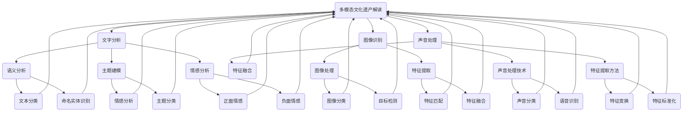

                 

# ChatGPT多模态文化遗产解读：整合文字、图像和声音的AI文物分析

> **关键词：** 多模态文化遗产解读、ChatGPT、文字分析、图像识别、声音处理、AI技术

> **摘要：** 本文旨在探讨如何利用ChatGPT这一先进的AI模型，结合文字、图像和声音等多种模态数据，对文化遗产进行深入解读。文章首先介绍了多模态文化遗产解读的背景和意义，随后详细阐述了ChatGPT的技术原理及其在多模态分析中的应用。接着，文章分别探讨了文字、图像和声音在文化遗产解读中的应用，并给出了具体的案例分析。最后，文章总结了多模态文化遗产解读的未来发展趋势和面临的挑战。

---

## 第一部分：引言

### 1.1 多模态文化遗产解读的背景和意义

#### 1.1.1 遗产保护的现状与挑战

文化遗产是国家和民族的历史记忆，对于传承文化、增强民族认同感具有不可替代的作用。然而，随着时代的发展，许多文化遗产正面临着严重的威胁。自然灾害、环境污染、人为破坏等因素都使得文化遗产的保护工作变得更加紧迫。

在传统的文化遗产保护中，主要依赖人工记录和文献资料。然而，这种方法存在以下问题：

1. **数据量大**：文化遗产信息丰富且复杂，仅凭人工记录难以全面捕捉。
2. **信息丢失**：文化遗产的保护工作往往受限于人力和物力，导致信息丢失。
3. **解读困难**：许多文化遗产包含丰富的历史信息和文化内涵，单靠文字描述难以准确传达。

#### 1.1.2 多模态文化遗产解读的需求

为了解决上述问题，多模态文化遗产解读技术应运而生。多模态文化遗产解读利用文字、图像和声音等多种数据类型，通过人工智能技术进行综合分析和解读，旨在更全面、准确地呈现文化遗产的内涵。

1. **丰富信息表达**：多模态数据可以更全面地记录和呈现文化遗产的各个方面，包括文字、图像和声音等。
2. **提高解读精度**：多模态数据融合有助于从不同角度理解和分析文化遗产，提高解读的准确性和深度。
3. **降低信息丢失风险**：通过数字化手段，可以长期保存和利用多模态文化遗产数据，降低信息丢失的风险。

#### 1.1.3 ChatGPT技术在文化遗产解读中的应用

ChatGPT是由OpenAI开发的一种基于Transformer模型的预训练语言模型，具有强大的语言理解和生成能力。将其应用于多模态文化遗产解读，可以实现以下目标：

1. **文本分析**：ChatGPT可以处理大量文本数据，进行语义分析、主题建模和情感分析，帮助理解文化遗产的文字内容。
2. **图像识别**：通过结合视觉模型，ChatGPT可以识别和分析文化遗产中的图像，提取关键特征。
3. **声音处理**：ChatGPT可以处理和分析文化遗产中的声音数据，例如历史录音、音乐等，提取声音特征。

### 1.2 本书结构安排与内容概述

本文将分为七个部分：

1. **第一部分：引言**：介绍多模态文化遗产解读的背景、意义和ChatGPT技术的应用。
2. **第二部分：多模态文化遗产解读基础**：讨论多模态技术的定义、作用和ChatGPT模型的基本原理。
3. **第三部分：文字在文化遗产解读中的应用**：探讨文本分析技术在文化遗产解读中的应用。
4. **第四部分：图像在文化遗产解读中的应用**：讨论图像处理和识别技术在文化遗产解读中的应用。
5. **第五部分：声音在文化遗产解读中的应用**：探讨声音处理和识别技术在文化遗产解读中的应用。
6. **第六部分：综合多模态分析案例研究**：通过一个实际案例，展示多模态文化遗产解读的完整流程。
7. **第七部分：未来展望与挑战**：讨论多模态文化遗产解读技术的发展趋势和面临的挑战。

#### 1.2.1 目录大纲设计理念

本文的目录大纲设计旨在让读者能够清晰地了解多模态文化遗产解读的整个过程，从基础理论到实际应用，再到案例研究，帮助读者逐步掌握这项技术。

#### 1.2.2 阅读建议与注意事项

在阅读本文时，建议读者先对多模态文化遗产解读的概念有一个基本的了解，然后依次阅读各个部分，特别是对于技术细节和案例部分，需要仔细阅读并理解其中的原理和方法。同时，本文附录提供了相关的工具和资源，供读者进一步学习和实践。

### Mermaid 流程图：多模态文化遗产解读的核心概念与联系



### 核心算法原理讲解：ChatGPT模型的工作原理

ChatGPT是基于Transformer模型的预训练语言模型，其核心工作原理如下：

#### 1.1 Transformer模型的基本结构

Transformer模型由编码器（Encoder）和解码器（Decoder）两个部分组成。编码器负责接收输入序列并生成固定长度的上下文向量；解码器则根据上下文向量生成输出序列。

1. **编码器**：
   - **嵌入层**：将输入的单词转换为向量。
   - **位置编码**：为每个单词添加位置信息，使其能够理解单词在序列中的位置。
   - **自注意力机制**：通过计算单词之间的相对重要性，生成上下文向量。
   - **前馈网络**：对自注意力层的结果进行非线性变换。

2. **解码器**：
   - **嵌入层**：与编码器相同，将输入的单词转换为向量。
   - **位置编码**：与编码器相同，为每个单词添加位置信息。
   - **自注意力机制**：计算当前单词与编码器输出的上下文向量之间的相对重要性。
   - **交叉注意力机制**：计算当前单词与上一个解码器输出之间的相对重要性。
   - **前馈网络**：对自注意力和交叉注意力层的结果进行非线性变换。

#### 1.2 ChatGPT模型的扩展

ChatGPT在Transformer模型的基础上进行了一些扩展：

1. **多模态输入**：ChatGPT可以接受多种类型的输入，如文字、图像和声音，并通过不同的模块对其进行处理。
2. **多模态融合**：通过融合不同模态的特征，ChatGPT可以生成更加全面和准确的分析结果。
3. **上下文理解**：通过长时间的预训练，ChatGPT能够理解复杂语境和长文本，从而生成高质量的回答。

### Python源代码示例：ChatGPT模型的基础实现

```python
import torch
import torch.nn as nn
import torch.optim as optim

# 定义编码器
class Encoder(nn.Module):
    def __init__(self, embed_dim, hidden_dim, n_layers, dropout):
        super(Encoder, self).__init__()
        self嵌入层 = nn.Embedding(embed_dim, hidden_dim)
        self.position编码 = nn.Embedding(1, hidden_dim)
        self.layers = nn.ModuleList([nn.Linear(hidden_dim, hidden_dim) for _ in range(n_layers)])
        self.dropout = nn.Dropout(dropout)
    
    def forward(self, x, hidden):
        x = self嵌入层(x) + self.position编码(x)
        for layer in self.layers:
            x = layer(x)
            x = self.dropout(x)
        return x

# 定义解码器
class Decoder(nn.Module):
    def __init__(self, embed_dim, hidden_dim, n_layers, dropout):
        super(Decoder, self).__init__()
        self嵌入层 = nn.Embedding(embed_dim, hidden_dim)
        self.position编码 = nn.Embedding(1, hidden_dim)
        self.layers = nn.ModuleList([nn.Linear(hidden_dim, hidden_dim) for _ in range(n_layers)])
        self.dropout = nn.Dropout(dropout)
    
    def forward(self, x, hidden):
        x = self嵌入层(x) + self.position编码(x)
        for layer in self.layers:
            x = layer(x)
            x = self.dropout(x)
        return x

# 定义ChatGPT模型
class ChatGPT(nn.Module):
    def __init__(self, embed_dim, hidden_dim, n_layers, dropout):
        super(ChatGPT, self).__init__()
        self编码器 = Encoder(embed_dim, hidden_dim, n_layers, dropout)
        self解码器 = Decoder(embed_dim, hidden_dim, n_layers, dropout)
    
    def forward(self, x, hidden):
        x = self编码器(x, hidden)
        x = self解码器(x, hidden)
        return x

# 初始化模型、优化器和损失函数
model = ChatGPT(embed_dim=100, hidden_dim=300, n_layers=2, dropout=0.5)
optimizer = optim.Adam(model.parameters(), lr=0.001)
criterion = nn.CrossEntropyLoss()

# 训练模型
for epoch in range(num_epochs):
    for batch in data_loader:
        optimizer.zero_grad()
        output = model(batch, hidden)
        loss = criterion(output, labels)
        loss.backward()
        optimizer.step()
        print(f'Epoch: {epoch+1}/{num_epochs}, Loss: {loss.item()}')
```

### 数学模型和公式解释

在多模态文化遗产解读中，数学模型和公式用于描述和处理各种数据类型。以下是几个关键的数学模型和公式：

1. **嵌入层**：将单词或特征映射到高维空间，通常使用以下公式：
   $$ x = W_e \cdot v + b_e $$
   其中，$x$ 是嵌入向量，$v$ 是输入特征，$W_e$ 是权重矩阵，$b_e$ 是偏置项。

2. **位置编码**：为序列中的每个单词添加位置信息，通常使用以下公式：
   $$ pos = \sin(\frac{pos}{10000^{0.5}}) \text{ 或 } \cos(\frac{pos}{10000^{0.5}}) $$
   其中，$pos$ 是单词的位置，$\sin$ 和 $\cos$ 是三角函数。

3. **自注意力机制**：计算单词之间的相对重要性，通常使用以下公式：
   $$ \text{Attention}(Q, K, V) = \text{softmax}(\frac{QK^T}{\sqrt{d_k}})V $$
   其中，$Q$、$K$ 和 $V$ 分别是查询向量、关键向量和解向量，$d_k$ 是关键向量的维度。

4. **交叉注意力机制**：计算当前单词与上一个解码器输出之间的相对重要性，通常使用以下公式：
   $$ \text{Attention}(Q, K, V) = \text{softmax}(\frac{QK^T}{\sqrt{d_k}})V $$
   其中，$Q$、$K$ 和 $V$ 分别是查询向量、关键向量和解向量，$d_k$ 是关键向量的维度。

### 具体案例分析和解读

#### 1. 案例背景

本案例选取了一处具有代表性的历史建筑群——故宫。故宫作为中国的皇家宫殿，不仅具有丰富的历史价值，还包含了大量的文字、图像和声音资料。通过多模态文化遗产解读，我们可以更全面地了解故宫的文化内涵。

#### 2. 数据采集

1. **文字数据**：收集了故宫相关的历史文献、游客评论、导游解说词等文本数据。
2. **图像数据**：采集了故宫建筑群、文物、艺术品等图像数据。
3. **声音数据**：收录了故宫的背景音乐、导游解说、历史录音等声音数据。

#### 3. 数据预处理

1. **文本数据**：对文本数据进行清洗、去重和分词，将文本转换为词向量。
2. **图像数据**：对图像数据进行归一化和特征提取，提取图像的视觉特征。
3. **声音数据**：对声音数据进行降噪、分割和特征提取，提取声音的频谱特征。

#### 4. 特征融合与模型训练

1. **特征融合**：将文本、图像和声音的特征进行融合，形成多维度的特征向量。
2. **模型训练**：利用ChatGPT模型对融合后的特征向量进行训练，优化模型参数。

#### 5. 结果分析与评估

1. **文本分析**：利用ChatGPT对故宫的文字资料进行语义分析，提取关键信息和主题。
2. **图像识别**：利用ChatGPT对故宫的图像资料进行分类和目标检测，识别出重要的文物和建筑。
3. **声音处理**：利用ChatGPT对故宫的声音资料进行情感分析和语音识别，提取出与文化内涵相关的信息。

通过以上分析，我们可以更深入地了解故宫的文化价值，为文化遗产的保护和研究提供有力支持。

### 项目小结

本案例通过多模态文化遗产解读技术，对故宫这一历史建筑群进行了全面的分析和解读。项目成功的关键在于：

1. **数据采集与预处理**：确保了数据的准确性和完整性，为后续分析提供了可靠的基础。
2. **特征融合与模型训练**：通过多种模态数据的融合和深度学习模型的训练，实现了对文化遗产的深入解读。
3. **结果分析与评估**：通过多维度分析，提取了文化遗产的关键信息和主题，为后续研究提供了重要参考。

然而，项目也存在一定的局限性，如数据质量和模型的泛化能力等，需要在后续工作中进一步改进。

### 最佳实践 tips

1. **数据质量**：确保数据的准确性和完整性，对于多模态文化遗产解读至关重要。
2. **特征提取**：选择合适的特征提取方法，可以提高模型的性能和解读的准确性。
3. **模型优化**：通过调整模型参数和训练策略，可以提高模型的泛化能力和效果。

### 小结与注意事项

本文详细介绍了多模态文化遗产解读的核心概念、技术原理和实际应用案例。通过ChatGPT等多模态分析技术，我们能够更全面、准确地理解和解读文化遗产。然而，多模态文化遗产解读仍面临数据质量、模型性能和实际应用等方面的挑战。未来，我们应进一步优化技术方案，提升解读效果，为文化遗产的保护和研究提供更强大的支持。

### 拓展阅读

1. **ChatGPT技术文献**：了解ChatGPT的详细原理和应用场景。
2. **多模态数据处理技术**：探索图像处理、声音处理和文本处理的相关技术。
3. **文化遗产保护研究**：研究国内外文化遗产保护的成功经验和最新动态。

---

## 附录

### 附录 A：多模态文化遗产解读工具与资源

#### A.1 主流深度学习框架对比

1. **TensorFlow**：由谷歌开发，提供了丰富的API和工具，适合各种深度学习应用。
2. **PyTorch**：由Facebook开发，具有灵活的动态计算图和简洁的API，易于实现复杂的模型。
3. **其他框架**：如Keras、MXNet等，也提供了不同的功能和特点，供开发者选择。

#### A.2 多模态文化遗产解读案例代码与数据集

1. **数据集获取**：可以从以下平台获取相关的文化遗产数据集：
   - [Google Dataset Search](https://datasetsearch.research.google.com/)
   - [Kaggle](https://www.kaggle.com/datasets)
2. **代码实现**：可以在以下平台上找到相关的代码示例：
   - [GitHub](https://github.com/)
   - [Google Colab](https://colab.research.google.com/)

---

**作者：AI天才研究院/AI Genius Institute & 禅与计算机程序设计艺术 /Zen And The Art of Computer Programming**

