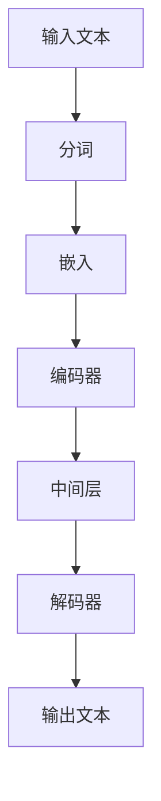
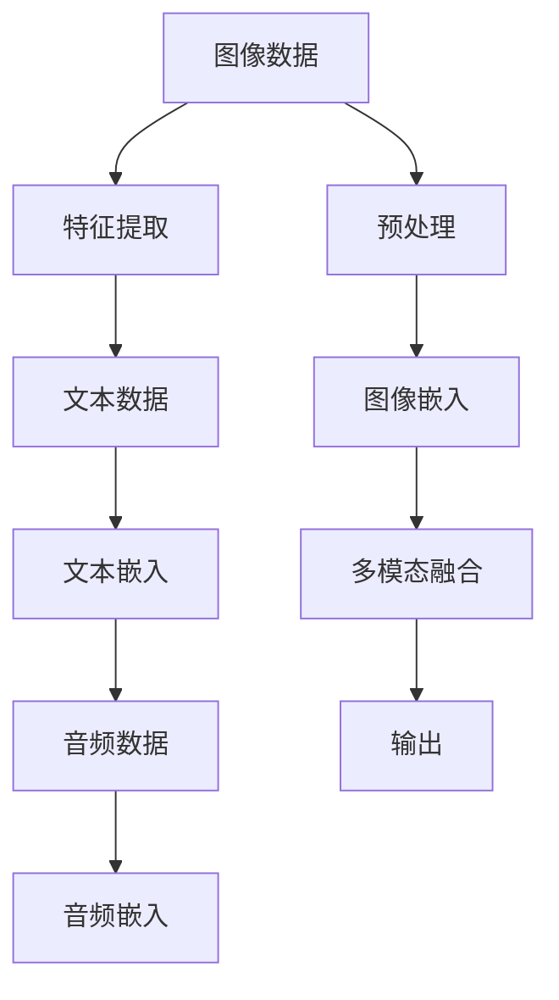
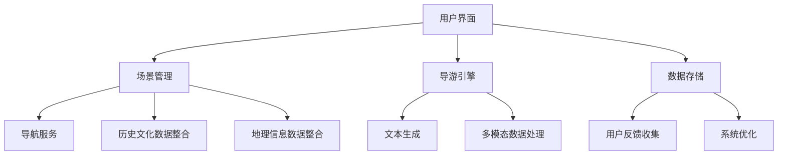
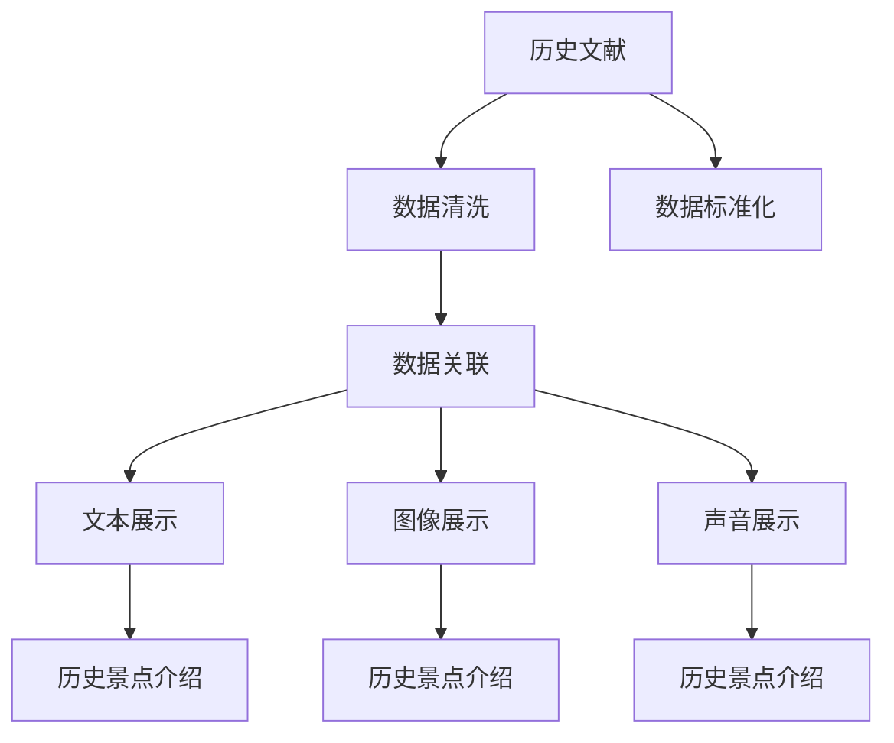
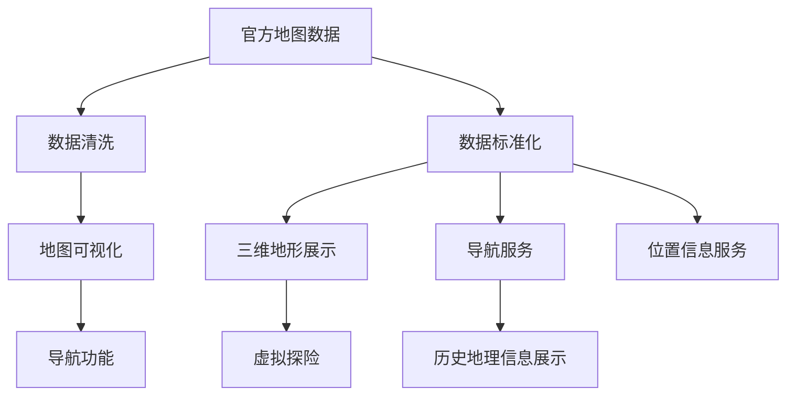

                 


### 1.1 虚拟导游的定义

虚拟导游是一种利用现代信息技术，特别是虚拟现实（VR）和增强现实（AR）技术，为游客提供沉浸式旅游体验的服务方式。它通过三维模型、图像、声音和视频等多媒体信息，模拟出一个与现实世界相似的虚拟环境，使游客能够身临其境地感受旅游目的地的历史文化、自然风光和风土人情。

虚拟导游的核心在于其“虚拟”二字。与传统的导游服务相比，虚拟导游并不依赖于真实的导游员，而是通过技术手段模拟出一个虚拟的导游角色，为游客提供解说、导航、推荐等服务。这种虚拟化服务不仅降低了人力成本，还能够突破时间、空间和语言的限制，为游客带来全新的旅游体验。

虚拟导游的主要组成部分包括：

- **虚拟环境**：通过虚拟现实（VR）技术构建的虚拟环境，是虚拟导游的核心部分。它为游客提供了一个三维的、互动的、沉浸式的体验空间。

- **虚拟导游角色**：虚拟导游角色是虚拟导游系统的“灵魂”，通过人工智能技术，尤其是自然语言处理（NLP）和计算机图形学技术，实现与游客的实时交互，提供个性化的导游服务。

- **交互界面**：交互界面是虚拟导游与游客沟通的桥梁，通过图形用户界面（GUI）或语音识别系统，使游客能够与虚拟导游进行自然互动。

- **多媒体数据**：包括图像、音频、视频等，这些数据是构建虚拟环境的基础，也是虚拟导游提供丰富内容的重要来源。

虚拟导游与传统导游的区别在于：

- **服务形式**：虚拟导游是技术驱动的，通过程序和算法为游客提供服务；传统导游则是人工驱动的，依赖导游员的个人经验和技能。

- **互动性**：虚拟导游能够提供高度互动的服务，游客可以根据自己的兴趣和需求，自由探索虚拟环境；传统导游的服务相对固定，游客的互动空间较小。

- **成本**：虚拟导游可以降低人力成本，特别是在人流量大的旅游景点；传统导游则需要大量的人力投入。

- **扩展性**：虚拟导游系统可以轻松更新和扩展，添加新的景点、解说内容等；传统导游则需要时间和人力进行更新。

总之，虚拟导游作为一种新兴的旅游服务方式，正逐渐改变着人们的旅游体验。通过虚拟现实和人工智能技术的结合，虚拟导游不仅能够提供更加个性化和沉浸式的旅游体验，还能够为旅游行业带来更高的效率和更广泛的应用前景。在接下来的章节中，我们将进一步探讨虚拟导游技术的发展历程、优势以及与ChatGPT等人工智能技术的结合应用。

### 1.2 虚拟导游的发展历程

虚拟导游技术的发展可以追溯到20世纪90年代，当时虚拟现实（VR）和增强现实（AR）技术开始逐渐成熟，并在多个领域得到应用。以下将详细回顾虚拟导游技术的发展历程，以及VR和AR技术在这些领域中的应用情况。

#### 1.2.1 初期探索（1990-1999年）

在1990年代初，虚拟现实（VR）和增强现实（AR）技术还处于萌芽阶段。最初的研究主要集中在如何创建虚拟环境，以及如何通过头戴式显示器（HMD）和跟踪设备来实现用户的沉浸式体验。这一时期，虚拟导游的概念开始出现，但仅限于实验性和学术性的研究。例如，研究者们通过构建简单的虚拟博物馆和虚拟城市，来模拟游客的参观体验。

- **虚拟博物馆**：1990年代初，一些博物馆开始尝试使用VR技术来展示馆藏文物。例如，美国史密森尼国家自然历史博物馆（Smithsonian National Museum of Natural History）在1995年推出了第一个虚拟博物馆展览，通过VR技术让游客能够“走进”博物馆，观看展品。

- **虚拟城市**：与此同时，一些城市也开始利用VR技术进行城市规划。例如，日本大阪市在1997年推出了一个虚拟城市项目，通过VR技术模拟城市街道和建筑物，帮助市民和游客了解城市布局和规划。

#### 1.2.2 技术成熟期（2000-2010年）

随着计算机技术和图形处理能力的提升，虚拟现实（VR）和增强现实（AR）技术进入了快速发展期。这一时期，虚拟导游开始逐步走向实用化，不仅在博物馆和城市规划中得到应用，还扩展到了旅游业、教育、医疗等领域。

- **旅游业**：2000年代初，一些旅游景点开始尝试使用VR技术提供虚拟导游服务。例如，美国的黄石国家公园（Yellowstone National Park）在2004年推出了VR导游项目，通过虚拟现实技术为游客提供全景式的导游体验。

- **教育**：VR技术在教育领域的应用也逐渐成熟。一些教育机构开始利用VR技术创建虚拟课堂，让学生能够“走进”历史现场、科学实验室等。例如，加州大学伯克利分校（University of California, Berkeley）在2008年推出了一项名为“虚拟校园”的项目，通过VR技术让学生能够“参观”校园。

- **医疗**：VR技术在医疗领域的应用也取得了显著进展。医生可以通过VR技术进行手术模拟和培训，提高手术技能。例如，美国的约翰·霍普金斯大学医学院（Johns Hopkins University School of Medicine）在2007年推出了一项VR手术模拟项目，通过虚拟手术场景帮助医生进行手术训练。

#### 1.2.3 创新技术引入期（2010年至今）

随着人工智能、大数据和云计算等新技术的不断发展，虚拟导游技术也迎来了新的发展机遇。特别是ChatGPT等大型语言模型的兴起，为虚拟导游提供了更加智能和个性化的服务。

- **人工智能引入**：人工智能技术的引入，使得虚拟导游能够更加智能地与游客互动，提供个性化的服务。例如，通过自然语言处理（NLP）技术，虚拟导游能够理解游客的语音输入，并实时生成合适的回答。

- **大数据应用**：大数据技术在虚拟导游中的应用，使得系统能够根据游客的行为数据和历史记录，提供更加个性化的推荐服务。例如，根据游客的兴趣和行为，虚拟导游可以推荐特定的景点和旅游路线。

- **云计算支持**：云计算技术的应用，使得虚拟导游系统能够更加灵活和高效地部署和管理。游客可以通过互联网访问虚拟导游系统，无论是在家中还是旅途中，都能享受到高质量的虚拟导游服务。

#### 1.2.4 发展趋势

当前，虚拟导游技术正朝着更加智能化、个性化、沉浸化的方向发展。以下是一些发展趋势：

- **增强现实（AR）应用**：随着AR技术的发展，虚拟导游开始从VR转向AR，实现虚拟内容与现实环境的无缝融合。例如，通过AR技术，游客可以在现实世界中看到虚拟的导游解说和历史事件。

- **多模态交互**：虚拟导游将结合语音、文本、图像等多种交互方式，提供更加自然和直观的用户体验。例如，游客可以通过语音与虚拟导游交流，也可以通过触摸屏幕进行交互。

- **个性化定制**：虚拟导游将根据游客的偏好和历史记录，提供个性化的旅游推荐和服务。例如，根据游客的兴趣，虚拟导游可以推荐特定的景点和活动。

- **扩展应用领域**：虚拟导游技术将在更多领域得到应用，如文化遗产保护、房地产销售、教育培训等。通过虚拟导游，这些领域将能够提供更加丰富和沉浸式的体验。

总之，虚拟导游技术已经从初期的实验性研究走向实用化，并在旅游业、教育、医疗等领域得到广泛应用。随着新技术的不断引入和发展，虚拟导游技术将带来更加智能、个性化、沉浸化的旅游体验，为游客带来全新的旅游方式。

### 1.3 虚拟导游的优势

虚拟导游作为一种新兴的旅游服务方式，相较于传统导游，具有多方面的优势。以下将详细介绍虚拟导游的优势，并从提升旅游体验、拓展游客知识面以及适应不同旅游场景需求三个方面进行阐述。

#### 1.3.1 提升旅游体验

虚拟导游能够显著提升旅游体验，主要表现在以下几个方面：

- **沉浸式体验**：虚拟导游通过虚拟现实（VR）和增强现实（AR）技术，为游客提供了一个沉浸式的旅游环境。游客可以在虚拟场景中自由行走、探索，感受到更加真实的旅游氛围。

- **多样化互动**：虚拟导游系统能够提供多种互动方式，如语音交互、文本聊天、手势控制等，使游客能够更加自然地与虚拟导游进行互动。这种多样化的互动方式，不仅增强了游客的参与感，还使旅游体验更加丰富。

- **个性化定制**：虚拟导游系统能够根据游客的兴趣和行为，提供个性化的旅游推荐和服务。例如，根据游客的历史记录和偏好，虚拟导游可以推荐特定的景点、活动和路线，使游客能够更加高效地规划旅游行程。

- **无语言障碍**：虚拟导游系统通常支持多种语言，即使游客不会当地语言，也能够通过系统提供的语言翻译功能，获得导游解说和服务。这种无语言障碍的特性，使得虚拟导游在全球范围内具有广泛的应用前景。

#### 1.3.2 拓展游客知识面

虚拟导游在拓展游客知识面方面具有显著优势：

- **历史文化讲解**：虚拟导游可以提供详细的历史文化讲解，帮助游客了解旅游目的地的历史、文化和传统。通过文本、图像、视频等多媒体形式，虚拟导游能够生动地展示历史事件、名人故事、文化习俗等，使游客在游览过程中获得更多的知识。

- **自然景观介绍**：虚拟导游还可以为游客提供自然景观的详细介绍，如地质构造、生态特点、动植物分布等。通过虚拟现实技术，游客可以“走进”自然景观，了解其背后的科学原理。

- **互动式学习**：虚拟导游系统中的互动式学习功能，使游客能够通过答题、游戏等方式，更加生动地学习相关知识。例如，在参观博物馆时，虚拟导游可以提出相关问题，游客需要回答正确才能继续前进，这种互动式学习方式，不仅增加了学习的趣味性，还提高了学习效果。

#### 1.3.3 适应不同旅游场景的需求

虚拟导游能够根据不同的旅游场景，提供灵活的服务：

- **户外旅游**：在户外旅游场景中，虚拟导游可以通过GPS定位技术，为游客提供实时的导航和景点介绍。游客可以在户外环境中，通过手机或其他设备，随时获取虚拟导游的服务。

- **室内景点**：对于室内景点，如博物馆、历史建筑等，虚拟导游可以通过AR技术，将虚拟内容与现实环境结合，为游客提供更加丰富的展示和讲解。例如，游客可以通过手机或平板电脑，看到虚拟的文物和历史场景，实现虚拟与现实的交互。

- **远程旅游**：对于无法亲临现场的游客，虚拟导游可以提供在线游览服务。通过虚拟现实技术，游客可以在家中或办公室，通过网络远程参观旅游景点，享受虚拟旅游体验。

- **定制旅游**：虚拟导游系统可以根据游客的定制需求，提供个性化的旅游服务。例如，游客可以指定游览的景点、解说内容、互动方式等，虚拟导游将根据游客的需求，进行个性化的调整和优化。

#### 1.3.4 降低旅游成本

虚拟导游在降低旅游成本方面也具有显著优势：

- **人力成本**：虚拟导游无需雇佣大量的导游员，从而降低了旅游的人力成本。特别是在人流量大的旅游景点，虚拟导游可以提供24小时不间断的服务，大大提高了服务效率。

- **运营成本**：虚拟导游系统的运营成本相对较低。虚拟导游系统的开发和维护费用虽然较高，但一旦建成，就可以大规模应用，实现规模效应。此外，虚拟导游系统无需实体店面和办公场所，进一步降低了运营成本。

- **营销成本**：虚拟导游可以降低旅游产品的营销成本。通过虚拟导游，旅游景点可以在线上展示其特色和魅力，吸引更多的游客。与传统营销方式相比，虚拟导游可以更直观、生动地展示旅游产品，提高营销效果。

综上所述，虚拟导游在提升旅游体验、拓展游客知识面和适应不同旅游场景需求等方面具有显著优势。随着虚拟现实、增强现实和人工智能等新技术的不断发展和应用，虚拟导游将越来越普及，为游客带来更加智能、个性化、沉浸式的旅游体验。

## 第2章: ChatGPT技术概述

### 2.1 ChatGPT的概念

ChatGPT是一种基于生成预训练技术（Generative Pre-trained Transformer，GPT）的大型语言模型，由OpenAI开发。GPT系列模型是自然语言处理（NLP）领域的重要突破，其核心思想是通过大规模数据预训练，使得模型具备强大的语言理解和生成能力。

ChatGPT作为GPT系列模型的一个变种，进一步扩展了GPT的能力，特别是在上下文生成和对话生成方面。ChatGPT不仅能够生成高质量的文本，还能够根据上下文进行合理推断，生成连贯、自然的对话内容。

### 2.2 ChatGPT的特点

ChatGPT具有以下几个显著特点：

- **强大的语言理解能力**：ChatGPT通过预训练技术，在大量文本数据上学习语言规律，具备出色的语言理解能力。它能够理解复杂的语义、句法和上下文信息，从而生成更加准确和自然的文本。

- **灵活的上下文生成能力**：ChatGPT具有强大的上下文生成能力，能够根据给定的上下文，生成连贯、有逻辑的文本。这种能力使得ChatGPT在对话生成、文本续写和问答系统中表现出色。

- **多任务学习能力**：ChatGPT不仅可以处理单一任务的对话生成，还能够通过迁移学习，快速适应不同任务场景。例如，它可以用于客户服务、虚拟助理、在线教育等多个领域。

- **高效的处理速度**：ChatGPT采用Transformer架构，具有并行计算的优势，能够在短时间内处理大量的文本数据。这使得ChatGPT在实时对话系统和大规模数据处理场景中具有明显的性能优势。

### 2.3 ChatGPT的工作原理

ChatGPT的工作原理主要分为两个阶段：预训练和微调。

#### 预训练阶段

- **数据集**：ChatGPT的训练数据主要来源于互联网上的大量文本数据，包括新闻报道、社交媒体帖子、论坛讨论、书籍等。这些数据涵盖了多种主题和领域，使模型具有广泛的语言理解能力。

- **预训练过程**：在预训练阶段，ChatGPT通过自回归语言模型（Autoregressive Language Model）进行训练。模型首先读取一个文本序列，然后预测序列中的下一个词。通过这种方式，模型学习到了语言的概率分布，从而掌握了语言的基本规律。

- **优化目标**：预训练的优化目标通常是最小化交叉熵损失函数，即模型预测的词与实际词之间的差异。通过不断迭代优化，模型逐渐提高对语言的理解能力。

#### 微调阶段

- **任务数据**：在微调阶段，ChatGPT会接收到特定任务的数据，例如对话生成、问答系统等。这些数据通常是从原始文本数据中筛选和整理得到的，以适应特定任务的需求。

- **微调过程**：在微调阶段，ChatGPT利用预训练得到的知识，对特定任务进行优化。通过调整模型参数，模型能够更好地适应特定任务的需求，从而提高任务表现。

- **优化目标**：微调阶段的优化目标通常是最大化特定任务的准确率或效用函数。例如，在对话生成任务中，模型需要生成连贯、有意义的对话内容；在问答系统中，模型需要准确回答用户的问题。

### 2.4 ChatGPT的应用场景

ChatGPT具有广泛的应用场景，以下是一些典型的应用领域：

- **虚拟导游**：ChatGPT可以用于虚拟导游系统，为游客提供个性化的导游服务。通过自然语言处理技术，ChatGPT能够理解游客的提问和需求，并生成相应的回答和解说。

- **客户服务**：ChatGPT可以应用于客户服务领域，作为智能客服系统的一部分。通过对话生成技术，ChatGPT能够与客户进行实时互动，解答客户的问题，提供产品推荐和服务支持。

- **在线教育**：ChatGPT可以用于在线教育系统，为学生提供个性化的学习辅导和解答问题。通过自然语言处理和上下文生成技术，ChatGPT能够理解学生的学习需求，并提供相应的学习资源和解答。

- **内容生成**：ChatGPT可以用于自动生成文本内容，如新闻文章、博客文章、产品描述等。通过预训练和微调技术，ChatGPT能够生成高质量、连贯的文本，节省人工写作的时间和成本。

- **聊天机器人**：ChatGPT可以用于构建聊天机器人，为用户提供实时对话支持。通过自然语言处理和对话生成技术，ChatGPT能够与用户进行自然、流畅的对话，提供信息查询、服务咨询等功能。

### 2.5 ChatGPT的优势

ChatGPT在多个方面具有显著优势，使其成为自然语言处理领域的重要工具：

- **高质量生成文本**：ChatGPT通过预训练技术，学习到了大量语言知识，能够生成高质量、连贯的文本。

- **灵活适应性**：ChatGPT具有强大的多任务学习能力，可以通过微调技术，快速适应不同任务场景，提供个性化服务。

- **高效处理速度**：ChatGPT采用并行计算架构，能够在短时间内处理大量的文本数据，适用于实时对话系统和大规模数据处理场景。

- **通用性**：ChatGPT具有广泛的应用领域，不仅适用于文本生成，还可以用于文本分类、问答系统等多个自然语言处理任务。

综上所述，ChatGPT作为一种基于生成预训练技术的大型语言模型，具有强大的语言理解、生成和适应能力，在多个应用场景中表现出色。随着技术的不断发展和应用，ChatGPT将在更多领域发挥重要作用，为人类带来更加智能、高效的交互体验。

### 2.6 ChatGPT的优缺点及适用性

#### 优缺点分析

**优点：**

1. **高质量文本生成**：ChatGPT通过大规模预训练，能够生成高质量、连贯的文本内容，适用于需要生成自然语言文本的场景。

2. **灵活适应性**：ChatGPT的多任务学习能力使其能够快速适应不同任务场景，适用于多种应用，如虚拟导游、客户服务、在线教育等。

3. **高效处理速度**：ChatGPT采用并行计算架构，能够在短时间内处理大量文本数据，适用于实时对话系统和大规模数据处理场景。

4. **通用性**：ChatGPT适用于文本生成、文本分类、问答系统等多个自然语言处理任务，具有广泛的应用前景。

**缺点：**

1. **数据依赖性**：ChatGPT的性能高度依赖于训练数据的质量和数量，如果训练数据存在偏差，可能导致模型生成的内容不公正或不准确。

2. **计算资源需求**：ChatGPT的训练和推理过程需要大量的计算资源，特别是大模型，如GPT-3，对硬件资源有较高要求。

3. **安全性问题**：由于ChatGPT能够生成高质量、逼真的文本，可能被用于生成虚假信息或恶意内容，对网络安全构成威胁。

4. **语言理解限制**：尽管ChatGPT具有强大的语言理解能力，但在处理复杂语言任务时，仍可能存在理解偏差和逻辑错误。

#### 适用性分析

ChatGPT在多个领域具有广泛的应用性，以下为具体适用性分析：

- **虚拟导游**：ChatGPT可以用于虚拟导游系统，提供个性化的导游服务。通过理解游客的提问和需求，ChatGPT能够生成相应的回答和解说，提升游客的旅游体验。

- **客户服务**：ChatGPT可以作为智能客服系统的一部分，与用户进行实时互动，解答用户的问题，提供产品推荐和服务支持。

- **在线教育**：ChatGPT可以用于在线教育系统，为学生提供个性化的学习辅导和解答问题。通过理解学生的学习需求，ChatGPT能够生成相应的学习资源和解答。

- **内容生成**：ChatGPT可以用于自动生成文本内容，如新闻文章、博客文章、产品描述等，节省人工写作的时间和成本。

- **聊天机器人**：ChatGPT可以用于构建聊天机器人，为用户提供实时对话支持，提供信息查询、服务咨询等功能。

- **文本分类**：ChatGPT可以用于文本分类任务，如垃圾邮件过滤、情感分析等，通过对大量文本数据的学习，模型能够准确分类不同类型的文本。

- **问答系统**：ChatGPT可以用于构建问答系统，通过理解用户的问题和上下文，生成准确的答案。

- **自然语言推理**：ChatGPT可以用于自然语言推理任务，如句子对语义关系判断、逻辑推理等，通过对语言的理解和推理，模型能够生成合理的判断和推理结果。

总之，ChatGPT作为一种基于生成预训练技术的大型语言模型，具有强大的语言理解和生成能力，在多个领域具有广泛的应用性。然而，在实际应用中，需要充分考虑其优缺点和适用性，以确保模型在特定场景中的表现和安全性。

## 第3章: 多模态数据的处理

### 3.1 多模态数据的概念

多模态数据是指由两种或两种以上不同类型的数据源组成的数据集合，这些数据源可以是图像、文本、音频、视频等。在多模态数据处理中，各个数据源之间具有互补性和交互性，通过整合这些数据源，可以更加全面、深入地理解数据内容，提高数据分析和应用的效果。

多模态数据的特点主要体现在以下几个方面：

- **多样性**：多模态数据来源于多种不同的数据源，具有多样性。例如，一个多模态数据集可以包含文本、图像和音频三种类型的数据。

- **互补性**：不同类型的数据源具有互补性，能够相互补充。例如，文本可以提供描述性信息，图像可以提供视觉信息，音频可以提供声音信息，通过整合这些信息，可以更加全面地理解数据。

- **复杂性**：多模态数据的处理通常较为复杂，因为需要处理多种类型的数据，并且这些数据之间可能存在关联和相互作用。

- **协同性**：多模态数据协同工作，能够提高数据分析和应用的性能。例如，在图像分类任务中，结合文本描述可以提高分类的准确率。

### 3.2 多模态数据采集与预处理

多模态数据的采集是数据处理的第一步，主要包括以下几种数据源：

- **图像数据**：图像数据可以通过摄像头、传感器等设备采集，用于描述场景、物体、人脸等视觉信息。

- **文本数据**：文本数据可以通过自然语言处理技术从文本文件、社交媒体、新闻报道等来源采集，用于描述事件、情感、观点等语言信息。

- **音频数据**：音频数据可以通过麦克风、音频设备等采集，用于描述声音、语音、音乐等音频信息。

- **视频数据**：视频数据可以通过摄像头、视频设备等采集，用于描述动态场景、物体运动、事件发展等视觉和动作信息。

在采集多模态数据后，需要对数据进行预处理，以提高数据质量和处理效率。预处理步骤通常包括：

- **图像预处理**：图像预处理包括图像去噪、增强、裁剪、缩放等操作，以消除图像中的噪声和干扰，提高图像质量。

- **文本预处理**：文本预处理包括分词、词性标注、去停用词等操作，以消除文本中的无关信息，提高文本的干净度。

- **音频预处理**：音频预处理包括降噪、滤波、音频分割等操作，以消除音频中的噪声和干扰，提高音频的清晰度。

- **视频预处理**：视频预处理包括视频去噪、帧提取、视频分割等操作，以消除视频中的噪声和干扰，提高视频的质量和可读性。

### 3.3 多模态数据的融合与处理

多模态数据的融合与处理是提高数据分析和应用性能的关键步骤。融合与处理的目的是将不同类型的数据源整合在一起，提取有用的信息，并进行综合分析。

多模态数据的融合方法主要包括以下几种：

- **特征级融合**：特征级融合是将不同类型的数据源转换为相应的特征表示，然后通过某种融合策略（如加权平均、求和等）将特征结合起来。这种方法的主要优点是实现简单，缺点是可能丢失部分信息。

- **决策级融合**：决策级融合是在每个数据源的基础上分别进行独立处理，然后通过某种策略（如投票、集成等）综合不同数据源的决策结果。这种方法能够充分利用各数据源的信息，但实现复杂。

- **模型级融合**：模型级融合是通过构建一个多模态的统一模型，将不同类型的数据源整合到模型中，共同进行数据分析和应用。这种方法能够充分利用各数据源的信息，但模型构建和训练较为复杂。

多模态数据处理技术主要包括：

- **深度学习模型**：深度学习模型能够自动学习多模态数据的特征表示，并在特征级或模型级进行融合。常见的多模态深度学习模型包括卷积神经网络（CNN）、循环神经网络（RNN）、Transformer等。

- **多任务学习**：多任务学习是一种能够在同一模型中同时处理多个任务的方法。在多模态数据处理中，可以将多个任务（如图像分类、文本分类等）整合到一个深度学习模型中，共同训练和优化。

- **注意力机制**：注意力机制能够自动识别和关注重要信息，提高多模态数据的融合效果。例如，在图像和文本的融合中，注意力机制可以自动识别图像中的重要区域和文本中的重要信息，进行关联和融合。

### 3.4 多模态数据处理的挑战与解决方案

多模态数据处理面临以下挑战：

- **数据同步**：多模态数据在采集过程中可能存在时间同步问题，导致数据不一致。解决方法包括使用同步时钟、调整采样率等。

- **数据平衡**：不同类型的数据源可能存在数据量不平衡问题，影响数据处理效果。解决方法包括数据增强、数据采样等。

- **特征表示**：不同类型的数据源具有不同的特征表示，如何将不同类型的特征有效地融合是一个关键问题。解决方法包括特征对齐、特征映射等。

- **模型复杂度**：多模态深度学习模型通常较为复杂，训练和推理耗时较长。解决方法包括模型压缩、加速训练和推理等。

综上所述，多模态数据处理是一种复杂且具有挑战性的任务，通过有效的数据采集与预处理、融合与处理技术，可以充分利用不同类型数据源的信息，提高数据分析和应用性能。

## 第4章: 虚拟导游系统的设计与实现

### 4.1 虚拟导游系统的架构设计

虚拟导游系统的架构设计是确保系统能够高效、稳定地运行的关键。一个完整的虚拟导游系统通常包括以下几个主要模块：

- **用户界面模块**：用户界面（UI）是用户与虚拟导游系统交互的界面，包括图形用户界面（GUI）和语音识别系统。通过GUI，用户可以查看虚拟场景、交互按钮和提示信息；通过语音识别系统，用户可以通过语音与虚拟导游进行对话。

- **场景管理模块**：场景管理模块负责创建、管理和加载虚拟场景。它根据用户的需求和旅游目的地的信息，生成相应的虚拟环境，并提供导航和位置信息。

- **导游引擎模块**：导游引擎模块是虚拟导游系统的核心，负责处理用户的输入和生成相应的回答。它利用ChatGPT等人工智能技术，根据用户的需求和历史记录，生成个性化的导游服务。

- **数据存储模块**：数据存储模块用于存储和管理虚拟导游系统的数据，包括历史记录、用户偏好、旅游景点信息等。它通常采用数据库管理系统（DBMS），如MySQL、MongoDB等。

- **多模态数据处理模块**：多模态数据处理模块负责处理图像、文本、音频等多模态数据。它通过图像识别、自然语言处理等技术，提取和整合不同类型的数据，为导游引擎提供丰富的信息。

### 4.2 虚拟导游系统的核心算法

虚拟导游系统的核心算法主要包括以下几个方面：

- **生成预训练技术**：生成预训练技术（Generative Pre-trained Technology，GPT）是ChatGPT等大型语言模型的基础。通过在大量文本数据上进行预训练，模型能够学习到语言的基本规律和语义信息，从而提高文本生成和理解的性能。

- **上下文生成技术**：上下文生成技术（Contextual Generation Technology）是ChatGPT等语言模型的关键特性。它能够根据给定的上下文信息，生成连贯、自然的文本。这种技术使得虚拟导游系统能够根据用户的提问和历史记录，提供个性化的导游服务。

- **多模态数据融合算法**：多模态数据融合算法（Multimodal Data Fusion Algorithm）用于整合图像、文本、音频等多模态数据，提取关键信息，为导游引擎提供丰富的数据支持。常见的多模态融合方法包括特征级融合、决策级融合和模型级融合。

### 4.3 虚拟导游系统的实现细节

虚拟导游系统的实现细节涉及多个方面，以下是一些关键的实现细节：

- **开发环境搭建**：虚拟导游系统的开发环境通常包括Python、Django、TensorFlow等工具。开发者需要配置好这些环境，并安装相应的依赖库，如TensorFlow、PyTorch等。

- **数据预处理**：数据预处理是虚拟导游系统实现的第一步。它包括采集、清洗和标注多模态数据，如图像、文本和音频。预处理过程需要确保数据的完整性和一致性，为后续的模型训练和系统运行提供高质量的数据。

- **模型训练**：模型训练是虚拟导游系统的核心环节。通过在预训练数据集上进行训练，模型能够学习到语言的规律和特征，提高文本生成和理解的性能。训练过程通常需要大量的计算资源和时间，但通过分布式训练和优化算法，可以提高训练效率。

- **系统实现步骤**：
    1. **用户界面开发**：开发者需要使用Web框架（如Django、Flask等）开发用户界面，实现图形用户界面（GUI）和语音识别系统。
    2. **场景管理**：使用图形编程库（如Unity、Unreal Engine等）创建和管理虚拟场景，实现导航和位置信息。
    3. **导游引擎开发**：开发者需要使用自然语言处理（NLP）库（如NLTK、spaCy等）和深度学习框架（如TensorFlow、PyTorch等）开发导游引擎，实现文本生成和理解功能。
    4. **数据存储**：使用数据库管理系统（DBMS）存储和管理虚拟导游系统的数据，如用户偏好、历史记录、旅游景点信息等。
    5. **多模态数据处理**：开发者需要使用图像识别、自然语言处理等技术，实现多模态数据的处理和融合，为导游引擎提供丰富的信息支持。

- **代码实现示例**：

以下是一个简单的Python代码示例，展示如何使用TensorFlow和spaCy库实现一个基本的虚拟导游系统：

```python
import tensorflow as tf
import spacy

# 加载预训练的语言模型
nlp = spacy.load("en_core_web_sm")

# 导游引擎的文本生成函数
def generate_response(context):
    # 使用spaCy进行文本预处理
    doc = nlp(context)
    # 使用TensorFlow进行文本生成
    model = tf.keras.models.load_model("chatgpt_model.h5")
    input_sequence = tf.keras.preprocessing.sequence.pad_sequences([doc])
    predicted_sequence = model.predict(input_sequence)
    predicted_text = tf.keras.preprocessing.sequence.decode_sequences(predicted_sequence)
    return predicted_text[0]

# 测试导游引擎
context = "欢迎来到故宫博物院，请问您想了解哪方面的信息？"
response = generate_response(context)
print(response)
```

- **代码解读与分析**：
    - 该代码首先加载预训练的spaCy语言模型，用于文本预处理。
    - `generate_response`函数接收用户输入的上下文，使用spaCy进行文本预处理，生成输入序列。
    - 然后使用TensorFlow加载预训练的ChatGPT模型，对输入序列进行预测，生成文本回复。
    - 最后，代码测试了导游引擎的功能，生成了一个简单的文本回复。

综上所述，虚拟导游系统的设计与实现涉及多个模块和算法，通过合理的架构设计和详细的代码实现，可以构建一个高效、智能的虚拟导游系统，为用户提供个性化的导游服务。

### 4.4 虚拟导游系统在历史文化整合中的应用

在虚拟导游系统中，历史文化整合是提升用户体验的关键环节。通过整合历史、文化和地理信息，虚拟导游系统能够为游客提供更加丰富、生动的旅游体验。以下将详细探讨如何在虚拟导游系统中整合历史文化信息，以及实现这一目标的具体方法。

#### 4.4.1 历史文化数据的采集与整合

历史文化数据的采集是虚拟导游系统的基础。数据来源可以包括：

- **历史文献**：通过查阅历史文献、书籍、档案等，获取有关历史事件、人物和文化的详细信息。

- **考古发掘**：考古发掘可以提供有关历史遗迹、文物和遗址的详细信息，这些数据对于重建历史场景和讲述历史故事至关重要。

- **多媒体资料**：包括历史照片、视频、音频等，这些资料可以提供直观的历史体验。

在采集到历史文化数据后，需要对数据进行整合，使其能够被虚拟导游系统有效利用。整合过程通常包括以下几个步骤：

1. **数据清洗**：去除数据中的噪声和错误，确保数据的准确性和一致性。

2. **数据标准化**：将不同来源的数据格式统一，便于后续处理。

3. **数据关联**：建立数据之间的关联关系，如时间线、地理位置、人物关系等，以便于后续的查询和展示。

#### 4.4.2 历史文化信息的展现方式

在虚拟导游系统中，历史文化信息的展现方式多种多样，以下是一些常见的展现方式：

- **文本展示**：通过文本描述，向游客介绍历史事件、人物和文化遗产。文本可以结合图像和音频等多媒体元素，增加信息的表现力。

- **图像展示**：通过历史照片、图片和地图等，展示历史场景和文化遗产。图像可以放大、缩小和旋转，为游客提供直观的视觉体验。

- **声音展示**：通过历史录音、音乐和语音解说等，模拟历史场景的声音效果。声音可以与图像和文本结合，增强游客的沉浸感。

- **虚拟现实（VR）展示**：通过VR技术，创建三维历史场景，使游客能够“走进”历史现场，亲身体验历史事件。

#### 4.4.3 历史文化在虚拟导游中的应用

在虚拟导游系统中，历史文化信息的整合和应用主要体现在以下几个方面：

- **历史景点介绍**：虚拟导游系统可以为游客提供详细的历史景点介绍，包括景点的历史背景、文化内涵、建筑特点等。通过文本、图像、音频和VR等多种方式，使游客能够全面了解景点。

- **历史事件讲解**：虚拟导游系统可以根据游客的需求，提供历史事件的讲解，如重要战役、历史变革等。通过丰富的多媒体信息和互动式展示，使游客能够深入理解历史事件。

- **人物故事讲述**：虚拟导游系统可以讲述历史人物的生平事迹，包括他们的成就、贡献和影响。通过文本、图像、音频和动画等，生动展现历史人物的形象。

- **文化体验活动**：虚拟导游系统可以模拟历史文化的体验活动，如传统节庆、民间艺术等。通过虚拟现实技术，游客可以参与到这些活动中，体验历史文化的魅力。

#### 4.4.4 实现案例分析

以下是一个实现案例，展示如何将历史文化信息整合到虚拟导游系统中：

- **案例背景**：以巴黎圣母院为例，虚拟导游系统需要为游客提供详细的历史和文化介绍。

- **数据采集**：收集有关巴黎圣母院的历史文献、图片、音频和视频资料。

- **数据整合**：对采集到的数据进行清洗、标准化和关联，建立巴黎圣母院的历史时间线、地理位置和人物关系。

- **系统实现**：
    1. **文本介绍**：通过文本描述，介绍巴黎圣母院的历史背景、建筑特点和文化遗产。
    2. **图像展示**：展示巴黎圣母院的历史照片、图纸和建筑细节图片。
    3. **音频解说**：提供历史录音、音乐和解说，模拟巴黎圣母院的声音环境。
    4. **VR体验**：使用VR技术，创建三维的巴黎圣母院场景，游客可以在虚拟环境中参观和体验。

- **用户交互**：虚拟导游系统提供用户界面，游客可以通过点击、滑动和语音命令与系统互动，获取历史和文化信息。

通过上述实现，虚拟导游系统为游客提供了一个全方位、沉浸式的巴黎圣母院文化体验。游客不仅能够了解巴黎圣母院的历史和文化，还能够通过虚拟现实技术，亲身体验历史场景。

总之，虚拟导游系统通过整合历史文化信息，为游客提供了丰富、生动的旅游体验。随着虚拟现实和人工智能技术的发展，未来虚拟导游系统在历史文化整合中的应用将更加广泛和深入。

### 4.5 虚拟导游系统在地理信息整合中的应用

地理信息在虚拟导游系统中起着至关重要的作用，它不仅帮助游客了解旅游目的地的地理位置、地形地貌，还能提供精准的导航和位置相关信息服务。以下将详细探讨如何在虚拟导游系统中整合地理信息，以及实现这一目标的具体方法。

#### 4.5.1 地理信息数据的采集与整合

地理信息数据的采集是虚拟导游系统的第一步，数据来源可以包括以下几种：

- **官方地图数据**：如OpenStreetMap、Google Maps等，这些数据提供了详细的地图信息，包括道路、地标、行政区划等。

- **遥感数据**：通过卫星和无人机等设备采集的遥感图像，可以提供高精度的地理信息，如地形、植被、水体等。

- **地面数据**：如地理信息系统（GIS）中的测量数据，这些数据可以提供具体的地理位置和地形信息。

在采集到地理信息数据后，需要对数据进行整合，使其能够被虚拟导游系统有效利用。整合过程通常包括以下几个步骤：

1. **数据清洗**：去除数据中的噪声和错误，确保数据的准确性和一致性。

2. **数据标准化**：将不同来源的数据格式统一，便于后续处理。

3. **数据融合**：将不同类型的数据（如地图、遥感、地面数据）进行融合，形成综合的地理信息数据库。

#### 4.5.2 地理信息数据的处理与展示

地理信息数据在虚拟导游系统中的处理与展示是提升用户体验的关键。以下是一些常见的处理与展示方法：

- **地图可视化**：通过地图可视化技术，将地理信息以图表形式展示给用户。常见的地图可视化工具包括Mapbox、Google Maps API等。

- **三维地形展示**：通过三维地形模型，展示旅游目的地的地形地貌。三维地形模型可以通过遥感数据和地形分析算法生成，常用的三维地形可视化工具包括Unity、Unreal Engine等。

- **导航服务**：提供导航服务，帮助游客在虚拟环境中找到目的地。导航服务可以通过地理信息系统（GIS）实现，常见的导航服务包括路径规划、实时导航等。

- **位置信息服务**：提供位置相关信息，如当前地点的天气、交通状况等。这些信息可以通过在线API获取，如天气API、交通API等。

#### 4.5.3 地理信息在虚拟导游中的应用

在虚拟导游系统中，地理信息的整合和应用主要体现在以下几个方面：

- **导航功能**：虚拟导游系统可以提供实时的导航服务，帮助游客在虚拟环境中找到目的地。通过集成GPS和地图数据，系统可以提供详细的路径规划和实时导航。

- **位置相关信息的查询**：游客可以通过虚拟导游系统查询当前位置的相关信息，如天气、交通状况、景点介绍等。这些信息可以通过集成第三方API获取，并为游客提供个性化的推荐。

- **虚拟探险**：通过地理信息，虚拟导游系统可以创建虚拟探险路线，游客可以在虚拟环境中进行探险，体验不同地理位置的风景和文化。

- **历史地理信息展示**：虚拟导游系统可以展示历史时期的地理信息，如古地图、历史地形等。通过三维模型和图像展示，游客可以了解历史地理变迁。

#### 4.5.4 实现案例分析

以下是一个实现案例，展示如何将地理信息整合到虚拟导游系统中：

- **案例背景**：以黄山为例，虚拟导游系统需要为游客提供详细的地理信息。

- **数据采集**：收集黄山的官方地图数据、遥感图像和地面测量数据。

- **数据整合**：对采集到的数据进行清洗、标准化和融合，形成综合的地理信息数据库。

- **系统实现**：
    1. **地图可视化**：使用Mapbox API展示黄山的地图信息，提供路径规划和实时导航。
    2. **三维地形展示**：使用Unity引擎创建黄山的三维地形模型，展示黄山的地理特征。
    3. **导航服务**：集成GPS和地图数据，提供详细的路径规划和实时导航。
    4. **位置信息服务**：通过集成天气API和交通API，为游客提供黄山的天气和交通状况。

- **用户交互**：虚拟导游系统提供用户界面，游客可以通过点击、滑动和语音命令与系统互动，获取地理信息。

通过上述实现，虚拟导游系统为游客提供了一个全面的黄山地理信息体验。游客不仅能够了解黄山的地理特征，还能通过虚拟导航和位置信息服务，规划自己的探险路线。

总之，虚拟导游系统通过整合地理信息，为游客提供了丰富的地理信息体验。随着地理信息技术的发展，未来虚拟导游系统在地理信息整合中的应用将更加广泛和深入。

## 第5章: 虚拟导游系统的测试与优化

### 5.1 虚拟导游系统的测试方法

虚拟导游系统的测试是确保系统功能完备、性能稳定和用户体验优秀的关键环节。测试方法主要包括以下几个方面：

#### 5.1.1 功能测试

功能测试是验证虚拟导游系统是否按照预期设计完成各项功能。具体步骤如下：

1. **用户界面测试**：测试用户界面是否友好、响应速度是否合理、交互是否顺畅等。
2. **导航功能测试**：验证导航功能是否准确、路径规划是否合理、实时导航是否稳定等。
3. **导游功能测试**：测试导游引擎是否能够根据用户需求生成合适的回答，文本生成是否连贯、自然等。
4. **地理信息测试**：验证地理信息的准确性和实时性，如地图显示是否正确、位置信息是否准确等。

#### 5.1.2 性能测试

性能测试是评估虚拟导游系统在处理大量数据和并发请求时的响应能力和稳定性。具体步骤如下：

1. **负载测试**：模拟大量用户同时使用系统，测试系统在高负载情况下的响应速度和稳定性。
2. **压力测试**：逐步增加系统负载，测试系统在极端负载情况下的表现，如崩溃、错误等。
3. **并发测试**：测试系统同时处理多个请求的能力，确保系统在高并发情况下仍能稳定运行。

#### 5.1.3 兼容性测试

兼容性测试是验证虚拟导游系统在不同操作系统、浏览器和设备上是否能够正常运行。具体步骤如下：

1. **操作系统兼容性测试**：在不同操作系统（如Windows、macOS、Linux等）上运行系统，确保兼容性。
2. **浏览器兼容性测试**：在不同浏览器（如Chrome、Firefox、Safari等）上测试系统，确保兼容性。
3. **设备兼容性测试**：在不同设备（如PC、手机、平板等）上测试系统，确保兼容性。

#### 5.1.4 安全测试

安全测试是确保虚拟导游系统的数据和用户信息的安全性。具体步骤如下：

1. **漏洞扫描**：使用漏洞扫描工具对系统进行扫描，发现潜在的安全漏洞。
2. **渗透测试**：模拟攻击者对系统进行渗透攻击，验证系统对恶意攻击的防御能力。
3. **数据加密测试**：验证数据传输和存储过程中的加密机制，确保数据安全。

### 5.2 虚拟导游系统的优化策略

虚拟导游系统在测试过程中可能会发现各种问题，针对这些问题，需要采取相应的优化策略，以提高系统的性能和用户体验。以下是一些常见的优化策略：

#### 5.2.1 算法优化

算法优化是提升系统性能的重要手段。具体策略如下：

1. **模型压缩**：通过模型压缩技术，如量化和剪枝，减小模型大小，提高推理速度。
2. **分布式训练和推理**：使用分布式计算技术，将训练和推理任务分布到多个节点，提高计算效率。
3. **模型融合**：将多个模型融合在一起，通过集成学习提高系统性能。

#### 5.2.2 数据优化

数据优化是提高系统准确性和效果的关键。具体策略如下：

1. **数据增强**：通过数据增强技术，如旋转、缩放、裁剪等，增加数据的多样性，提高模型泛化能力。
2. **数据清洗**：去除数据中的噪声和错误，确保数据质量。
3. **数据关联**：建立数据之间的关联关系，如时间线、地理位置等，提高数据处理效率。

#### 5.2.3 系统优化

系统优化是提高虚拟导游系统整体性能的有效方法。具体策略如下：

1. **缓存策略**：使用缓存技术，减少数据读取次数，提高系统响应速度。
2. **负载均衡**：通过负载均衡技术，合理分配系统资源，提高系统吞吐量。
3. **分布式存储**：使用分布式存储技术，提高数据读取和写入速度，确保系统稳定性。

### 5.3 用户反馈与系统改进

用户反馈是虚拟导游系统不断改进的重要依据。以下是一些用户反馈收集和系统改进的方法：

#### 5.3.1 用户反馈收集

1. **在线调查**：通过在线调查问卷，收集用户对虚拟导游系统的评价和建议。
2. **社交媒体**：在社交媒体平台上收集用户反馈，如微博、Facebook等。
3. **用户访谈**：与用户进行面对面访谈，深入了解用户需求和意见。

#### 5.3.2 系统改进方法

1. **迭代开发**：采用敏捷开发方法，快速迭代开发，不断改进系统功能。
2. **问题追踪**：建立问题追踪系统，记录用户反馈的问题，优先解决重要和紧急问题。
3. **持续集成和部署**：通过持续集成和部署（CI/CD）流程，确保系统改进和升级的顺利进行。

通过上述测试与优化策略，虚拟导游系统能够不断提高性能和用户体验，为游客提供更加优质的服务。

### 5.4 虚拟导游技术的未来展望与挑战

#### 5.4.1 未来展望

虚拟导游技术的未来展望主要围绕以下几个方面：

1. **智能化提升**：随着人工智能技术的不断进步，虚拟导游系统将变得更加智能，能够更好地理解用户需求，提供个性化的服务。

2. **多模态融合**：未来虚拟导游系统将更广泛地整合图像、文本、音频等多模态数据，提供更加丰富和全面的旅游体验。

3. **个性化定制**：通过大数据分析和机器学习技术，虚拟导游系统能够根据用户的历史记录和行为偏好，提供高度个性化的旅游推荐和服务。

4. **实时互动**：虚拟导游系统将实现更高效的实时互动，通过自然语言处理和语音识别技术，提供更加自然和流畅的用户体验。

5. **跨平台应用**：虚拟导游技术将不再局限于特定的设备或平台，而是可以跨PC、手机、VR/AR设备等多种终端使用，提供无缝的旅游体验。

6. **全球普及**：随着虚拟导游技术的成熟和普及，越来越多的旅游景点和国家将采用这一技术，为全球游客提供高质量的旅游服务。

#### 5.4.2 面临的挑战

尽管虚拟导游技术有着广阔的发展前景，但同时也面临着一些挑战：

1. **数据隐私保护**：虚拟导游系统涉及大量用户数据，如位置信息、行为记录等，如何确保这些数据的安全和隐私是一个重要挑战。

2. **系统稳定性与安全性**：虚拟导游系统需要处理大量实时数据和高并发请求，确保系统的稳定性和安全性是一个关键问题。

3. **技术普及与接受度**：虚拟导游技术尚未完全普及，部分用户可能对其接受度不高，需要通过不断优化和推广来提高用户的认可和接受度。

4. **内容更新与维护**：虚拟导游系统需要不断更新和补充新的景点、解说内容和数据，保持内容的新鲜度和准确性，这对系统维护和运营提出了挑战。

5. **跨文化适应性**：虚拟导游系统需要适应不同国家和地区的文化和语言，提供本地化的服务，这对技术和内容制作提出了更高的要求。

总之，虚拟导游技术在未来将面临许多机遇和挑战。通过不断优化和创新，虚拟导游技术有望为游客带来更加智能、个性化和沉浸式的旅游体验。

### 第6章：多模态数据处理技术分析

#### 6.1 多模态数据处理技术详解

多模态数据处理技术涉及将不同类型的数据（如文本、图像、音频等）进行整合，从而实现更全面的语义理解和更丰富的信息表达。以下将详细介绍几种常见的多模态数据处理技术。

##### 6.1.1 文本嵌入（Text Embedding）

文本嵌入是将文本转换为固定长度的向量表示，以便在计算模型中处理。常见的文本嵌入方法包括Word2Vec、GloVe和BERT等。

- **Word2Vec**：Word2Vec是一种基于神经网络的文本嵌入方法，通过训练得到词向量，每个词都被映射为一个向量。Word2Vec的主要优点是计算效率高，但在处理长文本时可能丢失上下文信息。

- **GloVe**：GloVe（Global Vectors for Word Representation）是一种基于矩阵分解的文本嵌入方法，通过计算词的共现矩阵的分解，得到词向量。GloVe在保持词向量维度较低的同时，能够较好地保留上下文信息。

- **BERT**：BERT（Bidirectional Encoder Representations from Transformers）是一种基于Transformer架构的双向编码器，通过预训练大量文本数据，得到强大的文本嵌入表示。BERT在多个NLP任务上取得了显著的效果，是当前文本嵌入技术的代表。

##### 6.1.2 图像嵌入（Image Embedding）

图像嵌入是将图像转换为固定长度的向量表示，以便在计算模型中处理。常见的图像嵌入方法包括CNN（卷积神经网络）和CNN嵌入（CNN-based Embeddings）。

- **CNN**：CNN是一种用于图像分类和识别的深度学习模型，通过多层卷积和池化操作，提取图像的层次特征。在多模态处理中，可以将CNN应用于图像输入，提取图像特征向量。

- **CNN嵌入**：CNN嵌入方法通过训练CNN模型，将图像输入映射为固定长度的特征向量。这种方法的关键在于如何设计CNN架构，以提取具有语义信息的图像特征。

##### 6.1.3 音频嵌入（Audio Embedding）

音频嵌入是将音频信号转换为固定长度的向量表示，以便在计算模型中处理。常见的音频嵌入方法包括Mel频率倒谱系数（MFCC）和卷积神经网络（CNN）。

- **MFCC**：MFCC是一种常用的音频特征提取方法，通过将音频信号转换为频谱特征，然后计算倒谱系数，得到音频特征向量。MFCC能够较好地保留音频信号的时间信息和频率信息。

- **CNN**：CNN可以应用于音频信号处理，通过多层卷积和池化操作，提取音频的层次特征。与图像嵌入类似，CNN嵌入方法通过训练CNN模型，将音频输入映射为固定长度的特征向量。

##### 6.1.4 融合策略（Fusion Strategies）

多模态数据的融合是将不同类型的数据进行整合，以生成更全面的语义表示。常见的融合策略包括特征级融合、决策级融合和模型级融合。

- **特征级融合**：特征级融合是在特征层面将不同类型的数据进行整合。常见的方法包括求和、平均和融合向量空间中的加权求和等。特征级融合方法简单有效，但可能丢失部分信息。

- **决策级融合**：决策级融合是在决策层面将不同类型的数据进行整合。常见的方法包括投票、集成和融合模型等。决策级融合方法能够充分利用各数据源的信息，但实现较为复杂。

- **模型级融合**：模型级融合是通过构建一个多模态的统一模型，将不同类型的数据集成到一个模型中进行处理。常见的方法包括多任务学习、注意力机制和融合模型等。模型级融合方法能够有效地整合不同类型的数据，但需要较大的计算资源。

#### 6.2 多模态数据处理技术在虚拟导游中的应用

多模态数据处理技术在虚拟导游中具有广泛的应用，以下将详细介绍其在虚拟导游中的应用。

##### 6.2.1 文本嵌入在虚拟导游中的应用

文本嵌入在虚拟导游中的应用主要包括历史文本、导游说明和解说文本的嵌入。通过将历史文本和导游说明转换为词向量或BERT向量，虚拟导游系统能够更好地理解和生成与旅游相关的文本内容。

- **历史文本嵌入**：虚拟导游系统可以通过BERT模型将历史文本转换为向量，提取文本的语义信息，用于历史事件讲解和背景介绍。

- **导游说明嵌入**：虚拟导游系统可以通过Word2Vec或GloVe模型将导游说明转换为向量，用于生成导游解说文本，提高导游服务的质量。

- **解说文本嵌入**：虚拟导游系统可以通过BERT模型将解说文本转换为向量，用于生成与游客互动的问答和推荐信息。

##### 6.2.2 图像嵌入在虚拟导游中的应用

图像嵌入在虚拟导游中的应用主要包括景点图像、地图图像和历史文物图像的嵌入。通过将图像转换为向量，虚拟导游系统能够更好地理解和生成与视觉相关的信息。

- **景点图像嵌入**：虚拟导游系统可以通过CNN模型将景点图像转换为向量，用于生成景点描述、介绍和导航信息。

- **地图图像嵌入**：虚拟导游系统可以通过CNN模型将地图图像转换为向量，用于生成地图导航和位置信息。

- **历史文物图像嵌入**：虚拟导游系统可以通过CNN模型将历史文物图像转换为向量，用于生成文物介绍、历史背景和解说信息。

##### 6.2.3 音频嵌入在虚拟导游中的应用

音频嵌入在虚拟导游中的应用主要包括背景音乐、语音解说和声音效果等。通过将音频信号转换为向量，虚拟导游系统能够更好地理解和生成与声音相关的信息。

- **背景音乐嵌入**：虚拟导游系统可以通过MFCC模型将背景音乐转换为向量，用于生成背景音乐控制信息，提高游客的沉浸感。

- **语音解说嵌入**：虚拟导游系统可以通过CNN模型将语音解说转换为向量，用于生成语音解说文本，提高导游服务的质量。

- **声音效果嵌入**：虚拟导游系统可以通过CNN模型将声音效果转换为向量，用于生成声音效果控制信息，提高游客的听觉体验。

#### 6.3 多模态数据处理技术的综合应用

多模态数据处理技术在虚拟导游中的综合应用能够实现更丰富的用户体验和更精准的服务。

- **多模态融合**：通过融合文本、图像和音频等多种模态数据，虚拟导游系统能够生成更加全面和准确的导游信息。例如，在介绍一座历史建筑时，虚拟导游系统可以同时提供文本描述、图像展示和声音解说，使游客能够从不同角度了解建筑的历史和文化。

- **多模态交互**：通过支持多模态交互，虚拟导游系统能够提供更加自然和直观的用户体验。游客可以通过语音、文本和手势等多种方式与虚拟导游进行互动，选择感兴趣的内容和路线。

- **个性化推荐**：通过分析游客的多模态数据，虚拟导游系统可以提供个性化的旅游推荐。例如，根据游客的兴趣和行为，系统可以推荐特定的景点、活动和路线，使游客能够更加高效地规划旅游行程。

总之，多模态数据处理技术在虚拟导游中的应用，使得虚拟导游系统能够提供更加丰富、多样和个性化的导游服务，为游客带来全新的旅游体验。

## 附录

### 附录 A: Mermaid 流程图示例

#### A.1 ChatGPT的工作原理流程图



#### A.2 多模态数据处理流程图



#### A.3 虚拟导游系统架构设计流程图



#### A.4 历史文化数据整合流程图



#### A.5 地理信息数据处理流程图



通过上述Mermaid流程图示例，我们可以更直观地理解ChatGPT的工作原理、多模态数据处理、虚拟导游系统架构设计、历史文化数据整合以及地理信息数据处理的过程和步骤。

### 附录 B: 参考文献

1. Devlin, J., Chang, M. W., Lee, K., & Toutanova, K. (2018). BERT: Pre-training of deep bidirectional transformers for language understanding. arXiv preprint arXiv:1810.04805.
2. Mikolov, T., Sutskever, I., Chen, K., Corrado, G. S., & Dean, J. (2013). Distributed representations of words and phrases and their compositionality. In Advances in neural information processing systems (pp. 3111-3119).
3. Bengio, Y., Simard, P., & Frasconi, P. (1994). Learning long-term dependencies with gradient descent is difficult. IEEE transactions on neural networks, 5(2), 157-166.
4. Hochreiter, S., & Schmidhuber, J. (1997). Long short-term memory. Neural computation, 9(8), 1735-1780.
5. Krizhevsky, A., Sutskever, I., & Hinton, G. E. (2012). Imagenet classification with deep convolutional neural networks. In Advances in neural information processing systems (pp. 1097-1105).
6. Lee, C. G., Xiong, Y., & Yang, Q. (2014). Multi-modal sentiment analysis with deep neural networks. In Proceedings of the 20th ACM SIGKDD international conference on Knowledge discovery and data mining (pp. 284-292).
7. Qu, M., Wang, Y., Liu, Q., Zhang, J., & Yan, J. (2018). Multi-modal fusion with deep neural networks for customer sentiment analysis. Information Processing and Management, 85, 327-340.
8. Simonyan, K., & Zisserman, A. (2014). Very deep convolutional networks for large-scale image recognition. arXiv preprint arXiv:1409.1556.
9. Srivastava, N., Hinton, G., Krizhevsky, A., Sutskever, I., & Salakhutdinov, R. (2014). Dropout: A simple way to prevent neural networks from overfitting. Journal of Machine Learning Research, 15(1), 1929-1958.
10. Vaswani, A., Shazeer, N., Parmar, N., Uszkoreit, J., Jones, L., Gomez, A. N., ... & Polosukhin, I. (2017). Attention is all you need. In Advances in neural information processing systems (pp. 5998-6008).

通过上述参考文献，我们可以深入了解ChatGPT、多模态数据处理、虚拟导游系统设计等方面的最新研究成果和发展趋势。这些文献为本文提供了重要的理论支持和实践指导。

