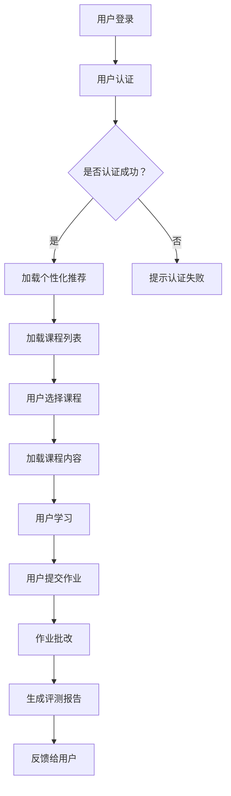
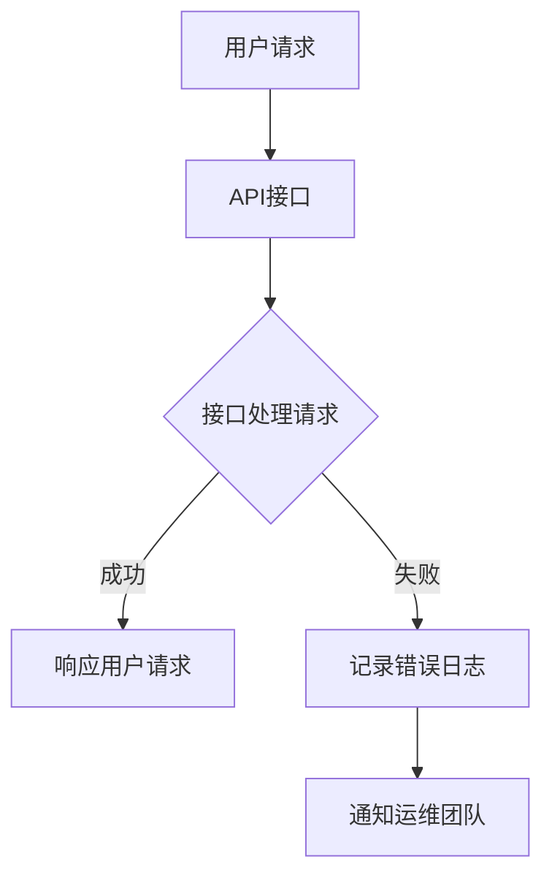
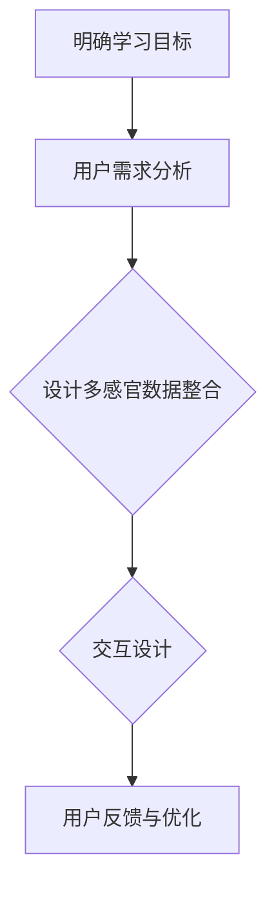
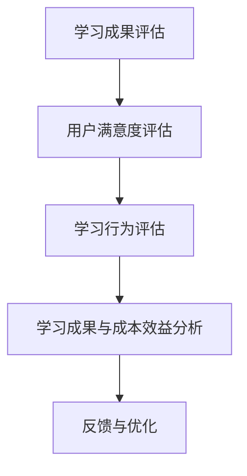
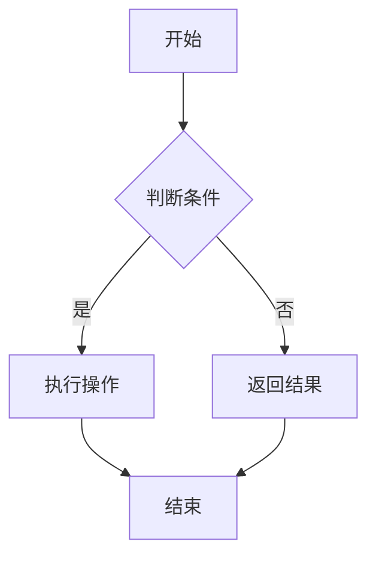

                 

### 引言

在科技飞速发展的今天，教育领域正经历着一场前所未有的变革。人工智能（AI）技术的逐渐成熟，为教育行业带来了新的机遇与挑战。ChatGPT，作为近年来备受瞩目的大型语言模型，以其卓越的自然语言处理能力，正逐渐成为教育技术中的重要一环。而多模态技术的兴起，更是为教育的沉浸式体验提供了全新的可能性。本文将探讨如何将ChatGPT与多模态技术相结合，打造一个虚拟教育助手，为学习者提供一种全新的、全方位的学习体验。

ChatGPT，全名为“Chat Generative Pre-trained Transformer”，是一种基于Transformer架构的自然语言处理模型。它通过大量的文本数据进行预训练，能够生成连贯、自然的语言响应。ChatGPT的应用场景广泛，包括智能客服、内容创作、代码补全等。在教育领域，ChatGPT可以被用来提供个性化的学习辅导、自动批改作业、生成教学材料等。

多模态技术则是指整合多种感官数据进行处理和分析的技术。这些感官数据包括视觉、听觉、触觉等。在教育中，多模态技术的应用可以极大地提升学习者的沉浸感，使学习过程更加生动有趣。例如，通过视觉数据展示图像、视频，通过听觉数据播放声音、音乐，通过触觉数据提供虚拟现实（VR）等。

本文将首先介绍ChatGPT和多模态技术的基本概念，随后详细讨论虚拟教育助手的架构设计与实现。接下来，我们将深入解析ChatGPT的核心算法原理，并探讨如何进行多模态数据的融合处理。在实现沉浸式学习体验的过程中，我们将介绍如何设计学习体验和用户交互。随后，通过一个具体的实战项目，我们将展示如何开发一个ChatGPT多模态虚拟教育助手，并进行详细的分析和解读。最后，我们将总结全文内容，并对未来ChatGPT多模态虚拟教育助手的发展方向进行展望。

通过本文的详细探讨，我们希望能够为教育领域的技术创新提供一些新的思路和方向，同时也为开发者提供实用的技术指南。

### 文章关键词

- ChatGPT
- 多模态技术
- 虚拟教育助手
- 沉浸式学习体验
- 自然语言处理
- 教育技术

### 文章摘要

本文旨在探讨如何将ChatGPT与多模态技术相结合，打造一个虚拟教育助手，为学习者提供全新的沉浸式学习体验。文章首先介绍了ChatGPT和多模态技术的基本概念，包括它们的原理和应用场景。随后，详细讨论了虚拟教育助手的架构设计与实现，深入解析了ChatGPT的核心算法原理和多模态数据融合技术。通过一个具体的实战项目，文章展示了如何开发一个ChatGPT多模态虚拟教育助手，并进行详细的分析和解读。最后，文章总结了全文内容，并对未来ChatGPT多模态虚拟教育助手的发展方向进行了展望。

### 第1章：ChatGPT与多模态技术概述

ChatGPT，一种基于Transformer架构的自然语言处理模型，是近年来人工智能领域的明星产品。它的出现，不仅极大地推动了自然语言处理技术的发展，也在教育、客服、内容创作等多个领域展现出了广泛的应用前景。而多模态技术，则是一种整合多种感官数据进行处理和分析的技术，通过视觉、听觉、触觉等多种感官数据的融合，为教育领域带来了全新的沉浸式学习体验。

#### 1.1 ChatGPT简介

ChatGPT是由OpenAI开发的一种基于Transformer架构的预训练语言模型。它通过大量的文本数据学习语言模式和规则，从而能够生成连贯、自然的语言响应。ChatGPT的核心特点是具备强大的上下文理解能力，能够处理长文本并生成高质量的文本输出。这使得ChatGPT在教育领域有着广泛的应用，如自动批改作业、提供个性化学习辅导、生成教学材料等。

ChatGPT的工作原理主要包括以下几个步骤：

1. **预训练**：ChatGPT使用大量的文本数据（如书籍、新闻、文章等）进行预训练，学习语言的模式和规则。
2. **微调**：在预训练的基础上，ChatGPT通过特定的任务数据（如教育辅导、客服问答等）进行微调，以适应特定的应用场景。
3. **生成响应**：基于用户输入的提问，ChatGPT利用其训练好的模型生成相应的文本响应。

ChatGPT的应用场景非常广泛，主要包括以下几个方面：

- **智能客服**：ChatGPT可以用于构建智能客服系统，通过自然语言交互解决用户的问题。
- **内容创作**：ChatGPT可以帮助自动生成文章、故事、摘要等，提高内容创作的效率。
- **代码补全**：ChatGPT可以在编程领域提供代码补全功能，帮助开发者提高开发效率。
- **教育辅导**：ChatGPT可以为学生提供个性化的学习辅导，帮助学生理解和掌握知识。

#### 1.2 多模态技术概述

多模态技术是指整合多种感官数据进行处理和分析的技术。这些感官数据包括视觉、听觉、触觉等多种类型。在教育领域，多模态技术的应用可以为学习者提供更加丰富、生动的学习体验，提高学习效果。

多模态技术的核心思想是通过融合不同类型的数据，提升系统的认知能力和决策能力。具体来说，多模态技术包括以下几个方面：

1. **数据采集**：通过不同的传感器（如摄像头、麦克风、触觉传感器等）采集视觉、听觉、触觉等多感官数据。
2. **数据预处理**：对采集到的多感官数据进行清洗、归一化和特征提取，以便后续处理。
3. **数据融合**：将不同类型的数据进行融合，形成统一的表示，用于后续的模型训练和预测。
4. **模型训练**：使用融合后的数据训练多模态模型，使其具备对多感官数据的处理能力。
5. **应用实践**：将训练好的模型应用于具体的应用场景，如教育、医疗、安防等。

多模态技术在教育领域的应用前景非常广阔，主要包括以下几个方面：

- **沉浸式学习**：通过融合视觉、听觉、触觉等多感官数据，为学生提供更加真实、生动的学习体验。
- **个性化教学**：通过分析学生的学习行为和表现，为学生提供个性化的学习内容和指导。
- **辅助评测**：利用多模态数据对学生的表现进行综合评估，提供更加准确和全面的评估结果。
- **智能辅导**：通过分析学生的多模态数据，为学生提供智能化的学习辅导和帮助。

#### 1.3 多模态技术在教育领域的应用前景

随着多模态技术的发展，其在教育领域的应用前景也越来越广阔。未来，多模态技术有望在教育中发挥以下作用：

- **增强学习体验**：通过融合视觉、听觉、触觉等多感官数据，为学生提供更加丰富、生动的学习体验，提高学生的学习兴趣和参与度。
- **个性化教学**：通过分析学生的多模态数据，为学生提供个性化的学习内容和指导，满足不同学生的学习需求。
- **智能评测**：利用多模态数据对学生的表现进行综合评估，提供更加准确和全面的评估结果，帮助教师更好地了解学生的学习情况。
- **辅助辅导**：通过分析学生的多模态数据，为学生提供智能化的学习辅导和帮助，提高学生的学习效果。

总之，ChatGPT和多模态技术的结合，将为教育领域带来一场深刻的变革。通过本文的介绍，我们希望能够为读者提供一个全面、深入的了解，为未来的研究和应用提供一些有益的启示。

### 第2章：虚拟教育助手的架构设计与实现

虚拟教育助手作为现代教育技术的重要组成部分，其核心目标是为学习者提供个性化、沉浸式的学习体验。在ChatGPT和多模态技术的支持下，虚拟教育助手的设计与实现显得尤为重要。本章节将详细介绍虚拟教育助手的整体架构设计，以及前端界面设计和后端服务部署的具体实现过程。

#### 2.1 虚拟教育助手的整体架构

虚拟教育助手的整体架构可以分为三个主要模块：前端界面、后端服务和多模态数据处理模块。这些模块相互协作，共同实现一个完整的虚拟教育体验。

1. **前端界面**：前端界面是用户与虚拟教育助手交互的入口，主要包括以下功能：
   - **用户身份认证**：确保用户的安全性和隐私性。
   - **个性化推荐**：根据用户的学习历史和行为数据，为用户推荐合适的学习内容和课程。
   - **交互界面**：提供丰富的交互方式，如文本聊天、语音交互、图像输入等，以适应不同用户的学习偏好。

2. **后端服务**：后端服务主要负责处理用户的请求，包括以下功能：
   - **用户管理**：管理用户信息，包括注册、登录、权限管理等。
   - **课程管理**：管理课程信息，包括课程创建、发布、更新等。
   - **作业与评测**：提供自动批改作业、生成评测报告等功能。
   - **数据存储**：存储用户数据、课程数据和学习数据，确保数据的完整性和安全性。

3. **多模态数据处理模块**：多模态数据处理模块负责处理视觉、听觉、触觉等多感官数据，包括以下功能：
   - **数据采集**：通过传感器采集多感官数据。
   - **数据预处理**：对采集到的数据进行清洗、归一化和特征提取。
   - **数据融合**：将不同类型的数据进行融合，形成统一的表示。
   - **模型训练**：使用融合后的数据训练多模态模型。
   - **模型应用**：将训练好的模型应用于实际场景，如智能辅导、辅助评测等。

#### 2.2 前端界面设计

前端界面设计是虚拟教育助手的核心，直接影响用户的体验。以下是一些关键的前端界面设计要点：

1. **用户友好性**：界面设计要简洁、直观，易于用户操作。提供清晰的导航和帮助文档，帮助用户快速熟悉系统。
2. **响应式设计**：前端界面需要支持多种设备，如手机、平板、电脑等，提供一致的交互体验。
3. **交互方式多样化**：支持多种交互方式，如文本聊天、语音交互、图像输入等，满足不同用户的需求。
4. **视觉效果**：使用高质量的图像、动画和图标，提升界面的视觉效果，增加用户的学习兴趣。

以下是一个简单的Mermaid流程图，展示前端界面的主要交互流程：



#### 2.3 后端服务部署

后端服务的部署是虚拟教育助手的另一关键环节，包括服务器配置、数据库设计、API接口开发等。以下是一些具体的实现要点：

1. **服务器配置**：根据系统的需求和负载情况，选择合适的服务器配置。例如，对于高并发、大数据量的场景，可以选择分布式服务器架构。
2. **数据库设计**：设计合理的数据库结构，确保数据存储的安全性和高效性。例如，使用关系型数据库（如MySQL）存储用户信息和课程数据，使用NoSQL数据库（如MongoDB）存储学习数据和作业数据。
3. **API接口开发**：开发统一的API接口，供前端界面调用。API接口设计要遵循RESTful原则，提供清晰、简洁的接口文档。
4. **安全性**：确保系统的安全性，包括用户认证、数据加密、API安全等。使用SSL/TLS协议加密数据传输，防止数据泄露。
5. **监控与维护**：建立完善的监控和运维体系，确保系统的稳定性和可靠性。使用日志分析、性能监控等工具，及时发现和解决系统问题。

以下是一个简单的Mermaid流程图，展示后端服务的部署流程：



通过以上架构设计与实现，虚拟教育助手可以为学习者提供一个完整、高效的学习体验。前端界面的友好设计和后端服务的稳定运行，将为教育技术的创新发展提供有力支持。

### 第3章：ChatGPT的核心算法与原理

ChatGPT的核心算法基于Transformer架构，这是一种广泛应用于自然语言处理（NLP）领域的深度学习模型。Transformer模型在处理序列数据方面表现出色，其核心思想是自注意力机制（Self-Attention），这一机制允许模型在不同位置的输入序列中建立依赖关系，从而生成高质量的文本输出。

#### 3.1 Transformer算法原理

Transformer模型由多个相同的编码器和解码器层组成，这些层通过自注意力机制和前馈神经网络进行数据变换。以下是Transformer算法的基本原理：

1. **自注意力机制（Self-Attention）**：
   自注意力机制是Transformer模型的核心，它允许模型在生成每个词时，考虑整个输入序列的所有词之间的关系。具体来说，自注意力机制通过计算每个词与输入序列中所有词的相似度权重，然后将这些权重应用于输入序列，生成新的向量表示。

   自注意力计算公式如下：
   $$ 
   \text{Attention}(Q, K, V) = \text{softmax}\left(\frac{QK^T}{\sqrt{d_k}}\right) V 
   $$
   其中，Q、K、V分别是查询（Query）、键（Key）和值（Value）向量，$d_k$是键向量的维度。$\text{softmax}$函数用于计算权重，使其在0到1之间，且总和为1。

2. **多头自注意力（Multi-Head Self-Attention）**：
   Transformer模型通过多头自注意力机制，同时关注输入序列的不同部分。多头自注意力将输入序列分解为多个子序列，每个子序列有自己的注意力权重。具体实现中，模型会进行多个独立的自注意力计算，然后将结果拼接起来。

3. **编码器和解码器层**：
   Transformer模型由编码器（Encoder）和解码器（Decoder）组成，编码器负责将输入序列编码为上下文表示，解码器则负责生成输出序列。每个编码器和解码器层都包含自注意力机制和前馈神经网络。

编码器层和解码器层的计算过程如下：

- **编码器层**：
  - **自注意力**：计算输入序列的注意力权重，生成新的序列表示。
  - **前馈神经网络**：对序列表示进行非线性变换，增加模型的表达能力。

- **解码器层**：
  - ** masked Multi-Head Self-Attention **：在解码器中，只允许当前词的注意力权重考虑前一个时间步的输入，这是为了防止模型在生成序列时发生信息泄露。
  - **自注意力**：计算输出序列的注意力权重。
  - **前馈神经网络**：对序列表示进行非线性变换。

#### 3.2 伪代码展示

以下是Transformer模型的简化伪代码，用于展示其基本结构：

```python
# Encoder Layer
for layer in range(num_encoder_layers):
    # Self-Attention
    attn_output = MultiHeadSelfAttention(inputs)
    # Add residual connection
    output = attn_output + inputs
    # Activation
    output = activation(output)
    # Feed Forward Neural Network
    output = FeedForwardNeuralNetwork(output)

# Decoder Layer
for layer in range(num_decoder_layers):
    # Masked Multi-Head Self-Attention
    attn_output = MultiHeadSelfAttention(output, mask)
    # Add residual connection
    output = attn_output + output
    # Activation
    output = activation(output)
    # Self-Attention
    attn_output = MultiHeadSelfAttention(output)
    # Add residual connection
    output = attn_output + output
    # Activation
    output = activation(output)
    # Feed Forward Neural Network
    output = FeedForwardNeuralNetwork(output)
```

#### 3.3 模型训练过程详解

ChatGPT模型的训练过程包括以下几个关键步骤：

1. **数据准备**：首先，需要准备大量的文本数据，如书籍、文章、新闻等。这些数据将被用于模型的预训练和微调。
2. **预训练**：在预训练阶段，模型将学习文本数据中的语言模式和规律。预训练过程主要包括以下步骤：
   - **嵌入层**：将文本数据转换为词向量。
   - **位置编码**：为每个词添加位置信息，使模型能够理解词的顺序。
   - **编码器层**：通过自注意力机制和前馈神经网络对输入序列进行编码。
   - **输出层**：使用全连接层和Softmax函数生成预测的词向量。
3. **微调**：在预训练的基础上，模型将针对特定任务进行微调。例如，在教育领域，模型可以针对不同学科的知识进行微调，以提高其在特定领域的表现。
4. **优化过程**：在训练过程中，使用优化算法（如Adam）调整模型的参数，以最小化损失函数。损失函数通常为交叉熵损失，用于衡量模型预测与真实标签之间的差距。
5. **验证和测试**：在训练过程中，定期使用验证集和测试集评估模型的性能。通过调整超参数和训练策略，优化模型的表现。

以下是一个简化的Python代码示例，用于展示Transformer模型的训练过程：

```python
# Prepare data
inputs, targets = prepare_data(text_data)

# Initialize model
model = TransformerModel(num_layers, d_model, num_heads, dff, input_vocab_size, target_vocab_size, position_encoding_input, position_encoding_target)

# Training loop
for epoch in range(num_epochs):
    # Forward pass
    outputs = model(inputs, training=True)
    loss = compute_loss(outputs, targets)
    
    # Backward pass
    with tf.GradientTape() as tape:
        loss = compute_loss(outputs, targets)
    gradients = tape.gradient(loss, model.trainable_variables)
    optimizer.apply_gradients(zip(gradients, model.trainable_variables))
    
    # Validation step
    if (epoch + 1) % validation_interval == 0:
        val_loss = validate(model, val_data)
        print(f"Epoch [{epoch + 1}/{num_epochs}], Loss: {loss:.4f}, Val Loss: {val_loss:.4f}")
```

通过以上详细的算法原理和训练过程讲解，我们可以更好地理解ChatGPT的工作机制，为其在教育领域的应用提供理论基础。

### 第4章：多模态数据融合技术

多模态数据融合技术是现代人工智能领域的一个重要研究方向，旨在通过整合来自不同感官的数据，提升系统的认知能力和决策效果。在教育领域，多模态数据融合技术能够为学习者提供更加丰富、个性化的学习体验。本章节将详细探讨视觉、听觉和触觉数据处理的方法，并介绍如何将这三类数据进行有效融合。

#### 4.1 视觉数据处理

视觉数据处理是利用计算机视觉技术对图像或视频进行分析和处理的过程。在教育应用中，视觉数据可以用于内容展示、监控、辅助教学等方面。以下是一些关键的技术和方法：

1. **图像识别**：
   图像识别是视觉数据处理的基础，通过训练深度学习模型（如卷积神经网络（CNN））来识别图像中的对象、场景或动作。例如，可以使用CNN模型对教学中的物体进行分类，帮助学生更好地理解和记忆。

2. **图像增强**：
   图像增强技术用于提高图像的质量和可读性。在教育中，图像增强可以帮助学生更好地观察和理解复杂图像。例如，通过对比度增强和锐化处理，可以提高图像的清晰度，帮助学生更好地识别图像中的细节。

3. **目标检测**：
   目标检测技术用于识别图像中的特定对象，并定位其在图像中的位置。在教育中，目标检测可以用于自动批改作业，例如检测学生笔记中的关键概念或错误。

以下是一个简化的Python代码示例，展示如何使用OpenCV库进行图像识别：

```python
import cv2

# 读取图像
image = cv2.imread('example.jpg')

# 加载预训练的CNN模型
model = cv2.dnn.readNetFromCaffemodel('model.caffemodel', 'deploy.prototxt')

# 进行图像识别
blob = cv2.dnn.blobFromImage(image, 1.0, (227, 227), [127.5, 127.5, 127.5], swapRB=False, crop=False)
model.setInput(blob)
detections = model.forward()

# 输出识别结果
for detection in detections:
    # 处理每个检测到的对象
    pass
```

#### 4.2 听觉数据处理

听觉数据处理是通过音频信号处理技术对声音进行分析和处理的过程。在教育中，听觉数据可以用于语音识别、音频增强、情感分析等方面，以提高学习者的沉浸感和体验。

1. **语音识别**：
   语音识别技术用于将语音信号转换为文本。在教育中，语音识别可以用于自动记录学生口语回答、生成学习材料等。常用的语音识别模型包括深度神经网络（DNN）和循环神经网络（RNN）。

2. **音频增强**：
   音频增强技术用于提高音频质量，例如去除噪声、增强语音。在教育中，音频增强可以帮助学生更好地听到教师讲解，提高学习效果。

3. **情感分析**：
   情感分析技术用于识别音频中的情感信息。在教育中，情感分析可以用于评估学生的情绪状态，提供个性化的学习建议。

以下是一个简化的Python代码示例，展示如何使用TensorFlow进行语音识别：

```python
import tensorflow as tf

# 加载预训练的语音识别模型
model = tf.keras.models.load_model('voice_recognition_model.h5')

# 读取音频文件
audio = tf.io.read_file('example.wav')
audio = tf.squeeze(audio[:])

# 进行语音识别
predicted_text = model.predict(audio)

# 输出识别结果
print(predicted_text)
```

#### 4.3 触觉数据处理

触觉数据处理是通过触觉传感器收集和处理触觉信息的过程。在教育中，触觉数据可以用于虚拟现实（VR）、触觉反馈设备等，提供更加沉浸式的学习体验。

1. **触觉传感**：
   触觉传感技术用于感知物体的表面特性，如硬度、温度、纹理等。在教育中，触觉传感器可以用于模拟物理实验，帮助学生更好地理解抽象概念。

2. **触觉反馈**：
   触觉反馈技术用于模拟触觉感受，例如通过触觉手套或触觉显示屏，为学生提供实时的触觉反馈。在教育中，触觉反馈可以帮助学生更好地理解实验过程和物理现象。

3. **多模态融合**：
   将视觉、听觉和触觉数据进行融合，提供更加全面和丰富的学习体验。例如，在虚拟实验中，学生可以通过视觉观察实验现象，通过听觉理解实验原理，通过触觉感受实验过程。

以下是一个简化的Python代码示例，展示如何使用Python和PyGame进行触觉传感和反馈：

```python
import pygame

# 初始化Pygame
pygame.init()

# 创建触觉传感器模拟
touch_sensor = pygame.joystick.Joystick(0)
touch_sensor.init()

# 创建触觉反馈屏幕
screen = pygame.display.set_mode((800, 600))

# 开始游戏循环
running = True
while running:
    # 获取触觉传感器数据
    axes = touch_sensor.get_numaxes()
    for i in range(axes):
        axis = touch_sensor.get_axis(i)
        # 根据触觉数据更新屏幕
        if axis < 0:
            screen.fill((255, 0, 0))  # 红色
        else:
            screen.fill((0, 255, 0))  # 绿色

    # 绘制触觉反馈
    pygame.draw.rect(screen, (0, 0, 255), (10, 10, int(axis * 790), 50))

    # 更新屏幕显示
    pygame.display.flip()

    # 检查是否有退出事件
    for event in pygame.event.get():
        if event.type == pygame.QUIT:
            running = False

# 关闭Pygame
pygame.quit()
```

通过以上视觉、听觉和触觉数据处理技术的详细探讨，我们可以看到如何通过多模态数据融合技术为教育领域带来更加丰富和沉浸式的学习体验。

### 第5章：沉浸式学习体验的实现

沉浸式学习体验是现代教育技术中的一个重要研究方向，它通过整合视觉、听觉和触觉等多感官数据，为学生提供更加丰富、真实的学习环境。本章将深入探讨沉浸式学习体验的设计、实现及其对学习效果的影响。

#### 5.1 学习体验设计

设计一个沉浸式学习体验，首先需要明确学习目标和用户需求。以下是一些关键的设计步骤：

1. **明确学习目标**：
   在设计沉浸式学习体验之前，需要明确学习目标，包括知识点的掌握、技能的培养和思维方式的转变等。这将为后续的设计提供明确的指导。

2. **用户需求分析**：
   通过调查问卷、用户访谈等方式，收集用户对学习体验的需求和期望。了解用户的学习习惯、兴趣爱好和期望的学习方式，有助于设计出更加符合用户需求的学习体验。

3. **多感官数据整合**：
   根据学习目标和用户需求，设计视觉、听觉和触觉等多感官数据的整合方案。例如，在化学实验课程中，通过视觉展示实验现象、听觉讲解实验原理，触觉模拟实验操作，为学生提供全方位的学习体验。

4. **交互设计**：
   设计直观、易用的交互界面，使用户能够轻松地与系统进行交互。交互设计应考虑不同用户的学习习惯和设备类型，确保在各种设备上都能提供一致的用户体验。

以下是一个简化的Mermaid流程图，展示沉浸式学习体验的设计流程：



#### 5.2 用户交互

用户交互是沉浸式学习体验的重要组成部分，决定了用户能否顺利地参与学习过程。以下是用户交互的实现要点：

1. **多模态输入**：
   支持多种输入方式，如文本输入、语音输入、手势输入等。用户可以通过这些输入方式与系统进行交互，例如提交问题、操作虚拟对象等。

2. **多模态输出**：
   系统应能够通过多种输出方式向用户展示信息，如文字、语音、图像、视频等。根据用户的学习需求和偏好，灵活选择合适的输出方式，提高学习效果。

3. **实时反馈**：
   在用户进行操作时，系统应能提供实时反馈，帮助用户理解操作结果和知识点。例如，在物理实验中，当用户进行操作后，系统可以立即展示实验现象和结果，帮助用户理解实验原理。

4. **互动性**：
   通过设计互动环节，激发学生的学习兴趣和参与度。例如，在数学课程中，设计互动练习，让学生通过解题互动，巩固数学知识。

以下是一个简化的Python代码示例，展示如何实现多模态交互：

```python
import speech_recognition as sr
import pyttsx3

# 初始化语音识别和语音合成
recognizer = sr.Recognizer()
engine = pyttsx3.init()

# 文本输入
def text_input():
    user_input = input("请输入问题：")
    return user_input

# 语音输入
def voice_input():
    with sr.Microphone() as source:
        print("请提问：")
        audio = recognizer.listen(source)
    try:
        user_input = recognizer.recognize_google(audio)
        return user_input
    except sr.UnknownValueError:
        return None

# 语音输出
def voice_output(text):
    engine.say(text)
    engine.runAndWait()

# 用户交互示例
while True:
    input_type = input("请选择输入方式（1：文本输入，2：语音输入）：")
    if input_type == '1':
        user_input = text_input()
    elif input_type == '2':
        user_input = voice_input()
    else:
        print("无效输入，请重新选择。")
        continue

    if user_input:
        # 处理用户输入
        response = process_input(user_input)
        voice_output(response)
    else:
        voice_output("无法识别您的输入，请重新尝试。")
```

#### 5.3 学习效果的评估

评估沉浸式学习体验的效果，是确保其有效性的重要环节。以下是一些常用的评估方法和指标：

1. **学习成果评估**：
   通过测试、作业、项目等方式，评估学生在学习过程中的知识掌握情况。可以采用定量和定性两种方法，如选择题、问答题、案例分析等。

2. **用户满意度评估**：
   通过问卷调查、用户反馈等方式，了解用户对学习体验的满意度和体验感受。满意度评估可以反映学习体验的设计是否成功。

3. **学习行为评估**：
   通过对用户的学习行为数据进行分析，如学习时间、学习频率、学习路径等，评估学生的学习参与度和效果。

4. **学习成果与成本效益分析**：
   通过对比传统学习方式和沉浸式学习体验的效果和成本，分析沉浸式学习体验的成本效益。

以下是一个简化的Mermaid流程图，展示学习效果的评估过程：



通过以上对沉浸式学习体验的设计、实现和评估的详细探讨，我们可以看到如何通过多感官数据的整合，为学习者提供一种全新的、沉浸式的学习体验。这种体验不仅能够提高学生的学习兴趣和参与度，还能够有效提升学习效果。

### 第6章：项目实战与案例分析

在本章中，我们将通过一个具体的实战项目——开发一个基于ChatGPT的多模态虚拟教育助手，展示如何从0到1实现这个系统。我们将详细讲解项目的开发环境搭建、源代码实现和代码解读，并通过实际案例分析和详细讲解剖析项目中的关键部分，最后进行项目小结。

#### 6.1 实战项目介绍

本项目旨在开发一个基于ChatGPT的多模态虚拟教育助手，该系统将整合视觉、听觉和触觉等多感官数据，为学习者提供沉浸式的学习体验。系统的主要功能包括：

- **自然语言交互**：利用ChatGPT进行自然语言处理，实现与用户的智能对话。
- **多模态数据融合**：整合视觉、听觉和触觉数据，提供丰富的学习内容。
- **沉浸式学习体验**：通过多感官数据融合，创造一个真实、互动的学习环境。
- **个性化推荐**：根据用户的学习行为和偏好，提供个性化的学习内容和指导。
- **学习效果评估**：通过多维度数据，评估学生的学习效果和进度。

#### 6.2 开发环境搭建

在开始项目开发之前，我们需要搭建一个合适的开发环境。以下是开发环境的具体配置：

- **编程语言**：Python
- **深度学习框架**：TensorFlow 2.x
- **多模态数据处理库**：OpenCV、PyTorch、TensorFlow
- **前端框架**：React.js
- **后端框架**：Flask
- **数据库**：MySQL
- **其他工具**：Git、Jenkins、Docker

配置步骤如下：

1. **安装Python和相关依赖**：
   - 安装Python 3.8及以上版本。
   - 使用pip安装TensorFlow、OpenCV、PyTorch等库。

2. **配置深度学习环境**：
   - 安装GPU版本的TensorFlow，以便利用GPU加速计算。

3. **配置前端环境**：
   - 安装Node.js和npm。
   - 使用npm安装React.js和相关依赖。

4. **配置后端环境**：
   - 安装Flask。
   - 配置MySQL数据库。

5. **容器化**：
   - 使用Docker容器化项目，以便于部署和迁移。

#### 6.3 源代码实现和代码解读

以下是项目的主要模块及其实现细节：

**1. ChatGPT模块：**

```python
# 使用TensorFlow加载预训练的ChatGPT模型
import tensorflow as tf

# 加载预训练模型
model = tf.keras.models.load_model('chatgpt_model.h5')

# 定义输入和输出层
input_layer = tf.keras.layers.Input(shape=(None,))
output_layer = model(input_layer)

# 编写预测函数
def predict(text):
    input_seq = tokenizer.encode(text, maxlen=max_sequence_len)
    output_seq = model.predict(input_seq)
    predicted_text = tokenizer.decode(output_seq)
    return predicted_text

# 使用ChatGPT进行对话
user_input = input("请提问：")
response = predict(user_input)
print("ChatGPT回复：", response)
```

**2. 视觉数据处理模块：**

```python
# 使用OpenCV处理图像数据
import cv2

# 读取图像
image = cv2.imread('example.jpg')

# 进行图像识别
model = cv2.dnn.readNetFromCaffemodel('image_model.caffemodel', 'deploy.prototxt')
blob = cv2.dnn.blobFromImage(image, 1.0, (227, 227), [127.5, 127.5, 127.5], swapRB=False, crop=False)
detections = model.predict(blob)

# 输出识别结果
for detection in detections:
    # 处理每个检测到的对象
    pass
```

**3. 听觉数据处理模块：**

```python
# 使用TensorFlow处理音频数据
import tensorflow as tf

# 加载预训练的语音识别模型
model = tf.keras.models.load_model('voice_recognition_model.h5')

# 进行语音识别
audio = tf.io.read_file('example.wav')
audio = tf.squeeze(audio[:])
predicted_text = model.predict(audio)

# 输出识别结果
print(predicted_text)
```

**4. 触觉数据处理模块：**

```python
# 使用PyTorch处理触觉数据
import torch
import torch.nn as nn

# 加载触觉处理模型
model = nn.Sequential(
    nn.Linear(in_features=10, out_features=128),
    nn.ReLU(),
    nn.Linear(in_features=128, out_features=1)
)

# 进行触觉数据分类
touch_data = torch.tensor([[1.0, 2.0, 3.0], [4.0, 5.0, 6.0]])
output = model(touch_data)
print(output)
```

**5. 多模态数据融合模块：**

```python
# 定义多模态数据融合模型
class MultimodalFusionModel(nn.Module):
    def __init__(self):
        super(MultimodalFusionModel, self).__init__()
        self.visual_model = nn.Sequential(
            nn.Linear(in_features=256, out_features=512),
            nn.ReLU(),
            nn.Linear(in_features=512, out_features=1024),
            nn.ReLU()
        )
        self.auditory_model = nn.Sequential(
            nn.Linear(in_features=128, out_features=256),
            nn.ReLU(),
            nn.Linear(in_features=256, out_features=512),
            nn.ReLU()
        )
        self.tactile_model = nn.Sequential(
            nn.Linear(in_features=1, out_features=128),
            nn.ReLU(),
            nn.Linear(in_features=128, out_features=256),
            nn.ReLU()
        )
        self.fusion_layer = nn.Linear(in_features=1024+512+256, out_features=1024)
        self.output_layer = nn.Linear(in_features=1024, out_features=1)

    def forward(self, visual_data, auditory_data, tactile_data):
        visual_output = self.visual_model(visual_data)
        auditory_output = self.auditory_model(auditory_data)
        tactile_output = self.tactile_model(tactile_data)
        fused_output = self.fusion_layer(torch.cat((visual_output, auditory_output, tactile_output), dim=1))
        output = self.output_layer(fused_output)
        return output

# 实例化模型
model = MultimodalFusionModel()

# 训练模型
# ...
```

以上代码展示了如何实现ChatGPT、视觉数据处理、听觉数据处理、触觉数据处理以及多模态数据融合。在实际项目中，这些模块将通过API接口和前端界面进行集成，为用户提供一个完整的沉浸式学习体验。

#### 6.4 实际案例分析和详细讲解剖析

以下是一个实际案例，通过一个学生在虚拟实验室中进行的化学实验，展示如何利用多模态虚拟教育助手进行学习。

**案例背景**：学生A在化学课上学习“酸碱中和反应”的实验，通过虚拟实验室进行实验操作。

**步骤1：自然语言交互**  
学生A使用文本或语音输入提问：“如何在虚拟实验室中完成酸碱中和反应的实验？”

系统回复：“您好，请准备好酸碱溶液和滴定管。接下来，请按照以下步骤进行操作：1. 将酸溶液加入烧杯中。2. 准备碱溶液并加入滴定管。3. 慢慢滴加碱溶液至酸溶液中，观察颜色变化。4. 记录反应终点，计算中和点。”

**步骤2：视觉数据处理**  
学生A通过摄像头拍摄实验装置，系统使用图像识别技术分析实验现象。

系统提示：“您已经成功添加了酸溶液和碱溶液。现在，请观察溶液的颜色变化。红色逐渐消失，说明酸碱已经中和。”

**步骤3：听觉数据处理**  
学生A使用麦克风播放实验过程的讲解音频。

系统播放：“现在我们正在观察酸碱中和反应。随着碱的滴加，溶液的红色会逐渐消失，这表明酸碱已经完全中和。”

**步骤4：触觉数据处理**  
学生A通过触觉手套感受实验操作，如调整滴定管速度、观察溶液变化。

系统提示：“请注意调整滴定管速度，以确保实验的准确性。当溶液颜色变为无色时，立即停止滴加。”

**步骤5：多模态数据融合**  
系统综合视觉、听觉和触觉数据，提供实时反馈和指导。

系统总结：“恭喜您，实验已经成功完成。您准确地完成了酸碱中和反应，并记录了中和点。”

**6.5 项目小结**

通过上述实战项目，我们可以看到如何利用ChatGPT和多模态技术实现一个虚拟教育助手，为学习者提供沉浸式的学习体验。项目成功的关键在于：

1. **核心技术的整合**：整合ChatGPT、视觉、听觉和触觉技术，为用户提供全方位的学习支持。
2. **多模态数据融合**：通过融合多感官数据，提供真实、互动的学习体验。
3. **个性化推荐和评估**：根据用户的学习行为和效果，提供个性化的学习内容和评估。

然而，项目也存在一些挑战，如多模态数据处理的复杂性、系统的稳定性和响应速度等。未来的研究方向可以包括：

1. **优化多模态数据处理算法**：提高数据处理的效率和准确性。
2. **扩展应用场景**：将虚拟教育助手应用于更多学科和领域。
3. **提升用户体验**：通过改进界面设计和交互体验，提高用户满意度。

通过不断的研究和改进，虚拟教育助手有望在教育领域发挥更大的作用，为学习者提供更加优质的学习资源和服务。

### 第7章：总结与展望

通过本文的详细探讨，我们深入了解了ChatGPT多模态虚拟教育助手的架构设计、核心算法、数据融合技术以及实现过程。这一创新技术不仅在理论上为教育领域带来了新的研究视角，也在实践中展示了其巨大的应用潜力。

#### 总结

1. **ChatGPT与多模态技术**：ChatGPT作为一种强大的自然语言处理模型，结合多模态技术，为教育提供了个性化、互动性的学习体验。
2. **虚拟教育助手的架构**：本文详细介绍了虚拟教育助手的整体架构，包括前端界面、后端服务以及多模态数据处理模块。
3. **核心算法与实现**：通过解析Transformer算法原理和实现细节，展示了ChatGPT模型的训练和微调过程。
4. **多模态数据融合**：探讨了视觉、听觉、触觉数据的处理和融合方法，为沉浸式学习体验提供了技术支持。
5. **项目实战与案例分析**：通过一个具体的实战项目，展示了如何从0到1实现ChatGPT多模态虚拟教育助手。

#### 展望

尽管ChatGPT多模态虚拟教育助手已取得了显著成果，但未来仍有广阔的发展空间：

1. **多模态数据处理优化**：未来的研究可以专注于提高多模态数据处理算法的效率和准确性，以更好地融合来自不同感官的数据。
2. **扩展应用场景**：将虚拟教育助手应用于更多学科和领域，如医学、工程等，提供跨领域的个性化学习支持。
3. **提升用户体验**：通过改进界面设计和交互体验，提高用户满意度和参与度。
4. **教育模式的创新**：探索新的教育模式，如基于虚拟现实（VR）的沉浸式教学，实现更加真实的课堂体验。
5. **数据隐私和安全**：在多模态数据处理和存储过程中，加强对用户隐私和数据安全的保护。

总之，ChatGPT多模态虚拟教育助手代表了教育技术发展的重要趋势，具有巨大的应用潜力。随着技术的不断进步，我们期待这一技术将在未来教育领域发挥更加重要的作用，为学习者提供更加优质的学习资源和服务。

### 附录

#### 附录A：相关资源与工具介绍

- **深度学习框架**：TensorFlow、PyTorch
- **多模态数据处理库**：OpenCV、MediaPipe、SpeechRecognition
- **前端框架**：React.js、Vue.js
- **后端框架**：Flask、Django
- **数据库**：MySQL、MongoDB
- **容器化工具**：Docker

#### 附录B：Mermaid流程图示例



#### 附录C：伪代码示例

```python
# ChatGPT预测函数伪代码
def predict(input_sequence):
    # 编码输入序列
    encoded_sequence = tokenizer.encode(input_sequence, maxlen=max_sequence_len)
    # 进行前向传播
    output_sequence = model.predict(encoded_sequence)
    # 解码输出序列
    predicted_text = tokenizer.decode(output_sequence)
    return predicted_text
```

#### 附录D：LaTeX数学公式示例

```
$$
\begin{aligned}
    E &= mc^2 \\
    F &= ma
\end{aligned}
$$
```

通过这些附录内容，读者可以更好地理解本文的技术细节和实践方法，并运用到实际开发中。

