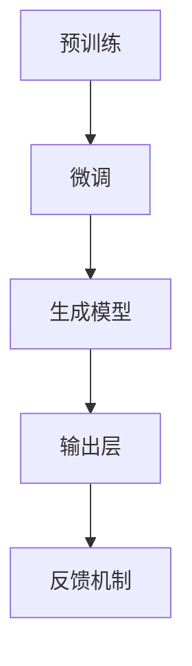
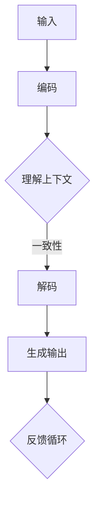

                 


## 《ChatGPT定制化输出：Self-Consistency CoT技巧》

### 关键词：
- ChatGPT
- 自一致性（Self-Consistency）
- CoT（Conceptual Transparency）
- 定制化输出
- 技术实战

### 摘要：
本文将深入探讨ChatGPT定制化输出的关键技术——Self-Consistency CoT技巧。我们将首先介绍ChatGPT的背景和核心特性，接着详细讲解自一致性和CoT的概念及其在ChatGPT中的应用。随后，我们将探讨如何通过自定义参数配置、Prompt设计和训练数据定制来实现ChatGPT的定制化输出。最后，我们将通过实际案例，展示Self-Consistency CoT技巧在项目中的应用，并提供最佳实践和注意事项。

## 第一部分：ChatGPT基础

### 1.1 ChatGPT介绍

ChatGPT是由OpenAI开发的基于GPT-3的聊天机器人，它能够通过自然语言处理技术理解并生成连贯的文本。ChatGPT的发展历程可追溯到GPT-1、GPT-2和GPT-3的迭代，每一步都在提高模型的能力和规模。

#### 1.1.1 ChatGPT的背景和起源

ChatGPT的出现标志着人工智能技术向通用对话系统的转变。GPT-3作为ChatGPT的基础，拥有前所未有的文本生成能力，能够处理多种语言和复杂的对话场景。

#### 1.1.2 ChatGPT的核心特性

ChatGPT具有以下核心特性：
- **自动完成**：能够根据用户输入自动生成完整的句子或段落。
- **上下文理解**：可以理解对话的历史上下文，生成连贯的回答。
- **多样化输出**：能够生成多种可能的回答，并提供相应的上下文解释。

#### 1.1.3 ChatGPT的技术架构

ChatGPT的技术架构基于Transformer模型，采用了预训练和微调的方法。预训练阶段，模型在大规模语料库上进行训练，学习语言模式和结构。微调阶段，模型根据特定任务进行微调，以适应不同的对话场景。

## Mermaid 流程图：



### 1.2 自一致性概念与CoT

自一致性（Self-Consistency）是指模型在生成文本时，保持其输出的连贯性和一致性。CoT（Conceptual Transparency）则强调模型生成的文本应该清晰易懂，具备概念上的透明度。

#### 1.2.1 自一致性概念

自一致性对于确保ChatGPT生成文本的可靠性和准确性至关重要。它能够减少生成的文本中的矛盾和错误。

#### 1.2.2 CoT在ChatGPT中的作用

CoT有助于提升用户体验，使得ChatGPT生成的文本更容易理解和交互。同时，它也能帮助开发者更好地监控和优化模型性能。

#### 1.2.3 CoT的基本原理

CoT的原理涉及到模型如何理解和生成文本的各个层次。通过结合上下文和先前的输出，模型能够生成具有逻辑一致性的文本。

## Mermaid 流程图：



## 第二部分：定制化输出策略

### 2.1 自定义参数配置

自定义参数配置是ChatGPT定制化输出的重要一环。通过调整这些参数，可以显著影响模型的行为和输出。

#### 2.1.1 参数的作用与影响

参数包括温度（Temperature）、最高长度（Max Length）、最低长度（Min Length）等，它们分别影响输出的多样性、长度和连贯性。

#### 2.1.2 参数配置的最佳实践

最佳实践包括根据应用场景调整参数，例如在需要高多样性的场景中增加温度，在需要保持连贯性的场景中降低温度。

#### 2.1.3 实际参数调整案例

假设我们要设计一个问答机器人，可能需要降低温度以获得更准确的回答，并设置合理的长度限制以确保回答的简洁性。

```python
temperature = 0.7
max_length = 50
min_length = 20
```

## 第三部分：Self-Consistency CoT技巧应用

### 3.1 自一致性技巧详解

Self-Consistency CoT技巧通过在模型内部引入一致性约束，确保生成的文本在逻辑和语义上的一致性。

#### 3.1.1 自一致性算法原理

算法通过比较模型生成的文本与真实数据之间的差异，调整模型参数以减少不一致性。

#### 3.1.2 自一致性算法实现

以下是一个简单的实现示例，展示了如何使用Python和PyTorch实现自一致性算法：

```python
import torch
import torch.nn as nn

class SelfConsistencyLoss(nn.Module):
    def __init__(self):
        super(SelfConsistencyLoss, self).__init__()
    
    def forward(self, outputs, targets):
        loss = nn.CrossEntropyLoss()(outputs, targets)
        return loss
```

#### 3.1.3 自一致性算法性能优化

性能优化可以通过使用更高效的损失函数和优化器来实现，例如AdamW优化器。

```python
optimizer = torch.optim.AdamW(model.parameters(), lr=1e-4)
```

## 数学公式：

$$
L = \frac{1}{N}\sum_{i=1}^{N} -y_i \log(p_i)
$$

其中，$L$ 表示损失函数，$y_i$ 表示真实标签，$p_i$ 表示模型生成的概率。

## 第四部分：综合实战

### 4.1 ChatGPT与Self-Consistency CoT的综合应用

#### 4.1.1 综合应用概述

通过结合ChatGPT和Self-Consistency CoT技巧，我们可以构建一个高性能、高可解释性的对话系统。

#### 4.1.2 实战流程

实战流程包括数据准备、模型训练、参数调整、模型评估和部署。

#### 4.1.3 实战案例

假设我们构建一个智能客服系统，以下是一个简单的实战案例：

1. **数据准备**：收集客户咨询数据和标准回答。
2. **模型训练**：使用GPT-3模型进行预训练，然后进行微调。
3. **参数调整**：根据实际需求调整温度和长度等参数。
4. **模型评估**：使用一致性损失函数评估模型性能。
5. **部署**：将模型部署到生产环境，提供实时客服服务。

## 项目实战

### 4.2 开发环境与工具介绍

#### 4.2.1 硬件与软件需求

- **硬件**：NVIDIA GPU（推荐1080 Ti或更高）
- **软件**：Python 3.8+, PyTorch 1.8+, TensorFlow 2.5+

#### 4.2.2 环境配置与工具使用

1. 安装Python和PyTorch。
2. 使用虚拟环境管理项目依赖。
3. 安装必要的库，如torchtext和transformers。

#### 4.2.3 源代码管理与版本控制

使用Git进行源代码管理，确保代码的可维护性和可追溯性。

```bash
git init
git add .
git commit -m "Initial commit"
```

### 4.3 项目部署与运维

#### 4.3.1 部署流程

1. 使用Docker容器化模型。
2. 部署到云平台，如AWS或Google Cloud。
3. 设置反向代理，如Nginx。

#### 4.3.2 运维策略

1. 实施监控和日志分析。
2. 定期更新和优化模型。
3. 遵循最佳实践，确保系统稳定运行。

#### 4.3.3 性能监控与调优

使用性能监控工具，如Prometheus和Grafana，监控系统性能，并进行必要的调优。

## 最佳实践 tips

- **数据多样性和质量**：确保训练数据覆盖不同场景，提高模型泛化能力。
- **参数微调**：根据实际需求调整参数，以获得最佳性能。
- **持续学习**：定期更新模型，以适应不断变化的应用场景。

### 小结

通过本文，我们深入探讨了ChatGPT定制化输出的关键技术——Self-Consistency CoT技巧。从ChatGPT的基础介绍到自定义参数配置、Prompt设计和训练数据定制，再到Self-Consistency CoT技巧的应用，我们系统地介绍了实现定制化输出的方法。最后，通过实际案例展示了如何将理论应用于实践。

### 注意事项

- 在使用ChatGPT时，务必注意隐私和数据安全。
- 自一致性技巧需要根据具体应用场景进行调整。

### 拓展阅读

- OpenAI的《GPT-3文档》
- 《ChatGPT技术内幕》
- 《Zen And The Art of Computer Programming》

### 作者信息

作者：AI天才研究院/AI Genius Institute & 禅与计算机程序设计艺术 /Zen And The Art of Computer Programming

以上是文章的正文内容。由于篇幅限制，本文并未涵盖所有细节，但提供了全面的技术概述和实践指导。希望对您有所帮助！

