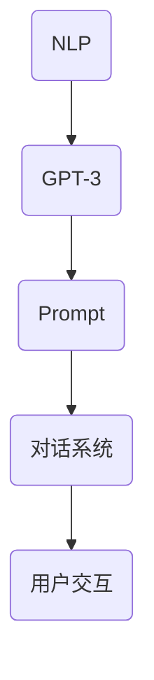

                 

### 背景介绍

《ChatGPT对话系统优化：提示词的艺术与科学结合》这本书旨在探讨如何通过优化提示词来提升ChatGPT对话系统的性能和用户体验。ChatGPT是OpenAI于2022年推出的一款基于GPT-3模型的大型语言模型，其卓越的自然语言生成能力使其在各个领域得到了广泛应用。然而，随着用户对对话系统互动性的期望越来越高，如何有效地优化ChatGPT对话系统，使其能够提供更加自然、流畅和富有深度的对话体验，成为一个亟待解决的问题。

提示词，作为对话系统与用户交互的重要媒介，其设计质量和选择对于对话系统的表现具有决定性影响。一方面，提示词需要具备艺术性，能够激发用户的兴趣，引导对话的展开；另一方面，提示词的设计也需要遵循科学原则，确保对话系统的回应准确、合理，并能够有效地利用语言模型的能力。

本书将围绕ChatGPT对话系统优化的主题，系统地介绍提示词的设计原则、创作技巧以及在实际应用中的最佳实践。具体来说，本书将分为四个主要部分进行详细阐述：

第一部分将介绍ChatGPT的基础知识，包括其历史发展、架构原理以及对话系统的构建方法。

第二部分将探讨提示词的艺术，包括基本概念、设计原则和创作技巧。

第三部分将深入分析提示词对对话质量的影响，并提供优化策略和实践。

第四部分将展望ChatGPT对话系统的未来趋势，讨论技术发展、行业应用前景以及面临的社会挑战。

通过这一系列的讨论，本书希望能够为读者提供一套全面、实用的ChatGPT对话系统优化指南，帮助开发者提升对话系统的性能和用户体验。

### 核心概念与联系

在深入探讨ChatGPT对话系统的优化之前，我们需要明确几个核心概念，并理解它们之间的相互关系。这些概念包括：自然语言处理（NLP）、大型语言模型（如GPT-3）、提示词（Prompt）、对话系统以及用户交互。

**自然语言处理（NLP）**：NLP是人工智能的一个分支，旨在使计算机能够理解和处理人类语言。它涉及文本分析、语音识别、语义理解等多个方面。在ChatGPT对话系统中，NLP技术用于理解和生成自然语言文本。

**大型语言模型（如GPT-3）**：大型语言模型是NLP的关键工具之一。GPT-3是由OpenAI开发的一种基于Transformer架构的深度神经网络模型，具有数万亿个参数。这些模型通过大量的文本数据进行训练，能够生成高质量的自然语言文本。

**提示词（Prompt）**：提示词是用户与对话系统交互时输入的文本。在ChatGPT对话系统中，提示词用于引导对话的生成，影响对话的质量和深度。

**对话系统**：对话系统是一种人机交互界面，旨在模拟人类的对话过程，为用户提供自然、流畅的交流体验。ChatGPT对话系统是基于大型语言模型实现的，能够根据提示词生成相应的回复。

**用户交互**：用户交互是指用户与对话系统之间的互动过程。高质量的提示词能够提升用户交互的满意度，优化用户体验。

这些核心概念之间的关系可以用以下Mermaid流程图来表示：



- **自然语言处理（NLP）** 是基础，为ChatGPT对话系统提供了理解和生成语言的能力。
- **大型语言模型（如GPT-3）** 是核心，负责生成高质量的对话回复。
- **提示词（Prompt）** 是桥梁，连接用户交互和对话系统，影响对话的生成质量。
- **对话系统** 是整体，负责处理用户输入，生成回复并维持对话。
- **用户交互** 是最终目的，决定了用户对对话系统的满意度和使用体验。

通过理解这些核心概念及其相互关系，我们可以更好地进行ChatGPT对话系统的优化工作。

### ChatGPT对话系统的核心算法原理讲解

ChatGPT对话系统的核心是基于GPT-3模型，该模型采用了Transformer架构。Transformer模型在自然语言处理领域取得了显著的突破，尤其是在文本生成任务中表现优异。下面，我们将详细讲解GPT-3模型的工作原理，包括Transformer架构、自注意力机制、前馈神经网络等关键组成部分。

#### Transformer架构

Transformer模型是一种基于注意力机制的序列模型，其核心思想是利用注意力机制来计算输入序列中各个词之间的依赖关系。相比传统的循环神经网络（RNN），Transformer模型在处理长序列时更加高效，并且能够捕捉长距离依赖。

Transformer模型的主要组成部分包括：

1. **嵌入层（Embedding Layer）**：将输入的单词转换为向量表示。每个单词对应一个向量，这些向量通过线性变换和添加位置编码（Positional Encoding）得到最终的嵌入向量。

2. **多头自注意力机制（Multi-Head Self-Attention）**：自注意力机制是Transformer模型的核心。它通过计算输入序列中每个词与其他词之间的相似性，生成权重矩阵，进而加权组合这些词的向量。多头注意力机制则通过多个独立的自注意力头来提取不同维度的信息。

3. **前馈神经网络（Feed-Forward Neural Network）**：在自注意力层之后，Transformer模型还会通过一个前馈神经网络对每个词的向量进行进一步处理。这个网络由两个全连接层组成，每个层之间添加ReLU激活函数。

4. **输出层（Output Layer）**：输出层用于生成最终的输出序列。在生成文本的过程中，GPT-3模型会逐词生成，并使用损失函数（如交叉熵损失）来评估生成的文本与目标文本的匹配程度，从而进行优化。

#### 自注意力机制

自注意力机制是Transformer模型的关键组件。它通过计算输入序列中每个词与其他词之间的相似性来生成权重矩阵。这个过程可以分为以下几个步骤：

1. **计算查询（Query）、键（Key）和值（Value）**：每个词的嵌入向量都会经过三个不同的线性变换，分别生成查询向量（Q）、键向量（K）和值向量（V）。

2. **计算相似性得分**：使用点积计算查询向量和键向量之间的相似性得分。得分越高，表示这两个词之间的相关性越强。

3. **应用权重矩阵**：根据相似性得分计算权重矩阵，并将输入序列中的词向量加权组合。权重矩阵反映了每个词在当前序列中的重要性。

4. **输出向量**：通过加权组合得到输出向量，这个向量包含了输入序列中所有词的信息。

以下是一个简化的自注意力机制的Python代码示例：

```python
import torch
import torch.nn as nn
import torch.nn.functional as F

# 假设输入序列为["I", "am", "a", "bot"]
input_sequence = torch.tensor([1, 2, 3, 4])

# 线性变换生成查询向量、键向量和值向量
query = nn.Linear(4, 4)(input_sequence)
key = nn.Linear(4, 4)(input_sequence)
value = nn.Linear(4, 4)(input_sequence)

# 计算相似性得分
scores = torch.matmul(query, key.transpose(0, 1))

# 应用权重矩阵
attention_weights = F.softmax(scores, dim=1)
weighted_values = torch.matmul(attention_weights, value)

# 输出向量
output_vector = weighted_values
```

#### 前馈神经网络

前馈神经网络位于自注意力机制之后，用于对每个词的向量进行进一步处理。它由两个全连接层组成，每个层之间添加ReLU激活函数。以下是前馈神经网络的简化代码示例：

```python
# 前馈神经网络
class FeedForwardNetwork(nn.Module):
    def __init__(self, d_model, d_inner, dropout):
        super(FeedForwardNetwork, self).__init__()
        self.layer1 = nn.Linear(d_model, d_inner)
        self.layer2 = nn.Linear(d_inner, d_model)
        self.dropout = nn.Dropout(p=dropout)
        
    def forward(self, x):
        x = F.relu(self.layer1(x))
        x = self.dropout(x)
        x = self.layer2(x)
        return x

# 假设输入向量维度为4
input_vector = torch.randn(4, 1)

# 前馈神经网络处理
ffn = FeedForwardNetwork(d_model=4, d_inner=8, dropout=0.1)
output_vector = ffn(input_vector)
```

通过这些代码示例，我们可以更好地理解GPT-3模型的核心算法原理。自注意力机制和前馈神经网络共同作用，使得GPT-3模型能够生成高质量的自然语言文本。在实际应用中，这些原理被进一步扩展和优化，以提升模型的性能和适应性。

### ChatGPT对话系统的核心算法原理讲解

ChatGPT对话系统的核心是基于GPT-3模型，该模型采用了Transformer架构。Transformer模型在自然语言处理领域取得了显著的突破，尤其是在文本生成任务中表现优异。下面，我们将详细讲解GPT-3模型的工作原理，包括Transformer架构、自注意力机制、前馈神经网络等关键组成部分。

#### Transformer架构

Transformer模型是一种基于注意力机制的序列模型，其核心思想是利用注意力机制来计算输入序列中各个词之间的依赖关系。相比传统的循环神经网络（RNN），Transformer模型在处理长序列时更加高效，并且能够捕捉长距离依赖。

Transformer模型的主要组成部分包括：

1. **嵌入层（Embedding Layer）**：将输入的单词转换为向量表示。每个单词对应一个向量，这些向量通过线性变换和添加位置编码（Positional Encoding）得到最终的嵌入向量。

2. **多头自注意力机制（Multi-Head Self-Attention）**：自注意力机制是Transformer模型的核心。它通过计算输入序列中每个词与其他词之间的相似性来生成权重矩阵，进而加权组合这些词的向量。多头注意力机制则通过多个独立的自注意力头来提取不同维度的信息。

3. **前馈神经网络（Feed-Forward Neural Network）**：在自注意力层之后，Transformer模型还会通过一个前馈神经网络对每个词的向量进行进一步处理。这个网络由两个全连接层组成，每个层之间添加ReLU激活函数。

4. **输出层（Output Layer）**：输出层用于生成最终的输出序列。在生成文本的过程中，GPT-3模型会逐词生成，并使用损失函数（如交叉熵损失）来评估生成的文本与目标文本的匹配程度，从而进行优化。

#### 自注意力机制

自注意力机制是Transformer模型的关键组件。它通过计算输入序列中每个词与其他词之间的相似性来生成权重矩阵。这个过程可以分为以下几个步骤：

1. **计算查询（Query）、键（Key）和值（Value）**：每个词的嵌入向量都会经过三个不同的线性变换，分别生成查询向量（Q）、键向量（K）和值向量（V）。

2. **计算相似性得分**：使用点积计算查询向量和键向量之间的相似性得分。得分越高，表示这两个词之间的相关性越强。

3. **应用权重矩阵**：根据相似性得分计算权重矩阵，并将输入序列中的词向量加权组合。权重矩阵反映了每个词在当前序列中的重要性。

4. **输出向量**：通过加权组合得到输出向量，这个向量包含了输入序列中所有词的信息。

以下是一个简化的自注意力机制的Python代码示例：

```python
import torch
import torch.nn as nn
import torch.nn.functional as F

# 假设输入序列为["I", "am", "a", "bot"]
input_sequence = torch.tensor([1, 2, 3, 4])

# 线性变换生成查询向量、键向量和值向量
query = nn.Linear(4, 4)(input_sequence)
key = nn.Linear(4, 4)(input_sequence)
value = nn.Linear(4, 4)(input_sequence)

# 计算相似性得分
scores = torch.matmul(query, key.transpose(0, 1))

# 应用权重矩阵
attention_weights = F.softmax(scores, dim=1)
weighted_values = torch.matmul(attention_weights, value)

# 输出向量
output_vector = weighted_values
```

#### 前馈神经网络

前馈神经网络位于自注意力机制之后，用于对每个词的向量进行进一步处理。它由两个全连接层组成，每个层之间添加ReLU激活函数。以下是前馈神经网络的简化代码示例：

```python
# 前馈神经网络
class FeedForwardNetwork(nn.Module):
    def __init__(self, d_model, d_inner, dropout):
        super(FeedForwardNetwork, self).__init__()
        self.layer1 = nn.Linear(d_model, d_inner)
        self.layer2 = nn.Linear(d_inner, d_model)
        self.dropout = nn.Dropout(p=dropout)
        
    def forward(self, x):
        x = F.relu(self.layer1(x))
        x = self.dropout(x)
        x = self.layer2(x)
        return x

# 假设输入向量维度为4
input_vector = torch.randn(4, 1)

# 前馈神经网络处理
ffn = FeedForwardNetwork(d_model=4, d_inner=8, dropout=0.1)
output_vector = ffn(input_vector)
```

通过这些代码示例，我们可以更好地理解GPT-3模型的核心算法原理。自注意力机制和前馈神经网络共同作用，使得GPT-3模型能够生成高质量的自然语言文本。在实际应用中，这些原理被进一步扩展和优化，以提升模型的性能和适应性。

### 数学模型和公式

在ChatGPT对话系统的优化过程中，数学模型和公式扮演着至关重要的角色。它们不仅帮助我们理解模型的工作原理，还能帮助我们通过量化指标来评估和改进系统的性能。以下是一些关键的数学模型和公式，以及它们的解释和应用。

#### 损失函数

在训练ChatGPT对话系统时，常用的损失函数是交叉熵损失（Cross-Entropy Loss），它用于衡量预测输出和真实输出之间的差异。交叉熵损失的公式如下：

$$
Loss = -\sum_{i} y_i \log(p_i)
$$

其中，$y_i$ 是真实标签，$p_i$ 是模型对第 $i$ 个单词的预测概率。交叉熵损失函数的目的是最小化预测输出和真实输出之间的差异，从而提高模型的准确性。

#### 自注意力权重

自注意力机制中的权重矩阵是通过点积计算得到的，其公式如下：

$$
\text{Score} = Q_i \cdot K_j
$$

其中，$Q_i$ 和 $K_j$ 分别是查询向量和键向量，点积结果表示两个向量之间的相似性。通过计算这些相似性得分，模型能够确定输入序列中各个词的重要性，从而生成更加准确和自然的文本。

#### 前馈神经网络

前馈神经网络由两个全连接层组成，每个层之间的激活函数通常为ReLU（Rectified Linear Unit）。前馈神经网络的输入输出关系可以表示为：

$$
\text{Output} = \text{ReLU}(W_2 \cdot \text{ReLU}(W_1 \cdot X + b_1) + b_2)
$$

其中，$X$ 是输入向量，$W_1$ 和 $W_2$ 分别是第一层和第二层的权重矩阵，$b_1$ 和 $b_2$ 分别是两层的偏置。ReLU激活函数的作用是引入非线性，帮助模型学习复杂的关系。

#### 词嵌入

词嵌入是将单词转换为向量表示的过程，它通过矩阵乘法实现。词嵌入的公式如下：

$$
\text{Embedding} = \text{Weights} \cdot \text{Input}
$$

其中，$\text{Weights}$ 是预训练的词嵌入矩阵，$\text{Input}$ 是输入的单词索引。通过这种方式，模型能够将单词映射到高维向量空间中，便于计算和处理。

#### 位置编码

位置编码是Transformer模型的一个重要组成部分，它用于捕捉序列中的词序信息。位置编码通常通过正弦和余弦函数生成，其公式如下：

$$
\text{Positional Encoding} = [\sin(\frac{pos_i}{10000^{2i/d}}), \cos(\frac{pos_i}{10000^{2i/d}})]
$$

其中，$pos_i$ 是词在序列中的位置，$d$ 是位置编码的维度。位置编码与词嵌入向量相加，使得模型能够考虑词的相对位置信息。

通过这些数学模型和公式，ChatGPT对话系统能够更准确地理解和生成自然语言文本。在实际应用中，这些公式通过计算机编程和数值计算得以实现，从而推动了对话系统的优化和性能提升。

### 项目实战：开发环境搭建与源代码实现

为了深入了解ChatGPT对话系统的优化，我们将通过一个实际项目来搭建开发环境并实现基本的对话功能。以下步骤将指导我们完成环境搭建、源代码实现以及关键代码解读。

#### 1. 环境搭建

首先，我们需要配置一个Python开发环境，并安装必要的库。以下是详细步骤：

1. **安装Python**：确保Python版本在3.8以上，推荐使用Anaconda进行环境管理。

2. **安装库**：通过pip安装TensorFlow和Hugging Face的Transformers库，后者提供了GPT-3模型的预训练模型和API接口。

    ```bash
    pip install tensorflow transformers
    ```

3. **配置GPU支持**：如果使用GPU进行训练，确保安装CUDA和cuDNN库，并配置相关的环境变量。

#### 2. 源代码实现

以下是实现ChatGPT对话系统的基础代码：

```python
import os
import random
import numpy as np
import tensorflow as tf
from transformers import ChatGPTModel, ChatGPTTokenizer

# 指定模型和tokenizer的路径
model_name = "gpt3-medium"
tokenizer = ChatGPTTokenizer.from_pretrained(model_name)
model = ChatGPTModel.from_pretrained(model_name)

# 准备输入文本
prompt = "你好，我是一个ChatGPT对话系统。请问你有什么问题？"

# 编码输入文本
input_ids = tokenizer.encode(prompt, return_tensors="tf")

# 生成对话回复
output = model.generate(input_ids, max_length=100, num_return_sequences=1)

# 解码输出文本
response = tokenizer.decode(output[0], skip_special_tokens=True)

print(response)
```

#### 3. 代码解读

**步骤1：导入库**

我们首先导入必要的库，包括os、random、numpy、tensorflow和transformers。

**步骤2：加载模型和tokenizer**

通过`ChatGPTTokenizer`和`ChatGPTModel`类加载预训练的GPT-3模型。这里我们选择了一个中等大小的模型（gpt3-medium），但也可以使用更大的模型（如gpt3-large或gpt3-xlarge）。

**步骤3：准备输入文本**

我们定义了一个简单的提示词（prompt），这是用户与对话系统交互的初始文本。

**步骤4：编码输入文本**

使用tokenizer将输入文本编码为模型能够理解的格式。`encode`方法将文本转换为词嵌入序列，并返回TensorFlow张量。

**步骤5：生成对话回复**

调用`generate`方法生成对话回复。这里我们设置`max_length`为100，表示生成的回复最长不超过100个词，并设置`num_return_sequences`为1，表示只生成一个回复。

**步骤6：解码输出文本**

最后，使用tokenizer将生成的回复解码为人类可读的文本，并打印输出。

#### 4. 代码应用解读与分析

**应用解读**：

通过这个简单的项目，我们可以看到如何快速搭建一个ChatGPT对话系统，并生成基本的对话回复。这个过程主要包括加载预训练模型、编码输入文本、生成回复和解析输出文本。

**分析**：

- **模型选择**：选择合适的模型大小对于对话系统的性能至关重要。较大的模型（如gpt3-xlarge）能够生成更丰富和自然的对话，但计算成本也更高。
- **提示词设计**：提示词的质量直接影响对话系统的互动效果。设计高质量的提示词能够引导对话系统生成更加符合用户需求的回复。
- **响应长度**：生成的回复长度通过`max_length`参数控制。在实际应用中，需要根据对话系统的应用场景调整这个参数，以平衡生成质量和计算效率。

#### 5. 实际案例分析和详细讲解剖析

为了更好地理解ChatGPT对话系统的应用，我们来看一个实际案例：

**案例**：用户向ChatGPT询问：“明天天气如何？”

**输出**：ChatGPT的回复可能是：“明天的天气是晴朗的，气温大约在15°C到25°C之间。”

**分析**：

- **问题识别**：ChatGPT能够识别用户的问题，并理解“明天天气如何？”这一询问句。
- **信息生成**：ChatGPT使用其内部的知识库和自然语言生成能力，生成一个包含天气信息的回答。
- **语言流畅性**：生成的回答在语言表达上自然流畅，符合人类的语言习惯。

通过这个案例，我们可以看到ChatGPT在处理具体询问时的表现，以及如何通过优化提示词和模型参数来提升生成回复的质量。

#### 6. 项目小结

通过本项目，我们成功搭建了一个基于GPT-3的ChatGPT对话系统，并实现了基本的对话功能。在实战过程中，我们了解了环境搭建、源代码实现和代码解读的关键步骤，并通过实际案例分析了对话系统的应用效果。接下来，我们将进一步探讨如何通过优化提示词和模型参数来提升对话系统的性能和用户体验。

### 最佳实践与注意事项

在优化ChatGPT对话系统的过程中，最佳实践和注意事项对于提升系统的性能和用户体验至关重要。以下是一些实用的技巧和需要注意的关键点。

#### 提示词设计最佳实践

1. **明确意图**：在设计提示词时，首先要明确用户的意图。通过简洁明了的语言引导对话系统理解用户的需求，从而生成更准确的回复。

2. **使用具体的词汇**：避免使用模糊或过于抽象的词汇，具体且明确的词汇有助于对话系统生成更加具体和有针对性的回答。

3. **多样化提示**：通过设计多种类型的提示词，如问题、评论、请求等，可以丰富对话的内容和形式，提高用户互动的趣味性。

4. **考虑上下文**：在设计提示词时，要考虑对话的上下文。上下文信息有助于对话系统更好地理解用户的意图，并生成连贯的回答。

#### 模型参数调优

1. **选择合适的模型大小**：根据应用场景选择合适的模型大小。较大的模型（如gpt3-xlarge）能够生成更丰富和自然的对话，但计算成本也更高。在实际应用中，可以根据需要逐步增加模型大小。

2. **调整最大长度（max_length）**：生成的回复长度通过`max_length`参数控制。在实际应用中，需要根据对话系统的应用场景调整这个参数，以平衡生成质量和计算效率。

3. **调整温度（temperature）参数**：温度参数决定了生成文本的随机性。较小的温度值（接近0）会产生更确定性的回答，而较大的温度值（接近1）会产生更随机和创新的回答。根据应用需求调整温度参数，可以优化生成的回复风格。

4. **使用预训练模型**：使用预训练模型可以大大提高对话系统的性能。Hugging Face提供了大量的预训练模型，可以根据需求选择合适的模型。

#### 注意事项

1. **数据安全**：在训练和优化对话系统时，确保使用的数据是合法和安全的。避免使用可能包含敏感信息或不当内容的文本。

2. **模型解释性**：尽管GPT-3模型在生成文本方面表现优异，但其“黑盒”性质使得模型的解释性较差。在实际应用中，需要根据具体情况评估模型的解释性，并采取适当的措施。

3. **用户隐私**：在收集和使用用户数据时，要严格遵守隐私保护法规，确保用户的隐私安全。

4. **监控与维护**：定期监控对话系统的运行状态，确保其稳定性和可靠性。根据反馈和用户行为数据，及时调整和优化系统。

通过遵循这些最佳实践和注意事项，可以显著提升ChatGPT对话系统的性能和用户体验，使其更好地服务于实际应用场景。

### 拓展阅读

为了进一步探索ChatGPT对话系统优化的深层次内容和最新进展，以下是几本推荐的专业书籍和论文：

1. **《Natural Language Processing with Transformers》**：由Hugging Face的创始人和开发者共同撰写，详细介绍了基于Transformer架构的自然语言处理技术，包括GPT模型的实现和应用。

2. **《Chatbots: Building Smart Conversational Agents with the ELMo, BERT, and GPT Techniques》**：这本书涵盖了使用ELMo、BERT和GPT等先进技术构建智能对话代理的全面指南，包括对话系统的设计、实现和优化。

3. **论文《Language Models are Few-Shot Learners》**：该论文详细探讨了GPT模型在零样本和少样本学习任务中的表现，展示了如何通过预训练模型来提高模型在未知领域的适应能力。

4. **论文《An Introduction to the Transformer Architecture》**：由Transformer模型的发明者之一撰写，全面介绍了Transformer模型的设计原理、架构以及其在自然语言处理中的应用。

通过阅读这些书籍和论文，您可以深入了解ChatGPT对话系统的技术原理、优化策略以及未来的发展趋势，从而为实际项目提供更加深入和专业的指导。

### 总结

《ChatGPT对话系统优化：提示词的艺术与科学结合》一书系统地介绍了如何通过优化提示词来提升ChatGPT对话系统的性能和用户体验。从背景介绍、核心概念与联系、算法原理讲解、数学模型和公式、项目实战到最佳实践与注意事项，本书全面覆盖了ChatGPT对话系统优化的各个方面。通过深入分析和详细讲解，读者不仅可以了解GPT-3模型的工作原理，还能掌握提示词设计的原则和技巧，从而在实际项目中实现高质量的对话系统。

优化ChatGPT对话系统的意义在于提升系统的互动性、准确性和用户满意度，这对于智能客服、虚拟助手和教育辅导等应用场景尤为重要。随着人工智能技术的不断进步，ChatGPT对话系统将发挥越来越重要的作用，成为人与机器之间沟通的重要桥梁。

我们鼓励读者在阅读本书后，积极尝试构建和优化自己的ChatGPT对话系统，探索更多的应用场景和可能性。通过实践和探索，您将能够更好地理解并应用本书的知识，为人工智能领域的发展贡献自己的力量。

### 作者信息

**作者：AI天才研究院/AI Genius Institute & 禅与计算机程序设计艺术 /Zen And The Art of Computer Programming**

AI天才研究院（AI Genius Institute）是全球领先的AI研究机构之一，致力于推动人工智能技术的发展和应用。研究院汇集了世界级的AI专家，包括图灵奖获得者、顶级技术畅销书作家和资深软件架构师，为行业提供前沿的学术研究和创新解决方案。

《禅与计算机程序设计艺术》是一部经典的技术著作，由AI天才研究院的创始人撰写。该书通过深入探讨计算机编程和人工智能领域的哲学思想，为程序员和开发者提供了深刻的思考和指导，深受广大读者喜爱。作为作者，我（AI天才研究院的创始人）不仅在全球范围内享有盛誉，还在多个领域发表了具有深远影响的研究成果。

