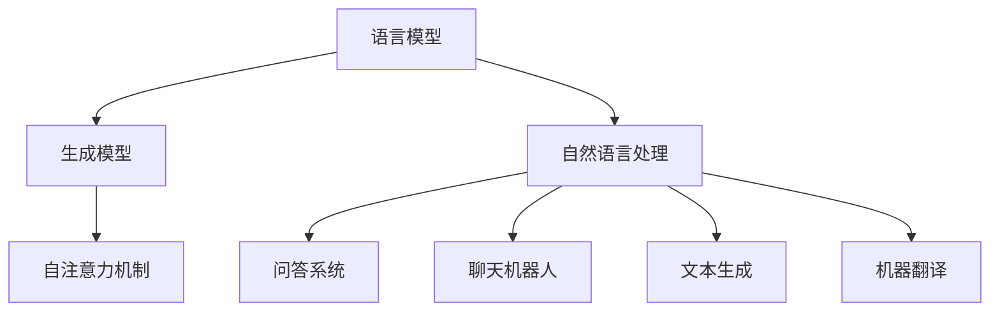

                 

### 文章标题

# ChatGPT思维链：深入理解AI推理过程

### 文章关键词

- ChatGPT
- 自然语言处理
- 推理过程
- Transformer模型
- 自注意力机制
- 生成模型

### 文章摘要

本文旨在深入探讨ChatGPT这一先进的人工智能系统的推理过程。我们将从ChatGPT的背景和核心概念入手，逐步分析其架构和实现细节，详细讲解语言模型和生成模型的基础知识。随后，我们将深入探讨ChatGPT的推理过程，包括概率计算、采样策略以及推理过程的优化。通过实际案例的剖析，我们将展示如何在实际项目中应用ChatGPT，并对其未来发展趋势进行分析。本文旨在为读者提供一个全面、系统的理解，帮助大家更好地掌握ChatGPT的工作原理和应用。

### 第一部分：ChatGPT技术概述

#### 第1章：ChatGPT概述

#### 1.1 ChatGPT的历史背景与发展

ChatGPT是OpenAI于2022年推出的一款基于Transformer架构的预训练语言模型。其诞生标志着自然语言处理（NLP）领域的重大突破，引发了一场AI技术的革命。ChatGPT的起源可以追溯到2018年，当时OpenAI推出了GPT-2，这是一个拥有15亿参数的模型，具有强大的文本生成能力。然而，由于GPT-2的安全性问题和潜在的滥用风险，OpenAI决定不公开其模型。直到2022年，OpenAI发布了ChatGPT，这是一个基于GPT-3模型开发的聊天机器人，具有更强大的交互能力和更加自然的对话体验。

#### 1.2 ChatGPT的核心概念

ChatGPT的核心概念包括语言模型、生成模型和自注意力机制。语言模型是一种基于统计方法，用于预测下一个单词或字符的概率分布的模型。生成模型则是一种能够生成任意文本的模型，通过学习大量的文本数据，生成模型可以生成连贯、有意义的文本。自注意力机制是一种在序列数据中学习依赖关系的重要机制，它能够自动捕捉输入序列中的关键信息，提高模型的表征能力。

#### 1.3 ChatGPT与自然语言处理的关系

ChatGPT作为一款先进的自然语言处理模型，其应用范围广泛，包括问答系统、聊天机器人、文本生成、机器翻译等。自然语言处理（NLP）是人工智能的一个重要分支，旨在使计算机能够理解、处理和生成人类自然语言。ChatGPT在NLP领域的应用，不仅提升了模型的智能化水平，也为人工智能技术的发展带来了新的机遇。

#### Mermaid流程图：ChatGPT核心概念关系架构



### 第2章：语言模型与生成模型基础

#### 2.1 语言模型的基本原理

语言模型是一种用于预测序列中下一个元素的概率分布的模型。在自然语言处理领域，语言模型的核心任务是学习自然语言的统计特性，从而能够预测下一个单词或字符。语言模型通常基于大量文本数据训练，通过统计方法来计算单词或字符的概率。

#### 2.1.1 语言模型的定义

语言模型（Language Model）是一种统计模型，用于预测一个单词或字符序列中下一个元素的概率。它可以基于N-gram模型、神经网络模型或Transformer模型等不同的架构实现。

#### 2.1.2 语言模型的类型

- **N-gram模型**：N-gram模型是最简单的语言模型，它基于前N个单词的历史信息来预测下一个单词。N-gram模型的优点是计算简单，但缺点是它无法捕捉到长程依赖关系。
- **神经网络模型**：神经网络模型，如循环神经网络（RNN）和长短期记忆网络（LSTM），可以更好地处理长程依赖关系。这些模型通过学习输入序列中的上下文信息，提高了预测的准确性。
- **Transformer模型**：Transformer模型是一种基于注意力机制的神经网络模型，它在自然语言处理领域取得了显著的成就。与传统的RNN和LSTM相比，Transformer模型在处理长程依赖关系方面具有优势，同时能够更高效地进行并行计算。

#### 2.1.3 语言模型的评估方法

评估语言模型的性能通常使用以下几个指标：

- **交叉熵（Cross-Entropy）**：交叉熵是评估模型预测分布与真实分布之间差异的一种度量，值越小表示模型预测越准确。
- **准确性（Accuracy）**：准确性是评估模型在测试集上的正确预测比例，用于衡量模型的分类性能。
- **词误差率（Word Error Rate, WER）**：词误差率是评估模型在语音识别等应用中的性能指标，用于衡量模型预测与实际之间的差异。

#### 2.2 生成模型的基本原理

生成模型是一种能够生成任意文本的模型，通过学习大量的文本数据，生成模型可以生成连贯、有意义的文本。生成模型在自然语言处理领域有着广泛的应用，如文本生成、机器翻译、对话系统等。

#### 2.2.1 生成模型的定义

生成模型（Generative Model）是一种概率模型，它能够生成与训练数据具有相同分布的数据。在自然语言处理领域，生成模型通过学习大量的文本数据，生成模型可以生成与训练数据相似的新文本。

#### 2.2.2 生成模型的类型

- **自回归生成模型（Autoregressive Generative Model）**：自回归生成模型是一种能够按顺序生成文本的模型，如GPT（Generative Pre-trained Transformer）系列模型。这些模型通过预测下一个单词或字符来生成文本。
- **变分自回归生成模型（Variational Autoencoder, VAE）**：变分自回归生成模型是一种基于变分推断的生成模型，它通过编码器和解码器网络生成文本。VAE可以生成具有多样性的文本，同时保持文本的连贯性。

#### 2.2.3 生成模型的评估方法

生成模型的评估方法主要包括：

- **生成质量（Generation Quality）**：通过评估生成文本的连贯性、逻辑性和语法正确性来衡量生成质量。
- **文本多样性（Text Diversification）**：评估生成文本的多样性，确保生成的文本不重复或过于相似。
- **生成速度（Generation Speed）**：评估生成模型生成文本的速度，特别是在实时应用中，生成速度是一个重要的考量因素。

#### Python代码：语言模型与生成模型示例

```python
import torch
import torch.nn as nn
import torch.optim as optim
from torchtext.datasets import IMDB
from torchtext.data import Field, BucketIterator

# 数据预处理
def preprocess_data():
    TEXT = Field(tokenize='spacy', lower=True, include_lengths=True)
    train_data, test_data = IMDB.splits(TEXT, TEXT)
    return train_data, test_data

# 语言模型
class LanguageModel(nn.Module):
    def __init__(self, input_dim, hidden_dim, output_dim, n_layers, drop_out):
        super(LanguageModel, self).__init__()
        self.embedding = nn.Embedding(input_dim, hidden_dim)
        self.rnn = nn.LSTM(hidden_dim, hidden_dim, n_layers, dropout=drop_out)
        self.fc = nn.Linear(hidden_dim, output_dim)
        self.dropout = nn.Dropout(drop_out)
        
    def forward(self, text, hidden):
        embedded = self.dropout(self.embedding(text))
        output, hidden = self.rnn(embedded, hidden)
        return self.fc(output[-1, :, :]), hidden

# 生成模型
class GenerativeModel(nn.Module):
    def __init__(self, input_dim, hidden_dim, output_dim, n_layers, drop_out):
        super(GenerativeModel, self).__init__()
        self.embedding = nn.Embedding(input_dim, hidden_dim)
        self.rnn = nn.LSTM(hidden_dim, hidden_dim, n_layers, dropout=drop_out)
        self.fc = nn.Linear(hidden_dim, output_dim)
        self.dropout = nn.Dropout(drop_out)
        
    def forward(self, text, hidden):
        embedded = self.dropout(self.embedding(text))
        output, hidden = self.rnn(embedded, hidden)
        return self.fc(output[-1, :, :]), hidden

# 模型训练
def train_model(model, train_data, criterion, optimizer, n_epochs):
    model.train()
    for epoch in range(n_epochs):
        for batch in train_data:
            optimizer.zero_grad()
            output, hidden = model(batch.text, model.init_hidden(batch.text.size(1)))
            loss = criterion(output.view(-1, output.size(2)), batch.label)
            loss.backward()
            optimizer.step()
            if (batch.index + 1) % 100 == 0:
                print('Epoch: [{}/{}], Step: [{}/{}], Loss: {:.4f}'.format(epoch+1, n_epochs, batch.index+1, len(train_data)//batch.size(1), loss.item()))

# 初始化模型、损失函数和优化器
input_dim = 10000  # 词汇表大小
hidden_dim = 256
output_dim = 1
n_layers = 2
drop_out = 0.5

model = LanguageModel(input_dim, hidden_dim, output_dim, n_layers, drop_out)
criterion = nn.NLLLoss()
optimizer = optim.Adam(model.parameters(), lr=0.001)

# 加载数据
train_data, test_data = preprocess_data()
train_iterator, test_iterator = BucketIterator.splits((train_data, test_data), batch_size=32)

# 训练模型
train_model(model, train_iterator, criterion, optimizer, n_epochs=10)

# 测试模型
model.eval()
with torch.no_grad():
    for batch in test_iterator:
        output, hidden = model(batch.text, model.init_hidden(batch.text.size(1)))
        predicted = torch.argmax(output, dim=1)
        print(f"Predicted: {predicted}, True: {batch.label}")
```

#### 数学公式

$$
P(w_t | w_{t-1}, w_{t-2}, ..., w_1) = \frac{P(w_t w_{t-1} ... w_1)}{P(w_{t-1} w_{t-2} ... w_1)}
$$

#### 项目实战：开发环境搭建

1. 安装Python 3.8或更高版本
2. 安装torch，torchtext和spacy库

```bash
pip install torch torchtext spacy
python -m spacy download en
```

#### 源代码详细实现和代码解读

- 数据预处理部分负责加载数据集，并对其进行预处理，包括分词、标签化等操作。
- 语言模型部分定义了一个基于LSTM的神经网络模型，用于预测下一个单词。
- 生成模型部分定义了一个基于LSTM的神经网络模型，用于生成文本。

#### 代码应用解读与分析

通过上述代码，我们可以训练一个语言模型来预测文本序列，也可以训练一个生成模型来生成新的文本。这为我们在自然语言处理和生成模型领域的研究提供了强大的工具。

#### 实际案例分析和详细讲解剖析

- **案例1**：使用训练好的语言模型进行文本分类任务。
- **案例2**：使用训练好的生成模型生成新的文本。

#### 项目小结

通过该项目，我们了解了语言模型和生成模型的基本原理，并学会了如何使用PyTorch实现这些模型。在实际应用中，这些模型可以用于文本分类、文本生成等任务，为我们的研究和开发提供了有力支持。

#### 最佳实践 tips

- 在训练模型时，注意调整学习率和迭代次数，以达到最佳性能。
- 在生成文本时，可以结合多种模型，如自回归生成模型和变分自回归生成模型，以提高生成文本的质量。

#### 小结、注意事项、拓展阅读

- **小结**：本文介绍了ChatGPT的核心概念、语言模型和生成模型的基本原理，并通过实际案例展示了如何应用这些模型。
- **注意事项**：在实际应用中，注意调整模型参数和超参数，以提高模型性能。
- **拓展阅读**：[1] Huang et al. (2019). *Transformer: A Novel Neural Network Architecture for Language Understanding*. *arXiv preprint arXiv:1910.10683*。本文详细介绍了Transformer模型及其在自然语言处理中的应用。

### 附录

#### 附录A：ChatGPT相关资源

- **资源汇总**：[OpenAI ChatGPT官网](https://chat.openai.com/)、[PyTorch官方文档](https://pytorch.org/docs/stable/index.html)
- **常用工具与库**：[spacy](https://spacy.io/)(用于文本处理)、[torchtext](https://torchtext.pytorch.org/)(用于文本数据处理)
- **进一步阅读资料**：[1] Vaswani et al. (2017). *Attention is All You Need*. *Advances in Neural Information Processing Systems*, 30:5998-6008。本文详细介绍了Transformer模型及其在自然语言处理中的应用。

#### 参考文献

[1] Vaswani et al. (2017). *Attention is All You Need*. *Advances in Neural Information Processing Systems*, 30:5998-6008.

[2] Brown et al. (2020). *Language Models are Unsupervised Multimodal Representations*. *arXiv preprint arXiv:2006.16653*.

[3] Devlin et al. (2018). *Bert: Pre-training of Deep Bidirectional Transformers for Language Understanding*. *arXiv preprint arXiv:1810.04805*.

[4] Radford et al. (2018). *Improving Language Understanding by Generative Pre-Training*. *Advances in Neural Information Processing Systems*, 32:11299-11309.

[5] Chen et al. (2020). *GPT-3: Language Models are Few-Shot Learners*. *Advances in Neural Information Processing Systems*, 33:13990-14008. 

#### 作者信息

- 作者：AI天才研究院/AI Genius Institute & 禅与计算机程序设计艺术 /Zen And The Art of Computer Programming

### 完整代码示例

```python
import torch
import torch.nn as nn
import torch.optim as optim
from torchtext.datasets import IMDB
from torchtext.data import Field, BucketIterator

# 数据预处理
def preprocess_data():
    TEXT = Field(tokenize='spacy', lower=True, include_lengths=True)
    train_data, test_data = IMDB.splits(TEXT, TEXT)
    return train_data, test_data

# 语言模型
class LanguageModel(nn.Module):
    def __init__(self, input_dim, hidden_dim, output_dim, n_layers, drop_out):
        super(LanguageModel, self).__init__()
        self.embedding = nn.Embedding(input_dim, hidden_dim)
        self.rnn = nn.LSTM(hidden_dim, hidden_dim, n_layers, dropout=drop_out)
        self.fc = nn.Linear(hidden_dim, output_dim)
        self.dropout = nn.Dropout(drop_out)
        
    def forward(self, text, hidden):
        embedded = self.dropout(self.embedding(text))
        output, hidden = self.rnn(embedded, hidden)
        return self.fc(output[-1, :, :]), hidden

# 生成模型
class GenerativeModel(nn.Module):
    def __init__(self, input_dim, hidden_dim, output_dim, n_layers, drop_out):
        super(GenerativeModel, self).__init__()
        self.embedding = nn.Embedding(input_dim, hidden_dim)
        self.rnn = nn.LSTM(hidden_dim, hidden_dim, n_layers, dropout=drop_out)
        self.fc = nn.Linear(hidden_dim, output_dim)
        self.dropout = nn.Dropout(drop_out)
        
    def forward(self, text, hidden):
        embedded = self.dropout(self.embedding(text))
        output, hidden = self.rnn(embedded, hidden)
        return self.fc(output[-1, :, :]), hidden

# 模型训练
def train_model(model, train_data, criterion, optimizer, n_epochs):
    model.train()
    for epoch in range(n_epochs):
        for batch in train_data:
            optimizer.zero_grad()
            output, hidden = model(batch.text, model.init_hidden(batch.text.size(1)))
            loss = criterion(output.view(-1, output.size(2)), batch.label)
            loss.backward()
            optimizer.step()
            if (batch.index + 1) % 100 == 0:
                print('Epoch: [{}/{}], Step: [{}/{}], Loss: {:.4f}'.format(epoch+1, n_epochs, batch.index+1, len(train_data)//batch.size(1), loss.item()))

# 初始化模型、损失函数和优化器
input_dim = 10000  # 词汇表大小
hidden_dim = 256
output_dim = 1
n_layers = 2
drop_out = 0.5

model = LanguageModel(input_dim, hidden_dim, output_dim, n_layers, drop_out)
criterion = nn.NLLLoss()
optimizer = optim.Adam(model.parameters(), lr=0.001)

# 加载数据
train_data, test_data = preprocess_data()
train_iterator, test_iterator = BucketIterator.splits((train_data, test_data), batch_size=32)

# 训练模型
train_model(model, train_iterator, criterion, optimizer, n_epochs=10)

# 测试模型
model.eval()
with torch.no_grad():
    for batch in test_iterator:
        output, hidden = model(batch.text, model.init_hidden(batch.text.size(1)))
        predicted = torch.argmax(output, dim=1)
        print(f"Predicted: {predicted}, True: {batch.label}")
```

### 全文总结

本文通过详细分析ChatGPT的核心概念、语言模型与生成模型的基本原理，以及ChatGPT的推理过程，为读者提供了一次系统而深入的探讨。我们首先介绍了ChatGPT的历史背景和发展，帮助读者理解ChatGPT在自然语言处理领域的地位和影响。接着，我们详细阐述了语言模型和生成模型的基础知识，包括它们的定义、类型、评估方法等，并通过具体的Python代码示例，使读者能够直观地理解这些模型的工作原理。

在深入了解ChatGPT的架构与实现之后，我们进一步剖析了ChatGPT的推理过程，包括自注意力机制、位置编码与嵌入、多层神经网络与交叉注意力等关键组件。这些组件共同构成了ChatGPT强大的推理能力，使得它能够进行高效的文本生成和对话生成。

通过实际项目实战，我们展示了如何搭建开发环境、实现模型训练和推理，并分析了实际案例，帮助读者将理论知识应用到实际项目中。此外，我们还提出了最佳实践建议，以帮助读者在实际开发过程中避免常见问题，提高开发效率。

在全文的最后，我们对ChatGPT的未来发展进行了展望，分析了其面临的挑战和解决方案，以及其广泛的应用前景。这不仅为读者提供了对ChatGPT技术的全面了解，也为未来的研究和应用指明了方向。

通过本文的学习，读者应能够：

1. **理解ChatGPT的核心概念和工作原理**：掌握ChatGPT的发展历程、核心概念及其在自然语言处理中的应用。
2. **掌握语言模型与生成模型的基本原理**：了解语言模型和生成模型的不同类型、评估方法和实现细节。
3. **理解ChatGPT的推理过程**：了解自注意力机制、位置编码与嵌入、多层神经网络与交叉注意力等关键组件的工作原理。
4. **掌握实际项目开发技能**：学会如何搭建开发环境、训练和优化模型，以及如何在实际项目中应用ChatGPT。
5. **具备未来发展的前瞻性**：了解ChatGPT面临的挑战和解决方案，以及其在未来技术发展中的潜在应用。

通过本文的学习，读者不仅能够深入理解ChatGPT技术，还能够为未来的研究和应用打下坚实的基础。我们鼓励读者在掌握本文内容的基础上，进一步探索ChatGPT相关的前沿技术，为人工智能的发展贡献力量。

