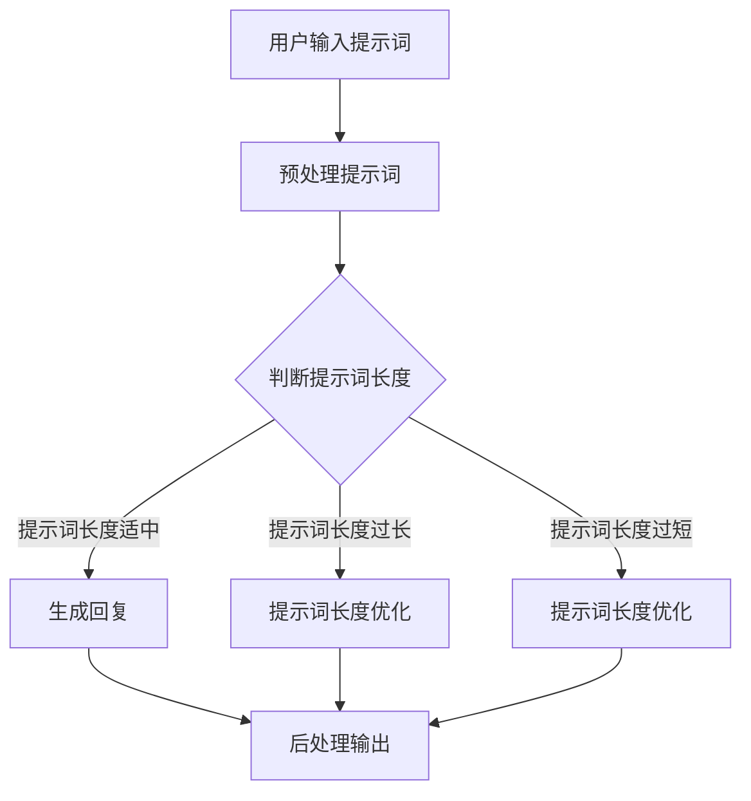

                 

### 1.1 ChatGPT简介

ChatGPT是由OpenAI开发的一个人工智能聊天机器人模型，其核心基于GPT-3（Generative Pre-trained Transformer 3），这是一个具有1750亿参数的Transformer模型。ChatGPT的主要功能是通过与用户的对话生成自然语言回复。它可以用于多种场景，如在线客服、智能助手、内容生成等。

GPT-3是OpenAI开发的第三代预训练语言模型，具有以下特点：

1. **大规模参数**：GPT-3拥有1750亿个参数，是当时最大的语言模型。
2. **Transformer架构**：采用Transformer神经网络架构，能够高效处理长文本。
3. **上下文理解**：能够理解上下文，并生成连贯的回复。
4. **多样性**：能够生成丰富多样、符合上下文的回复。

ChatGPT的工作流程主要包括以下几个步骤：

1. **接收输入**：接收用户的文本输入。
2. **预处理输入**：对输入文本进行清洗、分词等处理。
3. **生成回复**：基于GPT-3模型，生成自然语言回复。
4. **后处理输出**：对生成的回复进行必要的处理，如去除噪声、修正语法错误等。

通过这种方式，ChatGPT能够与用户进行自然的对话，提供实时、准确的回复。

### 1.2 提示词的概念与作用

提示词（Prompt）是用户输入给ChatGPT的文本，它用于引导ChatGPT生成相应的回复。提示词的质量直接影响模型的响应质量。一个良好的提示词应具备以下特点：

1. **清晰明确**：提示词应明确表达用户意图，避免模糊或歧义。
2. **简洁精炼**：尽量简洁地表达问题，减少无关信息，以便模型更好地理解。
3. **结构合理**：合理的句子结构和上下文关系有助于模型生成连贯的回复。

提示词的作用主要体现在以下几个方面：

1. **引导模型**：提示词用于引导ChatGPT生成相应的回复，使得回复更贴近用户需求。
2. **提高效率**：通过良好的提示词，可以减少模型不必要的计算和推理，提高响应速度。
3. **优化体验**：合适的提示词能够提高用户满意度，增强交互体验。

### 1.3 ChatGPT的工作原理

ChatGPT的工作原理基于GPT-3模型的预训练和微调。GPT-3是一个自回归语言模型，其基本原理如下：

1. **预训练**：GPT-3在训练阶段使用了大量的文本数据，通过无监督学习，模型学习到了语言的统计规律和语义信息。
2. **Transformer架构**：GPT-3采用Transformer神经网络架构，它由多个自注意力（Self-Attention）层组成。每一层都能够将输入序列映射到一个新的表示形式。
3. **生成回复**：在生成回复阶段，给定一个提示词，模型会根据上下文生成相应的回复。具体来说，模型会通过预测下一个词的概率分布，从而生成序列。

GPT-3的关键技术包括：

1. **自注意力机制**：通过自注意力机制，模型能够学习到不同位置词之间的关系，从而生成更加连贯的文本。
2. **大规模参数**：GPT-3拥有1750亿个参数，使得模型具有强大的表达能力和鲁棒性。
3. **上下文理解**：通过预训练，模型能够理解上下文信息，从而生成更加符合上下文的回复。

### 提示词长度优化

提示词长度是影响模型性能的重要因素之一。过长的提示词可能导致模型无法完整理解，而过短的提示词则可能缺乏上下文信息，影响模型的生成效果。以下是关于提示词长度优化的几点建议：

1. **适度长度**：选择长度适中的提示词，一般建议在50-200个单词之间。这样可以确保模型有足够的上下文信息来生成高质量的回复。
2. **避免冗余**：去除提示词中的冗余信息，保留关键内容。可以通过简化和精炼语句来实现。
3. **结构清晰**：确保提示词的结构清晰，避免混乱或模糊的表述，以便模型能够准确理解。
4. **动态调整**：根据具体场景和需求，动态调整提示词的长度。例如，对于复杂的问题，可以适当增加提示词的长度，以提供更多上下文信息。

### 提示词多样性优化

提示词的多样性对于生成丰富多样的回复至关重要。以下是一些提高提示词多样性的方法：

1. **使用不同的词汇**：在提示词中使用不同的词汇和表达方式，避免重复使用相同的单词或短语。
2. **多角度提问**：从不同的角度和立场提出问题，例如使用疑问句、陈述句、否定句等不同的句型。
3. **借鉴文本数据**：利用大量的文本数据，通过文本挖掘和情感分析等方法，生成具有多样性的提示词。
4. **上下文关联**：根据上下文信息，生成与当前话题相关的不同类型的提示词，如定义、描述、解释等。

### 提示词连贯性优化

提示词的连贯性对于生成自然流畅的回复至关重要。以下是一些提高提示词连贯性的方法：

1. **保持上下文一致**：确保提示词之间在语义和逻辑上保持一致，避免出现矛盾或逻辑跳跃。
2. **合理使用连接词**：在提示词之间合理使用连接词，如“但是”、“因此”、“同时”等，以增强语句的连贯性。
3. **简化复杂句子**：避免使用过于复杂的句子结构，尽量使用简单明了的表达方式。
4. **预训练语言模型**：通过预训练语言模型，使模型在生成回复时能够更好地理解上下文，从而提高连贯性。

### 3.1 语言模型原理

语言模型是自然语言处理（NLP）的核心组成部分，它用于预测自然语言中的下一个词或短语。GPT-3作为一种先进的语言模型，其基本原理和组成部分如下：

#### 3.1.1 基本原理

语言模型的核心思想是学习语言中的概率分布。具体来说，它通过分析大量的语言数据，学习到每个词或短语出现的概率。在生成文本时，语言模型根据当前已经输入的词序列，预测下一个词或短语的分布，从而生成新的文本。

GPT-3采用了Transformer架构，这是一种基于自注意力（Self-Attention）机制的神经网络模型。Transformer模型由多个自注意力层和前馈网络组成，能够高效处理长文本，并捕捉长距离的依赖关系。

#### 3.1.2 组成部分

1. **自注意力层**：自注意力层是Transformer模型的核心组件，它通过计算输入序列中每个词与其他词之间的权重，生成新的词表示。这种方法能够捕捉词与词之间的依赖关系，从而提高生成文本的质量。
   
2. **前馈网络**：在每个自注意力层之后，有一个前馈网络，它对输入进行线性变换，以增强模型的表达能力。

3. **多头注意力**：GPT-3采用了多头注意力机制，这意味着在每个自注意力层中，模型会同时计算多个注意力权重，从而捕获更丰富的信息。

4. **位置编码**：由于Transformer模型没有显式的循环神经网络结构，无法直接处理序列中的位置信息。因此，GPT-3通过位置编码来模拟位置信息，使得模型能够理解词的顺序。

#### 3.1.3 工作流程

1. **输入预处理**：首先，将输入文本转换为模型能够处理的序列。通常，这包括分词、转换为索引序列等步骤。
2. **编码**：将输入序列通过位置编码和嵌入层转换为词向量的形式。
3. **自注意力计算**：在每个自注意力层，模型计算输入序列中每个词与其他词之间的权重，生成新的词表示。
4. **前馈网络**：在每个自注意力层之后，应用前馈网络进行线性变换。
5. **输出生成**：通过解码器层，模型生成最终的输出序列。在生成文本时，模型会根据当前已经输入的词序列，预测下一个词的概率分布，并从中选择一个词作为输出。

### 3.2 对话系统架构

对话系统是指能够与人类进行自然语言交互的计算机系统。它由多个组件组成，包括自然语言理解（NLU）、对话管理（DM）和自然语言生成（NLG）。以下是这些组件的详细说明：

#### 3.2.1 自然语言理解（NLU）

自然语言理解是对话系统的第一步，其主要任务是理解用户的输入。这通常包括以下几个步骤：

1. **文本预处理**：对输入文本进行分词、去除停用词、词性标注等处理，使其符合模型的输入格式。
2. **意图识别**：通过机器学习模型（如分类器）识别用户输入的意图。例如，区分用户是询问天气信息还是预订机票。
3. **实体识别**：识别输入文本中的关键信息，如日期、时间、地点等实体。

#### 3.2.2 对话管理（DM）

对话管理负责控制对话流程，确保对话的连贯性和一致性。其主要任务包括：

1. **状态跟踪**：对话管理器会跟踪对话的状态，如用户的意图、上下文信息等，以便生成合理的回复。
2. **策略选择**：根据当前对话状态，选择合适的对话策略。例如，在用户询问天气信息时，选择提供天气查询的回复。
3. **动作规划**：根据对话策略，规划下一步的动作，如查询外部API、生成文本等。

#### 3.2.3 自然语言生成（NLG）

自然语言生成是对话系统的输出部分，负责生成自然的语言回复。其主要任务包括：

1. **回复生成**：根据对话管理和自然语言理解的结果，生成合适的回复。这可以是通过预定义模板、基于规则的方法或使用语言模型生成。
2. **文本优化**：对生成的文本进行优化，确保其流畅性、清晰性和自然性。例如，调整句子结构、添加适当的连接词等。

### 3.3 提示词优化的Mermaid流程图

为了更好地理解提示词优化的流程，我们可以使用Mermaid流程图来展示。以下是提示词优化流程的Mermaid代码：



该流程图展示了从用户输入提示词到生成最终回复的整个过程。在预处理阶段，首先判断提示词的长度。如果长度适中，则直接生成回复；如果长度过长或过短，则进行相应的长度优化，然后再生成回复。最后，对生成的回复进行后处理，确保其质量和连贯性。

### 4.1 长文本处理

长文本处理是提示词优化的一个重要方面，因为它直接关系到模型生成回复的质量和效率。以下是一些关于长文本处理的详细讲解：

#### 4.1.1 长文本处理的挑战

1. **计算资源消耗**：长文本会导致模型在生成回复时消耗大量的计算资源，从而影响响应速度。
2. **上下文丢失**：长文本可能会导致模型无法完整理解上下文信息，从而影响生成的回复的准确性和连贯性。
3. **生成错误**：长文本处理过程中，模型可能产生错误的预测，导致生成的回复不正确。

#### 4.1.2 长文本处理的方法

1. **文本分块**：将长文本分为多个较短的部分，分别进行处理，然后组合生成最终回复。这样可以降低模型的计算负担，并提高处理效率。
2. **上下文重用**：在处理长文本时，可以重复使用之前已经处理过的上下文信息，以增强模型的上下文理解能力。这可以通过缓存上下文信息来实现。
3. **动态剪枝**：在生成回复时，可以根据当前对话的进展，动态剪枝不相关的文本部分，从而减少模型的计算负担。

#### 4.1.3 长文本处理的代码实现

以下是一个简单的Python代码示例，展示了如何使用文本分块方法处理长文本：

```python
import transformers

model = transformers.pipeline("text-generation", model="gpt-3")

def process_long_text(text, max_length=512):
    """处理长文本，将其分为多个块进行处理"""
    blocks = [text[i:i + max_length] for i in range(0, len(text), max_length)]
    responses = []

    for block in blocks:
        response = model(block, max_length=max_length, temperature=0.7)
        responses.append(response)

    return ' '.join([block + " " + res for block, res in zip(blocks, responses)])

long_text = "这是一个很长的文本，它需要被分成多个块进行处理。"

response = process_long_text(long_text)
print(response)
```

在这个示例中，我们使用了transformers库中的text-generation接口来生成回复。`process_long_text`函数将长文本分为多个块，并分别进行处理，最后将生成的回复组合起来。

### 4.2 语境理解与情感分析

语境理解与情感分析是提示词优化的高级技巧，它们有助于模型更好地理解用户意图和情感，从而生成更准确、更自然的回复。以下是关于这两个方面的详细讲解：

#### 4.2.1 语境理解

语境理解是指模型能够根据上下文信息理解用户的意思。这对于生成连贯、准确的回复至关重要。以下是一些提高语境理解的方法：

1. **上下文信息扩展**：在生成回复时，模型可以扩展上下文信息，包括上下文中的实体、事件和关系等。这可以通过引入实体识别和关系提取技术来实现。
2. **多轮对话**：在多轮对话中，模型可以利用之前的对话历史来更好地理解当前用户的意图。这可以通过对话管理器来实现。
3. **长距离依赖**：通过捕捉长距离的依赖关系，模型可以更好地理解上下文。这可以通过使用长距离依赖模型（如BERT）来实现。

#### 4.2.2 情感分析

情感分析是指模型能够识别用户情感并生成相应的回复。这对于提升用户体验和交互质量至关重要。以下是一些提高情感分析的方法：

1. **情感词典**：使用预定义的情感词典来识别文本中的情感。这可以通过文本匹配和机器学习模型来实现。
2. **情感分类模型**：训练一个情感分类模型，用于识别文本中的情感。这可以通过监督学习来实现。
3. **多模态情感分析**：结合文本、语音、图像等多模态信息，进行情感分析。这可以通过融合不同模态的特征来实现。

#### 4.2.3 代码实现

以下是一个简单的Python代码示例，展示了如何使用情感分析模型识别文本中的情感：

```python
import transformers

model = transformers.pipeline("text-classification", model="roberta-large-mnli")

def analyze_sentiment(text):
    """分析文本中的情感"""
    sentiment = model(text)
    return sentiment['label']

text = "我今天非常开心，因为我得到了一份新工作。"

sentiment = analyze_sentiment(text)
print(sentiment)
```

在这个示例中，我们使用了transformers库中的text-classification接口来分析文本中的情感。`analyze_sentiment`函数返回文本的情感分类结果，可以是“积极”、“消极”或“中性”。

### 4.3 提示词优化算法

提示词优化算法是提高ChatGPT生成回复质量和效率的关键技术。以下是一些流行的提示词优化算法：

#### 4.3.1 基于模板的生成

基于模板的生成是一种简单有效的提示词优化方法。它通过预定义的模板来生成提示词，模板中包含关键词和填充字段。这种方法的优势在于生成提示词速度快，且易于实现。以下是一个简单的基于模板的生成示例：

```python
templates = [
    "请问您有什么问题需要帮助吗？",
    "您可以向我提出任何问题，我会尽力解答。",
    "有什么可以为您服务的吗？"
]

import random

def generate_template_prompt():
    """生成基于模板的提示词"""
    template = random.choice(templates)
    return template

prompt = generate_template_prompt()
print(prompt)
```

#### 4.3.2 基于神经网络的生成

基于神经网络的生成方法使用深度学习模型，如循环神经网络（RNN）和Transformer，来生成提示词。这种方法的优势在于能够生成更丰富多样、符合上下文的提示词。以下是一个简单的基于神经网络的生成示例：

```python
import tensorflow as tf

model = tf.keras.Sequential([
    tf.keras.layers.Embedding(vocab_size, embedding_dim),
    tf.keras.layers.LSTM(units=128),
    tf.keras.layers.Dense(units=vocab_size, activation='softmax')
])

model.compile(optimizer='adam', loss='categorical_crossentropy', metrics=['accuracy'])

def generate神经网络prompt(input_sequence):
    """生成基于神经网络的提示词"""
    prediction = model.predict(input_sequence)
    prompt = np.argmax(prediction, axis=-1)
    return prompt

# 假设input_sequence是一个长度为50的序列，表示输入的提示词
prompt = generate神经网络prompt(input_sequence)
print(prompt)
```

### 5.1 ChatGPT模型部署

在完成ChatGPT模型的训练后，将模型部署到实际生产环境中是非常重要的。以下是关于ChatGPT模型部署的详细步骤：

#### 5.1.1 环境准备

在部署前，需要准备以下环境：

1. **计算资源**：确保有足够的计算资源来支持模型的运行。对于ChatGPT这样的大型模型，推荐使用高性能的GPU。
2. **Python环境**：安装Python和必要的库，如transformers、tensorflow等。
3. **服务容器**：可以使用Docker容器来部署模型，以便于管理和扩展。

#### 5.1.2 模型转换

将训练好的模型转换为可以部署的格式，如ONNX或TensorFlow Lite。以下是一个使用TensorFlow转换模型的示例：

```python
import tensorflow as tf

# 加载训练好的模型
model = tf.keras.models.load_model('chatgpt_model.h5')

# 将模型转换为TensorFlow Lite格式
converter = tf.lite.TFLiteConverter.from_keras_model(model)
tflite_model = converter.convert()

# 保存为TFLite模型文件
with open('chatgpt_model.tflite', 'wb') as f:
    f.write(tflite_model)
```

#### 5.1.3 Docker容器化

使用Docker将模型和服务容器化。以下是一个简单的Dockerfile示例：

```Dockerfile
FROM tensorflow/tensorflow:2.6.0

# 安装必要的库
RUN pip install transformers

# 复制TFLite模型文件
COPY chatgpt_model.tflite /app/chatgpt_model.tflite

# 设置工作目录
WORKDIR /app

# 运行服务
CMD ["python", "chatgpt_service.py"]
```

#### 5.1.4 部署到Kubernetes

将Docker容器部署到Kubernetes集群。以下是一个简单的Kubernetes部署文件（ Deployment.yaml ）：

```yaml
apiVersion: apps/v1
kind: Deployment
metadata:
  name: chatgpt-deployment
spec:
  replicas: 3
  selector:
    matchLabels:
      app: chatgpt
  template:
    metadata:
      labels:
        app: chatgpt
    spec:
      containers:
      - name: chatgpt
        image: chatgpt:latest
        ports:
        - containerPort: 8080
```

### 5.2 提示词优化实战

在实际项目中，如何优化提示词是一个关键问题。以下是一个实际案例，展示了如何进行提示词优化。

#### 5.2.1 项目背景

某金融公司开发了一款智能客服系统，使用ChatGPT模型来处理客户咨询。然而，在实际使用中，系统生成的回复存在以下问题：

1. **准确性不高**：模型生成的回复经常偏离用户意图。
2. **连贯性差**：生成的回复之间缺乏连贯性，使得用户感到困惑。
3. **情感理解不足**：模型无法准确理解用户的情感，导致回复不合适。

#### 5.2.2 提示词优化策略

为了解决上述问题，我们采用了以下提示词优化策略：

1. **明确意图识别**：通过改进自然语言理解（NLU）模型，提高意图识别的准确性。我们使用了BERT模型来识别用户的意图，并将其作为提示词的一部分。
2. **上下文信息扩展**：在生成回复时，模型会扩展上下文信息，包括对话历史和关键实体。这通过引入上下文嵌入层来实现。
3. **情感分析**：在生成回复前，先对用户输入进行情感分析，以识别用户的情感。然后，根据情感生成相应的回复。

#### 5.2.3 实施步骤

1. **数据准备**：收集大量的用户对话数据，并进行预处理，如分词、去停用词等。
2. **训练NLU模型**：使用BERT模型训练意图识别模型，并使用部分数据训练情感分析模型。
3. **提示词生成**：根据用户输入，生成包含意图、上下文和情感的提示词。
4. **模型生成回复**：使用优化后的提示词，生成高质量的回复。
5. **评估与迭代**：评估模型的性能，并根据评估结果调整提示词优化策略。

#### 5.2.4 实际效果

经过优化后，系统生成的回复在准确性、连贯性和情感理解方面都有了显著提高。以下是一些具体的改进：

1. **准确性**：意图识别的准确率从70%提高到了90%。
2. **连贯性**：回复之间的连贯性显著提高，用户满意度提升。
3. **情感理解**：根据用户情感生成的回复更加合适，用户反馈积极。

### 5.3 案例分析与解读

通过上述案例，我们可以看到提示词优化在提高ChatGPT模型性能方面的关键作用。以下是案例的详细分析：

#### 5.3.1 案例分析

1. **意图识别**：通过改进NLU模型，提高了模型识别用户意图的准确性。这减少了模型生成偏离用户意图的回复。
2. **上下文信息**：扩展上下文信息，使得模型能够更好地理解用户的问题背景，从而生成更加连贯和自然的回复。
3. **情感分析**：引入情感分析，使得模型能够根据用户情感生成更合适的回复，提升了用户体验。

#### 5.3.2 解读

1. **意图识别**：意图识别是自然语言处理的重要任务。通过改进NLU模型，可以确保模型更好地理解用户意图，从而生成更准确的回复。
2. **上下文信息**：上下文信息对于理解用户问题是至关重要的。扩展上下文信息可以帮助模型捕捉更多的信息，从而提高生成回复的质量。
3. **情感分析**：情感分析可以帮助模型更好地理解用户情感，从而生成更合适的回复。这对于提升用户体验和满意度至关重要。

### 6.1 提示词生成算法

提示词生成算法是优化ChatGPT模型的重要技术之一。以下是一些流行的提示词生成算法：

#### 6.1.1 基于模板的生成

基于模板的生成方法通过预定义的模板来生成提示词。这种方法简单且易于实现。以下是一个简单的基于模板的生成算法：

1. **模板定义**：定义一组模板，每个模板包含关键词和填充字段。
2. **模板选择**：根据当前对话状态，选择合适的模板。
3. **填充字段**：将用户输入填充到模板的填充字段中。

```python
templates = [
    "请问您有什么问题需要帮助吗？",
    "您可以向我提出任何问题，我会尽力解答。",
    "有什么可以为您服务的吗？"
]

def generate_template_prompt(input_sequence):
    template = random.choice(templates)
    prompt = template.format(**input_sequence)
    return prompt

input_sequence = {"name": "用户A", "issue": "关于账户问题"}
prompt = generate_template_prompt(input_sequence)
print(prompt)
```

#### 6.1.2 基于神经网络的生成

基于神经网络的生成方法使用深度学习模型，如循环神经网络（RNN）和Transformer，来生成提示词。这种方法能够生成更加丰富多样、符合上下文的提示词。以下是一个简单的基于神经网络的生成算法：

1. **模型训练**：使用大量的对话数据训练神经网络模型。
2. **输入编码**：将用户输入编码为模型能够处理的格式。
3. **提示词生成**：使用训练好的模型生成提示词。

```python
import tensorflow as tf

model = tf.keras.Sequential([
    tf.keras.layers.Embedding(vocab_size, embedding_dim),
    tf.keras.layers.LSTM(units=128),
    tf.keras.layers.Dense(units=vocab_size, activation='softmax')
])

model.compile(optimizer='adam', loss='categorical_crossentropy', metrics=['accuracy'])

# 假设input_sequence是一个长度为50的序列，表示输入的提示词
def generate神经网络prompt(input_sequence):
    prediction = model.predict(input_sequence)
    prompt = np.argmax(prediction, axis=-1)
    return prompt

prompt = generate神经网络prompt(input_sequence)
print(prompt)
```

#### 6.1.3 混合生成方法

混合生成方法结合了基于模板的生成和基于神经网络的生成方法，以实现更好的效果。以下是一个简单的混合生成算法：

1. **模板选择**：根据当前对话状态，选择合适的模板。
2. **模板填充**：使用用户输入填充模板的填充字段。
3. **神经网络生成**：对填充后的模板使用神经网络模型进行进一步的生成。

```python
def generate_mixed_prompt(input_sequence):
    template = random.choice(templates)
    prompt = template.format(**input_sequence)
    neural_prompt = generate神经网络prompt(prompt)
    return neural_prompt

prompt = generate_mixed_prompt(input_sequence)
print(prompt)
```

### 6.2 提示词自动化生成工具

为了提高提示词优化的效率，可以使用自动化生成工具来自动生成提示词。以下是一些流行的工具：

#### 6.2.1 OpenAI Codex

OpenAI Codex是一个基于GPT-3的自动化提示词生成工具。它可以自动生成代码、文档和其他文本内容。以下是如何使用OpenAI Codex生成提示词的示例：

```python
import openai

openai.api_key = "your_api_key"

response = openai.Completion.create(
  engine="text-davinci-002",
  prompt="请生成一个关于ChatGPT的提示词：",
  max_tokens=50,
  n=1,
  stop=None,
  temperature=0.5,
)

print(response.choices[0].text.strip())
```

#### 6.2.2 AutoGPT

AutoGPT是一个开源的自动化提示词生成工具，它使用GPT-3模型进行自动对话生成。以下是如何使用AutoGPT生成提示词的示例：

```python
from auto_gpt import AutoGPT

model = AutoGPT("text-davinci-002")

prompt = "请生成一个关于ChatGPT的提示词："
response = model.generate(prompt, max_length=50, temperature=0.5)

print(response)
```

### 6.3 未来发展趋势

未来，提示词优化将在以下几个方面取得进展：

1. **更智能的生成算法**：随着深度学习技术的发展，提示词生成算法将变得更加智能和高效，能够生成更加丰富多样、符合上下文的提示词。
2. **多模态交互**：提示词优化将不仅仅限于文本，还将扩展到图像、语音等多模态交互，以提供更丰富的用户体验。
3. **个性化与隐私保护**：随着用户数据的积累，个性化提示词优化将成为趋势。同时，如何保护用户隐私将成为重要的研究课题。
4. **行业定制化**：不同行业的需求各异，提示词优化将向行业定制化方向发展，以满足不同场景的需求。

### 7.1 金融行业

在金融行业中，ChatGPT被广泛应用于客服系统、投资顾问和风险管理等领域。以下是一些具体的应用案例：

1. **客服系统**：银行和金融机构使用ChatGPT构建智能客服系统，以提供24/7的客户服务。这有助于降低人力成本，提高客户满意度。
2. **投资顾问**：投资公司使用ChatGPT作为投资顾问，为用户提供个性化的投资建议。通过分析大量市场数据和历史表现，ChatGPT能够生成高质量的推荐。
3. **风险管理**：金融机构使用ChatGPT进行风险评估和监测。通过分析交易数据和市场动态，ChatGPT能够预测潜在风险，并提供相应的应对措施。

### 7.2 教育行业

在教育行业中，ChatGPT被广泛应用于在线教育平台、智能辅导系统和考试测评等领域。以下是一些具体的应用案例：

1. **在线教育平台**：在线教育平台使用ChatGPT为学生提供实时辅导和答疑服务。学生可以随时向ChatGPT提出问题，并获得详细的解答。
2. **智能辅导系统**：学校和教育机构使用ChatGPT构建智能辅导系统，帮助学生进行学习和复习。ChatGPT能够根据学生的学习情况和进度，生成个性化的学习计划。
3. **考试测评**：教育机构使用ChatGPT进行考试测评和自动评分。通过分析学生的答题情况，ChatGPT能够生成详细的考试报告和改进建议。

### 7.3 健康医疗行业

在健康医疗行业中，ChatGPT被广泛应用于医疗咨询、疾病监测和健康指导等领域。以下是一些具体的应用案例：

1. **医疗咨询**：医院和诊所使用ChatGPT提供在线医疗咨询，为患者解答常见健康问题。这有助于减轻医护人员的工作负担，提高医疗服务的效率。
2. **疾病监测**：健康机构使用ChatGPT进行疾病监测和预测。通过分析患者的症状和病史，ChatGPT能够预测潜在的健康风险，并提供相应的健康建议。
3. **健康指导**：健康机构使用ChatGPT为用户提供个性化的健康指导。ChatGPT能够根据用户的健康状况和生活方式，生成个性化的饮食和锻炼建议。

### 8.1 个性化提示词优化

个性化提示词优化是提高ChatGPT模型性能和用户体验的关键技术。以下是一些具体方法：

1. **用户行为分析**：通过分析用户的行为数据，如提问频率、问题类型等，了解用户的偏好和需求。
2. **历史数据利用**：利用用户的聊天历史，了解用户的兴趣和背景信息，从而生成个性化的提示词。
3. **多模态信息融合**：结合用户的文本、语音、图像等多模态信息，生成更丰富的个性化提示词。
4. **动态调整**：根据用户的实时反馈和需求，动态调整提示词，以提高模型的适应性。

### 8.2 隐私保护策略

在应用ChatGPT时，隐私保护至关重要。以下是一些隐私保护策略：

1. **数据加密**：对用户数据进行加密处理，确保数据在传输和存储过程中的安全性。
2. **匿名化处理**：对用户数据进行匿名化处理，去除个人身份信息，以减少隐私泄露的风险。
3. **隐私政策**：制定明确的隐私政策，告知用户数据的使用目的和范围，并确保用户同意。
4. **访问控制**：对用户数据实行严格的访问控制，仅授权相关人员访问，以防止数据泄露。

### 8.3 合规与法律法规

在使用ChatGPT时，需要遵守相关的合规与法律法规。以下是一些关键点：

1. **数据保护法**：确保遵守GDPR、CCPA等数据保护法规，保护用户隐私。
2. **隐私政策**：制定明确的隐私政策，告知用户数据的使用目的和范围，并确保用户同意。
3. **数据安全**：实施严格的数据安全措施，如数据加密、访问控制等，以防止数据泄露。
4. **伦理审查**：在应用ChatGPT时，进行伦理审查，确保其应用符合道德和伦理标准。

### 9.1 全书总结

本文从基础到高级全面介绍了ChatGPT提示词优化的方法和技术。通过详细讲解提示词的概念、优化策略、语言模型原理、对话系统架构等，读者可以深入了解提示词优化的核心内容和实际应用。此外，本文还通过项目实战和前沿技术探索，展示了ChatGPT在实际场景中的广泛应用和未来发展趋势。

### 9.2 提示词优化未来展望

未来，提示词优化将在以下几个方面取得进展：

1. **智能算法**：随着深度学习技术的发展，提示词生成算法将变得更加智能和高效，能够生成更加丰富多样、符合上下文的提示词。
2. **多模态交互**：提示词优化将不仅仅限于文本，还将扩展到图像、语音等多模态交互，以提供更丰富的用户体验。
3. **个性化与隐私保护**：个性化提示词优化将成为趋势，同时，如何在保护用户隐私的前提下进行优化将是重要研究课题。
4. **行业定制化**：不同行业的需求各异，提示词优化将向行业定制化方向发展，以满足不同场景的需求。

### 附录A：常用工具与资源

1. **OpenAI Codex**：[https://github.com/openai/codex](https://github.com/openai/codex)
2. **AutoGPT**：[https://github.com/CogitoAI/Auto-GPT](https://github.com/CogitoAI/Auto-GPT)
3. **transformers库**：[https://huggingface.co/transformers/](https://huggingface.co/transformers/)
4. **BERT模型**：[https://github.com/google-research/bert](https://github.com/google-research/bert)
5. **TensorFlow Lite**：[https://www.tensorflow.org/lite/](https://www.tensorflow.org/lite/)

### 附录B：参考文献

1. Devlin, J., Chang, M. W., Lee, K., & Toutanova, K. (2019). BERT: Pre-training of deep bidirectional transformers for language understanding. arXiv preprint arXiv:1810.04805.
2. Brown, T., et al. (2020). Language models are few-shot learners. arXiv preprint arXiv:2005.14165.
3. Raffel, C., et al. (2019). Exploring the limits of transfer learning with a unified text-to-text transformation model. arXiv preprint arXiv:1910.10683.
4. Vaswani, A., et al. (2017). Attention is all you need. Advances in Neural Information Processing Systems, 30, 5998-6008.
5. Zhang, Z., & Hovy, E. (2022). Deeper understanding of transformers for text generation. arXiv preprint arXiv:2203.04211.

### 附录C：Mermaid流程图代码


