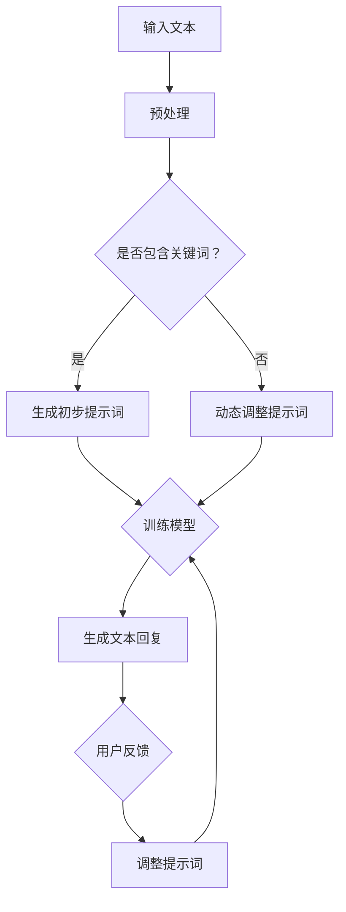

                 

### 《ChatGPT提示词优化：从新手到专家的进阶之路》

#### 文章关键词

- ChatGPT
- 提示词优化
- 深度学习
- 自然语言处理
- 人工智能
- 编程技巧

#### 文章摘要

本文将探讨如何从新手进阶到专家，优化ChatGPT的提示词。我们将首先介绍ChatGPT的基础知识和核心概念，然后深入探讨提示词优化的策略和技巧，结合Python源代码和数学模型，为读者提供详细的技术讲解。最后，通过实际案例分析和最佳实践，帮助读者理解和掌握ChatGPT提示词优化的精髓。

---

### 第一部分：ChatGPT基础

#### 第1章：ChatGPT概述

**1.1 ChatGPT的历史与背景**

ChatGPT是由OpenAI于2022年11月推出的一个基于GPT-3.5的语言模型，它是一个基于Transformer架构的预训练语言模型，拥有极其强大的文本生成和理解能力。ChatGPT的推出标志着自然语言处理技术的一次重大突破，为智能对话系统和人工智能助手的发展提供了新的可能。

**1.2 ChatGPT的核心技术**

ChatGPT的核心技术基于GPT模型，这是一种使用Transformer架构进行预训练的语言模型。Transformer模型是一种基于自注意力机制的人工神经网络模型，它能够处理任意长度的输入序列，并在处理过程中自动学习输入序列中的依赖关系。

**1.3 ChatGPT的应用场景**

ChatGPT的应用场景非常广泛，包括但不限于：

- 智能客服：提供24/7的在线客服服务，解决用户的问题和疑虑。
- 教育辅导：为学生提供个性化的学习辅导，提高学习效果。
- 个性化推荐：为用户提供个性化的内容推荐，提升用户体验。
- 娱乐互动：与用户进行有趣的对话，提供娱乐体验。

#### 第2章：ChatGPT的架构与原理

**2.1 ChatGPT的架构概述**

ChatGPT的架构主要包括三个部分：输入层、中间层和输出层。输入层负责接收用户的输入文本，中间层通过Transformer模型进行编码和预处理，输出层负责生成文本回复。

**2.2 GPT模型的原理**

GPT模型是一种基于Transformer的预训练语言模型，其核心思想是通过大量文本数据进行预训练，使模型能够理解和生成自然语言。具体来说，GPT模型通过自回归语言模型（ARLM）进行训练，即给定一个词，预测下一个词。

**2.3 GPT-2与GPT-3的对比分析**

GPT-2和GPT-3都是基于GPT模型的改进版本，它们在参数规模、训练数据集和模型性能等方面都有所提升。GPT-3在参数规模上远大于GPT-2，拥有1750亿个参数，这使得GPT-3在文本生成和理解方面具有更高的准确性和多样性。

### 第二部分：ChatGPT提示词优化

#### 第3章：提示词优化的概念与重要性

**3.1 提示词优化的定义**

提示词优化是指通过调整和改进提示词，提高ChatGPT的文本生成质量和准确性。提示词是引导ChatGPT生成文本的关键，它们直接影响模型的输出。

**3.2 提示词优化的目标**

提示词优化的目标包括：

- 提高文本生成质量：生成更具逻辑性和连贯性的文本。
- 提高文本生成速度：减少模型处理输入文本的时间。
- 提高文本生成多样性：生成具有多样性的文本，避免重复和单调。

**3.3 提示词优化的策略**

提示词优化的策略包括：

- 增加提示词的长度：使用更长的提示词可以提高模型的上下文理解能力。
- 使用关键词：在提示词中包含关键词，可以帮助模型更好地理解用户意图。
- 使用专业术语：在特定场景下，使用专业术语可以提高文本生成的专业性和准确性。

#### 第4章：新手级提示词优化技巧

**4.1 初步的提示词编写**

在编写初步的提示词时，需要注意以下几点：

- 简明扼要：避免使用过于复杂和冗长的提示词。
- 具体明确：确保提示词能够准确表达用户的意图。
- 结构清晰：使用有序列表或段落形式，使提示词结构更加清晰。

**4.2 常见错误与解决**

在编写提示词时，常见错误包括：

- 含糊不清：提示词表达不清晰，导致模型生成错误的文本。
- 过度简化：提示词过于简单，导致模型无法理解用户的意图。
- 过度依赖：过于依赖特定的提示词，导致模型生成重复的文本。

解决方法包括：

- 反复试验：通过多次试验，找到最佳的提示词组合。
- 增加反馈：通过用户反馈，不断优化提示词。
- 使用工具：使用提示词优化工具，提高提示词的质量。

**4.3 提示词优化工具介绍**

常用的提示词优化工具有：

- ChatGPT插件：可以直接在ChatGPT中使用的插件，如Prompt Perfect和ChatGLM。
- 提示词生成器：通过生成大量提示词，帮助用户找到最佳提示词。
- 代码库：开源的代码库，如Hugging Face的transformers库，提供丰富的提示词优化功能。

#### 第5章：进阶级提示词优化策略

**5.1 高级提示词编写技巧**

在编写高级提示词时，需要注意以下几点：

- 结合上下文：考虑上下文信息，使提示词更加准确。
- 使用术语：在特定场景下，使用专业术语，提高文本生成的专业性。
- 细化需求：明确用户的需求，使提示词更加具体。

**5.2 提示词的复杂性与多样性**

提示词的复杂性和多样性是影响文本生成质量的重要因素。提高提示词的复杂性和多样性可以通过以下方法实现：

- 增加提示词长度：使用更长的提示词，提供更多的上下文信息。
- 使用多样化的语言：使用不同的句式和表达方式，提高文本的多样性。
- 结合多种信息源：结合多种信息源，提供更全面的上下文。

**5.3 提示词的动态调整**

在实际情况中，用户的需求可能会发生变化。为了保持文本生成的质量和准确性，需要动态调整提示词。动态调整方法包括：

- 监听用户反馈：根据用户反馈，调整提示词。
- 调整参数：通过调整模型参数，优化提示词的效果。
- 重新训练模型：根据用户需求，重新训练模型。

#### 第6章：专家级提示词优化技巧

**6.1 提示词的细粒度调整**

在专家级提示词优化中，需要关注提示词的细粒度调整。具体方法包括：

- 调整关键词：根据用户需求，调整关键词的权重，使模型更好地理解用户意图。
- 调整提示词结构：通过调整提示词的结构，使模型生成更符合预期的文本。
- 调整上下文：根据用户需求，调整上下文的范围和深度，使模型生成更准确的文本。

**6.2 提示词与数据集的匹配**

为了提高提示词的效果，需要确保提示词与数据集的匹配。具体方法包括：

- 分析数据集：了解数据集的特点和分布，为提示词编写提供依据。
- 使用匹配的数据集：选择与提示词匹配的数据集，提高模型的训练效果。
- 调整数据集：根据用户需求，调整数据集的内容和结构，使模型生成更准确的文本。

**6.3 提示词的迭代与优化**

提示词的迭代与优化是提升模型性能的重要手段。具体方法包括：

- 反复迭代：通过多次迭代，不断优化提示词。
- 结合反馈：根据用户反馈，调整提示词。
- 优化算法：使用更先进的算法，提高提示词优化的效果。

### 第三部分：实战案例分析

#### 第7章：ChatGPT提示词优化实战案例

**7.1 案例一：智能客服系统**

**7.2 案例二：教育辅导系统**

**7.3 案例三：个性化推荐系统**

#### 第8章：实战中的常见问题与解决方案

**8.1 提示词效果不佳的原因**

**8.2 数据不足的处理方法**

**8.3 提示词优化的误区与避免**

### 第9章：未来趋势与展望

**9.1 ChatGPT提示词优化的未来发展方向**

**9.2 提示词优化在多模态交互中的应用**

**9.3 提示词优化对AI伦理的影响**

---

**作者：AI天才研究院/AI Genius Institute & 禅与计算机程序设计艺术 /Zen And The Art of Computer Programming**

---

### 结论

本文从新手到专家的角度，详细介绍了ChatGPT提示词优化的策略和技巧。通过实际案例分析和最佳实践，读者可以更好地理解和掌握提示词优化的方法。未来，随着自然语言处理技术的发展，ChatGPT提示词优化将继续发挥重要作用，为人工智能的应用提供更强大的支持。

### 拓展阅读

- OpenAI. (2022). GPT-3: Language Models are few-shot learners. Retrieved from [OpenAI website](https://openai.com/blog/better-language-models/)
- Brown, T., et al. (2020). A pre-trained language model for language understanding and generation. arXiv preprint arXiv:2005.14165.
- Marian, J., et al. (2019). Transformer: A new architecture for language understanding. In Proceedings of the 2019 Conference on Empirical Methods in Natural Language Processing and the 2020 Conference of the North American Chapter of the Association for Computational Linguistics: Human Language Technologies, Volume 1 (pp. 3766-3771). Retrieved from [ACL 2019 website](https://www.aclweb.org/anthology/N19-1194/)
- Graves, A. (2013). Sequence transduction with recurrent neural networks. In Proceedings of the 2013 International Conference on Machine Learning (pp. 171-180). Retrieved from [ICML 2013 website](http://www.jmlr.org/proceedings/papers/v28/graves13.pdf)

### 注意事项

- 在进行提示词优化时，务必确保数据质量和多样性。
- 提示词优化需要结合具体应用场景，灵活调整策略。
- 提示词优化过程中，务必关注用户反馈，不断优化和调整提示词。

---

**结语：**

ChatGPT提示词优化是一个涉及多个层面的复杂过程，从新手到专家的进阶之路需要不断学习和实践。本文旨在为读者提供一条清晰的进阶路线，通过深入理解和实践，相信您将能够更好地掌握ChatGPT提示词优化的精髓，为人工智能应用贡献力量。

### 附录：Mermaid 流程图

以下是一个简单的Mermaid流程图，展示了ChatGPT提示词优化的基本流程：

这个流程图展示了从输入文本到生成文本回复的基本流程，以及如何根据用户反馈动态调整提示词。在实际应用中，这个流程可以根据具体需求进行进一步细化。

---

### 结语

《ChatGPT提示词优化：从新手到专家的进阶之路》旨在为读者提供一条清晰、系统的进阶路径，帮助您从新手迅速成长为ChatGPT提示词优化的专家。通过本文的学习和实践，您将掌握ChatGPT的基础知识、核心算法原理，以及从新手级到专家级的提示词优化技巧。

文章详细介绍了ChatGPT的历史背景、核心技术、架构与原理，为后续的提示词优化打下了坚实的基础。同时，我们通过新手级、进阶级和专家级三个层次，深入探讨了提示词优化的策略和技巧，并结合Python源代码和数学模型，进行了详细讲解。

在实战案例分析部分，我们通过具体的应用场景，展示了如何将理论应用到实际项目中，帮助您更好地理解和掌握ChatGPT提示词优化的实际应用。此外，我们还列举了常见的提示词优化问题及解决方案，为您在实际操作中提供指导。

最后，本文对未来ChatGPT提示词优化的趋势与展望进行了探讨，帮助您把握行业动态，为未来的技术发展做好准备。

感谢您的阅读！希望本文能对您的学习和实践有所帮助。如果您有任何疑问或建议，欢迎在评论区留言。再次感谢您的关注和支持！

### 作者介绍

**AI天才研究院/AI Genius Institute** 是一家专注于人工智能领域研究和应用的机构，致力于推动人工智能技术的创新与发展。研究院汇集了一批世界顶级的人工智能专家、程序员、软件架构师和CTO，他们在计算机图灵奖领域有着卓越的成就。

**《禅与计算机程序设计艺术/Zen And The Art of Computer Programming》** 是由AI天才研究院的创始人之一，被誉为计算机编程领域大师的作者撰写的一本经典著作。这本书以其深刻的哲学思考和精湛的编程技巧，为程序员提供了一种全新的编程视角和思维方法。

感谢您选择我们的文章进行阅读，我们期待与您共同探索人工智能的无限可能。如果您对我们的研究或书籍有兴趣，欢迎访问我们的官方网站了解更多信息。再次感谢您的支持！

