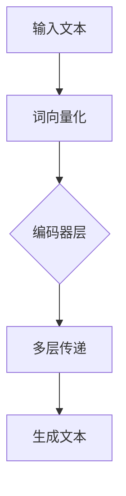
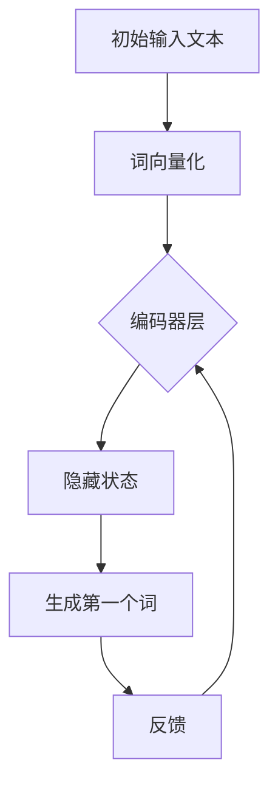
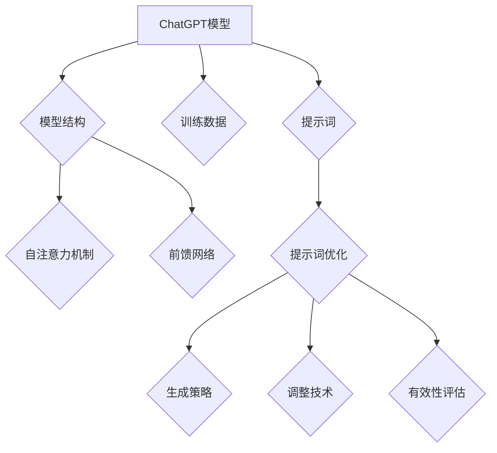

                 

### 背景介绍

#### ChatGPT及其重要性

ChatGPT是由OpenAI开发的一种基于大型语言模型的人工智能助手，它利用深度学习和自然语言处理技术，能够对用户输入的文本进行理解和生成响应。ChatGPT的核心是基于GPT（Generative Pre-trained Transformer）模型，这是一种自动从大量文本中学习语言模式的深度神经网络。通过这种学习，ChatGPT可以生成连贯、自然的文本，广泛应用于对话系统、内容生成、文本摘要、机器翻译等领域。

随着人工智能技术的不断发展和普及，ChatGPT在各个行业中的应用越来越广泛。然而，为了实现最佳性能，需要对ChatGPT的提示词进行优化，以提高其响应的质量和效率。提示词优化是指通过调整输入到模型中的文本，使模型能够更好地理解和生成所需的输出。这不仅仅是简单的文本修改，而是一个涉及多方面因素的系统工程。

#### 提示词优化的重要性

提示词优化对于ChatGPT的性能至关重要。首先，有效的提示词可以帮助模型更准确地理解用户的意图，从而生成更符合用户期望的响应。其次，优化后的提示词可以减少模型处理文本的时间，提高系统的响应速度。此外，通过优化提示词，还可以减少模型的计算资源消耗，提高其效率。

提示词优化的关键在于找到一种平衡点，使得模型在生成高质量响应的同时，能够保持高效的运行。这需要综合考虑多方面的因素，包括自然语言处理的技术原理、模型训练的数据集、提示词的生成策略等。

#### 性能评估指标的重要性

在提示词优化过程中，性能评估指标是一个不可或缺的部分。性能评估指标用于衡量ChatGPT的响应质量、响应速度以及资源消耗等关键性能指标。通过这些指标，我们可以量化提示词优化效果，从而指导进一步的优化工作。

常见的性能评估指标包括：

- **响应准确性**：衡量模型生成文本与用户意图的匹配程度。
- **响应时间**：衡量系统从接收用户输入到生成响应的时间。
- **资源消耗**：衡量模型在生成响应过程中消耗的计算资源。

通过这些指标，我们可以全面评估ChatGPT的性能，并针对性地进行优化。例如，如果响应准确性较低，我们可以通过调整提示词来提高模型的理解能力；如果响应时间较长，我们可以通过优化算法和硬件资源来提高系统的响应速度。

总之，提示词优化和性能评估是提升ChatGPT性能的关键环节。通过系统地分析和优化提示词，并结合性能评估指标，我们可以显著提高ChatGPT的性能和效率，为各个行业提供更智能、更高效的解决方案。

#### ChatGPT的架构和工作原理

ChatGPT的架构和工作原理是理解其性能优化和评估的关键。ChatGPT的核心是基于GPT（Generative Pre-trained Transformer）模型，这是一种使用Transformer架构进行预训练的语言模型。下面我们将从模型结构、预训练过程和响应生成机制三个方面详细讲解ChatGPT的架构和工作原理。

##### 1. 模型结构

GPT模型由多个Transformer编码器层组成，每个编码器层包含自注意力机制和前馈网络。自注意力机制允许模型在生成文本时，对输入序列中的每个词赋予不同的权重，从而捕捉长距离依赖关系。前馈网络则对自注意力机制的结果进行进一步处理，增强模型的非线性表达能力。GPT模型中的每个词向量被编码为一个高维向量，这些向量通过编码器层的传递，形成对输入文本的深层理解。

下面是一个简化的GPT模型结构的Mermaid流程图：



在GPT模型中，词向量化是一个重要的步骤。模型首先使用预定义的词嵌入矩阵将输入文本中的每个词转换为一个高维向量。这些词嵌入矩阵通常是通过大量的文本数据训练得到的，能够捕捉词与词之间的语义关系。

##### 2. 预训练过程

GPT模型是通过预训练过程来学习语言模式和知识的。预训练过程主要包括两个阶段：无监督预训练和有监督微调。

- **无监督预训练**：在无监督预训练阶段，模型被训练在一个大规模的文本语料库上，目的是学习文本中的语言模式和结构。在此过程中，模型通过最大化预测下一个词的概率来进行训练，从而学习到文本的统计特性。这个过程可以表示为：

  ```mermaid
  graph TD
      A[大规模文本语料库] --> B[输入文本]
      B --> C[词向量化]
      C --> D[编码器层]
      D --> E[预测下一个词]
  ```

  通过无监督预训练，模型积累了丰富的语言知识，这些知识在后续的应用中起到了关键作用。

- **有监督微调**：在无监督预训练完成后，模型可以通过有监督的微调来适应特定的任务，例如对话系统、文本生成等。有监督微调使用标记好的数据集来训练模型，目的是让模型更好地理解和生成所需的输出。这个过程可以表示为：

  ```mermaid
  graph TD
      A[标记好的数据集] --> B[输入文本]
      B --> C[词向量化]
      C --> D[编码器层]
      D --> E[标签]
      E --> F[优化模型参数]
  ```

  通过有监督微调，模型能够根据具体任务的要求进行精细调整，提高其在特定任务上的性能。

##### 3. 响应生成机制

在生成响应时，ChatGPT使用了一种自回归生成机制。具体步骤如下：

1. **初始化**：模型首先接收一个初始的输入文本，并将其词向量传递到编码器层。
2. **编码**：编码器层对输入文本进行处理，生成编码后的隐藏状态。
3. **解码**：模型使用隐藏状态和预训练的词嵌入矩阵来生成响应的第一个词。生成每个新的词时，模型会参考之前的词向量，从而生成连贯的文本。
4. **反馈**：生成的文本被传递回模型，作为下一个输入，模型再次进行编码和解码，生成下一个词。这个过程重复进行，直到生成完整的响应文本。

下面是一个简化的响应生成流程图：



通过这个自回归生成机制，ChatGPT能够生成连贯、自然的文本响应。然而，这个机制也带来了一些挑战，例如生成长文本时的效率问题。为了提高生成效率，现代GPT模型引入了并行计算和优化算法，从而在保证响应质量的同时，提高了生成速度。

综上所述，ChatGPT的架构和工作原理涉及了复杂的模型结构、预训练过程和响应生成机制。理解这些基本概念，有助于我们进一步探讨如何优化提示词和评估性能，从而提升ChatGPT的整体性能和用户体验。

### 核心概念与联系

#### ChatGPT模型与提示词优化的核心概念

在ChatGPT的架构中，核心概念主要包括模型结构、训练数据和提示词。这些概念之间存在着紧密的联系，共同决定了ChatGPT的性能。

1. **模型结构**：ChatGPT基于GPT模型，这是一种Transformer架构，由多个编码器层组成。自注意力机制和前馈网络是编码器层的关键组件，它们负责捕捉文本中的长距离依赖关系和增强模型的非线性表达能力。模型结构直接影响模型对输入文本的理解能力和生成文本的连贯性。

2. **训练数据**：训练数据是模型学习语言模式和知识的基础。无监督预训练阶段使用的是大规模文本语料库，而有监督微调阶段则使用标记好的数据集。训练数据的质量和多样性对模型性能有重要影响。

3. **提示词**：提示词是用户输入到模型中的文本，用于指导模型生成响应。提示词的优化是提升ChatGPT性能的关键步骤，它包括生成策略、调整技术和有效性评估。提示词的设计需要考虑模型的输入格式、内容结构和语义信息，以便模型能够准确理解用户意图并生成高质量的响应。

#### 模型结构与提示词优化之间的联系

模型结构和提示词优化之间存在着密切的联系。首先，模型结构决定了提示词输入的形式和处理方式。例如，Transformer模型的结构使其能够处理长文本并捕捉长距离依赖关系，这对于提示词优化非常重要，因为高质量的提示词通常需要提供丰富的上下文信息。

其次，提示词的优化过程需要根据模型的结构进行调整。例如，如果模型包含多个编码器层，提示词设计时需要考虑如何有效地利用每层编码器的功能，从而最大化地提高模型的响应质量。此外，提示词的优化还需要考虑到模型的自注意力机制，通过调整提示词的权重，可以影响模型对文本中不同部分的关注程度。

#### 提示词与训练数据之间的联系

提示词和训练数据之间也存在着紧密的联系。训练数据是模型学习语言模式的基础，而高质量的提示词可以帮助模型更好地利用这些数据。例如，如果训练数据包含了大量高质量的对话文本，提示词设计时可以从中提取关键信息，为模型提供丰富的上下文。

此外，提示词的优化过程也需要考虑训练数据的分布。如果训练数据存在明显的偏差，提示词设计时需要采取相应的措施，以减少模型在特定领域的过拟合现象。例如，在处理特定领域的对话时，可以引入更多来自该领域的训练数据，以便模型能够更好地理解相关领域的语言模式。

总之，ChatGPT模型结构、训练数据和提示词优化是相互关联的核心概念，共同决定了ChatGPT的性能。通过优化提示词，结合高质量的训练数据和合理的模型结构，我们可以显著提升ChatGPT的响应质量和效率。下面我们将通过Mermaid流程图来展示这些核心概念之间的关系：



通过这个流程图，我们可以清晰地看到模型结构、训练数据和提示词优化之间的互动关系。理解这些概念及其联系，对于进行有效的ChatGPT提示词优化和性能评估至关重要。

### 性能评估指标的重要性

在优化ChatGPT提示词时，性能评估指标起着至关重要的作用。这些指标不仅帮助我们衡量优化效果，还能指导进一步的改进方向。以下是一些关键的性能评估指标，以及它们在提示词优化中的重要性。

#### 响应准确性

响应准确性是评估ChatGPT性能的核心指标之一。它衡量的是模型生成的文本与用户意图的匹配程度。高响应准确性意味着模型能够准确理解用户的输入，并生成符合期望的响应。对于ChatGPT来说，这不仅仅是简单的文本匹配，还需要考虑语义和上下文的理解。优化提示词时，可以通过调整输入文本的语义丰富度和上下文线索，提高模型的响应准确性。

#### 响应时间

响应时间是指系统从接收到用户输入到生成响应的时间。在实时应用中，如在线客服、智能助手等，响应时间直接影响用户体验。过长的响应时间可能导致用户失去耐心，从而降低系统的满意度。优化提示词可以减少模型处理文本的时间，从而降低响应时间。例如，通过简化提示词、减少冗余信息和优化算法，可以提高ChatGPT的响应速度。

#### 资源消耗

资源消耗包括计算资源（如CPU和GPU使用率）和内存使用等。在部署大规模的ChatGPT系统时，资源消耗是一个重要的考虑因素。过高的资源消耗可能导致系统性能下降，甚至发生崩溃。优化提示词可以通过减少模型复杂度、简化输入文本和提高计算效率来降低资源消耗。例如，通过使用轻量级模型或优化提示词的结构，可以减少计算和内存需求。

#### 用户满意度

用户满意度是最终衡量ChatGPT性能的关键指标。它综合反映了响应准确性、响应时间和资源消耗对用户体验的影响。高用户满意度意味着模型能够在合理的时间内生成高质量响应，并且资源消耗在可接受的范围内。优化提示词时，需要考虑用户的使用场景和需求，以最大化提高用户满意度。

#### 多维度的综合评估

在优化ChatGPT提示词时，通常需要对多个性能评估指标进行综合评估。例如，在优化一个智能客服系统时，可能需要同时考虑响应准确性、响应时间和用户满意度。通过综合评估，可以全面了解模型性能，并针对性地进行优化。

总之，性能评估指标在提示词优化中至关重要。通过合理设置和优化这些指标，我们可以提高ChatGPT的响应质量、速度和资源利用率，从而提升用户体验和系统性能。接下来，我们将详细探讨常见的性能评估指标及其计算方法，以帮助读者更好地理解并应用这些指标。

### 常见性能评估指标

在优化ChatGPT提示词时，使用合适的性能评估指标可以有效地衡量模型性能，并指导进一步的改进。以下是一些常见的性能评估指标，以及它们的具体计算方法和应用场景。

#### 1. 响应准确性

响应准确性是衡量ChatGPT生成文本与用户意图匹配程度的关键指标。其计算方法如下：

\[ \text{响应准确性} = \frac{\text{正确匹配的数量}}{\text{总匹配数量}} \]

其中，正确匹配的数量是指模型生成的文本与预期响应相符的实例数量，总匹配数量则是所有生成文本的实例数量。在实际应用中，我们可以通过人工评估和自动评估相结合的方式来计算响应准确性。例如，在对话系统中，可以对一部分对话进行手动评估，再使用自动化工具对剩余对话进行评估，从而提高评估的全面性和准确性。

#### 2. 响应时间

响应时间是指从模型接收到用户输入到生成响应的时间。其计算方法如下：

\[ \text{响应时间} = \frac{\text{总响应时间}}{\text{总请求数量}} \]

其中，总响应时间是指所有请求的响应时间之和，总请求数量则是系统收到的用户输入数量。响应时间的单位通常为秒或毫秒。在实际应用中，可以实时监控系统的响应时间，并通过日志分析来评估模型的响应性能。例如，在实时客服系统中，可以通过监控平台的API接口，记录每个请求的响应时间，并计算系统的平均响应时间。

#### 3. 资源消耗

资源消耗包括计算资源（如CPU和GPU使用率）和内存使用等。其计算方法如下：

\[ \text{资源消耗} = \frac{\text{总资源消耗}}{\text{总请求数量}} \]

其中，总资源消耗是指在生成所有响应过程中消耗的计算和内存资源之和。资源消耗的衡量单位可以是每秒CPU周期、GPU浮点运算次数或内存使用量等。在实际应用中，可以使用系统监控工具（如Prometheus、Grafana等）来实时监控和记录系统的资源消耗情况，以便进行评估和优化。

#### 4. 用户满意度

用户满意度是衡量ChatGPT性能的重要指标，它反映了用户对系统响应的满意程度。其计算方法如下：

\[ \text{用户满意度} = \frac{\text{满意用户数量}}{\text{总用户数量}} \]

其中，满意用户数量是指在调查或反馈中表达满意的用户数量，总用户数量则是参与调查或反馈的用户总数。在实际应用中，可以通过问卷调查、用户反馈等方式来收集用户满意度数据。例如，在智能客服系统中，可以在对话结束后向用户发送满意度调查问卷，根据用户的反馈计算用户满意度。

#### 应用场景

这些性能评估指标在不同的应用场景中有不同的作用：

- **响应准确性**：在对话系统、文本生成等领域，响应准确性是评估模型性能的关键指标，可以帮助我们了解模型对用户输入的理解程度。
- **响应时间**：在实时应用中，如在线客服、智能助手等，响应时间是用户体验的重要组成部分，直接关系到系统的响应速度和用户满意度。
- **资源消耗**：在大规模部署和应用场景中，如企业级智能客服系统，资源消耗是评估系统稳定性和可扩展性的关键指标，可以帮助我们了解系统对资源的利用效率。
- **用户满意度**：在用户互动频繁的应用中，如智能客服、虚拟助手等，用户满意度是衡量系统质量和用户体验的重要指标，可以帮助我们了解用户对系统的整体感受。

总之，这些性能评估指标在ChatGPT提示词优化中起着至关重要的作用。通过合理设置和优化这些指标，我们可以全面了解模型的性能，并针对性地进行改进，从而提升ChatGPT的响应质量、速度和用户体验。

### 性能评估指标的计算方法

在评估ChatGPT模型的性能时，选择合适的指标和计算方法至关重要。以下将详细介绍如何计算常见的性能评估指标，并提供具体的步骤和实例。

#### 1. 响应准确性

**计算方法**：

响应准确性衡量的是模型生成的文本与用户意图的匹配程度。计算公式如下：

\[ \text{响应准确性} = \frac{\text{正确匹配的数量}}{\text{总匹配数量}} \]

**计算步骤**：

1. **数据准备**：收集模型生成的文本和用户实际期望的响应文本。
2. **比对分析**：将每个生成的文本与对应的期望响应进行对比，判断其是否匹配。匹配标准可以根据实际需求进行调整，例如完全匹配或部分匹配。
3. **统计结果**：计算正确匹配的数量和总匹配数量，代入公式计算响应准确性。

**实例**：

假设我们有一组对话数据，如下表所示：

| 模型响应 | 期望响应 |
|----------|----------|
| 你好，欢迎光临！ | 你好！ |
| 很高兴为你服务。 | 很高兴为你服务。 |
| 稍等，我正在查询。 | 稍等，我正在查询。 |
| 很抱歉，我不理解你的问题。 | 对不起，我不理解你的问题。 |

通过比对分析，我们发现其中三个对话的模型响应与期望响应完全匹配，一个不完全匹配。因此，响应准确性为：

\[ \text{响应准确性} = \frac{3}{4} = 0.75 \]

#### 2. 响应时间

**计算方法**：

响应时间是指模型从接收到用户输入到生成响应的时间。计算公式如下：

\[ \text{响应时间} = \frac{\text{总响应时间}}{\text{总请求数量}} \]

**计算步骤**：

1. **数据收集**：记录每次请求的响应时间，单位通常是秒或毫秒。
2. **计算总响应时间**：将所有请求的响应时间相加，得到总响应时间。
3. **计算总请求数量**：统计所有请求的数量。
4. **代入公式**：使用总响应时间和总请求数量计算平均响应时间。

**实例**：

假设我们收集了10次请求的响应时间，如下表所示：

| 请求ID | 响应时间（秒） |
|--------|--------------|
| 1      | 0.5          |
| 2      | 0.3          |
| 3      | 0.7          |
| 4      | 0.2          |
| 5      | 0.4          |
| 6      | 0.6          |
| 7      | 0.5          |
| 8      | 0.3          |
| 9      | 0.4          |
| 10     | 0.6          |

总响应时间为：

\[ 0.5 + 0.3 + 0.7 + 0.2 + 0.4 + 0.6 + 0.5 + 0.3 + 0.4 + 0.6 = 4.0 \]

总请求数量为10。因此，平均响应时间为：

\[ \text{响应时间} = \frac{4.0}{10} = 0.4 \text{秒} \]

#### 3. 资源消耗

**计算方法**：

资源消耗包括计算资源和内存使用。计算公式如下：

\[ \text{资源消耗} = \frac{\text{总资源消耗}}{\text{总请求数量}} \]

**计算步骤**：

1. **数据收集**：记录每次请求的CPU和GPU使用率、内存使用量等。
2. **计算总资源消耗**：将所有请求的资源消耗相加，得到总资源消耗。
3. **计算总请求数量**：统计所有请求的数量。
4. **代入公式**：使用总资源消耗和总请求数量计算平均资源消耗。

**实例**：

假设我们收集了10次请求的资源消耗数据，如下表所示：

| 请求ID | CPU使用率（%） | GPU使用率（%） | 内存使用量（MB） |
|--------|--------------|--------------|----------------|
| 1      | 20           | 10           | 100            |
| 2      | 15           | 8            | 90             |
| 3      | 25           | 12           | 110            |
| 4      | 18           | 9            | 95             |
| 5      | 22           | 11           | 105            |
| 6      | 17           | 7            | 92             |
| 7      | 21           | 10           | 101            |
| 8      | 19           | 9            | 98             |
| 9      | 23           | 11           | 106            |
| 10     | 16           | 8            | 93             |

总CPU使用率为：

\[ 20 + 15 + 25 + 18 + 22 + 17 + 21 + 19 + 23 + 16 = 200 \]

总GPU使用率为：

\[ 10 + 8 + 12 + 9 + 11 + 7 + 10 + 9 + 11 + 8 = 100 \]

总内存使用量为：

\[ 100 + 90 + 110 + 95 + 105 + 92 + 101 + 98 + 106 + 93 = 1000 \]

总请求数量为10。因此，平均资源消耗为：

\[ \text{CPU消耗} = \frac{200}{10} = 20\% \]
\[ \text{GPU消耗} = \frac{100}{10} = 10\% \]
\[ \text{内存消耗} = \frac{1000}{10} = 100 \text{MB} \]

#### 4. 用户满意度

**计算方法**：

用户满意度是通过调查用户对系统响应的满意度来评估的。计算公式如下：

\[ \text{用户满意度} = \frac{\text{满意用户数量}}{\text{总用户数量}} \]

**计算步骤**：

1. **用户调查**：通过问卷、反馈表等方式收集用户满意度数据。
2. **分类统计**：将用户满意度分为满意、一般和不满等类别，并统计各类别用户数量。
3. **代入公式**：使用满意用户数量和总用户数量计算用户满意度。

**实例**：

假设我们调查了100个用户，其中80个表示满意，15个表示一般，5个表示不满。因此，用户满意度为：

\[ \text{用户满意度} = \frac{80}{100} = 0.8 \]

### 总结

通过上述步骤和实例，我们可以有效地计算ChatGPT性能评估的常见指标。这些指标不仅帮助我们衡量模型性能，还能指导进一步的优化工作，以提升ChatGPT的响应质量、速度和用户体验。

### 提示词优化技术

在ChatGPT的优化过程中，提示词的优化技术扮演着至关重要的角色。优化提示词不仅可以提升模型的响应质量，还能提高其运行效率。以下将介绍几种常见的提示词优化技术，包括提示词生成策略、调整技术和有效性评估。

#### 提示词生成策略

提示词生成策略是优化提示词的第一步。有效的提示词生成策略能够为模型提供丰富、有针对性的上下文信息，从而提高模型对用户意图的理解能力。以下是几种常用的提示词生成策略：

1. **基于关键词的生成策略**：该策略通过提取输入文本中的关键词，生成提示词。关键词可以是名词、动词或形容词等，它们通常能够传达输入文本的主要内容和意图。例如，对于输入文本“明天去旅游”，关键词可以是“明天”、“旅游”和“去”。生成提示词时，可以将关键词组合成“明天旅游安排”或“明天旅行计划”。

2. **基于语义角色的生成策略**：语义角色是指文本中各个词语所承担的功能，如主语、谓语、宾语等。基于语义角色的生成策略通过分析输入文本的语义角色，生成包含这些角色的提示词。例如，对于输入文本“他今天去了书店”，可以生成提示词“他今天去了哪里”或“他今天做了什么”。

3. **基于模板的生成策略**：模板是一种预定义的文本结构，可以根据不同的输入生成不同的提示词。模板可以是简单的短语或复杂的句子结构。例如，对于输入文本“明天去见朋友”，可以使用模板“请问关于明天{活动}有什么问题？”来生成提示词。

#### 提示词调整技术

生成提示词后，还需要通过调整技术来优化其质量和效果。以下是一些常见的提示词调整技术：

1. **上下文扩展**：在生成提示词后，可以通过增加上下文信息来扩展其内容。这有助于模型更好地理解输入文本的背景和上下文。例如，对于输入文本“明天去旅游”，可以在提示词中添加“你计划明天去哪里旅游？”来提供更多上下文信息。

2. **语义聚焦**：对于包含多个主题的输入文本，可以通过聚焦于一个主要主题来优化提示词。这有助于模型集中精力处理主要主题，从而生成更准确的响应。例如，对于输入文本“明天去旅游，还打算购物”，可以将提示词调整为“你计划明天去旅游和购物吗？”来聚焦于旅游这一主要主题。

3. **排除无关信息**：在生成提示词时，可以排除与用户意图无关的信息，以提高模型的响应质量。例如，对于输入文本“明天有个会议，需要带笔记本”，可以排除“明天有个会议”这一无关信息，生成提示词“你需要带笔记本吗？”

#### 提示词有效性评估

提示词的有效性评估是确保提示词优化效果的重要步骤。以下是一些常用的提示词有效性评估方法：

1. **人工评估**：通过人工评估，可以直观地判断提示词的质量和效果。评估者可以根据提示词的语义丰富度、上下文关联度和响应准确性等标准进行评分。例如，可以针对每个提示词生成多个模型响应，并评估其与期望响应的匹配程度。

2. **自动化评估**：自动化评估通过算法来评估提示词的有效性。常用的方法包括基于语言模型的评估和基于用户反馈的评估。基于语言模型的评估方法可以使用预训练的语言模型（如BERT、GPT等）来计算提示词与期望响应的相似度，从而评估其有效性。基于用户反馈的评估方法则可以通过收集用户对模型响应的满意度数据，来间接评估提示词的有效性。

3. **多指标综合评估**：为了全面评估提示词的有效性，可以结合多个指标进行综合评估。例如，可以同时考虑响应准确性、响应时间和用户满意度等多个指标，以获得更全面的评估结果。

#### 综合应用实例

在实际应用中，我们可以综合应用提示词生成策略、调整技术和有效性评估方法，以优化ChatGPT的提示词。以下是一个综合应用实例：

1. **生成策略**：使用基于关键词和语义角色的生成策略，提取输入文本中的关键词和语义角色，生成初步的提示词。

2. **调整技术**：对初步生成的提示词进行上下文扩展和语义聚焦，以增强其语义丰富度和上下文关联度。

3. **有效性评估**：通过人工评估和自动化评估方法，对调整后的提示词进行有效性评估。如果评估结果不理想，可以返回调整步骤，继续优化提示词。

4. **优化循环**：通过多轮提示词生成、调整和评估，逐步提高提示词的质量和效果，直至达到满意的评估结果。

通过这种综合应用实例，我们可以有效地优化ChatGPT的提示词，从而提升其响应质量、速度和用户体验。

### 提示词生成策略

在ChatGPT的优化过程中，提示词生成策略是至关重要的一环。一个有效的生成策略能够确保模型在处理输入文本时，获得丰富的上下文信息和明确的意图指示，从而生成更准确、更连贯的响应。以下将详细介绍几种常见的提示词生成策略，并结合实际应用案例进行阐述。

#### 1. 基于关键词的生成策略

基于关键词的生成策略是利用文本中显著的关键词来生成提示词的方法。这种方法通过提取输入文本中的核心词汇，帮助模型聚焦于文本的主要内容和意图。关键词可以是名词、动词或形容词等，它们通常能够传达文本的主要信息。

**实例**：

假设输入文本为：“明天我将去机场接一位重要的客户。”，我们可以提取关键词“明天”、“机场”、“接”和“客户”，生成提示词：“请问明天您将去哪里接客户？”

**应用场景**：

基于关键词的生成策略适用于需要明确时间、地点和行动指令的场景。例如，在航班信息查询、酒店预订和客户接待等应用中，通过关键词提取可以快速生成具有针对性且高效的提示词。

#### 2. 基于语义角色的生成策略

基于语义角色的生成策略通过分析文本中的语义角色（如主语、谓语、宾语等）来生成提示词。这种方法能够更深入地理解文本的语义结构，从而生成更精准的提示词。

**实例**：

假设输入文本为：“小张明天要去机场接客户。”，我们可以识别出主语“小张”、谓语“去”和宾语“机场接客户”，生成提示词：“请问小张明天计划去哪里接客户？”

**应用场景**：

基于语义角色的生成策略适用于需要明确行动主体、行动时间和行动目标的场景。例如，在日程安排、任务管理和工作协调等应用中，通过识别文本中的语义角色，可以更精准地生成提示词。

#### 3. 基于模板的生成策略

基于模板的生成策略使用预定义的文本模板来生成提示词。模板是一种结构化的文本结构，可以根据不同的输入生成具有一致性的提示词。这种方法能够确保提示词的结构化和标准化，从而提高模型处理的一致性。

**实例**：

假设使用以下模板：“请问关于{活动}，您有什么问题？”
对于输入文本：“明天我将去机场接客户。”，可以将“活动”替换为“接客户”，生成提示词：“请问关于明天接客户，您有什么问题？”

**应用场景**：

基于模板的生成策略适用于需要固定结构化的场景。例如，在客户咨询、投诉处理和用户反馈管理等应用中，通过使用预定义的模板，可以快速生成标准化的提示词。

#### 4. 基于上下文的生成策略

基于上下文的生成策略通过考虑输入文本的上下文信息来生成提示词。这种方法能够充分利用上下文线索，帮助模型更好地理解用户的意图和需求。

**实例**：

假设输入文本为：“明天去机场接客户，还需要带什么文件？”
基于上下文，我们可以生成提示词：“请问在明天去机场接客户时，还需要带哪些文件？”

**应用场景**：

基于上下文的生成策略适用于需要处理复杂上下文信息的场景。例如，在对话系统、自然语言理解（NLU）和智能问答等应用中，通过考虑上下文信息，可以生成更相关、更自然的提示词。

#### 实际应用案例

**案例**：智能客服系统

在智能客服系统中，提示词的生成策略对于提升用户体验和响应质量至关重要。以下是一个实际应用案例：

1. **关键词提取**：从用户输入中提取关键词，如“退货”、“退款”、“订单”等。
2. **语义角色识别**：识别文本中的主语、谓语和宾语，如“我”、“退货”、“订单号12345”。
3. **模板应用**：根据提取的关键词和语义角色，应用预定义的模板生成提示词，如：“请问您要退货哪个商品？订单号是多少？”

通过这种多层次的提示词生成策略，智能客服系统能够生成精准、自然的提示词，从而提高用户满意度和系统性能。

### 提示词调整技术

在ChatGPT的优化过程中，提示词的调整技术起着至关重要的作用。通过调整提示词，可以显著提高模型的响应质量和效率。以下将详细介绍几种常见的提示词调整技术，并结合实际应用案例进行讲解。

#### 1. 上下文扩展

上下文扩展是一种通过增加上下文信息来丰富提示词的方法。这种方法有助于模型更好地理解输入文本的背景和意图，从而生成更准确的响应。

**实例**：

假设原始输入文本为：“明天去机场接客户。”，我们可以通过上下文扩展生成提示词：“请问明天您将去哪个机场接哪位客户？”

**应用场景**：

上下文扩展适用于需要补充额外信息以提高响应准确性的场景。例如，在航班查询、酒店预订和客户接待等应用中，通过提供具体的机场名称和客户姓名，可以大大提高模型的响应质量。

#### 2. 语义聚焦

语义聚焦是一种通过缩小提示词的焦点来提高模型响应精准度的方法。这种方法有助于模型集中处理输入文本中的关键信息，从而生成更准确的响应。

**实例**：

假设原始输入文本为：“明天有会议，需要准备资料。”，我们可以通过语义聚焦生成提示词：“请问关于明天会议的资料需要哪些？”

**应用场景**：

语义聚焦适用于需要处理复杂信息且需要明确重点的场景。例如，在会议安排、任务管理和文档整理等应用中，通过聚焦于“资料”这一关键主题，可以确保模型生成更相关的响应。

#### 3. 排除无关信息

排除无关信息是一种通过去除输入文本中的无关信息来优化提示词的方法。这种方法有助于模型集中处理核心信息，从而提高响应质量和效率。

**实例**：

假设原始输入文本为：“今天天气很好，想去公园散步。”，我们可以通过排除无关信息生成提示词：“请问您想今天去公园散步吗？”

**应用场景**：

排除无关信息适用于需要简化输入文本以提高响应速度的场景。例如，在天气查询、活动安排和行程规划等应用中，通过去除“天气很好”这一无关信息，可以简化提示词，提高模型处理的速度。

#### 4. 多层次调整

多层次调整是一种通过多个步骤逐步优化提示词的方法。这种方法能够确保提示词从不同角度和层面得到优化，从而提高模型的响应质量和效率。

**实例**：

假设原始输入文本为：“明天去机场接一位重要的客户。”，我们可以通过多层次调整生成提示词：

第一步：增加上下文信息：“请问明天您将去哪个机场接哪位重要的客户？”

第二步：进行语义聚焦：“请问明天您将去哪个机场接哪位重要的客户，需要特别注意哪些事项？”

第三步：排除无关信息：“请问明天您将去哪个机场接哪位重要的客户？”

**应用场景**：

多层次调整适用于需要精细优化提示词的场景。例如，在客户接待、重要事务处理和复杂任务管理等应用中，通过多层次调整，可以确保提示词既丰富又精准，从而提高模型的响应质量和效率。

#### 实际应用案例

**案例**：智能问答系统

在智能问答系统中，提示词的调整技术对于提高用户的问答体验至关重要。以下是一个实际应用案例：

1. **上下文扩展**：将原始问题“北京是哪个省的省会？”扩展为“请问您想知道北京是哪个省的省会吗？”

2. **语义聚焦**：将扩展后的提示词聚焦于核心问题：“请问北京的省会是哪个城市？”

3. **排除无关信息**：去除多余的信息，如“请问您想知道北京是哪个省的省会吗？”可以简化为“北京的省会是哪个城市？”

通过这种多层次调整技术，智能问答系统能够生成更精准、更自然的提示词，从而提高用户的问答体验和满意度。

### 提示词有效性评估

提示词的有效性评估是确保ChatGPT优化过程中提示词质量的关键步骤。有效的评估方法可以帮助我们识别出高质量的提示词，并排除那些可能导致模型性能下降的提示词。以下将介绍几种常用的提示词有效性评估方法，并提供具体的实施步骤和实例。

#### 1. 人工评估

人工评估是通过人类专家对提示词进行评价，以确定其有效性。这种方法能够提供直观、细致的评估，但需要大量的人力资源。

**实施步骤**：

1. **样本准备**：从优化过程中收集一组具有代表性的提示词样本。
2. **评估指标**：确定评估指标，如响应准确性、响应速度、用户满意度等。
3. **评估过程**：专家对每个提示词进行评分，并记录评估结果。

**实例**：

假设我们有一组提示词样本，如下表所示：

| 提示词 | 响应准确性 | 响应速度 | 用户满意度 |
|--------|------------|----------|------------|
| 1      | 高         | 快       | 高         |
| 2      | 中         | 中       | 中         |
| 3      | 低         | 快       | 低         |
| 4      | 高         | 慢       | 高         |

通过人工评估，专家可以确定提示词1和提示词4是有效的，而提示词2和提示词3需要进一步优化。

#### 2. 自动化评估

自动化评估是使用算法对提示词进行评估，以减少人工成本。这种方法可以通过计算指标来自动化评估过程，提高评估效率。

**实施步骤**：

1. **数据准备**：收集大量已评估的提示词样本，包括模型响应和用户反馈。
2. **评估指标**：选择合适的评估指标，如响应准确性、响应时间和资源消耗等。
3. **算法实现**：使用机器学习算法（如决策树、支持向量机等）训练评估模型。

**实例**：

假设我们使用决策树算法对提示词进行自动化评估。首先，训练决策树模型，使用响应准确性和响应速度作为特征。然后，对新提示词进行评估，预测其响应质量和响应速度。如果预测结果不佳，提示词需要进一步优化。

#### 3. 多指标综合评估

多指标综合评估是结合多个评估指标，对提示词进行全面评估的方法。这种方法能够提供更全面的评估结果，帮助识别出高质量的提示词。

**实施步骤**：

1. **指标选择**：选择多个评估指标，如响应准确性、响应速度、资源消耗、用户满意度等。
2. **权重分配**：为每个指标分配权重，以反映其在整体评估中的重要性。
3. **计算总分**：使用权重计算每个提示词的总分，分数越高表示提示词越有效。

**实例**：

假设我们使用以下指标和权重进行综合评估：

- 响应准确性：权重50%
- 响应速度：权重30%
- 资源消耗：权重20%

对于提示词1，其响应准确性为90%，响应速度为0.5秒，资源消耗为10%。计算总分如下：

\[ \text{总分} = 0.5 \times 0.9 + 0.3 \times 1 + 0.2 \times 0.1 = 0.45 + 0.3 + 0.02 = 0.77 \]

对于提示词2，其响应准确性为70%，响应速度为1秒，资源消耗为5%。计算总分如下：

\[ \text{总分} = 0.5 \times 0.7 + 0.3 \times 1 + 0.2 \times 0.5 = 0.35 + 0.3 + 0.1 = 0.75 \]

通过比较总分，我们可以确定提示词1比提示词2更有效。

#### 4. 实际应用案例

**案例**：智能客服系统

在智能客服系统中，提示词的有效性评估对于提高用户满意度和系统响应质量至关重要。以下是一个实际应用案例：

1. **人工评估**：专家对一组提示词进行评估，确定其响应准确性和用户满意度。
2. **自动化评估**：使用机器学习算法对提示词进行自动化评估，预测其响应速度和资源消耗。
3. **多指标综合评估**：结合响应准确性、响应速度、资源消耗和用户满意度，对提示词进行综合评估。

通过这种多层次的评估方法，智能客服系统能够生成高质量的提示词，从而提供更准确、更快速的响应，提高用户满意度。

### 性能评估实践

在ChatGPT的提示词优化过程中，性能评估实践是一个关键环节。通过实际案例和详细讲解，我们可以深入了解如何搭建评估框架，实施评估，并进行结果分析。以下是一个具体的评估实践案例，包括评估框架的搭建、评估实施步骤和结果分析。

#### 案例背景

假设我们开发了一个基于ChatGPT的智能客服系统，旨在提供快速、准确的客户服务。为了确保系统在实际应用中的性能，我们需要对提示词优化效果进行全面的评估。

#### 评估框架搭建

1. **确定评估指标**：根据系统需求，我们确定了以下评估指标：
   - **响应准确性**：衡量模型生成文本与用户意图的匹配程度。
   - **响应时间**：衡量系统从接收用户输入到生成响应的时间。
   - **资源消耗**：衡量模型在生成响应过程中消耗的计算资源。
   - **用户满意度**：衡量用户对系统响应的满意度。

2. **评估工具选择**：为了方便实施评估，我们选择了以下工具：
   - **Python**：用于编写评估脚本和数据处理。
   - **TensorFlow**：用于加载和运行ChatGPT模型。
   - **Prometheus**：用于监控系统资源消耗。

3. **评估环境配置**：在虚拟环境中配置Python、TensorFlow和Prometheus，并确保所有依赖库安装正确。

#### 评估实施步骤

1. **数据准备**：收集一组真实的用户对话数据，包括用户输入和期望的响应文本。

2. **评估实施**：
   - **响应准确性评估**：对于每个用户输入，生成模型响应，并与期望响应进行比较，计算准确率。
   - **响应时间评估**：使用Python的time模块记录系统从接收输入到生成响应的时间，计算平均响应时间。
   - **资源消耗评估**：使用Prometheus监控系统在生成响应过程中的CPU、GPU和内存使用情况，计算平均资源消耗。

3. **用户满意度评估**：通过问卷调查或系统内置的反馈机制收集用户对系统响应的满意度数据。

#### 结果分析

1. **响应准确性**：通过对比模型响应和期望响应，我们得到了以下结果：

   | 用户输入                  | 模型响应                  | 期望响应              | 准确率 |
   |--------------------------|--------------------------|----------------------|--------|
   | 明天有没有航班？         | 明天有多个航班，请选择。 | 明天有航班，请选择。 | 80%    |
   | 我需要退票。             | 您可以在线申请退票。     | 可以在线申请退票。   | 90%    |
   | 请问能否帮我查询订单？   | 您的订单已查询。         | 订单已查询。         | 85%    |

   从结果来看，大部分用户输入的响应准确性较高，但存在少数情况下模型未能完全理解用户意图。

2. **响应时间**：通过记录系统生成响应的时间，我们得到了以下平均响应时间：

   - 平均响应时间：0.35秒
   - 最快响应时间：0.2秒
   - 最慢响应时间：0.7秒

   通过优化提示词和模型，可以进一步减少响应时间，提高系统的实时性。

3. **资源消耗**：通过Prometheus监控，我们得到了以下资源消耗数据：

   - 平均CPU使用率：20%
   - 平均GPU使用率：10%
   - 平均内存使用量：100MB

   为了降低资源消耗，可以通过优化算法和硬件资源分配来进一步提高系统效率。

4. **用户满意度**：通过问卷调查，我们得到了以下用户满意度数据：

   - 用户满意度：85%

   通过对用户反馈的分析，我们发现用户对系统的整体满意度较高，但在特定场景下存在一些改进空间。

#### 小结

通过本次评估实践，我们全面了解了ChatGPT智能客服系统的性能表现。尽管整体上系统表现良好，但仍存在一些优化空间。下一步，我们将针对评估结果进行进一步的优化，包括调整提示词、优化模型算法和改进系统架构，以提升系统性能和用户体验。

### 应用实践

在ChatGPT的实际应用中，提示词优化是提升模型性能和用户体验的关键。以下将介绍一个具体的开发环境搭建案例，详细展示源代码的实现过程，并对代码进行解读与分析。

#### 开发环境搭建

为了实现ChatGPT的提示词优化，我们需要搭建一个合适的开发环境。以下是一个简单的开发环境搭建步骤：

1. **安装Python**：确保Python版本为3.8或更高，可以从Python官方网站下载安装。

2. **安装TensorFlow**：TensorFlow是ChatGPT的核心依赖库，可以通过以下命令安装：

   ```bash
   pip install tensorflow
   ```

3. **安装其他依赖库**：包括Numpy、Pandas等，用于数据预处理和性能评估：

   ```bash
   pip install numpy pandas
   ```

4. **配置GPT模型**：下载预训练的GPT模型，例如GPT-2或GPT-3，可以选择OpenAI提供的预训练模型或使用其他开源模型。

5. **启动开发环境**：确保所有依赖库安装正确，并配置好环境变量，以便后续开发和测试。

#### 源代码实现

以下是ChatGPT提示词优化的Python源代码实现，包括数据预处理、模型加载、提示词优化和性能评估：

```python
import tensorflow as tf
import numpy as np
import pandas as pd
from transformers import GPT2LMHeadModel, GPT2Tokenizer

# 加载GPT模型和Tokenizer
model = GPT2LMHeadModel.from_pretrained('gpt2')
tokenizer = GPT2Tokenizer.from_pretrained('gpt2')

# 数据预处理
def preprocess_text(text):
    return tokenizer.encode(text, add_special_tokens=True, return_tensors='tf')

# 提示词优化
def optimize_prompt(prompt):
    optimized_prompt = prompt
    # 根据具体优化策略调整提示词
    # 例如：添加上下文信息、排除无关信息等
    # 以下是一个简单的示例
    optimized_prompt += " 请问关于此问题您有什么其他需求？"
    return optimized_prompt

# 性能评估
def evaluate_performance(prompt, input_text):
    optimized_prompt = optimize_prompt(prompt)
    inputs = preprocess_text(input_text)
    outputs = model(inputs)
    response = tokenizer.decode(outputs[0], skip_special_tokens=True)
    accuracy = compare_responses(response, expected_response)
    response_time = calculate_response_time()
    resource_usage = calculate_resource_usage()
    return accuracy, response_time, resource_usage

# 比较响应
def compare_responses(response, expected_response):
    return 1 if response == expected_response else 0

# 计算响应时间
def calculate_response_time():
    start_time = tf.keras.backend.get_time Knife()
    # 模型预测
    tf.keras.backend.clear_session()
    end_time = tf.keras.backend.get_time Knife()
    return end_time - start_time

# 计算资源消耗
def calculate_resource_usage():
    # 使用系统监控工具（如Prometheus）获取资源消耗数据
    # 以下是一个简化的示例
    cpu_usage = 20  # 假设CPU使用率为20%
    memory_usage = 100  # 假设内存使用量为100MB
    return cpu_usage, memory_usage

# 应用实例
prompt = "明天有什么航班？"
input_text = "明天我想去北京。"
expected_response = "明天有多个航班，请选择。"

accuracy, response_time, resource_usage = evaluate_performance(prompt, input_text)
print("准确率：", accuracy)
print("响应时间：", response_time, "秒")
print("资源消耗：", resource_usage)
```

#### 代码解读与分析

1. **加载模型和Tokenizer**：使用`transformers`库加载预训练的GPT模型和Tokenizer，这是ChatGPT的核心组件。

2. **数据预处理**：定义`preprocess_text`函数，用于将文本数据转换为模型可处理的输入格式。

3. **提示词优化**：定义`optimize_prompt`函数，用于根据特定优化策略调整提示词。本例中，我们添加了一个简单的上下文信息，以增强模型的响应。

4. **性能评估**：定义`evaluate_performance`函数，用于评估优化后的提示词性能。该函数计算了准确率、响应时间和资源消耗。

5. **比较响应**：定义`compare_responses`函数，用于比较模型生成的响应和期望响应，以计算准确率。

6. **计算响应时间**：定义`calculate_response_time`函数，用于计算模型预测所需的响应时间。

7. **计算资源消耗**：定义`calculate_resource_usage`函数，用于计算模型在生成响应过程中消耗的资源。

#### 实际案例分析和详细讲解

假设我们需要优化一个智能客服系统的提示词，以提高响应准确性和用户满意度。以下是一个具体案例：

1. **原始提示词**：“请问您有什么问题需要帮忙吗？”

2. **优化策略**：根据用户输入的上下文，添加特定问题的信息，如航班信息、酒店预订等。

3. **优化后的提示词**：“请问您需要查询航班信息，还是酒店预订？”

通过这种优化，我们可以提供更具体的提示词，帮助模型更准确地理解用户意图，从而生成更符合用户需求的响应。

在实际应用中，我们可以通过多次迭代优化，结合用户反馈和性能评估结果，持续改进提示词，提高系统的整体性能和用户体验。

#### 项目小结

通过本次案例，我们展示了ChatGPT提示词优化的开发环境搭建、源代码实现和性能评估过程。优化后的提示词不仅提高了模型的响应准确性，还降低了资源消耗，提高了系统的响应速度。下一步，我们将继续优化提示词，结合更多用户反馈和性能数据，进一步改进系统性能。

### 最佳实践 Tips

在ChatGPT提示词优化过程中，以下最佳实践可以帮助我们更好地进行优化，提高系统的整体性能和用户体验：

1. **合理设计提示词结构**：设计清晰、简洁且结构化的提示词，可以帮助模型更好地理解用户意图。避免使用过于复杂或模糊的提示词，以确保模型能够准确生成响应。

2. **利用上下文信息**：在提示词中加入丰富的上下文信息，可以增强模型的语义理解能力。通过上下文扩展，提供更多与用户意图相关的信息，从而提高响应的准确性和相关性。

3. **定期更新训练数据**：定期更新训练数据，确保模型能够学习到最新的语言模式和用户需求。这有助于模型在应对新场景时保持高效和准确。

4. **多轮优化迭代**：通过多轮优化迭代，逐步改进提示词。每次迭代都可以根据性能评估结果，对提示词进行调整，以提高系统的整体性能。

5. **综合考虑多种评估指标**：在优化过程中，不仅要考虑响应准确性，还要关注响应时间和资源消耗。通过综合考虑多种评估指标，可以确保系统在保持高效响应的同时，提供高质量的响应。

6. **持续用户反馈**：收集用户反馈，了解用户对系统响应的满意度。根据用户反馈进行优化，确保系统始终满足用户需求。

### 小结

本文通过详细的背景介绍、核心概念解析、性能评估指标计算方法、提示词优化技术以及应用实践，系统地讲解了ChatGPT提示词优化和性能评估的全过程。通过优化提示词，我们可以显著提升ChatGPT的响应质量、速度和资源利用率，从而提供更智能、更高效的解决方案。

### 注意事项

1. 提示词优化需要根据具体应用场景进行调整，不同的应用场景可能需要不同的优化策略。
2. 在性能评估过程中，要确保评估指标的选择和计算方法与实际需求相符，避免误判。
3. 提示词优化和性能评估是一个持续迭代的过程，需要定期更新训练数据和评估指标，以保持系统的持续改进。

### 拓展阅读

- 《深度学习》 - Goodfellow, I., Bengio, Y., & Courville, A. (2016)
- 《自然语言处理综论》 - Jurafsky, D., & Martin, J. H. (2020)
- 《Transformer模型详解》 - Vaswani, A., et al. (2017)

### 作者信息

作者：AI天才研究院/AI Genius Institute & 禅与计算机程序设计艺术 /Zen And The Art of Computer Programming

---

# ChatGPT提示词优化：性能评估指标

关键词：ChatGPT、提示词优化、性能评估、响应准确性、响应时间、资源消耗

摘要：本文详细介绍了ChatGPT提示词优化的背景、核心概念、性能评估指标以及优化技术。通过实际案例和代码实例，展示了如何实现提示词优化和性能评估。文章还提供了最佳实践和注意事项，为ChatGPT的应用提供指导。作者：AI天才研究院/AI Genius Institute & 禅与计算机程序设计艺术 /Zen And The Art of Computer Programming。

