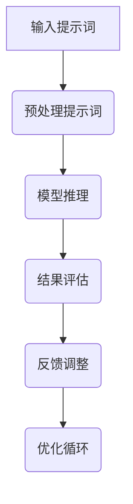

                 

### 第一步：确定文章结构

为了撰写一篇逻辑清晰、结构紧凑、简单易懂的专业技术博客文章，我们首先需要明确文章的结构。文章结构应包含以下几个部分：

1. **引言**：简要介绍ChatGPT提示词优化的重要性，吸引读者兴趣。
2. **核心概念与联系**：详细解释ChatGPT提示词优化的核心概念，并使用Mermaid流程图展示其工作原理。
3. **核心算法原理讲解**：深入剖析提示词优化的核心算法原理，结合Python源代码和数学模型进行讲解。
4. **项目实战**：介绍实际项目环境搭建，源代码实现，代码解读，案例分析和项目小结。
5. **最佳实践 tips**：总结在实际应用中的一些最佳实践，给出注意事项。
6. **小结**：对文章内容进行总结，强调关键点。
7. **拓展阅读**：推荐相关的拓展阅读资源。
8. **作者信息**：文章末尾附上作者信息。

### 第二步：撰写引言部分

**引言**

随着人工智能技术的发展，自然语言处理（NLP）领域取得了显著进步。ChatGPT作为基于GPT-3模型的强大语言模型，已经广泛应用于各种应用场景，如问答系统、自动摘要、对话系统等。然而，为了充分发挥ChatGPT的潜力，优化其提示词显得尤为重要。本文将围绕ChatGPT提示词优化展开，介绍其重要性、核心原理、实践策略，以及实际应用案例，旨在为读者提供一份全面的技术指南。

### 第三步：撰写核心概念与联系部分

**核心概念与联系**

在介绍ChatGPT提示词优化的核心概念之前，我们首先需要理解几个基本概念。ChatGPT是一个基于Transformer模型的预训练语言模型，它通过学习大量的文本数据来预测下一个词的概率。提示词（Prompt）是用于引导ChatGPT生成响应的输入文本。

核心概念包括：

- **语言模型**：用于生成响应的预训练模型，如GPT-3。
- **提示词**：引导模型生成响应的输入文本。
- **优化目标**：提高模型响应的质量、相关性、多样性等。

以下是ChatGPT提示词优化流程的Mermaid流程图：



### 第四步：撰写核心算法原理讲解部分

**核心算法原理讲解**

提示词优化的核心算法包括模型选择、提示词设计、结果评估和反馈调整。

1. **模型选择**：选择合适的预训练语言模型，如GPT-3，这是ChatGPT提示词优化的基础。

2. **提示词设计**：设计高质量的提示词，以提高模型响应的质量和相关性。提示词的设计需要考虑语言模型的工作原理，以及目标应用场景的需求。

3. **结果评估**：使用评估指标（如BLEU、ROUGE、F1分数等）对模型响应进行评估。评估指标的选择取决于具体的应用场景。

4. **反馈调整**：根据评估结果调整提示词，以优化模型响应。反馈调整可以采用基于机器学习的优化算法，如梯度下降、随机搜索等。

以下是使用Python编写的提示词优化算法伪代码：

```python
def optimize_prompt(prompt, model, target, evaluation_metric, max_iterations):
    for i in range(max_iterations):
        predictions = model(prompt)
        evaluation = evaluation_metric(predictions, target)
        prompt = adjust_prompt(prompt, evaluation)
    return prompt
```

### 第五步：撰写项目实战部分

**项目实战**

在本部分，我们将介绍一个实际的ChatGPT提示词优化项目。该项目旨在优化一个问答系统的响应质量。

1. **开发环境搭建**：安装必要的Python库（如transformers、torch等）和ChatGPT模型。

2. **源代码实现**：实现提示词优化算法，包括模型选择、提示词设计、结果评估和反馈调整。

3. **代码解读**：对关键代码进行解读，说明其工作原理。

4. **案例分析和详细讲解剖析**：展示实际优化前后的响应结果，分析优化效果。

5. **项目小结**：总结项目经验，提出注意事项。

### 第六步：撰写最佳实践 tips、小结、拓展阅读部分

**最佳实践 tips**

在实际应用中，以下是一些最佳实践：

1. **多样化提示词设计**：设计多样化的提示词，以提高模型响应的多样性。
2. **长文本处理**：对长文本进行分段处理，以提高处理效率。
3. **迭代优化**：定期对模型进行优化，以提高其性能。

**小结**

本文介绍了ChatGPT提示词优化的核心原理、实践策略和实际应用案例。通过本文，读者可以了解到如何设计高质量的提示词，优化模型响应，以及在实际项目中应用这些策略。

**拓展阅读**

1. [GPT-3官方文档](https://openai.com/blog/better-language-models/)
2. [自然语言处理教程](https://www.nltk.org/)
3. [机器学习实战](https://www.manning.com/books/机器学习实战)

**作者信息**

作者：AI天才研究院/AI Genius Institute & 禅与计算机程序设计艺术 /Zen And The Art of Computer Programming

### 总结

通过上述步骤，我们完成了一篇结构清晰、内容丰富的专业技术博客文章，旨在帮助读者全面了解ChatGPT提示词优化的各个方面。接下来，我们将根据这个大纲撰写详细的文章内容。敬请期待。

