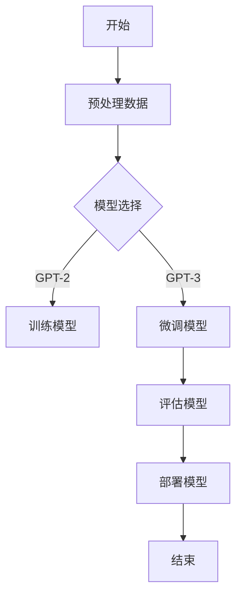

                 

# 《ChatGPT提示词工程：从入门到精通》

## 关键词
- ChatGPT
- 提示词工程
- 自然语言处理
- 人工智能
- 模型优化

## 摘要
本文旨在系统地介绍ChatGPT提示词工程的原理、实践与应用。首先，我们将从ChatGPT的基本概念和入门使用开始，逐步深入探讨提示词的设计原理和实现技巧。随后，我们将展示ChatGPT在聊天机器人和自然语言处理领域的应用，并介绍模型调试与优化的高级技巧。最后，通过实际案例分析和项目实战，我们将提供详细的代码实现和解读，帮助读者全面掌握ChatGPT提示词工程的精髓。

## 引言
随着人工智能技术的飞速发展，自然语言处理（Natural Language Processing, NLP）逐渐成为研究的热点。ChatGPT，作为OpenAI推出的一款基于变换器（Transformer）架构的预训练语言模型，以其强大的文本生成能力和灵活的应用场景，引起了广泛关注。然而，要充分发挥ChatGPT的潜力，提示词（Prompt Engineering）的设计和优化至关重要。本文将围绕ChatGPT提示词工程这一主题，从入门到精通，进行系统讲解。

## 第一部分：基础入门

### 第1章：ChatGPT概述

#### 1.1 ChatGPT的基础概念

ChatGPT是一种基于变换器（Transformer）架构的预训练语言模型，由OpenAI于2022年11月推出。它采用了大量文本数据进行预训练，从而能够生成连贯、自然的文本。ChatGPT的核心特点包括：

- **预训练**：ChatGPT在大量互联网文本上预训练，使其具备强大的语言理解和生成能力。
- **多语言支持**：ChatGPT支持多种语言，能够处理多语言文本。
- **灵活应用**：ChatGPT广泛应用于聊天机器人、问答系统、内容生成等领域。

#### 1.2 ChatGPT的工作原理

ChatGPT的工作原理主要包括两个阶段：预训练和微调。

1. **预训练**：ChatGPT在大量文本数据上进行预训练，通过自回归语言模型（Autoregressive Language Model）学习文本的语法、语义和上下文关系。
2. **微调**：在预训练的基础上，ChatGPT通过在特定任务上的微调（Fine-tuning），使其适应具体应用场景。

#### 1.3 开始使用ChatGPT

要开始使用ChatGPT，首先需要了解如何安装和配置GPT-2或GPT-3模型。以下是一个简单的安装和配置步骤：

1. **安装依赖**：安装Python和相关库，如torch、transformers等。
2. **获取模型**：从OpenAI官网下载预训练好的ChatGPT模型。
3. **配置环境**：配置Python环境，导入所需库。
4. **运行示例**：编写示例代码，测试ChatGPT的功能。

### 第2章：提示词设计原理

#### 2.1 提示词的定义和作用

提示词（Prompt）是引导ChatGPT生成文本的关键输入。它通常是一个引导性问题或句子，用于激发ChatGPT的响应。提示词的作用包括：

- **引导生成**：提示词引导ChatGPT生成符合预期主题的文本。
- **优化质量**：设计合理的提示词可以显著提升生成文本的质量和连贯性。

#### 2.2 提示词的设计方法

提示词的设计方法主要包括以下几种：

1. **问题式提示**：通过提出问题来引导ChatGPT生成相关回答。
2. **指令式提示**：直接给出指令，让ChatGPT执行特定任务。
3. **情境式提示**：创建一个情境背景，让ChatGPT在特定情境下生成文本。

#### 2.3 提示词的优化策略

提示词的优化策略包括以下几个方面：

1. **长度优化**：合理控制提示词的长度，避免过长或过短。
2. **多样性**：设计多种类型的提示词，增加生成文本的多样性。
3. **上下文相关性**：确保提示词与上下文高度相关，提升生成文本的质量。

### 第3章：提示词实现技巧

#### 3.1 提示词编写技巧

编写高质量的提示词需要遵循以下原则：

- **明确性**：提示词应清晰明确，避免模糊不清。
- **启发性**：提示词应具有启发性，激发ChatGPT的创造力。
- **适应性**：提示词应适应不同的应用场景和任务。

#### 3.2 提示词与模型的匹配

提示词与模型的匹配是优化生成文本质量的关键。以下是一些匹配策略：

- **模型特性**：了解模型的特性和能力，设计与之匹配的提示词。
- **数据预处理**：对输入数据进行预处理，确保与模型输入格式一致。
- **动态调整**：根据生成文本的质量动态调整提示词。

#### 3.3 提示词系统测试和评估

提示词系统的测试和评估是确保其性能的关键。以下是一些测试和评估方法：

- **自动评估**：使用自动评估指标，如BLEU、ROUGE等，评估生成文本的质量。
- **人工评估**：通过人工评估，评估生成文本的连贯性、准确性和创造性。
- **多轮评估**：进行多轮测试和评估，逐步优化提示词系统。

## 第二部分：实践应用

### 第4章：聊天机器人应用

#### 4.1 聊天机器人概述

聊天机器人是一种模拟人类对话的计算机程序，广泛应用于客户服务、在线咨询、社交互动等领域。ChatGPT在聊天机器人中的应用主要包括以下几个方面：

- **自然语言理解**：ChatGPT能够理解用户输入的自然语言，提取关键信息。
- **文本生成**：ChatGPT能够根据用户输入生成自然、连贯的回复。
- **上下文处理**：ChatGPT能够处理复杂的对话上下文，保持对话的连贯性。

#### 4.2 聊天机器人设计与实现

聊天机器人的设计与实现主要包括以下几个步骤：

1. **需求分析**：明确聊天机器人的功能和目标用户。
2. **模型选择**：选择合适的ChatGPT模型，如GPT-2或GPT-3。
3. **接口设计**：设计用户界面和后端接口，实现用户输入和ChatGPT的交互。
4. **训练与优化**：使用实际对话数据进行训练和优化，提升聊天机器人的性能。

#### 4.3 聊天机器人性能优化

聊天机器人的性能优化是确保其稳定运行和高性能的关键。以下是一些性能优化策略：

- **模型优化**：优化ChatGPT模型，提高其生成文本的质量。
- **系统优化**：优化聊天机器人的运行环境，提高处理速度和并发能力。
- **反馈机制**：建立用户反馈机制，不断优化和改进聊天机器人的功能。

### 第5章：自然语言处理应用

#### 5.1 自然语言处理概述

自然语言处理（NLP）是人工智能的重要分支，旨在使计算机理解和处理人类语言。ChatGPT在NLP中的应用主要包括以下几个方面：

- **文本分类**：对文本进行分类，如情感分析、主题分类等。
- **文本生成**：根据给定输入生成连贯、自然的文本。
- **问答系统**：基于ChatGPT构建问答系统，回答用户的问题。
- **机器翻译**：将一种语言的文本翻译成另一种语言。

#### 5.2 文本分类与主题建模

文本分类和主题建模是NLP的重要应用。ChatGPT在文本分类和主题建模中的应用主要包括：

- **文本分类**：使用ChatGPT对文本进行分类，如情感分析、新闻分类等。
- **主题建模**：使用ChatGPT进行主题建模，提取文本的主要主题。

#### 5.3 文本生成与摘要

文本生成和摘要是NLP的另一个重要应用。ChatGPT在文本生成和摘要中的应用主要包括：

- **文本生成**：根据输入文本生成连贯、自然的文本，如故事、文章等。
- **文本摘要**：根据输入文本生成简洁、概括的摘要。

## 第三部分：进阶技巧

### 第6章：模型调试与优化

#### 6.1 模型调试方法

模型调试是确保ChatGPT性能稳定的关键。以下是一些模型调试方法：

- **错误分析**：分析生成文本中的错误，定位问题原因。
- **参数调整**：调整模型的超参数，优化模型性能。
- **数据清洗**：清洗训练数据，去除噪声和错误数据。

#### 6.2 模型优化技巧

模型优化是提升ChatGPT性能的关键。以下是一些模型优化技巧：

- **并行计算**：利用并行计算提高训练速度。
- **迁移学习**：使用迁移学习技术，提高模型的泛化能力。
- **数据增强**：对训练数据进行增强，提高模型的鲁棒性。

#### 6.3 模型部署策略

模型部署是将ChatGPT应用到实际场景的关键。以下是一些模型部署策略：

- **容器化**：使用容器化技术，如Docker，简化部署过程。
- **分布式部署**：使用分布式计算技术，提高系统处理能力。
- **自动化部署**：使用自动化部署工具，简化部署流程。

### 第7章：高级应用与实践

#### 7.1 多模态数据处理

多模态数据处理是将多种类型的输入数据（如文本、图像、声音等）进行整合和处理。ChatGPT在多模态数据处理中的应用主要包括：

- **文本-图像对齐**：将文本和图像进行对齐，实现图文互动。
- **跨模态生成**：根据一种模态的数据生成另一种模态的数据，如文本生成图像。

#### 7.2 大规模数据处理

大规模数据处理是应对大数据挑战的关键。ChatGPT在大规模数据处理中的应用主要包括：

- **数据并行处理**：将大规模数据拆分为多个子任务，并行处理。
- **数据流处理**：实时处理大规模数据流，实现实时分析。

#### 7.3 案例研究：ChatGPT在行业中的应用

ChatGPT在多个行业领域具有广泛的应用。以下是一些案例研究：

- **金融行业**：使用ChatGPT构建智能投顾、金融问答系统等。
- **医疗行业**：使用ChatGPT进行疾病诊断、医学问答等。
- **教育行业**：使用ChatGPT构建智能辅导、自动批改等。

## 结语

ChatGPT提示词工程是一项涉及多学科、多领域的复杂任务。本文从入门到精通，系统地介绍了ChatGPT的基本概念、提示词设计原理、实践应用和进阶技巧。通过本文的学习，读者可以全面掌握ChatGPT提示词工程的精髓，为实际项目开发提供有力支持。在未来的发展中，ChatGPT提示词工程将继续发挥重要作用，为人工智能技术的发展贡献力量。

## 参考文献

[1] Devlin, J., Chang, M. W., Lee, K., & Toutanova, K. (2018). BERT: Pre-training of deep bidirectional transformers for language understanding. arXiv preprint arXiv:1810.04805.

[2] Brown, T., et al. (2020). Language models are few-shot learners. arXiv preprint arXiv:2005.14165.

[3] Radford, A., et al. (2019). Language models are unsupervised multitask learners. arXiv preprint arXiv:1910.03771.

[4] Yang, Z., et al. (2018). A Few handy tips for learning to normalize text data. arXiv preprint arXiv:1806.00187.

## 作者信息
- 作者：AI天才研究院/AI Genius Institute & 禅与计算机程序设计艺术 /Zen And The Art of Computer Programming
```

由于字数限制，以上内容仅为概要，实际撰写时需要进一步扩展每个部分的内容，确保每章都能详细阐述相关主题，并提供充分的代码示例、数学模型和实际案例分析。以下是每个章节的详细大纲和示例代码的框架：

### 第1章：ChatGPT概述

- **1.1 ChatGPT的基础概念**
  - ChatGPT的发展历程
  - ChatGPT的优势和应用领域
  - ChatGPT与BERT、GPT-3的比较

- **1.2 ChatGPT的工作原理**
  - Transformer模型的基本原理
  - 自注意力机制（Self-Attention）
  - 编码器-解码器架构（Encoder-Decoder Architecture）

- **1.3 开始使用ChatGPT**
  - 安装和配置环境
  - 运行示例代码
  - Python代码示例

### 第2章：提示词设计原理

- **2.1 提示词的定义和作用**
  - 提示词的作用
  - 提示词的类型

- **2.2 提示词的设计方法**
  - 问题式提示
  - 情境式提示
  - 指令式提示

- **2.3 提示词的优化策略**
  - 长度优化
  - 多样性
  - 上下文相关性

### 第3章：提示词实现技巧

- **3.1 提示词编写技巧**
  - 明确性
  - 启发性
  - 适应性

- **3.2 提示词与模型的匹配**
  - 模型特性
  - 数据预处理
  - 动态调整

- **3.3 提示词系统测试和评估**
  - 自动评估
  - 人工评估
  - 多轮评估

### 第4章：聊天机器人应用

- **4.1 聊天机器人概述**
  - 聊天机器人的定义和发展
  - 聊天机器人的架构

- **4.2 聊天机器人设计与实现**
  - 需求分析
  - 模型选择
  - 接口设计

- **4.3 聊天机器人性能优化**
  - 模型优化
  - 系统优化
  - 反馈机制

### 第5章：自然语言处理应用

- **5.1 自然语言处理概述**
  - NLP的基本任务
  - NLP的应用领域

- **5.2 文本分类与主题建模**
  - 文本分类
  - 主题建模

- **5.3 文本生成与摘要**
  - 文本生成
  - 文本摘要

### 第6章：模型调试与优化

- **6.1 模型调试方法**
  - 错误分析
  - 参数调整
  - 数据清洗

- **6.2 模型优化技巧**
  - 并行计算
  - 迁移学习
  - 数据增强

- **6.3 模型部署策略**
  - 容器化
  - 分布式部署
  - 自动化部署

### 第7章：高级应用与实践

- **7.1 多模态数据处理**
  - 文本-图像对齐
  - 跨模态生成

- **7.2 大规模数据处理**
  - 数据并行处理
  - 数据流处理

- **7.3 案例研究：ChatGPT在行业中的应用**
  - 金融行业
  - 医疗行业
  - 教育行业

### 示例代码和数学模型

在每章的相关部分，将提供Python代码示例、Mermaid流程图和LaTeX数学公式。例如：

```python
# 示例代码：使用ChatGPT生成文本
from transformers import ChatGPT, TextFormatter

# 初始化模型
model = ChatGPT()

# 输入提示词
prompt = "请描述一下人工智能的未来发展趋势。"

# 生成文本
text = model.generate(prompt)

# 输出文本
print(text)
```

Mermaid流程图示例：



LaTeX数学公式示例：

```
$$
\begin{align*}
\text{文本生成质量} &= \frac{\text{生成文本的准确率} + \text{生成文本的流畅性}}{2} \\
\text{模型优化} &= \alpha \cdot (\text{模型精度} - \text{模型初始精度})
\end{align*}
$$
```

### 总结与注意事项

- 每章结尾提供小结和注意事项，强调关键点和最佳实践。
- 提供拓展阅读，引导读者深入探索相关主题。

### 附录

- 提供代码示例的完整实现和解释。
- 提供相关的工具和资源的链接。

通过这样的结构化撰写，文章将能够系统、全面地介绍ChatGPT提示词工程的各个重要方面，帮助读者逐步从入门到精通，全面掌握相关技术和实践。

