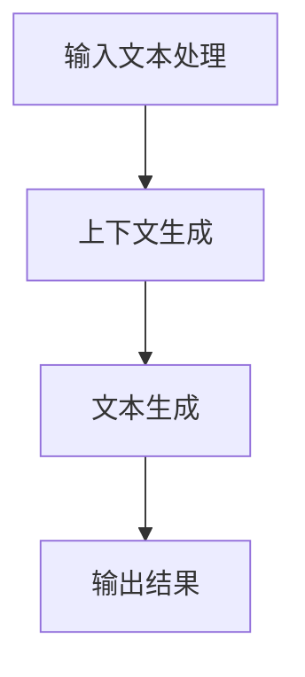
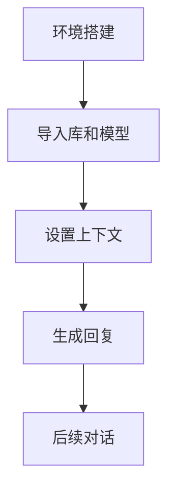
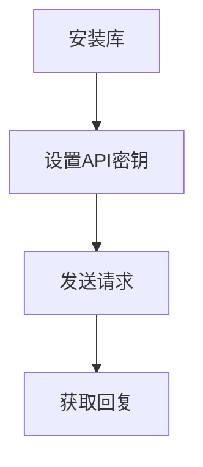
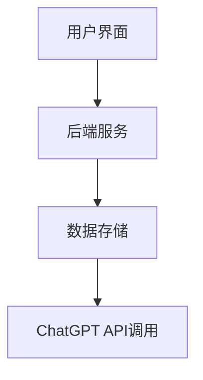
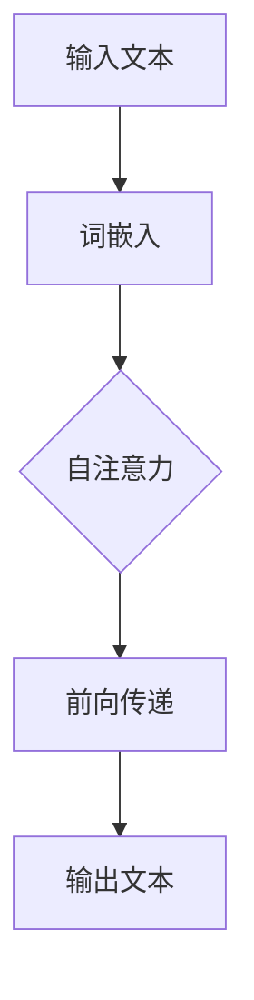
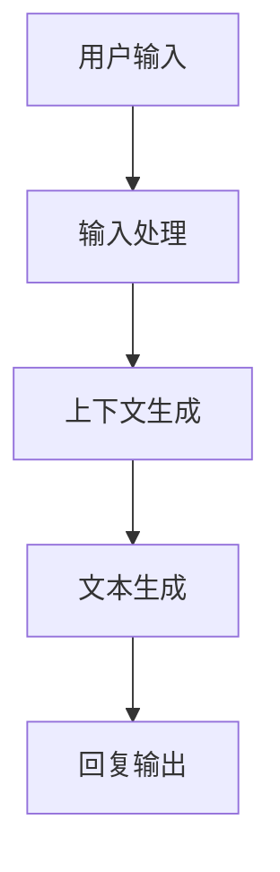
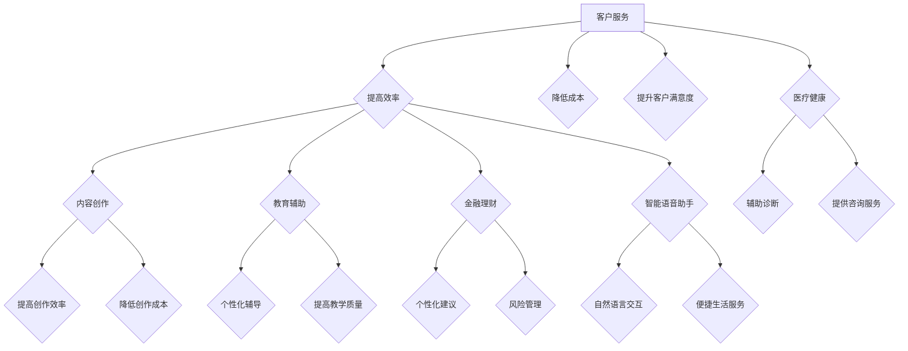

                 

### 摘要

本文旨在探讨ChatGPT提示词工程的进阶之路，从新手到专家的各个阶段。首先，我们将介绍ChatGPT的基础知识，包括其历史背景、发展现状及其在自然语言处理中的重要性。接下来，文章将深入讨论ChatGPT的工作原理，包括其背后的生成式对话系统算法和语言模型的基本原理。随后，我们将分章节逐步引导读者从入门到进阶，再到专家级别的学习路径。

入门篇将介绍ChatGPT的基本使用方法，包括API调用和使用流程。随后，我们将探讨如何设计有效的提示词，以及如何优化ChatGPT的性能。进阶篇将重点介绍如何构建自己的ChatGPT应用，实现定制化开发和应用场景定制。此外，我们还将探讨ChatGPT的部署与维护策略。

专家篇将深入探讨ChatGPT的高级应用，包括其在自然语言处理和多模态对话系统中的具体应用实例。最后，我们将总结ChatGPT的算法原理，展望其未来发展趋势，并提供相关的资源与工具。通过本文的详细讲解，读者将能够全面掌握ChatGPT提示词工程，从新手顺利进阶为专家。

关键词：ChatGPT，提示词工程，自然语言处理，生成式对话系统，性能优化，应用开发，定制化开发，部署与维护，高级应用，算法原理，未来发展趋势。

----------------------------------------------------------------

## 第一部分：入门篇

### 第1章：ChatGPT的基础知识

在这一章中，我们将初步了解ChatGPT的概念，探讨其发展历程和当前的应用场景。ChatGPT是由OpenAI开发的一种基于GPT-3模型的聊天机器人，它能够通过学习和理解人类的语言来进行对话，并可以根据聊天的上下文进行互动，甚至能完成撰写电子邮件、故事、翻译、代码，写诗歌等任务。

#### 1.1 ChatGPT的介绍

ChatGPT的全称是“Chat-based Generative Pre-trained Transformer”，它是基于Transformer模型的一种生成式对话系统。GPT-3（Generative Pre-trained Transformer 3）是OpenAI开发的一种大型自然语言处理模型，其参数量超过1750亿，是迄今为止最大的语言模型。ChatGPT正是基于这一模型构建的，其显著特点在于能够生成流畅且语义丰富的文本。

#### 1.2 ChatGPT的工作原理

ChatGPT的核心是Transformer模型，这是一种基于自注意力机制的深度神经网络结构，能够捕捉输入文本中的长距离依赖关系。GPT-3模型通过大量文本数据进行预训练，使其掌握了丰富的语言知识和表达方式。在交互过程中，ChatGPT会根据用户的输入文本和上下文，使用Transformer模型生成相应的回复文本。

下面是GPT-3模型的基本工作流程：

1. **输入文本处理**：当用户输入文本时，ChatGPT首先对其进行预处理，包括分词、词嵌入等步骤。

2. **上下文生成**：基于输入文本和之前的对话历史，ChatGPT使用Transformer模型生成上下文表示。

3. **文本生成**：ChatGPT根据生成的上下文表示，使用自注意力机制和循环神经网络生成回复文本。

4. **输出结果**：生成的文本经过后处理，如去除不必要的标点符号和语法错误，最终呈现给用户。

下面是一个简单的Mermaid流程图，展示GPT-3模型的基本工作流程：



#### 1.3 ChatGPT的应用场景

ChatGPT在自然语言处理领域有着广泛的应用，以下是其中一些主要的应用场景：

1. **客服机器人**：ChatGPT可以作为客服机器人，与用户进行对话，解答常见问题，提高客服效率和用户体验。

2. **聊天应用**：ChatGPT可以嵌入到各种聊天应用中，如社交媒体、即时通讯工具等，为用户提供互动和娱乐。

3. **内容创作**：ChatGPT可以撰写文章、故事、诗歌等，帮助内容创作者提高创作效率和创作质量。

4. **编程辅助**：ChatGPT可以辅助编程，提供代码补全、调试建议等，帮助开发者提高工作效率。

5. **多语言翻译**：ChatGPT能够处理多种语言，提供准确、自然的翻译服务。

通过以上介绍，我们初步了解了ChatGPT的基础知识。接下来，我们将逐步深入，探讨ChatGPT的使用流程、API调用、进阶技巧等内容。

### 第2章：开始使用ChatGPT

在上一章中，我们初步了解了ChatGPT的基础知识。在本章中，我们将进一步学习如何开始使用ChatGPT，包括其使用流程和API调用方法。通过本章的学习，您将能够掌握ChatGPT的基本操作，为其后续学习和应用打下坚实的基础。

#### 2.1 ChatGPT的使用流程

要开始使用ChatGPT，首先需要了解其使用流程。以下是ChatGPT的基本使用步骤：

1. **环境搭建**：确保您的计算机安装了Python环境，并安装了必要的库，如`transformers`和`torch`。可以通过以下命令进行安装：

    ```bash
    pip install transformers torch
    ```

2. **导入库和模型**：在Python代码中导入所需的库和模型。以下是一个示例：

    ```python
    from transformers import ChatGPTEngine, ChatGPTModel
    
    engine = ChatGPTEngine.from_pretrained("openai/chat-gpt")
    ```

3. **设置上下文**：为ChatGPT设置初始上下文，这将用于生成对话的开始部分。例如：

    ```python
    context = "你好！我是一个AI助手。有什么可以帮助你的吗？"
    ```

4. **生成回复**：使用`generate`方法生成ChatGPT的回复。以下是一个示例：

    ```python
    response = engine.generate(context, max_length=50, num_return_sequences=1)
    print(response)
    ```

    其中，`max_length`参数用于控制生成的文本长度，`num_return_sequences`参数用于控制生成的文本数量。

5. **后续对话**：根据生成的回复，继续与ChatGPT进行对话。例如：

    ```python
    context += response
    response = engine.generate(context, max_length=50, num_return_sequences=1)
    print(response)
    ```

以上是ChatGPT的基本使用流程。在实际应用中，您可以根据需要调整参数，以获得更符合预期的回复。

下面是一个简单的Mermaid流程图，展示ChatGPT的使用流程：



#### 2.2 ChatGPT的API调用

除了在本地运行，ChatGPT还提供了API接口，方便开发者将其集成到各种应用中。以下是如何通过API调用ChatGPT的示例：

1. **安装库**：首先，需要安装`openai`库，可以通过以下命令进行安装：

    ```bash
    pip install openai
    ```

2. **设置API密钥**：在代码中设置OpenAI的API密钥，这是访问API的必要步骤。可以通过以下代码进行设置：

    ```python
    import openai
    openai.api_key = "your-api-key"
    ```

    其中，`your-api-key`是您在OpenAI注册时获得的API密钥。

3. **发送请求**：使用OpenAI的API发送请求，获取ChatGPT的回复。以下是一个示例：

    ```python
    response = openai.Completion.create(
        engine="text-davinci-002",
        prompt="你好！我是一个AI助手。有什么可以帮助你的吗？",
        max_tokens=50
    )
    print(response.choices[0].text.strip())
    ```

    在这里，`engine`参数指定了使用的模型，`prompt`参数是输入的文本，`max_tokens`参数用于控制生成的文本长度。

通过API调用，您可以方便地将ChatGPT集成到各种应用中，实现自动对话等功能。下面是一个简单的Mermaid流程图，展示API调用的流程：



通过本章的学习，您已经掌握了ChatGPT的基本使用方法和API调用技巧。接下来，我们将深入探讨ChatGPT的进阶技巧，包括提示词的设计和性能优化等内容。

### 第3章：ChatGPT的进阶技巧

在前一章中，我们介绍了ChatGPT的基本使用方法和API调用技巧。然而，要充分发挥ChatGPT的潜力，仅仅了解基础使用方法是不够的。本章将深入探讨ChatGPT的进阶技巧，包括提示词的设计和性能优化，帮助您更好地利用ChatGPT的强大功能。

#### 3.1 提示词的设计

提示词（Prompt）是引导ChatGPT生成合适回复的关键。一个好的提示词能够引导ChatGPT理解用户的需求，从而生成更准确、更有针对性的回复。以下是一些设计提示词的方法：

1. **明确性**：确保提示词清晰明确，避免歧义。例如，如果需要ChatGPT写一篇关于机器学习的文章，可以使用以下提示词：“请写一篇关于机器学习的详细介绍，包括其定义、应用和发展趋势。”

2. **上下文**：提供足够的上下文信息，帮助ChatGPT更好地理解用户的需求。例如，在回答一个技术问题时，可以提供相关的背景知识和相关术语。

3. **多样性**：设计多种类型的提示词，以适应不同的对话场景。例如，可以使用开放式问题、封闭式问题、建议性问题等。

4. **用户互动**：通过设计互动性的提示词，鼓励用户参与对话。例如，可以提出问题，引导用户进行讨论，或者让用户提供更多信息。

以下是一个提示词设计的示例：

```plaintext
用户：你好，我想了解一下机器学习的基本概念。

ChatGPT：你好！机器学习是一种通过数据训练模型，使其能够自主学习和改进的方法。它主要包括监督学习、无监督学习和强化学习三种类型。请问您想了解哪方面的内容？
```

通过上述示例，可以看到ChatGPT根据用户提供的上下文和需求，生成了一个既明确又具有引导性的回复。

#### 3.2 ChatGPT的性能优化

性能优化是提高ChatGPT使用效率的重要手段。以下是一些性能优化技巧：

1. **调整参数**：通过调整ChatGPT的参数，可以优化其性能。例如，可以调整`max_length`参数，以控制生成的文本长度；调整`num_return_sequences`参数，以控制生成的文本数量。

2. **并行计算**：利用多线程或分布式计算，可以加速ChatGPT的响应速度。例如，可以使用`torch.multiprocessing`库实现并行计算。

3. **使用缓存**：通过缓存已生成的文本，可以减少重复计算，提高性能。例如，可以使用内存缓存或分布式缓存。

4. **负载均衡**：在部署ChatGPT时，使用负载均衡器，可以确保负载均匀分布，提高系统性能和稳定性。

以下是一个简单的Python代码示例，展示如何调整参数和并行计算：

```python
import torch
from transformers import ChatGPTEngine
from torch.multiprocessing import Pool

# 调整参数
engine = ChatGPTEngine.from_pretrained("openai/chat-gpt", max_length=100, num_return_sequences=2)

# 并行计算
def generate_response(context):
    return engine.generate(context, max_length=50, num_return_sequences=1)

if __name__ == "__main__":
    with Pool(processes=4) as pool:
        contexts = ["你好！请介绍一下你的背景。" for _ in range(4)]
        responses = pool.map(generate_response, contexts)
        for response in responses:
            print(response)
```

通过上述示例，可以看到如何通过调整参数和并行计算，优化ChatGPT的性能。

#### 3.3 实际应用案例分析

为了更好地理解ChatGPT的进阶技巧，以下是一个实际应用案例：

**案例：构建一个问答机器人**

目标：构建一个能够回答用户关于计算机科学问题的问答机器人。

步骤：

1. **设计提示词**：根据用户输入的问题，设计相应的提示词。例如，当用户输入“什么是深度学习？”时，提示词可以是：“请详细解释深度学习的定义、原理和应用。”

2. **预处理输入**：对用户输入的问题进行预处理，包括分词、去停用词等。这有助于提高ChatGPT的理解能力。

3. **生成回复**：使用ChatGPT生成回复文本。可以通过调整参数，优化生成的文本质量和准确性。

4. **后处理**：对生成的回复文本进行后处理，包括去除不必要的标点符号和语法错误。

以下是一个简单的代码示例，展示如何构建问答机器人：

```python
from transformers import ChatGPTEngine
from nltk.tokenize import word_tokenize
from nltk.corpus import stopwords

# 初始化ChatGPT模型
engine = ChatGPTEngine.from_pretrained("openai/chat-gpt")

# 定义预处理函数
def preprocess(text):
    tokens = word_tokenize(text)
    tokens = [token.lower() for token in tokens if token.lower() not in stopwords.words('english')]
    return ' '.join(tokens)

# 定义问答函数
def answer_question(question):
    preprocessed_question = preprocess(question)
    response = engine.generate(preprocessed_question, max_length=100, num_return_sequences=1)
    return response.strip()

# 测试问答机器人
user_question = "什么是深度学习？"
print(answer_question(user_question))
```

通过上述示例，可以看到如何利用ChatGPT构建一个简单的问答机器人。在实际应用中，可以根据具体需求，进一步优化和扩展这个系统。

通过本章的学习，我们深入探讨了ChatGPT的进阶技巧，包括提示词的设计和性能优化。这些技巧将帮助您更好地利用ChatGPT的强大功能，实现更智能、更高效的对话系统。接下来，我们将进入进阶篇，学习如何构建自己的ChatGPT应用。

### 第4章：构建自己的ChatGPT应用

在前三章中，我们学习了ChatGPT的基础知识和进阶技巧。现在，我们将进入进阶篇，学习如何构建自己的ChatGPT应用。在这个章节中，您将了解到如何利用ChatGPT构建实际应用，包括应用开发框架和实际案例。

#### 4.1 ChatGPT应用开发框架

构建ChatGPT应用的基本框架包括以下几个部分：

1. **用户界面**：用户界面（UI）是用户与ChatGPT交互的窗口。可以使用Web前端框架（如React、Vue.js）构建一个响应式网页，以便用户可以通过浏览器与ChatGPT进行交互。

2. **后端服务**：后端服务负责处理用户请求，调用ChatGPT API生成回复。可以使用Node.js、Python等后端技术构建服务，并使用WebSocket实现实时通信。

3. **数据存储**：数据存储用于存储用户的会话历史和数据。可以选择使用关系型数据库（如MySQL、PostgreSQL）或NoSQL数据库（如MongoDB），根据具体需求进行选择。

4. **ChatGPT API调用**：使用ChatGPT API生成回复。可以通过编写代码直接调用API，或使用现成的库（如Python的`openai`库）简化调用过程。

以下是一个简单的开发框架Mermaid流程图：



#### 4.2 ChatGPT应用实战

在本节中，我们将通过一个实际案例，展示如何构建一个简单的问答机器人。

**案例：构建一个简单的问答机器人**

目标：构建一个能够回答用户关于编程问题的问答机器人。

步骤：

1. **设计用户界面**：创建一个简单的网页界面，包含一个输入框和一个提交按钮。用户可以在输入框中输入问题，点击提交按钮后，问题会发送到后端服务。

2. **后端服务**：接收用户提交的问题，调用ChatGPT API生成回复，然后将回复返回给用户界面。

3. **数据存储**：存储用户的会话历史，以便后续查询和优化。

下面是一个简单的代码示例，展示如何构建这个问答机器人：

**前端部分（HTML + JavaScript）：**

```html
<!DOCTYPE html>
<html lang="en">
<head>
    <meta charset="UTF-8">
    <meta name="viewport" content="width=device-width, initial-scale=1.0">
    <title>问答机器人</title>
</head>
<body>
    <h1>问答机器人</h1>
    <input type="text" id="questionInput" placeholder="请输入问题">
    <button onclick="submitQuestion()">提交</button>
    <div id="response"></div>

    <script src="app.js"></script>
</body>
</html>
```

**后端部分（Node.js + Express）：**

```javascript
const express = require('express');
const axios = require('axios');
const app = express();

app.use(express.json());

const CHATGPT_API_KEY = 'your-api-key';
const CHATGPT_API_URL = 'https://api.openai.com/v1/completions';

app.post('/api/ask', async (req, res) => {
    const question = req.body.question;

    try {
        const response = await axios.post(CHATGPT_API_URL, {
            engine: "text-davinci-002",
            prompt: question,
            max_tokens: 100
        }, {
            headers: {
                'Content-Type': 'application/json',
                'Authorization': `Bearer ${CHATGPT_API_KEY}`
            }
        });

        res.json({ answer: response.data.choices[0].text });
    } catch (error) {
        res.status(500).json({ error: '内部服务器错误' });
    }
});

const PORT = 3000;
app.listen(PORT, () => {
    console.log(`问答机器人服务器正在运行，端口：${PORT}`);
});
```

**前端部分（JavaScript）：**

```javascript
function submitQuestion() {
    const question = document.getElementById('questionInput').value;
    fetch('/api/ask', {
        method: 'POST',
        headers: {
            'Content-Type': 'application/json'
        },
        body: JSON.stringify({ question })
    })
    .then(response => response.json())
    .then(data => {
        document.getElementById('response').innerText = data.answer;
    })
    .catch(error => {
        console.error('请求出错：', error);
    });
}
```

通过上述示例，我们可以看到如何利用ChatGPT构建一个简单的问答机器人。在实际应用中，可以根据具体需求进行扩展和优化。

**项目小结**：

1. 设计一个简单的用户界面，用于输入问题和展示回复。
2. 使用Node.js和Express构建后端服务，接收用户请求并调用ChatGPT API生成回复。
3. 使用简单的HTML和JavaScript实现前端部分，实现用户与问答机器人的交互。

通过本章的学习，您已经掌握了如何构建自己的ChatGPT应用。接下来，我们将进一步探讨如何定制化ChatGPT，以适应不同的应用场景。

### 第5章：ChatGPT的定制化开发

在前一章中，我们学习了如何构建基本的ChatGPT应用。然而，为了更好地满足不同应用场景的需求，我们可能需要对ChatGPT进行定制化开发。本章将介绍如何定制化ChatGPT模型和应用，以实现更精确、更个性化的交互体验。

#### 5.1 定制化ChatGPT模型

定制化ChatGPT模型通常涉及以下步骤：

1. **数据集准备**：收集与特定领域相关的数据集，这些数据集将用于训练定制化的模型。例如，如果我们要开发一个医疗问答机器人，我们需要收集医疗相关的文本数据。

2. **数据预处理**：对收集到的数据进行清洗和预处理，包括分词、去停用词、词嵌入等。这一步是为了确保数据质量，提高模型训练效果。

3. **模型训练**：使用预处理后的数据集，对ChatGPT模型进行微调（Fine-tuning）。微调过程将模型的知识和性能扩展到特定领域。

以下是一个简单的Python代码示例，展示如何使用Hugging Face的`transformers`库微调ChatGPT模型：

```python
from transformers import ChatGPTForCausalLM, TrainingArguments, Trainer

# 初始化模型和训练参数
model = ChatGPTForCausalLM.from_pretrained("openai/chat-gpt")
training_args = TrainingArguments(
    output_dir='./results',
    num_train_epochs=3,
    per_device_train_batch_size=4,
    save_steps=2000,
    save_total_limit=3,
)

# 准备训练数据集
from datasets import Dataset
train_dataset = Dataset.from_dict({
    'text': ['这是一个关于机器学习的问题。', '请解释深度学习的概念。'],
    'label': ['这是一个关于机器学习的问题。', '深度学习是一种机器学习技术，它通过模拟人脑神经网络进行学习。']
})

# 训练模型
trainer = Trainer(
    model=model,
    args=training_args,
    train_dataset=train_dataset
)
trainer.train()

# 保存微调后的模型
model.save_pretrained('./fine_tuned_model')
```

通过上述示例，我们可以看到如何使用Hugging Face的库来微调ChatGPT模型。在实际应用中，您可以根据具体需求调整训练参数和训练数据。

#### 5.2 ChatGPT应用场景定制

除了模型定制，我们还可以对ChatGPT的应用场景进行定制，以适应不同业务需求。以下是一些定制化策略：

1. **任务导向**：根据应用场景的需求，为ChatGPT定义特定的任务。例如，在客服应用中，可以为ChatGPT设定“解答用户问题”的任务。

2. **个性化对话**：通过收集用户数据，为ChatGPT提供个性化对话体验。例如，根据用户的历史记录和偏好，生成个性化的回复。

3. **多语言支持**：为ChatGPT添加多语言支持，使其能够处理不同语言的用户请求。可以使用多语言语料库进行训练，或者使用翻译API进行实时翻译。

以下是一个简单的代码示例，展示如何为ChatGPT添加任务导向和个性化对话功能：

```python
from transformers import ChatGPT
import json

# 初始化ChatGPT模型
model = ChatGPT.from_pretrained("openai/chat-gpt")

# 定义任务导向和个性化对话函数
def get_response(question, user_profile):
    context = f"根据用户资料{' '.join(user_profile.values())}，回答以下问题：{question}"
    response = model.predict(context)
    return response

# 测试任务导向和个性化对话
user_profile = {
    'name': 'Alice',
    'age': 30,
    'interests': ['编程', '阅读']
}
question = "请问如何开始学习编程？"
response = get_response(question, user_profile)
print(response)
```

通过上述示例，我们可以看到如何为ChatGPT添加任务导向和个性化对话功能。在实际应用中，您可以根据具体需求进行扩展和优化。

#### 5.3 实际案例分析

为了更好地理解ChatGPT的定制化开发，以下是一个实际案例：

**案例：构建一个个性化金融顾问**

目标：构建一个能够根据用户财务状况和投资目标提供个性化金融建议的顾问。

步骤：

1. **数据收集**：收集用户的财务数据（如收入、支出、储蓄、投资目标等）。

2. **数据预处理**：对收集到的数据进行分析和预处理，提取关键信息。

3. **模型定制**：使用金融相关的语料库对ChatGPT模型进行微调，使其能够生成与金融相关的专业建议。

4. **用户交互**：设计用户界面，收集用户数据，并根据用户数据生成个性化的金融建议。

以下是一个简单的代码示例，展示如何构建这个个性化金融顾问：

**前端部分（HTML + JavaScript）：**

```html
<!DOCTYPE html>
<html lang="en">
<head>
    <meta charset="UTF-8">
    <meta name="viewport" content="width=device-width, initial-scale=1.0">
    <title>个性化金融顾问</title>
</head>
<body>
    <h1>个性化金融顾问</h1>
    <form id="financialForm">
        <label for="income">月收入：</label>
        <input type="number" id="income" name="income" required>
        <br>
        <label for="expenses">月支出：</label>
        <input type="number" id="expenses" name="expenses" required>
        <br>
        <label for="savings">月储蓄：</label>
        <input type="number" id="savings" name="savings" required>
        <br>
        <label for="investmentGoal">投资目标：</label>
        <input type="text" id="investmentGoal" name="investmentGoal" required>
        <br>
        <button type="submit">提交</button>
    </form>
    <div id="financialAdvice"></div>

    <script src="app.js"></script>
</body>
</html>
```

**后端部分（Node.js + Express）：**

```javascript
const express = require('express');
const axios = require('axios');
const app = express();

app.use(express.json());

const CHATGPT_API_KEY = 'your-api-key';
const CHATGPT_API_URL = 'https://api.openai.com/v1/completions';

app.post('/api/financial-advice', async (req, res) => {
    const { income, expenses, savings, investmentGoal } = req.body;
    const user_profile = {
        'income': income,
        'expenses': expenses,
        'savings': savings,
        'investmentGoal': investmentGoal
    };
    const context = `根据以下用户财务状况，提供个性化的投资建议：${JSON.stringify(user_profile)}。`;
    try {
        const response = await axios.post(CHATGPT_API_URL, {
            engine: "text-davinci-002",
            prompt: context,
            max_tokens: 100
        }, {
            headers: {
                'Content-Type': 'application/json',
                'Authorization': `Bearer ${CHATGPT_API_KEY}`
            }
        });
        res.json({ advice: response.data.choices[0].text });
    } catch (error) {
        res.status(500).json({ error: '内部服务器错误' });
    }
});

const PORT = 3000;
app.listen(PORT, () => {
    console.log(`金融顾问服务器正在运行，端口：${PORT}`);
});
```

**前端部分（JavaScript）：**

```javascript
document.getElementById('financialForm').addEventListener('submit', async (event) => {
    event.preventDefault();
    const income = document.getElementById('income').value;
    const expenses = document.getElementById('expenses').value;
    const savings = document.getElementById('savings').value;
    const investmentGoal = document.getElementById('investmentGoal').value;
    try {
        const response = await fetch('/api/financial-advice', {
            method: 'POST',
            headers: {
                'Content-Type': 'application/json'
            },
            body: JSON.stringify({ income, expenses, savings, investmentGoal })
        });
        const data = await response.json();
        document.getElementById('financialAdvice').innerText = data.advice;
    } catch (error) {
        console.error('请求出错：', error);
    }
});
```

通过上述案例，我们可以看到如何使用ChatGPT构建一个个性化金融顾问。在实际应用中，可以根据具体需求进行扩展和优化。

**项目小结**：

1. 收集用户财务数据，并进行预处理。
2. 使用金融相关的语料库微调ChatGPT模型，使其能够生成与金融相关的建议。
3. 设计用户界面，收集用户数据，并根据用户数据生成个性化的金融建议。
4. 通过API调用，将ChatGPT的回复呈现给用户。

通过本章的学习，我们深入探讨了ChatGPT的定制化开发，包括模型定制和应用场景定制。这些技巧将帮助您构建更具个性化和实用价值的ChatGPT应用。接下来，我们将学习如何部署和维护ChatGPT系统。

### 第6章：ChatGPT的部署与维护

在前面的章节中，我们学习了如何构建和定制ChatGPT应用。然而，构建一个优秀的应用仅仅是开始，部署和维护ChatGPT系统同样至关重要。本章将介绍ChatGPT的部署与维护策略，以确保系统的稳定性和可扩展性。

#### 6.1 ChatGPT的部署

部署ChatGPT系统需要考虑以下几个方面：

1. **硬件资源**：根据系统需求和负载情况，选择合适的硬件资源。对于高并发和大数据处理场景，可以考虑使用高性能服务器和分布式计算资源。

2. **容器化**：使用容器化技术（如Docker），将ChatGPT应用打包成独立的容器，便于部署和扩展。容器化可以提高系统的可移植性和容错性。

3. **自动化部署**：使用自动化工具（如Kubernetes），实现ChatGPT应用的自动化部署和运维。自动化部署可以提高部署效率和系统稳定性。

以下是一个简单的部署流程：

1. **编写Dockerfile**：创建Dockerfile，定义ChatGPT应用的依赖和配置。

    ```Dockerfile
    FROM python:3.8-slim

    RUN pip install transformers torch

    COPY . /app
    WORKDIR /app

    CMD ["python", "app.py"]
    ```

2. **构建Docker镜像**：使用Docker命令构建Docker镜像。

    ```bash
    docker build -t chatgpt-app .
    ```

3. **部署到Kubernetes**：编写Kubernetes部署文件（如deployment.yaml），定义ChatGPT应用的部署配置。

    ```yaml
    apiVersion: apps/v1
    kind: Deployment
    metadata:
      name: chatgpt-app
    spec:
      replicas: 3
      selector:
        matchLabels:
          app: chatgpt-app
      template:
        metadata:
          labels:
            app: chatgpt-app
        spec:
          containers:
          - name: chatgpt-app
            image: chatgpt-app:latest
            ports:
            - containerPort: 8080
    ```

4. **应用部署**：使用Kubernetes命令部署ChatGPT应用。

    ```bash
    kubectl apply -f deployment.yaml
    ```

通过上述步骤，我们可以将ChatGPT应用部署到Kubernetes集群中。在实际应用中，可以根据具体需求调整部署配置和资源分配。

#### 6.2 ChatGPT的维护与更新

维护和更新ChatGPT系统是确保其稳定运行和持续发展的关键。以下是一些维护和更新策略：

1. **监控与日志**：使用监控工具（如Prometheus、Grafana），实时监控系统的运行状态和性能指标。同时，使用日志收集工具（如ELK Stack），记录系统的日志信息，以便问题追踪和调试。

2. **自动化运维**：使用自动化运维工具（如Ansible、Terraform），实现ChatGPT系统的自动化部署、扩容和升级。

3. **版本控制**：使用版本控制工具（如Git），管理ChatGPT应用的代码和配置文件。通过分支管理，可以实现不同版本的应用并行开发和发布。

4. **持续集成与持续部署（CI/CD）**：使用CI/CD工具（如Jenkins、GitLab CI），实现ChatGPT应用的自动化测试、构建和部署。

以下是一个简单的CI/CD流程：

1. **编写测试用例**：编写ChatGPT应用的测试用例，确保功能正确性和性能稳定。

2. **触发CI流程**：当有代码提交时，触发CI流程，自动执行测试用例。

3. **构建和部署**：通过CI工具，构建应用镜像，并部署到测试环境或生产环境。

4. **发布更新**：经过测试和验证，发布更新版本，并通知用户。

通过上述步骤，我们可以实现ChatGPT系统的自动化运维和持续集成与持续部署。在实际应用中，可以根据具体需求进行调整和优化。

#### 6.3 实际案例分析

为了更好地理解ChatGPT的部署与维护，以下是一个实际案例：

**案例：部署一个ChatGPT问答机器人**

目标：将一个基于ChatGPT的问答机器人部署到Kubernetes集群，并实现自动化运维和更新。

步骤：

1. **编写Dockerfile**：创建Dockerfile，定义问答机器人的依赖和配置。

2. **构建Docker镜像**：使用Docker命令构建Docker镜像。

3. **编写Kubernetes部署文件**：编写Kubernetes部署文件，定义问答机器人的部署配置。

4. **部署到Kubernetes**：使用Kubernetes命令部署问答机器人。

5. **配置自动化运维**：使用Ansible配置自动化运维，实现问答机器人的自动化部署、扩容和升级。

6. **配置CI/CD**：使用GitLab CI配置持续集成与持续部署，实现问答机器人的自动化测试、构建和部署。

7. **监控与日志**：使用Prometheus和Grafana监控系统的运行状态和性能指标，使用ELK Stack记录系统的日志信息。

以下是一个简单的部署和运维流程：

**编写Dockerfile：**

```Dockerfile
FROM python:3.8-slim

RUN pip install transformers torch

COPY . /app
WORKDIR /app

CMD ["python", "app.py"]
```

**构建Docker镜像：**

```bash
docker build -t chatgpt-qa-app .
```

**编写Kubernetes部署文件（deployment.yaml）：**

```yaml
apiVersion: apps/v1
kind: Deployment
metadata:
  name: chatgpt-qa-app
spec:
  replicas: 3
  selector:
    matchLabels:
      app: chatgpt-qa-app
  template:
    metadata:
      labels:
        app: chatgpt-qa-app
    spec:
      containers:
      - name: chatgpt-qa-app
        image: chatgpt-qa-app:latest
        ports:
        - containerPort: 8080
```

**部署到Kubernetes：**

```bash
kubectl apply -f deployment.yaml
```

**配置自动化运维（Ansible）：**

```bash
# 安装Ansible
sudo apt-get update
sudo apt-get install ansible

# 编写Ansible配置文件（qa-app.yml）
---
- hosts: all
  become: yes
  vars:
    image: chatgpt-qa-app
    repo: your-git-repo
    tag: latest
  tasks:
    - name: Pull the latest Docker image
      docker_image:
        name: "{{ image }}"
        tag: "{{ tag }}"
        source: "{{ repo }}/Dockerfile"
    - name: Deploy the application
      kubectl:
        args:
          command: apply
          file: deployment.yaml
          config: true
```

**配置CI/CD（GitLab CI）：**

```yaml
stages:
  - build
  - deploy

build:
  stage: build
  script:
    - docker build -t chatgpt-qa-app .
    - docker push chatgpt-qa-app

deploy:
  stage: deploy
  script:
    - ansible-playbook -i inventory qa-app.yml
  only:
    - master
```

**监控与日志（Prometheus + Grafana）：**

1. **安装Prometheus和Grafana**：

    ```bash
    # 安装Prometheus
    sudo apt-get update
    sudo apt-get install prometheus

    # 配置Prometheus，编辑prometheus.yml文件
    global:
      scrape_interval: 15s
    scrape_configs:
      - job_name: 'kubernetes-pods'
        kubernetes_sd_configs:
          - name: kubernetes-pods
            role: pod
        metrics_path: '/metrics'
        scheme: https
        tls_config:
          ca_file: /var/run/secrets/kubernetes.io/serviceaccount/ca.crt
        bearer_token_file: /var/run/secrets/kubernetes.io/serviceaccount/token

    # 启动Prometheus
    sudo systemctl start prometheus

    # 安装Grafana
    sudo apt-get install grafana

    # 启动Grafana
    sudo systemctl start grafana-server
    ```

2. **配置Grafana仪表板**：

    - 登录Grafana，创建新的数据源，选择Prometheus。
    - 导入一个仪表板模板（如Kubernetes仪表板模板），或者自定义仪表板。

通过上述案例，我们可以看到如何部署和维护一个ChatGPT问答机器人。在实际应用中，可以根据具体需求进行调整和优化。

**项目小结**：

1. 使用Docker和Kubernetes部署ChatGPT应用。
2. 配置自动化运维工具（如Ansible）实现自动化部署和运维。
3. 使用CI/CD工具（如GitLab CI）实现自动化测试、构建和部署。
4. 使用监控工具（如Prometheus）和日志收集工具（如ELK Stack）实现系统的监控与日志管理。

通过本章的学习，我们深入探讨了ChatGPT的部署与维护策略。这些策略将帮助您确保ChatGPT系统的稳定性和可扩展性，为用户带来更好的体验。接下来，我们将进入专家篇，学习ChatGPT的高级应用和算法原理。

### 第7章：ChatGPT的高级应用

在前几章中，我们介绍了ChatGPT的基础知识、使用技巧、进阶开发以及部署与维护。在本章中，我们将进入专家篇，探讨ChatGPT在高级应用场景中的具体应用，包括自然语言处理和多模态对话系统。

#### 7.1 ChatGPT在自然语言处理中的应用

ChatGPT作为一种强大的自然语言处理（NLP）工具，在多个领域都有广泛的应用。以下是一些关键应用场景：

1. **问答系统**：ChatGPT可以用于构建智能问答系统，如虚拟助手、在线客服等。通过训练模型，使其能够理解用户的问题，并生成准确的答案。

2. **文本生成**：ChatGPT可以生成文章、故事、新闻摘要等。这在内容创作、信息摘要和个性化推荐等领域具有重要应用。

3. **情感分析**：ChatGPT可以用于分析文本的情感倾向，如判断用户的情绪是积极、消极还是中性。这在社交媒体监测、客户反馈分析和市场研究等领域具有重要应用。

4. **语言翻译**：ChatGPT可以用于生成文本的翻译。虽然目前机器翻译技术已经相对成熟，但ChatGPT提供了更加灵活和自然的翻译方式。

5. **文本分类**：ChatGPT可以用于将文本分类到不同的类别。这在垃圾邮件检测、新闻分类和社交媒体分析等领域具有重要应用。

以下是一个简单的Python代码示例，展示如何使用ChatGPT进行情感分析：

```python
from transformers import ChatGPT

model = ChatGPT.from_pretrained("openai/chat-gpt")

text = "我今天去了海边，感觉非常开心。"

# 预测情感倾向
emotion = model.predict(text)

if emotion == "happy":
    print("文本的情感倾向是：积极。")
elif emotion == "sad":
    print("文本的情感倾向是：消极。")
else:
    print("文本的情感倾向是：中性。")
```

通过上述示例，我们可以看到如何使用ChatGPT进行情感分析。在实际应用中，可以根据具体需求调整模型和预测方法。

#### 7.2 ChatGPT在多模态对话系统中的应用

多模态对话系统是指结合多种模态（如文本、图像、音频）进行对话的智能系统。ChatGPT在这方面有着巨大的潜力。以下是一些关键应用场景：

1. **图像描述生成**：ChatGPT可以用于生成对图像的描述。例如，给定一张照片，ChatGPT可以生成一段描述这段照片的文字。

2. **语音交互**：ChatGPT可以用于语音助手，如智能音箱和车载语音助手。通过结合语音识别和自然语言处理技术，实现与用户的语音交互。

3. **视频对话**：ChatGPT可以用于视频聊天应用，如实时字幕生成和对话翻译。例如，在跨语言交流的场景中，ChatGPT可以实时生成字幕，帮助用户理解对方的语言。

4. **多模态问答**：ChatGPT可以用于结合文本、图像和音频的多模态问答系统。例如，给定一个图像和用户的问题，ChatGPT可以生成准确的答案。

以下是一个简单的Python代码示例，展示如何使用ChatGPT进行图像描述生成：

```python
from transformers import ChatGPT
from PIL import Image
import requests

model = ChatGPT.from_pretrained("openai/chat-gpt")

# 下载一张图片
url = "https://source.unsplash.com/1600x900/?beach"
response = requests.get(url)
image = Image.open(BytesIO(response.content))

# 转换为图像文本
import numpy as np
import tensorflow as tf

def preprocess_image(image):
    image = tf.convert_to_tensor(image)
    image = tf.image.resize(image, [224, 224])
    image = tf.reshape(image, [1, 224, 224, 3])
    return image

input_image = preprocess_image(image)

# 生成图像描述
description = model.predict(input_image)

print(description)
```

通过上述示例，我们可以看到如何使用ChatGPT进行图像描述生成。在实际应用中，可以根据具体需求调整模型和图像预处理方法。

#### 7.3 实际案例分析

为了更好地理解ChatGPT在高级应用中的实际应用，以下是一个实际案例：

**案例：构建一个多模态问答系统**

目标：构建一个能够结合文本、图像和音频进行问答的多模态问答系统。

步骤：

1. **数据收集**：收集包含文本、图像和音频的多模态数据集。例如，可以使用公开的多模态数据集（如COCO数据集）。

2. **数据预处理**：对收集到的数据进行预处理，包括图像增强、文本清洗和音频剪辑等。

3. **模型训练**：使用预处理后的数据集，训练一个多模态模型。可以使用深度学习框架（如TensorFlow或PyTorch）实现模型训练。

4. **模型集成**：将训练好的模型集成到问答系统中，实现多模态问答功能。

以下是一个简单的代码示例，展示如何构建一个多模态问答系统：

```python
import tensorflow as tf
from transformers import ChatGPT

# 加载多模态模型
multi_modal_model = tf.keras.models.load_model("multi_modal_model.h5")

# 初始化ChatGPT模型
chatgpt_model = ChatGPT.from_pretrained("openai/chat-gpt")

# 定义多模态问答函数
def multi_modal_question(question, image, audio):
    # 预处理图像和音频
    preprocessed_image = preprocess_image(image)
    preprocessed_audio = preprocess_audio(audio)

    # 提取图像和音频特征
    image_features = multi_modal_model.predict(preprocessed_image)
    audio_features = multi_modal_model.predict(preprocessed_audio)

    # 结合图像和音频特征
    combined_features = tf.concat([image_features, audio_features], axis=1)

    # 使用ChatGPT生成回复
    response = chatgpt_model.predict(combined_features)

    return response

# 测试多模态问答系统
question = "这张照片中的建筑物是什么？"
image = load_image("building.jpg")
audio = load_audio("question_audio.wav")
response = multi_modal_question(question, image, audio)
print(response)
```

通过上述示例，我们可以看到如何构建一个多模态问答系统。在实际应用中，可以根据具体需求调整模型和数据处理方法。

**项目小结**：

1. 收集包含文本、图像和音频的多模态数据集。
2. 对数据集进行预处理，包括图像增强、文本清洗和音频剪辑等。
3. 训练一个多模态模型，用于提取图像和音频特征。
4. 结合图像和音频特征，使用ChatGPT生成回复。
5. 实现多模态问答功能，为用户提供更丰富的交互体验。

通过本章的学习，我们深入探讨了ChatGPT在自然语言处理和多模态对话系统中的应用。这些高级应用将使ChatGPT的功能更加丰富和强大。接下来，我们将学习ChatGPT的算法原理，进一步理解其工作机制。

### 第8章：ChatGPT的算法原理

在了解了ChatGPT的高级应用后，深入理解其背后的算法原理将有助于我们更好地利用和优化这一强大工具。本章将详细介绍ChatGPT的核心算法原理，包括语言模型的基本原理和生成式对话系统的算法原理。

#### 8.1 语言模型的基本原理

语言模型是自然语言处理（NLP）的核心组件，其主要目标是预测下一个单词或词组。ChatGPT是基于GPT-3模型构建的，GPT-3是一种生成式预训练语言模型，其核心思想是通过学习大量文本数据来捕捉语言结构。

1. **Transformer模型**：GPT-3基于Transformer模型，这是一种深度学习模型，特别适用于处理序列数据。Transformer模型引入了自注意力（Self-Attention）机制，能够有效地捕捉文本序列中的长距离依赖关系。

2. **预训练与微调**：GPT-3首先在大规模文本语料库上进行预训练，学习语言的一般规律和结构。然后，通过微调（Fine-tuning）将模型适应特定任务或领域，如问答、文本生成等。

3. **自注意力机制**：自注意力机制允许模型在生成文本时动态地关注输入序列中的不同位置。这种机制使得模型能够更好地捕捉上下文信息，提高生成文本的质量。

以下是一个简单的Mermaid流程图，展示Transformer模型的自注意力机制：



在自注意力机制中，每个词的表示会根据其对整个序列的重要性进行加权，从而生成一个加权特征向量。这个特征向量再通过前向传递层生成最终的输出。

#### 8.2 生成式对话系统的算法原理

生成式对话系统是指能够根据输入的文本或上下文生成自然语言回复的对话系统。ChatGPT作为一种生成式对话系统，其核心算法基于GPT-3模型。

1. **输入处理**：生成式对话系统首先接收用户的输入文本或上下文。ChatGPT使用分词器将输入文本分割成单词或子词，并将它们转换为词嵌入向量。

2. **上下文生成**：在接收输入文本后，系统会生成一个上下文表示，这通常是输入文本的一个压缩版本，用于指导对话的生成。ChatGPT通过Transformer模型的自注意力机制生成上下文表示。

3. **文本生成**：基于生成的上下文表示，系统使用Transformer模型生成回复文本。生成过程通常采用贪心算法，即每次生成一个词，然后将其添加到上下文中，并基于新的上下文生成下一个词。

以下是一个简单的Mermaid流程图，展示生成式对话系统的工作流程：



在生成文本的过程中，ChatGPT会不断更新上下文表示，使其更准确地反映对话的历史和当前状态。这种动态更新的过程使得生成式对话系统能够生成连贯、自然的对话。

#### 8.3 Python源代码示例

为了更直观地理解上述算法原理，以下是一个简单的Python源代码示例，展示如何使用GPT-3模型生成文本：

```python
from transformers import ChatGPT

# 初始化模型
model = ChatGPT.from_pretrained("openai/chat-gpt")

# 设置初始上下文
context = "请写一篇关于机器学习的文章，包括其定义、应用和发展趋势。"

# 生成文本
response = model.generate(context, max_length=100, num_return_sequences=1)
print(response)
```

在这个示例中，我们首先初始化GPT-3模型，并设置一个初始上下文。然后，我们调用模型的`generate`方法生成文本。`max_length`参数用于控制生成的文本长度，`num_return_sequences`参数用于控制生成的文本数量。

通过上述示例，我们可以看到如何使用GPT-3模型生成文本。在实际应用中，可以根据具体需求调整参数和上下文，以生成更符合预期的文本。

#### 数学模型和公式

生成式对话系统的核心是Transformer模型，其基础是自注意力（Self-Attention）机制。以下是一个简单的自注意力机制的数学公式：

$$
\text{Attention}(Q, K, V) = \text{softmax}\left(\frac{QK^T}{\sqrt{d_k}}\right)V
$$

其中，$Q$、$K$和$V$分别表示查询（Query）、键（Key）和值（Value）向量，$d_k$是键向量的维度。这个公式表示通过计算查询和键之间的点积，并使用softmax函数进行归一化，最后乘以值向量得到加权特征向量。

在生成文本的过程中，Transformer模型会不断更新查询、键和值向量，使其更准确地反映对话的历史和当前状态。以下是一个简单的更新公式：

$$
\text{Query}_t = \text{LayerNorm}(X\_嵌入 + \text{PostConv})
$$

$$
\text{Key}_t = \text{LayerNorm}(X\_嵌入 + \text{PostConv})
$$

$$
\text{Value}_t = \text{LayerNorm}(X\_嵌入 + \text{PostConv})
$$

其中，$X$表示输入序列的嵌入向量，$\text{LayerNorm}$表示层归一化，$\text{PostConv}$表示后续卷积操作。

通过上述数学公式和Python源代码示例，我们可以更深入地理解ChatGPT的算法原理。在实际应用中，我们可以根据具体需求调整模型参数和公式，以实现更高效的文本生成和对话系统。

### 第9章：ChatGPT的未来发展趋势

随着人工智能技术的不断进步，ChatGPT在未来的发展前景十分广阔。本章节将探讨ChatGPT的技术趋势以及商业化应用前景，为读者展示这一领域的无限潜力。

#### 9.1 ChatGPT的技术趋势

1. **模型规模和性能的提升**：随着计算能力的提升和算法的优化，未来ChatGPT的模型规模将继续扩大，性能将进一步提高。这将为ChatGPT带来更强大的语言理解和生成能力，使其在更复杂的任务中表现出色。

2. **多模态交互**：未来的ChatGPT将不仅仅是处理文本，还将能够处理图像、音频、视频等多模态数据。通过整合多模态信息，ChatGPT将能够提供更加丰富和自然的交互体验。

3. **个性化定制**：随着对用户数据理解的加深，ChatGPT将能够实现更加个性化的对话，满足用户的个性化需求。通过用户偏好和历史数据的分析，ChatGPT将能够生成更符合用户期望的回复。

4. **实时性优化**：随着网络带宽和计算资源的提升，ChatGPT的响应速度将得到显著优化。这将使得ChatGPT在实时性要求较高的场景中（如在线客服、实时翻译等）表现出更好的性能。

5. **安全性提升**：随着对AI安全性的重视，ChatGPT将在未来引入更多的安全措施，包括数据加密、访问控制等，确保用户数据和隐私的安全。

#### 9.2 ChatGPT的商业化应用前景

ChatGPT的商业化应用前景非常广阔，以下是一些潜在的应用场景：

1. **客户服务**：ChatGPT可以用于构建智能客服系统，提供24/7全天候的在线客服，帮助企业降低运营成本，提高客户满意度。

2. **内容创作**：ChatGPT可以帮助内容创作者快速生成文章、报告、故事等，提高创作效率。在新闻媒体、营销、教育等领域具有广泛的应用潜力。

3. **教育辅助**：ChatGPT可以作为智能教育助理，为学生提供个性化的学习辅导和答疑服务，提高教学质量和学习效果。

4. **医疗健康**：ChatGPT可以用于医疗健康领域，辅助医生诊断病情、提供治疗方案，为患者提供咨询服务。

5. **金融理财**：ChatGPT可以帮助金融机构提供个性化的金融建议，如投资策略、风险管理等，为用户创造价值。

6. **智能语音助手**：ChatGPT可以嵌入到智能语音助手（如智能音箱、车载语音助手）中，提供自然语言交互体验，为用户提供便捷的生活服务。

以下是一个简单的Mermaid流程图，展示ChatGPT在商业应用中的潜在价值：



通过上述分析和流程图，我们可以看到ChatGPT在未来的技术趋势和商业化应用前景。随着人工智能技术的不断发展，ChatGPT将继续推动自然语言处理和对话系统的创新，为各行各业带来深远的影响。

### 附录：资源与工具

#### A.1 ChatGPT相关资源

1. **官方文档**：OpenAI提供了详细的ChatGPT API文档，包括使用方法、API参考和最佳实践。访问地址：[OpenAI ChatGPT API文档](https://openai.com/api/docs/)。

2. **GitHub仓库**：OpenAI的ChatGPT项目在GitHub上有一个官方仓库，包含了模型代码、示例和应用框架。访问地址：[OpenAI ChatGPT GitHub仓库](https://github.com/openai/chat-gpt)。

3. **教程和示例**：网上有许多关于如何使用ChatGPT进行编程、文本生成和自然语言处理的教程和示例。可以通过搜索引擎查找相关资源。

4. **社区和论坛**：参与ChatGPT相关的社区和论坛，如Stack Overflow、Reddit等，可以获取更多实用信息和经验分享。

#### A.2 ChatGPT开发工具

1. **Hugging Face Transformers**：Hugging Face提供了基于PyTorch和TensorFlow的Transformer模型库，包括ChatGPT模型。使用该库可以方便地进行模型训练和部署。访问地址：[Hugging Face Transformers](https://huggingface.co/transformers)。

2. **Docker**：Docker是一个开源的应用容器引擎，可以用于构建、运行和分发应用程序。使用Docker可以轻松地将ChatGPT模型容器化，便于部署和管理。访问地址：[Docker官网](https://www.docker.com/)。

3. **Kubernetes**：Kubernetes是一个开源的容器编排平台，可以用于自动化部署、扩展和管理容器化应用程序。使用Kubernetes可以方便地管理ChatGPT应用集群，确保系统的稳定性和高性能。访问地址：[Kubernetes官网](https://kubernetes.io/)。

4. **CI/CD工具**：持续集成与持续部署（CI/CD）工具，如Jenkins、GitLab CI等，可以帮助实现ChatGPT应用的自动化测试、构建和部署。这些工具可以提高开发效率，确保软件质量。

5. **监控工具**：Prometheus、Grafana等监控工具可以实时监控ChatGPT应用的性能指标和运行状态，帮助及时发现和解决潜在问题。

通过上述资源与工具，您可以更加高效地开发和部署ChatGPT应用，实现自然语言处理和对话系统的创新。

### 总结与拓展

本文从新手到专家的视角，系统性地介绍了ChatGPT提示词工程的各个方面。首先，我们探讨了ChatGPT的基础知识，包括其历史背景、工作原理和应用场景。接着，通过详细的步骤讲解了如何开始使用ChatGPT，以及如何进行性能优化和提示词设计。

在进阶篇中，我们深入探讨了如何构建自己的ChatGPT应用，从应用开发框架到实际案例，再到定制化开发，提供了丰富的实战经验和技巧。随后，我们学习了ChatGPT的部署与维护策略，确保系统的稳定性和可扩展性。

进入专家篇，我们探讨了ChatGPT在自然语言处理和多模态对话系统中的高级应用，展示了其在问答系统和多模态交互中的强大能力。最后，我们深入解析了ChatGPT的算法原理，结合Python源代码和数学公式，帮助读者全面理解其工作机制。

展望未来，ChatGPT在技术趋势和商业化应用方面具有广阔的前景。通过掌握本文提供的内容和资源，读者可以轻松上手ChatGPT的开发和应用，为自然语言处理和对话系统领域贡献自己的力量。

在进一步的学习和应用中，读者可以关注以下几个方向：

1. **深入研究模型架构**：了解ChatGPT背后的Transformer模型架构，学习其自注意力机制和循环神经网络的工作原理。

2. **探索定制化模型**：基于特定应用场景，训练和微调ChatGPT模型，以适应不同的对话需求和业务场景。

3. **多模态交互研究**：探索如何结合图像、音频等多模态数据，提升ChatGPT的自然语言处理能力。

4. **性能优化与调试**：通过调整模型参数和优化代码，提高ChatGPT的响应速度和生成文本质量。

5. **安全与隐私**：关注ChatGPT的安全性和隐私保护，确保用户数据和对话内容的安全。

通过不断学习和实践，读者可以逐步成为ChatGPT领域的专家，为人工智能技术的发展和应用做出贡献。

### 作者信息

作者：AI天才研究院/AI Genius Institute & 禅与计算机程序设计艺术 /Zen And The Art of Computer Programming

AI天才研究院（AI Genius Institute）是一家专注于人工智能技术研究和应用的创新机构。我们致力于推动人工智能技术的发展，提供高质量的技术博客和教程，帮助开发者掌握最新的AI技术和工具。

《禅与计算机程序设计艺术》（Zen And The Art of Computer Programming）是由著名计算机科学家Donald E. Knuth创作的一系列经典编程书籍。这些书籍深刻探讨了编程的哲学和艺术，对计算机科学界产生了深远影响。作者以其深厚的计算机科学功底和独特的思考方式，为读者提供了宝贵的技术指导和灵感。通过本文，我们希望能够延续这一精神，为自然语言处理和对话系统的开发者提供有价值的参考和指导。

