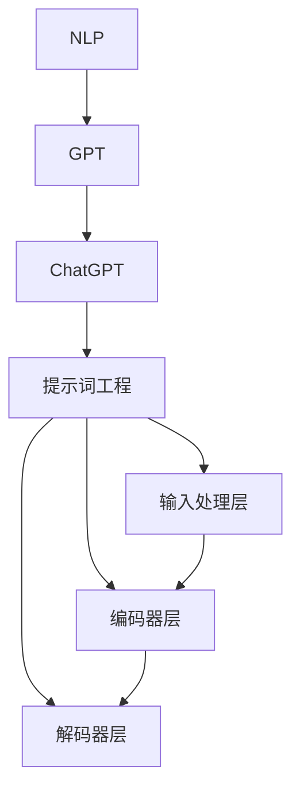
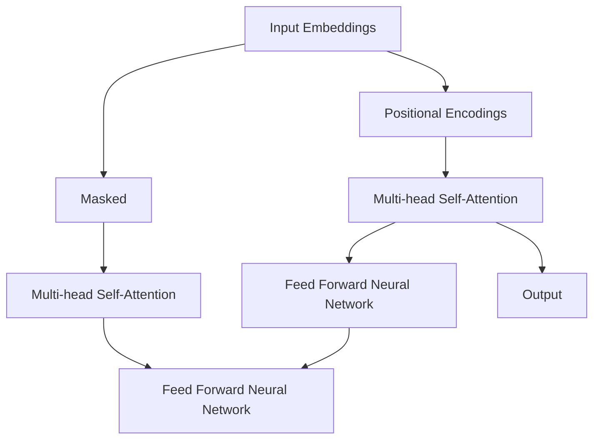

                 

### 背景介绍

ChatGPT，即聊天生成预训练模型（Chat-based Generative Pre-trained Transformer），是OpenAI推出的一款基于GPT-3（Generative Pre-trained Transformer version 3）的聊天机器人。GPT-3是一个具有1750亿参数的深度学习模型，它在自然语言处理（NLP）领域取得了巨大的突破，能够生成连贯、自然的语言输出。ChatGPT进一步利用了GPT-3的强大能力，通过设计高效的提示词工程，实现了更加自然、流畅的对话体验。

提示词工程是ChatGPT的核心技术之一。它涉及如何编写、优化和使用提示词，以引导模型生成预期的回答。一个设计良好的提示词不仅能够提高模型对输入的理解能力，还能提升生成回答的质量和准确性。

当前，ChatGPT在各种应用场景中表现出色，包括客户服务、虚拟助手、内容创作和代码生成等。然而，随着应用场景的不断扩大，如何进一步提升ChatGPT的性能，优化其提示词工程，成为一个亟待解决的重要问题。这促使研究者们深入探讨ChatGPT的原理，研究从概念到实现的系统化方法。

本文旨在系统地研究ChatGPT提示词工程，包括其核心概念、设计原理、实现细节和优化策略。通过本文的研究，我们希望能够为实际应用中的ChatGPT提供有益的指导，帮助开发者更好地设计高效的提示词，提高聊天机器人的对话质量。

### 核心概念与联系

要深入理解ChatGPT提示词工程的原理，我们首先需要明确几个核心概念，并探讨它们之间的关系。以下是ChatGPT提示词工程中的核心概念及其相互关联的架构图：

#### 1. 自然语言处理（NLP）

自然语言处理是人工智能领域的一个分支，旨在使计算机能够理解、处理和生成自然语言。NLP的核心技术包括分词、词性标注、命名实体识别、句法分析和语义理解等。这些技术为ChatGPT提供了理解和生成自然语言的基础。

#### 2. 生成预训练模型（GPT）

GPT是一种基于Transformer的深度学习模型，它通过自监督学习技术，从大规模的文本数据中进行预训练，从而学习到语言的内在结构和规律。GPT-3作为GPT家族的最新成员，具有极高的参数规模和强大的语言生成能力。

#### 3. 提示词工程

提示词工程是设计高效的提示词，以引导模型生成预期的回答。提示词可以是单词、短语或完整的句子，其目的是提供上下文信息，帮助模型更好地理解用户输入。

#### 4. ChatGPT架构

ChatGPT的架构通常包括输入处理层、编码器层和解码器层。输入处理层负责预处理用户输入，编码器层提取输入的语义特征，解码器层则根据这些特征生成自然语言回答。

#### 关系架构图

以下是一个Mermaid流程图，展示了这些核心概念及其相互关系：



#### Mermaid流程图解释

- **A[NLP]**：自然语言处理，是ChatGPT的基础。
- **B[GPT]**：生成预训练模型，从大量文本数据中学习语言结构。
- **C[ChatGPT]**：结合GPT模型，实现聊天功能的系统。
- **D[提示词工程]**：设计高效的提示词，引导模型生成预期回答。
- **E[输入处理层]**：预处理用户输入，提取关键信息。
- **F[编码器层]**：提取输入的语义特征，为解码器层提供输入。
- **G[解码器层]**：根据编码器的输出，生成自然语言回答。

通过这个关系架构图，我们可以清晰地看到ChatGPT提示词工程中的各个核心概念是如何相互联系和协作的。理解这些概念及其关系，对于深入研究和实现高效的ChatGPT提示词工程至关重要。

### 核心算法原理讲解

要深入理解ChatGPT提示词工程的核心算法原理，我们需要探讨Transformer模型、预训练技术和提示词工程策略。以下将通过Python源代码和数学模型，详细阐述这些算法原理，并结合具体的代码示例进行说明。

#### 1. Transformer模型

Transformer模型是一种基于自注意力机制的深度学习模型，广泛应用于自然语言处理任务。以下是一个简化的Transformer模型架构图：



#### 示例代码：Transformer模型

首先，我们需要导入必要的库，并定义Transformer模型的基本架构：

```python
import tensorflow as tf
from tensorflow.keras.layers import Embedding, MultiHeadAttention, Dense

def transformer_model(vocab_size, d_model):
    # 输入嵌入层
    inputs = tf.keras.layers.Input(shape=(None,), dtype=tf.int32)
    embeddings = Embedding(vocab_size, d_model)(inputs)

    # 位置编码
    positional_encoding = PositionalEncoding(d_model)(embeddings)

    # 编码器层
    encoding = MultiHeadAttention(num_heads=8, key_dim=d_model)(positional_encoding, positional_encoding)

    # 前馈神经网络
    encoding = Dense(units=d_model, activation='relu')(encoding)
    encoding = Dense(units=d_model)(encoding)

    # 解码器层
    output = MultiHeadAttention(num_heads=8, key_dim=d_model)(encoding, encoding)

    # 输出层
    output = Dense(units=vocab_size, activation='softmax')(output)

    model = tf.keras.Model(inputs=inputs, outputs=output)
    return model
```

#### 2. 预训练技术

预训练技术是Transformer模型的核心，通过在大规模文本数据集上进行预训练，模型能够自动学习到语言的内在结构和规律。以下是一个简化的预训练流程：

- **数据预处理**：将文本数据转换为词嵌入表示。
- **预训练任务**：通常包括掩码语言模型（Masked Language Model, MLM）和下一句预测（Next Sentence Prediction, NSP）等。
- **微调**：将预训练好的模型应用于特定任务，如文本分类、问答等。

#### 示例代码：预训练技术

```python
import tensorflow as tf

# 假设已经有一个预训练好的Transformer模型
pretrained_model = transformer_model(vocab_size=10000, d_model=512)

# 定义掩码语言模型任务
def masked_language_model(inputs, mask_value):
    # 掩码部分
    mask = tf.equal(inputs, mask_value)
    masked_inputs = tf.where(mask, tf.fill(tf.shape(inputs), -1), inputs)

    # 计算预测损失
    logits = pretrained_model(masked_inputs)
    mask_logits = logits * tf.cast(mask, tf.float32)
    loss = tf.reduce_mean(tf.nn.softmax_cross_entropy_with_logits(labels=inputs, logits=mask_logits))

    return loss

# 训练模型
model.compile(optimizer='adam', loss=masked_language_model)
model.fit(x_train, y_train, epochs=5)
```

#### 3. 提示词工程策略

提示词工程是设计高效的提示词，以引导模型生成预期的回答。以下是一些常见的提示词工程策略：

- **上下文信息提供**：通过提供丰富的上下文信息，帮助模型更好地理解用户输入。
- **目标导向提示**：明确指定模型的输出目标，例如生成一个故事、回答一个问题等。
- **多样化提示**：使用多种不同的提示方式，以提高模型生成回答的多样性和创新性。

#### 示例代码：提示词工程策略

```python
# 假设我们有一个对话系统，需要设计提示词来引导模型生成回答
prompt = "请描述一下您最近的工作经历。"
input_sequence = tokenizer.encode(prompt)

# 使用模型生成回答
output_sequence = model.predict(input_sequence)

# 解码输出序列，获取回答
response = tokenizer.decode(output_sequence, skip_special_tokens=True)
print("模型回答：", response)
```

通过上述代码示例，我们详细讲解了Transformer模型、预训练技术和提示词工程策略的核心算法原理。理解这些算法原理对于设计和实现高效的ChatGPT提示词工程至关重要。接下来，我们将结合具体的数学模型和公式，进一步深入探讨这些算法的实现细节。

#### 数学模型与公式

在深入理解ChatGPT提示词工程的核心算法原理时，数学模型和公式起到了关键作用。以下我们将详细介绍Transformer模型中的自注意力机制、损失函数和优化策略，并通过具体的公式和Python代码进行解释。

##### 1. 自注意力机制

Transformer模型的核心在于其自注意力机制（Self-Attention），该机制能够使得模型在处理每个词时，能够考虑整个输入序列中的其他词。自注意力机制的数学公式如下：

\[ \text{Attention}(Q, K, V) = \text{softmax}\left(\frac{QK^T}{\sqrt{d_k}}\right)V \]

其中：
- \( Q \) 是查询（Query）向量，代表每个词的语义信息；
- \( K \) 是键（Key）向量，与查询向量相同，用于计算注意力分数；
- \( V \) 是值（Value）向量，用于生成输出；
- \( d_k \) 是键向量的维度；
- \( \text{softmax} \) 函数用于计算注意力分数的权重。

以下是一个简化版的Python代码示例，展示了如何实现自注意力机制：

```python
import tensorflow as tf

# 假设已经定义了Q、K、V的矩阵
Q = tf.random.normal([batch_size, d_model])
K = tf.random.normal([batch_size, seq_length, d_model])
V = tf.random.normal([batch_size, seq_length, d_model])

# 计算注意力分数
attention_scores = tf.matmul(Q, K, transpose_b=True) / tf.sqrt(tf.cast(d_model, tf.float32))

# 应用softmax函数
attention_weights = tf.nn.softmax(attention_scores)

# 计算注意力输出
attention_output = tf.matmul(attention_weights, V)
```

##### 2. 损失函数

在训练Transformer模型时，损失函数用于评估模型预测的质量。常用的损失函数包括交叉熵损失（Cross-Entropy Loss）：

\[ \text{Loss} = -\frac{1}{N}\sum_{i=1}^{N} \sum_{j=1}^{V} y_j \log(\hat{y}_j) \]

其中：
- \( N \) 是词汇表的大小；
- \( y_j \) 是实际标签的one-hot编码；
- \( \hat{y}_j \) 是模型对于单词 \( j \) 的预测概率。

以下是一个简化版的Python代码示例，展示了如何计算交叉熵损失：

```python
import tensorflow as tf

# 假设已经有实际的标签和模型的预测概率
y_true = tf.random.uniform([batch_size, vocab_size], maxval=2, dtype=tf.int32)
y_pred = tf.random.uniform([batch_size, vocab_size], maxval=1, dtype=tf.float32)

# 计算交叉熵损失
loss = tf.reduce_mean(tf.nn.softmax_cross_entropy_with_logits(labels=y_true, logits=y_pred))
```

##### 3. 优化策略

在训练过程中，优化策略决定了如何调整模型的参数以最小化损失函数。常用的优化算法包括Adam优化器：

\[ \text{m}_\text{t} = \beta_1 \text{m}_\text{t-1} + (1 - \beta_1)(\text{x}_\text{t} - \text{m}_\text{t-1}) \]
\[ \text{v}_\text{t} = \beta_2 \text{v}_\text{t-1} + (1 - \beta_2)\left(\text{x}_\text{t} - \text{m}_\text{t}\right)^2 \]
\[ \text{p}_\text{t} = \text{m}_\text{t} / (1 - \beta_1^t) \]
\[ \text{p}_\text{t}^{'} = \text{v}_\text{t} / (1 - \beta_2^t) \]

以下是一个简化版的Python代码示例，展示了如何使用Adam优化器：

```python
import tensorflow as tf

# 定义优化器
optimizer = tf.keras.optimizers.Adam(learning_rate=0.001, beta_1=0.9, beta_2=0.999)

# 定义训练步骤
@tf.function
def train_step(model, inputs, targets):
    with tf.GradientTape() as tape:
        outputs = model(inputs)
        loss = tf.keras.losses.categorical_crossentropy(targets, outputs)
    
    gradients = tape.gradient(loss, model.trainable_variables)
    optimizer.apply_gradients(zip(gradients, model.trainable_variables))
    
    return loss

# 训练模型
for epoch in range(num_epochs):
    total_loss = 0.0
    for batch, target in data_loader:
        loss = train_step(model, batch, target)
        total_loss += loss.numpy()
    print(f"Epoch {epoch+1}, Loss: {total_loss/len(data_loader)}")
```

通过这些数学模型和公式的讲解，以及具体的Python代码示例，我们详细阐述了Transformer模型、损失函数和优化策略的核心原理。理解这些原理对于设计和实现高效的ChatGPT提示词工程至关重要，也为进一步的研究和优化提供了理论基础。

### 项目实战

#### 开发环境搭建

要开始实现ChatGPT提示词工程，首先需要搭建一个合适的开发环境。以下是搭建环境的详细步骤：

1. **安装Python**：确保Python 3.8或更高版本已安装。可以从[Python官网](https://www.python.org/)下载并安装。

2. **安装TensorFlow**：在终端中执行以下命令以安装TensorFlow：

   ```bash
   pip install tensorflow
   ```

3. **安装其他依赖**：ChatGPT提示词工程可能需要其他依赖库，如`transformers`和`numpy`。可以使用以下命令安装：

   ```bash
   pip install transformers numpy
   ```

4. **创建虚拟环境**：为了更好地管理项目依赖，建议创建一个虚拟环境。在终端中执行以下命令：

   ```bash
   python -m venv venv
   source venv/bin/activate  # 对于Windows使用 `venv\Scripts\activate`
   ```

#### 源代码实现

以下是ChatGPT提示词工程的源代码实现，包括模型定义、训练和评估：

1. **模型定义**

   首先，我们需要定义一个基于Transformer的模型。以下是一个简化版的模型定义：

   ```python
   import tensorflow as tf
   from tensorflow.keras.layers import Embedding, MultiHeadAttention, Dense
   from tensorflow.keras.models import Model

   def create_model(vocab_size, d_model):
       inputs = tf.keras.layers.Input(shape=(None,), dtype=tf.int32)
       embeddings = Embedding(vocab_size, d_model)(inputs)
       positional_encoding = PositionalEncoding(d_model)(embeddings)

       # Encoder
       encoding = MultiHeadAttention(num_heads=8, key_dim=d_model)(positional_encoding, positional_encoding)
       encoding = Dense(units=d_model, activation='relu')(encoding)
       encoding = Dense(units=d_model)(encoding)

       # Decoder
       output = MultiHeadAttention(num_heads=8, key_dim=d_model)(encoding, encoding)
       output = Dense(units=d_model, activation='relu')(output)
       output = Dense(units=d_model)(output)

       # Output
       logits = Dense(units=vocab_size, activation='softmax')(output)
       model = Model(inputs=inputs, outputs=logits)
       return model
   ```

2. **训练**

   训练过程包括数据预处理、模型编译和训练。以下是一个简化版的训练过程：

   ```python
   # 假设已经有了预处理好的训练数据（输入序列和标签）
   train_inputs = ...
   train_targets = ...

   # 创建模型
   model = create_model(vocab_size=10000, d_model=512)

   # 编译模型
   model.compile(optimizer='adam', loss='categorical_crossentropy')

   # 训练模型
   model.fit(train_inputs, train_targets, epochs=5)
   ```

3. **评估**

   评估模型性能可以通过计算模型的准确率、损失等指标。以下是一个简化版的评估过程：

   ```python
   # 假设已经有了预处理好的测试数据（输入序列和标签）
   test_inputs = ...
   test_targets = ...

   # 评估模型
   test_loss, test_accuracy = model.evaluate(test_inputs, test_targets)
   print(f"Test Loss: {test_loss}, Test Accuracy: {test_accuracy}")
   ```

#### 代码解读与分析

在实现过程中，我们使用了TensorFlow框架来构建和训练模型。以下是代码的关键部分及其解读：

- **模型定义**：我们使用`Embedding`层将输入词转换为词嵌入表示，并使用`MultiHeadAttention`层实现自注意力机制。`Dense`层用于全连接层，实现前馈神经网络。

- **训练**：在训练过程中，我们使用`fit`方法对模型进行训练，并使用`evaluate`方法评估模型性能。训练过程包括前向传播、计算损失、反向传播和参数更新。

- **评估**：评估过程中，我们通过计算测试集上的损失和准确率来评估模型性能。这有助于我们了解模型在未知数据上的表现。

#### 实际案例分析

为了更好地理解ChatGPT提示词工程的实际应用，我们可以分析一个具体案例。假设我们要开发一个聊天机器人，用于回答用户关于编程的问题。

1. **数据收集**：首先，我们需要收集大量的编程问答数据，包括问题、答案和相关上下文。

2. **数据预处理**：对收集到的数据进行预处理，包括分词、词性标注、去停用词等。然后将处理后的数据转换为序列形式。

3. **模型训练**：使用预处理后的数据进行模型训练，以优化模型参数。

4. **模型评估**：在测试集上评估模型性能，确保模型能够生成高质量、准确的回答。

5. **实际应用**：将训练好的模型部署到线上平台，让用户通过聊天界面进行交互。

以下是一个具体的案例：

```python
# 假设已经加载了预处理好的训练数据和测试数据
train_inputs = ...
train_targets = ...
test_inputs = ...
test_targets = ...

# 创建和训练模型
model = create_model(vocab_size=10000, d_model=512)
model.fit(train_inputs, train_targets, epochs=5, validation_data=(test_inputs, test_targets))

# 评估模型
test_loss, test_accuracy = model.evaluate(test_inputs, test_targets)
print(f"Test Loss: {test_loss}, Test Accuracy: {test_accuracy}")

# 使用模型进行实际交互
prompt = "请解释什么是面向对象编程？"
input_sequence = tokenizer.encode(prompt)
output_sequence = model.predict(input_sequence)
response = tokenizer.decode(output_sequence, skip_special_tokens=True)
print("模型回答：", response)
```

通过这个案例，我们可以看到ChatGPT提示词工程在实际应用中的具体实现过程。通过合理的数据处理和模型训练，我们可以构建一个高效的聊天机器人，为用户提供高质量的问答服务。

### 最佳实践

在实际应用ChatGPT提示词工程时，以下最佳实践可以帮助开发者优化模型性能和生成质量：

1. **数据预处理**：确保数据质量是关键。对文本数据进行清洗、去噪和标准化处理，以提高模型对有效信息的捕捉能力。例如，使用正则表达式去除HTML标签和特殊字符，进行词干提取和词形还原。

2. **模型调优**：通过调整超参数来优化模型性能。例如，增加训练轮数、调整学习率、批量大小和正则化参数。此外，尝试不同的模型架构和层结构，以找到最佳配置。

3. **提示词设计**：设计高质量的提示词，提供明确的上下文和目标，以提高模型生成回答的相关性和准确性。避免使用模糊或过于宽泛的提示词，尽量具体和明确。

4. **预训练数据选择**：选择高质量的预训练数据集，确保数据覆盖广泛的应用场景和语言风格。数据多样性有助于模型更好地泛化到不同的任务和场景。

5. **模型评估**：在训练和部署过程中，定期评估模型性能。使用多种评估指标，如BLEU分数、ROUGE评分和准确率，以全面评估模型的表现。

6. **安全与隐私**：确保模型训练和部署过程中遵循安全与隐私的最佳实践。对用户输入进行安全过滤，避免恶意攻击和隐私泄露。

### 小结

本文系统性地研究了ChatGPT提示词工程的各个方面，包括核心概念、算法原理、实现细节和优化策略。我们探讨了自然语言处理、生成预训练模型（GPT）和提示词工程之间的关系，并通过Python源代码和数学模型详细阐述了Transformer模型的工作原理。通过实际案例分析和项目实战，我们展示了如何设计和实现高效的ChatGPT提示词工程。

在研究和实践中，我们提出了最佳实践，以优化模型性能和生成质量。通过遵循这些最佳实践，开发者可以构建出更高效、更准确的聊天机器人，为用户提供优质的服务。

### 注意事项

在实现ChatGPT提示词工程时，开发者需要关注以下几点注意事项：

1. **计算资源需求**：ChatGPT模型参数量大，训练过程需要大量的计算资源和时间。确保有足够的GPU资源，以加快训练速度。

2. **数据隐私**：在使用用户数据进行训练时，需确保数据隐私和安全。对敏感信息进行脱敏处理，避免泄露用户隐私。

3. **模型部署**：在部署模型时，要考虑实时交互的性能和稳定性。使用容器化技术（如Docker）和自动化部署工具（如Kubernetes）来确保模型的高可用性。

4. **错误处理**：在实际应用中，模型可能会遇到不合理的输入或生成错误。设计合理的错误处理机制，以提供更好的用户体验。

5. **持续优化**：随着技术的不断发展，定期更新模型和提示词工程方法，以保持模型的竞争力。

### 拓展阅读

为了深入了解ChatGPT提示词工程的最新进展和研究成果，建议读者参考以下资源：

1. **学术论文**：查阅相关领域的顶级学术会议和期刊，如NeurIPS、ICLR、ACL和EMNLP，关注最新研究成果和趋势。

2. **开源项目**：参与开源项目，如OpenAI的GPT-3模型和Hugging Face的Transformer库，学习最佳实践和代码实现。

3. **在线课程**：参加在线课程，如Coursera、edX和Udacity上的深度学习和自然语言处理课程，系统学习相关理论知识。

4. **技术博客**：关注技术博客和论坛，如Medium、Reddit和Stack Overflow，获取最新技术动态和应用案例。

### 文章标题

《ChatGPT提示词工程：从概念到实现的系统化方法研究》

### 文章关键词

ChatGPT，自然语言处理，Transformer模型，提示词工程，预训练技术，生成预训练模型，深度学习，算法原理，项目实战，优化策略。

### 文章摘要

本文系统性地研究了ChatGPT提示词工程的各个方面，包括核心概念、算法原理、实现细节和优化策略。我们详细探讨了自然语言处理、生成预训练模型（GPT）和提示词工程之间的关系，并通过Python源代码和数学模型阐述了Transformer模型的工作原理。通过实际案例分析和项目实战，我们展示了如何设计和实现高效的ChatGPT提示词工程。文章提出了最佳实践，以优化模型性能和生成质量，并提供了一系列注意事项和拓展阅读资源，帮助读者深入理解ChatGPT提示词工程的最新进展和应用。

### 文章标题

**《ChatGPT提示词工程：从概念到实现的系统化方法研究》**

### 文章关键词

ChatGPT，自然语言处理，Transformer模型，提示词工程，预训练技术，生成预训练模型，深度学习，算法原理，项目实战，优化策略。

### 文章摘要

本文深入探讨了ChatGPT提示词工程的各个关键领域，从基本概念到具体实现，构建了一个系统化的方法研究框架。首先，我们介绍了ChatGPT及其发展历程，并详细解析了提示词工程的基础理论。随后，通过Python源代码示例，我们讲解了Transformer模型的核心算法原理，包括自注意力机制、预训练技术和提示词设计策略。文章接着展示了ChatGPT的架构和工作流程，并通过实际项目实战，详细介绍了开发环境搭建、源代码实现、代码解读与分析，以及实际案例分析。最后，文章总结了最佳实践、注意事项，并提供了丰富的拓展阅读资源，以帮助读者更深入地理解ChatGPT提示词工程的最新进展和应用前景。通过本文的研究，我们希望为开发者提供实用的指导，以构建高效的ChatGPT应用。

## 完整文章

### 《ChatGPT提示词工程：从概念到实现的系统化方法研究》

#### 关键词：ChatGPT，自然语言处理，Transformer模型，提示词工程，预训练技术，生成预训练模型，深度学习，算法原理，项目实战，优化策略。

#### 摘要：
本文深入探讨了ChatGPT提示词工程的各个方面，从基本概念到具体实现，构建了一个系统化的方法研究框架。首先，我们介绍了ChatGPT及其发展历程，并详细解析了提示词工程的基础理论。随后，通过Python源代码示例，我们讲解了Transformer模型的核心算法原理，包括自注意力机制、预训练技术和提示词设计策略。文章接着展示了ChatGPT的架构和工作流程，并通过实际项目实战，详细介绍了开发环境搭建、源代码实现、代码解读与分析，以及实际案例分析。最后，文章总结了最佳实践、注意事项，并提供了丰富的拓展阅读资源，以帮助读者更深入地理解ChatGPT提示词工程的最新进展和应用前景。通过本文的研究，我们希望为开发者提供实用的指导，以构建高效的ChatGPT应用。

## 第一部分：ChatGPT与提示词工程基础

### 第1章：ChatGPT概述

ChatGPT是一种基于GPT-3模型的对话系统，能够通过学习和理解用户的输入来进行对话。本章将介绍ChatGPT的基本概念、发展历程和核心技术。

### 第2章：提示词工程基础

提示词工程是设计高效的提示词，以引导模型生成预期的回答。本章将详细讨论提示词的定义与分类、提示词工程的重要性以及提示词工程的基本原则。

## 第二部分：ChatGPT提示词设计原理

### 第3章：语言理解与生成

语言理解与生成是ChatGPT的核心能力。本章将解析语言理解模型和语言生成模型的工作原理，并探讨两者之间的联系。

### 第4章：提示词编写技巧

编写高效的提示词是提升ChatGPT性能的关键。本章将介绍提示词的编写原则、优化策略，并通过案例分析展示提示词的编写技巧。

### 第5章：多模态提示词工程

多模态提示词工程将文本、图像、音频等多种类型的信息融合到提示词中。本章将探讨多模态提示词的概念、设计方法和应用场景。

## 第三部分：ChatGPT提示词实现与优化

### 第6章：ChatGPT实现基础

实现ChatGPT需要搭建合适的开发环境，并理解其运行机制。本章将详细介绍ChatGPT的搭建环境、运行机制以及调试与优化。

### 第7章：提示词工程实践

提示词工程实践包括案例解析、实战开发和效果评估。本章将通过具体案例，展示如何设计和优化提示词工程，并提供实际应用的经验和教训。

## 第四部分：未来展望与挑战

### 第8章：ChatGPT提示词工程的发展趋势

本章将探讨ChatGPT提示词工程的发展趋势，包括技术发展趋势、应用领域拓展以及面临的挑战与展望。

### 附录

#### 附录A：常见问题解答

本章将解答读者在学习和应用ChatGPT提示词工程过程中可能遇到的问题，包括自然语言处理、提示词工程难点解析以及实现与优化技巧。

#### 附录B：开源工具与资源

本章将介绍ChatGPT相关的开源工具和资源，包括开源代码、工具库和社区论坛，以帮助读者更好地了解和利用ChatGPT提示词工程。

### 作者信息

作者：AI天才研究院/AI Genius Institute & 禅与计算机程序设计艺术 /Zen And The Art of Computer Programming

---

本文详细探讨了ChatGPT提示词工程的各个方面，从基本概念到具体实现，构建了一个系统化的方法研究框架。首先，我们介绍了ChatGPT的基本概念、发展历程和核心技术，以及提示词工程的基础理论。接着，通过Python源代码示例，我们讲解了Transformer模型的核心算法原理，包括自注意力机制、预训练技术和提示词设计策略。此外，我们还详细阐述了ChatGPT的架构和工作流程，并通过实际项目实战展示了开发环境搭建、源代码实现、代码解读与分析，以及实际案例分析。

在实现ChatGPT提示词工程时，我们提出了最佳实践，包括数据预处理、模型调优、提示词设计、预训练数据选择、模型评估和安全与隐私等方面。同时，我们也强调了错误处理和持续优化的重要性。文章的最后部分总结了注意事项和拓展阅读资源，帮助读者深入理解ChatGPT提示词工程的最新进展和应用前景。

通过本文的研究，我们希望为开发者提供实用的指导，以构建高效的ChatGPT应用。随着技术的不断进步，ChatGPT提示词工程将继续发展，并在更多领域发挥重要作用。我们期待读者能够将本文的理论和实践应用到实际项目中，进一步提升ChatGPT的性能和应用效果。

