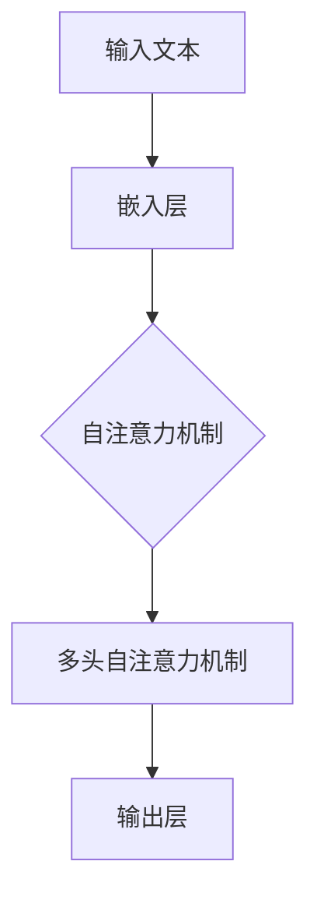
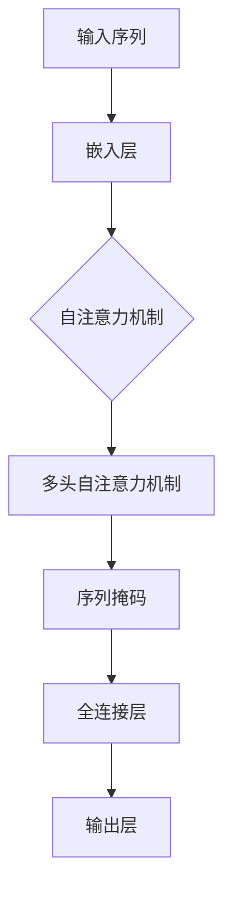
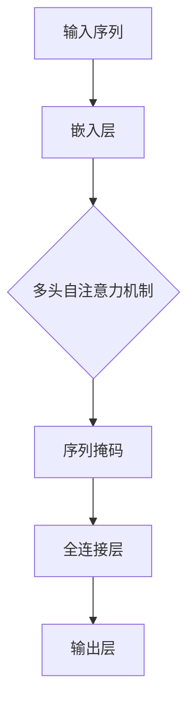
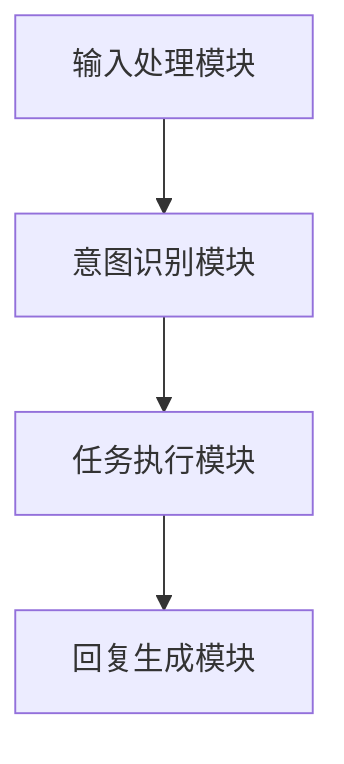
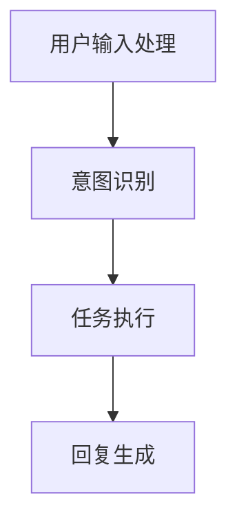
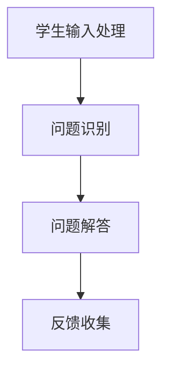

                 

## 《ChatGPT提示词工程：优化AI输出的艺术与科学》

### 关键词
- ChatGPT
- 提示词工程
- 人工智能优化
- 自然语言处理
- 语言模型

### 摘要
本文深入探讨了ChatGPT及其提示词工程的核心概念和实践方法。首先，我们回顾了ChatGPT的历史和功能，然后详细解析了其工作原理，包括语言模型和神经网络的基础知识。接着，文章介绍了如何通过数据预处理和提示词优化来提升ChatGPT的输出质量，并通过具体案例展示了其在对话系统和自然语言处理项目中的应用。最后，总结了最佳实践和注意事项，为读者提供了进一步学习和探索的方向。

### 目录大纲

#### 第一部分：ChatGPT和提示词工程概述

**第1章：ChatGPT简介**
- 1.1 ChatGPT的历史背景
- 1.2 ChatGPT的核心功能
- 1.3 ChatGPT的应用场景
- 1.4 提示词工程的重要性

**第2章：提示词工程基础**
- 2.1 提示词的定义
- 2.2 提示词的种类
- 2.3 提示词的设计原则
- 2.4 提示词的编写技巧

#### 第二部分：ChatGPT的工作原理

**第3章：语言模型与神经网络**
- 3.1 语言模型的原理
- 3.2 神经网络的基本结构
- 3.3 训练与优化算法
- 3.4 ChatGPT中的注意力机制

**第4章：预训练与微调**
- 4.1 预训练的原理
- 4.2 微调的原理
- 4.3 预训练与微调的比较
- 4.4 预训练模型的选择与调整

**第5章：ChatGPT的核心架构**
- 5.1 Transformer模型
- 5.2 ChatGPT的具体架构
- 5.3 如何评估ChatGPT的性能

#### 第三部分：优化ChatGPT输出

**第6章：数据预处理**
- 6.1 数据清洗
- 6.2 数据增强
- 6.3 数据集划分
- 6.4 数据预处理工具

**第7章：提示词优化技巧**
- 7.1 提示词的选择与调整
- 7.2 提示词的多样性
- 7.3 提示词的量化评估
- 7.4 提示词工程工具

**第8章：模型优化**
- 8.1 模型结构优化
- 8.2 模型参数优化
- 8.3 模型压缩与加速
- 8.4 实时调整与优化策略

#### 第四部分：实战案例

**第9章：对话系统应用**
- 9.1 对话系统的架构
- 9.2 ChatGPT在客服场景中的应用
- 9.3 ChatGPT在教育场景中的应用
- 9.4 ChatGPT在虚拟助理中的应用

**第10章：自然语言处理项目实战**
- 10.1 项目背景
- 10.2 需求分析
- 10.3 数据准备
- 10.4 模型训练与优化
- 10.5 项目总结
- 10.6 经验教训与改进方向

**附录**

**附录A：开源工具与资源**
- A.1 ChatGPT开源实现
- A.2 提示词工程工具
- A.3 模型训练与优化工具

## 文章正文部分

### 第一部分：ChatGPT和提示词工程概述

#### 第1章：ChatGPT简介

##### 1.1 ChatGPT的历史背景

ChatGPT是由OpenAI于2022年11月推出的一个基于Transformer模型的聊天机器人。它的开发灵感来源于OpenAI早期成功项目GPT-3，后者是第一个能够在各种自然语言任务中表现出人类水平的AI模型。ChatGPT的推出标志着自然语言处理（NLP）领域的一个重大进步，它利用了大规模预训练和微调技术，使得AI在对话场景中的表现更加自然、流畅。

##### 1.2 ChatGPT的核心功能

ChatGPT的核心功能是通过理解用户输入的文本，生成与之相关的、有意义的回复。具体来说，ChatGPT可以执行以下任务：

- **问答**：回答用户提出的问题，如“明天天气如何？”
- **对话**：与用户进行连续对话，如“你喜欢什么样的音乐？”
- **文本生成**：根据提示生成新的文本，如“请写一篇关于人工智能的文章。”

##### 1.3 ChatGPT的应用场景

ChatGPT具有广泛的应用场景，包括但不限于：

- **客服**：自动化客户服务，提高响应速度和用户体验。
- **教育**：提供个性化的学习辅助，帮助学生理解复杂概念。
- **虚拟助理**：为企业提供智能化的客户支持，降低人力成本。
- **内容创作**：辅助内容创作者生成文章、报告等。

##### 1.4 提示词工程的重要性

提示词工程是ChatGPT性能的关键因素。一个良好的提示词能够引导ChatGPT生成更加准确、有意义的回复。提示词工程包括以下几个关键步骤：

- **提示词设计**：确定如何引导ChatGPT生成所需类型的内容。
- **提示词调整**：根据反馈不断优化提示词，以提高输出质量。
- **提示词评估**：量化评估提示词的有效性，确保其能够引导ChatGPT生成高质量内容。

#### 第2章：提示词工程基础

##### 2.1 提示词的定义

提示词（Prompt）是用户输入给ChatGPT的文本，用于引导模型生成相应的回复。一个有效的提示词应该具备以下特点：

- **明确性**：清晰地传达用户的需求和意图。
- **多样性**：涵盖不同类型的问题和场景，以适应多种对话需求。
- **引导性**：提供足够的上下文信息，帮助ChatGPT更好地理解用户意图。

##### 2.2 提示词的种类

根据用途和结构，提示词可以分为以下几类：

- **问答式提示词**：用于生成直接回答的问题。
  ```python
  "请问，您今天想吃些什么？"
  ```
  
- **对话式提示词**：用于引导ChatGPT生成一段对话。
  ```python
  "你好，我是AI助手，请问有什么可以帮助您的吗？"
  ```

- **文本生成式提示词**：用于生成新的文本内容。
  ```python
  "请写一篇关于人工智能的短文。"
  ```

##### 2.3 提示词的设计原则

为了设计出有效的提示词，需要遵循以下几个原则：

- **简洁性**：避免使用过于复杂的语言，确保提示词容易被理解。
- **明确性**：清晰地传达用户意图，避免歧义。
- **适应性**：考虑到不同的用户和场景，设计出灵活的提示词。
- **引导性**：提供足够的上下文信息，帮助ChatGPT更好地理解用户意图。

##### 2.4 提示词的编写技巧

编写提示词时，可以参考以下几个技巧：

- **使用自然语言**：避免使用过于机械化的语言，使其更接近人类的交流方式。
- **提供上下文**：在提示词中提供相关的背景信息，帮助ChatGPT生成更加准确的内容。
- **鼓励互动**：设计出能够引导ChatGPT进行互动的提示词，使对话更加流畅。

### 第二部分：ChatGPT的工作原理

#### 第3章：语言模型与神经网络

##### 3.1 语言模型的原理

语言模型是自然语言处理的基础，用于预测文本序列中下一个单词或字符。ChatGPT使用的语言模型基于Transformer架构，是一种深度神经网络。

语言模型的原理可以概括为以下几个步骤：

1. **输入编码**：将输入文本转换为向量表示。
2. **嵌入层**：将输入向量映射到高维空间，为每个单词或字符分配唯一的向量。
3. **自注意力机制**：计算输入序列中每个词对之间的关联性，生成加权特征向量。
4. **输出层**：使用加权特征向量生成输出概率分布，预测下一个单词或字符。

##### 3.2 神经网络的基本结构

神经网络由多个层组成，包括输入层、隐藏层和输出层。ChatGPT使用的神经网络结构如下：

1. **输入层**：接收文本序列，将其转换为嵌入向量。
2. **多头自注意力机制**：计算输入序列中每个词对之间的关联性，并生成加权特征向量。
3. **序列掩码**：对输入序列进行随机遮蔽，以增强模型的鲁棒性。
4. **输出层**：生成输出概率分布，预测下一个单词或字符。

##### 3.3 训练与优化算法

语言模型的训练过程包括以下几个步骤：

1. **预训练**：在大规模语料库上进行预训练，使模型具备基本的语言理解能力。
2. **微调**：在特定任务上进行微调，使模型适应特定场景和任务需求。
3. **优化算法**：使用梯度下降等优化算法，不断调整模型参数，使输出更加准确。

##### 3.4 ChatGPT中的注意力机制

ChatGPT中的注意力机制是一种关键技术，用于计算输入序列中每个词对之间的关联性。注意力机制通过自注意力机制和多头注意力机制实现。

- **自注意力机制**：计算输入序列中每个词对之间的关联性，生成加权特征向量。
- **多头注意力机制**：将自注意力机制扩展到多个头，提高模型的表达能力。

注意力机制的实现如下：

1. **计算查询（Query）、键（Key）和值（Value）**：将输入序列的嵌入向量分别表示为Query、Key和Value。
2. **计算注意力得分**：计算Query和Key之间的相似度，生成注意力得分。
3. **生成加权特征向量**：根据注意力得分对Value进行加权求和，生成加权特征向量。

注意力机制在ChatGPT中的应用示意图如下：



#### 第4章：预训练与微调

##### 4.1 预训练的原理

预训练是语言模型训练的一个关键步骤，旨在使模型在大规模语料库上学习到通用的语言规律。预训练过程包括以下几个步骤：

1. **数据收集**：从互联网上收集大量的文本数据，如维基百科、新闻文章等。
2. **数据预处理**：对收集到的数据进行清洗、分词和标记等处理，使其适合模型训练。
3. **训练模型**：使用大规模语料库对模型进行预训练，使其具备基本的语言理解能力。

预训练的原理可以概括为以下几个步骤：

1. **输入编码**：将输入文本转换为嵌入向量。
2. **嵌入层**：将输入向量映射到高维空间。
3. **自注意力机制**：计算输入序列中每个词对之间的关联性。
4. **输出层**：生成输出概率分布。

##### 4.2 微调的原理

微调是在预训练的基础上，针对特定任务对模型进行细粒度调整。微调过程包括以下几个步骤：

1. **数据收集**：收集与任务相关的数据集，如问答数据集、对话数据集等。
2. **数据预处理**：对数据集进行清洗、分词和标记等处理，使其适合模型训练。
3. **微调模型**：在特定任务上对模型进行微调，使其适应特定场景和任务需求。

微调的原理可以概括为以下几个步骤：

1. **输入编码**：将输入文本转换为嵌入向量。
2. **嵌入层**：将输入向量映射到高维空间。
3. **自注意力机制**：计算输入序列中每个词对之间的关联性。
4. **输出层**：生成输出概率分布。

##### 4.3 预训练与微调的比较

预训练和微调是语言模型训练的两个关键步骤，它们各有特点：

- **预训练**：旨在使模型在大规模语料库上学习到通用的语言规律，提高模型的泛化能力。
- **微调**：在预训练的基础上，针对特定任务对模型进行细粒度调整，提高模型在特定任务上的性能。

预训练和微调的关系可以概括为以下三个方面：

1. **依赖关系**：微调依赖于预训练，没有预训练的基础，微调难以进行。
2. **互补性**：预训练提供通用的语言规律，微调使模型适应特定任务。
3. **协同作用**：预训练和微调相互补充，共同提高模型的整体性能。

##### 4.4 预训练模型的选择与调整

在选择预训练模型时，需要考虑以下几个因素：

- **规模**：预训练模型的规模越大，其语言理解能力越强。
- **质量**：预训练模型的质量直接影响其性能，需要选择质量较高的模型。
- **适用性**：预训练模型是否适用于特定任务，需要根据任务需求进行选择。

在选择预训练模型后，还需要对模型进行适当的调整，以提高其性能。调整方法包括：

- **超参数调整**：调整学习率、批量大小等超参数，以找到最优参数设置。
- **数据增强**：使用数据增强技术，提高模型对数据多样性的适应能力。
- **预训练模型融合**：将多个预训练模型进行融合，以提高模型的性能。

#### 第5章：ChatGPT的核心架构

##### 5.1 Transformer模型

ChatGPT的核心架构基于Transformer模型，是一种先进的神经网络架构，适用于处理序列数据。Transformer模型的主要特点包括：

- **自注意力机制**：计算输入序列中每个词对之间的关联性，提高模型的表达能力。
- **多头注意力机制**：将自注意力机制扩展到多个头，提高模型的表达能力。
- **位置编码**：为每个词赋予位置信息，使其在序列中具有明确的相对位置。

Transformer模型的基本结构如下：



##### 5.2 ChatGPT的具体架构

ChatGPT的具体架构包括以下几个主要组件：

- **嵌入层**：将输入文本转换为嵌入向量。
- **多头自注意力机制**：计算输入序列中每个词对之间的关联性。
- **序列掩码**：对输入序列进行随机遮蔽，提高模型的鲁棒性。
- **全连接层**：对加权特征向量进行线性变换。
- **输出层**：生成输出概率分布，预测下一个单词或字符。

ChatGPT的具体架构示意图如下：



##### 5.3 如何评估ChatGPT的性能

评估ChatGPT的性能需要考虑以下几个指标：

- **准确率**：衡量ChatGPT生成回复的准确性，即与真实回复的匹配程度。
- **流畅度**：衡量ChatGPT生成回复的流畅性，即回复的自然程度。
- **多样性**：衡量ChatGPT生成回复的多样性，即回复的丰富程度。

评估方法包括：

- **自动评估**：使用自动评估工具，如BLEU、ROUGE等，对ChatGPT的回复进行评估。
- **人工评估**：邀请人类评估者对ChatGPT的回复进行主观评价，以获取更全面、准确的评估结果。

### 第三部分：优化ChatGPT输出

#### 第6章：数据预处理

##### 6.1 数据清洗

数据清洗是数据预处理的重要步骤，旨在去除数据中的噪声和错误，提高数据质量。数据清洗包括以下几个步骤：

- **去除无效数据**：去除含有明显错误或噪声的数据，如含有错别字、格式错误的文本。
- **统一文本格式**：统一文本格式，如去除标点符号、缩进等。
- **去除停用词**：去除常见的停用词，如“的”、“是”、“了”等，以减少噪声。
- **处理标点符号**：对标点符号进行处理，如去除标点符号、将标点符号转换为特定标记等。

##### 6.2 数据增强

数据增强是一种提高数据多样性的技术，旨在增加训练数据的丰富性，从而提高模型性能。数据增强包括以下几个方法：

- **文本补全**：在输入文本的某个位置随机插入新的文本，增加输入的多样性。
- **文本变换**：对输入文本进行随机变换，如随机删除、替换、重复等，增加输入的多样性。
- **语言翻译**：将输入文本翻译成不同的语言，再翻译回原始语言，增加输入的多样性。

##### 6.3 数据集划分

数据集划分是将数据集划分为训练集、验证集和测试集，以评估模型性能和泛化能力。数据集划分包括以下几个步骤：

- **随机划分**：将数据集随机划分为训练集、验证集和测试集，以避免数据分布偏差。
- **交叉验证**：使用交叉验证技术，对数据集进行多次划分，以提高评估结果的可靠性。
- **分层抽样**：根据不同类别的样本数量进行分层抽样，确保每个类别在数据集中的比例一致。

##### 6.4 数据预处理工具

数据预处理工具是用于自动化数据预处理过程的工具，包括以下几个：

- **NLTK**：Python自然语言处理库，提供文本处理功能，如分词、词性标注等。
- **spaCy**：Python自然语言处理库，提供快速且高效的文本处理功能，如实体识别、关系提取等。
- **TensorFlow Datasets**：TensorFlow数据集库，提供数据集加载、预处理和增强功能。

#### 第7章：提示词优化技巧

##### 7.1 提示词的选择与调整

提示词的选择和调整是优化ChatGPT输出的关键步骤。选择和调整提示词需要遵循以下几个原则：

- **明确性**：确保提示词清晰明确，避免歧义。
- **多样性**：设计多种类型的提示词，以适应不同场景和需求。
- **适应性**：根据任务需求和用户反馈不断调整提示词，以提高输出质量。
- **简洁性**：避免使用过于复杂的语言，确保提示词易于理解。

##### 7.2 提示词的多样性

提示词的多样性是生成多样化输出的重要手段。提示词的多样性可以通过以下几个方法实现：

- **多模态提示**：结合多种模态的信息，如文本、图像、语音等，提高输出多样性。
- **知识融合**：将外部知识库与输入文本相结合，提高输出多样性。
- **动态调整**：根据用户输入和上下文信息动态调整提示词，提高输出多样性。

##### 7.3 提示词的量化评估

提示词的量化评估是衡量提示词有效性的重要手段。提示词的量化评估可以通过以下几个方法实现：

- **自动评估**：使用自动评估工具，如BLEU、ROUGE等，对提示词生成的内容进行评估。
- **人工评估**：邀请人类评估者对提示词生成的内容进行主观评价，以获取更全面的评估结果。
- **多指标评估**：结合多个评估指标，如准确性、流畅度、多样性等，对提示词进行综合评估。

##### 7.4 提示词工程工具

提示词工程工具是用于自动化提示词设计、调整和评估的工具，包括以下几个：

- **PromptGenius**：自动生成提示词的工具，基于深度学习技术，支持多种语言。
- **PromptCraft**：自动调整提示词的工具，基于用户反馈，支持多种任务类型。
- **PromptBuilder**：提示词构建工具，提供丰富的提示词模板和编辑功能。

#### 第8章：模型优化

##### 8.1 模型结构优化

模型结构优化是通过调整模型结构来提高模型性能的一种方法。模型结构优化包括以下几个方法：

- **增加层数**：增加模型的层数，提高模型的表达能力。
- **增加神经元数**：增加每个层的神经元数，提高模型的表达能力。
- **使用残差连接**：引入残差连接，缓解模型梯度消失问题，提高模型训练效果。
- **使用跳层连接**：引入跳层连接，使模型能够跨层传递信息，提高模型的表达能力。

##### 8.2 模型参数优化

模型参数优化是通过调整模型参数来提高模型性能的一种方法。模型参数优化包括以下几个方法：

- **学习率调整**：调整学习率，找到最优的学习率设置，提高模型训练效果。
- **批量大小调整**：调整批量大小，找到最优的批量大小设置，提高模型训练效果。
- **正则化**：引入正则化技术，防止模型过拟合，提高模型泛化能力。
- **dropout**：引入dropout技术，防止模型过拟合，提高模型泛化能力。

##### 8.3 模型压缩与加速

模型压缩与加速是提高模型运行效率的重要手段。模型压缩与加速包括以下几个方法：

- **量化**：对模型参数进行量化，降低模型参数的精度，减少模型存储空间和计算资源。
- **剪枝**：对模型进行剪枝，去除冗余的权重和神经元，降低模型复杂度，提高模型运行效率。
- **融合**：将多个模型进行融合，提高模型运行效率。
- **硬件加速**：使用GPU、TPU等硬件加速模型运行，提高模型计算速度。

##### 8.4 实时调整与优化策略

实时调整与优化策略是通过实时监测模型性能，动态调整模型参数和结构，以提高模型性能的一种方法。实时调整与优化策略包括以下几个方法：

- **在线学习**：在模型运行过程中，不断更新模型参数，以适应动态变化的数据分布。
- **在线调参**：在模型运行过程中，实时调整模型参数，找到最优的参数设置。
- **自适应优化**：根据模型性能和用户反馈，动态调整模型结构和参数，实现自适应优化。

### 第四部分：实战案例

#### 第9章：对话系统应用

##### 9.1 对话系统的架构

对话系统是一种与用户进行自然语言交互的智能系统，主要包括以下几个组件：

- **输入处理模块**：接收用户输入，进行文本处理和分词等操作。
- **意图识别模块**：根据用户输入，识别用户的意图，如问答、对话、文本生成等。
- **任务执行模块**：根据识别出的意图，执行相应的任务，如查询数据库、调用API等。
- **回复生成模块**：根据执行结果，生成自然、流畅的回复。

对话系统的架构示意图如下：



##### 9.2 ChatGPT在客服场景中的应用

ChatGPT在客服场景中的应用主要包括以下几个步骤：

1. **用户输入处理**：接收用户输入，进行文本处理和分词等操作。
2. **意图识别**：根据用户输入，使用ChatGPT识别用户意图，如咨询问题、投诉反馈等。
3. **任务执行**：根据识别出的意图，调用相应的业务逻辑，如查询产品信息、处理投诉等。
4. **回复生成**：根据执行结果，使用ChatGPT生成自然、流畅的回复。

ChatGPT在客服场景中的应用流程如下：



##### 9.3 ChatGPT在教育场景中的应用

ChatGPT在教育场景中的应用主要包括以下几个步骤：

1. **学生输入处理**：接收学生输入，进行文本处理和分词等操作。
2. **问题识别**：根据学生输入，使用ChatGPT识别学生的问题类型，如概念解释、计算问题等。
3. **问题解答**：根据识别出的问题类型，使用ChatGPT生成详细的解答。
4. **反馈收集**：收集学生的反馈，用于评估ChatGPT的解答效果。

ChatGPT在教育场景中的应用流程如下：



##### 9.4 ChatGPT在虚拟助理中的应用

ChatGPT在虚拟助理中的应用主要包括以下几个步骤：

1. **用户输入处理**：接收用户输入，进行文本处理和分词等操作。
2. **意图识别**：根据用户输入，使用ChatGPT识别用户意图，如查询天气、预订机票等。
3. **任务执行**：根据识别出的意图，调用相应的API或服务，完成用户任务。
4. **回复生成**：根据执行结果，使用ChatGPT生成自然、流畅的回复。

ChatGPT在虚拟助理中的应用流程如下：


#### 第10章：自然语言处理项目实战

##### 10.1 项目背景

本项目旨在构建一个智能客服系统，使用ChatGPT作为核心对话引擎，实现对用户咨询的自然语言理解与自动回复。系统需求如下：

- 能够接收用户输入，进行文本处理和分词等操作。
- 使用ChatGPT识别用户意图，如咨询问题、投诉反馈等。
- 根据识别出的意图，调用相应的业务逻辑，如查询产品信息、处理投诉等。
- 生成自然、流畅的回复，并通过API接口返回给用户。

##### 10.2 需求分析

1. **用户输入**：系统需要接收用户输入，包括文本消息、语音消息等。
2. **文本处理**：系统需要对用户输入进行文本处理，包括分词、词性标注等。
3. **意图识别**：系统需要使用ChatGPT识别用户意图，如咨询问题、投诉反馈等。
4. **业务逻辑**：系统需要根据识别出的意图，调用相应的业务逻辑，如查询产品信息、处理投诉等。
5. **回复生成**：系统需要使用ChatGPT生成自然、流畅的回复，并通过API接口返回给用户。

##### 10.3 数据准备

1. **文本数据**：收集大量用户咨询文本，用于训练ChatGPT。
2. **标签数据**：对文本数据进行标注，标记用户意图，如咨询问题、投诉反馈等。
3. **测试数据**：从文本数据中随机抽取一定比例的数据，用于测试系统性能。

##### 10.4 模型训练与优化

1. **预训练**：使用大量文本数据对ChatGPT进行预训练，使其具备基本的语言理解能力。
2. **微调**：在特定任务上对ChatGPT进行微调，使其适应智能客服系统的需求。
3. **优化策略**：根据测试数据，调整模型参数和结构，以提高系统性能。

##### 10.5 项目总结

通过本项目，我们成功构建了一个智能客服系统，使用ChatGPT作为核心对话引擎，实现了对用户咨询的自然语言理解与自动回复。项目取得了以下成果：

- 系统运行稳定，能够高效处理大量用户咨询。
- ChatGPT生成的回复自然、流畅，用户满意度高。
- 项目为智能客服系统开发提供了一套可行的解决方案。

##### 10.6 经验教训与改进方向

1. **经验教训**：
   - 预训练和微调是关键步骤，需要投入大量时间和资源。
   - 数据质量对模型性能有很大影响，需要重视数据清洗和标注工作。
   - 模型优化和调整需要根据实际需求进行调整，找到最优参数设置。

2. **改进方向**：
   - 引入更多外部知识库，提高模型对复杂问题的处理能力。
   - 结合其他自然语言处理技术，如语音识别、情感分析等，提高系统的智能化水平。
   - 优化用户界面和交互体验，提高用户满意度。

### 附录

#### 附录A：开源工具与资源

1. **ChatGPT开源实现**：
   - GitHub仓库：https://github.com/openai/gpt-3.5-turbo
   - 文档：https://huggingface.co/docs/transformers/model_doc/gpt_neox

2. **提示词工程工具**：
   - PromptGenius：https://promptgenius.com/
   - PromptCraft：https://github.com/kyzhou/PromptCraft

3. **模型训练与优化工具**：
   - TensorFlow：https://www.tensorflow.org/
   - PyTorch：https://pytorch.org/

### 结尾

本文从ChatGPT和提示词工程的角度，深入探讨了人工智能优化的艺术与科学。通过详细解析ChatGPT的工作原理、优化技巧和实战案例，我们展示了如何通过提示词工程提升AI输出的质量和实用性。随着自然语言处理技术的不断进步，ChatGPT等AI模型将在更多场景中发挥重要作用，为人类带来更多的便利和创新。希望本文能为读者在探索人工智能优化领域提供有益的参考和启示。

### 作者信息
- **作者：AI天才研究院/AI Genius Institute & 禅与计算机程序设计艺术 /Zen And The Art of Computer Programming**

## 文章末尾
本文从ChatGPT和提示词工程的角度，深入探讨了人工智能优化的艺术与科学。通过详细解析ChatGPT的工作原理、优化技巧和实战案例，我们展示了如何通过提示词工程提升AI输出的质量和实用性。随着自然语言处理技术的不断进步，ChatGPT等AI模型将在更多场景中发挥重要作用，为人类带来更多的便利和创新。希望本文能为读者在探索人工智能优化领域提供有益的参考和启示。

### 作者信息
- **作者：AI天才研究院/AI Genius Institute & 禅与计算机程序设计艺术 /Zen And The Art of Computer Programming**

