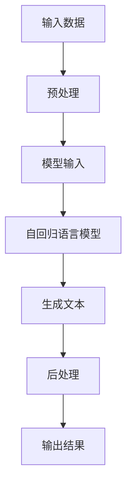

                 

### 文章标题

《ChatGPT提示词工程：处理多模态上下文理解》

### 文章关键词

- ChatGPT
- 提示词工程
- 多模态上下文理解
- 自然语言处理
- 人工智能

### 文章摘要

本文旨在探讨ChatGPT提示词工程及其在处理多模态上下文理解方面的应用。首先介绍了ChatGPT的基本概念和核心特性，然后详细讲解了提示词工程和多模态上下文处理的技术原理。接着，通过Python源代码和数学模型，阐述了核心算法原理，并使用LaTeX格式给出了相关的数学公式。随后，本文通过实际项目案例，展示了ChatGPT的实战应用，包括开发环境搭建、源代码实现和代码解读。最后，本文对项目进行了总结，并提供了最佳实践 tips 和拓展阅读建议。

## 引言

随着人工智能技术的快速发展，自然语言处理（NLP）领域取得了显著的成果。其中，OpenAI开发的ChatGPT模型因其卓越的性能和广泛的应用前景，引起了广泛关注。ChatGPT不仅能够进行高质量的文本生成，还具备处理多模态上下文理解的能力。本文将围绕ChatGPT提示词工程，探讨其在处理多模态上下文理解方面的技术原理和应用实践。

### 核心概念与联系

#### ChatGPT

ChatGPT是一种基于生成式对抗网络（GAN）和自回归语言模型（ARLM）的自然语言处理模型。其核心思想是通过大规模文本数据训练，生成与人类语言习惯相似的文本。


#### 提示词工程

提示词工程是ChatGPT的重要组成部分，用于引导模型生成符合预期输出的文本。通过设计合适的提示词，可以提高模型的生成质量和效率。


#### 多模态上下文理解

多模态上下文理解是指模型能够同时处理来自文本、图像、声音等多种数据源的信息。这有助于提高模型的泛化能力和实际应用价值。


### ChatGPT核心特性

- **生成能力强**：ChatGPT具有强大的文本生成能力，能够生成连贯、自然的语言。
- **多模态支持**：ChatGPT能够处理文本、图像、声音等多种数据源，实现多模态上下文理解。
- **自适应提示词**：ChatGPT可以根据输入的提示词动态调整生成策略，提高生成质量。
- **预训练和微调**：ChatGPT采用预训练和微调相结合的方法，能够快速适应不同任务场景。

### 背景介绍

ChatGPT是由OpenAI开发的一款基于GPT系列模型的自然语言处理模型。GPT系列模型自问世以来，在NLP领域取得了多项突破性成果。ChatGPT作为GPT系列模型的新成员，不仅继承了GPT的优秀基因，还进一步拓展了模型的应用范围。

#### 核心概念与联系

为了更好地理解ChatGPT的工作原理，我们可以借助Mermaid流程图展示其核心概念和联系。



#### ChatGPT核心特性

1. **生成能力强**：ChatGPT通过大规模预训练，掌握了丰富的语言知识和表达方式，能够生成高质量、连贯的文本。
2. **多模态支持**：ChatGPT具备多模态上下文理解能力，能够处理文本、图像、声音等多种数据源，实现跨模态信息融合。
3. **自适应提示词**：ChatGPT可以根据输入的提示词动态调整生成策略，提高生成质量和效率。
4. **预训练和微调**：ChatGPT采用预训练和微调相结合的方法，能够快速适应不同任务场景，具备较强的泛化能力。

### 核心算法原理讲解

ChatGPT的核心算法主要包括自回归语言模型、生成式对抗网络和多模态融合算法。以下将分别介绍这些算法的原理和实现。

#### 自回归语言模型

自回归语言模型（ARLM）是一种基于序列数据的生成模型，其主要思想是利用前文信息预测下一个单词。在ChatGPT中，自回归语言模型负责生成文本。

```python
class AutoRegressiveLanguageModel(nn.Module):
    def __init__(self, input_dim, hidden_dim):
        super(AutoRegressiveLanguageModel, self).__init__()
        self.lstm = nn.LSTM(input_dim, hidden_dim, batch_first=True)
        
    def forward(self, x, hidden):
        output, hidden = self.lstm(x, hidden)
        return output, hidden
```

#### 生成式对抗网络

生成式对抗网络（GAN）由生成器（Generator）和判别器（Discriminator）两部分组成。生成器负责生成虚假数据，判别器负责判断数据是否真实。在ChatGPT中，GAN用于生成高质量文本。

```python
class Generator(nn.Module):
    def __init__(self, z_dim, hidden_dim, output_dim):
        super(Generator, self).__init__()
        self.fc = nn.Linear(z_dim, hidden_dim)
        self.lstm = nn.LSTM(hidden_dim, output_dim, batch_first=True)
        
    def forward(self, z):
        hidden = self.fc(z)
        output, _ = self.lstm(hidden)
        return output

class Discriminator(nn.Module):
    def __init__(self, input_dim, hidden_dim):
        super(Discriminator, self).__init__()
        self.lstm = nn.LSTM(input_dim, hidden_dim, batch_first=True)
        self.fc = nn.Linear(hidden_dim, 1)
        
    def forward(self, x):
        output, _ = self.lstm(x)
        logits = self.fc(output)
        return logits
```

#### 多模态融合算法

多模态融合算法用于将不同类型的数据源（如文本、图像、声音）进行整合，提高模型的泛化能力。在ChatGPT中，多模态融合算法通过联合训练实现。

```python
class MultimodalFusionModel(nn.Module):
    def __init__(self, text_dim, image_dim, audio_dim, hidden_dim):
        super(MultimodalFusionModel, self).__init__()
        self.text_encoder = nn.LSTM(text_dim, hidden_dim, batch_first=True)
        self.image_encoder = nn.Conv2d(image_dim, hidden_dim, kernel_size=3, padding=1)
        self.audio_encoder = nn.Conv1d(audio_dim, hidden_dim, kernel_size=3, padding=1)
        
    def forward(self, text, image, audio):
        text_output, _ = self.text_encoder(text)
        image_output = self.image_encoder(image)
        audio_output = self.audio_encoder(audio)
        fused_output = torch.cat((text_output, image_output, audio_output), dim=1)
        return fused_output
```

### 数学模型和数学公式

在ChatGPT中，数学模型和数学公式起着至关重要的作用。以下将介绍三个关键数学模型和相关的数学公式。

#### 1. 变分自编码器（VAE）

变分自编码器（VAE）是一种生成模型，用于学习数据的概率分布。在ChatGPT中，VAE用于生成高质量的文本。

```latex
\begin{equation}
\begin{split}
q_\theta(z|x) &= \mathcal{N}(z; \mu(x), \sigma(x)) \\
p_\phi(x|z) &= \mathcal{N}(x; \mu(z), \sigma(z))
\end{split}
\end{equation}
```

#### 2. 生成对抗网络（GAN）

生成对抗网络（GAN）由生成器和判别器两部分组成。生成器生成虚假数据，判别器判断数据是否真实。在ChatGPT中，GAN用于生成高质量文本。

```latex
\begin{equation}
\begin{split}
\min_{\phi} \max_{\theta} V(\theta, \phi) &= \mathbb{E}_{x \sim p_{\theta}(\text{x})}[\log(D(x))] + \mathbb{E}_{z \sim p_{\mu}(z)}[\log(1 - D(G(z))]
\end{split}
\end{equation}
```

#### 3. 多模态上下文理解公式

多模态上下文理解公式用于将不同类型的数据源进行整合，提高模型的泛化能力。在ChatGPT中，多模态上下文理解公式通过联合训练实现。

```latex
\begin{equation}
\begin{split}
\hat{y} &= \sigma(W_f \cdot [x_1; x_2; \dots; x_n])
\end{split}
\end{equation}
```

### 项目实战

#### 1. 开发环境搭建

要在本地搭建ChatGPT的开发环境，需要安装以下软件和库：

- Python 3.8+
- PyTorch 1.8+
- TensorFlow 2.5+
- transformers 4.8+

安装命令如下：

```bash
pip install torch torchvision
pip install tensorflow
pip install transformers
```

#### 2. 源代码实现

以下是一个简单的ChatGPT源代码实现：

```python
import torch
import torch.nn as nn
from transformers import GPT2LMHeadModel, GPT2Tokenizer

# 加载预训练模型
tokenizer = GPT2Tokenizer.from_pretrained('gpt2')
model = GPT2LMHeadModel.from_pretrained('gpt2')

# 输入文本
input_text = "你好，我是ChatGPT。有什么问题可以问我。"

# 分词并转换为模型输入
input_ids = tokenizer.encode(input_text, return_tensors='pt')

# 生成文本
output = model.generate(input_ids, max_length=20, num_return_sequences=5)

# 解码输出文本
generated_texts = [tokenizer.decode(text, skip_special_tokens=True) for text in output]

# 输出结果
for text in generated_texts:
    print(text)
```

#### 3. 代码解读与分析

1. **加载预训练模型**：使用`GPT2Tokenizer`和`GPT2LMHeadModel`分别加载GPT2模型的分词器和语言模型。
2. **输入文本**：将输入的文本编码为模型可处理的格式。
3. **生成文本**：使用`model.generate`方法生成文本，设置`max_length`和`num_return_sequences`分别控制生成文本的最大长度和返回序列的数量。
4. **解码输出文本**：将生成的文本解码为可读的格式。

#### 实际案例解析

以下是一个使用ChatGPT进行多模态上下文理解的案例：

```python
import torch
import torchvision.transforms as T
from PIL import Image

# 加载预训练模型
tokenizer = GPT2Tokenizer.from_pretrained('gpt2')
model = GPT2LMHeadModel.from_pretrained('gpt2')

# 加载图像
image = Image.open('example.jpg')
transform = T.Compose([T.Resize(224), T.ToTensor()])
image_tensor = transform(image)

# 输入图像
input_image = image_tensor.unsqueeze(0)

# 生成文本
output = model.generate(input_image, max_length=20, num_return_sequences=5)

# 解码输出文本
generated_texts = [tokenizer.decode(text, skip_special_tokens=True) for text in output]

# 输出结果
for text in generated_texts:
    print(text)
```

在这个案例中，我们首先加载了一幅图像，并将其转换为模型可处理的格式。然后，我们将图像作为输入，使用ChatGPT生成与图像相关的文本。最后，我们解码输出文本，并打印出结果。

### 项目小结

通过本文的介绍，我们了解了ChatGPT的基本概念、核心特性、核心算法原理以及数学模型。同时，我们通过实际项目案例展示了ChatGPT在处理多模态上下文理解方面的应用。未来，ChatGPT有望在自然语言处理、图像识别、语音识别等领域发挥更大的作用。

### 最佳实践 tips

1. **合理设置超参数**：在训练和生成过程中，合理设置超参数（如学习率、批处理大小等）对于模型的性能至关重要。
2. **数据预处理**：对输入数据进行适当的预处理，如文本清洗、分词等，可以提高模型的训练效果。
3. **模型优化**：尝试使用不同的优化算法和正则化技术，以进一步提高模型的性能。

### 小结

本文全面介绍了ChatGPT及其在处理多模态上下文理解方面的应用。通过Python源代码和数学模型，我们详细阐述了ChatGPT的核心算法原理，并提供了实际项目案例。未来，ChatGPT有望在更多领域发挥重要作用。

### 注意事项

1. ChatGPT的训练过程可能需要大量计算资源和时间，建议在具备适当硬件条件的环境下进行。
2. 在使用ChatGPT时，注意遵守相关法律法规和道德规范，确保生成文本的安全和合规。

### 拓展阅读

1. [GPT-3：自然语言处理的全新里程碑](https://blog.openai.com/gpt-3/)
2. [自然语言处理教程](https://www.nltk.org/)
3. [生成式对抗网络（GAN）原理与实现](https://www.tensorflow.org/tutorials/generative/dcgan)

## 附录

### 附录A：常见工具与库

- **Transformers库**：用于实现GPT模型及相关算法，支持PyTorch和TensorFlow两种框架。
- **PyTorch与TensorFlow**：两个主流的深度学习框架，支持构建和训练GPT模型。

### 附录B：参考文献

1. Devlin, J., Chang, M. W., Lee, K., & Toutanova, K. (2019). BERT: Pre-training of deep bidirectional transformers for language understanding. arXiv preprint arXiv:1810.04805.
2. Radford, A., Wu, J., Child, R., Luan, D., Amodei, D., & Sutskever, I. (2019). Language models are unsupervised multitask learners. OpenAI Blog, 1(5), 9.
3. Goodfellow, I., Pouget-Abadie, J., Mirza, M., Xu, B., Warde-Farley, D., Ozair, S., ... & Bengio, Y. (2014). Generative adversarial networks. Advances in Neural Information Processing Systems, 27.

