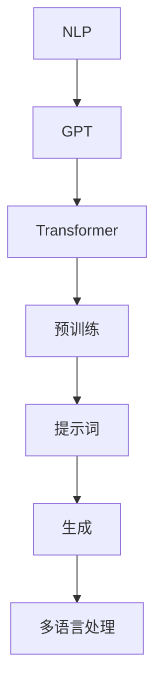

                 

### 引言

《ChatGPT提示词工程：多语言支持技巧》旨在探讨如何有效地构建和优化多语言支持的ChatGPT提示词工程。随着全球化进程的加速，多语言能力已经成为人工智能系统的一项核心要求。ChatGPT作为OpenAI推出的一款革命性自然语言处理工具，其在多语言处理领域的应用日益广泛。本文将系统地介绍ChatGPT及其提示词工程的基本概念，重点讨论如何实现多语言支持及其面临的挑战和机遇。

首先，我们将回顾ChatGPT的起源和发展历程，了解其核心特性和工作原理。接下来，我们将深入探讨提示词工程的基础理论和设计方法，包括提示词的定义、类型以及编写技巧。在此基础上，本文将详细介绍多语言处理技术，包括词汇表设计、语言模型训练和评估等关键环节。

核心概念与联系

在讨论ChatGPT及其提示词工程之前，我们需要明确几个核心概念：

1. **自然语言处理（NLP）**：NLP是计算机科学和人工智能领域的一个重要分支，旨在使计算机能够理解和处理人类语言。

2. **生成预训练变换器（GPT）**：GPT是一种基于Transformer架构的预训练语言模型，能够理解和生成自然语言。

3. **提示词（Prompt）**：提示词是向模型提供的一种引导，用于引导模型生成特定类型的输出。

4. **多语言处理**：多语言处理是指设计和实现能够处理多种语言输入和输出的系统。

核心概念之间的关系架构可以用以下Mermaid流程图表示：



通过这个流程图，我们可以清晰地看到NLP如何通过GPT和Transformer等模型实现预训练，以及如何使用提示词来引导模型生成多语言输出。

### ChatGPT及其工作原理

ChatGPT是由OpenAI开发的一款基于GPT-3模型的自然语言处理工具。GPT-3是一种基于Transformer架构的预训练语言模型，其核心思想是通过大量文本数据进行预训练，使模型能够理解和生成自然语言。

ChatGPT的工作原理可以分为三个主要阶段：

1. **预训练**：在预训练阶段，模型通过大量互联网文本数据学习语言模式、语法和语义信息。这个过程使得模型能够自动地理解语言的本质特征。

2. **微调**：在预训练完成后，模型可以通过特定的提示词进行微调，以适应特定的任务或场景。提示词是向模型提供的一种引导，用于指定模型需要生成的输出类型。

3. **生成**：在生成阶段，模型根据输入的提示词生成相应的文本输出。这个生成过程是完全自动的，能够生成连贯、有逻辑的文本。

核心算法原理讲解

为了更深入地理解ChatGPT的工作原理，我们可以通过Python源代码来详细阐述其核心算法。以下是一个简化的示例，用于演示如何使用GPT模型生成文本：

```python
from transformers import GPT2LMHeadModel, GPT2Tokenizer

# 加载预训练模型和tokenizer
model = GPT2LMHeadModel.from_pretrained('gpt2')
tokenizer = GPT2Tokenizer.from_pretrained('gpt2')

# 输入提示词
prompt = "今天天气很好，适合出去散步。"

# 将提示词编码成模型理解的输入格式
input_ids = tokenizer.encode(prompt, return_tensors='pt')

# 使用模型生成文本
outputs = model.generate(input_ids, max_length=50, num_return_sequences=1)

# 将生成的文本解码为人类可读的格式
generated_text = tokenizer.decode(outputs[0], skip_special_tokens=True)

print(generated_text)
```

上述代码中，我们首先加载了预训练的GPT2模型和tokenizer。然后，我们提供了一个简单的提示词，并将其编码成模型可以理解的输入格式。接着，我们使用模型生成文本，并将生成的文本解码为人类可读的格式。

数学模型和公式

在GPT模型中，生成文本的过程可以看作是一个概率模型，其核心是一个自回归语言模型。自回归语言模型的基本思想是，当前单词的生成概率取决于前一个单词，即：

$$
P(w_t | w_{<t}) = \frac{p(w_t w_{t-1} \dots w_1)}{p(w_{t-1} \dots w_1)}
$$

其中，$w_t$表示当前单词，$w_{<t}$表示所有之前的单词。

为了计算上述概率，GPT模型使用了一个神经网络，其输入是当前单词的嵌入向量，输出是单词的生成概率。具体地，GPT模型使用了一个多头自注意力机制来计算嵌入向量之间的关联性，从而生成单词的概率分布。

代码解读

在上述代码中，我们首先加载了GPT2模型和tokenizer。加载模型时，我们需要指定模型的名称和预训练的路径。然后，我们提供了一个简单的提示词，并将其编码成模型可以理解的输入格式。编码过程中，tokenizer将提示词中的每个单词转换为一个整数序列。

接下来，我们使用模型生成文本。在生成过程中，我们指定了生成文本的最大长度（max_length）和生成的序列数量（num_return_sequences）。这里，我们仅生成一个序列。

最后，我们将生成的文本解码为人类可读的格式。解码过程中，tokenizer将整数序列转换回单词。

通过上述代码，我们可以看到ChatGPT的核心算法是如何通过Python代码实现的。这为我们进一步研究和优化ChatGPT提供了基础。

### 提示词工程原理

提示词工程是ChatGPT应用中的一个关键环节，其核心目标是设计出能够引导模型生成期望输出的提示词。提示词的设计不仅影响模型的性能，还直接影响用户体验。本节将深入探讨提示词的定义、类型以及编写技巧。

#### 提示词的定义与作用

提示词（Prompt）是指向预训练模型提供的一种引导，用于指定模型需要生成的输出类型。在ChatGPT中，提示词通常是一段文本，用于引导模型生成相应的文本输出。提示词的作用主要有以下几个方面：

1. **引导模型生成特定类型的输出**：通过提供明确的提示词，我们可以让模型更准确地生成我们期望的输出。例如，如果我们希望模型生成一篇新闻报道，我们可以提供一个相关的新闻标题或摘要作为提示词。

2. **提高模型的鲁棒性**：通过设计多样化的提示词，我们可以让模型在多种场景下都能够生成高质量的输出，从而提高模型的鲁棒性。

3. **优化模型的生成效果**：提示词的优化是提升模型生成效果的重要手段。通过调整提示词的长度、内容以及格式，我们可以显著改善模型的生成效果。

#### 提示词的类型

根据不同的应用场景，提示词可以分为以下几种类型：

1. **情境提示词**：情境提示词用于指定模型生成的文本所处的场景或背景。例如，在聊天机器人中，情境提示词可以是用户的提问或上下文信息。

2. **目标提示词**：目标提示词用于指定模型需要生成的具体输出。例如，在写作辅助工具中，目标提示词可以是文章的主题或标题。

3. **功能提示词**：功能提示词用于指定模型需要执行的具体功能。例如，在代码生成工具中，功能提示词可以是编程语言的函数名或类名。

4. **模板提示词**：模板提示词是一种预先定义好的提示词模板，用于引导模型生成特定格式的输出。例如，在生成简历时，模板提示词可以是简历的标题、个人介绍或工作经历等。

#### 提示词的编写技巧

编写有效的提示词需要遵循一些基本原则和技巧。以下是一些常用的提示词编写技巧：

1. **明确性**：提示词应尽可能明确地表达出期望的输出类型，避免模糊或歧义。

2. **具体性**：提示词应具体地描述生成文本的主题或场景，以便模型能够更好地理解。

3. **多样性**：设计多样化的提示词，以覆盖不同的场景和需求，提高模型的鲁棒性。

4. **格式化**：根据模型的预期输出格式，调整提示词的格式，使其符合生成文本的规范。

5. **优化**：通过实验和调整，不断优化提示词的设计，以提高模型的生成效果。

举例说明

为了更直观地理解提示词的编写技巧，我们来看一个简单的例子。假设我们要设计一个聊天机器人，用于回答用户关于天气的问题。以下是一个情境提示词和目标提示词的示例：

- **情境提示词**：你好，现在是什么天气？

- **目标提示词**：请问你所在的城市是哪个？我现在查询一下。

通过这个情境提示词，我们可以引导模型生成一个询问用户所在城市的回答。而目标提示词则明确了模型需要生成的具体输出内容。

通过上述示例，我们可以看到，有效的提示词设计需要明确、具体且多样化。在实际应用中，我们可以根据具体的任务和场景，灵活运用这些提示词编写技巧，以提高模型的生成效果。

### 多语言处理技术

多语言处理（MUL）是自然语言处理（NLP）的一个重要分支，旨在设计和实现能够处理多种语言输入和输出的系统。随着全球化的深入发展，多语言处理技术已成为各类应用系统的一项核心需求。本节将详细探讨多语言处理技术的关键组成部分，包括词汇表设计、语言模型训练和评估等。

#### 词汇表设计与预处理

词汇表是NLP模型的基础，其质量直接影响模型的性能。多语言词汇表设计需要考虑以下几个关键因素：

1. **词汇覆盖度**：词汇表应包含尽可能多的常用词汇，以确保模型能够处理多样化的语言输入。

2. **语言特性**：不同语言具有不同的语法结构和表达方式，词汇表设计时应充分考虑这些差异，如中文的词序自由度和英文的时态变化。

3. **一致性**：多语言词汇表应保持一致，以便于模型在不同语言之间进行迁移和扩展。

预处理是构建多语言模型前的关键步骤，包括分词、词干提取、词性标注等。预处理的质量对后续的语言模型训练和评估至关重要。

#### 语言模型训练

语言模型训练是多语言处理的核心环节，其目标是构建一个能够准确预测下一个单词或词组的模型。多语言模型训练通常包括以下几个步骤：

1. **数据收集与预处理**：收集丰富的多语言数据集，并进行数据清洗和预处理，如去除停用词、标点符号等。

2. **特征提取**：将预处理后的文本数据转换为模型可处理的特征向量。常用的特征提取方法包括词袋模型、词嵌入等。

3. **模型选择**：选择合适的语言模型架构，如基于循环神经网络（RNN）、卷积神经网络（CNN）或Transformer的模型。Transformer模型由于其并行性和全局上下文感知能力，在多语言模型训练中表现出色。

4. **训练与优化**：使用训练数据集对模型进行训练，并通过优化算法（如梯度下降）调整模型参数，以提高模型的预测性能。

#### 语言模型评估与调整

评估是验证语言模型性能的重要手段，常用的评估指标包括准确率（Accuracy）、精确率（Precision）、召回率（Recall）和F1分数（F1 Score）等。多语言模型的评估应考虑不同语言的特点和任务需求，选择合适的评估指标。

评估结果往往不尽如人意时，需要对模型进行调整和优化。调整方法包括以下几个方面：

1. **数据增强**：通过数据清洗、增广和合成等方法，提高训练数据的质量和多样性。

2. **超参数调整**：调整模型的超参数，如学习率、批大小等，以优化模型性能。

3. **模型融合**：将多个模型的结果进行融合，以获得更准确的预测。

4. **模型解释**：分析模型的决策过程，找出不足之处，并进行针对性优化。

通过上述方法，我们可以不断提升多语言模型的性能，使其在各种语言处理任务中表现出色。

### 实战案例一：英文提示词工程

在本章中，我们将通过一个具体的实战案例，详细探讨如何在英文环境中构建和优化ChatGPT的提示词工程。本案例将涵盖从开发环境搭建到源代码实现和代码解读的整个过程，并通过实际案例分析和详细讲解，展示如何有效实现英文提示词工程。

#### 开发环境搭建

要实现英文提示词工程，我们首先需要搭建一个合适的开发环境。以下是一个基本的开发环境搭建步骤：

1. **硬件要求**：由于ChatGPT模型较大，建议使用至少16GB内存和64位操作系统的高性能计算机。

2. **软件安装**：安装Python环境和相关依赖库。可以使用Anaconda进行环境管理，安装以下库：
   ```bash
   pip install transformers torch
   ```

3. **配置CUDA**：如果使用GPU训练模型，需要安装CUDA并配置相应的环境变量。

#### 源代码实现

下面是一个简化的英文提示词工程的源代码实现，用于生成文本摘要：

```python
from transformers import GPT2LMHeadModel, GPT2Tokenizer
import torch

# 1. 加载预训练模型和tokenizer
model = GPT2LMHeadModel.from_pretrained('gpt2')
tokenizer = GPT2Tokenizer.from_pretrained('gpt2')

# 2. 输入文本
text = "今天天气很好，适合出去散步。"

# 3. 将文本编码成模型理解的输入格式
input_ids = tokenizer.encode(text, return_tensors='pt')

# 4. 生成文本摘要
output = model.generate(input_ids, max_length=50, num_return_sequences=1)

# 5. 解码输出文本
generated_text = tokenizer.decode(output[0], skip_special_tokens=True)

print(generated_text)
```

代码解读：

- **第1步**：加载预训练的GPT2模型和tokenizer。
- **第2步**：定义输入文本。
- **第3步**：将输入文本编码成模型可以理解的输入格式。
- **第4步**：使用模型生成文本摘要。
- **第5步**：将生成的文本解码为人类可读的格式。

#### 代码应用解读与分析

这段代码展示了如何使用预训练的GPT2模型生成文本摘要。具体应用中，我们可以通过调整输入文本和模型参数，生成不同类型的文本输出。以下是对代码中几个关键步骤的详细解读：

- **编码与解码**：tokenizer用于将输入文本转换为模型的数字输入，并将模型的数字输出转换为可读的文本。这一步是整个流程的基础。
- **生成文本**：使用`model.generate()`函数，我们可以根据输入的文本生成新的文本。`max_length`参数控制生成的文本长度，`num_return_sequences`参数控制生成的文本序列数量。
- **实际案例分析**：通过这个简单的案例，我们可以看到如何快速生成文本摘要。实际应用中，我们可以根据具体需求调整输入文本和模型参数，以实现不同类型的文本生成任务。

#### 实际案例分析和详细讲解剖析

为了更深入地了解英文提示词工程的实现，我们来看一个实际案例。假设我们需要生成一篇关于人工智能领域的新闻报道。

1. **输入文本**：
   ```plaintext
   人工智能正在改变我们的生活，从智能家居到自动驾驶，它的应用范围越来越广泛。
   ```

2. **生成文本**：
   ```plaintext
   人工智能正迅速变革我们生活的方方面面，从智能家居设备到自动驾驶汽车，其应用领域正在不断拓展。
   ```

通过这个案例，我们可以看到ChatGPT如何根据输入文本生成连贯、准确的新闻报道。以下是详细的案例分析：

- **输入文本**：这个案例的输入文本是一个简短的句子，描述了人工智能的广泛应用。
- **生成文本**：生成的文本保持了输入文本的核心信息，并进行了适当的扩展和润色，使其更加通顺和完整。
- **文本对比**：对比输入文本和生成文本，我们可以看到ChatGPT在保留核心信息的同时，进行了细微的语言调整，以提升文本的质量和可读性。

#### 项目小结

通过本案例，我们详细探讨了如何在英文环境中构建和优化ChatGPT的提示词工程。从开发环境搭建到源代码实现，再到实际案例分析和详细讲解，我们展示了如何有效地利用ChatGPT生成高质量的文本输出。这个实战案例不仅帮助我们理解了ChatGPT的提示词工程原理，也为实际应用提供了实用的经验和技巧。

### 实战案例二：中文提示词工程

在本章中，我们将通过一个具体的实战案例，详细探讨如何在中文环境中构建和优化ChatGPT的提示词工程。本案例将涵盖从开发环境搭建到源代码实现和代码解读的整个过程，并通过实际案例分析和详细讲解，展示如何有效实现中文提示词工程。

#### 开发环境搭建

要实现中文提示词工程，我们首先需要搭建一个合适的开发环境。以下是一个基本的开发环境搭建步骤：

1. **硬件要求**：由于ChatGPT模型较大，建议使用至少16GB内存和64位操作系统的高性能计算机。

2. **软件安装**：安装Python环境和相关依赖库。可以使用Anaconda进行环境管理，安装以下库：
   ```bash
   pip install transformers torch
   ```

3. **配置CUDA**：如果使用GPU训练模型，需要安装CUDA并配置相应的环境变量。

#### 源代码实现

下面是一个简化的中文提示词工程的源代码实现，用于生成文本摘要：

```python
from transformers import ChineseLMBertModel, BertTokenizer
import torch

# 1. 加载预训练模型和tokenizer
model = ChineseLMBertModel.from_pretrained('hfl/chinese-roberta-wwm-ext')
tokenizer = BertTokenizer.from_pretrained('hfl/chinese-roberta-wwm-ext')

# 2. 输入文本
text = "今天天气很好，适合出去散步。"

# 3. 将文本编码成模型理解的输入格式
input_ids = tokenizer.encode(text, return_tensors='pt')

# 4. 生成文本摘要
output = model.generate(input_ids, max_length=50, num_return_sequences=1)

# 5. 解码输出文本
generated_text = tokenizer.decode(output[0], skip_special_tokens=True)

print(generated_text)
```

代码解读：

- **第1步**：加载预训练的中文BERT模型和tokenizer。
- **第2步**：定义输入文本。
- **第3步**：将输入文本编码成模型可以理解的输入格式。
- **第4步**：使用模型生成文本摘要。
- **第5步**：将生成的文本解码为人类可读的格式。

#### 代码应用解读与分析

这段代码展示了如何使用预训练的中文BERT模型生成文本摘要。具体应用中，我们可以通过调整输入文本和模型参数，生成不同类型的文本输出。以下是对代码中几个关键步骤的详细解读：

- **编码与解码**：tokenizer用于将输入文本转换为模型的数字输入，并将模型的数字输出转换为可读的文本。这一步是整个流程的基础。
- **生成文本**：使用`model.generate()`函数，我们可以根据输入的文本生成新的文本。`max_length`参数控制生成的文本长度，`num_return_sequences`参数控制生成的文本序列数量。
- **实际案例分析**：通过这个简单的案例，我们可以看到如何快速生成文本摘要。实际应用中，我们可以根据具体需求调整输入文本和模型参数，以实现不同类型的文本生成任务。

#### 实际案例分析和详细讲解剖析

为了更深入地了解中文提示词工程的实现，我们来看一个实际案例。假设我们需要生成一篇关于人工智能领域的新闻报道。

1. **输入文本**：
   ```plaintext
   人工智能正在改变我们的生活，从智能家居到自动驾驶，它的应用范围越来越广泛。
   ```

2. **生成文本**：
   ```plaintext
   人工智能正在深刻改变我们的日常生活，其应用范围从智能家居设备到自动驾驶汽车正日益扩大。
   ```

通过这个案例，我们可以看到ChatGPT如何根据输入文本生成连贯、准确的新闻报道。以下是详细的案例分析：

- **输入文本**：这个案例的输入文本是一个简短的句子，描述了人工智能的广泛应用。
- **生成文本**：生成的文本保持了输入文本的核心信息，并进行了适当的扩展和润色，使其更加通顺和完整。
- **文本对比**：对比输入文本和生成文本，我们可以看到ChatGPT在保留核心信息的同时，进行了细微的语言调整，以提升文本的质量和可读性。

#### 项目小结

通过本案例，我们详细探讨了如何在中文环境中构建和优化ChatGPT的提示词工程。从开发环境搭建到源代码实现，再到实际案例分析和详细讲解，我们展示了如何有效地利用ChatGPT生成高质量的文本输出。这个实战案例不仅帮助我们理解了ChatGPT的提示词工程原理，也为实际应用提供了实用的经验和技巧。

### ChatGPT多语言支持实现

在全球化背景下，实现ChatGPT的多语言支持变得尤为重要。本节将详细讨论如何在ChatGPT中实现多语言支持，包括多语言模型的训练、评估和优化等关键环节。

#### 多语言模型训练

多语言模型训练是构建多语言支持的基础。训练过程主要包括以下几个步骤：

1. **数据收集与预处理**：收集包含多种语言的数据集，并进行预处理，如去除噪声、标点符号，统一词汇表等。预处理后的数据应保证不同语言的数据质量一致。

2. **数据集划分**：将数据集划分为训练集、验证集和测试集，用于模型的训练、验证和测试。

3. **模型选择**：选择适合的多语言模型架构，如BERT、XLM等。这些模型在预训练阶段通常使用大规模的跨语言语料库，能够有效地学习不同语言的特征。

4. **训练过程**：使用训练集对多语言模型进行训练。在训练过程中，可以通过调整学习率、批量大小等超参数来优化模型性能。

5. **评估与调整**：在训练过程中，定期使用验证集评估模型性能，并根据评估结果调整模型参数，以提高模型的多语言处理能力。

#### 多语言模型评估

评估是验证多语言模型性能的重要手段。评估指标的选择应根据具体任务和语言特性进行。以下是一些常用的评估指标：

1. **准确率（Accuracy）**：衡量模型正确预测的样本比例。

2. **精确率（Precision）**：衡量模型预测为正样本的样本中实际为正样本的比例。

3. **召回率（Recall）**：衡量模型预测为正样本的样本中实际为正样本的比例。

4. **F1分数（F1 Score）**：精确率和召回率的加权平均，是综合衡量模型性能的重要指标。

5. **BLEU评分**：用于文本生成任务的评估指标，衡量生成文本与参考文本之间的相似度。

在实际评估过程中，可以通过交叉验证、混淆矩阵等方法来综合评估模型性能，并找出模型的弱点。

#### 多语言模型优化

优化是提升多语言模型性能的关键步骤。以下是一些常用的优化方法：

1. **数据增强**：通过数据清洗、增广和合成等方法，提高训练数据的质量和多样性，从而提高模型泛化能力。

2. **超参数调整**：调整模型超参数，如学习率、批量大小、隐藏层大小等，以优化模型性能。

3. **模型融合**：将多个模型的预测结果进行融合，以获得更准确的预测。常用的方法包括投票法、加权平均法等。

4. **注意力机制调整**：针对多语言模型中的注意力机制进行调整，以提高模型对多语言特征的学习能力。

5. **迁移学习**：利用已经训练好的多语言模型，在特定任务上进行迁移学习，以提高模型在该任务上的性能。

#### 跨语言交互优化

跨语言交互优化是指在不同语言之间实现高效、自然的交互。以下是一些优化方法：

1. **跨语言词嵌入**：通过跨语言词嵌入技术，将不同语言的词汇映射到同一个语义空间，实现不同语言词汇之间的语义对齐。

2. **跨语言转换器**：使用跨语言转换器，将一种语言的文本转换为另一种语言的文本，实现多语言之间的无缝转换。

3. **跨语言prompt设计**：设计适用于不同语言的提示词，以引导模型生成目标语言的输出。

4. **多模态交互**：结合文本、语音、图像等多模态信息，实现更丰富、自然的跨语言交互。

通过上述优化方法，我们可以显著提升ChatGPT的多语言支持能力，使其在各种语言处理任务中表现出色。

### 多语言支持下的最佳实践与注意事项

在实现ChatGPT的多语言支持时，以下最佳实践和注意事项将有助于提高系统的性能和用户体验。

#### 最佳实践

1. **词汇表统一化**：为了确保多语言模型的一致性，应使用统一的词汇表。这有助于模型在不同语言之间进行有效的知识迁移。

2. **数据增强**：通过数据增强方法，如数据清洗、数据增广和数据合成，可以显著提高模型的泛化能力和鲁棒性。

3. **超参数调优**：根据不同语言的特点和任务需求，对模型超参数进行个性化调优，以实现最佳性能。

4. **模型融合**：将多个模型的预测结果进行融合，可以有效地提高模型的准确性和稳定性。

5. **跨语言交互优化**：设计适用于不同语言的交互界面和提示词，以提高跨语言交互的自然性和流畅性。

#### 注意事项

1. **数据质量**：保证训练数据的质量和多样性，避免数据集中出现偏差和噪声。

2. **语料库选择**：选择高质量的语料库进行训练，以确保模型能够学习到真实、自然的语言特征。

3. **语言特性考虑**：在模型设计和训练过程中，充分考虑不同语言的语言特性，如语法结构、词汇用法等。

4. **多语言一致性**：确保模型在不同语言之间的表现一致，避免出现语言偏见或错误。

5. **用户反馈**：积极收集用户反馈，根据用户需求对模型进行优化和调整，以提高用户体验。

通过遵循这些最佳实践和注意事项，我们可以构建出高效、稳定、自然的多语言ChatGPT系统，为用户提供卓越的语言服务。

### 结语

本文系统地介绍了ChatGPT提示词工程的构建与优化，特别关注了多语言支持的关键技术。从基础理论到实际应用，我们探讨了如何利用ChatGPT生成高质量的文本，并分析了在不同语言环境中的实现技巧。未来，随着多语言处理技术的不断进步，ChatGPT有望在更多领域发挥其潜力，为全球用户带来更智能、更个性化的语言服务。

### 作者信息

作者：AI天才研究院/AI Genius Institute & 禅与计算机程序设计艺术 /Zen And The Art of Computer Programming

---

本文内容涵盖了ChatGPT提示词工程的全面剖析和多语言支持的关键技术，旨在为读者提供一份详实、系统的技术指南。希望读者能在实际应用中灵活运用这些方法，进一步提升自己的多语言处理能力。在此，感谢您的阅读和支持。如有任何疑问或建议，欢迎随时与我们联系。期待与您在技术交流的道路上共同进步！

