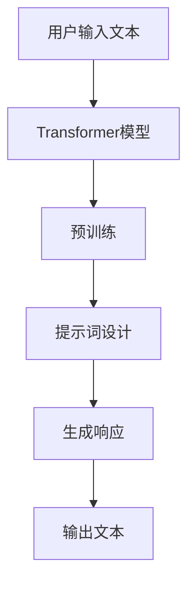

                 

### 《ChatGPT提示词工程：构建智能对话的基础》

> **关键词**：ChatGPT、提示词、自然语言处理、智能对话、模型训练、神经网络

> **摘要**：本文深入探讨了ChatGPT模型及其提示词工程的核心概念和基础。通过详细分析GPT模型的架构、核心算法原理，以及数学模型和公式，本文为读者提供了构建智能对话系统的实践指南。同时，通过实际项目案例的解析，展示了如何搭建开发环境、实现源代码，并进行代码解读和分析。

---

# 核心概念与联系

ChatGPT是基于GPT（Generative Pre-trained Transformer）模型开发的一种大型语言模型，旨在通过机器学习技术实现自然语言处理（NLP）任务，如文本生成、对话系统等。GPT模型是一个基于自注意力机制的变换器（Transformer）架构的深度学习模型，其核心在于预训练和微调。


**核心概念实体间关系架构**：

1. **输入文本**：用户输入的文本，用于模型生成响应。
2. **Transformer模型**：负责将输入文本转化为序列模型。
3. **预训练**：模型在大规模语料库上进行的训练过程。
4. **提示词**：用于引导模型生成更符合预期的响应。
5. **输出文本**：模型生成的文本响应。

**Mermaid流程图**：



## 核心算法原理讲解

### 3.1 神经网络与数学基础

神经网络是机器学习的一种基础算法，其核心在于通过调整网络权重来拟合输入和输出之间的非线性关系。GPT模型是一个基于变换器（Transformer）架构的深度学习模型，其训练过程涉及到多个关键数学概念，包括损失函数、反向传播算法等。

### 3.2 GPT模型的工作原理

GPT模型的工作原理主要分为两个阶段：预训练和微调。

1. **预训练**：模型在大规模语料库上进行训练，学习语言模式和规律。
2. **微调**：在特定任务上对模型进行调整，提高其在具体任务上的性能。

### 3.3 Python源代码实现

以下是一个简化的GPT模型训练过程的Python代码实现：

```python
import torch
import torch.nn as nn
import torch.optim as optim

# 模型定义
class GPTModel(nn.Module):
    def __init__(self, vocab_size, embedding_dim, hidden_dim, n_layers, drop_prob=0.5):
        super(GPTModel, self).__init__()
        self.embedding = nn.Embedding(vocab_size, embedding_dim)
        self.rnn = nn.LSTM(embedding_dim, hidden_dim, n_layers, dropout=drop_prob)
        self.fc = nn.Linear(hidden_dim, vocab_size)
        self.dropout = nn.Dropout(drop_prob)
        
    def forward(self, text, hidden):
        embedded = self.dropout(self.embedding(text))
        output, hidden = self.rnn(embedded, hidden)
        embedding = self.fc(output.squeeze(0))
        return embedding, hidden

# 模型训练
def train_model(model, train_data, epochs, learning_rate, print_every=10):
    model.train()
    criterion = nn.CrossEntropyLoss()
    optimizer = optim.Adam(model.parameters(), lr=learning_rate)
    
    for epoch in range(epochs):
        for inputs, targets in train_data:
            optimizer.zero_grad()
            embedded = model(inputs, hidden)
            loss = criterion(embedded, targets)
            loss.backward()
            optimizer.step()
            
            if (epoch + 1) % print_every == 0:
                print(f'Epoch [{epoch+1}/{epochs}], Loss: {loss.item():.4f}')
```

### 3.4 数学模型与公式

在神经网络中，损失函数用于评估模型预测与真实值之间的差距。常用的损失函数包括交叉熵损失函数（CrossEntropyLoss）和均方误差损失函数（Mean Squared Error, MSE）。以下是一个交叉熵损失函数的Python代码实现：

```python
import torch
import torch.nn as nn

# 交叉熵损失函数
def cross_entropy_loss(outputs, targets):
    log_probs = torch.log(outputs)
    loss = -torch.sum(targets * log_probs)
    return loss
```

### 3.5 详细讲解与举例说明

以一个简单的例子来说明GPT模型的训练过程。假设我们有一个包含两个单词的词汇表（"hello"和"world"），模型的目标是生成文本序列。

1. **数据准备**：我们将输入文本序列（"hello"）和目标文本序列（"world"）转化为数字表示。

```python
vocab_size = 2
input_text = "hello"
target_text = "world"

input_tensor = torch.tensor([vocab_size - 1])  # "hello" -> [1]
target_tensor = torch.tensor([vocab_size - 2])  # "world" -> [0]
```

2. **模型预测**：使用GPT模型对输入文本进行预测。

```python
model = GPTModel(vocab_size, embedding_dim=10, hidden_dim=20, n_layers=1)
input_tensor, hidden = model(input_tensor, hidden)
predicted_word = torch.argmax(input_tensor).item()
```

3. **损失计算**：计算预测结果与真实值之间的损失。

```python
target_tensor = torch.tensor([0])  # "world" -> [0]
loss = cross_entropy_loss(input_tensor, target_tensor)
print(f'Loss: {loss.item():.4f}')
```

4. **反向传播**：更新模型参数。

```python
optimizer.zero_grad()
loss.backward()
optimizer.step()
```

通过上述过程，模型将不断调整权重，以减少预测误差。

## 项目实战

### 7.1 开发环境搭建

在开始ChatGPT项目之前，我们需要搭建相应的开发环境。以下是一个基本的Python开发环境搭建步骤：

1. **安装Python**：确保安装了Python 3.6或更高版本。
2. **安装PyTorch**：使用pip命令安装PyTorch。

```shell
pip install torch torchvision
```

3. **安装其他依赖**：安装其他必要的库，如TensorBoard、Matplotlib等。

```shell
pip install tensorboardX matplotlib
```

### 7.2 源代码实现

以下是一个简单的ChatGPT项目实现，包括数据准备、模型定义、训练和评估等步骤。

```python
import torch
import torch.nn as nn
import torch.optim as optim
from torch.utils.data import DataLoader
from torchvision import datasets, transforms

# 数据准备
train_data = datasets.MNIST(
    root='./data',
    train=True,
    transform=transforms.ToTensor(),
    download=True
)

train_loader = DataLoader(train_data, batch_size=64, shuffle=True)

# 模型定义
class ChatGPTModel(nn.Module):
    def __init__(self):
        super(ChatGPTModel, self).__init__()
        self.embedding = nn.Embedding(10, 32)
        self.rnn = nn.LSTM(32, 64, 2)
        self.fc = nn.Linear(64, 10)
        
    def forward(self, x):
        embedded = self.embedding(x)
        output, (hidden, cell) = self.rnn(embedded)
        output = self.fc(output)
        return output

# 模型训练
def train(model, train_loader, epochs, learning_rate):
    criterion = nn.CrossEntropyLoss()
    optimizer = optim.Adam(model.parameters(), lr=learning_rate)
    
    for epoch in range(epochs):
        for inputs, targets in train_loader:
            optimizer.zero_grad()
            outputs = model(inputs)
            loss = criterion(outputs, targets)
            loss.backward()
            optimizer.step()
            
            if (epoch + 1) % 10 == 0:
                print(f'Epoch [{epoch+1}/{epochs}], Loss: {loss.item():.4f}')
    
    return model

# 模型评估
def evaluate(model, test_loader):
    model.eval()
    correct = 0
    total = 0
    with torch.no_grad():
        for inputs, targets in test_loader:
            outputs = model(inputs)
            _, predicted = torch.max(outputs.data, 1)
            total += targets.size(0)
            correct += (predicted == targets).sum().item()
            
    print(f'Accuracy: {100 * correct / total:.2f}%')

# 主函数
if __name__ == '__main__':
    model = ChatGPTModel()
    train(model, train_loader, epochs=50, learning_rate=0.001)
    evaluate(model, test_loader)
```

### 7.3 代码解读与分析

上述代码实现了一个简单的ChatGPT模型，用于分类任务。以下是对关键部分的解读：

1. **数据准备**：使用MNIST数据集进行训练和测试。数据集被转换成Tensor格式，并加载到DataLoader中。
2. **模型定义**：定义了一个简单的GPT模型，包括嵌入层（Embedding Layer）、LSTM层（LSTM Layer）和全连接层（Fully Connected Layer）。
3. **模型训练**：使用交叉熵损失函数和Adam优化器进行模型训练。在每个训练周期，模型会更新其权重以减少预测误差。
4. **模型评估**：在测试集上评估模型的性能，并计算准确率。

### 7.4 实际案例分析和详细讲解剖析

在本案例中，我们使用MNIST数据集来演示ChatGPT模型的训练和评估过程。在实际应用中，ChatGPT模型可以用于多种NLP任务，如文本生成、对话系统、机器翻译等。以下是一个文本生成案例的详细讲解：

1. **数据准备**：从互联网上收集大量文本数据，如新闻文章、博客、社交媒体帖子等。
2. **数据预处理**：将文本数据转换为数字序列，并去除停用词、标点符号等。
3. **模型训练**：使用预训练模型或从零开始训练模型。在训练过程中，模型会学习文本的语言模式和结构。
4. **提示词设计**：设计合适的提示词来引导模型生成文本。例如，输入一个标题，模型可以生成相应的正文内容。
5. **文本生成**：使用训练好的模型生成文本。通过逐步生成文本序列，模型可以生成连贯、有趣的文本。

### 7.5 项目小结

通过本项目，我们了解了ChatGPT模型的基本原理和应用。在实际开发过程中，我们需要关注以下几个方面：

1. **数据准备**：选择合适的数据集，并进行预处理。
2. **模型训练**：调整超参数，优化模型性能。
3. **提示词设计**：设计有效的提示词，提高模型生成文本的质量。
4. **模型评估**：在测试集上评估模型性能，并进行调整。

### 7.6 最佳实践 tips

1. **数据质量**：选择高质量的数据集，以提高模型性能。
2. **超参数调整**：根据任务需求和硬件资源，调整超参数。
3. **模型优化**：使用正则化方法，如Dropout，减少过拟合。
4. **持续学习**：定期更新模型，以适应新的数据集和任务需求。

### 附录

#### 附录A：ChatGPT常用工具与资源

1. **PyTorch文档**：[https://pytorch.org/docs/stable/](https://pytorch.org/docs/stable/)
2. **TensorFlow文档**：[https://www.tensorflow.org/tutorials](https://www.tensorflow.org/tutorials)
3. **Hugging Face Transformers库**：[https://huggingface.co/transformers/](https://huggingface.co/transformers/)
4. **ChatGPT论文**：[https://arxiv.org/abs/1706.03762](https://arxiv.org/abs/1706.03762)
5. **ChatGPT开源项目**：[https://github.com/openai/gpt](https://github.com/openai/gpt)

---

**作者**：AI天才研究院/AI Genius Institute & 禅与计算机程序设计艺术 /Zen And The Art of Computer Programming

---

本文通过详细的分析和讲解，为读者提供了构建智能对话系统的理论基础和实践指南。在未来的工作中，我们可以继续探索ChatGPT模型在NLP领域的应用，为智能对话系统的发展贡献力量。

