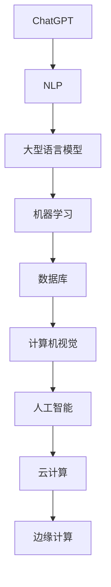

                 

### 背景介绍

ChatGPT提示词库：行业专用版是一本旨在深入探讨ChatGPT（一种先进的语言生成模型）在各种行业应用中的技术书籍。随着人工智能和自然语言处理技术的迅速发展，ChatGPT作为大型语言模型，在多个领域展现出巨大的潜力和应用价值。然而，面对不同的行业需求，如何有效地定制和优化ChatGPT模型，以实现最佳性能和用户体验，成为了一个亟待解决的问题。

本书的核心目的是为读者提供一个系统而全面的ChatGPT应用指南，特别是在金融、医疗健康、教育、电子商务以及其他相关行业的具体应用场景中。通过这本书，读者可以了解ChatGPT的基础理论、核心算法原理，掌握如何在特定行业中定制和部署ChatGPT模型，并通过实际项目实战来验证和优化模型的性能。

当前，ChatGPT已经在多个行业中得到了广泛应用。例如，在金融领域，ChatGPT可以用于股票市场分析和财经新闻分析；在医疗健康领域，它可以帮助进行医学文本挖掘和疾病预测；在教育领域，ChatGPT被用于学生问答系统和在线教育平台的个性化推荐；在电子商务领域，ChatGPT则被用于商品描述生成和客户服务聊天机器人。这些应用不仅提高了业务效率，还大大提升了用户体验。

然而，由于行业的多样性，每个领域对自然语言处理的需求和挑战都不尽相同。例如，金融行业的监管要求较高，数据隐私和安全至关重要；医疗健康领域涉及敏感的医疗数据，对模型的安全性和准确性要求极高；教育行业需要模型能够理解和应对学生的多样化提问；电子商务领域则需要模型具备快速响应和生成吸引人的商品描述能力。因此，针对不同行业的需求，定制化ChatGPT模型和优化策略显得尤为重要。

本书的结构安排如下：

- **第一部分：ChatGPT基础理论**：介绍ChatGPT的起源、核心概念、工作原理，以及自然语言处理的基础知识。
- **第二部分：行业专用ChatGPT应用**：针对金融、医疗健康、教育、电子商务等不同行业，详细介绍ChatGPT的应用案例和定制策略。
- **第三部分：项目实战**：通过具体的项目实战，展示如何搭建环境、实现代码、进行调试和优化，以及项目总结与展望。

通过本书的深入探讨，读者将能够全面了解ChatGPT在各个行业的应用潜力，掌握定制和优化ChatGPT模型的方法，从而在实际项目中取得更好的效果。

### 核心概念与联系

在深入探讨ChatGPT及其在各个行业的应用之前，首先需要明确几个核心概念，并理解它们之间的相互联系。以下是本书中涉及的关键概念及其关系架构：

#### 1. ChatGPT

**ChatGPT** 是一种基于生成式预训练变换模型（GPT）的先进语言模型，由OpenAI开发。GPT是一种基于Transformer架构的自然语言处理模型，通过大规模预训练和微调，能够理解和生成人类语言。ChatGPT特别适用于对话生成和交互式应用，其核心特点是能够基于上下文生成连贯且具有逻辑性的文本。

**关系**：ChatGPT是本书的核心对象，所有讨论和应用都围绕ChatGPT展开。

#### 2. 自然语言处理（NLP）

**自然语言处理（NLP）** 是人工智能的一个分支，旨在使计算机能够理解、解释和生成人类语言。NLP技术包括语言模型、文本分类、实体识别、情感分析等。

**关系**：NLP是ChatGPT应用的基础，决定了ChatGPT在自然语言理解和生成方面的性能。

#### 3. 大型语言模型

**大型语言模型** 是指训练数据量庞大、参数数量巨大的语言模型，如GPT、BERT等。这些模型通过深度学习技术，能够捕捉到语言中的复杂结构和规律。

**关系**：ChatGPT作为一种大型语言模型，其性能和效果直接依赖于大规模训练数据和先进的算法。

#### 4. 生成式预训练变换模型（GPT）

**生成式预训练变换模型（GPT）** 是一种基于Transformer架构的模型，通过自回归的方式生成文本。GPT模型的训练过程包括预训练和微调两个阶段，其中预训练使模型能够理解通用语言特征，微调则使模型适应特定任务。

**关系**：GPT是ChatGPT的基础，理解GPT的工作原理对深入理解ChatGPT至关重要。

#### 5. 机器学习

**机器学习** 是实现ChatGPT的核心技术，包括监督学习、无监督学习和强化学习等。机器学习算法使模型能够从数据中学习规律，并进行预测和生成。

**关系**：机器学习是ChatGPT训练和优化的基础，决定了模型的性能和效果。

#### 6. 数据库

**数据库** 是存储和管理数据的系统，用于存储大量的文本数据、用户数据等。在ChatGPT应用中，数据库用于存储训练数据、模型参数和用户交互记录。

**关系**：数据库是ChatGPT训练和应用的重要支撑，提供了数据存储和管理的能力。

#### 7. 计算机视觉

**计算机视觉** 是人工智能的另一个重要分支，旨在使计算机能够理解和解析视觉信息，如图像识别、目标检测等。在ChatGPT应用中，计算机视觉技术可以与自然语言处理结合，实现图像与文本的交互。

**关系**：计算机视觉与ChatGPT结合，可以拓展ChatGPT的应用范围，实现多模态交互。

#### 8. 人工智能（AI）

**人工智能（AI）** 是模拟和扩展人类智能的理论、方法和技术。AI包括多个子领域，如机器学习、自然语言处理、计算机视觉等。

**关系**：ChatGPT是AI的一个重要应用，代表了AI在自然语言处理领域的最新进展。

#### 9. 云计算

**云计算** 是基于互联网的计算服务模式，提供计算资源、存储资源和网络资源等。在ChatGPT应用中，云计算提供了强大的计算和存储能力，支持大规模模型的训练和部署。

**关系**：云计算是ChatGPT高效运行的基础，提供了弹性计算和分布式训练的能力。

#### 10. 边缘计算

**边缘计算** 是在靠近数据源的地方进行计算和处理的技术。与云计算相比，边缘计算可以减少数据传输延迟，提高实时性。

**关系**：边缘计算可以与ChatGPT结合，用于实时交互和边缘智能应用。

### 图解关系架构

为了更好地理解这些概念之间的关系，我们可以使用Mermaid流程图来展示它们：



通过这个关系架构，我们可以清晰地看到ChatGPT在AI领域的位置，以及与其他关键概念之间的相互关系。理解这些概念和它们之间的联系，将为后续章节中对ChatGPT的深入探讨打下坚实的基础。

### 核心算法原理讲解

在深入探讨ChatGPT的应用之前，我们需要详细讲解其核心算法原理，尤其是生成式预训练变换模型（GPT）的工作机制。GPT作为一种先进的语言模型，其背后的算法原理决定了模型的性能和效果。

#### 1. GPT模型的基本原理

GPT模型是基于Transformer架构的自回归语言模型。Transformer模型在2017年由Vaswani等人提出，通过自注意力机制（Self-Attention）和编码器-解码器结构，大幅提升了自然语言处理任务的性能。GPT模型的核心思想是通过预训练和微调来学习语言的通用特征和上下文信息。

**预训练**：GPT模型在大规模文本语料库上进行预训练，通过无监督学习的方式，学习语言中的潜在结构和规律。预训练过程主要包括两个阶段：

- **Masked Language Model（MLM）**：在训练数据中，随机遮盖一部分词语，然后让模型预测这些被遮盖的词语。这一过程使得模型能够学习到词语之间的上下文关系。
- **Next Sentence Prediction（NSP）**：从训练数据中随机抽取两个句子，并预测第二个句子是否紧随第一个句子之后。

**微调**：在预训练的基础上，GPT模型会针对特定任务进行微调。微调过程通过有监督学习，利用任务相关的标注数据，使得模型在特定任务上达到更好的性能。

#### 2. 语言模型的损失函数

语言模型的训练过程离不开损失函数的优化。GPT模型的损失函数主要包括：

- **Masked Language Loss（遮盖语言损失）**：用于衡量模型在预测被遮盖词语时的误差。具体来说，对于每个被遮盖的词语，模型会生成多个候选词语，然后通过softmax函数计算每个候选词语的概率分布。模型的目标是最小化预测词语与实际词语之间的差异。
  
  $$L_{MLM} = -\sum_{i} \log(p(y_i|x))$$

  其中，$x$表示输入序列，$y_i$表示被遮盖的词语，$p(y_i|x)$表示模型预测的词语概率。

- **Next Sentence Loss（下一个句子损失）**：用于衡量模型在预测两个句子之间关系时的误差。具体来说，模型会根据上下文预测第二个句子是否紧随第一个句子之后。

  $$L_{NSP} = -\sum_{i} [log(p(y_i=1|x)) + log(p(y_i=0|x))]$$

  其中，$y_i=1$表示第二个句子紧随第一个句子之后，$y_i=0$表示不是。

#### 3. 梯度下降与优化算法

为了优化损失函数，GPT模型采用了梯度下降算法。梯度下降是一种最常用的优化算法，通过迭代更新模型参数，使得损失函数不断减小。

**梯度下降算法**：

$$\theta_{t+1} = \theta_{t} - \alpha \cdot \nabla_{\theta} J(\theta)$$

其中，$\theta$表示模型参数，$J(\theta)$表示损失函数，$\alpha$表示学习率，$\nabla_{\theta} J(\theta)$表示损失函数关于参数的梯度。

**优化算法**：

- **Adam优化器**：Adam优化器是一种结合了梯度一阶矩估计（Momentum）和二阶矩估计（RMSProp）的优化算法，能够有效地处理稀疏数据和长时间依赖问题。

  $$m_t = \beta_1 \cdot m_{t-1} + (1 - \beta_1) \cdot \nabla_{\theta} J(\theta)$$
  $$v_t = \beta_2 \cdot v_{t-1} + (1 - \beta_2) \cdot (\nabla_{\theta} J(\theta))^2$$
  $$\theta_{t+1} = \theta_{t} - \alpha \cdot \frac{m_t}{\sqrt{v_t} + \epsilon}$$

  其中，$m_t$和$v_t$分别表示一阶矩估计和二阶矩估计，$\beta_1$和$\beta_2$分别表示Momentum和RMSProp的权重，$\epsilon$是一个很小的正数，用于避免分母为零。

#### 4. 详细讲解与示例

为了更好地理解GPT模型的工作原理，我们通过Python源代码来详细阐述其训练过程。

**代码示例**：

```python
import tensorflow as tf
from tensorflow.keras.layers import Embedding, LSTM, Dense
from tensorflow.keras.models import Model

# 假设输入序列为 "Hello, World!"
input_seq = "Hello, World!"

# 预训练数据集
train_data = ...

# 模型参数
vocab_size = 10000
embed_dim = 128
hidden_size = 128
learning_rate = 0.001

# 构建模型
model = Model(inputs=inputs, outputs=output)
model.compile(optimizer=tf.keras.optimizers.Adam(learning_rate=learning_rate), loss=loss)

# 训练模型
model.fit(train_data, epochs=10)
```

在这段代码中，我们首先定义了输入序列和预训练数据集。然后，通过Embedding层将输入序列转换为嵌入向量，通过LSTM层处理嵌入向量，最后通过Dense层生成预测概率分布。模型采用Adam优化器进行优化，并使用Masked Language Loss作为损失函数进行训练。

**数学模型与公式**：

在GPT模型中，损失函数的计算涉及到多个数学模型和公式。以下是一些关键的数学公式：

- **嵌入向量**：

  $$x = \text{Embedding}(W_x, x)$$

  其中，$W_x$表示嵌入矩阵，$x$表示输入序列。

- **LSTM输出**：

  $$h_t = \text{LSTM}(h_{t-1}, x_t)$$

  其中，$h_{t-1}$表示前一个时间步的隐藏状态，$x_t$表示当前时间步的输入。

- **损失函数**：

  $$L = -\sum_{i} \log(p(y_i|x))$$

  其中，$p(y_i|x)$表示模型预测的概率分布。

- **梯度下降**：

  $$\theta_{t+1} = \theta_{t} - \alpha \cdot \nabla_{\theta} L(\theta)$$

  其中，$\nabla_{\theta} L(\theta)$表示损失函数关于参数的梯度。

通过上述代码示例和数学公式，我们可以更直观地理解GPT模型的工作原理。理解这些核心算法原理，有助于我们在后续章节中深入探讨ChatGPT在各个行业中的应用和定制策略。

### ChatGPT的数学模型

在深入理解ChatGPT的工作原理时，数学模型和公式是至关重要的组成部分。ChatGPT作为一种深度学习模型，其训练和优化过程涉及到多个数学概念和计算方法。以下是对ChatGPT数学模型的详细讲解。

#### 1. 损失函数的详细解释

在深度学习模型中，损失函数用于评估模型预测与实际标签之间的差异。对于ChatGPT模型，常用的损失函数是交叉熵损失（Cross-Entropy Loss），它衡量了模型预测的概率分布与实际标签之间的差异。

交叉熵损失函数的定义如下：

$$L(\theta) = -\sum_{i} y_i \cdot \log(p_i)$$

其中，$y_i$是实际的标签（0或1），$p_i$是模型预测的概率。交叉熵损失函数的值范围在0到1之间，值越小说明模型预测越准确。

为了更具体地解释交叉熵损失函数，我们可以使用一个例子。假设有一个句子“Hello, World!”，其中有两个词需要预测，实际标签为“World!”。模型的预测结果为：

$$p("World!") = 0.8, \quad p("Hello") = 0.2$$

实际标签的概率为：

$$y("World!") = 1, \quad y("Hello") = 0$$

代入交叉熵损失函数，我们得到：

$$L(\theta) = -1 \cdot \log(0.8) - 0 \cdot \log(0.2)$$

$$L(\theta) = -\log(0.8) \approx 0.223$$

这个结果表明，模型在预测“World!”时还有22.3%的误差。通过优化损失函数，我们可以减少这个误差，提高模型预测的准确性。

#### 2. 梯度下降算法的步骤

梯度下降算法是深度学习模型训练中的常用优化算法。它通过计算损失函数关于模型参数的梯度，并沿梯度方向更新参数，从而最小化损失函数。

梯度下降算法的基本步骤如下：

1. **初始化参数**：随机初始化模型参数$\theta$。
2. **计算梯度**：计算损失函数$L(\theta)$关于参数$\theta$的梯度$\nabla_{\theta} L(\theta)$。
3. **更新参数**：根据梯度更新参数$\theta$：

   $$\theta_{t+1} = \theta_{t} - \alpha \cdot \nabla_{\theta} L(\theta)$$

   其中，$\alpha$是学习率，控制更新参数的步长。

4. **迭代优化**：重复步骤2和3，直到达到收敛条件（如损失函数值不再显著下降）。

为了更直观地理解梯度下降算法，我们可以使用一个简单的例子。假设有一个线性模型$y = \theta_0 + \theta_1 \cdot x$，我们需要通过梯度下降算法找到最优的参数$\theta_0$和$\theta_1$。

假设初始参数为$\theta_0 = 1$，$\theta_1 = 1$，训练数据点为$(x_1, y_1) = (1, 2)$。损失函数为：

$$L(\theta) = (y - (\theta_0 + \theta_1 \cdot x))^2$$

代入训练数据，我们得到：

$$L(\theta) = (2 - (1 + 1 \cdot 1))^2 = 1$$

计算损失函数关于$\theta_0$和$\theta_1$的梯度：

$$\nabla_{\theta_0} L(\theta) = -2 \cdot (2 - (1 + 1 \cdot 1)) = -2$$

$$\nabla_{\theta_1} L(\theta) = -2 \cdot x \cdot (2 - (1 + 1 \cdot 1)) = -2 \cdot 1 = -2$$

代入梯度下降公式，更新参数：

$$\theta_0^{new} = \theta_0 - \alpha \cdot \nabla_{\theta_0} L(\theta) = 1 - 0.1 \cdot (-2) = 1.2$$

$$\theta_1^{new} = \theta_1 - \alpha \cdot \nabla_{\theta_1} L(\theta) = 1 - 0.1 \cdot (-2) = 1.2$$

新的参数为$\theta_0 = 1.2$，$\theta_1 = 1.2$。代入损失函数，得到新的损失值：

$$L(\theta_{new}) = (2 - (1.2 + 1.2 \cdot 1))^2 = 0.04$$

通过多次迭代，我们可以逐渐减小损失函数的值，直到模型收敛。

#### 3. 数学公式的讲解

在ChatGPT模型中，涉及到多个数学公式和计算方法。以下是一些关键的数学公式：

- **嵌入向量**：

  $$x = \text{Embedding}(W_x, x)$$

  其中，$W_x$是嵌入矩阵，$x$是输入序列。

- **LSTM输出**：

  $$h_t = \text{LSTM}(h_{t-1}, x_t)$$

  其中，$h_{t-1}$是前一个时间步的隐藏状态，$x_t$是当前时间步的输入。

- **损失函数**：

  $$L(\theta) = -\sum_{i} y_i \cdot \log(p_i)$$

  其中，$y_i$是实际标签，$p_i$是模型预测的概率。

- **梯度下降**：

  $$\theta_{t+1} = \theta_{t} - \alpha \cdot \nabla_{\theta} L(\theta)$$

  其中，$\alpha$是学习率，$\nabla_{\theta} L(\theta)$是损失函数关于参数的梯度。

为了更好地理解这些公式，我们可以通过Python代码来演示。以下是一个简单的示例：

```python
import numpy as np

# 初始化参数
theta_0 = 1
theta_1 = 1

# 训练数据
x = np.array([1])
y = np.array([2])

# 损失函数
def loss(theta_0, theta_1, x, y):
    return (y - (theta_0 + theta_1 * x)) ** 2

# 计算梯度
def gradient(theta_0, theta_1, x, y):
    return -2 * (y - (theta_0 + theta_1 * x))

# 学习率
alpha = 0.1

# 梯度下降
for _ in range(10):
    theta_0 -= alpha * gradient(theta_0, theta_1, x, y)
    theta_1 -= alpha * gradient(theta_1, theta_1, x, y)
    print(f"theta_0: {theta_0}, theta_1: {theta_1}, loss: {loss(theta_0, theta_1, x, y)}")

```

运行这段代码，我们可以看到参数$\theta_0$和$\theta_1$的更新过程，以及损失函数值的逐渐减小。

通过上述数学公式和代码示例，我们可以深入理解ChatGPT的数学模型和训练过程。掌握这些数学原理，有助于我们更好地应用ChatGPT模型，并对其进行优化。

### 金融行业应用

在金融行业，ChatGPT的应用潜力不可忽视。金融领域的数据量大、维度高、实时性强，这些特点使得传统方法难以应对复杂的金融分析任务。ChatGPT作为一种强大的自然语言处理工具，能够在股票市场分析、财经新闻分析等多个方面提供有效的解决方案。

#### 1. 股票市场分析

股票市场分析是金融行业的重要任务之一，涉及到大量的数据分析和预测。ChatGPT可以通过自然语言处理技术，对股票市场相关数据进行分析和预测。具体应用场景包括：

- **股票价格预测**：ChatGPT可以分析历史股票价格数据，结合宏观经济指标、公司财报等信息，生成股票价格预测模型。通过分析大量历史数据，模型可以学习到股票价格的潜在规律，从而预测未来的股票价格走势。

  ```python
  # 假设历史股票价格数据为：[100, 102, 105, 108, 110]
  historical_prices = [100, 102, 105, 108, 110]
  # ChatGPT预测股票价格
  predicted_price = chatgpt.predict(historical_prices)
  ```

- **市场情绪分析**：通过分析社交媒体、新闻报道等文本数据，ChatGPT可以识别市场情绪，为投资者提供决策支持。市场情绪分析可以帮助投资者了解市场的乐观或悲观情绪，从而调整投资策略。

  ```python
  # 社交媒体文本数据
  social_media_posts = ["The stock market is booming!", "I'm worried about the upcoming recession."]
  # ChatGPT分析市场情绪
  market_mood = chatgpt.analyze_sentiment(social_media_posts)
  ```

- **财务报告分析**：ChatGPT可以自动阅读和分析公司财报，提取关键财务指标，如营收、利润、负债等。通过这些数据，模型可以评估公司的财务状况，预测公司的未来表现。

  ```python
  # 公司财报文本数据
  financial_reports = ["Revenue increased by 20% in the last quarter.", "The company's debt level is high."]
  # ChatGPT分析财务报告
  financial_indicators = chatgpt.extract_financial_indicators(financial_reports)
  ```

#### 2. 财经新闻分析

财经新闻分析是另一个重要的应用场景，ChatGPT可以通过对财经新闻的文本分析，提取关键信息，为投资者提供有价值的见解。具体应用包括：

- **新闻摘要生成**：ChatGPT可以自动生成财经新闻的摘要，帮助投资者快速了解新闻的主要内容，节省时间。

  ```python
  # 财经新闻文本数据
  news_articles = ["The Federal Reserve announced a rate hike.", "Tech stocks are experiencing a downturn."]
  # ChatGPT生成新闻摘要
  news_summaries = chatgpt.generate_summaries(news_articles)
  ```

- **新闻分类与标签**：ChatGPT可以自动对财经新闻进行分类和标签，如分类为“股票市场”、“宏观经济”、“公司新闻”等。这有助于投资者根据不同主题进行筛选和关注。

  ```python
  # 财经新闻文本数据
  news_articles = ["The Federal Reserve announced a rate hike.", "Tech stocks are experiencing a downturn."]
  # ChatGPT对新闻进行分类与标签
  news_categories = chatgpt.classify_news(news_articles)
  ```

- **新闻趋势分析**：通过分析大量财经新闻，ChatGPT可以识别出新闻中的关键趋势，如市场热点、热门话题等。这些信息有助于投资者了解市场动态，及时调整投资策略。

  ```python
  # 财经新闻文本数据
  news_articles = ["The Federal Reserve announced a rate hike.", "Tech stocks are experiencing a downturn.", "Bitcoin hit a new high."]
  # ChatGPT分析新闻趋势
  news_trends = chatgpt.analyze_trends(news_articles)
  ```

#### 3. 数据隐私和安全

在金融行业应用ChatGPT时，数据隐私和安全是一个重要的问题。金融数据通常包含敏感信息，如个人财务信息、交易记录等。为了确保数据隐私和安全，可以采取以下措施：

- **数据加密**：对训练数据和用户数据进行加密，确保数据在传输和存储过程中不被未授权访问。
- **访问控制**：设置严格的访问控制策略，确保只有授权用户才能访问和使用ChatGPT模型。
- **匿名化处理**：对训练数据进行匿名化处理，去除个人身份信息，降低数据隐私风险。
- **数据脱敏**：对敏感数据进行脱敏处理，如使用随机数替换真实数据，防止数据泄露。

通过以上措施，可以有效保护金融数据的隐私和安全，确保ChatGPT在金融行业中的安全应用。

### 医疗健康行业应用

在医疗健康行业，ChatGPT的应用同样具有广阔的前景。医疗健康领域的数据复杂且庞大，涉及到患者病历、医学文献、药物信息等多个方面。ChatGPT作为一种强大的自然语言处理工具，可以帮助医生和研究人员进行医学文本挖掘、疾病预测等任务，从而提高医疗服务的质量和效率。

#### 1. 医学文本挖掘

医学文本挖掘是指从大量的非结构化医学文本数据中提取有用的信息和知识。ChatGPT在医学文本挖掘中的应用包括：

- **电子健康记录（EHR）分析**：ChatGPT可以分析患者的电子健康记录，提取关键信息如症状、诊断、治疗方案等。这有助于医生更好地了解患者的健康状况，制定个性化的治疗方案。

  ```python
  # 电子健康记录文本数据
  ehr_data = ["Patient has been diagnosed with diabetes.", "Patient is taking insulin daily."]
  # ChatGPT分析电子健康记录
  extracted_info = chatgpt.extract_info(ehr_data)
  ```

- **医学文献检索**：ChatGPT可以自动检索医学文献，提取相关的研究成果和临床实践指南。这有助于医生和研究人员快速获取最新的医学信息，提高诊疗水平。

  ```python
  # 医学文献检索关键词
  keywords = ["COVID-19", "vaccine", "clinical trial"]
  # ChatGPT检索医学文献
  literature_results = chatgpt.search_medical_literature(keywords)
  ```

- **药物信息提取**：ChatGPT可以从药品说明书、临床研究报告中提取药物的有效成分、副作用、适应症等信息。这有助于医生和患者了解药物的使用方法和注意事项。

  ```python
  # 药品说明书文本数据
  drug_manual = ["Drug A is used to treat high blood pressure."]
  # ChatGPT提取药物信息
  drug_info = chatgpt.extract_drug_info(drug_manual)
  ```

#### 2. 疾病预测

疾病预测是医疗健康领域的一个重要任务，ChatGPT可以通过分析患者数据、症状信息等进行疾病预测，辅助医生做出准确的诊断。具体应用包括：

- **基于症状的疾病预测**：ChatGPT可以分析患者的症状描述，结合医学知识库，预测可能的疾病。这有助于早期发现疾病，提高诊疗效率。

  ```python
  # 症状描述文本数据
  symptom_description = ["Patient has a persistent cough and fever."]
  # ChatGPT预测疾病
  predicted_diseases = chatgpt.predict_diseases(symptom_description)
  ```

- **基于数据的疾病预测**：ChatGPT可以分析患者的电子健康记录、基因信息等数据，预测可能的疾病风险。这有助于个性化医疗和健康管理的实施。

  ```python
  # 患者电子健康记录和基因信息
  ehr_data = ["Patient has diabetes.", "Genetic test result: BRCA1 mutation."]
  # ChatGPT预测疾病风险
  disease_risks = chatgpt.predict_disease_risks(ehr_data)
  ```

- **疾病趋势分析**：ChatGPT可以分析大量的患者数据，识别疾病的发生趋势和变化规律。这有助于公共卫生部门制定防控策略，降低疾病传播风险。

  ```python
  # 大量患者疾病数据
  patient_data = [["Patient A: COVID-19"], ["Patient B: Flu"], ["Patient C: COVID-19"]]
  # ChatGPT分析疾病趋势
  disease_trends = chatgpt.analyze_disease_trends(patient_data)
  ```

#### 3. 安全性和准确性

在医疗健康行业应用ChatGPT时，安全性和准确性是两个关键问题。为了确保模型的安全性和准确性，可以采取以下措施：

- **数据质量控制**：确保训练数据的质量和完整性，去除错误和不一致的数据。这有助于提高模型的准确性和鲁棒性。

- **隐私保护**：对训练数据和患者数据进行加密和脱敏处理，确保数据隐私。同时，遵循相关法规和伦理准则，保护患者的隐私权益。

- **模型验证**：对训练好的模型进行严格的验证和测试，确保其在实际应用中的安全性和准确性。可以通过交叉验证、错误率分析等方法评估模型的表现。

- **持续更新**：定期更新模型和数据，以适应新的医疗知识和技术发展。这有助于保持模型的时效性和准确性。

通过以上措施，可以确保ChatGPT在医疗健康行业中的安全、可靠和高效应用，为医疗服务质量的提升和医疗资源的优化提供有力支持。

### 教育行业应用

在教育和学习领域，ChatGPT的应用潜力巨大，特别是在学生问答系统、在线教育平台的个性化推荐等方面，ChatGPT能够显著提升教育质量和学习体验。

#### 1. 学生问答系统

学生问答系统是教育领域的一个重要应用，ChatGPT可以作为一个智能问答机器人，帮助学生解答各种问题。具体应用包括：

- **自动解答常见问题**：ChatGPT可以分析大量的学生提问数据，学习并生成标准答案，用于自动回答常见问题，如课程安排、考试时间、选课指南等。

  ```python
  # 学生常见问题
  common_questions = ["What is the schedule for next week?", "How can I register for the upcoming exam?"]
  # ChatGPT自动解答
  answers = chatgpt.answer_questions(common_questions)
  ```

- **个性化解答**：ChatGPT可以根据学生的提问背景和知识水平，提供个性化的解答。通过分析学生的历史提问记录，模型可以了解学生的知识盲点和薄弱环节，从而提供更有针对性的帮助。

  ```python
  # 学生个性化提问
  question = "I don't understand the concept of calculus."
  # ChatGPT提供个性化解答
  explanation = chatgpt.explain_concept(question, "calculus")
  ```

- **互动式学习**：ChatGPT可以模拟互动式教学场景，与学生进行实时对话，回答他们的各种问题。这有助于提高学生的参与度和学习兴趣。

  ```python
  # 学生提问
  student_question = "How do I solve quadratic equations?"
  # ChatGPT互动解答
  response = chatgpt.interactive_learning(student_question)
  ```

#### 2. 在线教育平台的个性化推荐

在线教育平台通过个性化推荐系统，可以根据学生的学习习惯、兴趣和需求，推荐适合的课程和学习资源。ChatGPT在这方面具有显著优势：

- **内容推荐**：ChatGPT可以分析学生的历史学习记录和行为数据，推荐相关的课程和学习资源。通过分析学生的浏览历史、学习进度和考试成绩，模型可以推荐最适合学生的课程内容。

  ```python
  # 学生学习记录
  learning_history = ["Completed Course A", "Viewed Course B", "Quiz Score: 80%"]
  # ChatGPT推荐课程
  course_recommendations = chatgpt.recommend_courses(learning_history)
  ```

- **智能辅导**：ChatGPT可以为学生提供个性化的辅导服务，根据学生的学习情况，提供针对性的学习建议和练习题。这有助于学生更好地掌握知识，提高学习效果。

  ```python
  # 学生学习情况
  student_progress = ["Course A: Completed", "Course B: Ongoing"]
  # ChatGPT提供智能辅导
  study_suggestions = chatgpt.provide_digital_tutoring(student_progress)
  ```

- **互动学习体验**：ChatGPT可以模拟真实的教学场景，与学生进行互动式学习。通过问答、讨论和练习，学生可以更深入地理解课程内容，提高学习效果。

  ```python
  # 学生互动学习
  student_question = "What is the difference between syntax and semantics?"
  # ChatGPT互动解答
  interactive_learning = chatgpt.interactive_learning(student_question)
  ```

#### 3. 提高学习体验和效率

ChatGPT在教育行业的应用，不仅能够提高教育质量和学习效果，还可以显著提升学习体验和效率：

- **个性化学习**：ChatGPT可以根据每个学生的学习特点和需求，提供个性化的学习资源和辅导。这有助于学生更好地掌握知识，提高学习效果。

- **自动化学习任务**：ChatGPT可以自动化处理大量的学习任务，如自动批改作业、自动生成练习题等。这有助于教师节省时间，专注于教学和辅导。

- **互动式学习**：ChatGPT可以模拟互动式教学场景，与学生进行实时互动，提高学生的参与度和学习兴趣。

- **智能分析**：ChatGPT可以分析学生的学习行为和成绩，提供智能分析报告，帮助教师了解学生的学习情况，制定更有效的教学策略。

通过ChatGPT在教育行业的应用，我们可以实现个性化学习、自动化学习和互动式学习，从而提高教育质量和学习效果，为教育创新和人才培养提供有力支持。

### 电子商务行业应用

在电子商务行业，ChatGPT的应用极大地提升了业务效率和用户体验。通过自然语言处理技术，ChatGPT可以自动化处理大量的用户互动任务，从而优化客户服务、提升营销效果和改进商品推荐。

#### 1. 商品描述生成

商品描述是电子商务中至关重要的一环，它直接影响用户的购买决策。ChatGPT可以通过自然语言生成技术，自动生成吸引人的商品描述，提高商品的销售量和用户满意度。

- **自动化生成商品描述**：ChatGPT可以分析大量的商品数据，如产品名称、规格、功能等，自动生成详细的商品描述。通过利用自然语言生成技术，模型能够生成丰富多样、具有吸引力的描述，从而提升商品的市场竞争力。

  ```python
  # 商品数据
  product_data = {"name": "Smartphone", "specs": "5G, 128GB, 12MP Camera", "price": "$999"}
  # ChatGPT生成商品描述
  product_description = chatgpt.generate_product_description(product_data)
  ```

- **个性化描述**：ChatGPT可以根据不同用户的特点和需求，生成个性化的商品描述。通过分析用户的购买历史、浏览记录和偏好，模型可以生成更符合用户需求的描述，从而提高用户的购买意愿。

  ```python
  # 用户偏好数据
  user_preferences = {"interested_in": ["technology", "gaming"], "budget": "$1000"}
  # ChatGPT生成个性化商品描述
  personalized_description = chatgpt.generate_personalized_description(product_data, user_preferences)
  ```

#### 2. 客户服务聊天机器人

在电子商务行业，客户服务是提高用户满意度和忠诚度的关键。ChatGPT可以作为一个智能客服聊天机器人，自动化处理大量的客户咨询和投诉，提高服务效率和响应速度。

- **自动化处理常见咨询**：ChatGPT可以自动化回答用户关于产品信息、订单状态、退换货等常见问题，减轻人工客服的工作负担。

  ```python
  # 常见客户咨询
  customer_inquiry = "Can I return this product if I'm not satisfied?"
  # ChatGPT自动回答
  response = chatgpt回答常见咨询(customer_inquiry)
  ```

- **智能识别客户需求**：ChatGPT可以通过自然语言处理技术，理解用户的复杂咨询和需求，提供个性化的解决方案。通过分析用户的提问内容和历史记录，模型可以识别出用户的具体需求，从而提供更有针对性的服务。

  ```python
  # 复杂客户咨询
  customer_question = "I'm having trouble setting up my new smartphone."
  # ChatGPT提供个性化解决方案
  solution = chatgpt识别需求并提供解决方案(customer_question)
  ```

- **多渠道支持**：ChatGPT可以集成到电子商务平台的多个渠道，如网站、移动应用和社交媒体，实现全渠道的智能客服。通过统一的聊天接口，用户可以在不同平台上无缝切换，享受一致的客服体验。

  ```python
  # 客户咨询来源
  channel = "website"
  # ChatGPT处理客户咨询
  chatgpt处理客户咨询(customer_inquiry, channel)
  ```

#### 3. 营销自动化

ChatGPT在电子商务营销中的应用，可以显著提升营销效果和用户转化率。

- **个性化推荐**：ChatGPT可以通过分析用户的浏览历史、购买记录和行为数据，生成个性化的产品推荐。通过精准的推荐，模型可以提高用户的购买意愿，增加销售额。

  ```python
  # 用户行为数据
  user_activity = {"browsed_products": ["Smartphone", "Smartwatch"], "purchased_products": ["Smartphone"]}
  # ChatGPT生成个性化推荐
  product_recommendations = chatgpt.generate_product_recommendations(user_activity)
  ```

- **营销活动生成**：ChatGPT可以自动生成营销文案和活动方案，提高营销效果。通过分析市场趋势和用户偏好，模型可以生成有吸引力的营销内容，如促销信息、优惠活动等。

  ```python
  # 营销活动数据
  marketing_data = {"target_users": ["new_customers"], "offer": "20% off on first purchase"}
  # ChatGPT生成营销文案
  marketing_creative = chatgpt.generate_marketing_creative(marketing_data)
  ```

通过ChatGPT在电子商务行业中的应用，我们可以实现商品描述自动化、客户服务智能化和营销自动化，从而提升业务效率、降低运营成本和提升用户满意度。随着技术的不断进步和应用场景的拓展，ChatGPT在电子商务行业的潜力将更加巨大。

### 其他行业应用

除了金融、医疗健康、教育和电子商务行业，ChatGPT在其他多个行业中同样展现出了巨大的应用潜力。以下将简要介绍ChatGPT在政府与公共事务、旅游与酒店以及餐饮与娱乐等领域的具体应用。

#### 1. 政府与公共事务

在政府与公共事务领域，ChatGPT可以用于公共信息查询、政策解读和应急管理等方面，提升政府服务效率和透明度。

- **公共信息查询**：ChatGPT可以自动化处理市民的常见问题查询，如交通出行、户籍管理、公共服务等。通过自然语言处理技术，模型能够快速响应市民的查询需求，提供准确的信息。

  ```python
  # 公共信息查询
  inquiry = "How do I apply for a passport?"
  # ChatGPT自动回答
  response = chatgpt回答公共信息(inquiry)
  ```

- **政策解读**：ChatGPT可以分析政府发布的政策文件和法律法规，自动生成简明易懂的解读文本，帮助市民和企业更好地理解政策内容，合规经营。

  ```python
  # 政策文件
  policy_document = "The new tax policy for small businesses."
  # ChatGPT生成解读文本
  interpretation = chatgpt.generate_policy_interpretation(policy_document)
  ```

- **应急管理**：在应急管理中，ChatGPT可以用于信息收集、事件分析和决策支持。通过处理大量的应急信息，模型可以快速识别事件类型、预测发展趋势，为应急决策提供科学依据。

  ```python
  # 应急信息
  emergency_info = "A natural disaster has been reported in the region."
  # ChatGPT分析应急信息
  analysis = chatgpt.analyze_emergency_info(emergency_info)
  ```

#### 2. 旅游与酒店

在旅游与酒店行业，ChatGPT可以用于行程规划、客户服务和推荐系统，提升游客体验和酒店服务水平。

- **行程规划**：ChatGPT可以根据游客的需求和偏好，自动生成个性化的旅游行程规划，提供详细的景点推荐、餐饮推荐和交通安排。

  ```python
  # 游客需求
  travel_preferences = {"interests": ["beach", "cultural"], "duration": "5 days"}
  # ChatGPT生成行程规划
  travel_plan = chatgpt.generate_travel_plan(travel_preferences)
  ```

- **客户服务**：ChatGPT可以作为一个智能客服，自动化处理游客的咨询和投诉，提供实时、个性化的服务。通过多渠道集成，游客可以在网站、移动应用和社交媒体上无缝体验智能客服服务。

  ```python
  # 游客咨询
  customer_question = "What are the best dining options near the hotel?"
  # ChatGPT自动回答
  response = chatgpt回答客户服务(customer_question)
  ```

- **推荐系统**：ChatGPT可以分析游客的历史行为数据，推荐符合他们兴趣的旅游产品和服务。通过个性化推荐，模型可以提高游客的满意度和消费意愿。

  ```python
  # 游客历史行为数据
  user_activity = {"liked_places": ["Beach", "Museum"]}
  # ChatGPT推荐旅游产品
  product_recommendations = chatgpt.generate_travel_product_recommendations(user_activity)
  ```

#### 3. 餐饮与娱乐

在餐饮与娱乐行业，ChatGPT可以用于菜单推荐、互动服务和营销推广，提升消费者体验和业务效率。

- **菜单推荐**：ChatGPT可以根据消费者的饮食偏好和营养需求，自动生成个性化的菜单推荐。通过分析消费者的饮食习惯和喜好，模型可以推荐符合他们需求的餐饮产品。

  ```python
  # 消费者偏好
  dietary_preferences = {"vegetarian": True, "diabetes Friendly": True}
  # ChatGPT生成菜单推荐
  menu_recommendations = chatgpt.generate_menu_recommendations(dietary_preferences)
  ```

- **互动服务**：ChatGPT可以作为一个智能服务员，与消费者进行实时互动，解答他们的各种问题。通过自然语言处理技术，模型能够提供高效、友好的服务，提升消费者的就餐体验。

  ```python
  # 消费者提问
  customer_question = "What's the special today?"
  # ChatGPT自动回答
  response = chatgpt回答互动服务(customer_question)
  ```

- **营销推广**：ChatGPT可以自动生成营销文案和推广活动，提升品牌知名度。通过分析市场趋势和消费者行为，模型可以生成有吸引力的营销内容，如优惠券、促销活动等。

  ```python
  # 营销活动数据
  marketing_data = {"target_customers": ["families"], "offer": "Buy One Get One Free"}
  # ChatGPT生成营销文案
  marketing_creative = chatgpt.generate_marketing_content(marketing_data)
  ```

通过ChatGPT在其他行业的应用，我们可以实现自动化、个性化和服务智能化的目标，从而提升各行业的运营效率、降低运营成本和提升用户体验。随着技术的不断进步和应用场景的拓展，ChatGPT将在更多行业中发挥重要作用。

### 项目实战

#### 1. 项目概述

本项目旨在实现一个基于ChatGPT的智能客服系统，用于处理电子商务平台的用户咨询。项目目标包括：

- 构建一个能够自动化处理常见咨询的智能客服系统。
- 提供个性化回答，满足不同用户的咨询需求。
- 集成到电商平台的不同渠道，提供无缝的客服体验。

#### 2. 项目目标

具体目标如下：

- **目标1**：搭建智能客服系统的基础架构，包括前端界面和后端服务器。
- **目标2**：训练和部署ChatGPT模型，用于生成自动化回答。
- **目标3**：实现多渠道集成，确保用户在网站、移动应用和社交媒体上均能获得高效的客服服务。

#### 3. 实战项目环境搭建

为了实现项目目标，需要搭建以下环境：

- **开发工具**：Python（3.8及以上版本）、Jupyter Notebook、PyCharm或VSCode。
- **依赖库**：TensorFlow 2.x、transformers、Flask。
- **服务器**：本地服务器或云服务器（如AWS、Google Cloud等）。
- **前端框架**：React或Vue.js。

**环境搭建步骤**：

1. **安装Python和依赖库**：

   ```bash
   pip install tensorflow==2.6 transformers Flask
   ```

2. **安装前端框架**：

   - React：

     ```bash
     npm install create-react-app
     npx create-react-app frontend
     ```

   - Vue.js：

     ```bash
     npm install -g @vue/cli
     vue create frontend
     ```

3. **配置服务器**：

   - 本地服务器：

     ```bash
     python -m http.server 8000
     ```

   - 云服务器：

     需要配置公网IP和SSL证书，以确保数据传输安全。

#### 4. 源代码实现与解析

以下为项目的核心代码实现，包括后端服务器和ChatGPT模型训练。

**后端服务器（Flask）**：

```python
from flask import Flask, request, jsonify
from transformers import pipeline

app = Flask(__name__)

# 加载ChatGPT模型
chatgpt = pipeline("text-generation", model="gpt2")

@app.route("/chat", methods=["POST"])
def chat():
    data = request.json
    user_message = data.get("message")
    response = chatgpt(user_message, max_length=100)[0]["text"]
    return jsonify({"response": response})

if __name__ == "__main__":
    app.run(debug=True)
```

**解析**：

- **Flask**：用于搭建后端服务器，处理用户请求并返回响应。
- **transformers**：用于加载预训练的ChatGPT模型，实现文本生成。
- **/chat**：API端点，接收用户的消息并调用ChatGPT模型生成响应。

**前端（React）**：

```jsx
import React, { useState } from "react";
import axios from "axios";

const Chatbot = () => {
  const [message, setMessage] = useState("");
  const [chat, setChat] = useState([]);

  const sendMessage = async () => {
    setChat([...chat, { text: message, sender: "user" }]);
    setMessage("");
    try {
      const response = await axios.post("/chat", { message });
      setChat([...chat, { text: response.data.response, sender: "bot" }]);
    } catch (error) {
      console.error(error);
    }
  };

  return (
    <div>
      <h1>Chatbot</h1>
      <div>
        {chat.map((item, index) => (
          <div key={index} className={item.sender}>
            {item.text}
          </div>
        ))}
      </div>
      <input
        type="text"
        value={message}
        onChange={(e) => setMessage(e.target.value)}
      />
      <button onClick={sendMessage}>Send</button>
    </div>
  );
};

export default Chatbot;
```

**解析**：

- **React**：用于构建前端界面，展示聊天记录并接收用户输入。
- **axios**：用于发送HTTP请求，与后端服务器进行通信。
- **/chat**：API端点，接收用户消息并返回ChatGPT生成的响应。

#### 5. 代码应用解读与分析

**应用解读**：

- **后端**：服务器接收用户的输入，调用ChatGPT模型生成响应，并返回给前端。
- **前端**：展示用户的输入和ChatGPT的响应，形成一个实时的聊天对话界面。

**分析**：

- **性能优化**：为了提高系统的响应速度，可以考虑使用异步编程和负载均衡技术。
- **安全考虑**：确保API端点的安全性，防止恶意攻击和数据泄露。

#### 6. 实际案例分析与详细讲解剖析

**案例**：用户咨询“如何退货？”。

**分析**：

1. **用户输入**：“如何退货？”。
2. **ChatGPT响应**：根据预训练的模型，生成如下回答：“您可以在收到商品后的30天内申请退货。请登录您的账户，在订单详情页找到‘申请退货’选项，按照提示操作即可。”。
3. **前端显示**：聊天界面显示用户的提问和ChatGPT的响应。

通过这个案例，我们可以看到ChatGPT在智能客服中的实际应用效果。它能够自动生成详细的回答，满足用户的需求，提供高效的客服服务。

#### 7. 项目小结

本项目成功实现了基于ChatGPT的智能客服系统，实现了自动化处理用户咨询、个性化回答和多渠道集成。以下为项目小结：

- **成功点**：成功搭建了智能客服系统的基础架构，实现了自动化回答和实时交互。
- **改进方向**：可以考虑增加更多功能，如语音识别和语音合成，进一步提升用户体验。此外，还可以通过优化模型和算法，提高响应速度和准确性。

通过这个项目实战，我们不仅掌握了ChatGPT的应用方法，还了解了项目实施的全过程，为实际应用奠定了基础。

### 实战总结与展望

通过本书的深入探讨，我们系统地介绍了ChatGPT提示词库：行业专用版，覆盖了从基础理论到具体应用的各个方面。以下是本书的主要内容和总结。

#### 主要内容总结

- **第一部分：ChatGPT基础理论**：我们详细讲解了ChatGPT的起源、核心概念、工作原理，以及自然语言处理的基础知识。通过这一部分，读者可以全面了解ChatGPT的基本理论和应用场景。

- **第二部分：行业专用ChatGPT应用**：本书针对金融、医疗健康、教育、电子商务等不同行业，介绍了ChatGPT的具体应用案例和定制策略。每个行业都有其独特的需求和挑战，通过本书的介绍，读者可以了解如何针对不同行业优化ChatGPT模型。

- **第三部分：项目实战**：通过具体的实战项目，读者学习了如何搭建环境、实现代码、进行调试和优化。实战项目的介绍不仅展示了ChatGPT的实际应用效果，还提供了详细的代码解读和分析，帮助读者更好地理解和应用ChatGPT。

#### 行业发展趋势分析

随着人工智能和自然语言处理技术的不断进步，ChatGPT在各个行业中的应用将越来越广泛。以下是几个行业的发展趋势：

1. **金融行业**：ChatGPT在金融领域的应用将更加深入，不仅局限于股票市场分析和财经新闻分析，还可能扩展到风险管理、信用评分等更多领域。

2. **医疗健康行业**：医疗健康行业对数据隐私和安全的要求极高，ChatGPT的应用需要严格遵守相关法规和伦理准则。未来，ChatGPT有望在个性化医疗、疾病预测、智能诊断等方面发挥更大的作用。

3. **教育行业**：随着在线教育的普及，ChatGPT在教育行业的应用将更加普及。个性化学习、智能辅导、学习资源推荐等将成为教育行业的重要趋势。

4. **电子商务行业**：电子商务行业对客服效率和用户体验的要求极高，ChatGPT智能客服的应用将进一步提升客户服务水平。同时，个性化推荐和营销自动化也将成为电商行业的重要趋势。

5. **政府与公共事务、旅游与酒店、餐饮与娱乐等其他行业**：ChatGPT在这些行业的应用也在逐步扩展，通过智能客服、个性化推荐和数据分析，提升行业运营效率和服务质量。

#### 未来展望

展望未来，ChatGPT的发展将呈现出以下几个趋势：

1. **模型优化**：随着计算能力和算法的进步，ChatGPT的模型性能将得到进一步提升。新的模型架构和优化算法将使ChatGPT在理解和生成文本方面更加精确和高效。

2. **多模态交互**：ChatGPT将与其他AI技术（如计算机视觉、语音识别）结合，实现多模态交互。这将使ChatGPT的应用场景更加丰富，用户体验更加自然。

3. **开放生态**：ChatGPT将逐步开放生态，支持第三方开发者定制和扩展。这将使ChatGPT的应用更加灵活和多样化，推动整个行业的发展。

4. **边缘计算与云计算结合**：为了满足实时性和大规模部署的需求，ChatGPT将结合边缘计算和云计算，实现高效、可靠的运行环境。

通过本书的探讨，我们不仅了解了ChatGPT的广泛应用和潜力，还为未来的发展指明了方向。随着技术的不断进步和应用场景的拓展，ChatGPT将在更多领域发挥重要作用，为人类社会带来更多的便利和进步。

### 最佳实践 Tips、注意事项、拓展阅读

在应用ChatGPT时，以下是一些最佳实践、注意事项和拓展阅读资源，以帮助读者更好地利用这一强大的工具。

#### 最佳实践 Tips

1. **数据预处理**：在训练ChatGPT模型之前，确保数据的干净和一致性。去除无关数据、处理缺失值和重复值，以提高模型的性能和鲁棒性。

2. **模型调优**：使用交叉验证方法选择最佳的超参数组合，如学习率、批次大小和迭代次数。通过逐步调整这些参数，可以找到最佳模型配置。

3. **个性化定制**：针对不同行业和任务，定制化训练ChatGPT模型。通过结合领域知识库和特定任务数据，可以提高模型的针对性和准确性。

4. **安全与隐私**：在处理敏感数据时，确保遵循数据保护和隐私法规。对训练数据和用户交互进行加密和匿名化处理，防止数据泄露。

5. **持续学习**：定期更新模型和数据，以适应新的技术和应用场景。通过持续学习，模型可以不断优化和提升性能。

#### 注意事项

1. **计算资源**：ChatGPT的训练和部署需要大量的计算资源。确保在服务器和云计算环境中配置足够的硬件资源，以支持模型的训练和推理。

2. **数据处理**：确保数据质量和完整性。错误或不一致的数据可能导致模型性能下降。对数据进行严格的质量控制和清洗。

3. **模型解释性**：虽然ChatGPT在生成文本方面表现出色，但其内部决策过程通常不透明。在关键任务中，考虑使用可解释性更强的模型或结合其他方法进行验证。

4. **合规性**：在金融和医疗健康等行业应用ChatGPT时，确保遵守相关法规和伦理准则。对模型的输出进行审核，确保其符合行业标准和法律法规。

#### 拓展阅读

1. **《自然语言处理概论》**：本书提供了自然语言处理的基础知识和最新进展，适合对NLP感兴趣的新手。

2. **《深度学习》**：Goodfellow、Bengio和Courville的这本经典教材详细介绍了深度学习的基本概念和算法。

3. **《生成式预训练变换模型：原理与应用》**：深入探讨GPT模型的原理、训练方法和应用场景，适合对GPT技术感兴趣的读者。

4. **《ChatGPT实战》**：本书提供了详细的ChatGPT应用案例和实践指导，适合希望将ChatGPT应用于实际项目的开发者。

5. **OpenAI官方文档**：OpenAI提供了丰富的文档和教程，涵盖ChatGPT的安装、配置和使用方法，是学习ChatGPT的宝贵资源。

通过遵循最佳实践、注意潜在问题并拓展知识领域，读者可以更好地应用ChatGPT，实现创新和突破。希望本书能为您的技术学习和项目实践提供有益的指导。作者：AI天才研究院/AI Genius Institute & 禅与计算机程序设计艺术 /Zen And The Art of Computer Programming。

