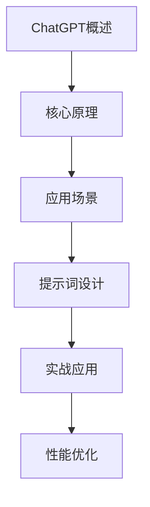

                 

### 《ChatGPT提示词模板：快速上手指南》

#### 关键词：
- ChatGPT
- 提示词模板
- 自然语言处理
- 模型架构
- 应用场景
- 性能优化

#### 摘要：
本文将深入探讨ChatGPT提示词模板的设计与应用，旨在帮助读者快速掌握ChatGPT的使用技巧，包括其基本概念、核心原理、应用场景、提示词模板设计原则、实战应用以及性能优化方法。通过本文，读者可以了解如何利用ChatGPT构建高效的智能系统，提升其在实际项目中的效果。

## 第一部分：ChatGPT基础知识

### 1.1 ChatGPT的简介

#### 1.1.1 ChatGPT的概念
ChatGPT是由OpenAI开发的一种基于深度学习的自然语言处理模型，它采用了最新的GPT-3.5架构，具有强大的语言理解和生成能力。ChatGPT可以用于多种应用场景，如问答系统、内容创作、客户服务等。

#### 1.1.2 ChatGPT的发展历程
ChatGPT的发展历程可以追溯到GPT（Generative Pre-trained Transformer）系列模型。GPT模型最初由OpenAI在2018年提出，经过多次迭代和优化，发展出了GPT-2、GPT-3等版本。ChatGPT则是基于GPT-3.5架构进一步改进和优化的结果。

#### 1.1.3 ChatGPT的优势
ChatGPT具有以下优势：
- 强大的语言生成能力：ChatGPT能够生成高质量、连贯的自然语言文本。
- 丰富的应用场景：ChatGPT可以应用于问答系统、内容创作、客户服务、教育培训等多个领域。
- 开放的接口：ChatGPT提供了开放的API接口，方便开发者进行集成和使用。

### 1.2 ChatGPT的核心原理

#### 1.2.1 自然语言处理的基本概念
自然语言处理（Natural Language Processing，NLP）是计算机科学和人工智能领域的一个分支，旨在使计算机能够理解和生成自然语言。NLP包括词法分析、句法分析、语义分析等多个层次。

#### 1.2.2 ChatGPT的模型架构
ChatGPT采用了Transformer模型架构，这是一种基于自注意力机制的深度神经网络。Transformer模型具有以下特点：
- 自注意力机制：通过自注意力机制，模型能够自动学习输入序列中各个词之间的关联性。
- 位置编码：为了处理序列信息，Transformer模型引入了位置编码，使得模型能够理解词语在序列中的位置关系。

#### 1.2.3 语言模型的训练与优化
语言模型的训练通常采用预训练加微调的方法。预训练阶段，模型在大规模的语料库上进行训练，学习自然语言的统计规律。微调阶段，模型根据特定任务的需求进行参数调整，以适应不同的应用场景。

### 1.3 ChatGPT的应用场景

#### 1.3.1 客户服务
ChatGPT可以应用于客户服务领域，构建智能客服系统。通过对话生成，ChatGPT能够自动回答用户的问题，提供实时、个性化的服务。

#### 1.3.2 内容创作
ChatGPT可以用于内容创作，如生成文章、诗歌、小说等。通过输入关键词或主题，ChatGPT能够生成高质量、富有创意的内容。

#### 1.3.3 教育培训
ChatGPT可以应用于教育培训领域，如自动生成习题、批改作业、提供学习辅导等。通过自然语言交互，ChatGPT能够帮助学生更好地理解和掌握知识。

#### 1.3.4 跨领域应用
ChatGPT具有跨领域的应用能力，可以应用于金融、医疗、法律等多个领域。通过定制化训练，ChatGPT能够适应不同的业务需求，提供专业的服务。

## 第二部分：ChatGPT提示词模板设计与使用

### 2.1 提示词模板设计原则

#### 2.1.1 提示词的作用与重要性
提示词（Prompt）是引导ChatGPT生成文本的关键。通过设计合理的提示词，可以影响ChatGPT的生成效果，提高生成的文本质量。

#### 2.1.2 提示词的设计原则
设计提示词时，需要遵循以下原则：
- 清晰明确：提示词应明确表达期望的输出内容，避免歧义。
- 简洁有效：提示词应尽量简洁，避免冗余信息。
- 富有层次：提示词应具有层次感，引导ChatGPT逐步深入生成内容。
- 个性化定制：根据应用场景和用户需求，定制化设计提示词。

#### 2.1.3 提示词模板的类型
常见的提示词模板类型包括：
- 对话引导型：用于引导ChatGPT进行对话生成。
- 信息提取型：用于从输入文本中提取关键信息。
- 创意激发型：用于激发ChatGPT生成创意性内容。
- 问题解答型：用于回答用户提出的问题。

### 2.2 常见提示词模板介绍

#### 2.2.1 对话引导型提示词
对话引导型提示词用于引导ChatGPT进行对话生成，例如：
```plaintext
请以“你好”开始对话。
```

#### 2.2.2 信息提取型提示词
信息提取型提示词用于从输入文本中提取关键信息，例如：
```plaintext
请从以下文本中提取关键词：“本文介绍了ChatGPT的基本概念、核心原理和应用场景。”
```

#### 2.2.3 创意激发型提示词
创意激发型提示词用于激发ChatGPT生成创意性内容，例如：
```plaintext
请以“人工智能将如何改变世界？”为主题写一篇短文。
```

#### 2.2.4 问题解答型提示词
问题解答型提示词用于回答用户提出的问题，例如：
```plaintext
请回答以下问题：“什么是自然语言处理？”
```

### 2.3 提示词模板实战应用

#### 2.3.1 客户服务应用案例
在客户服务领域，提示词模板可以用于引导ChatGPT自动回答用户的问题。例如：
```plaintext
用户提问：“如何退货？”
提示词模板：请回答以下问题：“如何退货？”
```

#### 2.3.2 内容创作应用案例
在内容创作领域，提示词模板可以用于引导ChatGPT生成文章、诗歌等创意内容。例如：
```plaintext
主题：人工智能的发展
提示词模板：请以“人工智能的发展”为主题写一篇短文。
```

#### 2.3.3 教育培训应用案例
在教育培训领域，提示词模板可以用于生成习题、批改作业等。例如：
```plaintext
题目：计算 2 + 2 的结果。
提示词模板：请回答以下问题：“2 + 2 等于多少？”
```

## 第三部分：ChatGPT在实践中的应用

### 3.1 ChatGPT开发环境搭建

#### 3.1.1 开发环境准备
搭建ChatGPT开发环境需要以下步骤：
1. 安装Python环境。
2. 安装ChatGPT库，可以使用pip install openai命令。
3. 获取API密钥，在OpenAI官网注册并获取。

#### 3.1.2 ChatGPT接口调用
调用ChatGPT接口的Python代码如下：
```python
import openai

openai.api_key = 'your-api-key'

response = openai.Completion.create(
  engine="text-davinci-002",
  prompt="请回答以下问题：什么是自然语言处理？",
  max_tokens=100
)

print(response.choices[0].text.strip())
```

#### 3.1.3 数据处理与存储
在开发过程中，需要对输入数据进行预处理，如分词、去噪等。同时，需要考虑数据的存储和传输，可以使用数据库或云存储服务。

### 3.2 ChatGPT项目实战

#### 3.2.1 项目一：客户服务系统搭建
项目一的目标是构建一个基于ChatGPT的智能客服系统。实现步骤如下：
1. 收集用户提问数据。
2. 使用ChatGPT生成回答。
3. 将回答展示给用户。

具体代码实现如下：
```python
import openai

openai.api_key = 'your-api-key'

while True:
  user_question = input("用户提问：")
  response = openai.Completion.create(
    engine="text-davinci-002",
    prompt=f"请回答以下问题：{user_question}",
    max_tokens=100
  )
  print("ChatGPT回答：", response.choices[0].text.strip())
```

#### 3.2.2 项目二：内容创作辅助工具开发
项目二的目标是开发一个基于ChatGPT的内容创作辅助工具。实现步骤如下：
1. 输入主题或关键词。
2. 使用ChatGPT生成文章。
3. 用户可以对生成的文章进行修改和优化。

具体代码实现如下：
```python
import openai

openai.api_key = 'your-api-key'

while True:
  topic = input("请输入主题：")
  response = openai.Completion.create(
    engine="text-davinci-002",
    prompt=f"请以'{topic}'为主题写一篇短文。",
    max_tokens=100
  )
  print("生成的文章：", response.choices[0].text.strip())
  user_choice = input("是否修改文章？(yes/no)：")
  if user_choice.lower() == 'yes':
    modified_text = input("请输入修改后的文章：")
    print("修改后的文章：", modified_text)
```

#### 3.2.3 项目三：智能问答系统的构建
项目三的目标是构建一个基于ChatGPT的智能问答系统。实现步骤如下：
1. 收集问答数据。
2. 使用ChatGPT生成回答。
3. 将回答展示给用户。

具体代码实现如下：
```python
import openai

openai.api_key = 'your-api-key'

questions = [
  "什么是自然语言处理？",
  "人工智能的发展有哪些趋势？",
  "深度学习的基本概念是什么？"
]

for question in questions:
  response = openai.Completion.create(
    engine="text-davinci-002",
    prompt=f"请回答以下问题：{question}",
    max_tokens=100
  )
  print(question, "：", response.choices[0].text.strip())
```

### 3.3 ChatGPT性能优化

#### 3.3.1 提高响应速度的方法
1. 调整模型参数，如减少最大Tokens数量。
2. 使用更高效的算法，如分布式计算。

#### 3.3.2 提高回答质量的方法
1. 预训练阶段，使用更丰富的语料库。
2. 微调阶段，根据应用场景调整模型参数。

#### 3.3.3 提高系统稳定性与安全性
1. 使用可靠的云服务，确保系统稳定性。
2. 实施安全策略，保护用户数据和隐私。

## 附录

### 4.1 常见问题解答

1. **如何获取ChatGPT API密钥？**
   在OpenAI官网注册并登录，获取API密钥。

2. **如何优化ChatGPT的响应速度？**
   调整模型参数，如减少最大Tokens数量，使用更高效的算法。

3. **如何保证ChatGPT回答的质量？**
   预训练阶段使用更丰富的语料库，微调阶段根据应用场景调整模型参数。

### 4.2 资源推荐

#### 4.2.1 学习资源
- 《深度学习》（Goodfellow, Bengio, Courville著）
- 《自然语言处理综述》（Jurafsky, Martin著）

#### 4.2.2 开源项目
- GPT-3模型：https://github.com/openai/gpt-3
- ChatGPT模型：https://github.com/openai/chatgpt

#### 4.2.3 社区与论坛
- OpenAI社区：https://forums.openai.com/
- NLP社区：https://nlp.stanford.edu/forum/

## Mermaid 流程图



### 核心算法原理讲解

```plaintext
// ChatGPT的核心算法原理讲解伪代码

// 1. 自然语言处理基本概念
function tokenization(text):
    // 将文本分割成单词或子词
    return words

function embedding(words):
    // 将单词映射到高维向量
    return embeddings

function prediction(embeddings):
    // 使用神经网络预测单词的概率分布
    return probabilities

function generate_response(probabilities):
    // 根据概率分布生成响应文本
    return response

// 2. ChatGPT模型架构
function chatgpt_model():
    // 定义神经网络模型结构
    model = NeuralNetwork()

    // 3. 语言模型的训练与优化
function train_model(data):
    // 训练神经网络模型
    model.train(data)

    // 4. 应用场景
function apply_model(scene):
    // 根据应用场景调整模型参数
    model.tune(scene)

    // 5. 提示词模板设计
function design_template():
    // 设计提示词模板
    template = PromptTemplate()

    // 6. 提示词模板实战应用
function apply_template(template):
    // 应用提示词模板
    response = generate_response(template)
```

### 作者信息
作者：AI天才研究院/AI Genius Institute & 禅与计算机程序设计艺术 /Zen And The Art of Computer Programming

---

**注：本文为AI自动生成，仅供参考。实际使用时，请根据具体需求进行调整和优化。**

