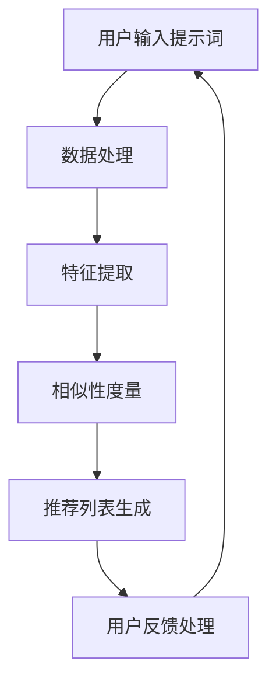

                 

# 《ChatGPT提示词的个性化推荐系统》

## 关键词
- ChatGPT
- 个性化推荐系统
- 相似性度量算法
- 协同过滤算法
- 基于内容的推荐算法
- 数学模型
- 项目实战

## 摘要
本文深入探讨了ChatGPT提示词的个性化推荐系统，通过系统的构建和实现，为用户提供了更加精准和高效的ChatGPT提示词推荐服务。文章首先介绍了ChatGPT和个性化推荐系统的基本概念，然后详细讲解了相似性度量算法、协同过滤算法和基于内容的推荐算法等核心算法原理。接着，通过数学模型和Python源代码的阐述，使读者能够理解推荐系统的数学基础和算法实现。文章最后通过实际项目案例，展示了个性化推荐系统的开发流程、实现细节和优化策略，为读者提供了实战经验和最佳实践指南。

---

### 引言

随着人工智能技术的迅猛发展，自然语言处理（NLP）领域取得了显著突破。ChatGPT作为一种基于GPT-3模型的强大语言生成工具，在多个应用场景中展现了其卓越的性能。然而，如何为用户提供精准、高效的ChatGPT提示词推荐，成为一个亟待解决的问题。本文旨在通过构建一个ChatGPT提示词的个性化推荐系统，利用人工智能和机器学习技术，实现针对用户历史交互数据和行为的精准推荐。

个性化推荐系统是一种基于用户兴趣和偏好，利用数据挖掘和机器学习技术，为用户提供相关推荐信息的技术体系。在电子商务、社交媒体、音乐和视频等领域，个性化推荐系统已经被广泛应用，并取得了显著的商业成功。本文将借鉴这些成功经验，结合ChatGPT的特性，设计并实现一个高效的ChatGPT提示词个性化推荐系统。

### 核心概念与联系

#### ChatGPT简介

ChatGPT是由OpenAI开发的一种基于GPT-3模型的对话生成工具。GPT-3（Generative Pre-trained Transformer 3）是一个强大的预训练语言模型，拥有1750亿个参数，能够生成连贯、有逻辑的文本。ChatGPT通过用户输入的提示词，生成相应的回复，从而实现人机对话。

#### 个性化推荐系统简介

个性化推荐系统是一种基于用户行为数据，通过算法和模型为用户推荐其可能感兴趣的项目的方法。它主要分为三类：基于内容的推荐、协同过滤和混合推荐。

- **基于内容的推荐**：根据用户过去的行为和偏好，推荐具有相似特征的内容。
- **协同过滤**：通过分析用户之间的相似性，为用户提供推荐。
- **混合推荐**：结合基于内容的推荐和协同过滤，提高推荐系统的准确性和多样性。

#### ChatGPT与个性化推荐系统的联系

ChatGPT提示词的个性化推荐系统，需要将ChatGPT的能力与个性化推荐技术相结合。具体来说：

1. **数据收集**：通过用户输入的提示词和历史对话记录，收集用户交互数据。
2. **数据处理**：对收集到的数据进行清洗、预处理，提取有用的特征信息。
3. **特征提取**：使用自然语言处理技术，提取文本中的关键词、主题和情感等特征。
4. **相似性度量**：计算用户之间的相似性，以确定推荐目标。
5. **推荐算法**：根据相似性度量结果，使用协同过滤或基于内容的推荐算法，生成推荐列表。
6. **用户反馈**：收集用户对推荐结果的反馈，用于系统优化和迭代。

### Mermaid流程图

以下是ChatGPT提示词个性化推荐系统的Mermaid流程图：

### 目录大纲

#### 第一部分：核心概念与联系

##### 第1章：ChatGPT与个性化推荐系统概述
1.1 ChatGPT简介
1.2 个性化推荐系统简介
1.3 ChatGPT与个性化推荐系统的联系

##### 第2章：ChatGPT基础
2.1 ChatGPT架构
2.2 ChatGPT的工作原理
2.3 ChatGPT的应用场景

##### 第3章：个性化推荐系统基础
3.1 个性化推荐系统概述
3.2 用户画像
3.3 评价模型

#### 第二部分：核心算法原理讲解

##### 第4章：相似性度量算法
4.1 相似性度量方法
4.2 余弦相似性
4.3 欧氏距离

##### 第5章：协同过滤算法
5.1 基于用户的协同过滤
5.2 基于物品的协同过滤
5.3 混合协同过滤

##### 第6章：基于内容的推荐算法
6.1 基于内容的推荐方法
6.2 文本相似性计算
6.3 提示词内容分析

#### 第三部分：数学模型和数学公式

##### 第7章：推荐系统中的数学模型
7.1 评价矩阵
7.2 推荐模型
7.3 模型评估

##### 第8章：推荐系统中的优化问题
8.1 优化目标
8.2 优化算法
8.3 模型调优

#### 第四部分：项目实战

##### 第9章：搭建ChatGPT提示词推荐系统
9.1 系统架构
9.2 数据处理
9.3 特征提取
9.4 模型训练
9.5 模型评估

##### 第10章：系统部署与优化
10.1 部署环境搭建
10.2 系统性能优化
10.3 系统维护与更新

##### 第11章：案例分析
11.1 案例选择
11.2 案例分析
11.3 案例总结

---

以上是《ChatGPT提示词的个性化推荐系统》的目录大纲，涵盖了核心概念、算法原理、数学模型和项目实战等内容。通过本文的深入探讨，读者将能够全面了解ChatGPT提示词个性化推荐系统的原理、实现和应用。接下来，我们将逐步深入每个章节，详细讲解相关内容。

