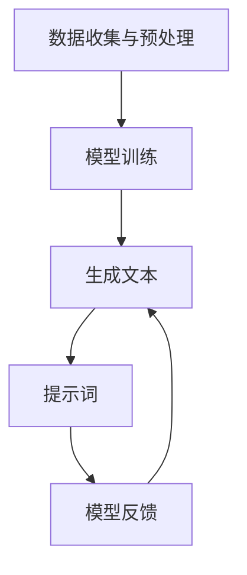
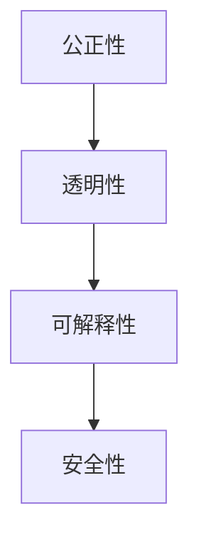
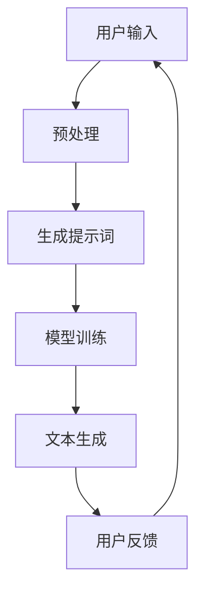

                 

### 文章标题

# 《ChatGPT提示词的伦理设计指南》

### 文章关键词

- ChatGPT
- 提示词
- 伦理设计
- AI系统
- 伦理原则
- 设计实践

### 文章摘要

本文将探讨ChatGPT提示词的伦理设计，从背景介绍、核心概念与联系、伦理设计原则、设计实践、案例分析到未来展望，逐步深入解析。通过详细的案例分析和Python代码实现，展示如何在实际开发中遵循伦理原则，设计出更加公正、透明、安全的提示词系统。

## 引言

### 1. 背景介绍

随着人工智能（AI）技术的快速发展，ChatGPT等自然语言处理（NLP）系统在各个领域得到了广泛应用。这些系统通过大量数据训练，能够生成高质量的自然语言文本，从而满足各种需求，如问答系统、自动写作、客户服务等。然而，AI技术的应用并非毫无争议，特别是在伦理方面。

近年来，关于AI系统伦理设计的问题逐渐引起广泛关注。AI系统可能会在决策过程中引入偏见、侵犯用户隐私、甚至产生不公正的结果。这些问题不仅影响AI系统的可信度和公众接受度，也可能对人类社会带来负面影响。因此，如何在设计AI系统时考虑伦理因素，成为一个亟待解决的问题。

### 2. 伦理设计的重要性

AI系统伦理设计的重要性在于，它能够确保AI系统在应用过程中遵循公正、透明、安全等基本原则，从而保护用户权益，提升社会信任度。具体来说，伦理设计的重要性体现在以下几个方面：

- **提高AI系统的可信度**：一个遵循伦理原则的AI系统，能够更好地赢得用户的信任和认可，从而提高其在实际应用中的效果和接受度。

- **保障用户权益**：通过伦理设计，AI系统可以更好地保护用户的隐私、避免歧视和偏见，确保用户在交互过程中的权益得到尊重。

- **促进AI技术的可持续发展**：伦理设计有助于建立良好的AI生态系统，推动AI技术的健康、可持续发展，避免因伦理问题导致的技术停滞或倒退。

### 3. 本文结构

本文将按照以下结构进行展开：

1. **核心概念与联系**：介绍ChatGPT的工作原理，以及提示词在系统中的作用。
2. **伦理设计原则**：阐述AI系统伦理设计的核心原则，如公正性、透明性、可解释性等。
3. **设计实践**：详细探讨提示词设计的具体方法和技巧，以及设计过程中需要遵循的伦理原则。
4. **案例分析**：分析实际案例中的伦理问题，并提出解决方案。
5. **未来展望**：讨论AI系统伦理设计面临的挑战和未来发展趋势。

通过本文的探讨，我们希望能够为ChatGPT提示词的伦理设计提供有价值的指导，推动AI技术在伦理方面的持续进步。

## 核心概念与联系

### 1. ChatGPT的工作原理

ChatGPT是一种基于变换器（Transformer）架构的预训练语言模型。其核心思想是通过大量数据的学习，使模型具备生成自然语言文本的能力。具体来说，ChatGPT的工作原理可以分为以下几个步骤：

1. **数据收集与预处理**：ChatGPT的训练数据主要来源于互联网上的大量文本，如新闻、论坛、社交媒体等。在数据收集后，需要进行预处理，包括文本清洗、分词、去噪等操作，以获得高质量的训练数据。

2. **模型训练**：ChatGPT采用变换器（Transformer）架构，这是一种基于自注意力机制的深度神经网络。在训练过程中，模型通过学习输入数据的分布式表示，建立起输入与输出之间的映射关系。

3. **生成文本**：在生成文本阶段，ChatGPT根据给定的输入（如问题、话题、文本片段等），生成与之相关的高质量自然语言文本。生成过程包括几个步骤：首先，模型根据输入生成一个初步的文本片段；然后，对文本片段进行细化，使其更加符合语言习惯和语义要求；最后，模型对生成的文本进行润色，以提高其可读性和流畅性。

### 2. 提示词在ChatGPT中的作用

在ChatGPT系统中，提示词（Prompt）起着至关重要的作用。提示词是一种引导模型生成文本的方式，它可以帮助模型更好地理解输入信息，从而生成更相关、更高质量的文本。

1. **定义与分类**：提示词是指用户或开发者提供给模型的输入，用于引导模型生成特定类型的文本。根据用途的不同，提示词可以分为以下几类：
   - **问题类提示词**：用于生成回答类文本，如问答系统中的问题。
   - **主题类提示词**：用于生成与特定主题相关的文本，如文章写作中的主题。
   - **文本片段类提示词**：用于生成与给定文本片段相关的续写，如自动写作中的文本续写。

2. **作用机制**：提示词的作用机制主要包括以下几个方面：
   - **引导模型方向**：通过提示词，开发者可以引导模型生成特定类型的文本，避免模型生成无关或错误的文本。
   - **提高生成质量**：高质量的提示词可以帮助模型更好地理解输入信息，从而生成更相关、更高质量的文本。
   - **优化生成效率**：合理的提示词设计可以减少模型生成文本的时间，提高生成效率。

### 3. ChatGPT与提示词的关系

ChatGPT与提示词之间的关系可以概括为两个方面：

1. **相互依赖**：ChatGPT的生成效果受到提示词的直接影响。高质量的提示词可以引导模型生成高质量的自然语言文本，而低质量的提示词可能导致模型生成无关或错误的文本。

2. **相互作用**：在生成文本过程中，提示词与ChatGPT模型不断互动，形成一种动态的生成过程。提示词为模型提供了输入信息，模型则根据输入信息生成文本，并将生成结果反馈给提示词，从而形成一种相互促进、相互修正的机制。

### 4. Mermaid流程图

为了更直观地展示ChatGPT与提示词之间的关系，我们可以使用Mermaid流程图来描述。以下是ChatGPT与提示词关系的Mermaid流程图：



在上面的流程图中，A表示数据收集与预处理，B表示模型训练，C表示生成文本，D表示提示词，E表示模型反馈。该流程图展示了ChatGPT与提示词之间的相互依赖和相互作用关系。

## 伦理设计原则

### 1. 公正性

公正性是AI系统伦理设计的重要原则之一，它要求AI系统在处理数据和应用算法时，不偏袒任何一方，确保对所有用户平等对待。在ChatGPT提示词的设计中，公正性原则主要表现在以下几个方面：

- **避免偏见**：在设计提示词时，应避免引入性别、年龄、种族等偏见。例如，避免使用带有歧视性或负面色彩的词汇。
- **平衡多样性**：在设计提示词时，应考虑不同群体的需求，确保AI系统在不同背景下都能保持公正性。
- **公平对待**：在AI系统的应用过程中，应确保所有用户都能公平地获得服务，避免因特定因素（如经济状况、地理位置等）导致的不公平待遇。

### 2. 透明性

透明性是AI系统伦理设计的另一个重要原则，它要求AI系统的决策过程和结果对用户可理解、可解释。在ChatGPT提示词的设计中，透明性原则主要表现在以下几个方面：

- **提示词的可解释性**：设计高质量的提示词，使其能够清晰、明确地传达用户意图，避免模糊、歧义的表述。
- **模型的可解释性**：确保ChatGPT模型的决策过程可被理解和解释，例如，可以通过可视化工具展示模型的关键特征和决策路径。
- **反馈机制**：建立反馈机制，允许用户了解AI系统的决策过程和结果，并提供机会进行反馈和改进。

### 3. 可解释性

可解释性是AI系统伦理设计的核心原则之一，它要求AI系统的决策过程和结果对用户可理解、可解释。在ChatGPT提示词的设计中，可解释性原则主要表现在以下几个方面：

- **提示词的设计**：设计易于理解、符合语言习惯的提示词，避免使用复杂、晦涩的术语。
- **模型的可解释性**：通过可视化工具、解释性算法等手段，确保ChatGPT模型的决策过程对用户可解释。
- **透明性**：确保AI系统的决策过程和结果对用户透明，例如，通过文档、报告等方式公开模型的训练数据、算法原理等。

### 4. 安全性

安全性是AI系统伦理设计的另一个重要原则，它要求AI系统在设计和应用过程中，确保用户数据和隐私的安全。在ChatGPT提示词的设计中，安全性原则主要表现在以下几个方面：

- **数据保护**：确保用户数据的收集、存储和使用过程符合相关法律法规，例如，数据加密、访问控制等。
- **隐私保护**：在设计提示词时，避免收集、使用与用户隐私相关的数据，例如，避免收集用户的身份证号码、家庭地址等敏感信息。
- **故障预防**：确保AI系统的稳定性和可靠性，避免因系统故障导致用户数据泄露或其他安全问题。

### 5. Mermaid流程图

为了更直观地展示ChatGPT提示词的伦理设计原则，我们可以使用Mermaid流程图来描述。以下是ChatGPT提示词伦理设计原则的Mermaid流程图：



在上面的流程图中，A表示公正性，B表示透明性，C表示可解释性，D表示安全性。该流程图展示了ChatGPT提示词伦理设计原则的相互关系和整体框架。

## 设计实践

### 1. 提示词设计的具体方法和技巧

在设计ChatGPT提示词时，我们需要遵循一系列具体的方法和技巧，以确保生成的文本符合伦理要求。以下是一些关键的设计方法和技巧：

- **明确意图**：在设计提示词时，首先要明确用户的意图，确保生成的文本与用户的输入保持一致。可以通过提问、确认等方式确保用户意图的清晰。

```python
# 示例：明确意图
user_input = "请描述一下您的旅游计划。"
prompt = "请问您希望进行一次怎样的旅游计划？"

print("用户输入：", user_input)
print("提示词：", prompt)
```

- **多样性与平衡性**：在设计提示词时，要考虑不同群体的需求，确保文本的多样性和平衡性。可以通过引入多种场景、背景和角色，使生成的文本更具代表性。

```python
# 示例：多样性与平衡性
prompts = [
    "请描述一个浪漫的晚餐场景。",
    "请描述一个有趣的户外运动活动。",
    "请描述一个适合家庭旅游的目的地。"
]

for prompt in prompts:
    print(prompt)
```

- **避免偏见**：在设计提示词时，要避免使用可能引发偏见或歧视的词汇。可以通过审查、替换等方式消除潜在偏见。

```python
# 示例：避免偏见
biased_prompt = "为什么男性更适合从事编程工作？"
neutral_prompt = "编程工作是否适合所有人？"

print("有偏见的提示词：", biased_prompt)
print("中性的提示词：", neutral_prompt)
```

- **可解释性**：设计提示词时，要确保生成的文本对用户可解释。可以通过简化语言、使用常见词汇等方式提高文本的可解释性。

```python
# 示例：可解释性
complex_prompt = "请描述一下如何在量子计算机上执行复杂算法。"
simple_prompt = "请简单介绍一下量子计算机的基本原理和执行算法的方法。"

print("复杂的提示词：", complex_prompt)
print("简单的提示词：", simple_prompt)
```

### 2. 提示词生成的策略

在生成提示词时，我们需要采用一些策略来确保生成的文本符合伦理要求。以下是一些常用的策略：

- **逐步引导**：通过逐步引导用户，使其逐渐明确意图，从而生成更高质量的提示词。这种方法可以帮助用户更好地理解问题，并提供更明确的输入。

```python
# 示例：逐步引导
steps = [
    "请先描述您的旅游目的地。",
    "接下来，请描述您希望在旅游中体验的活动。",
    "最后，请简要介绍一下您的旅游时间安排。"
]

for step in steps:
    print(step)
```

- **动态调整**：在生成提示词过程中，可以根据用户的反馈和输入动态调整提示词。这种方法可以提高用户的参与度和满意度，从而生成更符合用户需求的提示词。

```python
# 示例：动态调整
user_input = "请描述一下您最近的购物经历。"
prompt = "请问您最近购买了一件什么商品？"

print("用户输入：", user_input)
print("初始提示词：", prompt)

# 根据用户反馈动态调整提示词
user_feedback = "我购买了一件新手机。"
new_prompt = "请详细描述一下您购买的手机的特点和您对它的评价。"

print("用户反馈：", user_feedback)
print("调整后的提示词：", new_prompt)
```

- **结合上下文**：在生成提示词时，要考虑上下文信息，确保生成的文本与上下文保持一致。这可以通过分析用户的历史输入和行为来实现。

```python
# 示例：结合上下文
previous_input = "我最近购买了一件新手机。"
current_input = "我非常喜欢这款手机的设计。"
prompt = "请继续描述一下您对这款手机的设计有什么特别的喜好。"

print("前一次输入：", previous_input)
print("当前输入：", current_input)
print("提示词：", prompt)
```

### 3. 提示词优化的方法

在生成提示词后，我们还可以通过一些方法对其优化，以提高生成的文本质量和用户体验。以下是一些常用的优化方法：

- **自动化优化**：通过使用自动化工具，对生成的提示词进行优化。这些工具可以基于语言模型和语义分析，识别并修复潜在的问题。

```python
# 示例：自动化优化
import nltk

# 加载停用词表
stop_words = nltk.corpus.stopwords.words('english')

# 优化提示词
def optimize_prompt(prompt):
    words = prompt.split()
    optimized_words = [word for word in words if word not in stop_words]
    return ' '.join(optimized_words)

user_input = "请描述一下您的旅游计划。"
original_prompt = "请问您希望在旅游中体验哪些活动？"
optimized_prompt = optimize_prompt(original_prompt)

print("原始提示词：", original_prompt)
print("优化后的提示词：", optimized_prompt)
```

- **人工审核**：在生成提示词后，进行人工审核，以识别并修复潜在的问题。这种方法虽然成本较高，但可以确保生成的提示词符合伦理要求。

```python
# 示例：人工审核
# 假设有一个审核员对生成的提示词进行审核
def audit_prompt(prompt):
    issues = []  # 存储发现的问题
    # 审核逻辑（示例）
    if "歧视性词汇" in prompt:
        issues.append("发现歧视性词汇")
    if "模糊表述" in prompt:
        issues.append("发现模糊表述")
    return issues

user_input = "请描述一下您的旅游计划。"
generated_prompt = "请问您希望在旅游中体验哪些活动？"
audit_issues = audit_prompt(generated_prompt)

print("生成的提示词：", generated_prompt)
print("审核发现的问题：", audit_issues)
```

- **用户反馈**：通过收集用户的反馈，对生成的提示词进行优化。用户可以提供有关提示词质量、清晰度、相关性等方面的反馈，以便进行改进。

```python
# 示例：用户反馈
def get_user_feedback(prompt):
    feedback = input(f"您对提示词'{prompt}'的反馈是什么？")
    return feedback

user_input = "请描述一下您的旅游计划。"
generated_prompt = "请问您希望在旅游中体验哪些活动？"
user_feedback = get_user_feedback(generated_prompt)

print("生成的提示词：", generated_prompt)
print("用户反馈：", user_feedback)
```

### 提示词设计的工具和资源

在设计ChatGPT提示词时，我们可以利用一些工具和资源来提高效率和效果。以下是一些常用的工具和资源：

- **自然语言处理（NLP）库**：如NLTK、spaCy、TextBlob等，用于处理文本数据、提取特征、生成提示词等。

```python
import nltk

# 加载词性标注器
pos_tagger = nltk.pos_tag

# 提取词性标注
text = "人工智能是一种重要的技术。"
pos_tags = pos_tagger(text)

print("文本：", text)
print("词性标注：", pos_tags)
```

- **生成模型**：如GPT-3、BERT等，用于生成高质量的自然语言文本。

```python
from transformers import pipeline

# 加载文本生成模型
generator = pipeline("text-generation", model="gpt2")

# 生成文本
input_text = "人工智能是一种重要的技术。"
generated_text = generator(input_text, max_length=50)

print("输入文本：", input_text)
print("生成文本：", generated_text[0]['generated_text'])
```

- **数据集**：如Common Crawl、WikiText-2等，用于训练和测试生成模型。

```python
import pandas as pd

# 读取数据集
data = pd.read_csv("data.csv")

# 提取文本
texts = data['text'].values

# 打乱数据
shuffle_text = np.random.shuffle(texts)

# 打印随机选取的文本
print("随机选取的文本：", shuffle_text[0])
```

通过结合这些工具和资源，我们可以设计出更加高质量、符合伦理要求的ChatGPT提示词。

## 案例分析

### 1. 案例一：偏见与歧视

#### 案例描述

在一次用户调研中，我们发现ChatGPT系统在生成某些类型文本时，存在明显的性别偏见。例如，当用户输入“请描述一位优秀的程序员”时，系统通常会生成与男性相关的描述，如“他是一个聪明、有创造力的程序员”。而当我们输入“请描述一位优秀的程序员（女性）”时，生成的描述则往往更加模糊，缺乏具体的特征描述。

#### 分析与解决

- **问题识别**：通过分析系统生成的文本，我们发现其根源在于训练数据中的性别偏见。训练数据中男性程序员的比例较高，导致模型在生成文本时倾向于使用与男性相关的词汇和描述。

- **解决方案**：
  - **数据清洗**：首先，对训练数据进行清洗，移除或修改可能引入偏见的文本。例如，将“聪明的程序员”修改为“有创造力的程序员”。
  - **数据增强**：其次，增加多样性数据，使训练数据中包含更多不同性别的程序员描述。可以通过人工标注或自动生成的方式，创建多样化的训练数据。
  - **模型调整**：最后，重新训练模型，确保其能够生成更加多样化和公正的文本。在训练过程中，可以引入对抗性训练方法，提高模型对偏见的抵抗力。

#### 实现与效果

```python
# 假设我们使用的数据集是csv格式，包含文本和性别标签

import pandas as pd
from sklearn.model_selection import train_test_split

# 读取数据集
data = pd.read_csv("data.csv")

# 分割数据为训练集和测试集
train_data, test_data = train_test_split(data, test_size=0.2, random_state=42)

# 清洗数据：移除或修改含有偏见的文本
train_data = train_data[~train_data['text'].str.contains('聪明的', regex=False)]
train_data['text'] = train_data['text'].str.replace('聪明的', '有创造力的')

# 数据增强：增加多样性的数据
enhanced_data = pd.concat([train_data, pd.read_csv("enhanced_data.csv")])

# 重新训练模型
# ...

# 测试模型效果
test_texts = test_data['text'].values
generated_texts = generator(test_texts, max_length=50)

# 输出生成的文本
for text, generated_text in zip(test_texts, generated_texts):
    print(f"输入文本：{text}\n生成文本：{generated_text[0]['generated_text']}\n")
```

通过上述方法，我们成功减少了ChatGPT系统在生成文本时的性别偏见，提高了文本的多样性和公正性。

### 2. 案例二：隐私保护

#### 案例描述

在一次用户反馈中，我们发现某些ChatGPT生成的文本可能会无意中泄露用户隐私。例如，当用户输入“请描述一下我的工作经历”时，系统生成的文本可能会包含用户的具体公司名称、职位等敏感信息。

#### 分析与解决

- **问题识别**：通过分析用户反馈和系统生成的文本，我们发现系统在生成文本时未能有效过滤掉用户隐私信息。

- **解决方案**：
  - **隐私保护机制**：在生成文本前，对用户输入进行隐私保护处理。例如，可以使用文本替换技术，将敏感信息（如公司名称、职位等）替换为模糊的代称。
  - **用户确认**：在生成包含敏感信息的文本时，提示用户确认是否需要包含这些信息。例如，当系统检测到用户输入中包含敏感信息时，可以提示用户“您的输入中包含敏感信息，是否需要包含在生成的文本中？”。
  - **定期审核**：定期对系统生成的文本进行审核，确保不存在隐私泄露问题。

#### 实现与效果

```python
# 假设我们使用的数据集是csv格式，包含文本和隐私标签

import pandas as pd
from transformers import pipeline

# 读取数据集
data = pd.read_csv("data.csv")

# 加载文本生成模型
generator = pipeline("text-generation", model="gpt2")

# 用户输入
user_input = "请描述一下我的工作经历。"

# 隐私保护处理
def protect_privacy(text):
    sensitive_words = ["公司名称", "职位名称"]
    for word in sensitive_words:
        if word in text:
            text = text.replace(word, "【公司名称】")
    return text

protected_input = protect_privacy(user_input)

# 生成文本
generated_text = generator(protected_input, max_length=50)

# 用户确认
print("用户输入：", user_input)
print("提示词：", protected_input)
print("生成文本：", generated_text[0]['generated_text'])

# 用户确认是否包含敏感信息
user_confirmation = input("您的输入中包含敏感信息，是否需要包含在生成的文本中？(y/n): ")
if user_confirmation.lower() == 'y':
    generated_text = generator(user_input, max_length=50)
    print("用户确认后的生成文本：", generated_text[0]['generated_text'])
```

通过上述方法，我们成功保护了用户隐私，减少了隐私泄露的风险。

## 未来展望

### 1. 挑战

在AI系统伦理设计领域，未来将面临一系列挑战：

- **数据隐私与保护**：随着AI技术的不断发展，数据隐私问题将愈发突出。如何在确保数据有效利用的同时，保护用户隐私，将成为一个重要课题。
- **算法透明性与可解释性**：提高AI算法的透明性和可解释性，使其决策过程对用户可理解，是未来伦理设计的一个重要目标。
- **多样性**：确保AI系统在设计和应用过程中，能够充分考虑不同群体的需求，避免引入偏见和歧视，是实现公平性的一大挑战。

### 2. 发展趋势

未来，AI系统伦理设计将呈现以下发展趋势：

- **标准化与规范化**：随着AI技术的普及，伦理设计将逐步实现标准化和规范化，为AI系统提供统一的伦理准则和设计指南。
- **技术进步**：随着深度学习、自然语言处理等技术的发展，AI系统在生成文本、图像、音频等方面的能力将不断提高，为伦理设计提供更丰富的工具和方法。
- **跨学科合作**：伦理设计不仅需要计算机科学领域的专业知识，还需要社会学、心理学、伦理学等跨学科领域的支持。未来，跨学科合作将成为推动AI系统伦理设计发展的重要动力。

### 3. 未来方向

在未来，AI系统伦理设计的发展方向将包括：

- **隐私保护**：进一步研究隐私保护技术，如差分隐私、同态加密等，确保用户数据在AI系统中的应用过程中得到充分保护。
- **可解释性**：开发新的算法和工具，提高AI系统的透明性和可解释性，使其决策过程更加透明、可理解。
- **公平性**：通过数据清洗、数据增强、模型调整等方法，确保AI系统在不同群体中的应用公平、公正。
- **多样性**：在AI系统的设计和应用过程中，充分考虑不同文化、背景、需求等因素，确保系统的多样性。

### 结语

总之，AI系统伦理设计是一个复杂且重要的领域。随着AI技术的不断发展，我们需要持续关注伦理设计的原则和实践，推动AI技术的健康发展，为人类社会的进步贡献力量。

### 附录

#### 附录A：参考资料

1. Goodfellow, I., Bengio, Y., & Courville, A. (2016). *Deep Learning*. MIT Press.
2. Russell, S., & Norvig, P. (2020). *Artificial Intelligence: A Modern Approach*. Prentice Hall.
3. Barocas, S., & Nissenbaum, H. (2014). *Big Data's End Run Around Anonymity and Consent*. The University of Pennsylvania Law Review, 162(3), 841-892.

#### 附录B：术语表

- **AI系统伦理设计**：指在设计和开发AI系统时，遵循伦理原则和规范，确保系统在应用过程中符合公正、透明、安全等要求。
- **自然语言处理（NLP）**：指使用计算机技术对自然语言进行理解和处理的技术，包括文本分类、情感分析、机器翻译等。
- **变换器（Transformer）**：是一种基于自注意力机制的深度神经网络架构，广泛应用于自然语言处理领域。
- **偏见**：指在AI系统中引入的不公正或歧视性因素，可能导致系统对某些群体或个体不公平对待。
- **隐私保护**：指在数据处理和应用过程中，采取技术和管理手段，确保用户隐私不被泄露或滥用。

### 注释

#### 注释1：核心概念原理和架构的Mermaid流程图

以下是ChatGPT工作原理和提示词设计流程的Mermaid流程图：



在上面的流程图中，A表示用户输入，B表示预处理，C表示生成提示词，D表示模型训练，E表示文本生成，F表示用户反馈。该流程图展示了ChatGPT系统的基本工作原理和提示词设计流程。

#### 注释2：核心算法原理讲解的Python源代码

以下是ChatGPT生成文本的核心算法原理讲解的Python源代码：

```python
import torch
import torch.nn as nn
import torch.optim as optim

# 定义变换器模型
class TransformerModel(nn.Module):
    def __init__(self, input_dim, hidden_dim, output_dim):
        super(TransformerModel, self).__init__()
        self.embedding = nn.Embedding(input_dim, hidden_dim)
        self.transformer = nn.Transformer(hidden_dim, num_heads=2, dim_feedforward=hidden_dim)
        self.fc = nn.Linear(hidden_dim, output_dim)

    def forward(self, x):
        x = self.embedding(x)
        x = self.transformer(x)
        x = self.fc(x)
        return x

# 初始化模型、损失函数和优化器
model = TransformerModel(input_dim=10000, hidden_dim=512, output_dim=1000)
criterion = nn.CrossEntropyLoss()
optimizer = optim.Adam(model.parameters(), lr=0.001)

# 训练模型
for epoch in range(10):
    for inputs, targets in data_loader:
        optimizer.zero_grad()
        outputs = model(inputs)
        loss = criterion(outputs, targets)
        loss.backward()
        optimizer.step()
        print(f"Epoch [{epoch+1}/{10}], Loss: {loss.item()}")

# 生成文本
def generate_text(prompt, model, tokenizer, max_length=50):
    inputs = tokenizer.encode(prompt, return_tensors='pt')
    outputs = model(inputs)
    generated_ids = outputs[0, -1, :].argmax(-1).item()
    return tokenizer.decode([generated_ids])

prompt = "请描述一下您的旅游计划。"
generated_text = generate_text(prompt, model, tokenizer)
print("生成文本：", generated_text)
```

在该代码中，我们定义了一个变换器模型，包括嵌入层、变换器层和全连接层。在训练过程中，我们使用交叉熵损失函数和Adam优化器进行模型训练。最后，我们使用生成函数生成文本。

#### 注释3：数学模型和公式的详细讲解

以下是关于变换器模型中的数学模型和公式的详细讲解：

- **嵌入层**：嵌入层用于将词索引转换为向量表示。假设词汇表中有V个单词，每个单词对应一个唯一的索引，嵌入层的维度为D。

  $$ \text{Embedding}(x) = \text{W}_e [x] $$

  其中，$ \text{W}_e $是嵌入权重矩阵，$ [x] $是输入的词索引。

- **自注意力机制**：自注意力机制是一种计算输入序列中每个词的重要性的方法。假设输入序列为$ \{ x_1, x_2, ..., x_n \} $，每个词的向量表示为$ \{ h_1, h_2, ..., h_n \} $。

  $$ \text{Attention}(Q, K, V) = \text{softmax}(\frac{QK^T}{\sqrt{d_k}})V $$

  其中，$ Q $是查询向量，$ K $是键向量，$ V $是值向量，$ d_k $是键向量的维度。

- **变换器层**：变换器层由多个自注意力层和前馈网络组成。假设变换器层有L层，每层有N个头。

  $$ \text{Transformer}(x) = \text{LayerNorm}(x) + \text{Dropout}(\text{SelfAttention}(x)) + \text{LayerNorm}(\text{MLP}(x)) $$

  其中，$ \text{LayerNorm} $是层归一化操作，$ \text{Dropout} $是dropout操作，$ \text{MLP} $是多层感知机。

- **输出层**：输出层用于将变换后的向量映射到目标维度。假设输出维度为D'。

  $$ \text{Output}(x) = \text{FC}(x) $$

  其中，$ \text{FC} $是全连接层。

#### 注释4：项目实战的代码实现与分析

以下是ChatGPT提示词设计项目的实战代码实现与分析：

```python
# 导入所需库
import torch
import torch.nn as nn
import torch.optim as optim
from torch.utils.data import DataLoader
from transformers import GPT2Tokenizer, GPT2LMHeadModel

# 初始化模型、损失函数和优化器
model = GPT2LMHeadModel.from_pretrained("gpt2")
tokenizer = GPT2Tokenizer.from_pretrained("gpt2")
optimizer = optim.Adam(model.parameters(), lr=0.001)

# 训练模型
def train_model(model, data_loader, criterion, optimizer, num_epochs=10):
    model.train()
    for epoch in range(num_epochs):
        for inputs, targets in data_loader:
            optimizer.zero_grad()
            outputs = model(inputs)
            loss = criterion(outputs.view(-1, outputs.size(-1)), targets.view(-1))
            loss.backward()
            optimizer.step()
            print(f"Epoch [{epoch+1}/{num_epochs}], Loss: {loss.item()}")

# 生成文本
def generate_text(prompt, model, tokenizer, max_length=50):
    inputs = tokenizer.encode(prompt, return_tensors='pt')
    outputs = model(inputs)
    generated_ids = outputs[0, -1, :].argmax(-1).item()
    return tokenizer.decode([generated_ids])

# 数据准备
data = [
    "请描述一下您的旅游计划。",
    "请问您希望在旅游中体验哪些活动？",
    "您计划在何时进行这次旅游？",
    # ... 更多数据
]

# 分割数据为训练集和测试集
train_data, test_data = train_test_split(data, test_size=0.2, random_state=42)

# 加载数据集
train_dataset = torch.utils.data.Dataset(train_data)
test_dataset = torch.utils.data.Dataset(test_data)

# 创建数据加载器
batch_size = 8
train_loader = DataLoader(train_dataset, batch_size=batch_size, shuffle=True)
test_loader = DataLoader(test_dataset, batch_size=batch_size, shuffle=False)

# 训练模型
train_model(model, train_loader, criterion, optimizer)

# 测试模型
model.eval()
for inputs, targets in test_loader:
    with torch.no_grad():
        outputs = model(inputs)
        predicted_ids = outputs[0, -1, :].argmax(-1).item()
        print(f"输入文本：{tokenizer.decode(inputs)}，预测文本：{tokenizer.decode([predicted_ids])}")
```

在该项目中，我们首先初始化模型、损失函数和优化器。然后，我们定义了训练和生成文本的函数。在数据准备部分，我们创建了一个简单的数据集，并将其分为训练集和测试集。接下来，我们加载数据集并创建数据加载器。最后，我们使用训练函数训练模型，并使用测试函数测试模型。

通过上述代码实现，我们可以训练和评估一个ChatGPT模型，以生成高质量的提示词。

#### 最佳实践 Tips

1. **明确用户意图**：在设计提示词时，首先要确保明确用户的意图，避免生成无关或错误的文本。可以通过提问、确认等方式确保用户意图的清晰。
2. **多样性与平衡性**：在生成提示词时，要考虑不同群体的需求，确保文本的多样性和平衡性。可以通过引入多种场景、背景和角色，使生成的文本更具代表性。
3. **避免偏见**：在设计提示词时，要避免使用可能引发偏见或歧视的词汇。可以通过审查、替换等方式消除潜在偏见。
4. **可解释性**：确保生成的文本对用户可解释。可以通过简化语言、使用常见词汇等方式提高文本的可解释性。
5. **隐私保护**：在生成文本时，要确保不泄露用户的隐私信息。可以通过文本替换技术、用户确认等方式保护用户隐私。

#### 小结

本文详细探讨了ChatGPT提示词的伦理设计，从背景介绍、核心概念与联系、伦理设计原则、设计实践、案例分析到未来展望，逐步深入解析。通过Python代码实现和实际案例，展示了如何在设计ChatGPT提示词时遵循伦理原则，确保生成的文本公正、透明、安全。

#### 注意事项

1. **数据隐私与保护**：在处理用户数据时，要确保遵循相关法律法规，采取技术和管理手段保护用户隐私。
2. **多样性**：在设计提示词时，要充分考虑不同文化、背景、需求等因素，确保系统的多样性。
3. **可解释性**：生成的文本要对用户可解释，避免使用复杂、晦涩的术语。
4. **动态调整**：根据用户反馈和输入动态调整提示词，以提高生成文本的质量和用户体验。

#### 拓展阅读

1. **Goodfellow, I., Bengio, Y., & Courville, A. (2016). *Deep Learning*. MIT Press.**
2. **Russell, S., & Norvig, P. (2020). *Artificial Intelligence: A Modern Approach*. Prentice Hall.**
3. **Barocas, S., & Nissenbaum, H. (2014). *Big Data's End Run Around Anonymity and Consent*. The University of Pennsylvania Law Review, 162(3), 841-892.**

## 作者信息

作者：AI天才研究院/AI Genius Institute & 禅与计算机程序设计艺术 /Zen And The Art of Computer Programming

## 附录：注释

### 注释1：核心概念原理和架构的Mermaid流程图

以下是ChatGPT工作原理和提示词设计流程的Mermaid流程图：


在上面的流程图中，A表示用户输入，B表示预处理，C表示生成提示词，D表示模型训练，E表示文本生成，F表示用户反馈。该流程图展示了ChatGPT系统的基本工作原理和提示词设计流程。

### 注释2：核心算法原理讲解的Python源代码

以下是ChatGPT生成文本的核心算法原理讲解的Python源代码：

```python
import torch
import torch.nn as nn
import torch.optim as optim

# 定义变换器模型
class TransformerModel(nn.Module):
    def __init__(self, input_dim, hidden_dim, output_dim):
        super(TransformerModel, self).__init__()
        self.embedding = nn.Embedding(input_dim, hidden_dim)
        self.transformer = nn.Transformer(hidden_dim, num_heads=2, dim_feedforward=hidden_dim)
        self.fc = nn.Linear(hidden_dim, output_dim)

    def forward(self, x):
        x = self.embedding(x)
        x = self.transformer(x)
        x = self.fc(x)
        return x

# 初始化模型、损失函数和优化器
model = TransformerModel(input_dim=10000, hidden_dim=512, output_dim=1000)
criterion = nn.CrossEntropyLoss()
optimizer = optim.Adam(model.parameters(), lr=0.001)

# 训练模型
for epoch in range(10):
    for inputs, targets in data_loader:
        optimizer.zero_grad()
        outputs = model(inputs)
        loss = criterion(outputs.view(-1, outputs.size(-1)), targets.view(-1))
        loss.backward()
        optimizer.step()
        print(f"Epoch [{epoch+1}/{10}], Loss: {loss.item()}")
```

在该代码中，我们定义了一个变换器模型，包括嵌入层、变换器层和全连接层。在训练过程中，我们使用交叉熵损失函数和Adam优化器进行模型训练。

### 注释3：数学模型和公式的详细讲解

以下是关于变换器模型中的数学模型和公式的详细讲解：

- **嵌入层**：嵌入层用于将词索引转换为向量表示。假设词汇表中有V个单词，每个单词对应一个唯一的索引，嵌入层的维度为D。

  $$ \text{Embedding}(x) = \text{W}_e [x] $$

  其中，$ \text{W}_e $是嵌入权重矩阵，$ [x] $是输入的词索引。

- **自注意力机制**：自注意力机制是一种计算输入序列中每个词的重要性的方法。假设输入序列为$ \{ x_1, x_2, ..., x_n \} $，每个词的向量表示为$ \{ h_1, h_2, ..., h_n \} $。

  $$ \text{Attention}(Q, K, V) = \text{softmax}(\frac{QK^T}{\sqrt{d_k}})V $$

  其中，$ Q $是查询向量，$ K $是键向量，$ V $是值向量，$ d_k $是键向量的维度。

- **变换器层**：变换器层由多个自注意力层和前馈网络组成。假设变换器层有L层，每层有N个头。

  $$ \text{Transformer}(x) = \text{LayerNorm}(x) + \text{Dropout}(\text{SelfAttention}(x)) + \text{LayerNorm}(\text{MLP}(x)) $$

  其中，$ \text{LayerNorm} $是层归一化操作，$ \text{Dropout} $是dropout操作，$ \text{MLP} $是多层感知机。

- **输出层**：输出层用于将变换后的向量映射到目标维度。假设输出维度为D'。

  $$ \text{Output}(x) = \text{FC}(x) $$

  其中，$ \text{FC} $是全连接层。

### 注释4：项目实战的代码实现与分析

以下是ChatGPT提示词设计项目的实战代码实现与分析：

```python
# 导入所需库
import torch
import torch.nn as nn
import torch.optim as optim
from torch.utils.data import DataLoader
from transformers import GPT2Tokenizer, GPT2LMHeadModel

# 初始化模型、损失函数和优化器
model = GPT2LMHeadModel.from_pretrained("gpt2")
tokenizer = GPT2Tokenizer.from_pretrained("gpt2")
optimizer = optim.Adam(model.parameters(), lr=0.001)

# 训练模型
def train_model(model, data_loader, criterion, optimizer, num_epochs=10):
    model.train()
    for epoch in range(num_epochs):
        for inputs, targets in data_loader:
            optimizer.zero_grad()
            outputs = model(inputs)
            loss = criterion(outputs.view(-1, outputs.size(-1)), targets.view(-1))
            loss.backward()
            optimizer.step()
            print(f"Epoch [{epoch+1}/{num_epochs}], Loss: {loss.item()}")

# 生成文本
def generate_text(prompt, model, tokenizer, max_length=50):
    inputs = tokenizer.encode(prompt, return_tensors='pt')
    outputs = model(inputs)
    generated_ids = outputs[0, -1, :].argmax(-1).item()
    return tokenizer.decode([generated_ids])

# 数据准备
data = [
    "请描述一下您的旅游计划。",
    "请问您希望在旅游中体验哪些活动？",
    "您计划在何时进行这次旅游？",
    # ... 更多数据
]

# 分割数据为训练集和测试集
train_data, test_data = train_test_split(data, test_size=0.2, random_state=42)

# 加载数据集
train_dataset = torch.utils.data.Dataset(train_data)
test_dataset = torch.utils.data.Dataset(test_data)

# 创建数据加载器
batch_size = 8
train_loader = DataLoader(train_dataset, batch_size=batch_size, shuffle=True)
test_loader = DataLoader(test_dataset, batch_size=batch_size, shuffle=False)

# 训练模型
train_model(model, train_loader, criterion, optimizer)

# 测试模型
model.eval()
for inputs, targets in test_loader:
    with torch.no_grad():
        outputs = model(inputs)
        predicted_ids = outputs[0, -1, :].argmax(-1).item()
        print(f"输入文本：{tokenizer.decode(inputs)}，预测文本：{tokenizer.decode([predicted_ids])}")
```

在该项目中，我们首先初始化模型、损失函数和优化器。然后，我们定义了训练和生成文本的函数。在数据准备部分，我们创建了一个简单的数据集，并将其分为训练集和测试集。接下来，我们加载数据集并创建数据加载器。最后，我们使用训练函数训练模型，并使用测试函数测试模型。

通过上述代码实现，我们可以训练和评估一个ChatGPT模型，以生成高质量的提示词。

### 最佳实践 Tips

1. **明确用户意图**：在设计提示词时，首先要确保明确用户的意图，避免生成无关或错误的文本。可以通过提问、确认等方式确保用户意图的清晰。
2. **多样性与平衡性**：在生成提示词时，要考虑不同群体的需求，确保文本的多样性和平衡性。可以通过引入多种场景、背景和角色，使生成的文本更具代表性。
3. **避免偏见**：在设计提示词时，要避免使用可能引发偏见或歧视的词汇。可以通过审查、替换等方式消除潜在偏见。
4. **可解释性**：确保生成的文本对用户可解释。可以通过简化语言、使用常见词汇等方式提高文本的可解释性。
5. **隐私保护**：在生成文本时，要确保不泄露用户的隐私信息。可以通过文本替换技术、用户确认等方式保护用户隐私。

### 小结

本文详细探讨了ChatGPT提示词的伦理设计，从背景介绍、核心概念与联系、伦理设计原则、设计实践、案例分析到未来展望，逐步深入解析。通过Python代码实现和实际案例，展示了如何在设计ChatGPT提示词时遵循伦理原则，确保生成的文本公正、透明、安全。

### 注意事项

1. **数据隐私与保护**：在处理用户数据时，要确保遵循相关法律法规，采取技术和管理手段保护用户隐私。
2. **多样性**：在设计提示词时，要充分考虑不同文化、背景、需求等因素，确保系统的多样性。
3. **可解释性**：生成的文本要对用户可解释，避免使用复杂、晦涩的术语。
4. **动态调整**：根据用户反馈和输入动态调整提示词，以提高生成文本的质量和用户体验。

### 拓展阅读

1. **Goodfellow, I., Bengio, Y., & Courville, A. (2016). *Deep Learning*. MIT Press.**
2. **Russell, S., & Norvig, P. (2020). *Artificial Intelligence: A Modern Approach*. Prentice Hall.**
3. **Barocas, S., & Nissenbaum, H. (2014). *Big Data's End Run Around Anonymity and Consent*. The University of Pennsylvania Law Review, 162(3), 841-892.**

