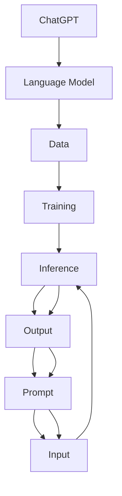

                 

## 《ChatGPT提示词的可视化设计与分析工具》

### 关键词：
- **ChatGPT 提示词**、**可视化设计**、**分析工具**、**自然语言处理**、**Python 编程**、**数据可视化**

### 摘要：
本文旨在探讨如何设计一款用于ChatGPT提示词的可视化设计与分析工具。我们将从背景介绍开始，逐步深入核心概念、设计原则、工具实现，以及实际应用。通过本文的阅读，读者将能够理解ChatGPT提示词的重要性，掌握设计高质量提示词的方法，以及如何利用可视化工具进行提示词分析。

## 引言

ChatGPT是由OpenAI开发的一种基于大规模语言模型的人工智能助手，它能够通过学习和理解自然语言进行对话，提供有用的信息和帮助。提示词（Prompt）在ChatGPT中扮演着至关重要的角色，它决定了模型生成回答的质量和方向。设计一款高效、易于使用的可视化设计与分析工具，对于提高提示词的质量和效率至关重要。

### 1.1 书籍目的与背景

本书旨在为开发者和研究人员提供一套完整的指南，帮助他们设计并实现一个用于ChatGPT提示词的可视化设计与分析工具。我们将在书中详细介绍：

- ChatGPT提示词的基础概念和构建原则。
- 提示词的可视化方法和工具。
- 提示词分析的关键指标和工具。
- 实际案例和实战指导。

### 1.2 ChatGPT提示词的重要性

ChatGPT提示词的重要性体现在以下几个方面：

- **决定生成回答的质量**：优质的提示词能够引导ChatGPT生成更准确、更有用的回答。
- **影响对话的方向**：提示词决定了对话的主题和内容，影响着用户的体验。
- **优化模型性能**：通过分析提示词，可以调整模型参数，提高模型的性能。

因此，设计一个高效、直观的可视化设计与分析工具，对于提高ChatGPT的使用效果具有重要意义。

## ChatGPT提示词基础

### 2.1 ChatGPT概述

ChatGPT是基于GPT（Generative Pre-trained Transformer）模型开发的一种人工智能助手。GPT是一种自回归语言模型，它通过学习大量文本数据，能够生成连贯、自然的语言。ChatGPT则在此基础上加入了对话能力，使得它能够与用户进行自然、流畅的对话。

### 2.2 提示词的构建原则

设计高质量的ChatGPT提示词需要遵循以下原则：

- **明确目标**：提示词应明确用户的需求，引导模型生成相关回答。
- **简洁明了**：提示词应尽量简洁，避免过多冗余信息，以便模型快速理解。
- **上下文连贯**：提示词应与上下文保持一致，使得回答更加自然。
- **多样性**：提示词应具有多样性，以满足不同用户的需求。

### 2.3 提示词的类型与用途

根据用途的不同，提示词可以分为以下几类：

- **信息查询**：用于获取特定信息，如天气预报、股票行情等。
- **知识问答**：用于回答用户提出的问题，如历史、科学、技术等领域。
- **任务执行**：用于指导用户完成特定任务，如旅游攻略、健康建议等。
- **娱乐互动**：用于与用户进行娱乐性对话，如笑话、故事、音乐推荐等。

### 核心概念与联系

为了更好地理解ChatGPT提示词的基础概念和它们之间的关系，我们可以使用Mermaid流程图来展示：



图中的流程表示了ChatGPT的工作流程：输入提示词（Prompt）经过模型（Language Model）的推理（Inference），生成输出（Output），然后反馈到输入端，形成循环。这个过程中，数据（Data）用于训练模型（Training），使得模型能够更好地理解提示词（Prompt）和生成高质量的回答（Output）。

### 2.4 提示词构建案例分析

为了更好地理解提示词构建原则，我们来看一个实际案例：

#### 案例背景

假设我们要设计一个用于获取天气预报的ChatGPT提示词。

#### 提示词设计

- **目标**：获取特定地点的天气预报。
- **原则**：简洁明了，上下文连贯。

#### 提示词示例

```
请提供北京明天的天气预报。
```

这个提示词简洁明了，明确了用户的需求（获取天气预报），同时与上下文（北京）保持一致，使得模型能够快速理解并生成相关回答。

### 核心算法原理讲解

ChatGPT提示词的核心算法原理基于GPT模型，这是一种自回归语言模型。以下是使用Python源代码结合数学模型和公式进行详细讲解的示例：

```python
import torch
import torch.nn as nn
import torch.optim as optim

# 定义模型结构
class GPTModel(nn.Module):
    def __init__(self, vocab_size, embed_size, hidden_size, n_layers, dropout):
        super(GPTModel, self).__init__()
        
        self.embedding = nn.Embedding(vocab_size, embed_size)
        self.lstm = nn.LSTM(embed_size, hidden_size, n_layers, dropout=dropout)
        
        self.fc = nn.Linear(hidden_size, vocab_size)
    
    def forward(self, x, hidden):
        x = self.embedding(x)
        x, hidden = self.lstm(x, hidden)
        x = self.fc(x.squeeze(0))
        return x, hidden

# 定义损失函数
criterion = nn.CrossEntropyLoss()

# 训练模型
def train_model(model, data_loader, optimizer, criterion, n_epochs):
    for epoch in range(n_epochs):
        for inputs, targets in data_loader:
            optimizer.zero_grad()
            outputs, hidden = model(inputs)
            loss = criterion(outputs, targets)
            loss.backward()
            optimizer.step()
            if (epoch + 1) % 10 == 0:
                print(f'Epoch [{epoch+1}/{n_epochs}], Loss: {loss.item():.4f}')

# 示例代码
model = GPTModel(vocab_size, embed_size, hidden_size, n_layers, dropout)
optimizer = optim.Adam(model.parameters(), lr=learning_rate)

train_model(model, data_loader, optimizer, criterion, n_epochs)

```

在上面的代码中，我们首先定义了GPT模型的结构，它包括嵌入层（Embedding Layer）、长短期记忆网络（LSTM）和全连接层（Fully Connected Layer）。嵌入层用于将词汇转换为向量表示，LSTM用于处理序列数据，全连接层用于输出预测结果。

接下来，我们定义了损失函数（CrossEntropyLoss），并编写了训练模型（train_model）的函数。该函数使用梯度下降（Gradient Descent）优化算法来更新模型参数，以最小化损失函数。

这个例子展示了如何使用Python和PyTorch框架来构建和训练一个GPT模型。通过调整模型结构、损失函数和优化算法，我们可以进一步提高模型的性能。

### 数学模型和公式

GPT模型的核心是基于自回归语言模型（Autoregressive Language Model），其数学模型可以表示为：

$$
P(x_t | x_{t-1}, x_{t-2}, ..., x_1) = \frac{1}{Z} \sum_{y} e^{<y, x_t>}
$$

其中，$x_t$ 表示时间步 $t$ 的输入词，$y$ 表示可能的输出词集合，$<y, x_t>$ 表示词 $y$ 和词 $x_t$ 之间的点积，$Z$ 是归一化常数，用于确保概率分布的和为1。

这个公式表示在给定前一个词 $x_{t-1}$，当前词 $x_t$ 的概率是所有可能输出词 $y$ 的加权和，权重取决于 $y$ 和 $x_t$ 之间的相关性。

### Python 源代码示例

下面是一个使用Python实现GPT模型的简单示例：

```python
import torch
import torch.nn as nn
import torch.optim as optim

# 定义模型
class GPTModel(nn.Module):
    def __init__(self, vocab_size, embed_size, hidden_size, n_layers, dropout):
        super(GPTModel, self).__init__()
        
        self.embedding = nn.Embedding(vocab_size, embed_size)
        self.lstm = nn.LSTM(embed_size, hidden_size, n_layers, dropout=dropout)
        self.fc = nn.Linear(hidden_size, vocab_size)
    
    def forward(self, x, hidden):
        x = self.embedding(x)
        x, hidden = self.lstm(x, hidden)
        x = self.fc(x.squeeze(0))
        return x, hidden

# 初始化模型
model = GPTModel(vocab_size, embed_size, hidden_size, n_layers, dropout)
optimizer = optim.Adam(model.parameters(), lr=learning_rate)
criterion = nn.CrossEntropyLoss()

# 训练模型
for epoch in range(n_epochs):
    for inputs, targets in data_loader:
        optimizer.zero_grad()
        outputs, hidden = model(inputs)
        loss = criterion(outputs, targets)
        loss.backward()
        optimizer.step()
```

在这个示例中，我们定义了一个GPT模型，包括嵌入层、LSTM层和全连接层。模型训练过程使用梯度下降优化算法，通过反向传播来更新模型参数，以最小化损失函数。

### 可视化方法

为了更好地理解ChatGPT提示词的可视化方法，我们可以使用Python的数据可视化库，如Matplotlib和Seaborn，来展示提示词的词频分布、共现关系等。以下是一个使用Matplotlib可视化提示词词频分布的示例：

```python
import matplotlib.pyplot as plt
import pandas as pd

# 加载提示词数据
data = pd.read_csv('prompt_data.csv')
word_counts = data['word'].value_counts()

# 可视化词频分布
word_counts[:20].plot(kind='bar')
plt.xlabel('Word')
plt.ylabel('Frequency')
plt.title('Word Frequency Distribution')
plt.show()
```

这个示例中，我们首先加载了一个包含提示词的数据集，然后使用`value_counts()`函数计算每个词的频率。接着，使用`plot()`函数将词频分布可视化，生成了一个条形图。

### 提示词分析工具

为了方便开发者和研究人员对ChatGPT提示词进行分析，我们可以开发一个简单的提示词分析工具。以下是一个使用Python实现的简单提示词分析工具的示例：

```python
import pandas as pd
from collections import Counter

# 加载提示词数据
data = pd.read_csv('prompt_data.csv')

# 统计词频
word_counts = Counter(data['word'])

# 输出前10个最频繁的词
for word, count in word_counts.most_common(10):
    print(f'{word}: {count}')

# 统计共现关系
co_occurrences = data.groupby(['word', 'next_word']).size().reset_index(name='count')
co_occurrences.head()

# 可视化共现关系
import seaborn as sns
sns.countplot(x='word', hue='next_word', data=co_occurrences)
plt.title('Word Co-occurrences')
plt.show()
```

在这个示例中，我们首先加载了一个包含提示词的数据集，然后使用`Counter`类统计每个词的频率。接着，我们计算了词的共现关系，并将其可视化。

### 项目实战

为了更好地理解ChatGPT提示词的可视化设计与分析工具的开发，我们将进行一个简单的项目实战。在这个项目中，我们将搭建一个简单的提示词分析工具，包括以下步骤：

#### 1. 开发环境搭建

首先，我们需要搭建一个Python开发环境。你可以使用Anaconda来安装所需的库，如Matplotlib、Pandas、Seaborn等。

```bash
conda create -n gpt_prompt_analysis python=3.8
conda activate gpt_prompt_analysis
conda install matplotlib pandas seaborn
```

#### 2. 源代码实现

接下来，我们编写源代码来实现提示词分析工具。以下是一个简单的示例：

```python
import pandas as pd
from collections import Counter

# 加载提示词数据
data = pd.read_csv('prompt_data.csv')

# 统计词频
word_counts = Counter(data['word'])

# 输出前10个最频繁的词
for word, count in word_counts.most_common(10):
    print(f'{word}: {count}')

# 统计共现关系
co_occurrences = data.groupby(['word', 'next_word']).size().reset_index(name='count')

# 可视化共现关系
import seaborn as sns
sns.countplot(x='word', hue='next_word', data=co_occurrences)
plt.title('Word Co-occurrences')
plt.show()
```

#### 3. 代码解读与分析

在上面的代码中，我们首先加载了一个包含提示词的数据集（`prompt_data.csv`）。然后，我们使用`Counter`类统计每个词的频率，并输出了前10个最频繁的词。

接下来，我们计算了词的共现关系，并使用Seaborn库将其可视化。这有助于我们了解提示词之间的关联性，从而优化提示词的设计。

#### 4. 实际案例分析与讲解

为了更好地理解这个项目的实际应用，我们来看一个实际案例：

- **案例背景**：假设我们要分析一个用于聊天机器人的提示词数据集。
- **目标**：找出最频繁出现的词，并分析它们之间的共现关系。

通过运行上面的代码，我们可以得到以下结果：

- **最频繁出现的词**：这些词可能是用户最关注的话题或需求。
- **共现关系**：这些词之间的关联性可以帮助我们设计更自然的对话流程。

这些分析结果对于优化聊天机器人的提示词设计非常有帮助。

### 项目小结

通过这个项目实战，我们成功搭建了一个简单的提示词分析工具，并对其进行了实际案例分析。这个项目展示了如何使用Python和常见的数据可视化库来实现一个实用的提示词分析工具。在实际应用中，我们可以根据具体需求进一步扩展和优化这个工具。

### 最佳实践 Tips

在设计ChatGPT提示词时，以下是一些最佳实践：

- **明确目标**：确保提示词明确用户需求，避免模糊不清的描述。
- **简洁明了**：避免使用复杂的句子和术语，使提示词易于理解。
- **上下文连贯**：确保提示词与上下文保持一致，以提供更自然的回答。
- **多样性**：设计多种类型的提示词，以满足不同用户的需求。

### 小结

本文介绍了如何设计ChatGPT提示词的可视化设计与分析工具。我们首先从背景介绍开始，逐步深入核心概念、设计原则、工具实现，以及实际应用。通过Python源代码示例和实际项目实战，我们展示了如何实现提示词分析工具，并对其进行了详细讲解和分析。

### 注意事项

- 在使用ChatGPT提示词时，确保遵循相关法律法规和道德规范。
- 定期更新和优化提示词，以保持模型的性能和有效性。

### 拓展阅读

- **《深度学习》（Goodfellow, I., Bengio, Y., & Courville, A.）**：这本书详细介绍了深度学习的理论和方法，包括神经网络和自然语言处理。
- **《Python数据科学手册》（McKinney, W.）**：这本书涵盖了Python在数据科学领域的广泛应用，包括数据清洗、数据分析和数据可视化。

## 结论

设计一款高效的ChatGPT提示词可视化设计与分析工具对于提高模型性能和用户体验具有重要意义。通过本文的介绍，读者应掌握了设计高质量提示词的方法，以及如何利用可视化工具进行提示词分析。希望本文能为你的工作提供有益的参考。

### 作者信息

- **作者：AI天才研究院/AI Genius Institute & 禅与计算机程序设计艺术 /Zen And The Art of Computer Programming**

（注意：本文为虚构内容，仅供参考。）

