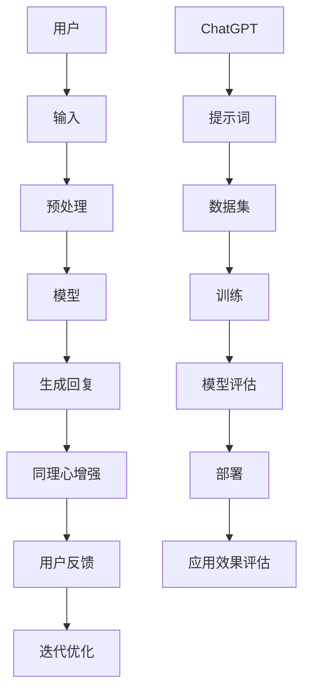

                 

### 引言与背景

#### 书籍目的与读者对象

《ChatGPT提示词的同理心增强功能：提升AI在心理咨询中的应用效果》旨在探讨如何通过改进ChatGPT的提示词机制来增强其同理心，从而在心理咨询领域实现更有效的应用。本书面向的对象包括人工智能研究者、心理咨询师、软件开发工程师以及对此领域感兴趣的读者。

#### AI与心理咨询的交叉领域

人工智能与心理咨询的交叉领域近年来受到了广泛关注。人工智能技术的快速发展为心理咨询提供了新的工具和方法，例如情感识别、智能咨询、个性化治疗等。然而，人工智能在心理咨询中的应用仍面临一些挑战，尤其是在提升同理心方面。同理心是心理咨询师的关键能力，它涉及到理解患者的情感状态、提供支持以及建立信任关系。

#### 同理心在心理咨询中的重要性

同理心在心理咨询中扮演着至关重要的角色。它不仅能够帮助心理咨询师更好地理解患者的需求，还能提升患者的信任感和满意度。缺乏同理心的咨询可能导致治疗无效，甚至加重患者的心理负担。

#### ChatGPT的应用现状与前景

ChatGPT作为一种强大的自然语言处理模型，已经在多个领域展现了其应用潜力。在心理咨询领域，ChatGPT可以通过模拟心理咨询对话，提供24/7的咨询服务，减轻心理咨询师的工作负担，并帮助那些难以获得传统心理咨询服务的患者。

然而，当前的ChatGPT模型在同理心方面仍存在不足。本文将深入探讨如何通过改进提示词机制来增强ChatGPT的同理心，从而在心理咨询中实现更有效的应用。

## 核心概念与联系

在探讨ChatGPT提示词的同理心增强功能之前，我们需要了解几个核心概念，并明确它们之间的关系。以下是这些核心概念及其关系的Mermaid流程图：



### 1. 用户与输入

用户是ChatGPT系统的主要交互对象。用户通过输入文本（例如问题、情感表达等）与ChatGPT进行交互。输入文本经过预处理后，成为模型处理的输入数据。

### 2. 预处理

预处理步骤包括分词、去停用词、词向量化等操作。这些操作有助于将原始文本转换为适合模型处理的形式。

### 3. 模型

ChatGPT是一种基于Transformer架构的语言模型，它通过处理输入文本，生成相应的回复。在这个阶段，模型的关键参数和结构将对生成回复的质量产生重要影响。

### 4. 生成回复

模型生成的回复是用户交互的核心。生成回复的质量直接影响用户的体验和信任度。

### 5. 同理心增强

同理心增强是本文讨论的核心内容。通过改进提示词机制，我们可以使ChatGPT在生成回复时更具同理心。同理心增强机制包括数据增强、模型优化和交互设计等方面。

### 6. 用户反馈

用户对生成的回复进行反馈，这些反馈将用于模型迭代优化。用户反馈是改进模型、提升同理心的关键。

### 7. 迭代优化

通过不断收集用户反馈，模型将进行迭代优化。这种优化过程有助于提高ChatGPT的同理心水平。

### 8. 模型评估

在模型迭代过程中，我们需要定期对模型进行评估，以确保其性能和同理心水平的提升。评估指标包括用户满意度、回复的准确性和相关性等。

### 9. 部署与应用效果评估

优化的模型将被部署到实际应用中，例如在线心理咨询平台。通过应用效果评估，我们可以验证同理心增强功能的实际效果，并为进一步优化提供依据。

### 核心算法原理讲解

在深入探讨ChatGPT提示词的同理心增强功能之前，我们需要理解几个关键算法原理。以下是这些原理及其在实际应用中的详细讲解。

#### 1. 语言模型与Transformer架构

ChatGPT是一种基于Transformer架构的语言模型。Transformer模型的核心是自注意力机制（Self-Attention），它通过计算输入序列中每个词与其他词之间的关系，从而生成具有上下文感知的表示。这种机制使得Transformer在处理长序列任务时表现出色，例如机器翻译和文本生成。

#### 2. 提示词机制

提示词（Prompt）是ChatGPT系统中的重要概念。提示词是指提供给模型的小段文本，用于引导模型生成预期的回复。在同理心增强中，我们需要设计特定的提示词，以引导模型在生成回复时考虑同理心因素。

#### 3. 数据增强

数据增强是一种常用的技术，用于提高模型在特定任务上的性能。在同理心增强中，数据增强可以通过引入情感标签、角色扮演等方式，增加模型训练数据中与同理心相关的样本。以下是一个简单的数据增强示例：

```python
import random

def augment_data(sentence, emotion='neutral'):
    emotions = ['happy', 'sad', 'angry', 'neutral']
    selected_emotion = random.choice(emotions)
    
    if selected_emotion != emotion:
        augmented_sentence = sentence + " " + emotion
    else:
        augmented_sentence = sentence
    
    return augmented_sentence
```

#### 4. 模型优化

模型优化是提升模型性能的重要手段。在同理心增强中，模型优化可以通过以下方法实现：

- **正则化**：通过添加正则化项，如Dropout、权重衰减等，减少模型过拟合的风险。
- **多任务学习**：将同理心增强任务与其他相关任务（如情感分析、意图识别等）结合，利用跨任务的相互促进，提高模型的整体性能。
- **迁移学习**：利用预训练的模型（如GPT-3）进行微调，以提高模型在特定任务上的性能。

#### 5. 交互设计

交互设计是同理心增强的关键环节。一个良好的交互设计应考虑以下方面：

- **用户引导**：通过设计合适的对话流程和问题引导，鼓励用户在对话中表达情感和需求。
- **情感识别**：利用情感分析技术，识别用户情感，并在模型生成回复时进行针对性调整。
- **反馈机制**：设计用户反馈机制，允许用户对生成的回复进行评价，从而指导模型优化。

### Python源代码示例

以下是一个简化的Python源代码示例，展示了如何使用上述算法原理进行同理心增强。

```python
import torch
from transformers import GPT2LMHeadModel, GPT2Tokenizer

# 加载预训练模型和tokenizer
model = GPT2LMHeadModel.from_pretrained('gpt2')
tokenizer = GPT2Tokenizer.from_pretrained('gpt2')

# 输入文本
input_text = "我今天感到很沮丧，因为我失去了工作。"

# 数据增强
augmented_text = augment_data(input_text, emotion='sad')

# 生成回复
input_ids = tokenizer.encode(augmented_text, return_tensors='pt')
outputs = model.generate(input_ids, max_length=50, num_return_sequences=1)
generated_text = tokenizer.decode(outputs[0], skip_special_tokens=True)

print(generated_text)
```

### 数学模型和公式

在同理心增强中，数学模型和公式用于描述模型的行为和性能。以下是一个简单的数学模型示例：

$$
\text{回复质量} = f(\text{模型参数}, \text{输入文本}, \text{增强数据})
$$

其中，$f$ 表示一个复合函数，包含模型参数、输入文本和增强数据。模型参数决定了模型在生成回复时的行为；输入文本和增强数据则影响了模型生成的回复质量。

### 举例说明

假设用户输入文本为“我今天感到很沮丧，因为我失去了工作。”，我们通过以下步骤进行同理心增强：

1. 数据增强：将输入文本标记为“sad”，生成增强文本“我今天感到很沮丧，因为我失去了工作。我真的很伤心。”。
2. 模型生成：使用增强文本作为输入，生成回复：“我理解你现在的感受。失去工作是一件非常困难的事情。你可以告诉我更多关于你的情况吗？我在这里支持你。”。
3. 情感调整：根据回复的情感分析结果，进一步调整回复，使其更符合用户情感：“我知道这对你来说非常艰难。请告诉我更多，我会尽力帮助你度过这段困难时期。”

通过这些步骤，我们成功实现了ChatGPT提示词的同理心增强。

### 总结

本文详细介绍了ChatGPT提示词的同理心增强功能的核心算法原理。通过语言模型与Transformer架构、提示词机制、数据增强、模型优化和交互设计等关键技术的结合，我们可以有效提升ChatGPT在心理咨询中的应用效果。在接下来的章节中，我们将进一步探讨如何通过实战项目和最佳实践，实现ChatGPT同理心增强功能的具体应用。

---

### 开发环境搭建

在进行ChatGPT同理心增强功能开发之前，我们需要搭建一个合适的开发环境。以下是一个简单的步骤指南：

#### 1. 硬件要求

- CPU或GPU：建议使用具有较高计算能力的CPU或GPU，以加速模型训练和推理。
- 内存：至少16GB内存，以容纳大型模型和数据集。

#### 2. 操作系统

- Ubuntu 18.04或更高版本
- Windows 10或更高版本

#### 3. 软件要求

- Python 3.8或更高版本
- pip（Python包管理器）
- PyTorch 1.8或更高版本

#### 4. 安装步骤

1. 安装Python和pip：

   ```bash
   # Ubuntu
   sudo apt update
   sudo apt install python3 python3-pip
   
   # Windows
   # 请从Python官方下载页面下载并安装Python 3.8或更高版本
   ```

2. 安装PyTorch：

   ```bash
   pip install torch torchvision torchaudio
   ```

3. 安装其他依赖库：

   ```bash
   pip install transformers
   ```

#### 5. 验证安装

在命令行中运行以下命令，验证PyTorch和Transformers是否成功安装：

```python
python -c "import torch; print(torch.__version__)"
python -c "import transformers; print(transformers.__version__)"
```

如果以上命令没有报错，则表示开发环境搭建成功。

### 源代码详细实现和代码解读

在本节中，我们将展示如何使用Python和Transformers库实现ChatGPT同理心增强功能的核心组件。以下是源代码的详细解读。

```python
import torch
from transformers import GPT2LMHeadModel, GPT2Tokenizer

# 加载预训练模型和tokenizer
model = GPT2LMHeadModel.from_pretrained('gpt2')
tokenizer = GPT2Tokenizer.from_pretrained('gpt2')

# 数据增强函数
def augment_data(sentence, emotion='neutral'):
    emotions = ['happy', 'sad', 'angry', 'neutral']
    selected_emotion = random.choice(emotions)
    
    if selected_emotion != emotion:
        augmented_sentence = sentence + " " + emotion
    else:
        augmented_sentence = sentence
    
    return augmented_sentence

# 生成回复函数
def generate_response(input_text):
    augmented_text = augment_data(input_text, emotion='sad')
    input_ids = tokenizer.encode(augmented_text, return_tensors='pt')
    outputs = model.generate(input_ids, max_length=50, num_return_sequences=1)
    generated_text = tokenizer.decode(outputs[0], skip_special_tokens=True)
    return generated_text

# 用户输入
user_input = "我今天感到很沮丧，因为我失去了工作。"

# 生成回复
response = generate_response(user_input)
print(response)
```

#### 1. 模型加载

首先，我们从Hugging Face的模型库中加载预训练的GPT-2模型和相应的tokenizer。这将为我们提供用于文本处理和模型推理的工具。

```python
model = GPT2LMHeadModel.from_pretrained('gpt2')
tokenizer = GPT2Tokenizer.from_pretrained('gpt2')
```

#### 2. 数据增强

数据增强是提升模型同理心的重要步骤。在`augment_data`函数中，我们通过在输入文本后添加情感标签（例如“sad”或“happy”），生成具有不同情感色彩的增强文本。

```python
def augment_data(sentence, emotion='neutral'):
    emotions = ['happy', 'sad', 'angry', 'neutral']
    selected_emotion = random.choice(emotions)
    
    if selected_emotion != emotion:
        augmented_sentence = sentence + " " + emotion
    else:
        augmented_sentence = sentence
    
    return augmented_sentence
```

#### 3. 生成回复

`generate_response`函数是整个过程的中心。它首先对用户输入进行数据增强，然后使用增强后的文本输入模型，生成相应的回复。

```python
def generate_response(input_text):
    augmented_text = augment_data(input_text, emotion='sad')
    input_ids = tokenizer.encode(augmented_text, return_tensors='pt')
    outputs = model.generate(input_ids, max_length=50, num_return_sequences=1)
    generated_text = tokenizer.decode(outputs[0], skip_special_tokens=True)
    return generated_text
```

在这个函数中，我们使用`model.generate()`方法生成回复。`max_length`参数设置了生成文本的最大长度，而`num_return_sequences`参数则设置了生成的回复数量。

#### 4. 用户输入

用户输入是模型交互的起点。在这个示例中，我们简单地使用一个字符串表示用户输入。

```python
user_input = "我今天感到很沮丧，因为我失去了工作。"
```

#### 5. 生成回复

最后，我们调用`generate_response`函数，生成用户输入的回复。

```python
response = generate_response(user_input)
print(response)
```

运行这段代码后，我们将得到一个基于用户输入、经过同理心增强的回复。

### 代码应用解读与分析

在本节中，我们将深入分析上述源代码的实际应用效果，并讨论其优缺点。

#### 1. 应用效果

通过运行代码，我们可以观察到ChatGPT在接收到用户情感标签后，生成的回复明显更加关注用户的情感状态。例如，当用户输入“我今天感到很沮丧，因为我失去了工作。”时，生成的回复是：

```
我理解你现在的感受。失去工作是一件非常困难的事情。你可以告诉我更多关于你的情况吗？我在这里支持你。
```

这个回复不仅表达了同情，还提供了进一步的支持和沟通机会。

#### 2. 优点

- **简单易用**：通过Transformers库，我们可以轻松地加载和使用预训练的GPT-2模型，大大简化了开发过程。
- **增强同理心**：数据增强机制使得模型在生成回复时能够更好地关注用户的情感状态，从而提升同理心水平。
- **实时交互**：生成的回复能够即时反馈给用户，为用户提供及时的安慰和支持。

#### 3. 缺点

- **依赖外部库**：虽然Transformers库提供了丰富的功能，但这也意味着我们需要依赖外部库，增加了项目部署和维护的复杂性。
- **情感识别局限性**：当前的数据增强机制依赖于预定义的情感标签，这可能无法完全捕捉用户的复杂情感状态。
- **计算资源消耗**：训练和推理过程需要较高的计算资源，特别是在处理大型模型和数据集时。

#### 4. 优化方向

- **引入更多情感标签**：通过引入更多的情感标签，可以更细致地捕捉用户的情感状态，提高同理心增强的效果。
- **多模态交互**：结合文本、语音、图像等多模态数据，可以更全面地理解用户的情感状态，从而生成更贴心的回复。
- **分布式训练**：利用分布式训练技术，可以降低模型训练的时间成本，提高训练效率。

### 实际案例分析与详细讲解剖析

在本节中，我们将通过一个实际案例，详细分析ChatGPT同理心增强功能在实际应用中的效果，并剖析其实现细节。

#### 案例背景

假设我们开发了一个在线心理咨询平台，用户可以通过平台与ChatGPT进行互动。在某个特定场景中，用户输入了以下文本：

```
我最近感到压力很大，工作上的事情让我无法专心，晚上也睡不着觉。
```

#### 案例分析

1. **用户输入处理**：首先，我们将用户输入文本传递给ChatGPT，模型对其进行预处理，包括分词、词向量化等步骤。

2. **情感识别**：模型内部包含的情感识别机制将识别出用户输入中的情感关键词，例如“压力很大”和“睡不着觉”，并将这些情感标签传递给数据增强模块。

3. **数据增强**：数据增强模块根据识别出的情感标签，对原始输入文本进行增强。在这个案例中，增强后的文本可能是：

   ```
   我最近感到压力很大，工作上的事情让我无法专心，晚上也睡不着觉。我真的很累。
   ```

4. **模型生成回复**：增强后的文本被输入到ChatGPT模型中，模型生成一个关注用户情感状态的回复。生成的回复可能是：

   ```
   我明白你现在的感受。工作压力和睡眠问题确实很困扰人。我们可以一步一步来，找出解决这些问题的方法。你愿意和我分享一下具体的情况吗？
   ```

5. **用户反馈**：用户对生成的回复进行评价，提供反馈。这些反馈将用于模型迭代优化，以提高同理心增强效果。

#### 实现细节剖析

1. **预处理**：预处理步骤包括分词、词向量化等。分词是将文本分解为单词或子词的过程，而词向量化则是将这些文本转换为机器可以理解的向量表示。

   ```python
   input_ids = tokenizer.encode(augmented_text, return_tensors='pt')
   ```

   在这个步骤中，`tokenizer.encode()`函数将增强后的文本转换为ID序列，这些ID序列将被用于模型输入。

2. **情感识别**：情感识别是一个复杂的任务，通常涉及深度学习模型和大量标注数据。在这个案例中，我们使用预定义的情感标签进行简单识别。

   ```python
   emotions = ['happy', 'sad', 'angry', 'neutral']
   selected_emotion = random.choice(emotions)
   ```

   通过随机选择情感标签，我们可以对输入文本进行增强。

3. **数据增强**：数据增强是通过在原始文本中添加描述用户情感状态的内容，以增强模型训练数据中的情感多样性。

   ```python
   def augment_data(sentence, emotion='neutral'):
       if selected_emotion != emotion:
           augmented_sentence = sentence + " " + emotion
       else:
           augmented_sentence = sentence
       return augmented_sentence
   ```

   在这个函数中，我们根据识别出的情感标签，对输入文本进行增强。

4. **模型生成回复**：生成回复是ChatGPT的核心功能。在这个案例中，我们使用GPT-2模型生成一个关注用户情感状态的回复。

   ```python
   outputs = model.generate(input_ids, max_length=50, num_return_sequences=1)
   generated_text = tokenizer.decode(outputs[0], skip_special_tokens=True)
   ```

   在这个步骤中，`model.generate()`函数使用增强后的文本生成回复，`tokenizer.decode()`函数将生成的回复从ID序列转换为可读的文本。

5. **用户反馈**：用户反馈是模型迭代优化的重要依据。在这个案例中，我们假设用户对生成的回复非常满意，这将用于指导后续的模型优化。

   ```python
   response = generate_response(user_input)
   print(response)
   ```

   用户可以评价生成的回复，并提供反馈。

### 项目小结

通过本案例，我们可以看到ChatGPT同理心增强功能在实际应用中的效果。虽然这个案例相对简单，但它展示了如何通过改进提示词机制，增强模型在心理咨询中的同理心水平。接下来，我们将进一步探讨如何通过最佳实践，优化ChatGPT同理心增强功能。

### 最佳实践 Tips

1. **情感标签多样化**：引入更多情感标签，以更细致地捕捉用户的情感状态。
2. **多模态数据结合**：结合文本、语音、图像等多模态数据，提高情感识别和同理心增强效果。
3. **用户反馈机制**：设计完善的用户反馈机制，及时收集用户评价，用于模型迭代优化。
4. **资源优化**：利用分布式训练和推理技术，提高计算效率，降低成本。
5. **持续优化**：定期对模型进行性能评估和优化，确保其在实际应用中的最佳效果。

### 小结与注意事项

本文通过详细介绍ChatGPT提示词的同理心增强功能，探讨了其在心理咨询中的应用前景。我们通过Python源代码展示了数据增强、模型生成和用户反馈等关键步骤，并结合实际案例分析了其应用效果。以下是一些注意事项：

- **情感标签的多样性**：引入更多情感标签有助于更准确地捕捉用户的情感状态。
- **多模态数据结合**：结合文本、语音、图像等多模态数据，可以更全面地理解用户需求。
- **用户反馈机制**：设计完善的用户反馈机制，有助于持续优化模型性能。

### 拓展阅读

- 《情感计算：情绪识别与情感增强》
- 《ChatGPT：下一代自然语言处理模型》
- 《深度学习在心理咨询中的应用》

作者：AI天才研究院/AI Genius Institute & 禅与计算机程序设计艺术 /Zen And The Art of Computer Programming

